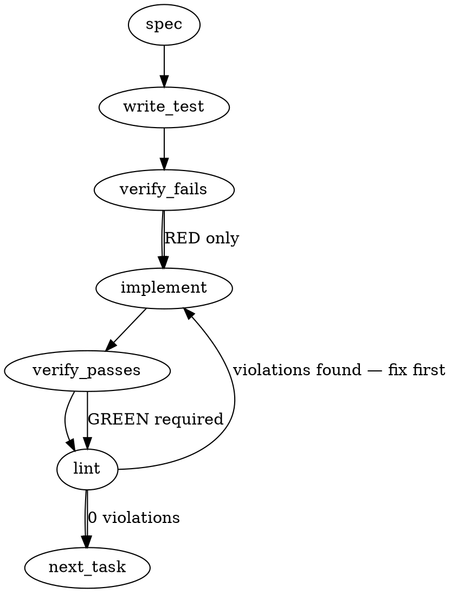

### Problem Statement

The `OrchestratorInvokeOptions` interface and its CLI wrapper `runOrchestrator` are currently too thin (prompt-in/string-out), lacking the necessary metadata to support advanced routing, capability floors, and structured telemetry. The contract must be additively enriched with properties for `task`, `groundingBundle`, `backendAdmissionClass`, `contextPolicy`, `outputContract`, and `runMetadata` without breaking existing callers or enforcing these contracts at the provider level.

### Architectural Context

- **Capability-Floor Arbitration:** As dictated by #474, these new fields gate _admission_ (whether a backend is allowed to handle the request), while evaluations gate _graduation_.
- **Enforcement is Caller-Side:** Providers (like `shell`) act purely as transport layers. Totem is not zero-user, so we must not assume backend cooperation for output enforcement. Enforcement must happen post-invocation by the caller.
- **Strictly Additive:** We must mirror the precedent of PR #1291 (which threaded system prompts/caching additively) by keeping all new properties optional. Zero modifications to the 10+ existing `runOrchestrator` callers are permitted in this slice.

### Files to Examine

1. `packages/cli/src/orchestrators/orchestrator.ts` — Core definition of `OrchestratorInvokeOptions`. This is where the new types will live.
2. `packages/cli/src/utils.ts` — Contains the `runOrchestrator` CLI wrapper that passes these options to the underlying providers.
3. `packages/cli/src/orchestrators/__tests__/orchestrator.spec.ts` (or equivalent test file) — To verify additive compatibility and provider transport.

### Technical Approach & Contracts

We will define specific structural interfaces for the new metadata fields to avoid `Record<string, any>` soup, then add them as optional fields to `OrchestratorInvokeOptions`.

**Data Contracts to Add/Update (`packages/cli/src/orchestrators/orchestrator.ts`):**

```typescript
export type BackendAdmissionClass = 'completion_only' | 'self_grounding_agent';

export interface ContextPolicy {
  strategy?: string;
  budget?: number;
  [key: string]: unknown; // Extensible for future policies
}

export interface OutputContract {
  citationsRequired?: boolean;
  verifyRequired?: boolean;
  schema?: Record<string, unknown>; // JSON Schema definition for structured output
  [key: string]: unknown;
}

export interface RunMetadata {
  caller?: string;
  [key: string]: unknown; // Align with #2100 runMetadata target
}

// Extends existing interface
export interface OrchestratorInvokeOptions {
  // ... existing fields (prompt, systemPrompt, etc.) ...

  // --- New Admission Contract Fields (All Optional) ---
  task?: string;
  groundingBundle?: Record<string, unknown>; // Will be refined by Slice 2 schema
  backendAdmissionClass?: BackendAdmissionClass;
  contextPolicy?: ContextPolicy;
  outputContract?: OutputContract;
  runMetadata?: RunMetadata;
}
```

The `runOrchestrator` utility in `packages/cli/src/utils.ts` will simply pass these newly typed options through to the instantiated orchestrator. No implementation logic is needed inside the providers (e.g., `shell`, `openai`, `anthropic`), as they just transport the payload.

> **Post-ship correction note (PR #2148 review round):** the shipped shapes diverge from the generated block above — `verifyRequired` shipped as **`verifyFallback`**; `OutputContract`, `ContextPolicy`, and `RunMetadata` shipped **closed** (no index signatures); `ContextPolicy` shipped as `{ budget?: number }` only (no `strategy`). The `## Implementation Design` section below is authoritative; one source of truth is `packages/core/src/artifacts/schema.ts`.

### Edge Cases & Traps

- **Trap:** Rest-spreading options in providers that perform strict key validation. If a provider explicitly throws on unknown keys in the configuration object, adding these fields to `runOrchestrator` might cause regressions. _Mitigation:_ Ensure `runOrchestrator` strips non-provider fields before passing the payload to external vendor SDKs, OR ensure internal wrapper classes safely ignore them.
- **Race Conditions:** None anticipated for pure interface extensions, provided state mutations are avoided.
- **Architectural Regression:** Attempting to validate `outputContract` inside the Orchestrator classes. _Do not do this._ Providers transport; callers enforce.
- **Mandatory Field Bleed:** If _any_ of the new types require a mandatory sub-field, and a caller tries to partially initialize it, TypeScript will complain. Ensure deep optionality or handle defaults gracefully if partials are passed.
- **(Post-ship addition) Ambiguous grounding identity:** supplying BOTH `groundingBundle` and `artifact.bundle` with mismatched deterministic hashes is a HARD error — see the Implementation Design data-model row and Failure Modes table.

### Implementation Tasks

_All three tasks shipped in PR #2148 (merged 2026-06-10); boxes ticked post-merge — this file is the record, not a queue._

- [x] **Task 1: Define Admission Contract Types**
  - **Files:** `packages/cli/src/orchestrators/orchestrator.ts`
  - **Action:** Define `BackendAdmissionClass`, `ContextPolicy`, `OutputContract`, and `RunMetadata` interfaces as specified in the Technical Approach. Update `OrchestratorInvokeOptions` to include these as optional fields.
  - **Action:** Define a placeholder type `type GroundingBundle = Record<string, unknown>;` to fulfill the slice 2 dependency temporarily.
  - write test → verify fails → implement → verify passes → lint

- [x] **Task 2: Transport Contract in CLI Wrapper**
  - **Files:** `packages/cli/src/utils.ts`, `packages/cli/src/__tests__/utils.spec.ts`
  - > TEST DIRECTIVE: Before implementing, write a failing test named `runOrchestrator preserves and transports new admission contract fields transparently` that creates a mock orchestrator and asserts the new fields are passed through without mutation.
  - **Action:** Update the `runOrchestrator` signature if it explicitly destructured options. If it takes the whole `options` object, verify TypeScript compiles and the interface changes naturally flow through.
  - **Action:** Ensure default behavior (omitting all new fields) results in identical runtime objects being passed to providers.
  - write test → verify fails → implement → verify passes → lint

- [x] **Task 3: Prevent Provider Strict-Key Regressions**
  - **Files:** `packages/cli/src/orchestrators/shell.ts` (and other provider implementations if they destructure or validate options), tests.
  - > TEST DIRECTIVE: Before implementing, write a failing test named `shell provider ignores metadata fields without failing strict key checks` using dummy values for the new contract fields.
  - **Action:** Inspect how providers consume `OrchestratorInvokeOptions`. If they pass the raw options object directly to an external SDK (e.g., passing Totem's options directly to OpenAI's SDK), filter out the new Totem-specific metadata fields (`task`, `groundingBundle`, etc.) before invoking the vendor SDK to prevent "Unrecognized parameter" errors.
  - write test → verify fails → implement → verify passes → lint

### Execution Flow (structural constraint)



### Verification (MANDATORY — do not skip)

Every implementation MUST end with these steps:

1. `totem lint` — deterministic rule check (zero LLM, ~2s). Fixes any violations.
2. `totem review` — AI-powered architectural review (~18s). Addresses any critical findings.
3. If using MCP, call `verify_execution` to confirm compliance before declaring the task done.

### Test Plan

- **Additive Contract Test:** Call `runOrchestrator` using only the legacy properties (`prompt`, `model`) and assert the options passed to the mocked provider are strictly the legacy properties.
- **Full Contract Test:** Call `runOrchestrator` with fully hydrated `backendAdmissionClass`, `contextPolicy`, `outputContract`, etc., and assert the provider receives them intact.
- **Provider Isolation Test:** Test the `shell` and at least one remote provider mock to ensure sending Totem-specific metadata keys (`groundingBundle`, `task`) does not cause the underlying shell execution or API payload construction to crash or send invalid CLI flags.

## Implementation Design

> Corrections to the generated spec above, against code reality (2026-06-10): a real
> `GroundingBundle` type already shipped in #2101 (`utils.ts` / core `artifacts/`) — no
> placeholder type is needed; and `runOrchestrator` already records
> `backend.admissionClass` into run artifacts via the slice-1 constant
> `ADMISSION_COMPLETION_ONLY` (`core/src/artifacts/schema.ts:78`), with the enum
> `['completion_only', 'self_grounding_agent']` already locked in `BackendSchema`
> (`schema.ts:159`). This slice changes WHO SUPPLIES that value, plus the contract
> fields around it. Further corrections vs the generated block (PR #2157 review round):
> `verifyRequired` → **`verifyFallback`** (the shipped name, `schema.ts:196`); all three
> contract interfaces shipped **closed** (no index signatures); `ContextPolicy` narrowed
> to `{ budget?: number }` (no `strategy` — `schema.ts:206`). Where the two sections
> disagree, this one is authoritative.

### Scope

Additively enrich both seams — `OrchestratorInvokeOptions` (provider seam, transport only) and `runOrchestrator` (CLI seam, where admission is decided) — with the adopted contract fields, gate admission against a declared capability contract in config (fail loud pre-invoke), record the admitted contract in the run artifact, and migrate the two artifact-emitting callers (`spec.ts:393`, `shield.ts:1379`). Explicitly NOT: any `outputContract`/`contextPolicy` enforcement (caller-side post-checks are #2103), panel orchestration (#2104), eval-based graduation, provider behavior changes, or touching the other 8+ `runOrchestrator` callers.

### Data model deltas

All new types live in **core** (`packages/core/src/artifacts/schema.ts`) as Zod schemas + inferred types; the CLI imports them. One source of truth — a parallel CLI definition is the drift vector the #1429 model-validation review already named.

| Delta                                                                                                 | What / who writes / who reads / invariants                                                                                                                                                                                                                                                                                                                                                                                                                                                                                                                                                                                                                                                            |
| ----------------------------------------------------------------------------------------------------- | ----------------------------------------------------------------------------------------------------------------------------------------------------------------------------------------------------------------------------------------------------------------------------------------------------------------------------------------------------------------------------------------------------------------------------------------------------------------------------------------------------------------------------------------------------------------------------------------------------------------------------------------------------------------------------------------------------- |
| `BackendAdmissionClass` (exported type) + `ADMISSION_SELF_GROUNDING_AGENT` const                      | Inferred from the existing `BackendSchema` enum. Callers write; admission gate + artifact read. Closed two-value enum this slice.                                                                                                                                                                                                                                                                                                                                                                                                                                                                                                                                                                     |
| `OutputContract`                                                                                      | `{ citationsRequired?: boolean; verifyFallback?: boolean; schema?: Record<string, unknown> }` — the citations-or-`VERIFY:` declaration. Callers write; #2103 post-checks read; providers transport, never enforce. Closed interface (no index signature — extensible by additive fields, not key soup).                                                                                                                                                                                                                                                                                                                                                                                               |
| `ContextPolicy`                                                                                       | `{ budget?: number }` (advisory input budget, **unit: input tokens; validated `int().positive()` in core schema** — declared-not-enforced must not mean accepting nonsense, codex Q2). Recorded for honesty.                                                                                                                                                                                                                                                                                                                                                                                                                                                                                          |
| `RunMetadata`                                                                                         | `{ caller?: string; command?: string }` — recorded verbatim into the artifact (the #2100 runMetadata target).                                                                                                                                                                                                                                                                                                                                                                                                                                                                                                                                                                                         |
| `OrchestratorInvokeOptions` additive fields                                                           | The full adopted list: `task?`, `groundingBundle?`, `backendAdmissionClass?`, `contextPolicy?`, `outputContract?`, `runMetadata?`. Providers destructure only what they understand (all vendor payloads are explicitly constructed); no provider reads any of them this slice.                                                                                                                                                                                                                                                                                                                                                                                                                        |
| `runOrchestrator` opts additive fields                                                                | The same six adopted names, discrete and optional, **defaulted through the existing surfaces** (codex W1): `task ?? tag` is what records to `backend.taskProfile` (`tag` — the existing required key on `runOrchestrator`'s opts in `cli/src/utils.ts`, serving UI/cache/TTL — is overloaded and not a neutral admission key); `backendAdmissionClass ?? 'completion_only'` is the caller-facing name, recording into the existing stored field `backend.admissionClass`; `groundingBundle` reconciles with `artifact.bundle` — when only one is supplied it flows to the other's role; when both are supplied their deterministic hashes must match, else hard error (ambiguous grounding identity). |
| `RunArtifact` additive optional group `admission?: { outputContract?, contextPolicy?, runMetadata? }` | Top-level optional group, NOT inside `inputBundle` — `inputBundle` feeds `inputHash`, and polluting it breaks rerun/compare identity for identical prompts. `backend.admissionClass` keeps holding the admitted class (now caller-supplied). 1.x additive rule, no schema-major bump.                                                                                                                                                                                                                                                                                                                                                                                                                 |
| Config: `orchestrator.capabilities?: { admissionClasses?: BackendAdmissionClass[] }`                  | Declared capability contract (minimal). Absent = `['completion_only']` — factually true of every backend today. Read by the admission gate only. New config field ⇒ docs row required.                                                                                                                                                                                                                                                                                                                                                                                                                                                                                                                |

### State lifecycle

No new state containers. Everything is per-request: the admission decision happens in `runOrchestrator` **per resolved backend, before each invoke — primary AND quota-fallback** (codex W2: `resolveOrchestrator` can route a provider-qualified `fallbackModel` to a _different provider_, so "same config" does not mean "same backend"). Slice-3 rule, conservative and deterministic: a requested class above `completion_only` admits the fallback only when it resolves to the same provider as the primary; a cross-provider fallback under an elevated class fails loud before the fallback invoke (both errors reported). A per-provider capabilities map can relax this later.

### Rerun/compare seam (codex W3 — in scope)

`run-artifacts.ts` must carry the contract, not just parse it: `rerunArtifact()` replays the recorded `admission` group + `backend.admissionClass` back into `runOrchestrator` (otherwise a `self_grounding_agent` rerun silently downgrades to `completion_only` — Tenet-4 violation); `compareRunArtifacts()` gains `sameAdmission` + `admissionDelta` so an admission-group presence/content delta is named, never hidden. `inputHash` stays untouched.

### Failure modes

| Failure                                                                                     | Category                           | Agent-facing surface                                                                                                                                  | Recovery                                                                               |
| ------------------------------------------------------------------------------------------- | ---------------------------------- | ----------------------------------------------------------------------------------------------------------------------------------------------------- | -------------------------------------------------------------------------------------- |
| Caller requests `self_grounding_agent`; config declares only `completion_only` (or nothing) | init (admission)                   | hard error (`TotemConfigError`) BEFORE any invoke — no tokens spent, no artifact emitted                                                              | declare the capability in `orchestrator.capabilities` or drop the request              |
| Quota fallback resolves to a DIFFERENT provider while requested class > `completion_only`   | runtime (admission, fallback path) | hard error before the fallback invoke, reporting primary + admission errors together                                                                  | same-provider fallback, drop the elevated class, or (future) per-provider capabilities |
| `groundingBundle` and `artifact.bundle` both supplied with mismatched hashes                | init                               | hard error — ambiguous grounding identity                                                                                                             | supply one, or make them agree                                                         |
| Rerun of an artifact carrying an `admission` group                                          | runtime                            | group replayed verbatim into the rerun (W3) — silent downgrade is the failure this row exists to prevent                                              | n/a                                                                                    |
| All new fields omitted                                                                      | —                                  | none — byte-identical to today (locked by test)                                                                                                       | n/a                                                                                    |
| Provider receives the new transport fields                                                  | runtime                            | none — `runOrchestrator` builds the invoke payload explicitly field-by-field; providers build vendor payloads explicitly (verified per-provider test) | n/a                                                                                    |
| Artifact emission fails with the new `admission` group present                              | runtime                            | existing warn-never-fail emission path (#2100 table) — degradation warned, never silent                                                               | retry/rerun                                                                            |
| Slice-1 artifact (no `admission` group) loaded for rerun/compare                            | runtime                            | parses + reruns unchanged (additive optional)                                                                                                         | n/a                                                                                    |

### Invariants to lock in via tests

1. Omitting every new field yields a byte-identical provider invoke payload AND an identical artifact backend (`admissionClass: 'completion_only'`) — the #1291 additive precedent, now decided by default rather than constant.
2. A requested-but-undeclared admission class fails loud before any provider invoke; no artifact is emitted for a denied run.
3. The admitted class lands in `backend.admissionClass` verbatim when caller-supplied; `backend.taskProfile` records `task ?? tag`.
4. `inputHash` is unaffected by every new contract field (rerun/compare identity preserved).
5. A declared `self_grounding_agent` config whose quota fallback resolves cross-provider fails BEFORE the fallback invoke (codex W2 regression test, verbatim).
6. Slice-1 artifacts still parse, rerun, and compare (additive 1.x).
7. Rerunning an artifact with an `admission` group replays the group verbatim; rerunning one without stays byte-identical to today.
8. Two artifacts differing only in the `admission` group compare with `sameAdmission: false` and a named `admissionDelta`.

### Open questions — RESOLVED (totem-codex pre-build review, dispatch 2026-06-10T2256Z; all three warnings folded in above)

- **Q1 — provider-seam threading: thread now**, and thread the _adopted field names_, not aliases (codex concurred + sharpened; W1 folded into the data-model rows).
- **Q2 — `ContextPolicy`: minimal**, with the budget unit named and `int().positive()` validation (codex concurred + sharpened).
- **Q3 — capabilities config: minimal `admissionClasses` array** (codex concurred), with parser/docs coverage in `config-schema.ts` and the fallback-path regression test (invariant 5).
- **New, settled at synthesis — cross-provider fallback rule:** elevated-class + cross-provider fallback fails loud (conservative slice-3 rule; per-provider capability declarations are the future relaxation). Chosen over codex's option (a) (umbrella-declaration documentation) because a single config-level array cannot honestly cover backends with different real capabilities.
