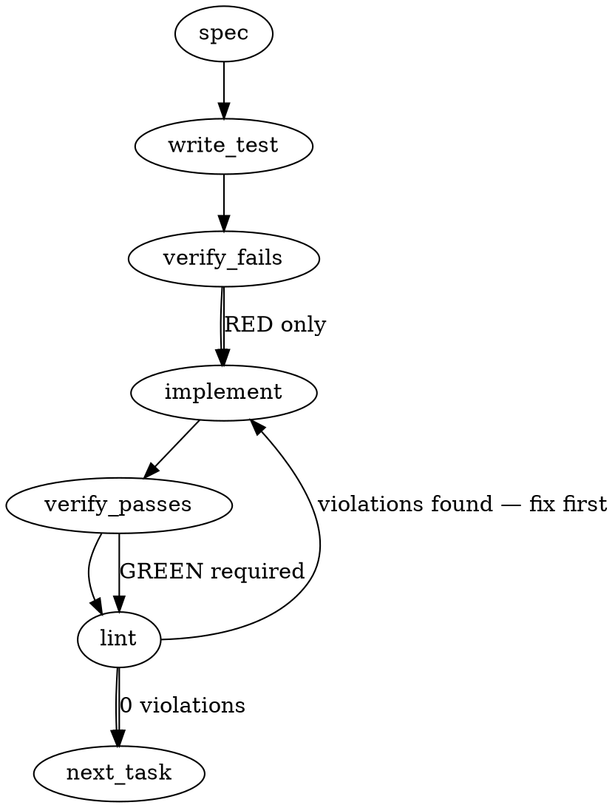

> **⚠ REVIEWERS — the authoritative contract is the [`## Implementation Design`](#implementation-design) section at the bottom.** This auto-generated spec was written before the code was read; its **file paths** (`packages/cli/src/services/post-checks/…`) and **type contracts** are **superseded**. Real types live in `packages/core/src/artifacts/schema.ts`; **admission class is a closed two-value enum** (`completion_only` | `self_grounding_agent`) — `spec`/`review` are `runMetadata.caller` values, **not** admission classes; rule applicability keys off the whole artifact (`appliesTo(artifact)`), not a `targetClasses` array. The sections below are retained only for the problem framing, the ADR-109/Tenet-9 anchors, the edge-case list, and the #2090/#2091 eval-fixture pointers. **OQ5 is resolved: this slice ships the engine + rules + fixtures only — no live `spec`/`review` gating wiring.**

### Problem Statement

The system requires zero-LLM, deterministic post-checks that evaluate an LLM's run artifact against its grounding bundle, keyed off the run's `runMetadata.caller` (`spec` / `review`) and `backend.admissionClass` (`completion_only` / `self_grounding_agent`). These checks must rigidly split into "decidable" (which gate and reject the run on failure) and "undecidable" (which act only as telemetry sensors), ensuring noisy LLM-based evaluations do not block workflows.

### Architectural Context

- **ADR-109 (Noisy gates train bypass):** Blurring decidable structural checks with undecidable heuristic/LLM checks trains users to bypass the gate entirely. Gating MUST be restricted exclusively to deterministic, decidable structural checks.
- **Tenet 9:** Verdict aggregation must be a script, not an LLM. An LLM cannot grade its own structural compliance.
- **Artifact & Grounding Bundle Seams:** Builds on the foundational types established in #2100, #2101, and #2102.

### Files to Examine

1. `packages/cli/src/services/run-artifacts.ts` — Understand the structure of run artifacts and how they are loaded, as this is the primary input to the post-checks.
2. `.totem/specs/2090.md` & `2091.md` (if available in the repo) — Contains the ground truth fixtures for the `spec` class checks where a nonexistent file was invented.

### Technical Approach & Contracts

> **[SUPERSEDED by `## Implementation Design`]** — the `PostCheckContext`/`PostCheckRule` shapes and the `packages/cli/src/services/post-checks/` location below are the pre-grounding draft. The design section relocates them to `packages/core/src/artifacts/`, replaces `targetClasses: string[]` with `appliesTo(artifact): boolean`, and replaces `ctx.{cwd,gitRoot}` with `ctx.{configRoot,readFile,overrideMemory}`. Read the code block below only for the broad shape (tier enum, verdict enum, aggregator idea); take the field-level contract from the design section.

We will implement an extensible, zero-LLM structural evaluation runner.

**Data Contracts (`packages/cli/src/services/post-checks/types.ts`):**

```typescript
import { z } from 'zod';

export const EnforcementTierSchema = z.enum(['decidable', 'sensor']);
export type EnforcementTier = z.infer<typeof EnforcementTierSchema>;

export const CheckVerdictSchema = z.enum(['pass', 'fail', 'abstain']);
export type CheckVerdict = z.infer<typeof CheckVerdictSchema>;

export const PostCheckFindingSchema = z.object({
  ruleName: z.string(),
  tier: EnforcementTierSchema,
  verdict: CheckVerdictSchema,
  message: z.string(),
  context: z.record(z.unknown()).optional(),
});
export type PostCheckFinding = z.infer<typeof PostCheckFindingSchema>;

export const PostCheckReportSchema = z.object({
  findings: z.array(PostCheckFindingSchema),
  // true if ANY decidable check returns 'fail'
  isRejected: z.boolean(),
});
export type PostCheckReport = z.infer<typeof PostCheckReportSchema>;

export interface PostCheckContext {
  cwd: string;
  gitRoot: string; // resolved via resolveGitRoot
  outputContract?: z.ZodSchema;
}

export interface PostCheckRule {
  name: string;
  tier: EnforcementTier;
  targetClasses: string[]; // e.g., ['spec', 'review'] or ['*']
  evaluate: (
    artifact: RunArtifact,
    bundle: GroundingBundle,
    ctx: PostCheckContext,
  ) => CheckVerdict | Promise<CheckVerdict>;
}
```

**Implementation Approach:**

1. **Aggregator Engine:** A central `evaluatePostChecks` function that takes the artifact, bundle, and a list of registered `PostCheckRule` instances. It maps over them, executes the relevant ones based on the artifact's admission class, and computes the final `isRejected` state purely based on the `decidable` tier findings.
2. **Contract Rule (Decidable):** Verifies the `artifact.output` payload cleanly parses against `ctx.outputContract`.
3. **Citation Resolution Rule (Decidable):** Parses citation markers from the output (or bundle references), uses `fs.existsSync` and line number boundary checks to ensure the cited files physically exist in the workspace.
4. **Spec Rule (Decidable):** Targets `spec` class. Uses regex to extract file paths (e.g., matching `[\w\-]+/[\w\-./]+`). If a path does not exist on disk, the output text _must_ contain the exact string `VERIFY:`. If missing, it fails.
5. **Review Rule (Decidable):** Targets `review` class. Compares the output against the grounding bundle's override memory. If an anchored span marked as a rejected override reappears in the output verbatim, it fails.

### Edge Cases & Traps

- **Security / Path Traversal:** When checking if cited files exist, paths MUST be resolved securely relative to the git root using `resolveGitRoot`. An LLM outputting `../../../etc/passwd` must not crash the resolution or erroneously pass.
- **Sensor vs. Gate Leakage:** A failed `sensor` rule (like summary faithfulness) setting `isRejected = true` would be a catastrophic regression of ADR-109. The aggregator logic must strictly filter by `tier === 'decidable'`.
- **False Positives in Spec Paths:** The regex extracting paths from `spec` outputs might match arbitrary text. Restrict path extraction to code blocks, backticked strings, or standardized citation formats to prevent deterministic false failures.

### Implementation Tasks

- [ ] **Task 1: Define Post-Check Contracts & Aggregator**
  - Create `packages/cli/src/services/post-checks/types.ts` with the schemas defined above.
  - Create `packages/cli/src/services/post-checks/aggregator.ts`.
  - Implement `evaluatePostChecks(artifact, bundle, rules, ctx): Promise<PostCheckReport>`.
    > TOTEM INVARIANT (ADR-109): Only rules with tier === 'decidable' are permitted to set `isRejected: true` on failure.
    > TEST DIRECTIVE: Before implementing, write a failing test named `allows undecidable sensor failures to pass gate while failing on decidable failures` that proves the regression is caught.
  - Update `packages/cli/src/services/post-checks/aggregator.test.ts`.
  - write test → verify fails → implement → verify passes → lint

- [ ] **Task 2: Implement Output Contract Rule**
  - Create `packages/cli/src/services/post-checks/rules/contract.ts`.
  - Implement a `decidable` rule targeting `['*']`.
  - If `ctx.outputContract` is undefined, return `abstain`.
  - Try parsing `artifact.output` with the schema. Return `pass` if successful, `fail` if throws.
    > TEST DIRECTIVE: Before implementing, write a failing test named `rejects output that fails outputContract validation` that proves the regression is caught.
  - Update `packages/cli/src/services/post-checks/rules/contract.test.ts`.
  - write test → verify fails → implement → verify passes → lint

- [ ] **Task 3: Implement Citation Resolution Rule**
  - Create `packages/cli/src/services/post-checks/rules/citation.ts`.
  - Implement a `decidable` rule targeting `['self_grounding_agent', 'review']`.
  - Parse citations (assuming a standard structure in the bundle/artifact, or using `extractChangedFiles` from shared helpers if analyzing diff chunks).
  - Use `resolveGitRoot` to securely anchor paths. Return `fail` if a cited file does not physically exist.
    > TEST DIRECTIVE: Before implementing, write a failing test named `fails when a cited file does not exist in the repository` that proves the regression is caught.
  - Update `packages/cli/src/services/post-checks/rules/citation.test.ts`.
  - write test → verify fails → implement → verify passes → lint

- [ ] **Task 4: Implement Spec VERIFY Requirement Rule**
  - Create `packages/cli/src/services/post-checks/rules/spec-verify.ts`.
  - Implement a `decidable` rule targeting `['spec']`.
  - Extract backticked paths or explicit file path strings from `artifact.output`.
  - Use `resolveGitRoot` and `fs.existsSync`.
  - If any path does _not_ exist AND the string `VERIFY:` does not appear anywhere in `artifact.output`, return `fail`.
    > TEST DIRECTIVE: Before implementing, write a failing test named `fails spec output that invents a nonexistent path without VERIFY marker` that proves the regression is caught.
  - Update `packages/cli/src/services/post-checks/rules/spec-verify.test.ts`.
  - write test → verify fails → implement → verify passes → lint

- [ ] **Task 5: Integrate 2090/2091 Fixture Evaluation**
  - Create `packages/cli/src/services/post-checks/fixtures.test.ts`.
  - Load the seeded 2090/2091 fixtures (using `readJsonSafe` from `@mmnto/totem` shared helpers).
  - Execute `evaluatePostChecks` using the `Spec VERIFY Requirement Rule` against these fixtures.
  - Assert that the structural checks deterministically fail the run exactly as modeled in the PR #2098 ground truth.
    > TOTEM INVARIANT (Tenet 9): Verdict aggregation must be completely deterministic and execute with zero LLM calls during the fixture run.
  - write test → verify fails → implement → verify passes → lint

### Execution Flow (structural constraint)



### Verification (MANDATORY — do not skip)

Every implementation MUST end with these steps:

1. `totem lint` — deterministic rule check (zero LLM, ~2s). Fixes any violations.
2. `totem review` — AI-powered architectural review (~18s). Addresses any critical findings.
3. If using MCP, call `verify_execution` to confirm compliance before declaring the task done.

### Test Plan

- **Aggregator Logic**: Pass an array of mock findings with mixed tiers (`decidable` and `sensor`) and mixed verdicts (`pass`, `fail`, `abstain`). Ensure `isRejected` is exactly `true` if and only if a `decidable` rule returns `fail`.
- **Contract Adherence**: Supply an artifact outputting an array to a rule expecting an object. Must fail the decidable rule.
- **Spec VERIFY Check**: Provide an artifact with `packages/cli/src/utils/diff-selector.ts` (nonexistent). Must fail if `VERIFY:` is missing. Must pass if `VERIFY:` is present.
- **Security Check**: Attempt to provide `../../../../../etc/passwd` in a citation or spec output. Must gracefully handle path resolution via `resolveGitRoot` and not crash or execute outside the git boundary.

---

## Implementation Design

> **Spec correction (grounded against the real #2100/#2101/#2102 code).** The auto-generated spec above assumed (a) everything lives in `packages/cli/src/services/post-checks/` and (b) four admission classes incl. `spec`/`review`. Both are wrong. The real types are in `packages/core/src/artifacts/schema.ts`; **admission class is a closed two-value enum** (`completion_only` | `self_grounding_agent`) — `spec`/`review` are `runMetadata.caller` / `backend.taskProfile` values, not admission classes. This design supersedes the spec's contracts where they differ.

### Scope

Deliver a pure, zero-LLM post-check engine in `packages/core/src/artifacts/` that evaluates a loaded `RunArtifact` against its `grounding.bundle` + admitted `outputContract`, emitting per-finding verdicts split into `decidable` (may gate) vs `sensor` (telemetry only) tiers, with `isRejected` computed ONLY from decidable failures (ADR-109). It will **NOT** wire gating into the live `spec`/`review` commands (OQ5), **NOT** build the override-memory store (#2105 — this slice consumes an injected set), and **NOT** add any LLM-judge or citation-_supports_ gate.

### Data model deltas

New module `packages/core/src/artifacts/post-checks.ts` (+ `post-checks/rules/*.ts`). **No persisted-schema changes** — `RunArtifact` already carries every input (`admission.outputContract`, `grounding.bundle`, `runMetadata.caller`, `backend.{taskProfile,admissionClass}`, `output.content`). New types are in-memory only → plain TS interfaces, **not Zod** (Zod-at-boundaries rule; these never hit disk):

- `EnforcementTier = 'decidable' | 'sensor'` — declared **statically** on each rule; read by the aggregator. Held: the gate-eligibility of a rule. Invariant: tier is NEVER derived from a verdict.
- `CheckVerdict = 'pass' | 'fail' | 'abstain'` — returned by `evaluate`; read by aggregator.
- `PostCheckFinding { ruleName; tier; verdict; message; context? }` — one per applicable rule.
- `PostCheckReport { findings; isRejected }` — **aggregator is sole writer of `isRejected`**; invariant `isRejected === findings.some(f => f.tier==='decidable' && f.verdict==='fail')`.
- `PostCheckRule { name; tier; appliesTo(artifact): boolean; evaluate(artifact, ctx): CheckVerdict | Promise<CheckVerdict> }` — `appliesTo` inspects the **whole artifact** (so it can key on `runMetadata.caller` AND `admissionClass`, not a single `targetClasses` array). Rules are module constants.
- `PostCheckContext { configRoot; readFile?; overrideMemory? }` — `configRoot` anchors citation `filePath` resolution (schema rule: absent `sourceRepo` ⇒ run's own repo); `overrideMemory` injected, empty until #2105.

No reserved keys / sentinels — tier and verdict are separate fields.

### State lifecycle

All state is **per-invocation**. `evaluatePostChecks` is pure: maps the rule set over the artifact, collects findings, computes `isRejected`, returns. No module-level mutable state, no cache, no server-lifetime state. Injected `overrideMemory` is owned by the caller (#2105's store later); this slice only reads it.

### Failure modes

| Failure                                                    | Category | Agent-facing surface                                 | Recovery                                                                   |
| ---------------------------------------------------------- | -------- | ---------------------------------------------------- | -------------------------------------------------------------------------- |
| Cited path escapes repo (`../../etc/passwd`)               | runtime  | `fail` (decidable); never reads outside `configRoot` | `resolveGitRoot` + path-containment check; out-of-root ⇒ fail, no fs throw |
| Cited file missing on disk                                 | runtime  | `fail` (decidable)                                   | the intended gate — output cites nonexistent evidence                      |
| `outputContract.schema` present, `output.content` not JSON | runtime  | `fail` (decidable)                                   | structured-output contract violated                                        |
| No `outputContract` / no `bundle` (slice-1 artifact)       | runtime  | every rule `abstain`                                 | honest-absent; report all-abstain, `isRejected=false`                      |
| `overrideMemory` absent (pre-#2105)                        | runtime  | override rule `abstain`                              | engine complete; rule no-ops until store supplied                          |
| Unknown provenance class on an item                        | runtime  | `sensor` finding (not-upgraded), never gates         | fail-safe-down (F2); the F2 enforcement test rides this slice              |
| A rule's `evaluate` throws unexpectedly                    | runtime  | OQ4 — loud decidable `fail` w/ error in `message`    | one broken rule must not blind the others                                  |

No row is `silent degradation`: every abstain is an explicit finding (Tenet 4 honest-absent).

### Invariants to lock in via tests

- A `sensor` rule returning `fail` leaves `isRejected===false`; only a `decidable` `fail` sets it true.
- A `spec`-caller artifact citing a nonexistent path WITHOUT `VERIFY:` ⇒ decidable `fail`; WITH `VERIFY:` ⇒ pass/abstain (the #2090/#2091 fixtures reproduce this exactly).
- A cited path resolving outside `configRoot` returns `fail` with **no** filesystem throw.
- An unknown provenance-class item is treated as not-upgraded and never contributes to a gate (F2).
- The review override rule gates ONLY when an override set is supplied; empty set ⇒ abstain.
- `outputContract` absent ⇒ all contract/citation rules abstain, `isRejected===false`.

### Open questions

- **OQ1 — class-targeting key.** Rules must know "spec run vs review run"; admission class can't carry it (closed 2-value enum). Options: (a) `runMetadata.caller` (`'spec'`/`'review'`, added by #2102 for this); (b) `backend.taskProfile` (`'Spec'`/`'Review'`). **Recommend (a)**, falling back to `taskProfile` when `caller` absent (slice-1/2 artifacts predate `runMetadata`).
- **OQ2 — override rule vs store (#2105).** #2103 "owns the check," #2105 "owns the memory." Options: (a) implement the rule now against an injected `OverrideSet` (empty ⇒ abstain), #2105 supplies the store; (b) defer the review override rule wholly to #2105. **Recommend (a)** — engine stays complete, slice boundary sits at the data not the logic.
- **OQ3 — citation extraction format.** What counts as a citation in `output.content`? Options: (a) conservative — only backticked `` `path` `` / `` `path:line` `` tokens resolved against bundle `filePath`s; (b) any path-like regex (the spec's own false-positive trap). **Recommend (a)**; citation-_resolves_ (file exists + line-in-range) gates, citation-_supports_ stays sensor-only (ADR-109).
- **OQ4 — unexpected rule throw.** Options: (a) catch ⇒ emit a loud decidable `fail` naming the error; (b) propagate and fail the whole run. **Recommend (a)** — a swallowed error breaks Tenet 4; surfacing it as a visible fail keeps the other checks alive.
- **OQ5 — live wiring (scope boundary).** Does this slice GATE the real `spec`/`review` commands, or land engine + rules + fixtures only? **Recommend engine + rules + fixtures only** (the issue's stated deliverable); live gating wiring rides a follow-on once #2104/#2105 land, so production output isn't gated on day-one rules. Flag if you want wiring in-scope now.

---

## Review folds (cohort pre-build round, 2026-06-14 — operator-approved)

Verdicts: **totem-gemini PASS · totem-agy PASS · totem-codex CONDITIONAL PASS**. OQ5 resolved by operator = **engine + rules + fixtures only, no live `spec`/`review` gating this slice.** The build target below supersedes the OQ recommendations where they differ.

### Contract folds (codex — must-fold before build)

1. **OQ4 revised — a thrown rule PRESERVES its declared tier.** Not "throw → loud _decidable_ fail" (that lets a _sensor_ rule reject by throwing — an ADR-109 leak). A thrown **decidable** rule → `decidable` fail (may reject); a thrown **sensor** rule → `sensor` fail (never rejects). A genuine engine-integrity fault is an **engine-level exception thrown out of `evaluatePostChecks`**, never rewritten into a `PostCheckFinding`. Locked by test: _a sensor rule that throws leaves `isRejected === false`._
2. **OQ1 revised — `taskProfileAlias` helper.** Identity = `artifact.admission?.runMetadata?.caller ?? taskProfileAlias(artifact.backend.taskProfile)`, where aliases are `Spec→spec`, `Review→review`, **`Shield→review`** (old review artifacts carry `taskProfile: 'Shield'` — `TAG='Shield'`/`DISPLAY_TAG='Review'` in `packages/cli/src/commands/shield-templates.ts`). An unknown value makes caller-scoped rules **abstain loudly**, never guess.
3. **OQ3/OutputContract — THREE rules, not one.** Split the single contract rule into:
   - **structured-output** (decidable): `outputContract.schema` absent → abstain; present → parse `output.content` as JSON and validate against the JSON-Schema; non-JSON → decidable `fail`. (Prose output is never treated as malformed JSON unless a schema was supplied.)
   - **citation-resolves** (decidable): when `citationsRequired`, gate only on mechanics — cited file exists, line-in-range, cited bundle item exists. Claim _support_ stays sensor-only.
   - **verify-fallback** (decidable): `verifyFallback` controls whether an explicit `VERIFY:` is an acceptable substitute for an uncitable path/API/schema claim; if `false` while citations are required, `VERIFY:` is **not** a pass.

### Passes with riders

- **F2** (PASS): include an enforcement test with a non-canonical class (e.g. `execution-verified`) asserting not-upgraded + `isRejected === false`.
- **OQ2 override boundary** (PASS): #2103 defines only the **minimum rule-consumption interface** (injected `OverrideSet`) + tests — no persisted store, no file reader, no durable finding identity, no anchored-span key format beyond what the injected set supplies. Empty/absent override memory → explicit `abstain` finding.

### Build directives (agy — fold into impl + tests)

- **win32 containment:** reject raw-absolute / drive-letter citations up front; normalize separators (`\\`→`/`) **before** resolve; `resolvedAbsolute.startsWith(normalizedRoot + '/')`. Out-of-root → decidable `fail`, never a throw.
- **citation extraction:** strip multi-line code fences (` ```…``` `) from `output.content` _before_ backtick extraction; reject backticked tokens lacking a path separator OR a known extension (`.ts/.js/.md/.json/.tsx/.go`) so single-word tokens (`` `main` ``) are ignored.
- **line-in-range matrix:** `line<=0` → fail; `line>totalLines` → fail; non-numeric → path-only (skip line check); range `start-end` → fail if `start<=0 || end<=0 || end<start || end>totalLines`. 1-indexed against `content.split('\n')`.
- **fixtures:** `#2090`/`#2091` ground truth is markdown in `.totem/specs/` — the fixture loader parses frontmatter/YAML, not raw JSON; `fixtures.test.ts` makes **zero** LLM calls.
- **test-matrix (must-cover profiles):** (a) slice-1 historic `{caller:undefined, completion_only, no contract, no bundle}` → all-abstain, `isRejected=false`; (b) code-blind `{caller:'spec', runMetadata.codeBlind:true}` → spec checks run, missing code context doesn't false-fail; (c) F2 unknown-provenance item → lowest-trust, no crash.
