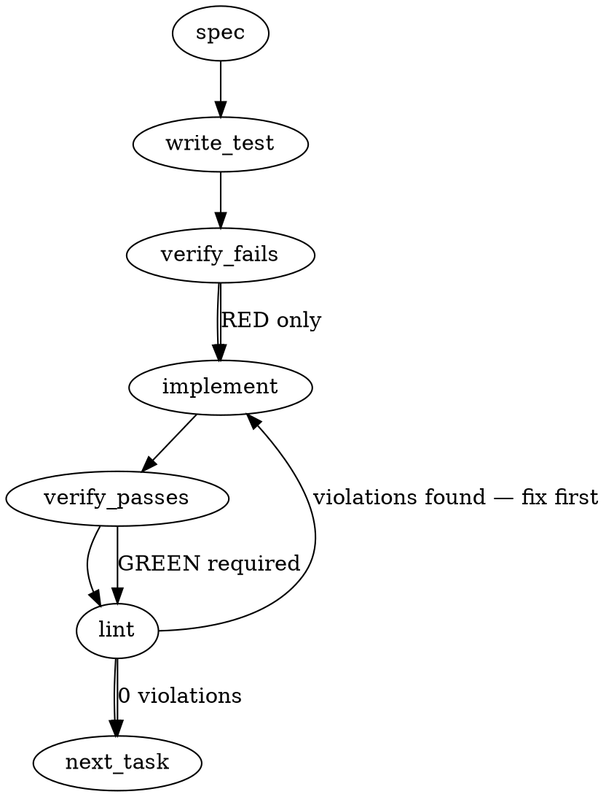

### Problem Statement

The orchestrator must be extended to support a "panel synthesis" mode where N independent runs (lanes) of the same task are executed concurrently with isolated contexts. After completion, a deterministic script (not an LLM) must aggregate the individual run artifacts, deduplicate findings by anchor, and label the panel's vendor diversity accurately.

### Architectural Context

- **Issue #474 / Tenet 19 §3**: Multi-turn conversational debate is explicitly CUT from the main path. The architecture enforces an independent-lanes-then-synthesis (blind-round) pattern.
- **Tenet 9**: Aggregation must be a script, not an LLM.
- **#2100 Dependency**: Relies on the standard `RunArtifact` emitted by a single lane execution.
- **Diversity Labeling Trap**: System must strictly distinguish between true cross-vendor diversity and isolated same-vendor runs to prevent overclaiming panel rigor.

### Files to Examine

1. `packages/cli/src/utils.ts` — Contains `runOrchestrator`. We will need to wrap or utilize this to dispatch N parallel, context-isolated lanes.
2. `packages/cli/src/commands/spec.ts` — Shows how orchestrator configurations and models are initialized; useful for understanding provider extraction for diversity labeling.
3. `packages/totem/src/types.ts` (or equivalent types entry) — Where the new `PanelArtifact` and `PanelDiversityClass` schemas will reside.

### Technical Approach & Contracts

**Implementation Approach:**

1.  **Data Contracts**: Introduce `PanelArtifact` schema encompassing an array of #2100 `RunArtifact`s, a `PanelDiversityClass`, and a synthesized summary of findings and verdicts.
2.  **Concurrency & Isolation**: Implement a `runPanelOrchestrator` wrapper that executes N instances of `runOrchestrator` via `Promise.all()`. Each instance must receive a strict, immutable clone of the grounding bundle to prevent object reference leakage between lanes.
3.  **Deterministic Aggregation**: Write a pure script function (`synthesizePanelArtifacts`) that:
    - Tallies verdicts (e.g., `pass`: 2, `fail`: 1).
    - Groups findings by their `anchor` (exact string match).
    - Surfaces divergences (if an anchor has conflicting suggestions from different lanes).
4.  **Graceful/Strict Failure**: If any single lane fails or times out, the panel execution must throw. Partial panels are structurally invalid for deterministic verdict merging in this phase.

**Data Contracts (Zod):**

```typescript
export const PanelDiversityClassSchema = z.enum(['cross-vendor', 'same-vendor-isolated']);

export const SynthesisFindingSchema = z.object({
  anchor: z.string(),
  sources: z.array(z.string()), // lane/provider IDs
  descriptions: z.array(z.string()), // Preserved verbatim from each lane
  divergent: z.boolean(), // True if sentiments/severities conflict
});

export const PanelSynthesisSchema = z.object({
  verdictDistribution: z.record(z.string(), z.number()),
  findings: z.array(SynthesisFindingSchema),
  divergences: z.number(), // count of conflicting findings
});

export const PanelArtifactSchema = z.object({
  diversityClass: PanelDiversityClassSchema,
  synthesis: PanelSynthesisSchema,
  lanes: z.array(RunArtifactSchema), // Standard #2100 artifact
});
```

### Edge Cases & Traps

- **Trap — LLM Aggregation**: Developers often reach for an LLM to "summarize" panel outputs. This violates Tenet 9. Aggregation must be purely programmatic grouping by anchor.
- **Trap — Concurrent Rate Limiting**: Firing N parallel requests to the same provider (e.g., `same-vendor-isolated` using 3x Claude) will drastically increase 429 Too Many Requests errors. You must ensure `runOrchestrator`'s underlying HTTP client implements jittered backoff.
- **Race Condition — Shared State**: If `runOrchestrator` mutates the input prompt bundle or system context object, concurrent executions will pollute each other. The input bundle must be deep-cloned before passing to each lane.
- **Edge Case — Partial Panel Failure**: 2 lanes succeed, 1 lane throws an unrecoverable 500. The code must _not_ silently swallow the error and synthesize a 2-lane panel. It must fail fast and surface the lane error.

### Implementation Tasks

- [ ] **Task 1: Define Panel Data Contracts**
  - Add `PanelDiversityClassSchema`, `SynthesisFindingSchema`, `PanelSynthesisSchema`, and `PanelArtifactSchema` to the orchestrator types file.
  - > TEST DIRECTIVE: Before implementing, write a failing test named `rejects panel artifact with invalid diversity class` that validates the Zod schemas enforce strict enum values.
  - write test → verify fails → implement → verify passes → lint

- [ ] **Task 2: Implement Diversity Labeler**
  - Create `calculateDiversityClass(providers: string[]): PanelDiversityClass` in a new utility file (e.g., `packages/cli/src/orchestrator/panel.ts`).
  - > TOTEM INVARIANT [Honest Diversity Labeling]: The panel artifact must accurately record cross-vendor vs same-vendor-isolated to prevent overclaiming rigor.
  - > TEST DIRECTIVE: Before implementing, write a failing test named `classifies varying models from same provider as same-vendor-isolated` (e.g., `claude-3-5-sonnet` + `claude-3-haiku` = `same-vendor-isolated`).
  - write test → verify fails → implement → verify passes → lint

- [ ] **Task 3: Implement Deterministic Aggregation Script**
  - Create `synthesizePanel(artifacts: RunArtifact[]): PanelSynthesis` in `packages/cli/src/orchestrator/panel.ts`.
  - Group findings by exact `anchor` match. Concatenate sources. Tally overall verdicts into a `Record<string, number>`.
  - > TOTEM INVARIANT [Tenet 9]: Aggregation is a script, not an LLM. Verdict merge and finding dedup must be purely deterministic.
  - > TEST DIRECTIVE: Before implementing, write a failing test named `deterministically aggregates findings by identical anchors and tallies verdicts`.
  - write test → verify fails → implement → verify passes → lint

- [ ] **Task 4: Implement Parallel Lane Runner**
  - Create `runPanelOrchestrator` wrapping `runOrchestrator` (from `packages/cli/src/utils.ts`) in a `Promise.all`.
  - Ensure deep cloning of the context bundle for each iteration to guarantee lane isolation.
  - Implement strict failure: if `Promise.all` catches an error, throw the panel execution.
  - > TEST DIRECTIVE: Before implementing, write a failing test named `rejects entire panel if single lane fails` to prevent silent partial-panel synthesis.
  - write test → verify fails → implement → verify passes → lint

### Execution Flow (structural constraint)



### Verification (MANDATORY — do not skip)

Every implementation MUST end with these steps:

1. `totem lint` — deterministic rule check (zero LLM, ~2s). Fixes any violations.
2. `totem review` — AI-powered architectural review (~18s). Addresses any critical findings.
3. If using MCP, call `verify_execution` to confirm compliance before declaring the task done.

### Test Plan

- **Diversity Scenarios**: Test `[openai, openai, openai]`, `[anthropic, openai]`, and `[anthropic, anthropic-different-model]`. Ensure correct `cross-vendor` or `same-vendor-isolated` assignment.
- **Aggregation Scenarios**:
  - Input: 3 artifacts. 2 have findings at `src/index.ts:42`, 1 has a finding at `src/utils.ts:10`.
  - Assert: Output synthesis has exactly 2 grouped findings, with the first showing `sources: ['lane-1', 'lane-2']`.
- **Isolation Scenarios**: Mutating the system context inside a mocked `runOrchestrator` lane must not affect the inputs received by parallel sibling lanes.
- **Failure Scenarios**: Mock `runOrchestrator` to simulate a timeout in lane 2. Assert `runPanelOrchestrator` throws immediately and does not output a partial artifact.

---

## Implementation Design

> **NB — this section overrides the generated skeleton above**, which made two
> wrong assumptions verified against the real slice 1–4 code:
> (1) `RunArtifact` carries **no** `findings`/`verdict` — it is input/output only
> (`packages/core/src/artifacts/schema.ts:254-272`); findings come from slice 4's
> `evaluatePostChecks() → PostCheckReport` (`post-checks.ts:44-54`).
> (2) `PostCheckFinding` has **no path:line anchor** — its stable identity is
> `ruleName`. So "dedup by anchor" = group by `ruleName`. Types live in
> `packages/core/src/artifacts/`, not `packages/totem` or `cli`.

### Scope

This slice ships the **deterministic core primitives only** (mirroring slice 4's
engine-only / no-live-wiring posture): a Zod `PanelArtifact` schema, the pure
`synthesizePanel()` aggregator (Tenet 9), `classifyDiversity()`, content-addressed
panel storage, plus tests + fixtures. It will **NOT** ship the parallel CLI lane
runner (`runPanelOrchestrator`), any backend invocation, gating, or CLI command
wiring — those are a fast-follow (see OQ1). The panel is a **sensor**: it emits a
verdict _distribution_, never a single gating verdict (issue's "review-as-actuator
— sensor only" is out of scope).

### Data model deltas

All new, all in `packages/core/src/artifacts/panel.ts` (Zod, persisted), exported via `index.ts`:

| Symbol                                                   | Holds                                                                                                               | Writer              | Reader                | Invariants                                                                                                                                                               |
| -------------------------------------------------------- | ------------------------------------------------------------------------------------------------------------------- | ------------------- | --------------------- | ------------------------------------------------------------------------------------------------------------------------------------------------------------------------ |
| `PanelDiversityClass` (`z.enum`)                         | `'cross-vendor' \| 'same-vendor-isolated'`                                                                          | `classifyDiversity` | synthesis + consumers | derived purely from `distinctProviders`                                                                                                                                  |
| `PanelDiversity`                                         | `{ providers: string[]; distinctProviders: number; class }`                                                         | `classifyDiversity` | panel artifact        | `providers.length === lanes.length` (per-lane, ordered); `distinctProviders = new Set(providers).size`; raw `providers[]` ALWAYS present so the class can't overclaim    |
| `SynthesisFinding`                                       | `{ ruleName; tier; verdicts: Record<CheckVerdict,number>; divergent: boolean; messages: string[] }`                 | `synthesizePanel`   | panel artifact        | one entry per distinct `ruleName`; `messages` preserved **verbatim** (no LLM rewrite — Tenet 9); `tier` must be consistent across lanes for a ruleName (else hard error) |
| `PanelSynthesis`                                         | `{ verdictDistribution: Record<'accepted'\|'rejected',number>; findings: SynthesisFinding[]; divergences: number }` | `synthesizePanel`   | panel artifact        | `divergences === findings.filter(f=>f.divergent).length`; `Σ verdictDistribution === lanes.length`                                                                       |
| `PanelArtifact`                                          | `{ schemaVersion; lanes: RunArtifact[]; diversity; synthesis; createdAt }`                                          | storage writer      | tolerant reader       | `schemaVersion` starts `"1.0.0"`; reader accepts any `1.x`, rejects `≥2.x` loud (mirror `RunArtifact` F1); `lanes.length ≥ 1`                                            |
| `panelsDir()` + `writePanelArtifact`/`readPanelArtifact` | `<totemDir>/artifacts/panels/<sha256>.json`                                                                         | storage             | consumers             | content-addressed (hash excludes `createdAt`), write-if-absent `wx` (first-write-wins), mirrors `runsDir`/`storage.ts` exactly                                           |

**Pure functions (no LLM, no I/O):** `classifyDiversity(providers: string[]): PanelDiversity`; `synthesizePanel(lanes: ReadonlyArray<{ artifact: RunArtifact; report: PostCheckReport }>): PanelSynthesis`. No module-level state, no reserved keys, no sentinels.

**Anchor / dedup key = `ruleName`.** `evaluatePostChecks` emits one `PostCheckFinding` per rule per lane, so grouping by `ruleName` collapses the N lanes' verdicts for each rule. `context` (an unbounded `Record<string,unknown>`) is **not** a stable key → finer sub-anchoring deferred (Tenet 21, OQ3).

### State lifecycle

- **`PanelArtifact` on disk:** persistent, write-once, content-addressed, immutable (same model as `RunArtifact`). Created by the storage writer; never mutated; never cleared by this slice.
- **`synthesizePanel` / `classifyDiversity`:** per-invocation pure; no state crosses calls.
- **No** session/server/module-level state. No lifecycle-boundary crossings (the class of bug the gate exists to catch is structurally absent here).

### Failure modes

| Failure                                          | Category  | Agent-facing surface                                                                            | Recovery                    |
| ------------------------------------------------ | --------- | ----------------------------------------------------------------------------------------------- | --------------------------- |
| `lanes` empty (N=0)                              | runtime   | hard error (throw)                                                                              | caller supplies ≥1 lane     |
| N=1 (single lane)                                | runtime   | allowed; `class = same-vendor-isolated`, `distinctProviders = 1` (honest under-claim, no error) | n/a                         |
| a lane `RunArtifact` fails Zod parse             | runtime   | hard error (Tenet 4 — never synthesize over a malformed lane)                                   | fix upstream artifact       |
| same `ruleName`, conflicting `tier` across lanes | runtime   | hard error (structural impossibility — a rule's tier is static)                                 | n/a (signals corrupt input) |
| `backend.provider` empty                         | init      | cannot occur — `BackendSchema.provider` is `.min(1)`                                            | n/a                         |
| panel hash collision                             | permanent | sha256 — negligible, not handled                                                                | n/a                         |
| write when file already exists                   | transient | write-if-absent: first-write-wins, **no** error (content-addressed ⇒ identical bytes)           | n/a                         |

No row has "silent degradation". Every aggregation surface is loud or structurally impossible.

### Invariants to lock in via tests

- **Order-independent determinism:** `synthesizePanel(lanes)` is identical under any permutation of `lanes` (canonical sort by `ruleName`; per-lane `providers[]` keeps lane order, which is the only order that matters).
- **Group-by-ruleName:** N lanes each emitting `ruleX` ⇒ exactly ONE `SynthesisFinding` for `ruleX` with its N verdicts tallied.
- **Divergence semantics:** a finding is `divergent` IFF both `pass` and `fail` appear for that `ruleName` across lanes; `abstain` is neutral (abstain+pass is NOT divergence). `divergences` counts exactly these.
- **Honest diversity — the Prop-291 guard:** `['gemini','gemini']` ⇒ `distinctProviders=1`, `same-vendor-isolated` (two lanes do **not** make it cross-vendor); `['gemini','anthropic']` ⇒ `distinctProviders=2`, `cross-vendor`.
- **Verbatim messages:** lane messages survive into `SynthesisFinding.messages` unmodified.
- **Sensor, not gate:** `PanelSynthesis` exposes no single `isRejected`/boolean gate field; only the `verdictDistribution` tally.
- **Schema-version tolerance:** a `1.x` panel reads; a `2.x` panel rejects loud (parity with `RunArtifact`).
- **Content-addressed dedup:** two panels with identical content (differing only in `createdAt`) hash to one file.

### Open questions

1. **Slice boundary — engine-only vs include the lane runner?**
   - **Options:** (a) core primitives only this slice, defer `runPanelOrchestrator` (CLI parallel dispatch) to a fast-follow — mirrors slice 4 (#2103) which shipped engine+rules+fixtures with no live wiring; (b) include the CLI runner + a `totem panel` command now.
   - **Recommendation:** (a). Keeps the PR pure/deterministic/reviewable, matches the established slice rhythm, and the runner's partial-panel policy (OQ5) is a separate decidable question best reviewed on its own.

2. **Diversity label shape.**
   - **Options:** (a) binary enum + always-present `providers[]`/`distinctProviders`; (b) full provider→family cluster map per Prop 291 (collapse a future `vertex`+`gemini` into one Gemini cluster); (c) raw `providers[]` only, no class.
   - **Recommendation:** (a). At the provider level, `backend.provider` already collapses correlated seats (agy + gemini both report `"gemini"`), so distinctness = cluster count today. Defer the family map until a second same-family provider _string_ actually exists (Tenet 21). `providers[]` is always emitted so nothing overclaims.

3. **"Dedup by anchor" = `ruleName`?** PostCheckFinding has no path:line anchor. **Recommendation:** yes — v1 anchor is `ruleName`; context-level sub-anchoring deferred (context is unbounded, not a stable key). Confirm this satisfies the issue's "dedup by anchor" intent.

4. **Verdict aggregation is sensor-only?** Issue puts "review-as-actuator (sensor only — users wire gates)" out of scope. **Recommendation:** panel emits `verdictDistribution` (tally of each lane's own `PostCheckReport.isRejected`) + `divergences`; it computes **no** panel-level gate. Confirm.

5. **Partial-panel policy** (only if OQ1=b). **Options:** throw on any lane failure (fail-fast, honest-N) vs emit a panel with the failed lane marked. **Recommendation:** fail-fast for v1 — a missing lane silently changes N and the diversity claim. (Moot if OQ1=a.)

---

## Adopted review folds — pre-build round 1

**Verdicts:** totem-gemini PASS · totem-agy PASS (defensive recs) · totem-codex CONDITIONAL PASS · strategy-claude PENDING (blocked on reachability — doctrine/OQ2 ratification owed). **Cluster read (Tenet 19):** the two reporting clusters (OpenAI=codex, Gemini-family=gemini+agy) converge on OQ1-5 as recommended; codex's CONDITIONAL is additive hardening, not a direction change.

1. **Persist post-check inputs, not just the aggregate (codex #1 — audit-immutability).** `PanelArtifact.lanes` becomes `PanelLane[]`, `PanelLane = { laneId: string; artifact: RunArtifact; report: PersistedPostCheckReport }`. Add Zod `PersistedPostCheckReportSchema` / `PersistedPostCheckFindingSchema` in `panel.ts` — do **not** persist slice-4's plain-TS interfaces raw across the disk boundary. `context`, if persisted, is constrained JSON-safe or omitted. Validate `report.isRejected === findings.some(f => f.tier==='decidable' && f.verdict==='fail')` at **write and read**.
2. **Duplicate-`ruleName`-within-a-lane → hard error (codex #2).** `synthesizePanel` throws if one lane's report carries two findings with the same `ruleName` (else within-lane dups masquerade as cross-lane agreement). Conflicting `tier` for one `ruleName` across lanes also throws (invariant #9).
3. **Explicit lane identity + canonical ordering (codex #3).** Each lane carries a stable `laneId`. Canonical order: lanes by `laneId`; `synthesis.findings` by `ruleName`; each finding's per-lane verdict/message records by `laneId`; `messages` sorted deterministically. Panel content hash is computed over this canonical form → completion/caller order cannot change the hash. (Refines "order-independent" → order-independent _up to canonicalization_; caller order is not part of identity.)
4. **Missing-`ruleName`-across-lanes = implicit `abstain` (agy #3).** A rule present in some lanes but absent in others (heterogeneous `appliesTo`) counts as `abstain` for the absent lanes → `Σ verdicts === lanes.length` always. NOT a hard error (would make the panel fragile to legitimately divergent outputs). Distinct from fold #2's within-lane-duplicate throw.
5. **`verdictDistribution` mapping (agy #1).** `isRejected===false ⟹ 'accepted'`, `true ⟹ 'rejected'` — no third state. Negative test: the panel schema exposes **no** `isRejected`/`verdict`/gate boolean (codex sensor-only precision).
6. **Storage parity precision (codex).** Mirror run-storage file mode `0o600` + parse-error normalization. Storage tests run against a temp dir (agy #5).
7. **Locked invariants → 10 (agy #4).** Add: N=1 baseline safety; tier-uniformity throw; within-lane duplicate-`ruleName` throw; `messages` sort determinism — on top of the original list.

**OQ resolution (cluster-endorsed; strategy-claude OQ2 ratified — see round 2):** OQ1 = engine-only core (a) · OQ2 = binary enum + `providers[]`/`distinctProviders` (a) · OQ3 = `ruleName` anchor (yes) · OQ4 = sensor-only (yes) · OQ5 = fail-fast (moot this slice).

---

## Adopted review folds — pre-build round 2 (strategy-claude, doctrine)

**Verdict: PASS, OQ2 ratified with one condition.** Build unblocked on the doctrine lens. The lossless-`providers[]` choice is the load-bearing decision and is correct; the binary class is honest _today only because_ `{gemini, anthropic, openai}` is 1:1 with independent families.

8. **PP1/OQ2 fail-loud tripwire (the condition — SHOULD-before-merge, NOT the family map).** Silent-overclaim path: a provider string that _aliases_ an existing family (`vertex`→Gemini, `bedrock`→Anthropic, `azure`→OpenAI; `vertex` is already live in our sync path) makes `distinctProviders` overcount and `class='cross-vendor'` lie. Fold: (a) name the invariant in a `classifyDiversity` comment — _`distinctProviders` is a valid cluster count only while provider-string ≡ provider-family (1:1)_; (b) check `providers[]` against a known-provider allowlist (the existing `KNOWN_PROVIDERS`, restricted to true vendor families); (c) add `unrecognizedProviders: string[]` + a `diversityConfidence: 'verified' | 'coarse'` marker to `PanelDiversity` — when an unknown string appears, the panel must NOT confidently assert `cross-vendor` (emit `coarse` + "unrecognized provider — diversity may be coarse"). The sensor speaks at its own failure point; Tenet 21 still defers the family map. New locked invariant (#11): an unrecognized provider string ⇒ `diversityConfidence='coarse'` and no confident `cross-vendor` claim.
9. **PP2 — consumer contract on "isolated" (review-time).** At the `PanelDiversityClass` type definition, document that `same-vendor-isolated` = context-isolation, **not** rater-independence: such a panel's `verdictDistribution` is _N correlated samples, not N independent votes_. Do not rename the enum.
10. **PP3 — distribution is never the headline (review-time, Tenet 19).** A bare `{accepted, rejected}` tally structurally invites vote-counting (a 2-1 same-vendor split is weak; cross-vendor convergence is strong). The consumer-facing/rendered shape leads with **divergence + diversity**; the tally is one of three co-equal raw signals, subordinate. Keep `diversity` + `synthesis` inseparable in the artifact (already so). Add **no** derived gate field — that crosses into the excluded actuator scope.

**#2106 note (to file):** the panel artifact's first real consumer is the cohort's own review rounds — the by-hand cluster read in round 1 is exactly the `distinctProviders` reasoning the panel mechanizes. Also file strategy-claude's #474 datapoint (review-asks should carry a pushed ref, not a local path) — though co-located review _reads_ are now confirmed fine, so it's attestation-nice, not a precondition.
