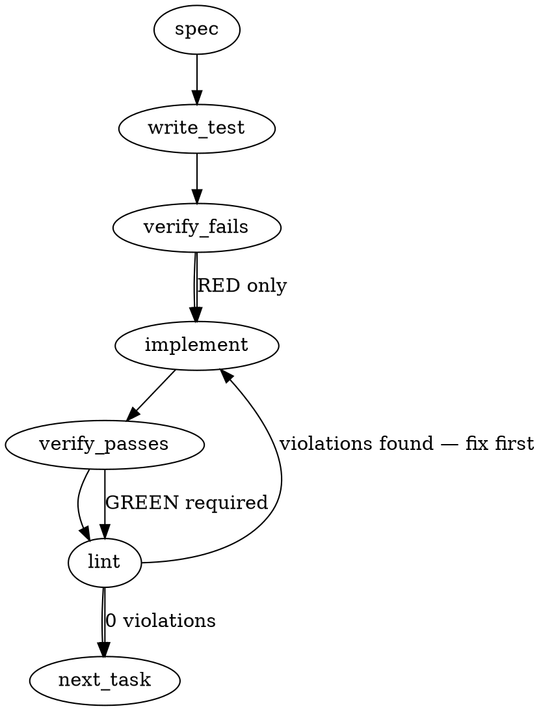

### Problem Statement

`totem mail` (and hooks using `pollMail`) silently drops valid, frontmatter-only dispatches larger than 2 KiB because the parser incorrectly relies on a double-blank-line separator (`\r?\n\r?\n`) to isolate the header. We need to refactor `parseHeader` to bound its search using the closing YAML frontmatter delimiter (`---`), emit a structured warning instead of silently failing, and optionally fix the broken `--json` flag to emit parseable JSON.

### Architectural Context

- **Error Handling & Logging Conventions (Lesson 9):** Requires `log.error()` to use `'Totem Error'` as the tag, but specifically mandates that `log.warn()` MUST use the command-specific `TAG` constant.
- **YAML Handoffs:** Code snippets reveal `parseHeader` enforces that "real handoffs open with a YAML frontmatter delimiter." Blank-line separation is a legacy assumption that must be replaced by strict delimiter bounding.

### Files to Examine

1. `packages/cli/src/commands/mail.ts` — Contains `MAX_HEADER_BYTES`, `parseHeader`, `pollMail` read loop, and the CLI command handler.
2. `packages/cli/src/commands/mail.test.ts` — Missing tests for the >2KB zero-blank-line case and silent drop behavior.

### Technical Approach & Contracts

**1. Delimiter Refactoring (`parseHeader`)**
Instead of splitting the entire file by `/\r?\n\r?\n/` and validating the first chunk's size, we will strictly parse the frontmatter boundaries:

- Verify the file starts with `---` (optionally preceded by whitespace).
- Find the index of the _closing_ `---` delimiter (`\n---` or `\r\n---`).
- **Forged-Frontmatter Defense:** If the closing delimiter is not found, OR its index is strictly greater than `MAX_HEADER_BYTES` (2048), return `null`.
- Extract the matched boundary as the header string and pass it to the existing metadata parser.

**2. Visibility for Drops (`pollMail`)**
Update the file iteration loop in `pollMail`. When `parseHeader(content)` returns `null`, emit a structured warning via `log.warn(TAG, ...)` before executing `continue`, ensuring parity with the `readFileSync` failure path.

**3. Adjacent Fix: JSON Output (`mail` command)**
Address #2097 in the same pass. If the `--json` flag is provided to the CLI command, execute `console.log(JSON.stringify(result, null, 2))`. Ensure that `log.warn` outputs to `stderr` (which is standard for the logger) so it does not corrupt the `stdout` JSON pipeline.

### Edge Cases & Traps

- **CRLF vs LF:** The closing delimiter search must account for both `\n---` and `\r\n---`. Using a simple `.indexOf('\n---')` might miscalculate bytes or miss carriage returns. Use a regex with bounded execution or check both.
- **JSON Pollution:** Emitting the new warning could pollute `stdout` if the logger isn't strictly writing to `stderr`. This breaks programmatic consumers of `--json`. The warning must be safely routed.
- **Missing closing delimiter:** A file that starts with `---` but has no closing `---` within 2 KiB must be gracefully rejected (return `null`), not crash the process.
- **Header exactly at boundary:** An off-by-one error in the `MAX_HEADER_BYTES` check could drop a valid header that exactly hits 2048 bytes. Use `<= MAX_HEADER_BYTES` for the bounding check.

### Implementation Tasks

- [ ] **Task 1: Add failing tests for large frontmatter dispatches**
  - Modify: `packages/cli/src/commands/mail.test.ts`
    > TEST DIRECTIVE: Before implementing, write a failing test named `parses frontmatter-only dispatch larger than 2KB without blank lines` that proves the regression is caught. Also write `emits warning on unparseable mail format`.
  - Steps:
    1. Create a test payload starting with `---\nsubject: Test\n---\n` followed by >2048 bytes of text, with NO double blank lines.
    2. Create a test for `pollMail` ensuring a log warning is emitted when a file is unparseable (e.g., missing closing delimiter).
    3. write test → verify fails → implement (skip implementation, move to Task 2 to fix) → verify passes (after Task 2/3) → lint

- [ ] **Task 2: Refactor YAML boundary parsing**
  - Modify: `packages/cli/src/commands/mail.ts`
  - Steps:
    1. Locate `parseHeader` and remove the `content.split(/\r?\n\r?\n/, 2)` logic.
    2. Check if `content.trimStart().startsWith('---')`. If not, return `null`.
    3. Find the closing delimiter using `content.indexOf('\n---', 3)`. (Handle `\r\n` safely by checking `.indexOf` on both or using a bounded regex match).
    4. If the index is `-1` or exceeds `MAX_HEADER_BYTES`, return `null`.
    5. Slice the content from `0` to the end of the closing `---` and proceed with the existing parsing logic.
    6. write test (from Task 1) → verify fails (should already fail) → implement → verify passes → lint

- [ ] **Task 3: Surface silent drops as warnings**
  - Modify: `packages/cli/src/commands/mail.ts` (specifically `pollMail`)
    > TOTEM INVARIANT (Error Handling & Logging Conventions): `log.warn()` MUST use the command-specific `TAG` constant. Do not use `'Totem Error'` or raw strings for the tag.
  - Steps:
    1. Locate `const header = parseHeader(content); if (!header) continue;` (around line 359).
    2. Update to log a warning containing the file path when `header` is null.
    3. Verify `log.warn` is imported and the `TAG` constant is defined in the file.
    4. write test (from Task 1) → verify fails → implement → verify passes → lint

- [ ] **Task 4: Fix `--json` emission (Issue #2097)**
  - Modify: `packages/cli/src/commands/mail.ts` (Command handler)
    > TEST DIRECTIVE: Before implementing, write a failing test named `emits valid JSON to stdout when --json flag is provided` that proves the regression is caught.
  - Steps:
    1. Locate the main action handler for the `mail` command.
    2. Check if the `json` option is true.
    3. If true, bypass standard text output and call `console.log(JSON.stringify(result, null, 2))`.
    4. write test → verify fails → implement → verify passes → lint

### Execution Flow (structural constraint)

### Verification (MANDATORY — do not skip)

Every implementation MUST end with these steps:

1. `totem lint` — deterministic rule check (zero LLM, ~2s). Fixes any violations.
2. `totem review` — AI-powered architectural review (~18s). Addresses any critical findings.
3. If using MCP, call `verify_execution` to confirm compliance before declaring the task done.

### Test Plan

- **Large Frontmatter Test:** Construct a dispatch with standard YAML frontmatter and a dense 3 KiB body with strictly zero `\n\n` occurrences. Assert `pollMail` parses the metadata correctly and does not drop the file.
- **Security Bounding Test:** Construct a forged dispatch where the closing `---` occurs at byte 3000. Assert `pollMail` drops it and emits a warning.
- **Warning Emission Test:** Pass a malformed `.md` file without `---` into the outbox. Assert `log.warn` is called with the correct `TAG` and filepath.
- **JSON Flag Test:** Run `totem mail --json` and assert `JSON.parse` succeeds on stdout, and that any `log.warn` side-effects do not invalidate the stdout payload.

## Implementation Design

### Scope

Fix the two read-side defects in `totem mail`: (1) `parseHeader` silently rejects valid frontmatter-only dispatches — reparse on the closing `---` delimiter with a **raised** named search-window cap, and surface every mail-shaped parse rejection as a structured warning (parity with the `readFileSync` failure path, Tenet 4); (2) route the commander parent/child `--json` collision so `totem mail --json` actually emits JSON (#2097 — root-caused to the program-level `--json` at `index.ts:74` swallowing the subcommand flag; `mailCommand`'s renderer is already correct). Explicitly NOT in scope: inbox model / derived handled-state / processed-marking mechanization (Proposal 290, #390, strategy#506 — the ECL design review owns the class; this is the instance fix, ratified to proceed in parallel), sender-side or dispatch-schema changes, `MAX_SCAN` changes, `index-lite` (does not register mail).

### Data model deltas

- **`MAX_HEADER_BYTES` (2048) → `MAX_HEADER_SEARCH_BYTES` (16384)** — semantics change from "max file size tolerated without a blank-line separator" to "window within which the closing `---` must appear." **The value must rise with the semantics**: observed genuine frontmatter runs to 4163 bytes (2026-06-07T2107Z dispatch, frontmatter-only); a literal port of the suggested fix at 2048 still rejects the entire observed miss class. 16 KiB ≈ 4× observed max, still bounded. Comment carries this provenance.
- **`HeaderParse` (module-private discriminated result)**: `{ ok: true, header } | { ok: false, mailShaped: boolean, reason: string }`. Written by `parseHeader`, read only by `pollMail`'s scan loop to decide warn-vs-silent-skip and compose the warning message. Not exported; `MailEntry` / `MailPollResult` / `MailCommandOptions` unchanged.
- **New warning strings** ride the existing `warnings: string[]` (bounded by `MAX_SCAN` per poll; no new container).

### State lifecycle

No new state. `warnings[]` remains per-invocation (created/appended/returned inside `pollMail`, never cached). `TOTEM_JSON_OUTPUT` env (process-lifetime, argv-sniffed at `index.ts:80`) is untouched — no consumer reads `program.opts().json` directly (verified by grep), so the wiring fix cannot regress other commands.

### Failure modes

| Failure                                                              | Category  | Agent-facing surface                                                                                                            | Recovery                                                                                                                |
| -------------------------------------------------------------------- | --------- | ------------------------------------------------------------------------------------------------------------------------------- | ----------------------------------------------------------------------------------------------------------------------- |
| Mail-shaped file (`---`-opening), closing `---` beyond 16 KiB window | runtime   | **warning** `mail parse failed (repo/agent/file): <reason>` + skip                                                              | sender fixes dispatch; re-warned every poll until then (observable, self-healing)                                       |
| Mail-shaped file, no closing `---` at all                            | runtime   | **warning** + skip                                                                                                              | same                                                                                                                    |
| Mail-shaped file, no `to:` inside delimited header                   | runtime   | **warning** + skip (single-writer outbox is dispatches-only by ADR-106 §3; a to:-less file there is sender error)               | sender fixes                                                                                                            |
| Non-mail-shaped `.md` (doesn't open with `---`)                      | by-design | **silent skip** (unchanged) — stray files are non-mail by contract; warning would be permanent unfixable noise for every poller | n/a (justified: the observed silent-drop class was exclusively mail-shaped; Tenet 4 satisfied by warning on that class) |
| `readFileSync` / `readdir` / `processed/` failures                   | transient | warning + skip (existing, unchanged)                                                                                            | next poll                                                                                                               |
| `--json` run with warnings present                                   | n/a       | warnings inside the JSON payload; stdout stays parseable JSON; human text only ever on stderr                                   | n/a                                                                                                                     |

Note: parse warnings fire for **every** poller, including for broken files addressed to someone else — correct, since an unparseable file has no determinable addressee, and the sender (who also polls) is the party who can fix it.

### Invariants to lock in via tests

1. A frontmatter-only dispatch (zero blank lines, ~3.5 KiB replica of the 2015Z shape) with valid `to:` parses and surfaces — the 8/8 regression class.
2. Body content after the closing `---` can never fabricate `to:`/`from:`/`subject:`/`date:` (forged-frontmatter defense preserved under the new parser).
3. Every mail-shaped rejection produces a structured warning naming repo/agent/file — no silent-drop path remains for `---`-opening files.
4. A blank line **inside** the frontmatter region no longer truncates the header (kills the old splitter's failure mode); the interim sender-discipline shape (blank line + body footer after closing `---`) parses identically.
5. CRLF (`\r\n---`) and LF dispatches parse identically.
6. `mailCommand({json: true})` emits parseable JSON to stdout with zero stderr leakage into the stream; the commander wiring delivers `json: true` end-to-end (test via spawned `dist` smoke if repo precedent exists, else a minimal commander-replica wiring test).
7. Existing under-cap lenient test (mail.test.ts:568) is superseded by delimiter semantics — updated, not deleted: the same valid handoff still parses.

### Open questions

- **Q1 — Warn on non-mail-shaped strays?** Options: (a) silent skip (recommended — stray `.md` is non-mail by contract; warning is permanent noise nobody can clear from the recipient side); (b) warn on everything. **Recommendation: (a)**, with mail-shaped rejects always warning.
- **Q2 — Search-window size.** Options: 8 KiB / **16 KiB** / 64 KiB. **Recommendation: 16 KiB** (4× observed max genuine frontmatter; bounded against pathological files).
- **Q3 — #2097 fix shape + bundling.** Options: (a) `cmd.optsWithGlobals()` in the mail action (recommended — commander-idiomatic, merges parent+child, minimal diff, both option declarations stay so help/standalone behavior is preserved); (b) drop the subcommand `--json` and read program opts (loses subcommand help line); (c) drop the program-level `--json` (breaks the env-sniff JSON mode for every other command). **Recommendation: (a), folded into this PR — `Closes #2118` + `Closes #2097`** (same read-path, ratified queue named them together).
