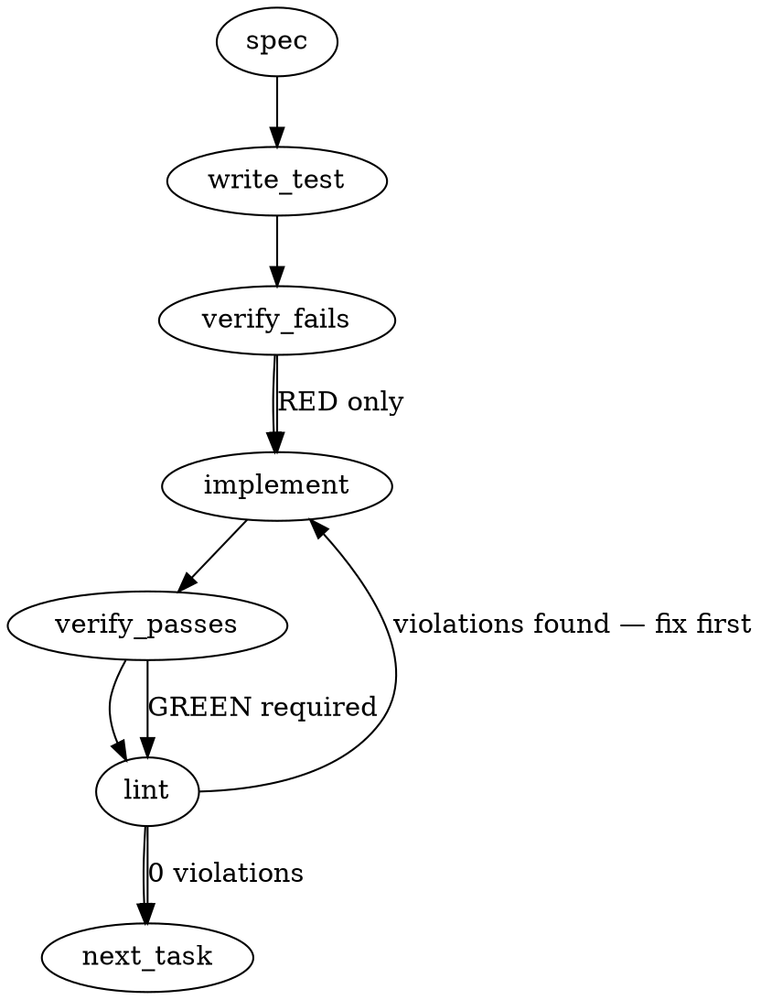

### Problem Statement

The `totem lesson extract` command currently mines all bot review findings blindly, regardless of whether the developer accepted or declined them in the PR. This causes "prescription laundering," where refuted findings (false positives) are extracted verbatim and compiled into system lessons, enforcing hallucinatory architectural constraints.

### Architectural Context

- **Prescription Laundering (Issue #2124):** A hallucinated mechanism regarding `LanceDB/Arrow` nulls was declined by a developer with a code citation, but the extraction pipeline ignored the decline and converted the bot's false premise into doctrine.
- **Bot Adapters & Parsing:** The system extracts systemic lessons from resolved bot review comments. As seen in the context for `packages/cli/src/commands/review-learn.ts`, this relies on `extractResolvedBotFindings` and the `GitHubCliPrAdapter`.

### Files to Examine

1. `packages/cli/src/commands/review-learn.ts` — Contains the orchestration logic (`reviewLearnCommand`) that calls `extractResolvedBotFindings`. This is where filtering of declined findings must be enforced.
2. `packages/cli/src/adapters/github-cli-pr.ts` — Underlying adapter fetching the PR comments. Review to understand the shape of the raw comment payload.
3. The module exporting `extractResolvedBotFindings` (likely located via imports in `review-learn.ts`, e.g., `packages/core/src/extract/bot-findings.ts`) — The parsing logic that must be updated to read the disposition table.

### Technical Approach & Contracts

**Recommendation: Parse Disposition Table & Filter (Skip by Default)**
While it is tempting to pass declined findings to the LLM to invert them into anti-lessons, doing so introduces a high risk of "negation hallucination" where the LLM accidentally re-asserts the false premise. The safest deterministic approach is to **skip declined findings entirely** from the extraction payload, while logging the citation/rationale to `stdout` so human reviewers are aware.

**Data Contracts:**
Update the return type of `extractResolvedBotFindings` (e.g., `BotFinding`) to include disposition state:

```typescript
export const DispositionSchema = z.enum(['accepted', 'declined', 'pending', 'unknown']);
export type Disposition = z.infer<typeof DispositionSchema>;

export interface BotFinding {
  // Existing fields...
  body: string;
  // New fields:
  disposition: Disposition;
  dispositionRationale?: string;
}
```

**Sequence Logic:**

1. Fetch PR comments via `GitHubCliPrAdapter`.
2. Locate the bot's summary comment containing the "trap ledger" or "round-comment dispositions table".
3. Parse the Markdown table. Map each finding to its disposition column (`Accepted`, `Declined`) and rationale column.
4. When iterating over findings, assign the `disposition` and `dispositionRationale`. If no table is found (legacy comments), default to `unknown` (which behaves like `accepted` if the thread is resolved, preserving legacy behavior).
5. In `reviewLearnCommand`, filter the list: `findings.filter(f => f.disposition !== 'declined')`.
6. Print a CLI warning for skipped findings: `Skipped declined finding: [Rationale]`.

### Edge Cases & Traps

- **Markdown Table Variance:** Bot-generated markdown tables may have inconsistent whitespace, missing leading/trailing pipes (`|`), or varying case (`Declined` vs `declined` vs `DECLINED`). The parsing regex/logic must be resilient to spacing and case.
- **Legacy Comments:** PRs merged before the disposition table feature was added (#2038) won't have a ledger. The parser must not crash; it should fall back to treating resolved comments as `unknown` or `accepted`.
- **Row Mapping:** Ensure the parsed disposition accurately maps to the correct finding. If the table references findings by ID or summary, the matching logic must be robust (e.g., matching via finding ID or exact string prefixes).

### Implementation Tasks

- [ ] **Task 1: Update Bot Finding Data Contracts**
  - Modify the `BotFinding` interface (or equivalent) in the module containing `extractResolvedBotFindings`.
  - Add `disposition: 'accepted' | 'declined' | 'pending' | 'unknown'` and `dispositionRationale?: string`.
  - Update the corresponding mock data in the test files to satisfy the new types.
    > TEST DIRECTIVE: Before implementing, write a failing test named `fails typecheck when disposition fields are missing on BotFinding mock` (or equivalent type-check verification if using internal typing tests).
  - write test (or update existing) → verify fails → implement → verify passes → lint

- [ ] **Task 2: Implement Disposition Table Parsing**
  - Locate `extractResolvedBotFindings` implementation.
  - Implement parsing logic to extract the trap ledger/disposition table from the raw comment markdown.
  - Map the parsed disposition state (`declined`, etc.) and rationale to the specific finding.
  - Handle the edge case where the table is entirely missing (return `unknown`).
    > TEST DIRECTIVE: Before implementing, write a failing test named `extracts declined disposition and rationale from markdown trap ledger` that provides a mock bot comment with a markdown table containing a "Declined" row.
  - write test (or update existing) → verify fails → implement → verify passes → lint

- [ ] **Task 3: Filter Declined Findings in Orchestrator**
  - Modify `packages/cli/src/commands/review-learn.ts` (`reviewLearnCommand`).
  - Filter the array returned by `extractResolvedBotFindings` to exclude any finding where `disposition === 'declined'`.
  - Add a console/logger output identifying the skipped findings using their `dispositionRationale`.
    > TEST DIRECTIVE: Before implementing, write a failing test named `reviewLearnCommand drops findings with declined disposition from LLM payload` simulating a declined finding and ensuring it is not passed to the subsequent extraction logic.
  - write test (or update existing) → verify fails → implement → verify passes → lint

### Execution Flow (structural constraint)



### Verification (MANDATORY — do not skip)

Every implementation MUST end with these steps:

1. `totem lint` — deterministic rule check (zero LLM, ~2s). Fixes any violations.
2. `totem review` — AI-powered architectural review (~18s). Addresses any critical findings.
3. If using MCP, call `verify_execution` to confirm compliance before declaring the task done.

### Test Plan

- **Scenario 1:** Bot comment contains a disposition table with 1 Accepted and 1 Declined finding. Verify only the Accepted finding is passed to the LLM extractor.
- **Scenario 2:** Bot comment contains a declined finding with a markdown citation in the rationale (e.g., ``Declined: `sourceRepo` is constructor-injected``). Verify the extraction command logs this rationale to stdout and skips the finding.
- **Scenario 3:** Legacy bot comment without a disposition table. Verify extraction behaves normally, treating the findings as `unknown`/`accepted` so legacy extractions don't break.
- **Scenario 4:** Case and whitespace resilience. Table contains `|   declined  |` instead of `| Declined |`. Verify parsing correctly normalizes to `declined`.

## Implementation Design

### Scope

Make `totem review-learn` (the `lesson extract` path) skip bot findings the developer **declined**, so refuted findings never reach the LLM lesson-extractor. It will NOT invert declines into "anti-lessons" (negation-hallucination risk), will NOT add structured reason-codes (that is #2038), and will NOT touch the compile path (frozen).

**This PR = Surface A ONLY** (per strategy ruling 2026-06-08T1754Z). Surface B (round-comment table) is **deferred** — see "Strategy ruling" below.

### Strategy ruling (2026-06-08T1754Z) — resolves all 3 open questions

- **Q1 (phasing): Surface A ships now as its own PR; do NOT unify.** It's guard-before-resume / pre-positioning, not live-catching (extract-mining is frozen behind the spine) — never stall a ready zero-dep guard behind a doctrine round.
- **#2038 decouple CONFIRMED** (operator-ratified): ship off existing signals now; #2038 reason-codes are independent enrichment off the critical path. **Requirement: the skip MUST emit an auditable breadcrumb** (which finding skipped + which signal matched) — not a silent skip. Rationale: Tenet 13 disposition-completeness + it gives #2038's codes a real anchor to backfill onto.
- **Q3 (doctrine coupling): strategy owns the contract.** Strategy lands the §8.1 format as a `bot-protocols.md` doctrine edit (pins columns + Class enum + adds a **stable finding-key** so matching stops being fuzzy; that key seeds the disposition-ledger schema).
- **Surface B reshaped + deferred.** Two corrections: (1) the decline signal is the **`Class`** column (enum `decline-stylistic | decline-substantive | decline-hallucination`), **NOT** `Action: Declined` (Action is free prose). (2) `Finding` is free prose with no stable id → fuzzy matching. So Surface B's right consumer is the **474-phase-2 disposition-ledger** (native finding-identity), NOT a throwaway table-regex. **Q2 is therefore moot** (no fuzzy matching). Surface B gates on 474 phase-2.
- **My follow-through:** when I scope #2038, author its reason-codes to the **`decline-*`** vocabulary (same taxonomy as the Class enum + ledger field — do not fork it).

### Key divergences from the generated spec (grounded in the real code)

1. Parser is `packages/cli/src/parsers/bot-review-parser.ts` (type `NormalizedBotFinding`), not `core/src/extract/bot-findings.ts`.
2. **The actual #2124/#2122 decline is not in the data `review-learn` currently fetches.** It pulls inline review comments (`fetchReviewComments`) + review bodies only. The consolidated **round-comment dispositions table** (doctrine § 8.1, where the GCA decline was recorded) is a PR **issue comment** — there is no `fetchIssueComments` on the adapter today. Two distinct decline surfaces:
   - **Surface A — thread pushback:** a human reply matching a pushback pattern. Already detected by the existing `extractPushbackFindings` (PUSHBACK_PATTERNS). Available now, no new fetch, no #2038.
   - **Surface B — round-comment dispositions table:** the `| Finding | Class | Action | Thread |` table with `Action = Declined`. Needs a new `fetchIssueComments` adapter method + table parse + finding↔row matching. This is the surface the original incident used.
3. **#2038 decoupling:** the skip works off `Action: Declined` (B) and pushback (A) — both exist today. #2038's reason-codes only enrich the _rationale_. So #2124 does NOT hard-depend on #2038; the proposed "#2038→#2124" sub-order loosens to "ship #2124 against existing signals; #2038 enriches later." (Revises the A2 sub-order — flag to strategy.)

### Data model deltas

- `NormalizedBotFinding` (existing): add `disposition: 'accepted' | 'declined' | 'unknown'` — writer: the extract fns; reader: `reviewLearnCommand` filter; invariant: required, defaults `unknown` when no signal. Add `dispositionRationale?: string` — optional decline reason, for the skip log.
- `DispositionSchema = z.enum([...])` — Zod at the parser boundary only.
- Per-run `Map<findingKey, {disposition, rationale}>` (Surface B) built from the parsed table, keyed by a normalized finding identifier (file+line, or summary prefix). Function-scoped, not persisted. No reserved keys/sentinels — dedicated field, not a magic value on `severity`.

### State lifecycle

All new state is **per-invocation** (one `review-learn` run): the disposition map is built after fetch, consumed immediately by the filter, never persisted or cached. No cross-lifecycle state. Mutation owned by the parser; the command only reads.

### Failure modes

| Failure                                             | Category       | Agent-facing surface  | Recovery                                                                                          |
| --------------------------------------------------- | -------------- | --------------------- | ------------------------------------------------------------------------------------------------- |
| Issue-comment fetch (Surface B) errors              | transient (gh) | warning               | degrade to Surface-A filtering only; log "dispositions table unavailable"                         |
| No dispositions table (legacy PR)                   | permanent      | silent (expected)     | all findings `unknown` → legacy behavior preserved (Tenet-4 OK: documented legacy path, no drift) |
| Table row unparseable / malformed                   | runtime        | warning               | skip that row, continue, warn count                                                               |
| Declined row cannot be matched to a fetched finding | runtime        | warning               | conservative bias — see Q2                                                                        |
| Accepted finding mis-flagged declined               | runtime        | warning (lost lesson) | stdout skip-line lets a human notice                                                              |

### Invariants to lock in via tests

- A finding whose thread carries a pushback reply never enters the LLM payload (A).
- A finding whose round-comment row reads `Action: Declined` never enters the payload (B).
- A legacy PR (no table, no pushback) extracts exactly as today — `unknown` behaves as `accepted`.
- An accepted/resolved finding is still extracted (no over-filtering).
- Table parsing is case/whitespace-insensitive (`|  declined |` == `| Declined |`).
- Every skipped declined finding emits a stdout line with its rationale (auditability).

### Open questions — ALL RESOLVED (see "Strategy ruling" above, 2026-06-08T1754Z)

- **Q1 (phasing)** → Surface A solo PR now; B deferred.
- **Q2 (unmatched row)** → moot; B consumes the 474-phase-2 ledger (native identity), not a fuzzy table-regex.
- **Q3 (doctrine coupling)** → strategy owns it; lands the §8.1 contract as a `bot-protocols.md` edit.

### Surface A build (this PR — concrete)

- `NormalizedBotFinding`: add `disposition: 'accepted' | 'declined' | 'unknown'` + optional `dispositionRationale?`.
- Signal: a resolved thread that ALSO carries a pushback reply (reuse the existing `extractPushbackFindings` / PUSHBACK_PATTERNS detection) → mark `declined`.
- `reviewLearnCommand`: filter `disposition === 'declined'` out of the LLM payload **before** prompt assembly.
- **Breadcrumb (required):** every skip emits an auditable line — the finding (file:line / body prefix) + which signal matched (`thread-pushback`) — to stdout/logger. Not silent.
- Tests: declined-pushback thread never enters payload; accepted/resolved still extracted; legacy (no pushback) unchanged; breadcrumb emitted per skip.
- Failure-mode / data-model rows above that pertain to **Surface B** (issue-comment fetch, table parse, fuzzy matching) are **out of scope for this PR**.
