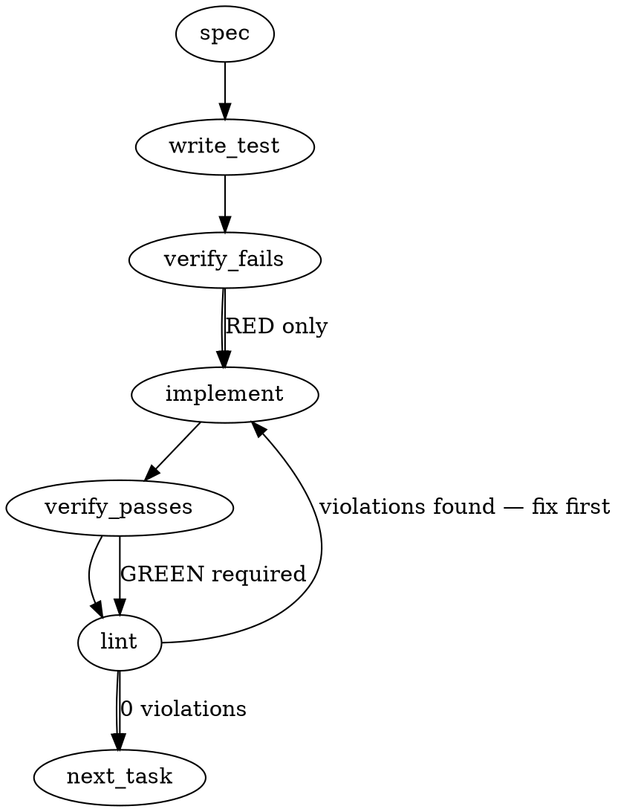

### Problem Statement

The parity doctor must be updated to parse four newly promoted optional manifest fields (manifestation, senses, vendor-adapter, repo-role-variance) while keeping the schema version at 1. We must also implement a local, non-throwing `capability-probe` detector family for specific configuration capabilities, and adjust the version-pinned detector to accurately reflect when it is falling back to a "declared" version rather than an installed one.

### Architectural Context

- **Proposal 296 & Settlement #605/#606**: Defines the newly promoted fields and the `capability-probe` constraints.
- **lesson-7d7f3d32 (Honest-Absent Mapping)**: Mandates that absent optional fields remain structurally absent in the AST. They must not be populated with synthetic defaults.
- **Detector Constraints**: Probes must be deterministic, local-execution only (zero network IO), and must never throw.

### Files to Examine

1. `packages/core/src/parity-manifest.ts` — Requires `ParityContract` Zod schema and type updates.
2. `packages/core/src/parity-detect.ts` — Target for the new `detectCapabilityProbeContract` and the fallback formatting update for `detectVersionPinnedContract`.
3. `packages/cli/src/commands/doctor-parity.ts` — CLI routing logic requires updates to dispatch based on the `manifestation` field and assert sanity checks against strategy.

### Technical Approach & Contracts

**1. Schema Updates (`ParityContract`)**
Update the Zod schema to include the additive fields without bumping `schema-version`.

```typescript
manifestation: z.enum(['correct-by-construction', 'managed-block', 'version-pin', 'attestation', 'capability-probe']).optional(),
senses: z.enum(['declared', 'present', 'loaded', 'usable']).optional(),
'vendor-adapter': z.string().optional(),
'repo-role-variance': z.string().optional()
```

**2. Probe Implementation**
Implement `detectCapabilityProbeContract(contract, cwd)` returning a standard `Verdict` (`pass`, `warn`, `skip`, `unknown`).

- Switch on `contract.id`.
- For `knowledge-search-access` / `claude-settings-minimum-capability`: Perform local configuration or file existence checks.
- If execution is required, **must** use the shared `safeExec` helper with a strict timeout.
- Wrap all FS or execution logic in `try/catch` to guarantee it never throws.

**3. Declared-Floor Verdict**
Modify `detectVersionPinnedContract`. Identify the execution path where no resolved install is found and it falls back to `semver.minVersion(declaredRange)`. The resulting message must be explicitly prefixed/formatted as `declared: <version>` rather than just `<version>`, preventing false positives where the user believes the version is installed.

**4. CLI Routing & Sanity Checks**
Update `checkParity`. Before routing by `contract.id`, check `contract.manifestation`.

- If `capability-probe`, route to `detectCapabilityProbeContract`.
- Implement build-time sanity checks (e.g., if `id === 'pnpm-engine-version'`, assert `senses === 'declared'`). Flag contradictions to strategy via a console warning or Totem diagnostic, do not silently diverge or mutate the AST.

### Edge Cases & Traps

- **Zod Default Trap**: Applying `.default()` to the new Zod fields violates `lesson-7d7f3d32`. Use `.optional()` only.
- **Network Probes**: Any probe that inadvertently triggers a network request (e.g., triggering a lazy install or update check via CLI tools) violates strict constraints. Use `--offline` flags or equivalent if probing via `safeExec`.
- **Honest-Absent Routing**: Older contracts or existing manifests will lack `manifestation`. The CLI router must gracefully fall back to existing id-based heuristic routing if `manifestation` is `undefined`.
- **Semver Min-Version Failures**: `semver.minVersion` can return `null` if the declared range is malformed or purely abstract. The declared-floor fallback must handle `null` safely (e.g., falling back to `unknown` or `warn` instead of crashing).

### Implementation Tasks

- [ ] **Task 1: Implement Promoted Schema Fields**
  - Modify `packages/core/src/parity-manifest.ts`. Add `manifestation`, `senses`, `vendor-adapter`, and `repo-role-variance` to the `ParityContract` schema.
  - Modify `packages/core/test/parity-manifest.test.ts` to cover the new fields.
    > TOTEM INVARIANT (Honest-Absent Mapping): Ensure missing fields parse to `undefined` without injecting default keys. Use `.optional()` without `.default()`.
    > TEST DIRECTIVE: Before implementing, write a failing test named `respects honest-absent mapping for promoted optional fields` that proves omitted fields are not populated with default string values in the parsed result.
  - write test → verify fails → implement → verify passes → lint

- [ ] **Task 2: Implement Capability Probe Detector**
  - Modify `packages/core/src/parity-detect.ts`. Create `detectCapabilityProbeContract`.
  - Add strict local-exec checks for `knowledge-search-access` and `claude-settings-minimum-capability`. Use `safeExec` if CLI invocation is needed.
  - Modify `packages/core/test/parity-detect.test.ts`.
    > TEST DIRECTIVE: Before implementing, write a failing test named `capability probe gracefully handles and warns on execution exceptions` that mocks a throwing `fs` or `safeExec` call and asserts it returns a `warn` or `unknown` verdict rather than throwing.
  - write test → verify fails → implement → verify passes → lint

- [ ] **Task 3: Enforce Declared-Floor Verdict Format**
  - Modify `detectVersionPinnedContract` in `packages/core/src/parity-detect.ts`.
  - When returning `semver.minVersion(declaredRange)` as a fallback, format the verdict message to explicitly include the word `declared:` (e.g., `declared: ^1.2.0`).
  - Modify `packages/core/test/parity-detect.test.ts`.
    > TEST DIRECTIVE: Before implementing, write a failing test named `formats version fallback message with declared floor prefix` to prove that uninstalled targets render the `declared:` prefix.
  - write test → verify fails → implement → verify passes → lint

- [ ] **Task 4: CLI Routing and Strategy Sanity Checks**
  - Modify `checkParity` in `packages/cli/src/commands/doctor-parity.ts`.
  - Route contracts with `manifestation === 'capability-probe'` to the new detector.
  - Add sanity check logic to flag (warn) if `pnpm-engine-version` does not have `senses: declared` or if `ecl-conventions` is not `manifestation: correct-by-construction`.
  - Modify `packages/cli/test/doctor-parity.test.ts`.
  - write test → verify fails → implement → verify passes → lint

### Execution Flow (structural constraint)



### Verification (MANDATORY — do not skip)

Every implementation MUST end with these steps:

1. `totem lint` — deterministic rule check (zero LLM, ~2s). Fixes any violations.
2. `totem review` — AI-powered architectural review (~18s). Addresses any critical findings.
3. If using MCP, call `verify_execution` to confirm compliance before declaring the task done.

### Test Plan

1. **Schema Integrity:** Provide a payload with all 4 new fields; verify exact extraction. Provide a payload missing all 4 fields; verify `schema-version` is 1 and the 4 fields are strictly `undefined`.
2. **Capability Constraints:** Force an invalid/missing path for the capability targets; assert the detector returns `skip` or `warn` instead of crashing the doctor run.
3. **Verdict Fallback Format:** Run a version-pin test against a non-existent package with a range `>=2.0.0`; assert the output string contains `declared:`.
4. **Sanity Check Logging:** Feed a synthetic contract for `pnpm-engine-version` mapped to `senses: loaded`; assert the CLI outputs a strategy contradiction warning.

## Implementation Design

### Scope

Parse the four promoted optional manifest fields into `ParityContract`, add a `detectCapabilityProbeContract` core detector + CLI probe registry routing `manifestation: capability-probe` rows (both deliverable-1 rows), and split the version-resolution helper so the minVersion fallback renders as a `declared`-level claim. This will NOT: bump `schema-version`; implement hardcoded per-id classification sanity-asserts in the CLI (deviation from the generated spec — that's a Tenet-20 mirror of strategy's classification that would drift; the sanity check is performed as build-time review instead, results recorded in the PR); implement the `usable`-rung live-search exec for `knowledge-search-access` (see Open Questions); touch any other stub contract.

### Data model deltas

- **`ParityContract` gains 4 optional fields** (core, `parity-manifest.ts`): `manifestation?: string`, `senses?: string`, `vendorAdapter?: string[]`, `repoRoleVariance?: string`. Written by `mapContract` (parse boundary only), read by CLI routing (`manifestation`) and verdict messages (`senses`). Invariant: absent stays structurally absent (lesson-7d7f3d32, no `.default()`).
- **Validation posture — deliberately NOT closed enums.** Raw-schema fields are max-tolerance (`z.unknown().optional()`), narrowed in `mapContract`: string-typed fields keep string values; `vendor-adapter` accepts `string[]` or single `string` (normalized to array); any other shape → field treated as absent. Rationale: a closed enum on a new field re-creates the manifest-wide total-outage trap this round was settled around (one future rung value → all 26 contracts dark) — same precedent as the deliberately-unvalidated `last-attested`. Recognized values are exported as const tuples (`PARITY_MANIFESTATIONS`, `PARITY_SENSES`) for routing narrowing; an unrecognized `manifestation` value routes to the existing stub path WITH the verbatim value in the line (fail-loud per row, never per manifest).
- **`CapabilityProbe` descriptor** (CLI-side registry → core detector context): `{ kind: 'settings-floor' | 'mcp-registration', path, lineName, ... }` + injectable `readFile` seam, mirroring the existing `MechanicalArtifact`/`GeneratedArtifact` split (core = pure verdict logic, CLI = wiring).
- **`resolveInstalledVersion` return splits** to `{ version, source: 'installed' | 'declared-min' } | undefined`. Read by both `detectVersionPinnedContract` and `detectManualAttestationContract` message builders. No reserved keys or sentinels anywhere.

### State lifecycle

None. All detectors stay pure, side-effect-free, read-from-scratch per call (existing invariant). The probe registry is a pure function of `(contractId, gitRoot)`. No new module state, caches, or flags.

### Failure modes

| Failure                                                                                                | Category        | Agent-facing surface                                                                  | Recovery                       |
| ------------------------------------------------------------------------------------------------------ | --------------- | ------------------------------------------------------------------------------------- | ------------------------------ |
| `.claude/settings.json` absent                                                                         | runtime         | `pass` (contract: floor is "not suppressed", absent = pass)                           | n/a — by design                |
| `.claude/settings.json` unreadable/unparseable JSON                                                    | runtime         | `unknown` + remediation (can prove neither suppression nor floor; never self-certify) | fix the JSON, re-run           |
| settings explicitly suppress floor (`disableAllHooks: true`, totem server in `disabledMcpjsonServers`) | runtime         | `warn` + remediation naming the key                                                   | remove the suppression         |
| `.mcp.json` absent (knowledge-search-access present rung)                                              | runtime         | `warn` — no registered query path (the row's whole point)                             | `totem init` / register server |
| `.mcp.json` present, no totem server entry                                                             | runtime         | `warn`                                                                                | register server                |
| `.mcp.json` unparseable                                                                                | runtime         | `unknown`                                                                             | fix JSON                       |
| unrecognized `manifestation` value on a row                                                            | init (manifest) | per-row stub line carrying the verbatim value — loud, never manifest-wide             | strategy fixes the row         |
| mis-shaped promoted field (e.g. numeric senses)                                                        | init (manifest) | field narrowed to absent; row still senses under existing routing                     | strategy fixes the row         |
| minVersion fallback fires (no installed copy)                                                          | runtime         | verdict message renders `declared`-level claim explicitly (the settled constraint)    | install deps                   |
| probe row in repo where `consumers` excludes it                                                        | runtime         | `skip` cohort-permits-absence (shared guard)                                          | n/a                            |

No silent-degradation rows. The mis-shaped-field narrowing is render/routing metadata only (never a verdict input), same claim-class as `last-attested`.

### Invariants to lock in via tests

- A manifest omitting all four fields parses with the four keys structurally absent (no `undefined`-valued keys, no defaults).
- A manifest with an unknown `manifestation` value (e.g. `quantum-entanglement`) still parses ALL contracts; that row renders a stub line containing the verbatim value.
- `vendor-adapter` as YAML list parses to `string[]`; as bare string normalizes to one-element array; as number narrows to absent without failing the manifest.
- `claude-settings-minimum-capability`: absent settings file → `pass`; `disableAllHooks: true` → `warn`; totem server in `disabledMcpjsonServers` → `warn`; unparseable JSON → `unknown`; detector never throws on any input.
- `knowledge-search-access`: `.mcp.json` with a totem MCP server entry → `pass` at the probed (present) level, message states the probed level explicitly (NOT a usable-level claim — the §6(a)3 scoping); absent/unregistered → `warn`.
- Version-pinned pass AND warn verdicts distinguish resolved-install from minVersion-fallback in the message; the fallback path renders `declared` and never reads as installed-level. Same for the manual-attestation `installed X` text.
- Probe verdicts are `pass|warn|skip|unknown` only — never `fail` (CLI edge owns promotion), never `info`.
- Routing precedence: `manifestation: capability-probe` is checked before tractability dispatch; a capability-probe row with no registered probe gets an honest "probe not yet implemented" skip stub.
- Fielded-doctor regression: the promoted 26-contract manifest loads with zero behavior change for all 24 existing rows (the CR cross-repo claim, now locked locally).

### Review fold (totem-codex 0701Z spec review — all findings adopted)

- **W1 confirmed:** the generated scaffold's top half (closed enums, `vendor-adapter: z.string()`) is superseded — this Implementation Design section is authoritative. `z.string()` would reject the live `vendor-adapter: [claude]` list outright.
- **W2 confirmed:** no runtime per-id classification asserts (Tenet-20 mirror); build-time review only.
- **W3 adopted — the green-halo cap, generalized:** a presence-only probe must never render an ordinary PASS on a row that declares `senses: usable`. Each probe descriptor carries its `probedLevel`; the detector compares against the row's declared `senses:` — **when probedLevel < declared, the verdict is capped at `unknown`** ("manifest declares usable; this probe proves present only — usable unprovable under the §12.5 no-network constraint"), never `pass`. A failed present rung is still `warn` (if present fails, usable certainly fails — provable drift). This is a generic guard derived from the descriptor, not row-specific hardcoding; when strategy downshifts the row's `senses:` (or a no-network usable probe becomes possible), the same probe renders `pass` with no code change.
- **I1 adopted:** the declared-min fallback message carries the originating range (`declared-min 1.53.0 from range ^1.53.0`), both call sites.
- **I2 adopted:** tests are co-located (`packages/core/src/*.test.ts`, `packages/cli/src/commands/*.test.ts`) — no new test roots.

### Open questions

- **Question (RESOLVED via codex W3 — pending user approval):** `knowledge-search-access` declares `senses: usable` but the usable-rung exec networks (query embedding via Gemini API), contradicting §12.5's never-network constraint.
  - **Settled shape:** ship the present rung; verdict capped at `unknown` while probedLevel < declared (see Review fold); dispatch the rung contradiction + row-downshift question (`senses: usable` → `present` until a no-network usable probe exists) to strategy after the build.
- **Question:** Apply the declared-level rendering to the manual-attestation vendor-SDK `info` path too (it shares `resolveInstalledVersion`)?
  - **Options:** yes (one shared helper, consistent honesty) / no (strictly only the ruled version-pinned surface).
  - **Recommendation:** Yes — same fallback, same honesty gap, one helper.
- **Question:** For the settings floor probe, which totem MCP server name(s) count? Hardcode known names vs derive from `.mcp.json` entries.
  - **Options:** derive (suppression check = any `.mcp.json` server whose command references totem, cross-checked against `disabledMcpjsonServers`) / hardcode `totem-dev` etc. (a mirror).
  - **Recommendation:** Derive from `.mcp.json`; with no `.mcp.json`, the MCP half is vacuous (nothing to suppress) and only the hooks half applies.
