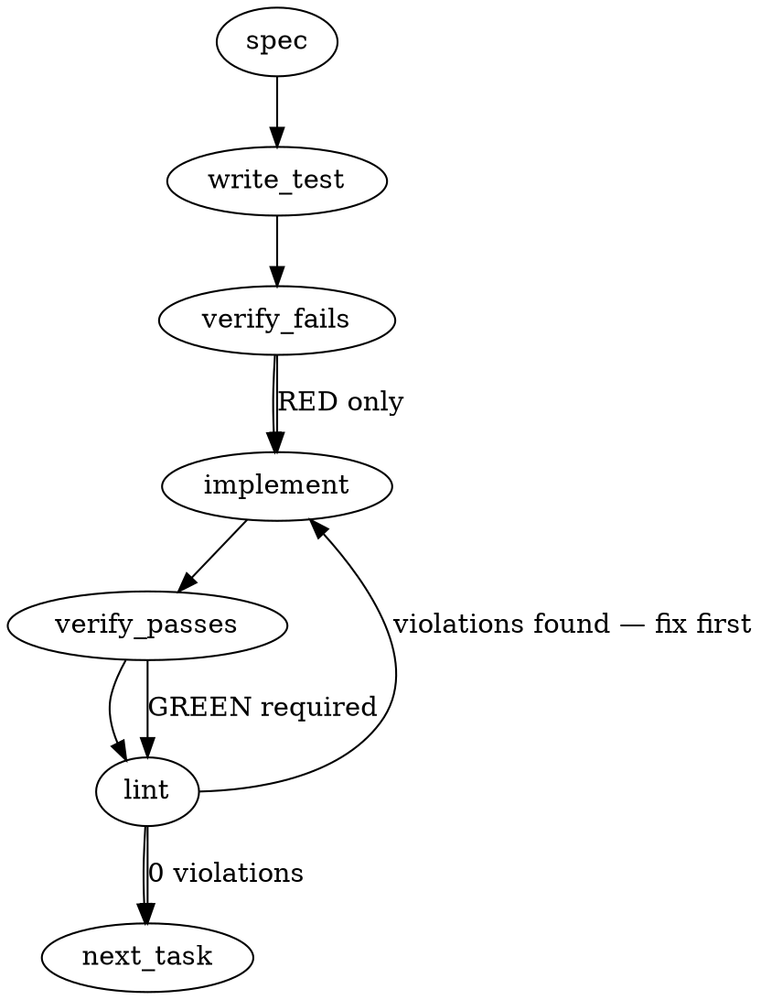

### Problem Statement

Incremental syncs advance their git baseline before fully committing deletion operations, creating a race condition (often triggered by background git hooks) where deleted files are permanently orphaned in the vector database. Furthermore, files added to an ignore list after being indexed are currently ignored during incremental diffs, meaning their existing chunks are never purged.

### Architectural Context

The provided context outlines how `post-merge` and `post-checkout` hooks trigger automatic background re-indexing (`totem sync`). This background execution model is precisely what exposes the race condition if a user initiates another command or operation concurrently.

### Files to Examine

1. `packages/core/src/ingest/pipeline.ts` — Contains `runSyncInner` which controls the incremental sync workflow, diff reading, and baseline advancement.
2. `packages/cli/src/commands/install-hooks.ts` — Contains the hook templates (`buildPostCheckoutHookContent`, `buildHookContent`), serving as the trigger mechanism that surfaced this race condition.

### Technical Approach & Contracts

We will adopt the **Working Tree Reconciliation** approach (Shape 1), combined with **Transactional Baseline Advancement** (Shape 2) as defense-in-depth.

1. **Reconciliation (Self-Healing):** Instead of relying purely on `git diff` to determine deletions, `runSyncInner` will cross-reference the discovered valid files (working tree minus ignored files) against the distinct file paths currently stored in the vector database.
2. **Contract Addition:** The vector store interface (used inside `pipeline.ts`) requires a new data contract method: `getDistinctPaths(): Promise<string[]>`. This must return a deduplicated array of all source file paths currently possessing chunks in the database.
3. **Data Contract (Diff Window):**
   ```typescript
   interface SyncReconciliationState {
     discoveredPaths: Set<string>; // Valid on-disk paths (not ignored)
     indexedPaths: Set<string>; // Pulled from getDistinctPaths()
     orphans: string[]; // indexedPaths - discoveredPaths
   }
   ```
4. **Transactional Ordering:** The baseline SHA update (`config.setBaseline(...)` or equivalent DB store of the sync marker) will be moved to the absolute bottom of `runSyncInner`, occurring _only_ after all chunk deletions, insertions, and DB commits have succeeded.

### Edge Cases & Traps

- **Path Normalization:** Discovered paths and indexed paths must use the same format (e.g., repository-relative, normalized forward slashes) before comparison, or Windows users will experience massive false-positive deletions and re-insertions.
- **Ignore List Additions:** A file transitioning from "tracked" to "ignored" will vanish from the valid working tree walk but still exist in `indexedPaths`. The reconciliation set-difference logic naturally solves this, but it MUST be explicitly tested.
- **Memory/OOM Trap:** `getDistinctPaths()` must map to a `DISTINCT` query or projection in LanceDB, not a `SELECT *` that pulls all vector embeddings into memory.

### Implementation Tasks

- [ ] **Task 1: Vector Store Distinct Paths Contract**
  - Modify the vector store abstraction (the class injected or instantiated in `pipeline.ts`) to add the `getDistinctPaths(): Promise<string[]>` method.
  - Implement the LanceDB (or active DB) query to return only unique string paths.
  - write test (or update existing) → verify fails → implement → verify passes → lint

- [ ] **Task 2: Working Tree Reconciliation Logic**
  - Modify `packages/core/src/ingest/pipeline.ts`.
    > TEST DIRECTIVE: Before implementing, write a failing test named `purges orphaned chunks when a previously indexed file is deleted from disk or newly ignored` that proves the regression is caught.
  - Inside `runSyncInner`, after the full file discovery phase completes (which yields valid, non-ignored paths), call `getDistinctPaths()`.
  - Calculate `orphanedPaths` by filtering `indexedPaths` that are not present in the discovered file set.
  - Call the vector store's deletion method for all `orphanedPaths` before processing new insertions.
  - write test (or update existing) → verify fails → implement → verify passes → lint

- [ ] **Task 3: Transactional Baseline Advancement**
  - Modify `packages/core/src/ingest/pipeline.ts`.
    > TEST DIRECTIVE: Before implementing, write a failing test named `does not advance git baseline SHA if chunk deletion or insertion throws an error` that proves the regression is caught.
  - Relocate the logic that records the new git baseline commit SHA. Move it from the beginning/middle of `runSyncInner` to the very end, strictly after the reconciliation deletions and incremental inserts have successfully committed.
  - write test (or update existing) → verify fails → implement → verify passes → lint

### Execution Flow (structural constraint)



### Verification (MANDATORY — do not skip)

Every implementation MUST end with these steps:

1. `totem lint` — deterministic rule check (zero LLM, ~2s). Fixes any violations.
2. `totem review` — AI-powered architectural review (~18s). Addresses any critical findings.
3. If using MCP, call `verify_execution` to confirm compliance before declaring the task done.

### Test Plan

- **Scenario 1:** Run full sync. Delete a file. Run incremental sync. Verify the deleted file's chunks are removed from the vector database and `getDistinctPaths()` no longer includes it.
- **Scenario 2:** Run full sync. Add an existing, indexed file to `.totemignore`. Run incremental sync. Verify the newly-ignored file's chunks are purged entirely.
- **Scenario 3 (Transactional):** Mock the vector store to throw an error during deletion. Run an incremental sync over a deleted file. Ensure the command throws, and verify the git baseline SHA remains at the old commit, preventing the skip-race.

---

## Implementation Design

> Builds on the auto-generated body above (accurate this round — it had real code grounding). Two refinements verified against `runSyncInner`: (a) the diff-driven **re-embed** set stays diff-scoped — only **deletion** moves to reconciliation; (b) the body's "Transactional Baseline" task is already satisfied — `writeSyncState` is the last write, after purge + insert, and a failure throws before it, so no relocation is needed.

### Scope

In `runSyncInner` (incremental path), derive the purge set by **reconciling indexed paths against the working tree** instead of from the git diff window: `orphans = getDistinctPaths() − allFiles`. This self-heals deletions, renames-into-ignored-dirs, newly-ignored files, and de-targeted files regardless of baseline history. It will NOT change the diff-scoped re-embed set (`filesToProcess` stays git-diff-driven — we do not re-chunk the whole tree each sync), will NOT add a lock/transaction, will NOT relocate the baseline write (already last), and will NOT touch the hooks or MCP layer.

### Data model deltas

- New method `LanceStore.getDistinctPaths(): Promise<string[]>` — the deduped set of `filePath`s in the store, via a `select(['filePath'])` projection (NOT `SELECT *` — the bounded pattern `manifestDocuments` already uses). No new persisted fields, types, or module state. Writer: none (read-only). Reader: `runSyncInner`.
- Reuses the existing `deleteByFile(path)` to purge — no new deletion primitive.

### State lifecycle

Per-sync-invocation only. `indexedPaths` / `orphans` are local to one `runSyncInner` call: computed after file discovery, consumed by the purge loop, discarded. No persistence, no cross-call state.

### Failure modes

| Failure                           | Category          | Surface                                        | Recovery                                                                       |
| --------------------------------- | ----------------- | ---------------------------------------------- | ------------------------------------------------------------------------------ |
| `getDistinctPaths()` read throws  | runtime/transient | warn + skip reconciliation this run (no purge) | next successful sync reconciles; no data loss, no false purge                  |
| `deleteByFile(orphan)` throws     | runtime           | warn-and-continue (existing behavior)          | next sync retries (purge is idempotent)                                        |
| purge succeeds, then insert fails | runtime           | the error throws                               | `writeSyncState` not reached → baseline holds → next sync re-runs (idempotent) |

No silent degradation: an orphan set that cannot be computed is logged, and the baseline never advances on a failed run.

### Invariants locked by tests

- A previously indexed file deleted from disk is purged on the next incremental sync even when the git diff window is empty (the #2151 case).
- A previously indexed file newly added to the ignore list (or whose target is removed from config) is purged on the next incremental sync.
- Lessons/specs/code that still exist as configured targets are NOT purged (they are in `allFiles`).
- Path comparison is format-stable: indexed `filePath` and `allFiles` relativePath are both forward-slash-normalized, so no false orphan on win32.
- The diff-scoped re-embed set is unchanged — only changed files are re-chunked.
- The baseline (`writeSyncState`) advances only after purge + insert complete.

### Open questions — resolved by recommendation

- **Q1 — replace or augment the diff-derived deletion?** Replace: reconciliation subsumes it (a deleted indexed file is an orphan), and the diff-derived set wasted `deleteByFile` calls on non-indexed paths. Rec: replace.
- **Q2 — reconcile every incremental sync, or gate it?** Every sync — the projection is cheap (a few thousand short strings, same cost as the manifest walk), and "every run self-heals" is exactly the property the issue asks for. Rec: every.
- **Q3 — behavior if `getDistinctPaths()` fails?** Warn + skip the purge that run (no false purge, no sync failure), matching the existing `deleteByFile` warn-and-continue posture. Rec: warn + skip.

---

## Cohort review folds (2026-06-14)

Pre-build review (codex / gemini / agy) — 3/3 conditional pass; all folded:

- **W1 (codex):** compare on a separator-normalized key but DELETE via the raw stored path. `getDistinctPaths()` returns raw paths; `computeOrphanPaths` normalizes only for set membership. Prevents false-purge of legacy backslash rows and keeps `deleteByFile` matching the stored literal.
- **Tenet 20 (gemini):** a purge-only sync (`totalChunks === 0`) now also rebuilds the FTS index, so FTS drops the orphaned files' content. (`index-manifest.json` already rebuilds from the store each sync.)
- **Tenet 4 (gemini + codex):** the run reports `orphansPurged` (return field + a summary log line); a path is logged as purged only when reconciliation actually found it orphaned.
- **W2 (codex) + agy scenarios:** tests cover the empty-diff class (orphan found from indexed-vs-live alone), rename-into-ignored (#624), de-targeting, and mixed re-embed+purge; `filesToProcess` stays diff-scoped.
- **agy optimization:** reconciliation runs only on the incremental path; a full sync `reset()`s, so there is no wasted query.
- **I1 (codex):** baseline (`writeSyncState`) advances only after purge + insert + FTS succeed; the trailing metadata/manifest writes are not orphan sources.
