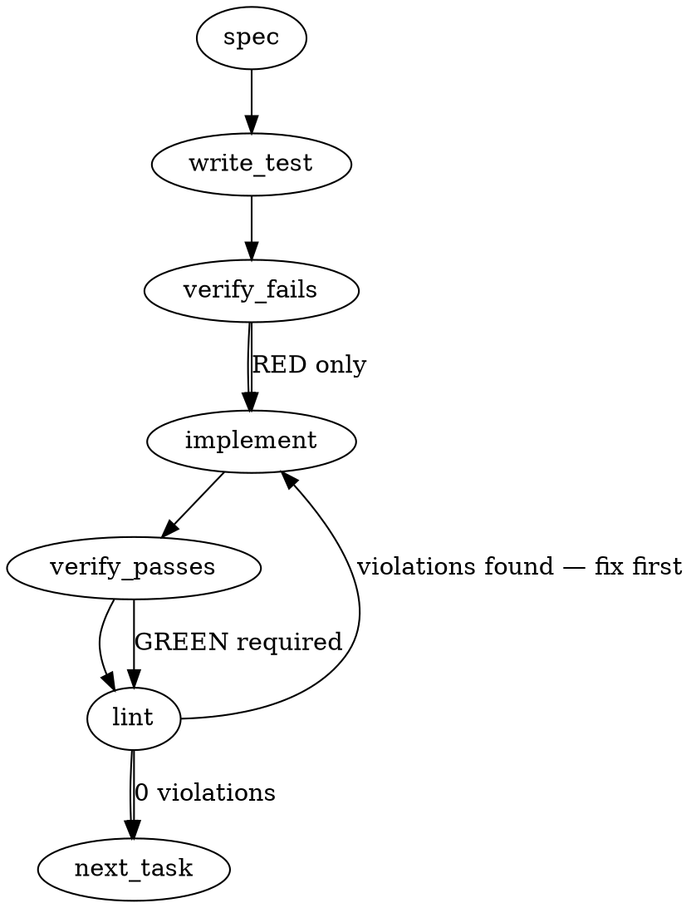

### Problem Statement

On Windows hosts, spawning bare `bash` outside of an MSYS or Git-hook context can inadvertently resolve to WSL's bash (`C:\Windows\System32\bash.exe`), which fails to understand Windows file paths (`D:\...`). To ensure local test environments perfectly mirror the reliability of Git hook contexts, we need a single, memoized Git-Bash path resolver exported from core, and all repo tooling must consume this resolver instead of invoking bare `'bash'`.

### Architectural Context

None found in provided context.

### Files to Examine

1. `packages/cli/src/commands/pre-compact-hook.test.ts` — Fails on Windows under plain PowerShell because it spawns bare `bash`. Look at how bash is executed.
2. `packages/cli/src/commands/shield.content-hash-parity.test.ts` — Also suffers from the bare bash trap.
3. `packages/core/src/index.ts` — Central export file for `@mmnto/totem` where the new resolver will be exposed.

### Technical Approach & Contracts

We will implement a memoized Git-Bash resolver in `@mmnto/totem` (core) and migrate the offending test files to use it.

**Data Contract & Interface:**

```typescript
// packages/core/src/bash-resolver.ts
export function resolveBash(): string;
export function _clearBashResolverCacheForTesting(): void;
```

**Sequence Logic:**

1. **Memoization Check:** If the path is already cached in module scope, return it immediately to avoid expensive OS shelling.
2. **Platform Gate:** If `os.platform() !== 'win32'`, cache and return `'bash'`.
3. **Primary Resolution (`git --exec-path`):**
   - Execute `safeExec('git', ['--exec-path'])` and `.trim()` the result.
   - Typically returns `<GitRoot>/mingw64/libexec/git-core` (or `mingw32`).
   - Traverse up three directories (`../../..`) to reach the Git root.
   - Probe for `bin/bash.exe` and `usr/bin/bash.exe` using `fs.existsSync`. If found, cache and return.
4. **Fallback Probes:**
   - If the `git` command fails or paths are missing, fallback to probing the conventional install: `C:\Program Files\Git\bin\bash.exe`.
   - If all probes fail, default to `'bash'` and let the underlying execution environment handle the crash (or rely on a globally correct PATH).

### Edge Cases & Traps

- **Performance / Caching Trap:** `git --exec-path` involves shelling out to a subprocess. If invoked inside a test assertion loop, it will severely degrade test suite performance. Module-level memoization is absolutely mandatory.
- **`safeExec` Throwing:** If Git is not installed or not in PATH, `safeExec` will throw an error. The invocation must be wrapped in a `try/catch` block that swallows the error and proceeds to the conventional fallback probes.
- **Test Pollution:** Because the resolver memoizes state at the module level, testing the fallback branches will require exporting an internal `_clearBashResolverCacheForTesting()` function so tests don't bleed into each other.
- **Path Traversal Safety:** The output from `git --exec-path` can contain forward or backward slashes depending on how Git was built. Using `path.resolve(execPath, '../../..')` is required to normalize the path safely across environments before appending `bin/bash.exe`.

### Implementation Tasks

- [ ] **Task 1: Implement the Bash Resolver Utility**
  - Create `packages/core/src/bash-resolver.ts` and `packages/core/src/bash-resolver.test.ts`.
  - Export `resolveBash` and `_clearBashResolverCacheForTesting`.
  - Use `safeExec` imported from `@mmnto/totem` for the `git --exec-path` call.
    > TEST DIRECTIVE: Before implementing, write a failing test named `caches the resolution result so git is only invoked once` that proves multiple calls to `resolveBash` on win32 only trigger `safeExec` once.
  - write test → verify fails → implement → verify passes → lint

- [ ] **Task 2: Export Resolver from Core**
  - Modify `packages/core/src/index.ts` to export `resolveBash`.
  - write test (or update existing) → verify fails → implement → verify passes → lint

- [ ] **Task 3: Refactor pre-compact-hook tests**
  - Modify `packages/cli/src/commands/pre-compact-hook.test.ts`.
  - Import `resolveBash` from `@mmnto/totem`.
  - Replace any hardcoded `'bash'` strings used as command executables (e.g., in `safeExec`, `spawn`, or `execSync`) with `resolveBash()`.
  - write test (or update existing) → verify fails → implement → verify passes → lint

- [ ] **Task 4: Refactor shield content-hash parity tests**
  - Modify `packages/cli/src/commands/shield.content-hash-parity.test.ts`.
  - Import `resolveBash` from `@mmnto/totem`.
  - Replace any hardcoded `'bash'` executable strings with `resolveBash()`.
  - write test (or update existing) → verify fails → implement → verify passes → lint

### Execution Flow (structural constraint)



### Verification (MANDATORY — do not skip)

Every implementation MUST end with these steps:

1. `totem lint` — deterministic rule check (zero LLM, ~2s). Fixes any violations.
2. `totem review` — AI-powered architectural review (~18s). Addresses any critical findings.
3. If using MCP, call `verify_execution` to confirm compliance before declaring the task done.

### Test Plan

- Unit test `bash-resolver.test.ts` mocking `os.platform()` to return `win32` and `darwin`, ensuring the fast-path correctly returns `'bash'` on POSIX systems.
- Mock `safeExec` to return a fake Git root and verify it probes both `bin/bash.exe` and `usr/bin/bash.exe`.
- Mock `safeExec` to throw an error and verify it gracefully falls back to `C:\Program Files\Git\bin\bash.exe`.
- Run the migrated `pre-compact-hook.test.ts` and `shield.content-hash-parity.test.ts` files to guarantee they function without regressions. Ensure the tests pass on Windows outside of a Git-Bash context.

## Implementation Design

> **Build-time discovery (the trap's second layer):** resolving the right bash is necessary but not sufficient — a directly-spawned Git-Bash inherits the parent's PATH (which lacks `usr\bin`, the whole #2159 class), so the bash binary runs but every coreutil inside the script (`grep`, `tr`, `sha256sum`, `cut`) is `command not found`. Git-hook contexts never see this because git prepends its own tree before running hooks. The design therefore ships a second export, **`bashSpawnEnv(base?)`** — child env with the resolved root's `usr\bin` + `bin` prepended to PATH (POSIX: base unchanged; inherited PATH-key casing preserved — introducing a second spelling beside `Path` is undefined behavior on Windows). The memo widens to `{ bash, root }`. Empirical anchor: with `resolveBash()` alone the suites failed 9-of-14 on `command not found`; with the pair, 14/14 pass in the plain-PowerShell trap context.

> **Correction vs the generated spec (load-bearing):** the "if all probes fail, default to `'bash'`" step is REJECTED on win32 — it silently re-enters the exact WSL trap this lane exists to kill, violating both the cohort contract (operator-ruled standard (c), strategy concur 0240Z: _bare `bash` is NEVER spawned by repo tooling on win32_) and Tenet 4. A total probe miss on win32 throws a `TotemError` naming every probed path. POSIX still returns `'bash'` (PATH bash is genuine there).

### Scope

Ship `resolveBash()` from `@mmnto/totem` core (`sys/bash-resolver.ts`, sibling of `sys/exec.ts`) and consume it at the three bare-`bash` spawn sites in repo tooling — `pre-compact-hook.test.ts:50,:97` and `shield.content-hash-parity.test.ts:50` (ground-truth enumerated; no production spawn sites exist today). NOT in scope: git-hook execution (git runs hooks under its own MinGW bash — `docs/wiki/platform-notes.md`), PATH mutation, any CLI surface, per-seat/host configuration.

### Data model deltas

| Delta                                                                                        | Holds                                              | Writes                     | Reads                      | Invariants                                                                                                                                                                                                                     |
| -------------------------------------------------------------------------------------------- | -------------------------------------------------- | -------------------------- | -------------------------- | ------------------------------------------------------------------------------------------------------------------------------------------------------------------------------------------------------------------------------ |
| `resolveBash(): string` (new core export)                                                    | absolute Git-Bash path on win32; `'bash'` on POSIX | n/a (pure + memo)          | bash-invoking repo tooling | win32 result exists on disk and is never the literal `'bash'`                                                                                                                                                                  |
| module-level `cachedBash: string \| null`                                                    | the memoized resolution                            | first `resolveBash()` call | subsequent calls           | process-lifetime cache of an effectively immutable host fact (Git's install root); `git --exec-path` shells out, and per-spawn calls in test loops would pay it repeatedly — the memo is mandatory (generated-spec trap, kept) |
| `_clearBashResolverCacheForTesting(): void` (core export, underscore = test-only convention) | n/a                                                | tests                      | tests                      | only sanctioned cache mutation outside first-call                                                                                                                                                                              |

### State lifecycle

One module-level memo: created on first call, written once, cleared only via the testing hook, dies with the process. No cross-boundary consumption (the cache and its consumers share the call site).

### Resolution sequence

1. memo hit → return. 2. POSIX → `'bash'` (cache). 3. `safeExec('git', ['--exec-path'])` → `path.resolve(execPath, '../../..')` (normalizes mixed slashes) → probe `usr/bin/bash.exe` then `bin/bash.exe` (usr/bin IS the MSYS bash; bin/ is the wrapper). 4. `safeExec` throw or probe miss → conventional probes `C:\Program Files\Git\usr\bin\bash.exe`, `...\bin\bash.exe`. 5. all missed → `TotemError('BASH_RESOLUTION_FAILED', <paths probed>, 'install Git for Windows or expose its usr\bin on PATH')`.

### Failure modes

| Failure                                               | Category         | Agent-facing surface                                                                                | Recovery                |
| ----------------------------------------------------- | ---------------- | --------------------------------------------------------------------------------------------------- | ----------------------- |
| `git` absent / `--exec-path` throws                   | init             | caught, falls to conventional probes                                                                | probe chain             |
| exec-path layout unexpected (no bash at derived root) | init             | falls to conventional probes                                                                        | probe chain             |
| all probes miss on win32                              | permanent        | HARD `TotemError` naming every probed path + remediation — never bare `'bash'` (contract + Tenet 4) | install Git for Windows |
| Git uninstalled mid-process after memoization         | transient/exotic | downstream spawn ENOENT — loud by nature                                                            | new process             |
| POSIX                                                 | n/a              | `'bash'` without shelling out                                                                       | n/a                     |

### Invariants to lock in via tests

1. On win32 the returned path is never the literal `'bash'`, and a fully-missed probe chain throws naming every probed path.
2. `git --exec-path` is invoked at most once per process (memo; the perf trap from the generated spec).
3. POSIX returns `'bash'` with zero subprocess spawns.
4. exec-path derivation failure falls through to the conventional probes (usr/bin before bin), not to an error.
5. The two test files spawn through the resolver — no literal `'bash'` executable string remains at their call sites.

### Open questions

1. **Q:** When Git is absent on a Windows contributor's box, should the migrated tests hard-fail or `it.skip` with a reason?
   **Options:** hard throw (honest — the repo is unusable without Git anyway); skip-with-reason (greener CI on exotic boxes, hides real breakage).
   **Recommendation:** hard throw — a Windows box without Git for Windows can't run this repo at all; a skip would be silence.
2. **Q:** Pre-build codex review round for this lane?
   **Options:** dispatch (consistency with #2102/#2141); skip (the lane is ~80 lines + a test refactor, and both prior reviewers already shaped the contract in the bash-resolution exchange).
   **Recommendation:** skip — right-sizing per the delegation/review threshold; operator can override.
