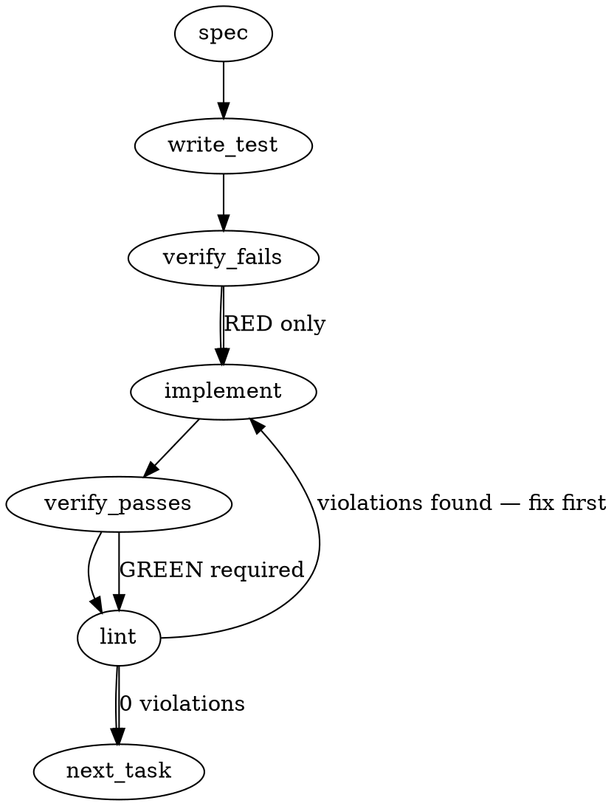

### Problem Statement

The interim `#2181` solution used the rule engine type (AST = hard, Regex = advisory) as a proxy for enforcement legitimacy. We need to retire this proxy by introducing explicit `provenance` and `ruleClass` fields to the `CompiledRule` schema, allowing any engine to enforce "hard" rules provided they meet the 3-part legitimacy bar (provenance, positive control, negative control), while also implementing inline `totem-ignore` support for regex rules to reach full parity with AST.

### Architectural Context

- **Strategy #665 (Proposal 299 Amendment 1):** Defines the 3-part legitimacy bar. A rule is only structurally legitimate (hard enforcement) if it has provenance, positive control, and negative control.
- **PR #2181 / #2182:** The interim proxy we are retiring. The code currently keys off `isHardEngine = rule.engine === 'ast-grep'`.
- **Pipeline Engine (ADR-089):** LLM-generated rules default to zero-trust (`unverified: true`). The new `ruleClass` and `provenance` fields must seamlessly integrate with this pipeline, ensuring unverified or newly minted rules default to `advisory` unless explicitly proven.

### Files to Examine

1. `packages/core/src/types.ts` (or equivalent schema file for `CompiledRule`) — To define the new data contracts (`ruleClass`, `provenance`).
2. `packages/cli/src/commands/run-compiled-rules.ts` — Location of the `#2181` engine-proxy logic that must be gutted and replaced, as well as the regex execution loop where inline suppression belongs.
3. `packages/core/src/compile-lesson.ts` — Contains `buildCompiledRule`. Must be updated to map compiler outputs to the new `provenance`/`ruleClass` fields.

### Technical Approach & Contracts

**Data Contract Updates:**
Update the `CompiledRule` Zod schema and TypeScript interfaces to include the new fields:

```typescript
const ProvenanceSchema = z.object({
  source: z.string().optional(),
  positiveControl: z.boolean().default(false),
  negativeControl: z.boolean().default(false),
});

// ruleClass becomes the ultimate arbiter of enforcement
ruleClass: z.enum(['hard', 'advisory']).default('advisory'),
provenance: ProvenanceSchema.optional(),
```

**Architectural Logic:**

1. **Schema & Passthrough:** The compiler/generator (`buildCompiledRule`) must accept `provenance` metadata and strictly derive `ruleClass`. If `provenance.positiveControl` AND `provenance.negativeControl` AND `provenance.source` exist, assign `ruleClass: 'hard'`. Otherwise, default to `'advisory'`.
2. **Retiring the Proxy:** In `runCompiledRules.ts`, remove `const isHardEngine = rule.engine === 'ast-grep'`. Replace this concept entirely with `const isHard = rule.ruleClass === 'hard'`.
3. **Regex Suppression:** When the regex engine evaluates a match against a file's content, retrieve the line number of the match's start index. Check the immediately preceding line for `// totem-ignore` or `/* totem-ignore */`. If present, discard the match.

### Edge Cases & Traps

- **Legacy Rule Downgrade:** Existing AST-grep rules in the `.totem/rules` directory will lack the `ruleClass` field. Without the proxy, they will default to `advisory`. This is **expected and intended** per Strategy #665 (all rules must meet the 3-part bar for hard enforcement), but must be validated in tests so it doesn't break parsing.
- **Regex Multiline Matches:** A regex rule might match a block of code spanning multiple lines. The `totem-ignore` suppression check must look at the line strictly _prior to the first character_ of the match, not the line where the match ends.
- **Performance Regression:** Do not re-read file contents from disk to check for regex suppressions. The regex engine already has the string contents; split into lines and cache the line-breaks or use a performant index lookup.

### Implementation Tasks

- [ ] **Task 1: Update CompiledRule Data Contracts**
  - Update the `CompiledRule` Zod schema and interface in the core types file to include `ruleClass` (`'hard' | 'advisory'`) and `provenance` (source, positiveControl, negativeControl).
  - Ensure the schema defaults `ruleClass` to `'advisory'` if missing.
    > TEST DIRECTIVE: Before implementing, write a failing test named `parses legacy rule without ruleClass as advisory` that proves older AST rules fall back gracefully.
  - write test → verify fails → implement → verify passes → lint

- [ ] **Task 2: Update Compiler Passthrough Logic**
  - Modify `buildCompiledRule` in `packages/core/src/compile-lesson.ts`.
  - When constructing the `CompiledRule`, evaluate the input `provenance`. If all three legitimacy conditions are met, output `ruleClass: 'hard'`. Otherwise, explicitly output `'advisory'`.
    > TEST DIRECTIVE: Before implementing, write a failing test named `derives hard ruleClass only when 3-part legitimacy bar is met` that validates the combination logic.
  - write test → verify fails → implement → verify passes → lint

- [ ] **Task 3: Retire Engine-Type Proxy**
  - In `packages/cli/src/commands/run-compiled-rules.ts`, delete any logic tying rule strictness to `rule.engine` (the #2181 proxy).
  - Update the violation logic: a rule violation only triggers a CLI exit failure (or "hard" error UI) if `rule.ruleClass === 'hard'`.
  - Update `logCompiledRule` and reporting functions to reflect the true `ruleClass` rather than the engine type.
    > TEST DIRECTIVE: Before implementing, write a failing test named `treats ast-grep without hard ruleClass as advisory` to prove the proxy is dead.
  - write test → verify fails → implement → verify passes → lint

- [ ] **Task 4: Regex Inline-Suppression (`totem-ignore`)**
  - In `runCompiledRules.ts` (or the specific regex evaluation helper), implement inline suppression parity.
  - For each regex match, map `match.index` to a line number.
  - Check the line immediately preceding the match for the substring `totem-ignore`.
  - If found, exclude the match from the resulting violations.
    > TEST DIRECTIVE: Before implementing, write a failing test named `ignores regex match if preceding line contains totem-ignore` ensuring parity with AST-grep exceptions.
  - write test → verify fails → implement → verify passes → lint

### Execution Flow (structural constraint)



### Verification (MANDATORY — do not skip)

Every implementation MUST end with these steps:

1. `totem lint` — deterministic rule check (zero LLM, ~2s). Fixes any violations.
2. `totem review` — AI-powered architectural review (~18s). Addresses any critical findings.
3. If using MCP, call `verify_execution` to confirm compliance before declaring the task done.

### Test Plan

- **Legacy Fallback:** Mock an old compilation output without `ruleClass` and ensure `runCompiledRules` flags its violations as advisory.
- **Strict Hard Enforcement:** Create a regex rule with the full 3-part `provenance` metadata. Assert that `buildCompiledRule` assigns it `ruleClass: hard`, and `runCompiledRules` strictly fails the build when it detects a violation.
- **Regex Suppression Logic:** Create a multiline source string with a regex violation. Place `// totem-ignore` on the line above the violation. Assert that `runCompiledRules` skips the violation and returns 0 violations for that specific match, but catches unsuppressed matches in the same file.

---

## Implementation Design

> Authored by totem-claude after verifying the spec against the real code surface. The Gemini-generated spec above mis-located the schema (`types.ts` → actually `compiler-schema.ts`) and proposed a **Task 4 (regex `totem-ignore` parity) that already ships** — `rule-engine.ts:applyRulesToAdditions` already calls `isSuppressed(ctx, line, precedingLine)` identically to the AST path. **Task 4 is dropped.** This design supersedes the spec's Tasks 1-4 where they conflict.

> **Contract settled by strategy-claude 0030Z (ADR-110 + Prop-299 full read).** Q1 fallback is contract-**mandated** (not just preferred), Q3 trust-the-stamp is mandated, Q2 stands, Q4 reshaped per two contract gaps. Open-questions section below records each ruling. Citation corrected: the legitimacy **attribute** is ADR-110 **§2**, the **bar** is **§3** (legs §3.1/3.2/3.3) — _not_ "§3.2".

### Scope

Add an **additive, optional** `legitimacy` record (three peer legs mapping 1:1 onto ADR-110 §3.1/3.2/3.3) plus a derived, optional `ruleClass` field to `CompiledRuleBaseSchema`, a pure `deriveRuleClass(rule)` helper encoding the §3 3-part bar, and a `run-compiled-rules.ts` reader that prefers an explicit `ruleClass` over the `isHardEngine` proxy. This will **NOT** wire derivation into the frozen `buildCompiledRule` pipeline (Q2), will **NOT** hard-delete the engine proxy (it demotes to a **legacy-only tier-display** fallback), will **NOT** touch regex suppression (already at parity), and will **NOT** stamp control _evidence_ on rules (PR/fixture refs ride `windtunnel.lock.json`, strategy#516 / ADR-110 §6).

**Load-bearing guardrail (Q1, strategy-claude 0030Z).** The proxy fallback is reachable **only by un-stamped legacy rules** (neither `legitimacy` nor `ruleClass`). A spine-minted rule's tier reads off its marker, period; a minted rule arriving _without_ a consistent marker is a **fail-loud parse error (Tenet 4)**, never a silent proxy→hard fallback. This keeps ADR-110's pre-scoring criterion _"no Gate-1 legitimacy decision reads engine-type"_ true — the proxy is demoted from **legitimacy signal** to **legacy tier-display**, and the two never cross. Enforced **structurally** at the schema (see invariant below), not by scattered runtime checks.

### Data model deltas

`legitimacy` is an umbrella for the §3 bar's **three peer legs** (not named `provenance` — that's the §3.1 leg, one of three; nesting the controls under it was the Q4 altitude bug). Field names are the build call; the contract is the 1:1 leg mapping + the §2 provenance record.

| New field / unit                                                                                                                | Holds                                                       | Writer                                                                        | Reader                                                                                                | Invariants                                                                                                                                                                                                                                                                                                                                                                         |
| ------------------------------------------------------------------------------------------------------------------------------- | ----------------------------------------------------------- | ----------------------------------------------------------------------------- | ----------------------------------------------------------------------------------------------------- | ---------------------------------------------------------------------------------------------------------------------------------------------------------------------------------------------------------------------------------------------------------------------------------------------------------------------------------------------------------------------------------- |
| `legitimacy?: { provenance: ProvenanceRecord; positiveControl: boolean; negativeControl: boolean }` on `CompiledRuleBaseSchema` | The §3 3-part bar: three **peer** legs ↔ §3.1 / §3.2 / §3.3 | spine regeneration (strategy#516, future); in **this PR only tests** write it | `deriveRuleClass`; future wind-tunnel reads per-rule eligibility off it **with no translation layer** | Optional. **Absent on every legacy rule.** When present, all three legs required (controls are booleans = pass/fail, evidence lives in the manifest).                                                                                                                                                                                                                              |
| `ProvenanceRecord = { mergedPr: number; reviewThread: string; commitSha: string }` (§3.1 leg, ADR-110 §2)                       | The provenance identity record the §2 attribute requires    | regeneration                                                                  | `deriveRuleClass` + audit                                                                             | Structured record, **not** a bare string (Q4 gap 2). **Mechanically validated (codex fold 1):** reject placeholder values — `mergedPr` positive integer, `reviewThread` non-empty, `commitSha` strict 40-hex (unless an existing Totem SHA validator dictates another shape). Promotion state is the **existing top-level `unverified`** flag — reused, not duplicated (see note). |
| `ruleClass?: 'hard' \| 'advisory'` on `CompiledRuleBaseSchema`                                                                  | The **derived** enforcement marker                          | `deriveRuleClass` output / regeneration                                       | `run-compiled-rules.ts` blocking decision                                                             | Optional. When present, **authoritative** over the engine proxy. Present **iff** `legitimacy` present (the ⟺ invariant below).                                                                                                                                                                                                                                                     |
| `deriveRuleClass(rule): 'hard' \| 'advisory'` (pure fn, core)                                                                   | n/a (no state)                                              | —                                                                             | regeneration (future) + the schema superRefine + unit tests                                           | `'hard'` **iff** `legitimacy` present **AND** `rule.unverified !== true` (ADR-089 promoted) **AND** `positiveControl` **AND** `negativeControl`; else `'advisory'`.                                                                                                                                                                                                                |
| `hardTier(v)` in `run-compiled-rules.ts` — **tier, not final blocking** (codex fold 2)                                          | per-violation hard-tier decision                            | —                                                                             | `isBlocking`                                                                                          | `v.rule.ruleClass != null ? v.rule.ruleClass === 'hard' : isHardEngine(v)`. Proxy branch reachable **only** by legacy rules (⟺ invariant). The marker replaces the **hard-tier discriminator**, not the severity gate: **`isBlocking(v) = hardTier(v) && (v.rule.severity ?? 'error') === 'error'`** stays the only final blocking predicate.                                      |

**Severity-gate + advisory-summary audit (codex fold 2).** Two existing consumers of `isHardEngine` in `run-compiled-rules.ts` must be re-pointed correctly: (1) `isBlocking` composes `hardTier && error-severity` (above) — severity semantics preserved. (2) `hasFrozenLessonAdvisory = warnings.some(v => !isHardEngine(v))` must become **legacy-only**: `warnings.some(v => v.rule.ruleClass == null && !isHardEngine(v))`. Otherwise a **minted advisory regex rule** (a real `ruleClass:'advisory'` stamp) is mislabeled "frozen-lesson regex rule demoted under #2181" in the text/SARIF summary — the old proxy must not classify stamped rules in user-facing output.

**Schema invariant (the Q1 guardrail, structural).** A new `superRefine` on `CompiledRuleBaseSchema`: `legitimacy` present **⟺** `ruleClass` present, **and** when present `ruleClass === deriveRuleClass(rule)`. Consequences: a forged `ruleClass` with no `legitimacy` → **parse-fail**; a minted rule missing/with-inconsistent `ruleClass` → **parse-fail** (fail-loud, Tenet 4); a legacy rule (both absent) → parses, falls to the proxy. Placed on the schema layer that parses **runtime** rules (`CompiledRuleSchema`, consumed by `loadCompiledRules`), so the runner can never observe a forged stamped state (codex note). This makes "proxy reaches legacy only" a structural guarantee, not a convention.

**Promotion-flag reuse — RESOLVED (codex + agy concur, no contract re-touch).** ADR-110 §2 names `unverified: true`-until-promoted as part of the provenance record. Totem already has a top-level ADR-089 `unverified` flag (read by #1485 / #1479). `deriveRuleClass` reads the **existing** top-level flag rather than nesting a second one in `ProvenanceRecord`. **Codex's contract-lens confirmed this satisfies §2** (provided ownership is explicit in code+comments: `legitimacy.provenance` carries PR/thread/SHA, the rule's top-level `unverified` carries promotion state, `deriveRuleClass` reads it); **agy concurred** (nesting = dual-source-of-truth drift hazard). No strategy-claude re-loop needed.

No reserved keys / sentinels. Additive-via-conditional-spread (the existing `globsObj` / `badExampleObj` idiom) keeps absent fields absent, so `canonicalStringify` output — and every manifest hash — is byte-identical for legacy rules.

### State lifecycle

All three are **persistent** rule attributes (live in `.totem/compiled-rules.json`), not runtime state. Created at rule **mint** (regeneration), read at **lint** time, never mutated in place by the reader. There is no cross-lifecycle one-shot flag. The only runtime-scoped object touched is the existing per-invocation `RuleEngineContext`, which this change does not extend.

### Failure modes

| Failure                                                                                        | Category        | Agent-facing surface                                                           | Recovery                                                                                                 |
| ---------------------------------------------------------------------------------------------- | --------------- | ------------------------------------------------------------------------------ | -------------------------------------------------------------------------------------------------------- |
| Legacy `compiled-rules.json` lacks both fields                                                 | runtime (parse) | none — optional, rule falls to `isHardEngine` proxy (tier-display only)        | intended; identical to today's behavior                                                                  |
| Minted rule carries `ruleClass:'advisory'` (control failed / unverified) on an ast-grep engine | runtime         | prints as advisory, excluded from exit-1 (proxy would have blocked)            | intended; explicit marker wins over engine                                                               |
| Forged `ruleClass:'hard'` with **no** `legitimacy`                                             | init (parse)    | **hard parse error** — schema ⟺ invariant rejects it                           | fail-loud (Tenet 4); a hard stamp without the §3 bar can never load. Closes the forge hole structurally. |
| Minted rule whose `ruleClass` ≠ `deriveRuleClass(rule)` (missing/inconsistent marker)          | init (parse)    | **hard parse error** — schema consistency check                                | fail-loud build bug surfaced at load; regeneration must emit a consistent marker                         |
| `legitimacy` present but a control is `false` / `unverified:true`                              | runtime         | `deriveRuleClass` ⇒ `'advisory'`; `ruleClass` must equal `'advisory'` to parse | intended; the bar is all-three-and-promoted-or-advisory                                                  |
| Writing absent fields as `false`/defaults would churn every manifest hash                      | init/runtime    | `verify-manifest` blocks the next unrelated push                               | designed-out via the conditional-spread idiom — locked by a manifest-stability test                      |

No row is "silent degradation": a legacy rule keeping its proxy-derived tier is the _intended_ path, and every minted-marker inconsistency is a **loud parse failure**, not a drift.

### Invariants to lock in via tests

- A legacy rule (no `legitimacy`, no `ruleClass`) parses cleanly and is classified by the engine proxy — **ast/ast-grep still block, regex still advisory** (zero regression vs #2181).
- An explicit `ruleClass` (with its consistent `legitimacy`) overrides the proxy in **both** directions: ast-grep minted-advisory ⇒ advisory; regex minted-hard ⇒ blocking.
- **Schema ⟺ invariant:** rejects `ruleClass` without `legitimacy` (forged hard stamp); rejects `legitimacy` without `ruleClass`; rejects `ruleClass ≠ deriveRuleClass(rule)` (inconsistent marker); accepts both-absent (legacy). Each is a parse failure.
- `deriveRuleClass` returns `'hard'` for exactly `(legitimacy present ∧ unverified ≠ true ∧ positiveControl ∧ negativeControl)` and `'advisory'` for every partial case (enumerate: each control false, `unverified:true`).
- A rule with absent `legitimacy`/`ruleClass` serializes byte-identically via `canonicalStringify` to its pre-change form (manifest-hash stability — no `verify-manifest` churn).
- Regex `totem-ignore` suppression is unchanged (a guard test documenting Task 4 is already covered, so a future refactor can't silently regress parity).
- **Provenance field validation (codex fold 1):** schema rejects placeholder provenance — non-integer / non-positive `mergedPr`, empty `reviewThread`, malformed (non-40-hex) `commitSha`.
- **Severity gate preserved (codex fold 2):** a minted `ruleClass:'hard'` rule with `severity:'warning'` does **not** block (`isBlocking = hardTier ∧ error-severity`); and a minted `ruleClass:'advisory'` **regex** rule is **not** labeled a frozen-lesson rule in the text/SARIF summary (`hasFrozenLessonAdvisory` is legacy-only).

> Test contract = agy's 6 locked invariants (legacy zero-regression, authoritative override both directions, the 4 ⟺ parse-fail cases, `deriveRuleClass` truth table, manifest-stability guard, regex-parity guard) **+ codex's two fold tests** above. Homes: `compiler-schema.test.ts` (schema/invariant/derive) + `run-compiled-rules.test.ts` (reader/severity/summary).

### Open questions — RESOLVED (strategy-claude 0030Z contract read)

- **Q1 — Reader precedence → FALLBACK (contract-mandated).** A literal hard-cutover demotes every existing ast/ast-grep rule hard→advisory mid-window — _that changes enforcement_, which **ADR-110 §1 forbids** (Gate 1 = "mint + validate only, blast radius zero by construction"). ADR-110 **Consequence 2** states it almost verbatim: _"the proxy remains only as the advisory-tier discriminator until the spine ships its marker."_ Fallback honors §665 §4's _intent_ (legitimacy is the go-forward + Gate-2 re-flip rule) while respecting §1's _letter_ (the legacy-hard posture is the ratified Gate-0 state lc is verifying now). **Guardrail baked in** (see Scope + schema invariant): proxy reachable only by legacy rules; minted-without-marker is fail-loud.
- **Q2 — Freeze wiring → UNWIRED HELPER (no dissent).** `deriveRuleClass` ships pure + unit-tested, not wired into frozen `buildCompiledRule`; strategy#516 regeneration owns the wiring.
- **Q3 — Trust model → TRUST THE STAMP (mandated).** This is the **Tenet-15 verifiable-freezing corollary** that **299 §4 names for mined rules** (LLM draft → deterministic verify → frozen artifact → never re-consulted). Re-derivation is **structurally incapable** at read-time — the 3-part bar needs the wind-tunnel controls + frozen manifest (§4/§6), which `run-compiled-rules.ts` lacks at lint-time, so a read-time re-derive could only produce a weaker, divergent signal. The 296 verdict-format parallel is **illustrative, not load-bearing** (not re-verified).
- **Q4 — `legitimacy` shape → RESHAPED (two contract gaps closed).** (1) _Altitude:_ `provenance` is the §3.1 leg, not the umbrella — controls lifted to **peers** under a neutral `legitimacy` object, preserving the 1:1 map onto the #666 three-check. (2) _Under-spec:_ provenance is a **structured `ProvenanceRecord`** carrying the ADR-110 §2 record (merged-PR# + review-thread + commit-SHA), not a bare string; promotion is the existing top-level `unverified` flag. `deriveRuleClass` = hard **iff** present-and-promoted ∧ positive ∧ negative.

**Residual (build-level, NOT contract — for the cohort, not a re-ask):** promotion-flag reuse — `deriveRuleClass` reads the existing top-level ADR-089 `unverified` rather than nesting a second flag inside `ProvenanceRecord`. Codex contract-lens confirms this satisfies §2's "unverified-until-promoted"; if §2 demands nesting, that's a contract re-touch → loop strategy-claude.

### Cohort review brief (corrected sharp targets, strategy-claude 0030Z)

The contract is **settled** — the cohort verifies the **build**, not the contract.

- **codex — contract-lens:** does the marker schema satisfy **ADR-110 §2 (the attribute: structured provenance + derived `ruleClass`)** and **§3 (the 3-part bar)**, with the Q4 gaps closed and the promotion-flag reuse sound?
- **gemini — tenet-lens:** does the field taxonomy land **1:1 on the #666 three-check** (provenance / positive / negative) so wind-tunnel per-rule eligibility reads off the marker with **no translation layer**?
- **agy — build/test-completeness lens:** buildability + does the test plan lock the invariants (superRefine→deriveRuleClass, manifest-hash stability, the ⟺ parse-fail cases, legacy zero-regression, Task-4 confirmation).

### Review verdicts (3 of 3 in — all PASS)

| Reviewer           | Lens             | Verdict                                  | Folds adopted                                                                                                                                                            |
| ------------------ | ---------------- | ---------------------------------------- | ------------------------------------------------------------------------------------------------------------------------------------------------------------------------ |
| **codex** (0302Z)  | contract (§2/§3) | **conditional PASS** — contract-faithful | Fold 1 (mechanically-validated provenance), Fold 2 (severity gate + advisory-summary audit); impl notes (no defaults; invariant on runtime-parse schema; helper unwired) |
| **agy** (0250Z)    | build/test       | **PASS** — all 4 sharp targets           | 6 locked test invariants adopted as the test contract; Task-4-dropped confirmed                                                                                          |
| **gemini** (0246Z) | tenet            | **PASS** — all 6 points                  | 1:1 #666 three-check (zero translation layer), Tenet 4/9/15/21, #474 slice coherence — no folds                                                                          |

All three independent. Codex + agy confirmed the **promotion-flag reuse** (top-level `unverified`) — residual closed, no contract re-touch. **Gate status: all verdicts PASS; build pending operator approval only.**
