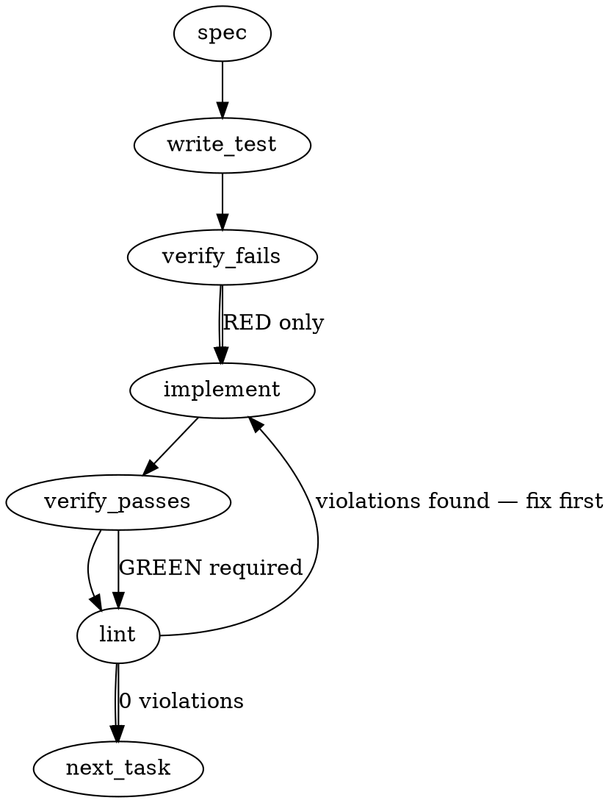

### Problem Statement

Implement the Gate-1 evidence engine (wind-tunnel) for Proposal 299 to falsifiably evaluate generated rules against a frozen historical repository state. This requires defining the structural contract for `.totem/spine/gate-1/windtunnel.lock.json` and building a retrospective replay CLI tool that guarantees zero false positives over a historical corpus while ensuring non-vacuous true positives on known control fixtures.

### Architectural Context

- **ADR-089 (Zero-Trust Default) & PR #2183**: New rules must be evaluated against strict criteria before promotion. The `legitimacy` / `ruleClass` markers introduced in #2183 are the source of truth for determining which rules are eligible for this wind-tunnel replay.
- **Stateless Execution (#1908/Proposal 273)**: All rule evaluation (like `totem lint`) must operate without polluting the user's working directory or requiring state flags. Retrospective analysis of historical commits MUST occur in isolated environments to prevent git tree corruption.

### Files to Examine

1. `packages/core/src/compiler-schema.ts` — Understand how `legitimacy` and `ruleClass` are currently structured to filter eligible rules.
2. `packages/cli/src/commands/verify-manifest.ts` — Existing pattern for CLI commands reading locked repository configuration.
3. `packages/cli/src/commands/install-hooks.ts` — Reference for strict-tier gating and execution boundaries.

### Technical Approach & Contracts

To evaluate historical commits, the deterministic linting engine requires actual file content. Checking out historical commits in the active working directory is an architectural trap that will strand users in detached-HEAD states on failure.

**Recommended Approach:**

1. **Isolated Worktrees**: Use ephemeral `git worktree` instances managed via `safeExec` to checkout and evaluate historical commits safely.
2. **Strict Manifest Contract**: Define a Zod schema that enforces the `windtunnel.lock.json` shape precisely as requested in the issue.
3. **Execution Sequence**:
   - Resolve git root (`resolveGitRoot`).
   - Read and validate `.totem/spine/gate-1/windtunnel.lock.json` (`readJsonSafe`).
   - Verify repo is not a shallow clone (which would break historical replays).
   - Filter active compiled rules requiring validation.
   - For each corpus commit and adversarial fixture: create worktree, lint, assert 0 violations (Zero-Confirmed-FP floor).
   - For each positive control: create worktree, lint, assert _exact_ expected rules fire (Non-Vacuous Pass).
   - Calculate and output the exposure denominator tuple.

**Data Contract: `WindtunnelManifestSchema`**

```typescript
export const WindtunnelManifestSchema = z.object({
  version: z.literal('1.0'),
  params: z.object({
    N: z.number().int().positive().describe('Frozen window size'),
    precisionFloor: z.literal('zero-confirmed-FP'),
    falsePositiveDefinition: z.string(),
    exposureDenominator: z
      .tuple([
        z.number().int().describe('Active rules'),
        z.number().int().describe('Files'),
        z.number().int().describe('Controls'),
      ])
      .optional(), // Calculated during run, can be pinned here
  }),
  corpus: z.object({
    author: z.literal('lc'),
    commits: z.array(z.string().length(40)).describe('Full SHAs of merged PR history'),
  }),
  controls: z.object({
    positive: z.array(
      z.object({
        commit: z.string().length(40),
        expectedFiredRules: z
          .array(z.string())
          .min(1)
          .describe('Rule IDs that MUST fire to prove non-vacuousness'),
      }),
    ),
    adversarial: z.array(
      z.object({
        commit: z.string().length(40),
        expectedFiredRules: z.array(z.string()).max(0).describe('Near-misses that MUST NOT fire'),
      }),
    ),
  }),
});
```

### Edge Cases & Traps

- **Git Shallow Clones**: CI environments often do shallow clones (`--depth=1`). Replaying historical commits will fail obscurely. The tool must run `git rev-parse --is-shallow-repository` and fail fast with an actionable error.
- **Worktree Leaks**: If the Node process crashes or is interrupted (`SIGINT`), lingering git worktrees will pollute the user's `.git/worktrees` internal registry. A robust `try/finally` block + `process.on('SIGINT')` trap is required.
- **Resource Exhaustion**: Creating `N` worktrees simultaneously will exhaust disk I/O and process limits. The replay loop MUST be strictly serial.
- **Vacuous Pass Trap**: A rule might pass the "zero false positive" test simply by being broken and never matching anything. The positive controls must explicitly verify that the _exact target rule_ fires.

### Implementation Tasks

- [ ] **Task 1: Define Windtunnel Manifest Schema**
  - Create `packages/core/src/spine/windtunnel-schema.ts`.
  - Export `WindtunnelManifestSchema` as defined in the technical approach.
  - Export inferred type `WindtunnelManifest`.
    > TEST DIRECTIVE: Before implementing, write a failing test named `rejects manifest with empty expectedFiredRules in positive controls` that proves the schema prevents vacuous control definitions.
  - write test → verify fails → implement → verify passes → lint

- [ ] **Task 2: Build Ephemeral Worktree Manager**
  - Create `packages/cli/src/utils/git-worktree.ts`.
  - Implement `withEphemeralWorktree(commitSha: string, callback: (worktreePath: string) => Promise<T>): Promise<T>`.
  - Use `safeExec('git', ['worktree', 'add', '--detach', tmpPath, commitSha])`.
  - Ensure teardown in a `finally` block uses `safeExec('git', ['worktree', 'remove', '-f', tmpPath])`.
    > TEST DIRECTIVE: Before implementing, write a failing test named `cleans up git worktree even when callback throws an error` that proves disk and git tree state are restored.
  - write test → verify fails → implement → verify passes → lint

- [ ] **Task 3: Implement Replay Engine Core**
  - Create `packages/cli/src/spine/windtunnel-engine.ts`.
  - Implement the engine that takes a `WindtunnelManifest` and a list of active rules.
  - Iterate serially through `corpus.commits` and `controls.adversarial` -> run lint engine -> throw `FalsePositiveError` if ANY rule fires.
  - Iterate serially through `controls.positive` -> run lint engine -> throw `VacuousPassError` if `expectedFiredRules` are missing from the output.
  - Compute the exposure tuple: `[rules.length, totalFilesEvaluated, totalCommitsEvaluated]`.
    > TEST DIRECTIVE: Before implementing, write a failing test named `throws VacuousPassError when positive control fails to trigger the designated rule` that proves the done-criterion.
  - write test → verify fails → implement → verify passes → lint

- [ ] **Task 4: Expose `totem spine windtunnel` CLI Command**
  - Create `packages/cli/src/commands/spine-windtunnel.ts`.
  - Use `resolveGitRoot` to locate and `readJsonSafe` to parse `.totem/spine/gate-1/windtunnel.lock.json`.
  - Pre-flight check: use `safeExec` to verify `git rev-parse --is-shallow-repository` returns `false`.
  - Execute the engine from Task 3, outputting the exposure denominator tuple on success, or exiting `1` on precision/vacuous errors.
  - Register the command in the CLI router.
    > TEST DIRECTIVE: Before implementing, write a failing test named `exits immediately with clear error if repository is a shallow clone` that proves CI edge cases are caught early.
  - write test → verify fails → implement → verify passes → lint

### Execution Flow (structural constraint)



### Verification (MANDATORY — do not skip)

Every implementation MUST end with these steps:

1. `totem lint` — deterministic rule check (zero LLM, ~2s). Fixes any violations.
2. `totem review` — AI-powered architectural review (~18s). Addresses any critical findings.
3. If using MCP, call `verify_execution` to confirm compliance before declaring the task done.

### Test Plan

- **Schema Validation**: Verify `WindtunnelManifestSchema` strictly rejects invalid commit SHAs, negative `N`, and empty positive controls.
- **Worktree Safety**: Create a mock git repository, run the worktree manager, induce a crash, and verify `git worktree list` does not contain orphaned paths.
- **Engine Falsifiability**:
  - Mock a linting engine that always returns 0 violations -> must fail positive control.
  - Mock a linting engine that always returns 1 violation -> must fail negative corpus control (zero-confirmed-FP).
  - Mock perfect linting engine -> asserts correct exposure denominator calculation.

---

## Implementation Design

> Authored after grounding against the real code + strategy-claude's operator-ruled lens (0658Z). **Two corrections to the Gemini spec above, which this supersedes:** (1) the lock schema is strategy-claude's `windtunnel.lock.v1`, NOT the Gemini `WindtunnelManifestSchema` (controls are referenced-by-path, not inline; corpus is a selection-rule + frozen `resolvedPrs`, not an inline SHA array). (2) **No git-worktrees / historical checkouts.** The corpus is **lc PR diffs**, and the rule engine (`runCompiledRules`/`applyRulesToAdditions`) already consumes a `diff: string` — so the replay feeds each PR's diff to the engine. A local lc clone exists at `D:\Dev\liquid-city`, so corpus diffs resolve offline + deterministically from `resolvedPrs` @ `asOfCommit`.

### Sharpenings folded (strategy-claude APPROVE — 2026-06-17T17:36Z)

The 0658Z schema/params ruling + this 17:36Z spec APPROVE settle the contract. Four sharpenings fold in below — **S1 is binding on correctness; S2–S4 close residual vacuous-pass / silent-shrink holes** — plus the OQ2 mock additions. OQ2/OQ3 are ratified. None reopen the contract.

**S1 — [BINDING] Firing-parity with production `totem lint`.** The replay must feed each rule the _same context production lint feeds it_, or the wind-tunnel measures a different engine than Gate 2 arms. Grounded against `packages/core/src/rule-engine.ts`: the **regex family** (`applyRulesToAdditions`) consumes diff additions only — fine on a diff string. But the **AST / ast-grep family** (`applyAstRulesToAdditions`, L515–558) parses the **full post-image file** and only _scopes reports_ to `addedLineNumbers` — an additions-only feed makes it silently **under-fire**. The engine already exposes the exact seam: a `readStrategy(file) => Promise<string>` injection (L535–536) overriding the default working-tree `fs.readFile`. So the replay supplies a `readStrategy` that resolves the **post-image blob** offline from the lc clone (`git show <PR-head-@-asOfCommit>:<path>`) — no worktrees, no checkout, exact parity (the engine parses content identical to an on-disk lint). This **refines the intro's "feeds the diff" simplification**: a corpus item is `{ diff, readStrategy }`, not `diff` alone.

- _Parity test (locks it):_ a rule that fires in real `totem lint` over a PR checkout MUST fire in the diff+`readStrategy` replay of that PR. If parity is ever unreachable for a whole-file rule, resolve more post-image blobs — **never fall back to worktrees.** **→ Extended by C1 (Verdict folds): the post-image seam must also cover `enrichWithAstContext` (regex `astContext`), and the parity test is bidirectional (== production firings).**

**S2 — Hole A: cull-laundering guard (sharpest).** The negative-control cull (a rule that fires on a near-miss ⇒ culled + recorded in `cullLedger`) is a laundering path for the precision claim: cull the noisy rules, then report 1.0 on the clean residue. A 10-minted / 2-survivor run clears `activeRules ≥ 2` and shows a perfect number — but that's closer to HONEST-NEGATIVE (_mining mints mostly-illegitimate rules_). Fold:

- `WindtunnelVerdict` carries `mintedRuleCount` / `culledCount` / `survivingRuleCount` as **first-class fields** (the ledger has the rows; the verdict must surface the ratio).
- Precision is stated explicitly as **"over surviving rules."**
- A high cull rate pulls the verdict toward **HONEST-NEGATIVE**, not a clean PASS — `activeRules ≥ 2` is a masquerade guard, not a yield bar. (Cull-rate threshold pinned in the lock; the ratio is surfaced loudly even when it does not flip the verdict.)

**S3 — Hole B: two-freezes lifecycle (not one).** There are two distinct locks: the **harness-validation** lock (mock rules, `mintedRuleCount ≈ 0`) and the **post-#516 certifying** lock. The exposure floor `positiveControlsExercised.floor ≥ mintedRuleCount` is vacuous at harness time (≥ 0), so the harness lock MUST NOT be reused as the certifying lock — else the real run passes with zero positive controls. "Frozen-once" is **per-lock**, not one lock across both phases: the certifying run **re-freezes** the exposure floor against the real minted set. The lock carries a `phase: "harness" | "certifying"` discriminator; a certifying `run` rejects a harness-phase lock.

**S4 — Hole C: freeze-time completeness (twin of the run-time guard).** The run-time guard is airtight (corpus diff unresolvable ⇒ hard error, never skip). But `freeze` had no completeness check — nothing stopped it snapshotting 50 of 117 code-touching PRs into `resolvedPrs` and looking legitimate. The contract is **N = ALL code-touching lc PRs**; completeness _is_ the point. Add the freeze-time assertion: `resolvedPrs === selectionRule(asOfCommit)` — re-derivable + diffable, so the freeze itself cannot silently drop PRs.

**OQ2 mock additions.** Harness-only-now is ratified, but the mock-engine validation MUST exercise the **HONEST-NEGATIVE** (exposure-floor trip) and **needs-adjudication** (unlabeled-firing) verdicts — not just the always-0 / always-1 / perfect mocks. Those two verdicts are exactly where a vacuous-pass bug hides.

**OQ3 ratified.** Gate-1-scoped `fixtureSha` (reuse the `git hash-object` recipe; do NOT extend the existing `.totem/tests` `FIXTURE_DIR`).

### Verdict folds (codex CONCERN + agy recs — 2026-06-17 pre-build round)

Panel: **gemini APPROVE** (tenet — no changes), **agy PASS + 3 recs**, **codex CONCERN / hold** (5 blocking + 3 precision). All codex blocking items are folded below; C1's `enrichWithAstContext` claim was **verified against the code** (`ast-gate.ts` L74–82 reads staged/disk via `git show :<file>`, no injection seam). These **deepen S1 and the freeze proof — they do not reopen the contract** (C3 realizes strategy-claude's stated "git-log greppable" intent).

**C1 — [BINDING; supersedes S1's mechanism] Parity covers the _whole_ production classification path, not just the AST engine.** Production `run-compiled-rules.ts` (L214) calls `enrichWithAstContext(additions, { cwd })` **before** rule execution; regex rules then suppress matches via `addition.astContext` (`rule-engine.ts` L316: non-`code` context ⇒ skip). `enrichWithAstContext`→`classifyFile` (`ast-gate.ts` L74–82) reads **staged** content (`git show :<file>`) with a disk fallback and has **no content-injection seam** — so an AST-only `readStrategy` still measures a different engine (regex rules classify `astContext` from the wrong tree or fail-open as code ⇒ **over-fire in comments/strings**). Fold:

- **Production change (now in scope):** add a content-injection seam to `AstGateOptions` (e.g. `readStrategy?: (file) => Promise<string | null>`) so `enrichWithAstContext` classifies from the same post-image content the AST engine gets. Minimal, additive, default-unchanged for normal lint.
- The wind-tunnel `run` passes **one shared** post-image `readStrategy` into **both** `enrichWithAstContext` and `applyAstRulesToAdditions`, so regex + AST see identical content.
- **Parity test is bidirectional:** for a fixed PR/rule set, replay firings **==** production firings — including a **negative fixture** where production suppresses a regex match in a comment/string and the replay must **not** emit it (catches replay-only _over_-firing, not just under-firing). Covers **both** Tree-sitter and ast-grep families (folds P3).

**C2 — Missing post-image blob ⇒ hard error, never a silent no-match.** `matchAstQueriesBatch` / the ast-grep branch return zero matches when content is `null`; for the wind-tunnel a missing blob is corpus shrinkage, not a clean non-firing. Fold: the wind-tunnel `readStrategy` **throws** on any unresolved blob for an evaluated added file. Only cases production also excludes (deleted file with no additions; intentionally-skipped symlink) may legitimately have no blob. Test: missing/unresolvable blob ⇒ hard error, not a zero-firing result.

**C3 — `frozenAt.commit` proof is git-derived, not a self-embedded trusted field.** A file cannot contain the SHA of the commit that contains it (the hash includes the content). Fold: `run` **derives/verifies** the proof from git history — `git log --format=%H -- .totem/spine/gate-1/windtunnel.lock.json` ⇒ that commit MUST be an ancestor of the run commit; if `frozenAt.commit` is retained in the lock, additionally verify the lock blob **at that commit is byte-identical** to the current lock + ancestry holds.

**C4 — `resolvedPrs` entries pin replay identity, not just membership.** A PR number alone doesn't map to a diff offline (local git has no PR#→merge/base/head map; refs move/disappear). Fold: each entry is structured + immutable — `{ pr, mergeCommit, baseSha, headSha, diffSha? }` — with unique/sorted validation. The S4 completeness assertion compares this **structured set** against `selectionRule(asOfCommit)`, not a count or bare PR-number list.

**C5 — `cullRateThreshold` is required, frozen, and non-vacuous.** Pinning alone isn't enough — if it permits `1.0`, omission, or post-hoc override, a 10-mint / 8-cull / 2-survive run still "reports but doesn't decide." Fold: schema makes it **required**, frozen, constrained to `0 ≤ threshold < 1` (default operator-ratified). The scorer **mechanically returns `HONEST-NEGATIVE`** when `culledCount / mintedRuleCount > threshold`, while still reporting minted/culled/surviving; precision is labeled "over surviving rules" **only after** the cull-rate guard runs.

**Precision folds.** **P1** — phase rejection keys off an **external requested phase** (`run --phase certifying`), not only the lock's self-declared phase, so harness output can't be mistaken for certification. **P2** — pin floor comparator semantics in tests: name the fields as minimums and test the exact equality boundary (`activeRules == 2` passes, `== 1` ⇒ HONEST-NEGATIVE; `positiveControls == mintedRuleCount` passes). **P3** — folded into C1's bidirectional parity test (Tree-sitter + ast-grep + regex/astContext).

**agy recs.** **A1** — export `spine/windtunnel-lock.ts` + `spine/windtunnel-scorer.ts` from `packages/core/src/index.ts` (else CLI module-resolution fails under strict TS); the lc clone path is a `--lc-dir <path>` CLI option (env fallback), never hardcoded in core. **A2** — ground-truth labels key on a **content-based per-firing id** (`hash(ruleId + pr + filePath + normalizedMatchedLineText)`), not raw line numbers, so labels survive line-drift. **A3** — normalize paths to forward-slash in all match/id schemas + keep ADR-098 filenames colon-free (Windows ADS) on write and symmetric on read.

### Scope

Build the **Gate-1 wind-tunnel harness**: the `windtunnel.lock.v1` schema + a `totem spine windtunnel <freeze|run>` command pair + a pure scoring engine that, given rule-firings over the frozen corpus/controls plus per-firing ground-truth labels, emits the ADR-110 §4/§5 verdict (PASS / HONEST-NEGATIVE / FAIL, exposure tuple, precision, cull-ledger). It will **NOT** regenerate rules (that's strategy#516 — the harness is validated now with fixtures + a mock engine, and runs for real post-#516), will **NOT** author the ground-truth labels (operator-adjudicated; the tool emits the firing/label queue + the mechanical negative-control cull), and will **NOT** use git-worktrees (diff + post-image-blob replay via the engine's `readStrategy` seam, achieving firing-parity with production `totem lint` — S1).

### Data model deltas

| New unit                                                                    | Holds                                                                                                                                                                                                                                                                      | Writer                                       | Reader             | Invariants                                                                                                                                                                                                                                                                                                                                                                                                                                                     |
| --------------------------------------------------------------------------- | -------------------------------------------------------------------------------------------------------------------------------------------------------------------------------------------------------------------------------------------------------------------------- | -------------------------------------------- | ------------------ | -------------------------------------------------------------------------------------------------------------------------------------------------------------------------------------------------------------------------------------------------------------------------------------------------------------------------------------------------------------------------------------------------------------------------------------------------------------- |
| `WindtunnelLockSchema` + `WindtunnelLock` (core `spine/windtunnel-lock.ts`) | strategy-claude's `windtunnel.lock.v1` shape (`phase: "harness" \| "certifying"` (S3); corpus selection-rule + `asOfCommit` + frozen `resolvedPrs`; `fpDefinition` refs; `controls` refs + `integrity.fixtureSha`; `exposureDenominator` floors; `cullRateThreshold` (S2)) | `freeze` cmd                                 | `run` cmd + scorer | `precisionFloor === 1.0`; `window.type ∈ {all, bounded}`; `asOfCommit` 40-hex; `resolvedPrs` non-empty when `window=all`, entries structured `{pr,mergeCommit,baseSha,headSha}` + unique/sorted (C4); `cullRateThreshold` required ∈ `[0,1)` (C5); `exposureDenominator.activeRulesEvaluated.floor ≥ 2`; `positiveControlsExercised.floor ≥ mintedRuleCount`. **Frozen-once per-phase** (S3 — a certifying `run` rejects a harness-phase lock; see lifecycle). |
| `.totem/spine/gate-1/windtunnel.lock.json`                                  | the persisted lock                                                                                                                                                                                                                                                         | `freeze`                                     | `run`              | freeze proof **git-derived at run time** (lock commit via `git log -- <lock>` is an ancestor of the run; blob byte-identical) — NOT a self-embedded trusted field (C3, §6)                                                                                                                                                                                                                                                                                     |
| `ground-truth-labels.json` (referenced)                                     | **per-firing** TP/FP labels (NOT per-PR)                                                                                                                                                                                                                                   | operator adjudication (out of scope tooling) | scorer             | a firing with no label ⇒ `needs-adjudication`, never a silent pass                                                                                                                                                                                                                                                                                                                                                                                             |
| `controls/{positive,negative}/` diff fixtures (referenced)                  | held-out real lc PRs (positive) + adversarial near-miss diffs (negative)                                                                                                                                                                                                   | hand-curated                                 | `run`              | integrity-hashed; positive must fire its target rule, negative must not fire                                                                                                                                                                                                                                                                                                                                                                                   |
| `WindtunnelVerdict` (pure scorer output)                                    | `{verdict, precision /* over surviving rules */, mintedRuleCount, culledCount, survivingRuleCount, exposureTuple:[a,b,c], cullLedger[], nonVacuity, needsAdjudication[]}`                                                                                                  | core scorer                                  | `run` cmd report   | exposure reported as a **tuple, never collapsed to a product**; minted/culled/surviving surfaced as first-class fields (S2); precision is **over surviving rules**                                                                                                                                                                                                                                                                                             |

No reserved keys; controls + labels + rubric are separate referenced files (T20/T21), keeping the lock lean.

### State lifecycle

All artifacts are **persistent** under `.totem/spine/gate-1/`. The lock is **frozen-once per-phase** (S3): `freeze` writes it under its own commit; any later `run` **derives** the lock's commit from git history (`git log -- <lock>`), asserts it is an ancestor of the run, and verifies the lock blob at that commit is byte-identical (C3 — the proof is git-derived, never a self-embedded field). There are **two locks across the build's life** — a `phase: "harness"` lock (mock rules, `mintedRuleCount ≈ 0`, validates the harness now) and a `phase: "certifying"` lock (re-frozen post-#516 against the real minted set, with a non-vacuous `positiveControlsExercised.floor`); a certifying `run` rejects a harness-phase lock so the real run cannot inherit a vacuous floor. `freeze` also asserts corpus completeness — `resolvedPrs === selectionRule(asOfCommit)` (S4) — so it cannot silently shrink the corpus. Ground-truth labels **accrete** during operator adjudication, then freeze before the certifying run. The scorer holds only per-run computation (no cross-run/session state). Control-fixture integrity is pinned via `controls.integrity.fixtureSha` (git-hash-object over the control dir, same mechanism as `.wind-tunnel-sha`).

### Failure modes

| Failure                                                                                                                                                | Category    | Surface                                                                                                          | Recovery                                                                                              |
| ------------------------------------------------------------------------------------------------------------------------------------------------------ | ----------- | ---------------------------------------------------------------------------------------------------------------- | ----------------------------------------------------------------------------------------------------- |
| Lock missing / schema-invalid                                                                                                                          | init        | hard error                                                                                                       | fix/regenerate the lock                                                                               |
| Run when the git-derived lock commit (`git log -- <lock>`) is not an ancestor of HEAD, or its blob differs from the current lock (unfrozen / tampered) | runtime     | hard error (§6, C3 — proof is git-derived, never a self-embedded field)                                          | `freeze` first; re-run                                                                                |
| `controls.integrity.fixtureSha` mismatch (control tampered)                                                                                            | runtime     | hard error                                                                                                       | re-freeze controls deliberately or revert tampering                                                   |
| Corpus PR diff unresolvable (lc clone absent / PR not @ `asOfCommit`)                                                                                  | runtime     | **hard error — never skip** (a silent skip shrinks the corpus, §5)                                               | provide the lc clone @ pin                                                                            |
| Firing with no ground-truth label                                                                                                                      | runtime     | `needs-adjudication` queue emitted, exit non-zero (NOT pass)                                                     | adjudicate the queue, re-run                                                                          |
| Positive control fails to fire its target rule                                                                                                         | runtime     | `FAIL` (vacuous)                                                                                                 | fix rule/control                                                                                      |
| Negative control fires                                                                                                                                 | runtime     | rule **culled** + recorded in `cullLedger` (mechanical, pre-labeling)                                            | culled rule cannot earn hard tier                                                                     |
| Adjudication-count cap hit on run 1                                                                                                                    | runtime     | label first K, **report the cap in the run report** (never silently shrink)                                      | label more, re-run                                                                                    |
| Exposure floor violated (activeRules<2 or positiveControls<mintedRuleCount)                                                                            | runtime     | `HONEST-NEGATIVE` (masquerade guard, ADR-110 §4)                                                                 | add rules/controls                                                                                    |
| High cull rate (culled ≫ surviving) — cull-laundering masquerade (S2)                                                                                  | runtime     | verdict pulled to `HONEST-NEGATIVE`; minted/culled/surviving surfaced; precision stated **over surviving rules** | not a clean PASS — mining mints mostly-illegitimate rules; investigate the miner                      |
| Certifying `run` against a harness-phase lock (S3)                                                                                                     | runtime     | hard error — exposure floor was vacuous (`≥ mintedRuleCount ≈ 0`) at harness freeze                              | re-freeze a `phase: "certifying"` lock against the real minted set                                    |
| `freeze` snapshots an incomplete `resolvedPrs` (≠ `selectionRule(asOfCommit)`) (S4)                                                                    | freeze      | hard error — completeness assertion fails                                                                        | re-resolve the full code-touching set; never hand-trim                                                |
| AST/ast-grep rule under-fires (additions-only feed, no post-image blob) (S1)                                                                           | runtime     | parity test FAILS — replay measures a different engine than Gate 2                                               | supply the `readStrategy` post-image blob; never fall back to worktrees                               |
| Regex rule over-fires in comment/string (replay `astContext` from wrong tree) (C1)                                                                     | runtime     | **bidirectional** parity test FAILS                                                                              | seam `enrichWithAstContext`; feed the shared post-image `readStrategy` to regex classification too    |
| Post-image blob unresolvable for an evaluated added file (C2)                                                                                          | runtime     | **hard error — never a zero-firing result** (a silent no-match is corpus shrinkage)                              | resolve the blob; only production-excluded files (deleted-no-additions, skipped symlink) may lack one |
| `frozenAt` not git-derivable / blob mismatch / not an ancestor of run (C3)                                                                             | runtime     | hard error — freeze proof unverifiable                                                                           | re-freeze the lock; never trust a self-embedded SHA                                                   |
| `resolvedPrs` entry lacks replay identity (no merge/base/head SHA) (C4)                                                                                | freeze/init | hard error — schema rejects                                                                                      | freeze structured immutable entries                                                                   |

No row is silent degradation — every corpus/label gap is loud (the §5 cull-ledger / no-silent-shrink discipline is the spine of this design).

### Invariants to lock in via tests

- Lock schema rejects: `precisionFloor ≠ 1.0`, non-40-hex `asOfCommit`, empty `resolvedPrs` under `window=all`, `resolvedPrs` entries missing merge/base/head SHAs (C4), `cullRateThreshold` absent or ∉ `[0,1)` (C5), `activeRulesEvaluated.floor < 2`, `positiveControlsExercised.floor < mintedRuleCount`.
- Scorer: **any** firing labeled FP ⇒ verdict `FAIL` (precision < 1.0; zero-confirmed-FP floor).
- Scorer: a positive control whose target rule does not fire ⇒ `FAIL` (non-vacuity).
- Scorer: a rule firing on a negative control is culled **and recorded** in `cullLedger` (not silently dropped).
- Scorer: exposure is emitted as a 3-tuple and never collapsed; floors `activeRules ≥ 2` and `positiveControls ≥ mintedRuleCount` enforced.
- Scorer: unlabeled firings ⇒ `needs-adjudication` (not PASS); an adjudication cap is surfaced in the report.
- Integrity: a control-dir hash mismatch ⇒ hard error.
- Freeze: a `run` against an unfrozen / not-yet-preceding lock ⇒ hard error.
- **Parity (S1+C1):** **bidirectional** — for a fixed PR/rule set, replay firings **==** production `totem lint` firings across regex + Tree-sitter + ast-grep. Covers under-fire (AST post-image) AND over-fire (a regex match suppressed in a comment/string by production `astContext` must not appear in replay). The shared post-image `readStrategy` feeds **both** `enrichWithAstContext` and `applyAstRulesToAdditions`.
- **Cull-laundering (S2):** verdict surfaces `mintedRuleCount`/`culledCount`/`survivingRuleCount`; precision is computed **over surviving rules**; a cull rate over the pinned threshold pulls the verdict to `HONEST-NEGATIVE`.
- **Two-freezes (S3):** a `phase: "certifying"` `run` rejects a `phase: "harness"` lock; the certifying lock re-freezes `positiveControlsExercised.floor` against the real minted set.
- **Freeze-completeness (S4):** `freeze` asserts `resolvedPrs === selectionRule(asOfCommit)` (re-derivable + diffable) ⇒ hard error on any silent drop.
- **OQ2 mocks:** the mock-engine suite exercises `HONEST-NEGATIVE` (exposure-floor trip) and `needs-adjudication` (unlabeled firing), not just always-0 / always-1 / perfect.
- **Missing blob (C2):** the wind-tunnel `readStrategy` throws on any unresolved post-image blob for an evaluated added file ⇒ hard error (not a zero-firing result).
- **Freeze proof (C3):** `run` derives the lock commit from `git log -- <lock>` + asserts ancestry of the run + blob byte-identity; a self-embedded-only `frozenAt.commit` is rejected.
- **Replay identity (C4):** `resolvedPrs` entries carry `{pr,mergeCommit,baseSha,headSha}` (unique/sorted); completeness compares the structured set to `selectionRule(asOfCommit)`.
- **Cull-rate guard (C5):** `cullRateThreshold` required, frozen, `0 ≤ t < 1`; scorer mechanically returns `HONEST-NEGATIVE` when `culledCount / mintedRuleCount > t`.
- **Phase (P1):** `run --phase certifying` rejects a `phase: "harness"` lock (external requested phase, not the lock's self-declaration).
- **Floor boundary (P2):** test exact equality — `activeRules == 2` passes / `== 1` ⇒ HONEST-NEGATIVE; `positiveControls == mintedRuleCount` passes.
- **Label identity (A2):** ground-truth firing ids are content-based (`hash(ruleId + pr + filePath + normalizedMatchedLineText)`), not raw line numbers.

### Open questions

- **OQ1 — Corpus diff source.** Local lc clone (`D:\Dev\liquid-city`) vs `gh pr diff` fetch. **Rec: local clone**, path configurable, resolved @ `asOfCommit` — offline + deterministic + matches "frozen." (Confirmed a clone exists.)
- **OQ2 — #2188 scope boundary. [RATIFIED 17:36Z]** Harness-only now (fixtures + mock engine; the real certifying run rides post-#516 once rules exist) vs attempt a real lc run now. **Ruled: harness-only** — there are no regenerated rules to score yet; building the wind-tunnel before the plane flies is the point. (+ mock suite must exercise HONEST-NEGATIVE + needs-adjudication — see OQ2 mock additions above.)
- **OQ3 — Integrity coupling. [RATIFIED 17:36Z]** Extend `update-wind-tunnel-sha.sh`'s `FIXTURE_DIR` to include the gate-1 control dir vs add a **gate-1-scoped** hash (separate). **Ruled: gate-1-scoped** — don't perturb the existing `.totem/tests` `.wind-tunnel-sha` lock; reuse the same `git hash-object` recipe, store in `controls.integrity.fixtureSha` + a CI verify step.
- **OQ4 — Command surface.** `totem spine windtunnel <freeze|run>` subcommand group vs flat commands. **Rec: `spine` group** — forward-compat for gate-2+ and keeps the spine surface cohesive.
- **OQ5 — Labeling workflow.** In scope vs consumption-only. **Rec: consumption-only** — the tool emits the firing/label queue + the mechanical negative-control cull; operator adjudication (frozen-ground-truth + tiebreak) produces `ground-truth-labels.json`. (Matches strategy-claude's adjudicator ruling.)
