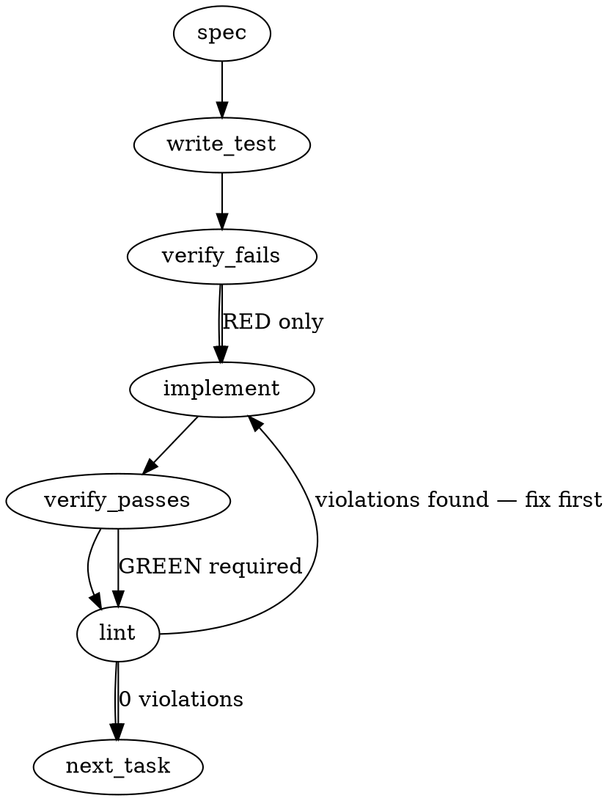

### Problem Statement

The Gate-1 wind-tunnel harness currently relies on a mock rule engine, silently masks False Positives under specific exposure floor conditions, and passively warns on corpus-completeness deviations. This task wires the actual AST post-image `readStrategy` engine into the `run` command, strictly re-derives S4 corpus-completeness as a hard error based on commit message semantics, and enforces an unconditional precedence where any False Positive fails the run immediately.

### Architectural Context

- **ADR-110 & Strategy#516 / #2188:** S4 contract asserts that missing/extra PRs that mutate functional code (feat, fix, refactor, perf) are fatal (no silent shrink, §5). `chore(deps)` and `docs` are excluded.
- **Enforcement Model (from Totem Knowledge):** The platform emphasizes deterministic building blocks. Replacing the mock engine with the actual AST compiled rules enforces this deterministic substrate over the previous prose-based mock approximations.

### Files to Examine

1. `packages/cli/src/commands/spine-windtunnel.ts` — Houses `runCommand` (needs `readStrategy` wiring) and `assertCorpusCompleteness` (needs S4 hard-error logic).
2. `packages/core/src/spine/scorer.ts` (or equivalent location for `scoreWindtunnel`) — Houses the verdict evaluation logic that masks FP behind `HONEST-NEGATIVE`.
3. `packages/core/src/spine/windtunnel-parity.test.ts` — Contains the unit-proven mechanics for `enrichWithAstContext` + `applyAstRulesToAdditions` which must be replicated in `runCommand`.

### Technical Approach & Contracts

**1. Ratify Scorer Verdict Precedence**
Modify `scoreWindtunnel` to unconditionally prioritize `FAIL` (triggered by an explicit `FP` evaluation) over `HONEST-NEGATIVE`. The return contract remains the same, but the internal sorting/short-circuiting must be updated so `HONEST-NEGATIVE` is only returned if zero `FP` firings exist.

**2. S4 Hard-Error Corpus-Completeness Re-derivation**
Update `assertCorpusCompleteness`:

- Use `safeExec('git', ['log', '--format=%s', `${lock.asOfCommit}..HEAD`])` (or equivalent ancestry range from the lock base) in the local clone (`lcDir`).
- Parse the commits against a deterministic `selectionRule` regex.
  - **Include:** Prefix matches `feat`, `fix`, `refactor`, `perf` (with or without scopes).
  - **Exclude:** `chore(deps)` and `docs`.
- Extract PR numbers from the matching commit strings (e.g., matching `(#123)$` for squash-merges, or `Merge pull request #123`).
- Diff the extracted "expected" array against `lock.resolvedPrs`. If they are not strictly equal, throw a `TotemError`.

**3. Wire Post-Image `readStrategy` (C1/S1 Integration)**
Update `runCommand`:

- Remove the mock engine invocation.
- Import `readStrategy`, `enrichWithAstContext`, and `applyAstRulesToAdditions`.
- For each file diff in the lockfile (or fetched via git in the lc clone), extract additions.
- Pass the additions through `enrichWithAstContext(file, additions)`.
- Execute `applyAstRulesToAdditions(astContext, readStrategy.rules)`.
- Feed the results into `scoreWindtunnel`.

### Edge Cases & Traps

- **Commit History Ambiguity:** Squash-merges usually append `(#PR_NUMBER)` to the first line, but standard merges use `Merge pull request #PR_NUMBER from...`. The `selectionRule` parsing must handle both formats when determining which PRs map to which conventional commit scopes.
- **Race Conditions in AST Parsing:** If `runCommand` processes multiple PR diffs asynchronously, ensure `enrichWithAstContext` does not share mutated AST states. Map over PRs cleanly using `Promise.all`.
- **Silent Regressions on Unparseable Diff:** If a diff contains additions in a language Tree-sitter cannot parse, `enrichWithAstContext` must gracefully return empty/null contexts without crashing the whole run, unless strict enforcement requires a hard fail.
- **Shared Helpers Enforcement:** Do NOT use `child_process`. Use `safeExec` for the git log extraction.

### Implementation Tasks

- [ ] **Task 1: Ratify Scorer Verdict Precedence**
      Modify `scoreWindtunnel` (in `packages/core/src/spine/scorer.ts` or corresponding core file).

  > TEST DIRECTIVE: Before implementing, write a failing test named `unconditionally evaluates to FAIL when any firing is labeled FP, ignoring HONEST-NEGATIVE exposure floors` that proves the regression is caught.
  - Locate the return hierarchy in `scoreWindtunnel`.
  - Move the `FP` check above the `HONEST-NEGATIVE` exposure/cull-rate evaluation.
  - write test → verify fails → implement → verify passes → lint

- [ ] **Task 2: S4 Hard-Error Corpus-Completeness Re-derivation**
      Modify `assertCorpusCompleteness` in `packages/cli/src/commands/spine-windtunnel.ts`. Update its test file.

  > TEST DIRECTIVE: Before implementing, write a failing test named `throws TotemError when selectionRule re-derivation discovers a feat PR missing from lock.resolvedPrs` that proves the regression is caught.
  - Use the `safeExec` shared helper to extract merge history from `lcDir`.
  - Implement a `selectionRule` function locally or in a shared utility that filters git commit arrays based on the ADR-110 rules (`feat|fix|refactor|perf`, excluding `chore(deps)|docs`).
  - Extract PR numbers from the filtered commits.
  - Compare extracted PR numbers to `lock.resolvedPrs`.
  - Throw `TotemError` with a detailed mismatch diff if they do not perfectly align.
  - write test → verify fails → implement → verify passes → lint

- [ ] **Task 3: Wire readStrategy into runCommand**
      Modify `runCommand` in `packages/cli/src/commands/spine-windtunnel.ts`. Update its test file.
  > TEST DIRECTIVE: Before implementing, write a failing test named `processes diffs through enrichWithAstContext and applyAstRulesToAdditions using the actual readStrategy` that proves the regression is caught.
  - Remove the mock engine stub.
  - Load the strategy using `readStrategy` (which should now be resolving real minted rules).
  - Iterate over the PRs defined in `lock.resolvedPrs`.
  - Use `extractChangedFiles` (if applicable) or rely on the lockfile's diff payload to get file additions.
  - Map additions through `enrichWithAstContext`.
  - Map AST contexts through `applyAstRulesToAdditions` using `strategy.rules`.
  - Accumulate firings and pass them to `scoreWindtunnel`.
  - write test → verify fails → implement → verify passes → lint

### Execution Flow (structural constraint)

### Verification (MANDATORY — do not skip)

Every implementation MUST end with these steps:

1. `totem lint` — deterministic rule check (zero LLM, ~2s). Fixes any violations.
2. `totem review` — AI-powered architectural review (~18s). Addresses any critical findings.
3. If using MCP, call `verify_execution` to confirm compliance before declaring the task done.

### Test Plan

1. **Scorer Logic Verification:** Mock a windtunnel test payload that explicitly triggers the exposure-floor logic for an `HONEST-NEGATIVE` but also includes one `FP` firing. Assert the final returned verdict is `FAIL`.
2. **Corpus Completeness Hard Error:**
   - Mock `safeExec` to return a `git log` output containing `feat: add user login (#12)`, `docs: update readme (#13)`, and `chore(deps): bump react (#14)`.
   - Pass a lock object with `resolvedPrs: [12, 13]`. Assert `TotemError` is thrown due to the docs PR being strictly excluded by `selectionRule`.
   - Pass a lock object with `resolvedPrs: []`. Assert `TotemError` is thrown due to the missing feat PR.
   - Pass a lock object with `resolvedPrs: [12]`. Assert the function resolves cleanly.
3. **Engine Parity Enforcement:** Mock `enrichWithAstContext` and `applyAstRulesToAdditions`. In the `run` command test, assert that both functions are explicitly called with the post-image `readStrategy.rules` and the diff contents, replacing the legacy assertion that verified the mock engine invocation.

---

## Implementation Design

> **Slice scope: item 3 ONLY** (verdict-precedence ratification + precision-sentinel migration). Items 1 (wire `readStrategy` into `run` — blocked on strategy#516) and 2 (S4 `selectionRule` corpus re-derivation — separate slice) are explicitly out of this PR. Authority: strategy-claude verdict-semantics RULING, 2026-06-17 (in-reply-to the 2123Z ask; refines ADR-110 §4/§5).

### Scope (2 sentences)

Ratify `scoreWindtunnel`'s verdict semantics per the ruling: hoist both FAIL conditions (confirmed-FP, vacuous positive control) **above** the exposure-floor and cull-rate masquerade guards, and migrate the certifying `precision` field from the `0` placeholder to a `null` not-computed sentinel on every no-claim verdict, relocating the informative survivor-precision to a separate `diagnostics` namespace. This is a pure `packages/core/src/spine/windtunnel-scorer.ts` change plus its consumer formatter (`spine-windtunnel.ts` `printVerdict`) and test-lock — it does NOT touch `run`'s engine wiring or S4 corpus re-derivation.

### Data model deltas

- **`WindtunnelVerdict.precision`: `number` → `number | null`** (exported from `@mmnto/core`). Carries the **certifying** precision claim. Non-null ONLY on PASS (`1.0`) and confirmed-FP FAIL (the breaching `tpCount/labeledCount` — the evidence, must be reported). `null` on every no-claim verdict (exposure-floor HN, cull-rate HN, needs-adjudication HN, vacuous-control FAIL). Written by `scoreWindtunnel`; read by `printVerdict` + any future certifying-run consumer. **Invariant:** `null` ⟺ verdict makes no precision claim; `0` is now reserved for a _real_ all-FP measurement and never means "not computed" (the masquerade vector the ruling caught).
- **`WindtunnelVerdict.diagnostics`: new `{ survivorPrecision: number | null }`** (new nested field). Holds TP/(TP+FP) over labeled, surviving (non-culled, non-control) firings — informative even on no-claim verdicts (CR's "culled 8/10, the 2 survivors were clean"). `null` when no labeled surviving firings exist. Written by `scoreWindtunnel`; read by `printVerdict` (diagnostic line) + operator adjudication. **Invariant:** purely descriptive, NEVER consulted for the gate decision, never mistakable for `precision`.
- No new state containers; existing `culledRuleIds` set / `needsAdjudication` array / counters unchanged in kind.

### State lifecycle

All state is **per-call**, local to the pure `scoreWindtunnel` invocation: created at entry, mutated only within the single synchronous labeling/cull pass, returned in the verdict, never retained — no cross-call or cross-lifecycle state. `precision` and `diagnostics.survivorPrecision` are computed once from the labeling pass and never mutated after assignment. The function stays pure (no IO/clock/randomness — preserves the existing invariant). One ordering consequence: the labeling pass now runs **before** the exposure/cull guards (the guards need `hasFp`/`nonVacuity` to know they may not short-circuit), so the guard returns now report **truthful** `nonVacuity`/`needsAdjudication`/`diagnostics` instead of the current placeholder `false`/`[]`.

### Failure modes

| Failure                                                 | Category                   | Agent-facing surface                                                                | Recovery                                                                    |
| ------------------------------------------------------- | -------------------------- | ----------------------------------------------------------------------------------- | --------------------------------------------------------------------------- |
| Confirmed FP in window                                  | runtime (expected verdict) | `FAIL`, precision = breaching value, non-zero exit                                  | operator culls/declines the rule; re-run                                    |
| Vacuous positive control (target rule never fired)      | runtime (expected verdict) | `FAIL`, precision = `null`, `nonVacuity=false`, non-zero exit                       | fix/re-mint the broken rule; re-run                                         |
| Exposure-floor / cull-rate guard trips, no FAIL trigger | runtime (expected verdict) | `HONEST-NEGATIVE`, precision = `null`, non-zero exit                                | widen window/corpus; re-run (a result, not a fault — ADR-110 §5)            |
| Unlabeled firing, no FP, floors met                     | runtime (expected verdict) | `HONEST-NEGATIVE`, precision = `null`, `needsAdjudication` populated, non-zero exit | operator labels firings; re-run                                             |
| `printVerdict` formats a `null` precision               | runtime                    | prints `n/a (not computed)` — NOT a crash                                           | the `.toFixed` null-guard is the fix; absence of guard = Tenet-4 hard crash |

No silent-degradation rows: every no-claim path emits an explicit verdict + `null` sentinel + non-zero exit. The one NEW crash surface (`null.toFixed`) is closed by the formatter guard.

### Invariants to lock in via tests

- A confirmed FP co-occurring with a sub-floor exposure **or** over-threshold cull rate yields **FAIL**, not HONEST-NEGATIVE (FAIL outranks both masquerade guards).
- A vacuous positive control co-occurring with a sub-floor exposure yields **FAIL**, not HONEST-NEGATIVE.
- `precision` is `null` on exactly {exposure-floor HN, cull-rate HN, needs-adjudication HN, vacuous-control FAIL}, and a real number on exactly {PASS = 1.0, FP-FAIL = breaching}.
- `precision` is NEVER `0` as a "not-computed" signal; `0` can only arise as a genuine all-FP measurement on an FP-FAIL.
- `diagnostics.survivorPrecision` carries the survivor ratio on a HONEST-NEGATIVE (e.g. all-survivors-clean → `1.0`) while that same verdict's `precision` stays `null` — proving the two fields are distinct.
- Masquerade guards only ever demote a would-be PASS; a test asserts they never upgrade a FAIL.
- `printVerdict` renders a `null` precision without throwing.

### Open questions

- **Q-A — Precision on vacuous-control FAIL: `null` or computed?** Options: (a) `null` — the failure is structural (a positive control's rule didn't fire), no precision claim was reached, and `0` would falsely read as all-FP; (b) compute over whatever labeled firings exist — but that conflates a structural failure with a precision measurement. **Recommendation: (a) `null`.** The ruling's "FAIL = breaching value" addressed the FP case; vacuous-control FAIL makes no precision claim.
- **Q-B — Model `needs-adjudication` as a 4th `WindtunnelVerdictKind`, or keep `verdict='HONEST-NEGATIVE'` + populated `needsAdjudication[]`?** Options: (a) keep current array-as-discriminator; (b) add a distinct `'NEEDS-ADJUDICATION'` kind. **Recommendation: (a) keep current.** strategy-claude left the needs-adjudication-vs-HONEST-NEGATIVE ordering as my call and recommended ranking exposure-HONEST-NEGATIVE above it for the tie — both already satisfied by the array modeling; a 4th kind widens blast radius (every `switch` + the exit-code logic) for no contract gain.
