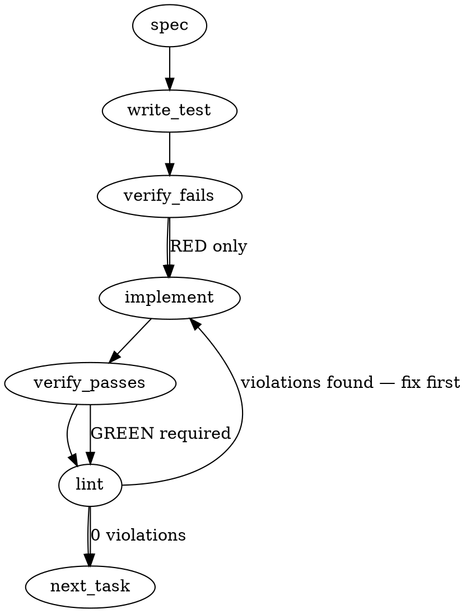

### Problem Statement
The `totem triage-pr` command currently fails to surface actionable bot review findings because it only fetches inline diff comments, ignoring PR review bodies and issue-comments, and its bot-author classifier omits modern AI bots like `greptile-apps[bot]`. Furthermore, the command outputs a misleading "Nothing to triage" message even when raw inline comments were detected but filtered out by the incomplete classifier.

### Architectural Context
- **CLI Lazy-Import Policy:** Per mmnto-ai/totem#1729 CR R1, all files matching `packages/cli/src/commands/**` must use dynamic imports (`await import(...)`) for their dependencies to ensure fast CLI startup. 
- **Bot-Tax Circuit Breaker Workflow:** The `triage-pr` command is expected to group findings into push-based rounds using `gh api repos/.../pulls/N/reviews`, but the current implementation is falling short.

### Files to Examine
1. `packages/cli/src/commands/triage-pr.ts` — Contains the `triagePrCommand` function, the early-exit output logic, and the bot classification filtering.
2. `packages/cli/src/adapters/github-cli-pr.ts` — The data access layer. Needs to be inspected to see how it currently fetches inline comments and augmented to fetch review bodies and issue comments.
3. `packages/cli/src/commands/triage-pr.test.ts` (or equivalent test file) — To verify test patterns for mocking GitHub CLI output and console assertions.

### Technical Approach & Contracts
We will unify the three GitHub API feedback surfaces (Inline Comments, Review Bodies, and Issue Comments) into a single actionable format before classification.

**1. Data Contracts:**
Define new TypeScript interfaces/Zod schemas in the adapter to represent the additional API payloads:
```typescript
interface GitHubReview {
  id: number;
  user: { login: string; type: string };
  body: string;
  state: string;
  commit_id: string;
}

interface GitHubIssueComment {
  id: number;
  user: { login: string; type: string };
  body: string;
}

// Unified interface for the CLI to process
interface UnifiedBotFinding {
  source: 'inline' | 'review' | 'issue_comment';
  author: string;
  body: string;
  url?: string;
}
```

**2. Adapter Enhancement:**
Extend `GitHubCliPrAdapter` to include `getReviews(prNumber: string)` and `getIssueComments(prNumber: string)`. These MUST use the shared `safeExec` helper to call `gh api --paginate repos/{owner}/{repo}/pulls/{n}/reviews` and `.../issues/{n}/comments`.

**3. Bot Classifier & Payload Parsing:**
Update the bot author allowlist to match `greptile-apps[bot]`, `coderabbitai[bot]`, and `gemini-code-assist[bot]`. 
In `triage-pr.ts`, parse Greptile's specific "Comments Outside Diff" by extracting content from `<details><summary>Comments Outside Diff</summary>...</details>` blocks within issue-comment bodies.

**4. Output Logic Adjustment:**
Track the `totalRawCommentsFetched` across all three surfaces. If `totalRawCommentsFetched > 0` but `classifiedBotComments === 0`, print: `"Found X comments across PR surfaces, but none were classified as bot findings. Check your bot classifier rules."` Never output "Nothing to triage" if the raw count > 0.

### Edge Cases & Traps
- **Pagination Drop:** GitHub API truncates lists to 30 items by default. The `gh api` calls MUST include the `--paginate` flag so heavily commented PRs don't drop findings.
- **Lazy Imports:** You MUST NOT add top-level `import { safeExec } from ...` in `triage-pr.ts`. It must be dynamically imported inside the command function.
- **Fragile HTML Parsing:** Greptile injects HTML `<details>` blocks for outside-diff comments. Use a non-greedy regex with the `s` (dotall) flag to extract this safely: `/<details>\s*<summary>.*?Comments Outside Diff.*?<\/summary>(.*?)<\/details>/is`.
- **Bot Suffix Inconsistency:** Sometimes the GitHub API payload's `user.login` lacks the `[bot]` suffix, but `user.type` is `"Bot"`. The classifier must check both the known name list AND `user.type === 'Bot'`.

### Implementation Tasks

- [ ] **Task 1: Update GitHub API Adapter Contracts & Fetchers**
  - Modify `packages/cli/src/adapters/github-cli-pr.ts`.
  - Add `getReviews` and `getIssueComments` methods using `safeExec`.
  - Ensure the `--paginate` flag is passed to the `gh api` arguments.
  - > TEST DIRECTIVE: Before implementing, write a failing test named `fetches reviews and issue comments using safeExec with paginate flag` in the adapter's test file.
  - write test → verify fails → implement → verify passes → lint

- [ ] **Task 2: Expand Bot Classifier Logic**
  - Modify the bot classification logic (likely a helper function or regex in `triage-pr.ts` or a shared utility).
  - Add `greptile-apps[bot]`, `greptile`, `coderabbitai[bot]`, `coderabbitai`, and `gemini-code-assist[bot]` to the allowlist.
  - Ensure it checks `user.type === 'Bot'` as a fallback or strict condition.
  - > TEST DIRECTIVE: Before implementing, write a failing test named `classifies greptile, coderabbit, and gemini bots correctly even without bot suffix`.
  - write test → verify fails → implement → verify passes → lint

- [ ] **Task 3: Unify Feedback Surfaces in CLI Command**
  - Modify `packages/cli/src/commands/triage-pr.ts`.
  - > TOTEM INVARIANT (Lazy-Import Policy): Dependencies in CLI commands must be dynamically imported inside the command function. Do not add top-level imports.
  - Dynamically import the adapter and call all three fetch methods (`getInlineComments`, `getReviews`, `getIssueComments`).
  - Implement the Regex extraction for `<details>` blocks specifically targeting Greptile's "Comments Outside Diff" inside the issue-comment processing map.
  - Map all results to the `UnifiedBotFinding` interface.
  - > TEST DIRECTIVE: Before implementing, write a failing test named `extracts findings from inline comments, review bodies, and hidden outside-diff details blocks`.
  - write test → verify fails → implement → verify passes → lint

- [ ] **Task 4: Fix Misleading Empty State Output**
  - Modify the output formatting logic in `packages/cli/src/commands/triage-pr.ts`.
  - Remove the hardcoded "No bot review comments found. Nothing to triage." string if raw comments > 0.
  - Add logic to check `totalFetched > 0 && classified === 0` to print the warning about checking bot classifier rules.
  - > TEST DIRECTIVE: Before implementing, write a failing test named `warns about unclassified comments instead of reporting nothing to triage when raw comments exist`.
  - write test → verify fails → implement → verify passes → lint

### Execution Flow (structural constraint)


### Verification (MANDATORY — do not skip)
Every implementation MUST end with these steps:
1. `totem lint` — deterministic rule check (zero LLM, ~2s). Fixes any violations.
2. `totem review` — AI-powered architectural review (~18s). Addresses any critical findings.
3. If using MCP, call `verify_execution` to confirm compliance before declaring the task done.

### Test Plan
1. **Adapter Test:** Mock `safeExec` to return paginated GitHub API JSON for PR reviews and issue comments. Verify the adapter parses them into the correct interfaces.
2. **Classifier Test:** Pass mock API payloads from `greptile-apps[bot]`, `user.type="Bot"` but name `"coderabbitai"`, and verify they are flagged as bot findings.
3. **Surface Unification Test:** Provide a mocked PR with 0 inline comments, 1 CodeRabbit review body summary, and 1 Greptile issue-comment containing a `<details>` block. Verify `triage-pr` surfaces exactly 2 actionable findings.
4. **Output Test:** Mock 2 inline comments from a human (`user.type="User"`). Run `triage-pr`. Assert the console output reads `Found 2 comments... but none were classified as bot findings` and DOES NOT output `Nothing to triage`.

---

## Implementation Design

> **Authored against ground truth (live GitHub payloads + code map), not the issue's stated premise.** The spec above is the LLM-generated skeleton; this section corrects it where empirical reality diverges. Two premises in the issue/spec are **empirically false** and are dropped (see Negative Scope).

### What 1.75.1 already fixed (so this is NOT the scope)
PR #2244 (`5289be67`) already shipped greptile **inline** recognition (`isBotComment`/`detectBot`/`parseGreptileSeverity`), greptile in the core enums (`RecurrenceToolSchema`, `RetrospectFindingToolSchema`, `toSeverityBucket`), and CodeRabbit review-body parsing is already wired (`extractReviewBodyFindings` → `parseCodeRabbitReviewFindings` → nits + **Comments Outside Diff**). The original #2190 bug ("greptile P1/P2 inline dropped → Nothing to triage") is **fixed**.

### Empirical corrections to the issue's premise (verified on PRs #2190/#2244)
1. **Greptile does NOT use a "Comments Outside Diff" `<details>` block.** That is a **CodeRabbit** construct, posted in the CR *review body* (`pulls/{n}/reviews`) and already parsed. Greptile's review body is **empty** (`state: COMMENTED`, `body: ""`).
2. **Greptile's only out-of-diff surface is its summary issue-comment** ("Greptile Summary" + Confidence Score + an "Important Files Changed" *table*). The table's Overview prose is descriptive, occasionally embedding a finding (#2190: *"`filesTouchedInWindow`… silently never checked in Step 2"*) but is not a clean findings list. Mining it as discrete findings = noise (violates `feedback_derived_summary_not_source_verify`).
3. **`gh pr view --json comments/reviews` strips the `[bot]` suffix** (`greptile-apps`, `coderabbitai`), so `isBotComment`'s greptile regex (deliberately `[bot]`-required since #2244 R2, to reject humans like `alice-greptile`) fails on `gh pr view` data. The `gh api .../issues/{n}/comments` route preserves `greptile-apps[bot]` **and** returns `user.type: "Bot"` — a suffix-independent signal.

### Scope (2 sentences)
Make `triage-pr` fetch the **issue-comment surface** via `gh api` (suffix- + type-preserving), surface each recognized bot's **summary as a context line** (e.g. greptile "Confidence 5/5"), and fix the **misleading empty-state output** so "Nothing to triage" is never printed when bot-authored material was fetched. It will **NOT** mine summaries/tables for discrete findings, **NOT** build a greptile `<details>`/Outside-Diff parser (empirically absent), and **NOT** parse greptile review bodies (empirically empty).

### Data model deltas
- **`StandardIssueComment`** (new, `pr-adapter.ts`) — `{ author: string /* with [bot] */, authorType: string /* 'Bot'|'User'|'Organization' */, body: string, createdAt?: string }`. Written by the adapter; read by triage-pr (and reusable by recurrence-stats/retrospect later, out of scope here). Invariant: `author` preserves the `[bot]` suffix (guaranteed by sourcing from `gh api`, not `gh pr view`).
- **`fetchIssueComments(prNumber): StandardIssueComment[]`** (new optional method on `PrAdapter`, implemented in `github-cli-pr.ts`) — `gh api repos/{nwo}/issues/{n}/comments --paginate`; Zod `GhIssueCommentSchema`. Optional on the interface (mirrors `fetchReviews?`) so test/mocks needn't implement it.
- **`BotSummarySignal`** (new, parser helper) — `{ tool: BotTool, signal: string }` (e.g. `{tool:'greptile', signal:'Confidence 5/5 — safe to merge'}`). NOT a `NormalizedBotFinding` — it is context, never categorized/triaged/replied-to. Greptile confidence parsed via `/Confidence Score:\s*([0-5])\s*\/\s*5/i`; absent → no signal for that bot.
- **No new reserved keys / sentinels.** No change to `NormalizedBotFinding`, the core enums, or persisted schemas. `(review body)` sentinel file stays as-is.

### State lifecycle
All state is **per-invocation** (one `triage-pr` run): fetched arrays + the `rawBotMaterialCount` tally are local to `triagePrCommand`, created on fetch, read once for output, never persisted or shared. No cross-lifecycle flags, no module-level state, no singletons. Ownership: `triagePrCommand` owns the tally; the adapter owns fetch; the parser helper is pure.

### Failure modes
| Failure | Category | Agent-facing surface | Recovery |
| --- | --- | --- | --- |
| `gh api issues/{n}/comments` non-zero exit / network | transient/runtime | **warning** ("could not fetch issue-comments: <err>; triaging inline + review-body only") + continue | inline/review surfaces still triage; named degradation (Tenet-4 compliant — not silent) |
| Malformed JSON from gh api | runtime | warning (same as above); Zod parse error message included | continue degraded |
| Issue-comment body has no parseable confidence score | permanent (expected) | silent — no context line for that bot | n/a (absence of a signal is not a finding) |
| Pagination truncation (>30 comments) | permanent if unhandled | — | `--paginate` flag (mandatory) prevents it |
| Bot login lacks `[bot]` (e.g. via a future `gh pr view` path) | permanent | recognized anyway via `authorType==='Bot'` fallback at the issue-comment seam | robust by design |

The one "degradation" row (fetch failure → warn+continue) is justified vs Tenet-4: a hard error would **regress** the already-working inline triage for an additive surface; the failure is named on stderr, not dropped.

### Invariants to lock in via tests
- "Nothing to triage" is printed **only** when zero bot material was fetched across **all** surfaces (inline + review-body findings + bot issue-comments). When raw bot material > 0 but categorized findings == 0, a diagnostic (count + summary signals) is printed instead.
- A greptile summary issue-comment (`greptile-apps[bot]`, `type:Bot`) is recognized as bot material and its `Confidence N/5` surfaces as a context line; a human issue-comment (`type:User`) is not counted as bot material.
- Issue-comment recognition holds with the `[bot]` suffix present (gh api shape) **and** via `authorType==='Bot'` when a login substring alone wouldn't match the conservative greptile regex.
- Existing greptile/CR/GCA **inline** categorization is unchanged (no regression) — issue-comment summaries never enter the categorized-findings path.
- `fetchIssueComments` issues a `--paginate`d `gh api` call and preserves `[bot]` in `author`.
- Issue-comment fetch failure emits a named warning and does not abort inline/review triage.

### Open questions
- **Q1 — Issue-comment summaries: context-line vs mined-findings?**
  - Options: (A) count toward the output guard only; (B) **also surface a one-line context signal per bot** (confidence/verdict); (C) mine summary prose/table for discrete findings.
  - Recommendation: **B.** Closes the issue's "the summary was also not surfaced" without the noise/false-positive risk of C (the derived-summary-not-source trap). A is the lighter fallback if you want the smallest diff.
- **Q2 — Switch triage-pr's review-body source from `pr.reviews` (`gh pr view`, strips `[bot]`) to `fetchReviews` (`gh api`, keeps `[bot]`) for consistency with retrospect?**
  - Options: (A) leave as-is; (B) switch.
  - Recommendation: **A (leave as-is), note as a follow-up.** CR still matches by substring (`coderabbitai` ⊃ `coderabbit`) and greptile review bodies are empty, so there's no live miss today; switching widens the diff for no current behavior change. Flag it in the PR description.
- **Q3 — Cohort pre-build panel, or inline?**
  - This slice is one-package (cli) + one adapter method, below the spine-slice bar; the load-bearing decisions are product choices (Q1/Q2) for you, not deep architecture. Recommendation: **inline build + external bot pass**, skip the cohort panel unless you want it.

---

## Revised Approach (post-live-capture + operator status-model — SUPERSEDES the greptile `<details>` parser above)

Live capture (lc#617, greptile mid-review) + operator domain knowledge corrected the design. The greptile "Comments Outside Diff" `<details>` parser targets a structure **greptile does not use** (it is a CodeRabbit-only construct) — dropped. The real value is surfacing the **status signals an operator actually reads**, and ensuring nothing is under-reported, so the PR can be **read in full**.

### Per-bot status model (THIS repo's config — auto-invocation + CR summary feature DISABLED)
- **Greptile** — live-updated **summary comment** (edited in place across rounds): `<h3>Greptile Summary</h3>` · **`Confidence Score: N/5`** · Important Files Changed table · diagram. Confidence is the headline signal. Out-of-scope/deferral findings post **inline** (already handled), not in a `<details>`.
- **CodeRabbit** — summary-page feature is **disabled here**, so CR does NOT maintain a standing updated summary (it does when auto-invocation is on — behavior is config-dependent). CR status = its review body (`pulls/reviews`, parsed) + inline + reactions. No confidence-style signal.
- **GCA** — no summary page; **its last comment is its status**. Read the most-recent GCA comment + reactions.
- **All three** acknowledge a tag/invocation with a **👀 reaction**; a **👍 reaction = action taken**. Grounded: lc#617 invocation → GCA 👀, greptile 👍 (via `issues/comments/{id}/reactions`, which carries reactor login + emoji).

### Design conclusion
Because bot status is **per-bot AND config-dependent**, hard-coded per-bot summary parsing is fragile. Favor robust, universal, simple signals + completeness, then read in full:
1. **Empty-state guard** (done) — never under-report; bot-agnostic.
2. **Reaction status on the latest invocation** (👀 ack / 👍 acted), per bot, via the `/reactions` endpoint — universal, config-independent, attributable.
3. **Greptile Confidence Score** (N/5) — stable, greptile-specific, parsed from the summary already fetched.
4. **Drop** `parseGreptileOutsideDiff` (dead structure; the clever-scan anti-pattern). Leave the CR review-body parser untouched (CR genuinely uses it).

### New surface needed
- `fetchCommentReactions(commentId)` (or batched) → `{ reactor, emoji }[]` via `repos/{nwo}/issues/comments/{id}/reactions` (`--paginate`). Used to compute a per-bot `👀/👍/—` status line for the latest invocation comment(s).

### Official-docs grounding (3-bot research, 2026-06-24 — cited in journal)
Confirms/corrects the model from the bots' own docs (not forensics):
- **Reactions are DOCUMENTED for greptile, observed-only for CR/GCA.** Greptile has a dedicated Emoji Guide: **👀 = seen/in-progress (ack), 👍 = review done, 😕 = review FAILED** (`greptile.com/docs/code-review-bot/emoji-reactions`). CR's 👀-on-command-start and GCA's reactions are **undocumented** (observed implementation details). ⇒ greptile reactions are contractual; CR/GCA best-effort, coded defensively. **`😕 = greptile review failed` is a new must-surface signal** (a failed review is the exact false-green the guard exists to catch).
- **Greptile Confidence Score is DOCUMENTED: integer `N/5`** — 5 production-ready · 4 minor-polish · 3 impl-issues · 2 significant-bugs · 0–1 critical (`/docs/code-review/first-pr-review`). Parse `Confidence Score: N/5` (NOT a percentage).
- **"Comments Outside Diff" is CR-only — officially confirmed.** CR docs: `Outside diff range comments (N)` in the review body for findings that can't post inline. Greptile docs have **no** such `<details>` container (verified absent). ⇒ keep `parseCodeRabbitOutsideDiff`, **drop** `parseGreptileOutsideDiff`. Settled by docs, not just the live capture.
- **Greptile 👍 is overloaded** — 👍 on its summary/trigger comment = "done"; 👍 on an *inline* comment = a human feedback vote. Disambiguate by object + reactor login.
- **Severity (documented):** CR 🔴Critical/🟠Major/🟡Minor/🔵Trivial/⚪Info; GCA Critical/High/Medium/Low (SVG icon names undocumented — our `parseGCASeverity` keys on observed artifacts); greptile **P0/P1/P2** (P3 is undocumented — keep defensively).
- **Summary-disable config (confirms operator's "we disabled CR summary"):** CR `reviews.high_level_summary: false`; GCA `code_review.pull_request_opened.summary` default **false**; greptile `statusCommentsEnabled` / `updateExistingSummaryComment` / `shouldUpdateDescription`. Per-bot + config-dependent — confirmed.
- **Invocation (for parsing expectations only — operator triggers, not the CLI):** CR `@coderabbitai review|full review|summary|pause|resume`; GCA `/gemini review|summary`; greptile bare `@greptileai` (no `review` subcommand).

---

## FINAL (corrected) — greptile DOES emit Comments-Outside-Diff; the fix is mechanical (SUPERSEDES the "drop the parser" sections above)

The earlier "greptile has no Comments-Outside-Diff — drop `parseGreptileOutsideDiff`" conclusion was **WRONG**, twice over (merged-PR forensics + a docs pass that found it undocumented). A 3-agent forensic sweep of our own session transcripts + reading strategy#689's live structure corrected it:

- **Greptile DOES emit a Comments-Outside-Diff section**, anchored by the HTML-comment marker **`<!-- greptile_other_comments_section -->`**, rendered **below the flowchart**, above the `<sub>Reviews (N):…</sub>` footer (canonical per strategy#690). It is **edited away post-resolution**, so a merged/closed PR shows the marker with empty content — which is exactly why merged-PR forensics (and the official docs, which don't document it) read "absent." The marker is the empirical proof; key the parser on the **marker**, never a sampled PR shape.
- **The failure is real, cross-agent, recurring** — transcript sweep found ~24 genuine misses (lc-claude ~12, strategy-claude ~6, totem-claude ~6) where an agent declared a PR "clean/done" and the operator had to surface a greptile/CR out-of-diff finding (incl. a 🔴 Critical on totem#2178). The operator caught nearly every one; agents almost never self-caught. **Doctrine alone did not hold** (recurred after banking + strategy#690): agents coped by *bypassing* the broken `triage-pr`, which is itself the defect. ⇒ the durable fix is **mechanical**: make the tool surface it so no one has to bypass it.

### Implemented (this PR)
1. **Empty-state guard** (`evaluateTriageEmptyState`) — never "Nothing to triage" when bot material was fetched (kills the false-green every miss rode).
2. **`fetchIssueComments`** (gh api — preserves `[bot]` + `user.type`) → greptile's summary is fetched.
3. **Marker-anchored `parseGreptileOutsideDiff`** — extract from `<!-- greptile_other_comments_section -->` to the `<sub>` footer, surface as greptile findings via the existing bot-agnostic `| Bot |` table (no new render surface, per strategy 2047Z/2217Z). FIXED, not dropped.
4. **`parseGreptileConfidence`** — surface greptile's documented `N/5` merge-readiness score as triage context (5 prod-ready … 0–1 critical; `<5` flags likely-unaddressed findings).

### Deferred (strategy-cleared splits)
- **Reactions** (👀 seen / 👍 done / 😕 review-failed) — greptile's are docs-backed, CR/GCA's are observed-only. Needs a separate `/reactions` fetch + per-bot attribution; folds into the **cross-bot status Prop-096 sub-slice** (bound to strategy#474), NOT #2192. **Build from docs, never from a guessed model** (operator constraint).
- Greptile severity: docs are **P0/P1/P2** (no P3 — keep P3 defensively). CR/GCA SVG/emoji severity = observed artifacts.

### Validate-on-capture
The exact rendering of findings UNDER the marker is unvalidated (every reachable greptile sample is post-resolution/empty). The extractor surfaces the whole block (anti-glance over-surface) and is validated against the first live greptile out-of-diff section (this PR's own review or the next).

### Blast radius (merge-time, cross-agent)
Fixing the tool makes the banked workaround-memories stale across all 3 agents (totem-claude `feedback_pr_review_reply_hygiene`, lc-claude `feedback_pr_bot_comments_three_surfaces`, strategy-claude memory + `bot-protocols.md` + `review-reply/SKILL.md`). On merge: REFRAME (not delete — the fix is partial) + couple to the merge-ping (strategy lands the doctrine PR; each agent reframes its own memory). See `feedback_tool_fix_memory_blast_radius`.