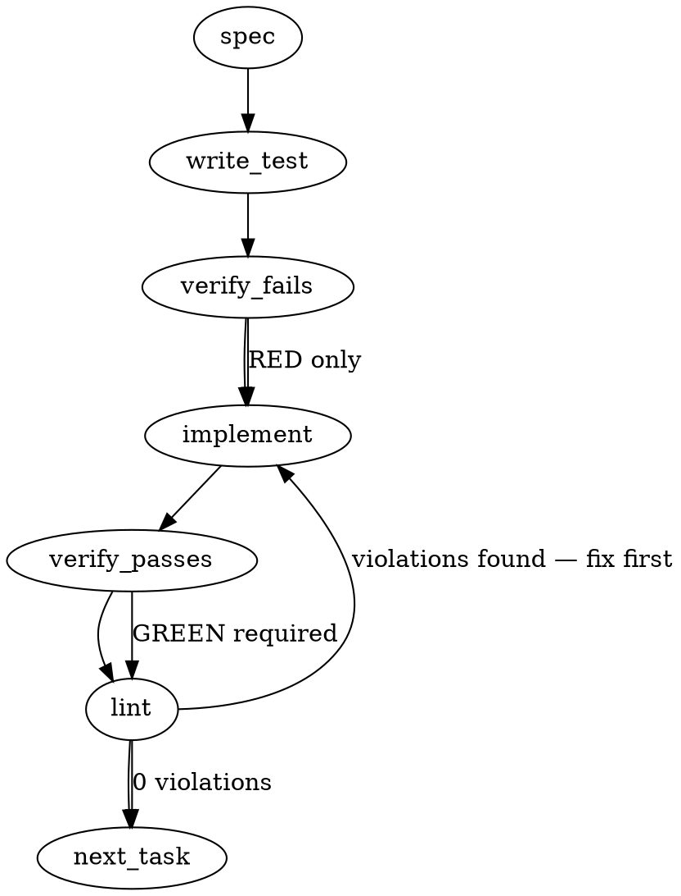

### Problem Statement

The `totem mail` CLI does not expose command-line flags to filter mail polling to a specific agent seat, making multi-seat repository operations awkward. Additionally, it lacks clear documentation stating that mail consumption/marking is intentionally skill-owned by `/signoff`, and does not subtract sent replies from the inbound "unread" poll calculation.

### Architectural Context

- **ADR-106 (Ephemeral Coordination Layer) §3 & Amendment 1 §A1.3**: Establishes that processed markers (consuming mail) must only be written by the consuming tooling (`/signoff`, the handoff CLI) to preserve the single-writer invariant. This CLI tool must only support read/send/reply and document this boundary clearly.
- **`TOTEM_SELF_AGENT` resolution**: The environment variable is already supported internally by `pollMail` and related session start hooks. This task surfaces it as a CLI flag (`--self` / `--to`).

### Files to Examine

- `packages/cli/src/commands/mail.ts` — Contains `pollMail`, `mailReply`, `MailCommandOptions`, and the commander/yargs CLI configuration for `totem mail` commands.
- `packages/cli/src/commands/mail.test.ts` (or corresponding test file in the suite) — Contains existing unit tests for the mail CLI operations and poll configurations.

### Technical Approach & Contracts

To support the seat-specific selector and outbox subtraction logic, we will extend the internal CLI command options and add frontmatter-driven deduplication.

#### Data Contract Changes

We will extend `MailCommandOptions` to explicitly accept the seat selector:

```typescript
export interface MailCommandOptions {
  env?: NodeJS.ProcessEnv;
  self?: string; // Explicit seat selector
  to?: string; // Alias to `--self` for poll, or used for send
  json?: boolean;
  recursive?: boolean;
}
```

We will define a Zod schema to safely read and validate outbox files to resolve the unread-subtraction logic:

```typescript
import { z } from 'zod';

export const OutboxFrontmatterSchema = z.object({
  to: z.string(),
  subject: z.string().optional(),
  inReplyTo: z.string().optional(), // Maps to the original inbound message's ID
});

export type OutboxFrontmatter = z.infer<typeof OutboxFrontmatterSchema>;
```

#### Resolution Logic

1. **Seat Selection Precedence**: Inside the CLI command runner, if `--self <seat>` or `--to <seat>` is provided, set/override `process.env.TOTEM_SELF_AGENT` (or `opts.env.TOTEM_SELF_AGENT` if isolating environment context) with the flag's value. Flag configuration MUST take precedence over the existing environment variable.
2. **Unread Deduplication Flow**:
   - In `pollMail`, after discovering inbound messages, resolve the target self-agent directories.
   - For each active self-agent, scan their local outbox directory: `<repo-root>/.totem/orchestration/<agent-id>/outbox/`.
   - If the directory exists, read all `.md` files, extract and parse their frontmatter using `OutboxFrontmatterSchema`.
   - Collect all valid `inReplyTo` values.
   - Filter out any inbound messages from the returned `unread` collection where the inbound message ID (or filename) matches one of the collected `inReplyTo` values.

---

### Edge Cases & Traps

- **Flag Namespace Collision**: `--to` is already used by `totem mail send` to specify the recipient. We must ensure that defining `--to` / `--self` on the parent command (or query subcommand) does not conflict with subcommand parsers. Isolation of options to the specific poll sub-action is recommended.
- **Missing/Empty Outbox Directory**: Active self-agents might not have an `outbox/` directory if they have never sent mail. Ensure path resolution handles missing directories gracefully without throwing errors (e.g., wrap in `fs.existsSync`).
- **Malformed Outbox Metadata**: Outbox messages written by custom hand-offs or interrupted processes might contain invalid YAML frontmatter. Wrap the parser in a `try/catch` block, skip the invalid file gracefully, and output a warning/debug message rather than crashing the polling process.
- **Multi-Seat Glob Overlap**: If multiple self-agents are active, scanning must aggregate all outbox replies across all active self-agents to prevent false positives/negatives in sibling directories.

---

### Implementation Tasks

- [ ] **Task 1: Add `--self` and `--to` Options to Mail Poll Command**
  - Add CLI option definitions for `--self <seat>` and `--to <seat>` to the mail poll command registration.
  - Implement the environment override logic inside the handler, prioritizing the command line flag over `process.env.TOTEM_SELF_AGENT`.
    > TEST DIRECTIVE: Before implementing, write a failing test named `respectsSelfSeatFlagOverEnvVar` that verifies passing `--self` or `--to` overrides any pre-set `TOTEM_SELF_AGENT` env variable.
  - write test → verify fails → implement → verify passes → lint

- [ ] **Task 2: Document Single-Writer Marker Restriction in Help Context**
  - Update the CLI `--help` text/description for `totem mail` to explicitly inform operators that processed/consume markers are skill-owned and written by `/signoff`.
    > TOTEM INVARIANT (Single-Writer Marker Invariant): Do not implement a CLI command to write processed markers here; the consuming tooling (/signoff, handoff CLI) owns the single-writer invariant for processed markers (ADR-106 Amendment 1 §A1.3).
  - Update any automated CLI help test snapshots to reflect the new documentation text.
  - write test → verify fails → implement → verify passes → lint

- [ ] **Task 3: Implement Sent Reply Subtraction for Unread Calculations**
  - In `pollMail`, scan the resolved self-agents' outbox directories (safely handling missing paths and invalid schemas).
  - Parse `inReplyTo` values and filter matching inbound items from the final unread results.
    > TEST DIRECTIVE: Before implementing, write a failing test named `subtractsRepliedMessagesFromUnread` that registers an inbound message, writes a reply message in the outbox containing a matching `inReplyTo` field, and asserts that the inbound message is excluded from the unread list.
  - write test → verify fails → implement → verify passes → lint

#### RED FLAGS

- Never move to the next task until the current task's tests pass AND lint is clean.
- Never accept "close enough" on a failing test. Fix it or rewrite the approach.
- Never skip the test step. No untested code advances to the next task.
- Never write code before writing the failing test (TDD is mandatory, not advisory).

---

### Execution Flow (structural constraint)



---

### Verification (MANDATORY — do not skip)

Every implementation MUST end with these steps:

1. `totem lint` — deterministic rule check (zero LLM, ~2s). Fixes any violations.
2. `totem review` — supplementary AI lanes over the diff (~18s, advisory). Address critical findings; your team's review discipline decides the review of record.
3. If using MCP, call `verify_execution` to confirm compliance before declaring the task done.

---

### Test Plan

#### 1. CLI Argument Precedence & Resolution

- **Scenario**: Run `totem mail` with `process.env.TOTEM_SELF_AGENT="agent-a"` but provide CLI flag `--self agent-b`.
- **Assertion**: Resolution metadata in `MailPollResult.selfAgents` should return `["agent-b"]`.

#### 2. Documentation and Help Verification

- **Scenario**: Execute command with `--help` option.
- **Assertion**: Output contains the text specifying that processed markers are managed by `/signoff`.

#### 3. Unread Calculation (ECL Handled-State Gap)

- **Scenario**: Inbound mail exists from `agent-x` to `agent-y`.
  - Case A: No reply in `agent-y` outbox. Result: message is marked `unread`.
  - Case B: Reply in `agent-y` outbox with `inReplyTo` set to inbound file ID. Result: message is excluded from `unread`.
  - Case C: Reply in `agent-y` outbox is malformed. Result: parser logs warning, message remains `unread`, command completes without error.
  - Case D: Outbox folder does not exist. Result: command succeeds, message remains `unread`.

---

## Implementation Design

**Governing spec note (ruling-over-synthesis):** the sections above were synthesized from the ISSUE BODY, which predates the 2026-08-13 BLIND-round contamination specimen and the expedite. The governing spec is the on-issue comment of 2026-08-13 (totem-claude, sharpened fail-loud contract) + strategy-claude's 1754Z dispatch. Three divergences from the synthesized spec, resolved here: (1) it misses the identity gate entirely — the gate is the PRIMARY deliverable; (2) its Task 3 (`inReplyTo` sent-reply subtraction) is OUT — a reply is not consumption, and deriving handled-state from outbox scans would mint a second handled-state writer against the ADR-106 §A1.3 single-writer mark contract (that lane is #2518/#2623 territory); (3) its `--self`/`--to` dual flag becomes a single `--as <seat>` (open question 2).

### Scope

Add the multi-seat identity gate, the `--as <seat>` selector, the `--all-seats` opt-out, and the skill-owned-consume help note to the `totem mail` poll path — `packages/cli` only (`mail.ts`, `index.ts`, tests, changeset). Will NOT touch: `resolveSelfAgents`/config semantics (doctrine-correct per lesson-08a3fa50 — the serve default is the defect, never the resolver), the hook path (`TOTEM_HOOK_SELF_AGENT_OVERRIDE` is a separate scoped knob), `mail send`/`reply`/`mark` (already fail-loud on ambiguity via `resolveSelfSender`), and any handled-state derivation.

### Data model deltas

- `MailCommandOptions` += `asSeat?: string` (from `--as`), `allSeats?: boolean` (from `--all-seats`). Written by the commander action, read by `mailCommand`/`pollMail`. Mutually exclusive (hard usage error together).
- `MailPollResult` += `seatGate?: { withheldDirected: number }` — present iff the gate fired. Written by `pollMail`, read by `formatTextResult` + `--json` consumers. Additive-optional ⇒ JSON backward-compatible. Invariant: `seatGate` present ⇔ zero union-directed entries in `mail[]`; the count is COUNT ONLY — no subjects/senders/files (the listing is the exposure surface; naming withheld items would rebuild it inside the warning).
- Gate predicate, pure and per-call: `gated = agents.length > 1 && source !== 'env' && opts.allSeats !== true`. Single-seat resolutions from ANY source stay exempt (no consumer-repo regression); multi-seat `source: 'env'` is an explicit operator declaration and stays exempt.
- No new state containers, no module state, no reserved keys.

### State lifecycle

None beyond per-call locals. `--as` is implemented as validated env-injection at the `mailCommand` boundary: resolve the union with `resolveSelfAgents(repoRoot, env)` first, refuse if `asSeat` ∉ union (forecloses the lesson-2923d5e0 foreign-anchor trap — polling as a seat that does not live here answers "ever addressed," never "unread"), then call `pollMail` with `env.TOTEM_SELF_AGENT = asSeat` on a COPY of env. Resolution then flows through the existing resolver — the banner truthfully reports `(source: env)` and the core `SelfAgentResolution` union gains no new member (protects every `source` consumer, incl. the #2634 provenance sensor, from an unknown value).

### Failure modes

| Failure                                                   | Category   | Agent-facing surface                                                                                                                                                                                                                                                                                            | Recovery                                                                                             |
| --------------------------------------------------------- | ---------- | --------------------------------------------------------------------------------------------------------------------------------------------------------------------------------------------------------------------------------------------------------------------------------------------------------------- | ---------------------------------------------------------------------------------------------------- |
| Multi-seat non-env identity-less poll (the specimen)      | runtime    | GATED: broadcast-only serve; `warnings` line naming union + source + withheld COUNT; dedicated verdict arm; exit 2                                                                                                                                                                                              | pass `--as <seat>` / set per-shell `TOTEM_SELF_AGENT`, or `--all-seats` for the named dashboard view |
| `--as` seat outside the resolved union                    | init/usage | hard `TotemError` naming the resolved union + the foreign-anchor rule                                                                                                                                                                                                                                           | use a union seat, or poll from that seat's home repo                                                 |
| `--as` fails `assertSafeAgentId`                          | init/usage | hard error (existing helper)                                                                                                                                                                                                                                                                                    | fix the id                                                                                           |
| `--as` + `--all-seats` together                           | init/usage | hard usage error (contradictory intent)                                                                                                                                                                                                                                                                         | pick one                                                                                             |
| Future un-env-bound compaction-style caller hits the gate | runtime    | `warnings` non-empty ⇒ A2.2-class completeness gates go red ⇒ retain-everything                                                                                                                                                                                                                                 | env-bind the caller (ecl-gc pattern)                                                                 |
| `source: 'none'`                                          | unchanged  | exit 2 NOT DERIVED (existing #2312 arm)                                                                                                                                                                                                                                                                         | unchanged                                                                                            |
| Withheld count bounded by `maxScan` window                | runtime    | truncation warning composes with the gate line; under the gate the WHOLE self-token tail is a COUNT — the filename token is untrusted for delivery truth (codex F2), so an unopened tail is never named, broadcast-token or not (leg F1 fold + re-arm finding 3)                                                | raise `--max-scan` / reduce backlog                                                                  |
| Degraded scan under the gate                              | runtime    | gated verdict arm keys the #2516 `INCOMPLETE` discriminator on NON-gate warnings (the gate line is serve-policy, always present when gated — leg F2 fold)                                                                                                                                                       | fix the named scan fault                                                                             |
| Unclassifiable dispatch (read/parse failure) under gate   | runtime    | NAMED LIMIT: warned with its filename before its `to:` is knowable — an integrity signal that cannot be seat-scoped                                                                                                                                                                                             | sender fixes the dispatch                                                                            |
| Lifecycle sense under the gate                            | runtime    | #2511 suspended/retired notices still emit for withheld directed mail with GATE-AWARE wording ("WITHHELD", never "surfacing" — re-arm finding 1; they name only a union SEAT already in the banner, a stated trade); collision registration stays excluded (names filenames; env-bound polls preserve coverage) | n/a (sense, not fault)                                                                               |
| `mail reply <src> --as <seat>` (flag on a sibling verb)   | init/usage | NAMED LIMIT: `--as` is parent-scoped; Commander consumes it at the `mail` level and the reply actuator never sees it — the reply's sender still resolves via env/`--from` (re-arm finding 8). Documented poll-only in the cli-reference                                                                         | use `mail reply --from <seat>`                                                                       |
| `--as` with an EMPTY structural union (worktree shape)    | init/usage | falls back to the env-declared list (operator-declared, gate-exempt — leg F4 fold); refusals append the resolver's own diagnostics (leg F3 fold)                                                                                                                                                                | declare identity via env, or register the seat                                                       |

No silent-degradation rows. Channel choice is deliberate: the gate line rides `warnings` (not `notices`) because (a) a gated poll cannot certify a clean directed inbox — exactly the #2516 INCOMPLETE-verdict class, and (b) `warnings.length` arms every A2.2-style completeness gate, so any future compaction caller that forgets env-binding fails toward RETAIN, never toward the false-unread bomb. ecl-gc's own discovery + A2.4 verify polls force `TOTEM_SELF_AGENT` (A2.3) and are structurally exempt.

### Invariants to lock in via tests

1. Multi-seat config resolution, no env, no flags ⇒ union-directed items absent from `mail[]` (text AND `--json` identically), `seatGate.withheldDirected` equals the would-have-served count, broadcasts still serve, exit 2, warning names union + source + count and nothing else.
2. `withheldDirected` counts ONLY would-have-served items: excludes broadcasts, non-union-directed dispatches, and processed-subtracted items.
3. `--as <union-seat>` ⇒ exactly that seat's directed mail; banner `(source: env)`; exit 0; marks subtraction anchored to that seat.
4. `--as <non-union-seat>` ⇒ hard refusal naming the union; nothing served, nothing withheld-counted.
5. `--all-seats` ⇒ `mail[]` byte-identical to today's union serve; exit 0; one explicit line naming the union view.
6. No-regression: single-seat resolution from every source, and multi-seat `source: 'env'`, produce byte-identical results to HEAD.
7. ecl-gc discovery (`includeProcessed`, forced env) and A2.4 verify polls are never gated — A2.1 raw view intact.
8. Broadcast per-seat denominator math is unchanged when the gate fires (subtraction/denominators still computed over the full resolved union exactly as at HEAD).
9. Gate + truncation compose: both warnings present, gated verdict arm still renders.
10. `totem mail --help` documents the consume path (`mail mark` is the consumption actuator; reading never marks) — the #2204 ask 2 note, updated for the post-body existence of `mark`.

### Open questions

- **Question 1:** Exit code for the gated-ambiguous arm?
  - **Options:** (a) exit 2 — joins the #2312 NOT-DERIVED family: a per-seat inbox verdict cannot be asserted without identity; scripts stop and demand identity. (b) exit 0 — broadcast partial-serve treated as success; softer for legacy dashboard habits.
  - **Recommendation:** (a) exit 2. The gated poll withholds the very verdict the caller asked for; 0 would be the reassuring-lead class #2516 exists to kill. Dashboards get exit 0 via explicit `--all-seats`.
- **Question 2:** Selector flag name?
  - **Options:** (a) `--as <seat>` only (matches the on-issue sharpened spec; reads as "poll as"); (b) `--self <seat>` (the original issue body's name); (c) both as aliases.
  - **Recommendation:** (a) `--as` only, with the help line mentioning it satisfies #2204's `--self/--to` ask — one canonical name, no alias drift.
- **Question 3:** Extend `--as` to `mail send`/`reply`/`mark` as a unifying alias for their existing `--from`/`--agent-id`?
  - **Recommendation:** No — out of scope; those paths already fail loud on ambiguity, and a rename lane belongs to ADR-094 grammar work, not this fix.
