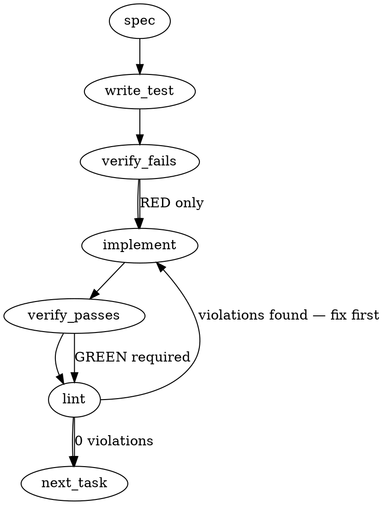

### Problem Statement

The `mail` command currently polls for agent messages but blindly processes the inbox state without awareness of structural conflicts, such as multiple active mail files targeting the same resource or identical queued tasks. We must implement a "mail collision sensor" to detect and report these conflicts deterministically during the poll phase.

### Architectural Context

- **Sensors, Not Actuators (docs/manual/why-totem.md):** Totem's core tenet dictates it is a governance platform, not an orchestrator. The collision sensor must strictly _detect_ and _report_ mail collisions in the output payload. It is strictly forbidden from attempting to resolve the collision (e.g., no deleting duplicates, no applying file locks, no renaming files). You wire the actuator; Totem only provides the sensor.

### Files to Examine

1. `packages/cli/src/commands/mail.ts` — Core logic for mail polling. Contains `MailPollResult`, `pollMail`, and `formatTextResult`. Needs structural updates to support collision reporting.
2. `docs/manual/why-totem.md` — Explains the architectural boundary between sensing (what this task does) and actuating (what this task must avoid).

### Technical Approach & Contracts

1. **Define the Data Contract:**
   Update `packages/cli/src/commands/mail.ts` to include a new collision contract.

   ```typescript
   export type CollisionType = 'duplicate_task' | 'target_overlap' | 'malformed_entry';

   export interface MailCollision {
     type: CollisionType;
     description: string;
     affectedFiles: string[];
   }
   ```

2. **Extend Existing Interfaces:**
   Modify `MailPollResult` to optionally include the sensor's findings:
   ```typescript
   export interface MailPollResult {
     // ... existing fields (workspace, selfAgents)
     collisions: MailCollision[]; // Guarantee array, empty if clean
   }
   ```
3. **Implement the Sensor Logic:**
   Create a pure function `detectMailCollisions(mailFiles: string[]): MailCollision[]` that reads mail configurations (using `readJsonSafe` from `@mmnto/totem` shared helpers to prevent parsing crashes) and evaluates them for overlapping criteria.
4. **Format the Output:**
   Update `formatTextResult` to append collision data if `result.collisions.length > 0`. Outputting clear warnings allows the user's external actuators (like a CI pipeline or git hook) to fail or halt.

### Edge Cases & Traps

- **The Actuator Trap:** The developer might be tempted to move or delete colliding files. This violates the `Sensors, Not Actuators` invariant. Only read and report.
- **Malformed Mail Files:** A collision sensor that crashes on invalid JSON defeats the purpose. You MUST use the shared helper `readJsonSafe` wrapped in a try/catch, treating parsing failures as a `malformed_entry` collision rather than throwing a fatal process error.
- **Transient Files:** Exclude `.tmp` or `.lock` files from collision detection to prevent false positives caused by agents currently writing to the inbox.
- **Empty Inbox Race Condition:** Polling an empty inbox must safely return `{ ..., collisions: [] }` without erroring out.

### Implementation Tasks

- [ ] **Task 1: Update Data Contracts**
  - Modify `packages/cli/src/commands/mail.ts` to export `MailCollision` and `CollisionType` types.
  - Update `MailPollResult` to require `collisions: MailCollision[]`.
    > TEST DIRECTIVE: Before implementing, write a failing test named `MailPollResult initialization requires empty collisions array` in the relevant test file to ensure the type checker enforces the new contract.
  - Update any existing mocks or fixtures in the test suite to include `collisions: []`.
  - write test (or update existing) → verify fails → implement → verify passes → lint

- [ ] **Task 2: Implement Sensor Logic**
  - Create `detectMailCollisions` function in `packages/cli/src/commands/mail.ts` (or a sibling utility if the file is too large).
    > TOTEM INVARIANT (Sensors, Not Actuators): The `detectMailCollisions` function must only read files (using `readJsonSafe`) and return metadata. It must not invoke `fs.unlinkSync`, `fs.renameSync`, or any state-mutating operations.
  - Filter out `.tmp` and `.lock` files before processing.
  - Detect overlapping targets and capture parsing failures via `readJsonSafe` as `malformed_entry` collisions.
    > TEST DIRECTIVE: Before implementing, write a failing test named `detectMailCollisions returns target_overlap without modifying filesystem` that mocks two mail files targeting the same agent and verifies the returned collision array.
  - write test (or update existing) → verify fails → implement → verify passes → lint

- [ ] **Task 3: Integrate with pollMail and Output Formatter**
  - Inside `pollMail`, invoke `detectMailCollisions` and attach the result to the returned `MailPollResult`.
  - Update `formatTextResult` in `packages/cli/src/commands/mail.ts`. If `collisions` exist, append a prominent warning block (e.g., `[!] Collisions Detected: \n - Target Overlap in file A and file B`).
    > TEST DIRECTIVE: Before implementing, write a failing test named `formatTextResult appends warning block when collisions exist` to ensure text reporting correctly surfaces the sensor data.
  - write test (or update existing) → verify fails → implement → verify passes → lint

### Execution Flow (structural constraint)



### Verification (MANDATORY — do not skip)

Every implementation MUST end with these steps:

1. `totem lint` — deterministic rule check (zero LLM, ~2s). Fixes any violations.
2. `totem review` — AI-powered architectural review (~18s). Addresses any critical findings.
3. If using MCP, call `verify_execution` to confirm compliance before declaring the task done.

### Test Plan

- **Contract Test:** Ensure `MailPollResult` strict typing blocks compilations where `collisions` is omitted.
- **Transient File Test:** Create a `.tmp` file and verify `detectMailCollisions` ignores it completely.
- **Overlap Detection Test:** Provide two valid JSON mail files targeting the same self-agent. Verify `collisions` array has length 1 with type `target_overlap`.
- **Malformed Entry Test:** Provide one valid mail file and one corrupt JSON file. Verify `readJsonSafe` safely catches the error and generates a `malformed_entry` collision.
- **Formatter Test:** Pass a synthetic `MailPollResult` with 2 collisions to `formatTextResult` and assert the resulting string contains the formatted warning messages.

## Implementation Design

> **Supersedes the generated body above.** The generated spec hallucinated a
> `MailCollision`/`CollisionType` typed contract, `readJsonSafe` JSON parsing,
> and `.tmp`/`.lock` filtering — none of it matches the system (mail files are
> markdown frontmatter, parsed by `parseHeader`), and a separate `collisions`
> field would NOT compose with the A2.2 compaction gate, which arms on
> `poll.warnings.length === 0` (#2309). The authoritative shape is the #2311
> issue body — the blessed read-side half of mmnto-ai/totem-strategy#827
> (owner disposition re-verified current 2026-07-07; doctrine half is
> strategy#829, not this PR).

### Scope

Add cross-sender basename-collision detection inside `pollMail`
(`packages/cli/src/commands/mail.ts`): when the same addressed-inbound
basename is seen from ≥2 distinct sender agent-ids in one poll, push one
structured warning per colliding basename into the EXISTING `warnings` array.
NOT in scope: any new field on `MailPollResult`, filename-convention or
`mail send` changes, `totem-status` parsing, compaction-key semantics (A2.1
basename dedupe unchanged), doctrine text (strategy#829), and any actuation —
sensor only (Tenet 13).

### Data model deltas

None on any exported type. `MailPollResult.warnings: string[]` is the
existing channel; the JSON payload and `formatTextResult` (`Warning:` lines)
already render it. One new function-local container inside `pollMail`:

- `collisions: Map<string, Map<string, string>>` — basename → (sender-id
  lowercased → display path `repo/agent`). Written only by the post-parse
  loop; read once after the loop to emit warnings; never escapes the call.
  Bounded by scan size (≤ MAX_SCAN entries).

Sender identity = the **outbox-owner seat** (`slot.agent`, compared
case-insensitively, parity with `selfLower`) — deliberately NOT the
`header.from ?? slot.agent` display semantics of `MailEntry.from`: under
single-writer discipline the outbox directory is filesystem truth, while
`from:` is a forgeable self-declaration (see the frontmatter-forge-defense
test class). Keying on seat, not outbox path string, is load-bearing:
broadcast fan-out (one seat, same basename, several repos) must not fire.

### State lifecycle

Per-call only: the map is created at `pollMail` entry, populated during the
in-scope parse loop (after the `to:` self/broadcast filter — addressed-inbound
entries only), drained into `warnings` before return, and garbage-collected
with the call frame. No module state, no persistence, no cross-call carry.

### Failure modes

| Failure                                                               | Category                      | Agent-facing surface                                                                                                                                              | Recovery                                                                                                                                        |
| --------------------------------------------------------------------- | ----------------------------- | ----------------------------------------------------------------------------------------------------------------------------------------------------------------- | ----------------------------------------------------------------------------------------------------------------------------------------------- |
| ≥2 distinct senders, same addressed-inbound basename                  | runtime (the detected hazard) | warning: `cross-sender basename collision: <name> from <repo/agentA> and <repo/agentB> — a single processed/ mark would shadow both`                              | operator/sender renames or consumes both before marking; compaction auto-blocked meanwhile via the existing warnings arm                        |
| Collision where one file is already `processed/`-marked               | runtime                       | plain poll cannot see it (mark filters both at pass 1) — but the compaction discovery poll runs `includeProcessed: true`, sees both, fires the warning → gate red | bounded by design: issue's stated coverage (coexistence window + compaction-poll visibility); staggered class bounded by mark-compaction itself |
| Colliding file beyond MAX_SCAN horizon                                | transient                     | not detected by this sensor; existing truncation warning fires and independently reds the gate                                                                    | rerun with higher `maxScan`; gate stays closed until un-truncated                                                                               |
| Same sender, same basename, multiple repos (broadcast fan-out)        | — (non-failure)               | silent non-fire BY DESIGN: the copies are one dispatch; one mark shadowing all copies is correct handled-semantics                                                | n/a — justified vs Tenet 4: nothing is lost                                                                                                     |
| Collision arises between compaction discovery and A2.4 verify re-poll | transient                     | `verifyComplete=false` (existing verify arm counts warnings) — loud hard-failure signal                                                                           | re-run compaction; gate now red at discovery                                                                                                    |

No new I/O and no new throw paths: detection is pure bookkeeping over
already-parsed entries.

### Invariants to lock in via tests

- Two distinct senders, same basename, both addressed to self → exactly ONE
  warning, naming the basename and both `repo/agent` paths.
- Broadcast+directed mix counts: sender A `to: broadcast`, sender B `to: <self>`,
  same basename → fires (both are addressed-inbound for this seat).
- Same sender, same basename, two repos → NO warning (agent-id keying).
- Distinct senders, same basename, neither addressed to self → NO warning
  (not this seat's shadow hazard).
- Three senders, one basename → still ONE warning listing all three paths.
- `includeProcessed: true` poll sees a collision even when one side is
  marked → warning present → `eclCompact` gate red (composition test at the
  ecl-gc level, no new gate plumbing).
- Plain-poll result contract unchanged: no new fields, `warnings` ordering of
  pre-existing classes untouched (collision warnings append after the scan).

### Open questions

- **Question:** Run a fresh pre-build cohort panel, or treat the upstream
  bless as the panel?
- **Options:** (a) panel now — cohort seats each review the shape; (b) skip —
  the shape was already consulted and blessed on strategy#827 (owner
  disposition) and this issue IS the agreed read-side contract; external-bot
  PR review remains as the secondary pass.
- **Recommendation:** (b) skip — a fresh panel re-litigates a settled
  contract; bots still review the PR.
