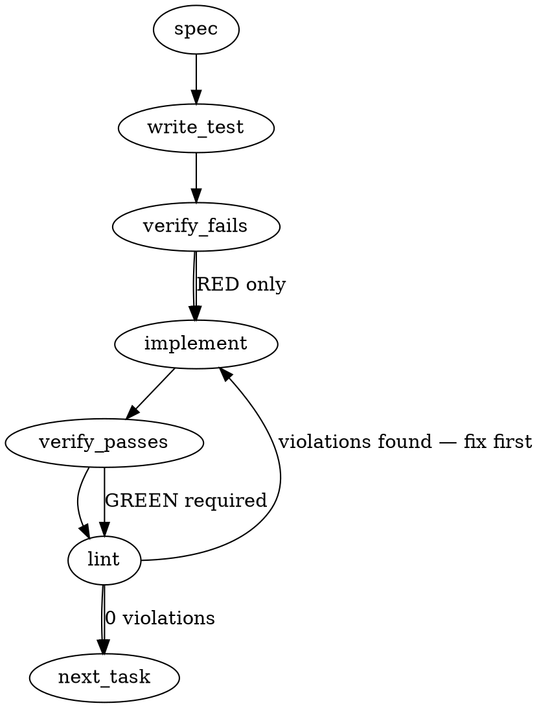

### Problem Statement

The deterministic `shield` integration test is masking a config resolution failure because it relies on a loose `exit(1)` assertion that passes when a missing-config error occurs, instead of failing on the intended planted traps. We need to explicitly seed a minimal `totem.config.json` in the test fixture, bypass the deprecated redirect chain by calling `totem lint` directly, and tighten the assertions to guarantee the exit code stems from trap detection.

### Architectural Context

This drift is a consequence of the zero-trust substrate and compile-hardening introduced in the `1.14.x` / `1.15.0` releases. `totem lint` (which `shield --deterministic` redirects to) now mandates an explicit configuration to resolve the project context. The redirect chain masked this new constraint until the smoke sensor was revived.

### Files to Examine

1. `packages/cli/src/commands/shield-eval.integration.test.ts` — Contains the failing test (lines 307-320) and the adversarial fixture setup (`scaffoldAdversarialRepo`).

### Technical Approach & Contracts

1. **Assertion Tightening:** Reorder the test assertions so that stdout/stderr is evaluated _before_ the exit code. We must explicitly assert that the output contains the expected traps (`TRAP-001`) and does _not_ contain the config error (`No Totem configuration found`).
2. **Configuration Seeding:** Before executing the subprocess in the test block, write a minimal `totem.config.json` (e.g., `{}`) to the adversarial fixture's root. Review the sibling Gemini test (around line 327) to copy the exact minimal JSON payload it uses to satisfy the config parser.
3. **Bypass Deprecation:** Update the child process command to invoke `node dist/index.js lint --staged` directly, rather than relying on `shield --deterministic --staged`.

### Edge Cases & Traps

- **Process Throw on Non-Zero Exit:** When using shell execution (like `safeExec` or `execSync`), an exit code of 1 will throw. The test must catch the error and extract `stdout`/`stderr` from the error object to run the assertions, rather than assuming a successful return.
- **Assertion Ordering:** If `expect(exitCode).toBe(1)` occurs before output assertions, a test failure due to missing config will result in a confusing diff on the secondary assertion. Always assert the specific output _first_.
- **Asynchronous File Writes:** Ensure the `totem.config.json` write is synchronous (`fs.writeFileSync`) or explicitly awaited before spawning the CLI process to prevent race conditions.

### Implementation Tasks

- [ ] **Task 1: Tighten Assertions (Failing State)**
  - Modify `packages/cli/src/commands/shield-eval.integration.test.ts`.
  - Locate the test: `deterministic shield exits 1 and catches planted traps via subprocess` (around line 307).
    > TEST DIRECTIVE: Before implementing the fix, update the test to assert `expect(output).not.toContain('No Totem configuration found')` and `expect(output).toContain('TRAP-001')` BEFORE the `expect(exitCode).toBe(1)` assertion.
  - write test (or update existing) → verify fails → implement (Task 2) → verify passes → lint

- [ ] **Task 2: Seed Configuration & Update Command**
  - Modify `packages/cli/src/commands/shield-eval.integration.test.ts`.
  - Within the test block (or extending `scaffoldAdversarialRepo` if it safely applies to all tests), synchronously write a minimal `totem.config.json` to the temporary directory. Copy the schema used by the sibling Gemini test (e.g., `fs.writeFileSync(path.join(tmpDir, 'totem.config.json'), '{}')`).
  - Update the subprocess execution command from `shield --deterministic --staged` to `lint --staged`.
  - write test (or update existing) → verify fails → implement → verify passes → lint

### Execution Flow (structural constraint)

### Verification (MANDATORY — do not skip)

Every implementation MUST end with these steps:

1. `totem lint` — deterministic rule check (zero LLM, ~2s). Fixes any violations.
2. `totem review` — AI-powered architectural review (~18s). Addresses any critical findings.
3. If using MCP, call `verify_execution` to confirm compliance before declaring the task done.

### Test Plan

- Run `pnpm test shield-eval.integration.test.ts`.
- The test must pass, validating that `totem lint --staged` correctly identifies `TRAP-001` in the adversarial fixture.
- Temporarily sabotage the planted trap file in `scaffoldAdversarialRepo`; the test should fail because `TRAP-001` is not found in the output, proving the assertions are robust. Undo the sabotage.
