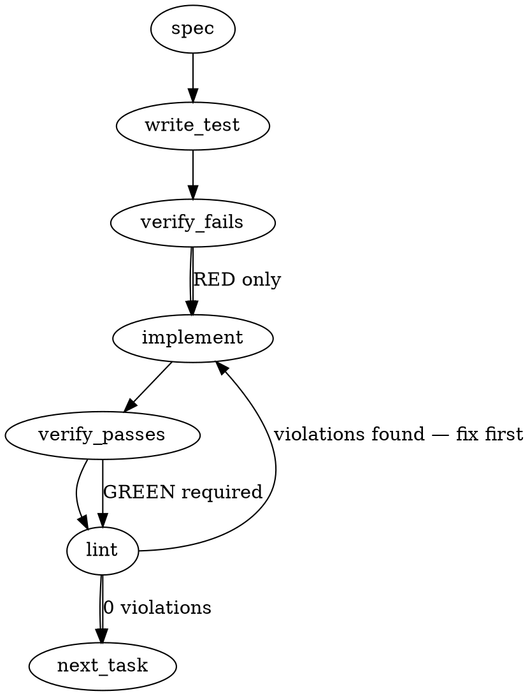

### Problem Statement

The `doctor --parity` command currently emits a flat per-row dump that lacks clear summary metrics and gating context. It must be refactored to emit a highly structured post-processed readout containing explicit verdict rollups (per-seat and global), precise coverage denominators, contextual "why-not" reasons for non-PASS rows, a `--json` artifact mode, and explicitly truthful `--strict` honesty bounds (declaring what it actually gates versus what is just an unenforced presence check).

### Architectural Context

None found in provided context that directly constrains this spec. (The `--strict` behavior extends the existing Proposal 273/279 semantics already present in `ParityCliOptions` to be more transparent about its true gating boundaries without adding new detectors).

### Files to Examine

1. `packages/cli/src/commands/doctor-parity.ts` — Contains `ParityCliOptions`, `checkParity`, and `doctorParityCliCommand`. This is where the schema definitions, mapping logic, and output formatting must be added.
2. `packages/cli/src/ui.js` — (Reference only) To check available logging and formatting functions (`bold`, `errorColor`, `successColor`, `warnColor`) for the human-readable readout.
3. `packages/cli/src/commands/__tests__/doctor-parity.test.ts` — The test file that must be updated to cover the new post-processing functions and CLI output modes.

### Technical Approach & Contracts

We will implement a map-reduce post-processor for the `ParityCheckResult` rows, separating the computation from the presentation layer to support both human-readable UI rendering and `--json` outputs deterministically.

**1. Data Contracts (Zod Schemas & Types)**
Add the following to `doctor-parity.ts` to govern the JSON output shape:

```typescript
import { z } from 'zod';

export const ParityVerdictSchema = z.enum([
  'pass',
  'warn',
  'skip',
  'unknown',
  'fail',
  'skipped-not-gated',
]);
export const ParityCoverageTypeSchema = z.enum(['sensed', 'attested', 'absent']);

export const ParityRowVerdictSchema = z.object({
  id: z.string(),
  seat: z.string().optional(),
  verdict: ParityVerdictSchema,
  coverageType: ParityCoverageTypeSchema,
  probeLevel: z.enum(['declared', 'present', 'loaded', 'usable']),
  whyNot: z.string().optional(),
  attestationAge: z.number().optional(),
  blocking: z.boolean().default(false),
});

export const ParityVerdictArtifactSchema = z.object({
  coverage: z.object({
    sensed: z.number(),
    attested: z.number(),
    absent: z.number(),
    totalDeclared: z.number(),
  }),
  rollups: z.object({
    global: z.record(ParityVerdictSchema, z.number()),
    bySeat: z.record(z.string(), z.record(ParityVerdictSchema, z.number())),
  }),
  rows: z.array(ParityRowVerdictSchema),
  strictGated: z.boolean(),
  strictHonestyDisclaimer: z.string().optional(),
});

export type ParityVerdictArtifact = z.infer<typeof ParityVerdictArtifactSchema>;
```

Update `ParityCliOptions` to include `json?: boolean`.

**2. Computation Logic (`buildVerdictArtifact`)**
Create a pure function that takes `ParityCheckResult` and `options.strict`:

- **Coverage Denominator:** Categorize and count rows into `sensed` (mechanically verified), `attested` (manual attestation age), or `absent`.
- **Verdict Mapping:**
  - If `strict` is true and a row is `warn` with `blocking: true` -> promote to `fail`.
  - If a row is skipped due to scoping but has `blocking: true` -> map to `skipped-not-gated`.
- **Why-Not Extraction:** Populate `whyNot` with the probe level (if non-PASS) or attestation age (if attested).
- **Rollups:** Aggregate counters globally and group them by `row.seat`.
- **Strict Honesty:** If `strict` is enabled but no `fail` or `skipped-not-gated` rows exist, populate `strictHonestyDisclaimer` with a "declaredly-toothless" statement.

**3. Presentation & Execution Logic**

- **JSON Mode:** If `options.json`, run `console.log(JSON.stringify(artifact, null, 2))`.
- **Human Mode:**
  - Print rows: Name, Verdict, Why-Not. (Do NOT render a presence-PASS as "enforced").
  - Print Coverage Denominator exactly as: `X mechanically sensed / Y attestation-only / Z honest-absent`.
  - Print Rollups (Per-seat block first, then Global).
  - Print Honesty Disclaimer explicitly if generated.
- **Exit Handling:** Check the artifact for any `fail` verdicts. Throw `TotemError` _only after_ the JSON/Human output is fully flushed to stdout.

### Edge Cases & Traps

- **JSON Output Mutilation:** If a `TotemError` is thrown before `console.log` completes, the `--json` output requirement is violated and the caller gets a stack trace instead of the diffable artifact. JSON output must precede throwing.
- **Global Rollup Masking Skips:** A global summary might show `pass: 10, skip: 0` while a specific seat was entirely skipped. The by-seat rollup must explicitly be rendered to prevent masking broken consumer topologies.
- **Silent Passes on Skipping:** Scoped out blocking detectors must emit `skipped-not-gated`, never `skip` or `pass`.
- **Zero Denominators:** If there are 0 attested rows, the coverage string must still print `... / 0 attestation-only / ...` to assert the boundary claim.

### Implementation Tasks

- [ ] **Task 1: Define Contracts and Options**
  - **Files:** `packages/cli/src/commands/doctor-parity.ts`, `packages/cli/src/commands/__tests__/doctor-parity.test.ts`
  - **Steps:**
    - Update `ParityCliOptions` interface to include `json?: boolean`.
    - Define and export `ParityVerdictSchema`, `ParityCoverageTypeSchema`, `ParityRowVerdictSchema`, and `ParityVerdictArtifactSchema`.
  - > TEST DIRECTIVE: Before implementing, write a failing test named `exports ParityVerdictArtifactSchema and accepts json flag` that proves the schema exists and correctly parses a mock valid artifact object.
  - write test → verify fails → implement → verify passes → lint

- [ ] **Task 2: Build Post-Processing Pure Function**
  - **Files:** `packages/cli/src/commands/doctor-parity.ts`, `packages/cli/src/commands/__tests__/doctor-parity.test.ts`
  - **Steps:**
    - Implement `export function buildVerdictArtifact(result: ParityCheckResult, isStrict: boolean): ParityVerdictArtifact`.
    - Calculate coverage buckets (`sensed`, `attested`, `absent`).
    - Map rows to final verdicts (handling strict `fail` promotion and `skipped-not-gated`).
    - Generate global and per-seat rollups based on the mapped verdicts.
  - > TEST DIRECTIVE: Before implementing, write a failing test named `buildVerdictArtifact computes coverage denominators and promotes strict failures` that proves strict `warn` with `blocking` becomes `fail`, and scoped skipping of blocking becomes `skipped-not-gated`.
  - write test → verify fails → implement → verify passes → lint

- [ ] **Task 3: Implement JSON Output & Safe Exit Flow**
  - **Files:** `packages/cli/src/commands/doctor-parity.ts`, `packages/cli/src/commands/__tests__/doctor-parity.test.ts`
  - **Steps:**
    - In `doctorParityCliCommand`, invoke `buildVerdictArtifact`.
    - If `options.json`, log the stringified JSON artifact to `console.log`.
    - Evaluate if any global rollup mapped to `fail`. If true and `options.strict` is enabled, throw a `TotemError` _only after_ the JSON log has occurred.
  - > TEST DIRECTIVE: Before implementing, write a failing test named `emits JSON artifact to stdout before throwing TotemError on strict fail` that spies on `console.log` to prove the order of operations prevents JSON mutilation.
  - write test → verify fails → implement → verify passes → lint

- [ ] **Task 4: Implement Human-Readable Rendering & Strict Honesty**
  - **Files:** `packages/cli/src/commands/doctor-parity.ts`, `packages/cli/src/commands/__tests__/doctor-parity.test.ts`
  - **Steps:**
    - In `doctorParityCliCommand`, if `!options.json`, use `ui.js` colors to format the output.
    - Loop over rows to print non-PASS verdicts with their `whyNot` strings.
    - Print the precise Coverage Denominator line (X / Y / Z).
    - Print the Rollups (iterating over `bySeat` first, then `global`).
    - If `options.strict` was requested but `strictGated` is false, print the `strictHonestyDisclaimer`.
  - > TEST DIRECTIVE: Before implementing, write a failing test named `renders human readable coverage denominator and strict honesty disclaimer` that asserts the exact strings "mechanically sensed", "attestation-only", and the honesty disclaimer are dispatched to the logger.
  - write test → verify fails → implement → verify passes → lint

### Execution Flow (structural constraint)



### Verification (MANDATORY — do not skip)

Every implementation MUST end with these steps:

1. `totem lint` — deterministic rule check (zero LLM, ~2s). Fixes any violations.
2. `totem review` — AI-powered architectural review (~18s). Addresses any critical findings.
3. If using MCP, call `verify_execution` to confirm compliance before declaring the task done.

### Test Plan

- **Strict Promotion:** Assert that a `warn` on a `blocking: true` row maps to a `fail` when `--strict` is enabled, ultimately throwing a `TotemError`.
- **Skipped-Not-Gated:** Assert that a `skip` on a `blocking: true` row evaluates to `skipped-not-gated` and successfully registers in both the global and per-seat rollup aggregates.
- **Coverage Denominator Completeness:** Assert that a mock array containing 2 sensed, 0 attested, and 1 absent row explicitly prints `2 mechanically sensed / 0 attestation-only / 1 honest-absent`.
- **JSON Mutilation Safety:** Spy on `console.log` and verify it completely writes the JSON artifact before `doctorParityCliCommand` throws the `TotemError` during a `--strict --json` failure.
- **Presence-PASS Exclusivity:** Assert that a row with `probeLevel: 'present'` and `verdict: 'pass'` does not append enforcement language in the human-readable `why-not` output.
