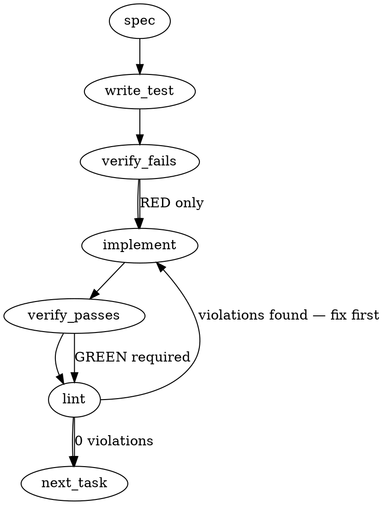

> **Binding-contract notice:** The generated proposal below is retained as
> preflight provenance, but its mode-less union signatures and normalization
> rules were superseded after the report-first semantic comparison. Where it
> conflicts, `## Implementation Design`, `## Panel Supplement`, and
> `## Consolidated Ruling — Implementation Contract` are authoritative.

Problem Statement
Consolidate the twin hand-rolled glob matchers located in `packages/core/src/rule-engine.ts` (`matchesGlob`/`fileMatchesGlobs`) and `packages/core/src/spine/selection-rule.ts` (`matchGlob`/`globToRegExp`) into a single, unified, dialect-documented helper module under `packages/core/src/sys/glob.ts`, maintaining strict backwards compatibility and passing the union of both test suites.

Architectural Context

- **Consolidation of Twin Implementations:** The rule engine's suffix-based matcher and the spine's RegExp-based matcher have evolved separately, introducing redundant logic and divergence risks similar to the divergent-twin issue (#2413) seen with `isBoundedOwnedFile`.
- **Preserved Dialect Posture:** The adoption of a full glob engine dependency (e.g., `picomatch`) is deliberately declined to maintain a bounded dialect surface, ensuring low reasoning overhead and predictable enforcement scope without silent widening of match behaviors (e.g., extglob, brace expansion, or dot-file defaults).
- **Lessons & Invariants:** None found in provided context.

Files to Examine

1. `packages/core/src/rule-engine.ts` — Contains the primary `matchesGlob` and `fileMatchesGlobs` implementations.
2. `packages/core/src/spine/selection-rule.ts` — Contains the spine's hand-rolled `matchGlob` and `globToRegExp` functions.
3. `packages/core/src/rule-engine.test.ts` — Core test suite verifying deep recursion, bare vs. path-shaped literals, and wildcard scenarios.
4. `packages/core/src/spine/selection-rule.test.ts` — Spine test suite verifying brace alternation, backslash path normalization, and root-level `**/` matching.
5. `packages/core/src/regex-safety/apply-rules-bounded.ts` — Contains a duplicate definition of `fileMatchesGlobs` that must be deleted.
6. `packages/core/src/sys/git.ts` — Imports `matchesGlob` from `../compiler.js` and should import from `glob.ts` directly to prevent indirect/circular dependency cycles.

Technical Approach & Contracts
We will design a single unified compiler under `packages/core/src/sys/glob.ts` that translates the dialect's glob patterns into a robust, anchored `RegExp`.

#### TypeScript Signatures (Data Contracts)

```typescript
/**
 * Compiles a bounded glob pattern into an anchored RegExp.
 */
export function globToRegExp(glob: string): RegExp;

/**
 * Checks if a normalized file path matches a single glob pattern.
 */
export function matchesGlob(filePath: string, glob: string): boolean;

/**
 * Checks if a file path matches any positive glob and no negative (`!`) globs.
 */
export function fileMatchesGlobs(filePath: string, globs: readonly string[]): boolean;
```

#### Unified Compilation Logic

1. **Separators:** Normalize backslashes `\\` to `/` on both `filePath` and `glob`.
2. **Path-Shaped vs. Bare Pattern Distinction (CR #1766 & #1758):**
   - If the pattern contains `/`, it is a **path-shaped pattern** and is matched exactly against the full path. Compile as: `^re$`.
   - If the pattern does NOT contain `/` (e.g. `Dockerfile` or `*.ts`), it is a **bare pattern** and matches the filename at any depth. Compile with an optional leading segment prefix: `^(?:.*\/)?re$`.
3. **Wildcards Compilation Syntax:**
   - `*` -> `[^/]*` (matches any character except slashes within a directory segment).
   - `**` -> `.*` (matches any character including slashes across multiple directory segments).
   - `**/` -> `(?:[^/]+/)*` (matches zero or more path segments, handling empty cases correctly).
   - `?` -> `[^/]` (matches exactly one character except slashes).
   - `{a,b,c}` -> `(?:a|b|c)` (brace alternation; escape each choice using a regex-literal replacement).

Edge Cases & Traps

- **Silent Suffix Widening:** Ensure that path-shaped literals like `src/foo.ts` do not match `packages/src/foo.ts`. The pattern is path-shaped (contains `/`), so it must match from the start of the path.
- **Bare Filename Capturing:** Ensure bare literals like `Dockerfile` continue matching `src/Dockerfile` and `Dockerfile` at any depth, but do not match `Dockerfile.dev`.
- **Brace Alternation Escaping:** Special characters inside brace alternatives must be escaped securely to avoid interpreting them as nested regex control sequences.
- **Duplicate Evaluator Logic:** `packages/core/src/regex-safety/apply-rules-bounded.ts` has a duplicate implementation of `fileMatchesGlobs` that must be completely removed and refactored to point to `packages/core/src/sys/glob.ts`.

Implementation Tasks

- [ ] **Task 1: Create Consolidated Glob Matcher**
      Implement the unified compiler and matcher functions in the `glob.ts` file, and test with the union of both existing test files.

  > TOTEM INVARIANT (Glob Normalization): Standard path separator is normalized to `/` on both paths and patterns to guarantee Windows compatibility.
  > TOTEM INVARIANT (Declined Picomatch): Keep the dialect bounded and deterministic; do not introduce a third-party dependency like picomatch or minimatch.
  > TEST DIRECTIVE: Before implementing, write a failing test named `rejects suffix matching on path-shaped literals` that proves `packages/src/foo.ts` does not match the path-shaped glob `src/foo.ts`.
  > Create `packages/core/src/sys/glob.ts` and `packages/core/src/sys/glob.test.ts` -> verify fails -> implement -> verify passes -> lint

- [ ] **Task 2: Refactor Rule Engine to use Consolidated Matcher**
      Replace local `matchesGlob` and `fileMatchesGlobs` implementations, re-exporting the consolidated ones from `sys/glob.ts`.
      Modify `packages/core/src/rule-engine.ts` and update `packages/core/src/rule-engine.test.ts` to verify integration -> verify fails -> implement -> verify passes -> lint

- [ ] **Task 3: Refactor Selection Rule Spine to use Consolidated Matcher**
      Delete local `globToRegExp` and `matchGlob` helpers, importing `matchesGlob` directly from `../sys/glob.js`.
      Modify `packages/core/src/spine/selection-rule.ts` and update `packages/core/src/spine/selection-rule.test.ts` -> verify fails -> implement -> verify passes -> lint

- [ ] **Task 4: Eliminate Duplicate Matches in Bounded Evaluator and Git Helper**
      Remove the duplicate `fileMatchesGlobs` helper from the bounded evaluator, redirecting imports to `glob.js`. Clean up git helper imports to bypass the rule-engine/compiler exports.
      Modify `packages/core/src/regex-safety/apply-rules-bounded.ts` and `packages/core/src/sys/git.ts` -> verify fails -> implement -> verify passes -> lint

Execution Flow (structural constraint)



Verification (MANDATORY — do not skip)
Every implementation MUST end with these steps:

1. `totem lint` — deterministic rule check (zero LLM, ~2s). Fixes any violations.
2. `totem review` — AI-powered architectural review (~18s). Addresses any critical findings.
3. If using MCP, call `verify_execution` to confirm compliance before declaring the task done.

Test Plan

- **Bare Literal Matches:** Verify that `Dockerfile` matches `Dockerfile` and `src/Dockerfile`, but fails on `Dockerfile.dev`.
- **Path-Shaped Literal Matches:** Verify that `src/foo.ts` matches `src/foo.ts` but fails on `packages/src/foo.ts`.
- **Wildcards with Slashes (`*` vs `**`):** Verify that `src/_.ts`matches`src/foo.ts`but fails on`src/sub/foo.ts`. Verify `src/\*\*/_.ts` matches both.
- **Trailing Wildcards (`*.test.*`):** Verify `*.test.*` matches `src/foo.test.ts` but fails on `src/.test.fixtures/foo.ts`.
- **Brace Alternation (`**/\*.{ts,tsx}`):** Verify brace alternation options match `.ts`and`.tsx`extensions recursively, while failing on`.js`.
- **Negative Overrides:** Verify `fileMatchesGlobs` correctly filters out files matching negative (`!`) patterns regardless of positive glob match.

## Implementation Design

### Scope

This change will move glob ownership into `packages/core/src/sys/glob.ts`, route the rule engine, bounded evaluator, spine classifier, and git diff filter through that module, and preserve the union of the current test contracts. It will not add a dependency, widen compiled-rule enforcement, change classifier configuration, or alter the public root exports of `matchesGlob` and `fileMatchesGlobs`.

### Data model deltas

- A module-private `GlobProfile = 'rule-engine' | 'path-classifier'` identifies which existing compatibility contract a call must preserve. The helper owns it; callers select it only through two named functions: public-compatible `matchesGlob(filePath, glob)` for the rule profile and internal `matchesPathGlob(filePath, glob)` for the anchored classifier profile.
- The spine's existing `Map<string, RegExp>` cache moves to `sys/glob.ts`. Rule-profile calls use a 512-entry deterministic LRU so the hot rule-by-file loop does not recompile the same patterns while still avoiding an unbounded server-lifetime cache on the public API.
- `fileMatchesGlobs(filePath, globs)` remains `readonly string[]` and keeps its existing positive/negative semantics. No config/schema field, persistent record, package-root export, reserved key, or sentinel value is added.

### State lifecycle

- `GlobProfile` is per-call immutable state: created by the named wrapper, read by the shared parser/compiler, then discarded.
- The classifier RegExp cache is module-lifetime state, created at module load, populated on the first `matchesPathGlob` call for a pattern, and never mutated outside `sys/glob.ts`. This is the same lifecycle and bounded-by-classifier-pattern set as the cache currently owned by `selection-rule.ts`; process teardown clears it.
- The rule-profile LRU is also module-lifetime state, with a named capacity of 512 and deterministic least-recently-used eviction. No state crosses request/session/persistent boundaries, and `fileMatchesGlobs` creates only per-call local booleans.

### Failure modes

| Failure                                                                                    | Category                           | Agent-facing surface                                                      | Recovery                                                                           |
| ------------------------------------------------------------------------------------------ | ---------------------------------- | ------------------------------------------------------------------------- | ---------------------------------------------------------------------------------- |
| A consumer is routed through the wrong profile                                             | runtime / permanent until code fix | incorrect boolean with no natural runtime warning                         | profile-specific regression tests fail; restore the named wrapper at the call site |
| Rule-profile unsupported syntax (`?`, braces, general segment `*`) is accidentally enabled | runtime / permanent                | silent enforcement widening                                               | divergence fixtures require legacy literal/fallback behavior                       |
| Classifier brace, `?`, `**/`, or backslash behavior is accidentally narrowed               | runtime / permanent                | silent corpus-selection drift                                             | union fixtures require the existing anchored classifier results                    |
| Shared compiler mishandles regex metacharacters or unmatched braces                        | runtime                            | unexpected mismatch; a constructor throw would propagate as it does today | literal-escaping and malformed-brace fixtures; fix compiler rather than degrade    |
| Positive/negative list precedence changes during bounded-evaluator delegation              | runtime / permanent                | rules run on excluded files or skip included files                        | truth-table fixtures lock negative-overrides and no-positive-defaults-to-included  |
| Classifier cache returns an entry compiled under another contract                          | runtime / process-lifetime         | repeated incorrect classifier result                                      | cache only classifier-profile expressions; no cross-profile keys exist             |

No silent degradation is accepted: every compatibility edge above is represented by a deterministic test, and unexpected compiler errors continue to surface rather than falling back to a broader matcher.

### Invariants to lock in via tests

- Existing `matchesGlob` and `fileMatchesGlobs` imports from `@mmnto/totem` retain their signatures and rule-engine behavior.
- Bare rule patterns match basenames at any depth, while path-shaped literals remain repo-root exact.
- Rule-profile `?`, brace groups, general segment stars, and backslashes retain their current literal/non-normalized behavior.
- Classifier patterns remain full-path anchored and continue supporting general `*`, `?`, brace alternation, `**`, zero-segment `**/`, and path/glob backslash normalization.
- `fileMatchesGlobs` returns true with no positive entries unless a negative matches; any matching negative wins regardless of order.
- The bounded evaluator and ordinary rule engine make identical file-scope decisions for the same string glob list.
- `sys/git.ts` imports the shared helper directly, while `rule-engine.ts`/`compiler.ts` keep compatibility re-exports without creating a cycle.
- No `picomatch`, `minimatch`, or other glob dependency is introduced.

### Open questions

- **Question:** Should consolidation preserve both observed matcher profiles, or deliberately replace them with one union dialect?
- **Options:**
  - Keep explicit compatibility profiles over one shared parser/compiler and cache owner; exact behavior is preserved, but the helper documents two legacy profiles.
  - Adopt the union dialect everywhere; the API is conceptually simpler, but rule-engine inputs that currently treat `?`, braces, general stars, or pattern backslashes literally would begin matching and could widen enforcement without rule-file changes.
  - Adopt the narrower rule-engine dialect everywhere; this avoids widening enforcement but breaks the frozen spine classifier's brace/`?` contract.
- **Recommendation:** Keep the explicit compatibility profiles. It satisfies the report-first behavior-preservation contract while consolidating code ownership; a later ticket can intentionally migrate to one dialect with consumer evidence and a migration path.

## Panel Supplement — Live Spine Union Scan

### Scope and denominator

The live spine-pattern denominator is the tracked selection artifact at
`.totem/spine/gate-1/frozen-split.json`. A repository-wide production-data
search found no other tracked JSON/YAML/TOML classifier instance, and
`rg --files .totem/spine` returned only that artifact. Schema declarations,
spec prose, and test fixtures are not live selection inputs and were excluded.

The artifact carries seven unique patterns: three `includeGlobs` and four
`excludeGlobs`. Each pattern was checked for the known union-reinterpretation
classes: bare-pattern basename-at-any-depth widening, `?`, brace alternation,
glob-side backslash normalization, and a general single-segment `*` form that
the rule profile currently treats literally.

### Complete results

| Polarity | Pattern         | Shared-subset shape | Union reinterpretation | Scope-change assessment                                            |
| -------- | --------------- | ------------------- | ---------------------- | ------------------------------------------------------------------ |
| include  | `**/*.rs`       | recursive extension | none                   | none; root and nested `.rs` paths retain the same membership       |
| include  | `**/*.gd`       | recursive extension | none                   | none; root and nested `.gd` paths retain the same membership       |
| include  | `**/*.gdshader` | recursive extension | none                   | none; root and nested `.gdshader` paths retain the same membership |
| exclude  | `**/target/**`  | recursive directory | none                   | none; `target` directory segments remain excluded at every depth   |
| exclude  | `**/*.gen.rs`   | recursive extension | none                   | none; root and nested generated Rust files remain excluded         |
| exclude  | `**/tools/**`   | recursive directory | none                   | none; `tools` directory segments remain excluded at every depth    |
| exclude  | `**/scripts/**` | recursive directory | none                   | none; `scripts` directory segments remain excluded at every depth  |

Result: **7 scanned / 7 unique / 0 reinterpreted / 0 scope-changing
specimens**. There are no live bare patterns, braces, `?`, pattern backslashes,
or unsupported general segment-star shapes. Every live pattern is in the
semantic intersection already implemented by both matchers. Therefore a
mode-less union matcher would not change the current frozen Liquid City spine
classifier's resolved file membership.

This is a bounded statement about the tracked live artifact. The schemas accept
caller-supplied glob strings, and Totem has downstream consumers, so the result
does not certify every external or future classifier configuration.

### Formal panel position — profiles unless the full compatibility burden clears

**Position: retain explicit compatibility profiles over one tokenizer/compiler
and cache owner.** The clean spine result removes the frozen artifact as an
immediate counterexample, but it does not by itself authorize a public
rule-engine widening. Profiles preserve both existing contracts while still
eliminating duplicate matching loops; named agreement fixtures prevent the
profiles from becoming two implementations in disguise.

I would flip to a mode-less union only if all of the following are true:

1. the independent frozen-rule scan also reports zero union-only or
   scope-changing specimens;
2. every supported tracked spine seed/frozen artifact remains at zero, not just
   the current single artifact;
3. a deterministic corpus-certification test loads the real compiled-rule and
   tracked spine corpora, compares legacy-vs-union outcomes for every pattern,
   and fails when a future divergence enters either corpus; and
4. the operator explicitly rules the public/downstream compatibility boundary,
   with a migration path if consumer-supplied patterns cannot be certified.

Any live specimen on either side forces profiles while compilation is frozen,
because a reinterpreted rule or classifier cannot be repaired by re-authoring
its frozen input. This scan supplies the clean spine half only; it does not meet
the mode-less-union threshold on its own.

## Consolidated Ruling — Implementation Contract

The 2026-07-19T00:25Z coordinator ruling closes the open question and authorizes
implementation. Two profiles are **forced**: the frozen-rule scan found 39
muted-wildcard specimens among 255 unique globs, including six fully inert rules
and dead negative globs. The live spine leg remains clean at 7/7 patterns with
zero scope changes. Consolidation must preserve both observed behaviors; corpus
repair is a separate post-freeze, per-rule review task.

The following amendments are binding:

1. Profiles are option-record data over one tokenizer/compiler and matching
   loop. They must not become separate flag-branched implementations.
2. A load-bearing corpus-regression tier pins the current rule-engine answers
   for all 255 frozen globs, dead specimens included, against a rendered path
   set.
3. The named divergence matrix covers eight axes under both profiles: the five
   original divergence classes plus basename-length behavior (`test.js` versus
   `*.test.js`), platform-independent case sensitivity, and dead trailing-slash
   patterns.
4. The spine-local `globToRegExp`/`matchGlob` functions and the bounded
   evaluator's local `fileMatchesGlobs` loop are deleted in this PR.
5. The helper documents the picomatch tripwire: reconsider a dependency only if
   the bounded dialect grows toward a full glob engine.
6. No dead-glob advisory, lint warning, doctor surface, corpus repair, or other
   output change belongs in this PR.

The original delivery constraints remain: patch changeset for `@mmnto/core`,
full workspace gates including `pnpm -r run lint`, no bot invocation, Ready PR,
and merge only on the operator's word.

## Post-review Amendments

The independent compatibility review found public-input cases outside the
frozen corpus that an anchored RegExp translation could otherwise narrow or
widen. The rule profile therefore preserves whole-path suffix semantics for
slash-bearing leading `*.` patterns, keeps slash-bearing directory-extension
remainders inert, and treats line terminators as ordinary filename characters
where the legacy string operations did. Direct fixtures pin each case without
changing the classifier profile.

The same review measured an approximately 7.9x regression when the rule profile
compiled a new RegExp for every rule-by-file call. The bounded 512-entry LRU
above is the accepted remediation; it retains one tokenizer/compiler/matching
loop without introducing an unbounded process cache.

The coordinator's changeset package name was a proposal-level typo. The actual
workspace package identity is `@mmnto/totem`, so the patch changeset targets
that package.

## Direct `selectionRule` Oracle Replay

The PR #2451 merge-condition replay executed the actual pre-swap source from a
clean `main` checkout at `b06f9fa460bd7d22b33e3353739512d4af0f36ed` and the
post-swap source at `6219a5c3dbdf0a5e343305d649ad16822027b329`. Each side
used its own `packages/cli/src/commands/spine-windtunnel.ts` implementation of
`enumeratePrMetas` and its own
`packages/core/src/spine/selection-rule.ts` helpers and resolver.

The offline corpus was `mmnto-ai/liquid-city` at the tracked frozen
`asOfCommit` `0878081e922db16d4fada10b8518eb6e58b62300`. Enumeration
produced 408 byte-identical `PrMeta` records on both sides (SHA-256 of the
JSON-serialized ordered records:
`af17a9f9dcdc6192f0079ef0bfd964700a7b79f372895cbec14d1b9293935a79`).
The frozen classifier, bot flag, and bounded `N = 80` window came directly from
`.totem/spine/gate-1/frozen-split.json`.

| `excludeRevertPairs` | Pre count | Post count | Membership SHA-256                                                 | Pre/post diff | Frozen-cover diff |
| -------------------- | --------- | ---------- | ------------------------------------------------------------------ | ------------- | ----------------- |
| `false`              | 80        | 80         | `3433189c04fca03295263ff633af22ece795a33b5e45d3a36cc3e15c2102f2c8` | empty         | empty             |
| `true`               | 80        | 80         | `3433189c04fca03295263ff633af22ece795a33b5e45d3a36cc3e15c2102f2c8` | empty         | empty             |

Membership bytes are the numerically sorted PR numbers, one ASCII number per
line with a trailing newline. Both runs were byte-identical, and their
symmetric differences were exactly `onlyPre=[]; onlyPost=[]`. Each result also
matched its ADR-111 cover from the frozen split: train + held-out + excluded
for reverts-in, and train + held-out for reverts-out. This freeze contains no
excluded revert pair, so the two flag values intentionally resolve the same
80-member set.

The reproducible command was
`pnpm exec tsx D:\tmp\selection-oracle-2428.mjs` from the PR worktree. The
temporary harness imported the two source identities above, read only the
tracked frozen split, invoked each side's real `enumeratePrMetas` against the
local Liquid City clone (with only a Git safe-directory option added), ran
`resolveSelectionRule` under both revert flags, and asserted byte equality,
empty symmetric differences, and frozen-cover equality. It used no GitHub API
and was removed after the replay.

An optional historical ADR-110 replay used the tracked
`windtunnel.lock.json` at
`b5bea41e50bfc5247e3a41e436daccb908ed9fe7`, whose `asOfCommit` is
`09b21bc3bf5c1933d7f2f313659d5d687a01c599` and whose exact classifier
includes `**/*.rs`, `**/*.gd`, `**/*.gdshader`, and `**/*.tscn`, with no
exclude globs, bot exclusion enabled, and bounded `N = 40`. The same pre/post
source procedure produced 355 byte-identical ordered `PrMeta` records (SHA-256
`510ac191d4fec5a51416ad56351d13cf86b1d7541e1b7f7da9f95d50d60e4dfc`).
Both the lock's configured `excludeRevertPairs: true` path and the trivial
reverts-in variant resolved 40 byte-identical members with SHA-256
`741549ed334ec7fd1d36a3a49e2ef81db08843f63bac15d92f7cb27368822f4b` and
exactly empty pre/post symmetric differences. A frozen-cover comparison is not
applicable because no historical `frozen-split.json` exists for that lock. The
temporary `selection-oracle-2428-historical.mjs` harness used no GitHub API and
was removed after the replay.
