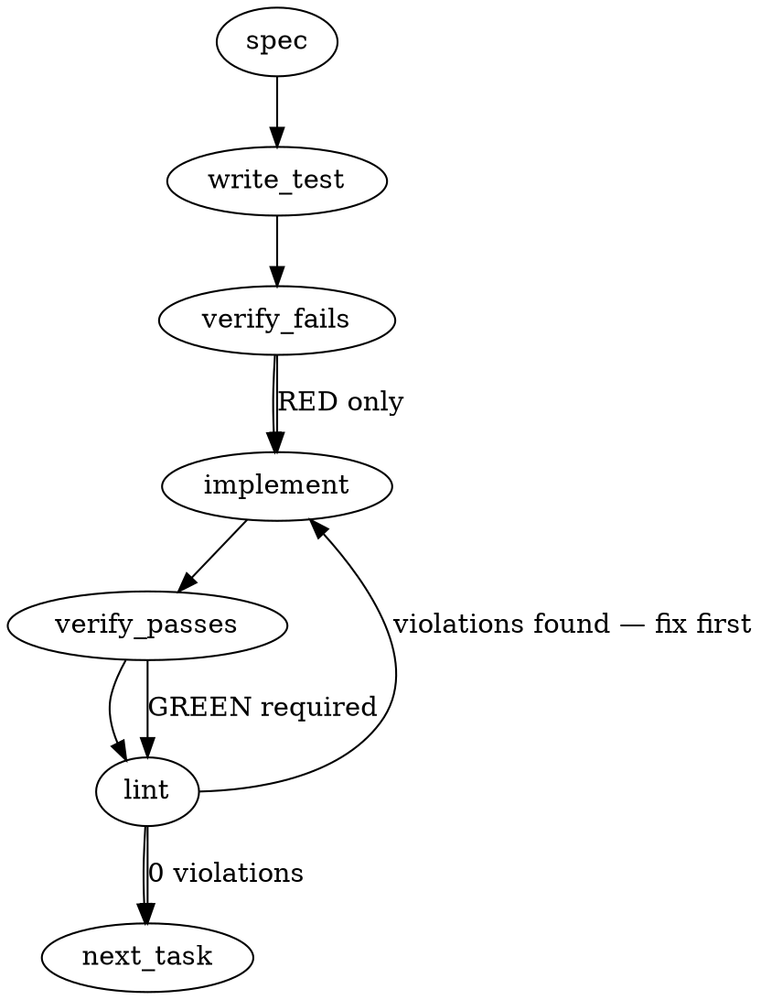

### Problem Statement

When a `totem review` fan has zero completed verdict lanes (e.g., due to CLI fallback extraction failures resulting in implicit abstention, or outright lane execution failures), the process incorrectly exits 0 if `--fail-on` is omitted. Additionally, CLI fallback execution lacks diagnostic retention (stdout, stderr, exit status, timeouts) in the run artifact, leaving the system unable to distinguish between genuine extraction failures, authentication/quota errors, or process timeouts.

### Architectural Context

- **Strategy Tenets (12/13):** A provider-unsettled review (due to sensor-down / extraction failure) must not block deterministic publication when other checks (lint, tests, manual evidence) are green, but it must **never** be misrepresented as an external review pass. An exit contract of 0 under zero completed lanes violates this tenet.
- **Prior Redesign Context:** This is a lane-reliability defect family related to the ongoing review orchestration refactoring (#2045, #2451).

### Files to Examine

1. `packages/cli/src/commands/review-fan.ts` — The primary entrypoint for review fan orchestration (`runReviewFan`), individual lane invocation (`runLane`), and rendering reports (`renderFanReport`).
2. `packages/cli/src/commands/review-types.ts` (or similar type-definition file within the CLI package) — The source of truth for the verdict artifact and lane result schemas/Zod definitions.

### Technical Approach & Contracts

#### 1. Contract Extension (Zod & TS Definitions)

Extend the existing lane results schema/type with a `fallbackDiagnostics` block to store rich telemetry without mutating primary functional properties:

```typescript
export interface CliFallbackDiagnostics {
  stdout?: string;
  stderr?: string;
  exitCode?: number | null;
  signal?: string | null;
  timeout?: boolean;
  extractionFailureReason?: string;
  errorClassification?:
    | 'auth_error'
    | 'quota_limit'
    | 'model_unavailable'
    | 'process_spawn_failed'
    | 'process_exit_error'
    | 'timeout'
    | 'unknown';
}
```

#### 2. Extraction-Failure vs. Explicit Abstention Distinction

- **Explicit Abstain:** The LLM successfully executed and returned a valid JSON structured verdict where the decision field is explicitly set to `"abstain"`. This is a _completed_ lane attempt.
- **Implicit/Fallback Abstain:** The LLM produced output (or failed to output), but the JSON parsing cascade failed. Currently, this falls back to `ABSTAINED`. We must track this as an extraction failure via `fallbackDiagnostics.extractionFailureReason`.

#### 3. Core Exit Logic Adjustment

In `runReviewFan`, compute the count of _completed verdict lanes_ (lanes that successfully returned a valid, parsed structured verdict). If this count is `0`, the command must hard-error or exit with non-zero status code:

```typescript
const completedVerdictLanes = laneResults.filter(
  (lane) => lane.status === 'success' && !lane.fallbackDiagnostics?.extractionFailureReason,
);

if (completedVerdictLanes.length === 0) {
  throw new TotemError(
    'Review fan completed with zero valid verdict lanes. All lanes failed or yielded unextractable output.',
    { code: 'ZERO_COMPLETED_LANES', exitCode: 1 },
  );
}
```

#### 4. Classification Engine

Implement an error classification helper within the fallback executor:

- Parse known error codes or string tokens in `stderr` or the exception message.
- Map `"429"`, `"quota exceeded"`, `"rate limit"` $\rightarrow$ `'quota_limit'`.
- Map `"401"`, `"unauthorized"`, `"api key"` $\rightarrow$ `'auth_error'`.
- Map `"ENOENT"` $\rightarrow$ `'process_spawn_failed'`.
- Map timeout states (e.g., child process killed by `SIGTERM` on timeout or explicit wrapper timeout) $\rightarrow$ `'timeout'`.

---

### Edge Cases & Traps

- **Zombie CLI Processes:** Ensure timeouts on CLI fallbacks explicitly kill any spawned child processes (or process groups) to avoid background thread leakage.
- **Large Diff Truncation:** Ensure that capturing partial `stdout` / `stderr` does not exceed memory boundaries. Slice raw captures to a safe upper bound (e.g., 50KB) before saving to the artifact.
- **Double Budget Counting:** Make sure the diff size (reported separately) is cleanly subtracted or clearly isolated from the absolute prompt size to avoid confusing developers on how their tokens were allocated.

---

### Implementation Tasks

- [ ] **Task 1: Extend Artifact & Lane Contracts**
  - Update schemas/types in `packages/cli/src/commands/review-fan.ts` (and relevant type files) to support the `fallbackDiagnostics` contract.
  - Update `VERDICT_ARTIFACT_SCHEMA_VERSION` if a schema migration is required.
  - write test (or update existing) → verify fails → implement → verify passes → lint

- [ ] **Task 2: Distinguish completed lanes & Enforce Exit Contract**
  - Modify `runReviewFan` to calculate completed lanes, ignoring fallback lanes that suffered extraction failures.
  - Implement the zero-completed-lane check and trigger a hard exit/throw.
    > TEST DIRECTIVE: Before implementing, write a failing test named `exits non-zero on zero completed lanes` that proves the regression is caught.
  - write test → verify fails → implement → verify passes → lint

- [ ] **Task 3: Capture and Classify CLI Fallback Telemetry**
  - Refactor the CLI fallback invocation loop to capture stdout, stderr, process exit code, and timeout state.
  - Implement the classification engine (`classifyInvokeError`) to map errors to `'auth_error'`, `'quota_limit'`, etc.
  - Store this payload in `fallbackDiagnostics` on the lane result.
    > TEST DIRECTIVE: Before implementing, write a failing test named `retains raw stderr and timeout flag on CLI timeout` that proves the regression is caught.
  - write test → verify fails → implement → verify passes → lint

- [ ] **Task 4: Sonnet-5 Extraction Fixtures & Cascade Fallbacks**
  - Introduce robust parsing regexes to safely strip chatty markdown wrapper text around JSON blocks emitted by Sonnet-5 CLI fallbacks.
  - Add extraction fixture tests matching Sonnet-5 CLI output formatting.
    > TEST DIRECTIVE: Before implementing, write a failing test named `extracts valid structured verdict from chatty Sonnet-5 markdown` that proves the regression is caught.
  - write test → verify fails → implement → verify passes → lint

- [ ] **Task 5: Refactor Budget Reporting in CLI Output**
  - Update `renderFanReport` to calculate the diff size independently.
  - Report both `Diff Budget` and `Prompt/Context Budget` as separate metrics on the console report.
    > TEST DIRECTIVE: Before implementing, write a failing test named `reports diff budget separately from prompt budget` that proves the regression is caught.
  - write test → verify fails → implement → verify passes → lint

---

### Execution Flow



---

### Verification (MANDATORY — do not skip)

1. Run `totem lint` to ensure zero stylistic or structural rule violations.
2. Run `totem review` to ensure the analyzer passes on the modified CLI command files themselves.

---

### Test Plan

#### Integration & Unit Tests

- **Exit Contracts Test Suite (`packages/cli/src/commands/__tests__/review-fan.test.ts`):**
  - **Test Scenario 1 (Zero-Completed-Lanes):** Set up mock lanes where all either fail execution or result in extraction-failure abstentions. Ensure process exits with code `1`.
  - **Test Scenario 2 (Explicit Abstain):** Set up mock lanes where one lane returns a valid structured verdict with an explicit `abstain` action. Verify the exit code.
  - **Test Scenario 3 (Mixed Failure & Abstain):** Set up one lane that fails invocation and one that fails extraction. Ensure exit code is `1`.
- **Telemetry & Classification Suite:**
  - **Test Scenario 4 (Diagnostics Logging):** Mock a timed-out Claude CLI child execution and verify `fallbackDiagnostics` contains the exact stderr output and has `timeout: true` with classification `'timeout'`.
  - **Test Scenario 5 (Extraction Robustness):** Feed Sonnet-5 style raw output (with markdown markers and conversational prefix/suffix) to the extraction cascade. Assert that the final parsed verdict is extracted perfectly and not classified as an extraction failure.

---

## Implementation Design (slice A — totem-claude)

> **Provenance:** the auto-generated spec above frames the WHOLE #2452 family (A+B). Per the confirmed role-split (`.totem/orchestration/totem-codex/outbox/…0555Z…role-split…`), this design covers **only slice (A)** — the fan boundary. The spec's Tasks 1/3/4 (`fallbackDiagnostics` contract, CLI-fallback telemetry capture, invoke-error classification, Sonnet-5 extraction fixtures) are **codex's slice (B)** and are OUT OF SCOPE here.

### Scope

Slice (A) makes a review fan with **zero completed verdict lanes** exit non-zero on the DEFAULT (`--fail-on`-less) path, and splits diff-budget from total-prompt-budget in the fan report. It will **NOT** touch the orchestrator/CLI-fallback layer, add `fallbackDiagnostics`, classify invoke errors, add Sonnet-5 extraction fixtures, or introduce any explicit-abstain lane status — those are (B), consumed later via a follow-up (A) owns.

### Data model deltas

**None persisted.** The fix reuses the existing, already-validated `VerdictArtifact.completedLaneCount` (superRefine already binds it to `#completed lanes`) as the exit predicate. No new type, field, or state container. The verdict is ALREADY honest for a zero-completed fan (`settled=false`, `completedLaneCount=0`) — see `deriveSettled`/`everyLaneCompleted` in `core/src/artifacts/verdict.ts:360,387`. The defect is purely the process exit code.

- Optional tiny exported predicate in `verdict.ts`: `hasNoCompletedLane(v) → completedLaneCount === 0` (single source of truth, mirrors the `deriveSettled` export pattern) — OR inline `verdict.completedLaneCount === 0` at the fan. Leaning exported helper (codex assigned me `verdict.ts` + tests; keeps the predicate testable in core).
- Budget line is **display-only** (no persisted field) — see Open Q2.

### State lifecycle

No new state. The existing `laneResults` (per-fan, in-memory) and the freshly-saved `verdict` (persisted content-addressed artifact) are unchanged in lifecycle. The only change: the local `anyWithOutput` boolean (`review-fan.ts:1232`, single use at the `:1302` gate) is replaced by reading `verdict.completedLaneCount` AFTER `saveVerdictArtifact` — so the gate keys on the persisted count, not a pre-save local. The honest verdict is written FIRST (unchanged ordering), then the gate fires.

### Failure modes

| Failure                                                                         | Category | Agent-facing surface                                                                                                    | Recovery                                                                    |
| ------------------------------------------------------------------------------- | -------- | ----------------------------------------------------------------------------------------------------------------------- | --------------------------------------------------------------------------- |
| Zero completed lanes — all-failed (existing G3 subset)                          | runtime  | **hard error** `SHIELD_FAILED`, exit non-zero; honest verdict written first                                             | fix provider keys/quota, re-run; artifact records `lanes=0/N settled=false` |
| Zero completed lanes — ≥1 abstained (extraction-failure) ± failed (**the bug**) | runtime  | **hard error** `SHIELD_FAILED`, exit non-zero; honest verdict written first                                             | same; message enumerates completed=0/abstained=N/failed=M                   |
| Zero configured lanes                                                           | init     | hard error (pre-attempt, no verdict) — UNCHANGED                                                                        | configure `review.lanes`                                                    |
| ≥1 completed lane, findings present                                             | runtime  | UNCHANGED: default exit 0; `--fail-on` throws                                                                           | fix findings / `--override`                                                 |
| `--override` on a zero-completed fan                                            | runtime  | **hard error still fires** — override does NOT convert to pass (Tenet 12/13: provider-unsettled is never a review pass) | not overridable; re-run with working providers                              |

No row is "silent degradation" — every zero-completed path is loud (Tenet 4).

### Invariants to lock in via tests (the five-shape exit matrix)

1. **All lanes completed** → exit 0 (default), verdict `settled` per findings. (regression guard — unchanged path)
2. **0 completed + ≥1 abstained (extraction-failure) + 0 failed** → exit non-zero; honest verdict written with `completedLaneCount=0, settled=false`. _(the exact repro — currently exits 0)_
3. **0 completed + 1 abstained + 1 failed** → exit non-zero; verdict written.
4. **All lanes failed to invoke** → exit non-zero (existing G3 still holds under the widened predicate).
5. **`--override <reason>` + zero completed** → STILL exits non-zero (override-proof; provider-unsettled ≠ pass).
6. The zero-completed hard-error fires **after** `saveVerdictArtifact` (artifact exists on disk before the throw).
7. Budget: `renderFanReport` emits diff-chars and total-prompt-chars as two distinct numbers.
8. A fan with ≥1 completed lane never triggers the new gate (no false hard-error on a partially-degraded but usable fan).

### Open questions

- **Q1 — exit mechanism: throw vs distinct non-pass exit code.**
  - Options: (a) reuse the existing all-failed **hard-error** (throw `SHIELD_FAILED`), widening its predicate from all-failed to zero-completed + refining the message; (b) a new dedicated non-zero exit code distinct from a crash-class throw.
  - **Recommendation: (a).** The acceptance criteria explicitly permits "hard-error like the existing all-lanes-failed gate." Minimal, symmetric, already the contract. Mitigate the "reads-as-crash" con with a message that states "no completed verdict lane — non-pass, not a crash; the honest verdict was written."
- **Q2 — budget line: display-only vs persisted artifact field.**
  - Options: (a) display-only in `renderFanReport`; (b) add optional `diffBudget`/`promptBudget` to the verdict artifact.
  - **Recommendation: (a)** — keeps (A) schema-stable and independently landable; a persisted field is a follow-up if a downstream consumer needs it.
- **Q3 — the A↔B seam (documented assumption, not a blocker): does an "explicit abstain" count as completed?**
  - Today there is NO explicit-abstain path — every `abstained` lane is an extraction failure (sensor-down), correctly non-counting. When (B) lands the typed distinction, a valid `decision:abstain` verdict surfaces as `status:completed` (non-null structured verdict) with zero findings, so **(A)'s `completedLaneCount===0` predicate stays correct without change**.
  - **Recommendation:** key (A) on `status==='completed'`; no (B) coupling now; the follow-up (A) owns is only consuming (B)'s richer `invoke-error` evidence for messaging, not changing the exit predicate.

### Landing shape

Independent of (B) — codex's own read (`review-fan.ts` owns fan exit + the `anyWithOutput` gate). (A) lands standalone; the (B) evidence contract is consumed in a follow-up (A) owns. Separate worktree; no shared files with (B).

**Sensor note:** `mcp__totem-strategy__search_knowledge` was sensor-down this preflight (`No totem.config.ts in cwd` — the Node-spawned-cwd defect class, strategy#813 kin); strategy doctrine (Tenets 12/13, disposition #845) sourced from the spec's Architectural Context + the strategy-claude mail instead.

### Panel outcome (2-lens design review, pre-code)

Both lenses returned **SOUND-TO-IMPLEMENT**; the design is unchanged in shape. Refinements folded in:

- **Exit-semantics lens (CONFIRMED):** the gate at `review-fan.ts:1302` swaps `!anyWithOutput` → `verdict.completedLaneCount === 0`; the widening is _monotone_ (new predicate ⊇ old all-failed G3). Placement is load-bearing: after `saveVerdictArtifact` (`:1297`) and **before** the `else if (override)` cache-stamp branch (`:1329`) — otherwise `--override` would stamp the reviewed-content-hash on a provider-unsettled round and falsely authorize a push (Tenet 12/13). Two non-optional obligations: (1) refine the `SHIELD_FAILED` message — the old "failed to invoke" is dishonest for abstained (extraction-failure) lanes that _did_ invoke; enumerate `completed=0/abstained=N/failed=M` + "non-pass, honest verdict written, not a crash"; (2) delete the now-dead `anyWithOutput` binding (`:1232-1234`).

- **Test-matrix lens (GAPS-FOUND, all in-scope for A):** two EXISTING tests encode the buggy exit-0 and MUST change — `review-fan.test.ts:939` (single abstained → currently `resolves`; flip to `rejects`, preserve its finding-8 post-check-row assertion via `listVerdictArtifacts` after the rejection) and `:1015` (message-coupled `/All 2 review lane/`; update to the enumerated message). New shapes added below. Budget test must assert **containment** (`diffChars ≤ promptChars`, both labeled + distinct) to guard the double-counting trap, not a bare presence check.

**Refined test list (implement in this order):**

1. _(core `verdict.ts`)_ `hasNoCompletedLane`: true at `completedLaneCount===0`, false at `≥1`.
2. _(inv 2 / repro — rewrite `:939`)_ single abstained lane → `rejects`; `listVerdictArtifacts` shows `completedLaneCount===0`, `settled=false`, abstained lane's decidable `review-structured-verdict` fail row preserved.
3. _(inv 3)_ 1 abstained + 1 failed → `rejects`; verdict written; message enumerates `completed=0/abstained=1/failed=1`.
4. _(inv 4 — update `:1015`)_ all failed → `rejects` with the enumerated message; keep verdict-written / `completedLaneCount===0` assertions (this is also the inv-6 witness).
5. _(inv 5)_ override + zero completed → STILL `rejects`; assert NO `.reviewed-content-hash` stamp and no override ledger event.
6. _(inv 8b — the sharp new guard)_ completed + **abstained** mix → default `resolves.toBeUndefined()`, `completedLaneCount===1`, no throw.
7. _(gate-precedes-fail-on)_ abstained-only + `failOn:'critical'` → `rejects` with the _zero-completed_ message (not the fail-on message).
8. _(inv 8a / inv 1)_ keep existing exit-0 tests (`:729` completed+failed, `:792` two completed, `:998` single completed).
9. _(inv 7)_ `<git_diff>`-bearing prompt + `--out` → report has distinct diff-budget + prompt-budget numbers, `diffChars ≤ promptChars`.
10. _(optional, low)_ abstained-only + drift seam → `rejects`, `reviewedState='drifted'`, no stamp.

No scope leaks into (B): every test keys only on lane `status`, `completedLaneCount`, `options`, and `listVerdictArtifacts` — never on `fallbackDiagnostics`/extraction-typing (that is B).

---

## Implementation Design (slice B — totem-codex)

> **Evidence correction:** inspection of the two real Sonnet-5 run artifacts (`925e0d2ef092…` and `be1a57f1d35e…`) disproves the generated spec's chatty-valid-verdict premise. Both outputs are unextractable refusals caused by the Anthropic fallback passing the temporary **file path** as the `claude -p` prompt (`claude -p {file} --model {model}`); slice B fixes prompt transport and retains those refusals as negative extraction fixtures rather than broadening the parser to manufacture a verdict.

### Scope

Slice B makes SDK-to-CLI and configured-shell execution observable: correct Claude stdin transport, retain bounded process evidence, classify every failed attempt, persist terminal failure evidence, and report structured-verdict extraction causes. It also exports the structured error/artifact seam that the totem-claude-owned slice-A follow-up will consume; it will **NOT** edit `review-fan.ts`, verdict lane schemas, the already-landed zero-completed exit gate, budget rendering, operator protocol, or provider-settlement policy.

### Data model deltas

1. **Canonical attempt evidence.** Add shared schema/types for:
   - `InvokeFailureKind = 'auth' | 'quota' | 'model' | 'process-spawn' | 'process-exit' | 'timeout' | 'unknown'`.
   - `BoundedTextEvidence = { encoding:'utf-8'; head; tail?; observedBytes; retainedBytes; limitBytes; truncated; dlp:'masked'|'omitted-on-mask-failure' }`.
   - `InvokeAttemptEvidence = { sequence; route:'sdk'|'cli-fallback'|'configured-shell'|'quota-model-fallback'; provider; model; status:'succeeded'|'failed'; durationMs; failureKind?; providerStatus?; providerCode?; process? }`, where `process` contains nullable `exitCode`/`signal`, `timedOut`, optional `timeoutMs`, and stdout/stderr evidence.
     Attempt order is significant, is capped at eight, and preserves each leg instead of collapsing SDK failure plus CLI failure into one prose message. Classification uses structured status/code first and otherwise applies this precedence: timeout → spawn → quota → auth → model → process-exit → unknown.

2. **Successful run artifacts remain success-shaped.** Extend `RunArtifact.output` additively with optional `execution: { attempts: InvokeAttemptEvidence[] }` and bump the writer from `1.1.0` to `1.2.0`. Emit it only when a fallback/configured-shell route or noteworthy process evidence exists, so ordinary one-shot SDK successes keep the legacy output shape; the explicit `1.2.0` writer marker intentionally gives newly emitted artifacts a new content address. `output.content` and `metrics` stay required and keep their present meaning.

3. **Terminal failures use a distinct companion run artifact.** Add `InvocationFailureArtifact` under `.totem/artifacts/runs/failures/<hash>.json`, with its own `1.0.0` schema, the same post-DLP input/grounding identity as a run artifact, requested backend, non-empty attempts, terminal `{ kind, attempt, message }`, optional admission, and `createdAt`. This avoids fabricating `output.content=''` in the existing 1.x success schema—older Zod readers would otherwise strip an additive failure marker and silently treat the failed invocation as a successful run. Storage is content-addressed, write-if-absent, and mode `0600`; the hash excludes `createdAt`, matching existing artifact identity rules.

4. **Structured thrown error.** Export `OrchestratorInvokeError` with bounded in-memory attempts, terminal kind, original `cause`, and an optional `failureArtifactHash` attached after persistence. The later slice-A consumer can reference the artifact/category without parsing error prose; failure-artifact write failure is warn-only and never replaces the original invocation error.

5. **Detailed extraction without a breaking caller change.** Add `extractStructuredVerdictDetailed(content)` returning either `{ ok:true, verdict, layer:'xml'|'fence'|'bare-json' }` or `{ ok:false, cause:'empty-output'|'no-candidate'|'invalid-json'|'schema-invalid', attempts:[…] }`. Bound issue count/message length and never copy candidate text into the reason object; keep `extractStructuredVerdict(content): Verdict|null` as a compatibility wrapper.

All persisted stdout, stderr, and messages are UTF-8 byte-bounded before construction, then `maskSecrets`-processed with the run's custom-secret context and stripped of unsafe terminal controls. If DLP fails, text is omitted and marked—not persisted raw. The proposed policy is 64 KiB per stream (32 KiB head + 32 KiB tail), 4 KiB per message, and eight attempts; the existing 50 MiB execution-output guard remains an independent compatibility limit.

### State lifecycle

1. `withCliFallback` records the primary SDK attempt. If eligible for fallback, it invokes Claude with prompt bytes on stdin (`claude -p --model {model} < {file}`), not the path as a positional prompt, and marks the leg `cli-fallback`; the init-detected Claude command is corrected at the same time. If init keeps `--output-format json`, the shell boundary unwraps the exact Claude `result` envelope before verdict parsing.
2. `invokeShellOrchestrator` captures stdout/stderr incrementally, tracks `close(code, signal)`, settles timeout/spawn/close exactly once, and terminates the process tree on timeout. Normalized reviewer content remains the semantic output; bounded raw transport evidence is diagnostics only.
3. On success, `runOrchestrator` emits the existing `RunArtifact`, including optional execution provenance. On terminal failure, it classifies raw in-memory evidence, DLP-processes/bounds it, emits `InvocationFailureArtifact` when artifact emission was requested, attaches the hash to `OrchestratorInvokeError`, and rethrows.
4. Shield applies the detailed extraction cascade to normalized content. Valid XML/fenced/bare JSON remains completed; malformed, schema-invalid, absent, and refusal output remain distinguishable causes. The successful run hash continues to identify unextractable-output attempts; the totem-claude follow-up owns threading the exported cause/category/hash into verdict lanes and fan messaging.

### Failure modes

| Failure                             | Classification / evidence                                                                  | Agent-facing surface                                          | Recovery                                                     |
| ----------------------------------- | ------------------------------------------------------------------------------------------ | ------------------------------------------------------------- | ------------------------------------------------------------ |
| SDK missing/key error, CLI succeeds | failed SDK attempt + successful `cli-fallback` attempt in run artifact                     | normal result with disclosed provenance                       | none; inspect provenance if diagnosing                       |
| Auth/quota/model rejection          | structured status/code preferred; bounded message/stderr retained                          | `OrchestratorInvokeError`, failure-artifact hash, stable kind | fix credentials/quota/model and rerun                        |
| Shell cannot start                  | `process-spawn`; nullable exit/signal                                                      | same; never flattened to generic prose                        | install/configure CLI                                        |
| Shell exits non-zero or by signal   | `process-exit`; exact nullable exit/signal and partial streams                             | same                                                          | inspect bounded stderr and command configuration             |
| Timeout                             | `timeout`; `timedOut=true`, timeout value, partial streams; tree kill attempted            | same; deterministic one-shot rejection                        | reduce workload/fix provider/rerun                           |
| Output has no valid verdict         | invocation succeeds; detailed extraction cause; real refusal fixture remains unextractable | abstention today; successful run artifact remains available   | fix transport/prompt/provider output; do not guess a verdict |
| Evidence exceeds cap                | semantic execution unchanged; head/tail retained with byte counts and `truncated=true`     | explicit truncation, never silent                             | reproduce locally if fuller evidence is required             |
| DLP or artifact write fails         | diagnostic text omitted, or persistence warning; original error retained                   | loud warning plus original invoke failure                     | fix DLP/storage and rerun                                    |

### Invariants to lock in via tests

1. Both Anthropic command producers feed prompt bytes via stdin and never pass `{file}` as the `-p` argument; exact Windows-compatible command templates are pinned.
2. The two sanitized real refusal fixtures return `no-candidate` and the compatibility wrapper returns `null`; separate synthetic XML/fenced fixtures with conversational prefixes still parse successfully.
3. A Claude JSON result envelope, when configured, unwraps only its `result` field at the shell boundary; arbitrary outer JSON is not accepted as a verdict.
4. Success and failure retain partial stdout/stderr, exact exit code/signal/timeout, UTF-8 byte counts, and truncation flags. Missing commands under `shell:true` are covered as both spawn errors and platform non-zero exits.
5. Timeout settlement is idempotent; Windows calls `taskkill /pid <pid> /T /F`, Unix process-group kill exceptions do not hang, and late `error`/`close` events cannot resolve twice.
6. Classification precedence is deterministic and preserves every fallback attempt; structured provider metadata wins over message regexes, with unknown remaining fail-honest.
7. Existing 1.0/1.1 successful run artifacts parse unchanged; a 1.2 fallback success round-trips execution evidence; terminal failures cannot parse as successful `RunArtifact`s; artifact hashes change iff persisted evidence changes.
8. Secret masking occurs before persistence. Mask failure stores no original text, artifact permissions remain `0600`, and command/env/temp-path/stack/full-response data never enters evidence.
9. Failed artifact emission never suppresses or replaces `OrchestratorInvokeError`; successful configured-shell/CLI fallback content remains identical to normalized provider output.
10. No slice-B test or production change depends on or mutates the slice-A fan/verdict files.

### Open questions

- **Q1 — how should failure-shaped run evidence be named and placed?** Options: (a) weaken `RunArtifact.output` into a success/failure union; (b) use a companion `InvocationFailureArtifact` under `artifacts/runs/failures`; (c) use an unrelated sibling root. **Recommendation: (b).** It satisfies run-evidence locality while preventing old 1.x readers—which require successful output and strip unknown fields—from silently misclassifying a failure.
- **Q2 — what persisted evidence cap should be policy?** Options: the issue's illustrative 50 KiB, or a binary 64 KiB split evenly between head and tail. **Recommendation: 64 KiB per stream, plus 4 KiB messages and eight attempts.** Head preserves structured envelopes; tail preserves terminal diagnostics; explicit byte counters make truncation auditable.
- **Q3 — should successful fallback attempts be inline or separately addressed?** Options: inline optional `RunArtifact.output.execution`, or hashes to per-attempt artifacts. **Recommendation: inline.** It is the smallest consumer surface, preserves the normal output contract, and only changes content addresses on runs where new provenance is material.
