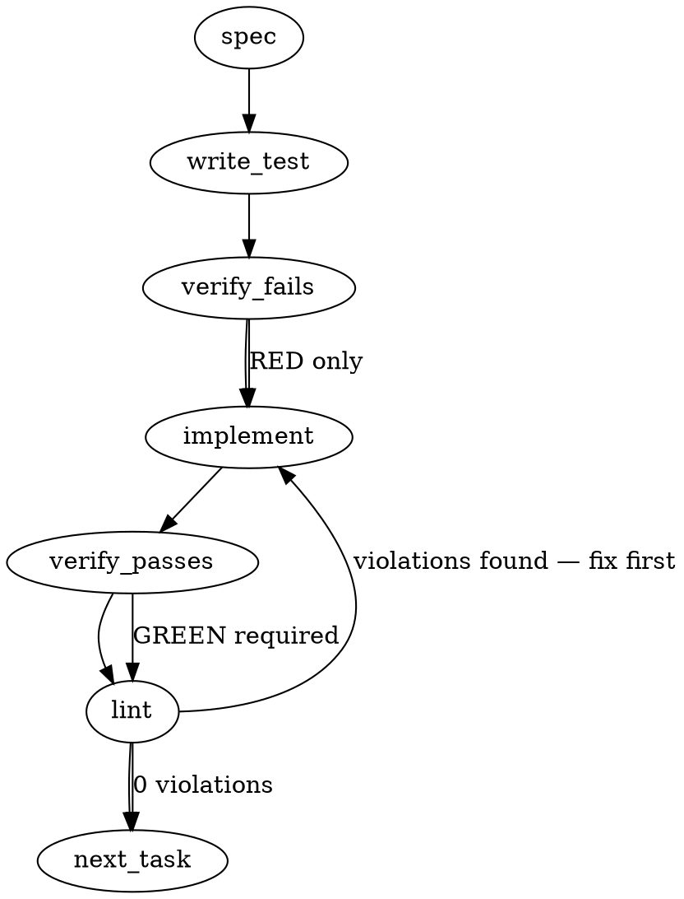

### Problem Statement

The Totem compiled rule corpus contains 39 "dead" glob patterns across 22 rules (leaving 6 rules fully inert) that fail to match any real paths because they fall through the rule engine's bounded grammar (`matchesGlob`) to an exact literal fallback containing unmatchable literal `*` characters. These patterns must be repaired to conform to the bounded engine grammar, and a static diagnostic sensor must be integrated to prevent future dead-glob regressions.

### Architectural Context

- **Freeze Governance & #2428 Consolidation:** The repair must be executed per-rule, post-freeze, rather than by modifying the underlying matcher compiler engine itself, ensuring the shared matcher's current behavior remains frozen as a regression guard.
- **Regex Safety (docs/wiki/regex-safety.md):** Any compiled glob patterns that resolve to internal regex matchers must respect Totem's ReDoS safety constraints, avoiding catastrophic backtracking.
- **Performance Constraints (docs/manual/why-totem.md):** Activating the 6 previously inert rules must not degrade the `< 2s` local lint execution benchmark on large repositories.

### Files to Examine

1. `.totem/compiled-rules.json` — Contains the entire compiled rules corpus (485 rules) where the 39 dead globs reside.
2. `packages/core/src/rule-tester.ts` — The rule execution and test harness where `matchesGlob` validation logic is defined and executed.
3. `.totem/orchestration/totem-kimi/drafts/scan-2428-empirical.mjs` — The draft script containing the original empirical scanning logic for surfacing unmatchable globs.
4. `packages/core/test/rule-tester.test.ts` — Standard test suite for the rule tester where diagnostic tests and liveness checks should be registered.

### Technical Approach & Contracts

1. **Re-derive Scan & Verification:**
   - Use the shared helper `readJsonSafe` to load `.totem/compiled-rules.json`.
   - Write a diagnostic runner that mirrors the `matchesGlob` shape-matching rules. Generate candidate paths from each glob pattern and assert if a glob matches its own rendering; if it does not, flag it as dead.
2. **Define Rule Dispositions (Contract Mapping):**
   - **Terminal wildcards:** Convert `dir/**/*` patterns to `dir/**`.
   - **Mid-name wildcards:** Convert `**/Dockerfile*` to `**/Dockerfile`, and `**/.env*` to `**/.env`.
   - **Single-star path segments:** Replace `packages/*/src/**/*.ts` with `packages/**/src/**/*.ts` or explicit package subdirectory arrays.
   - **Husky hooks:** Map `.git/hooks/*` and `.husky/*` to `.git/hooks/**` and `.husky/**` respectively.
3. **Corpus Sensor (Contract Addition):**
   - Add a rule validation step in `packages/core/src/rule-tester.ts` or during compile-time linting that dynamically checks all glob patterns. If a pattern falls back to the literal matcher but contains wildcards (`*`, `?`), trigger a compilation warning or failure.

### Edge Cases & Traps

- **Negative Glob Over-firing:** Rule `7369a979` contains negative globs (`!**/error*.js`). Fixing this to match correctly may exclude valid files that were previously scanned, potentially hiding rule violations.
- **Literal Fallback Match Trap:** Modifying the engine's `matchesGlob` implementation itself is an architectural trap; it risks breaking the #2428 behavior-freeze guarantee. All fixes must be strictly applied to the rule glob definitions themselves.
- **Zod Schema Invalidation:** When editing rule files, ensure they strictly adhere to any defined Zod schema loaded via `readJsonSafe`.

### Implementation Tasks

- [ ] **Task 1: Re-derive Dead-Glob Scan and Verify the Issue**
  - Read `.totem/compiled-rules.json` using `readJsonSafe` and implement/execute a validation harness in a test suite to isolate the 39 dead globs.
  - Files to modify: `packages/core/test/rule-tester.test.ts`
    > TEST DIRECTIVE: Before implementing, write a failing test named `detectsDeadGlobPatterns` that fails if any rule glob pattern is flagged as unmatchable by the scanner.
  - Run test -> verify fails -> implement diagnostic scanner -> verify passes -> lint

- [ ] **Task 2: Define and Apply Rule-by-Rule Dispositions**
  - Manually rewrite the 39 dead globs in `.totem/compiled-rules.json` to their corrected live patterns (e.g. changing terminal `/**/*` to `/**`).
  - Files to modify: `.totem/compiled-rules.json`
    > TEST DIRECTIVE: Before implementing, write a failing test named `ruleDispositionsAreValid` that asserts all 485 rules contain 100% matchable, active globs.
  - Run test -> verify fails -> update patterns -> verify passes -> lint

- [ ] **Task 3: Validate Restored Rule Execution**
  - Verify that the 6 previously inert rules (such as prompt-injection hygiene `d4f30250` and SDK error normalization `f43d903f`) now correctly trigger on their intended target paths.
  - Files to modify: `packages/core/test/rule-tester.test.ts`
    > TEST DIRECTIVE: Before implementing, write a failing test named `previouslyInertRulesFire` that ensures positive samples for these 6 rules now successfully trigger violations.
  - Run test -> verify fails -> bind positive fixtures to these rules -> verify passes -> lint

- [ ] **Task 4: Integrate Diagnostic Glob Sensor in Rule Tester**
  - Add a static validator to the rule compilation and runner pipeline to reject or flag rules with unmatchable wildcard-containing literal globs.
  - Files to modify: `packages/core/src/rule-tester.ts`
    > TEST DIRECTIVE: Before implementing, write a failing test named `sensorFlagsDeadGlobOnCompile` that attempts to compile/register a rule containing a dead glob (like `dir/**/*`) and asserts that a compilation error or warning is raised.
  - Run test -> verify fails -> implement sensor checks -> verify passes -> lint

### Execution Flow (structural constraint)

### Verification (MANDATORY — do not skip)

Every implementation MUST end with these steps:

1. `totem lint` — deterministic rule check (zero LLM, ~2s). Fixes any violations.
2. `totem review` — AI-powered architectural review (~18s). Addresses any critical findings.
3. If using MCP, call `verify_execution` to confirm compliance before declaring the task done.

### Test Plan

- **Verification of Dead Glob List:** Run the diagnostic scanner test suite to ensure that zero rules in `.totem/compiled-rules.json` contain dead patterns.
- **Fixture Regression Tests:** Execute `packages/core/src/rule-tester.ts` against the full existing suite of test fixtures to prove no regressions occur in matches.
- **Performance Benchmarking:** Run `totem lint` across a target directory to ensure execution remains under the 2-second benchmark with the newly active rules.
