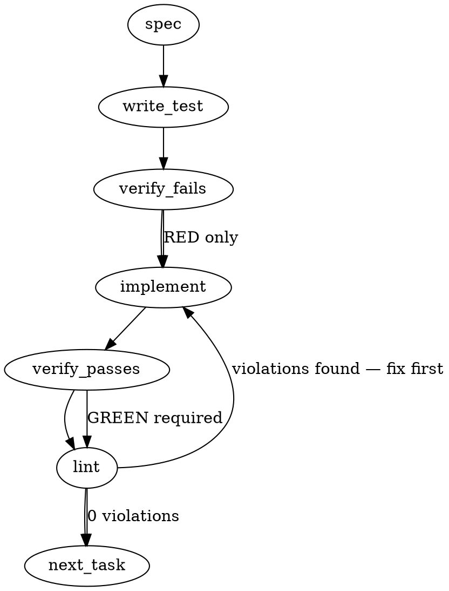

### Problem Statement

The federated `search_knowledge` tool returns duplicate results for the same document/section (one labeled with the source repository/tag, one unlabeled or with a different tag), doubling the token payload. The system needs to normalize document identities and deduplicate hits by keeping the highest-scoring instance or merging them before returning the final ranked list.

### Architectural Context

- **Cross-Repo Mesh (Federation) > Federated Queries (Default)** (`docs/wiki/cross-repo-mesh.md`): Federated queries fan out to the primary index and linked indexes in parallel, merging results using Reciprocal Rank Fusion (RRF) with $k=60$.
- **Traps**: Standard RRF merges results by document identity. If document identities differ slightly (due to path style differences, absolute vs. relative paths, or source tags), they are treated as distinct documents, leading to duplicate slots in the output and inflated context bloat.

### Files to Examine

- `packages/mcp/src/tools/search-knowledge.ts` — Houses `performSearch`, result registration, and result formatting. This is where merging, ranking, and serialization occur.
- `packages/mcp/src/tools/__tests__/search-knowledge.test.ts` — The corresponding unit tests for the search tool where federated/mock search results are validated.
- `docs/wiki/cross-repo-mesh.md` — Explains the RRF scoring formula and federation structure.

### Technical Approach & Contracts

To resolve the duplication without losing valuable context or rank accuracy, we must implement normalization and deduplication in the search pipeline.

#### 1. Identity Definition (Data Contract)

We must define a deterministic unique identifier for a document section. A `SearchResult` should be evaluated by:

- **Normalized File Path**: Standardized to use forward slashes (`/`), lowercase drive letters on Windows, and stripped of environment-specific absolute prefixes where possible (or resolving relative paths to a common anchor if accessible).
- **Section Header/Anchor**: The specific sub-section, block identifier, or header within the file to prevent grouping entirely different sections of the same file.

```typescript
interface SearchIdentity {
  normalizedPath: string;
  sectionIdentifier: string; // e.g., anchor, header text, or line block offset
}
```

> **Amendment (review round on PR #2538, 2026-07-31).** `SearchIdentity` as drawn is not collision-safe across federation: two linked repositories can hold the same relative path and section, and grouping on `{normalizedPath, sectionIdentifier}` alone would merge distinct documents and accumulate their RRF scores. The identity must additionally carry a stable source-index namespace (the linked-index name / primary key), and any fuzzy section matching must keep ambiguous matches separate rather than merging them. Build-time tests must cover identical paths across different repositories and near-identical section headers.

#### 2. Deduplication Strategy (RRF vs. Post-RRF)

We have two approaches to merge these duplicates:

- **Option A: Post-RRF Deduplication**: Let RRF run as-is. Right before slicing to `maxResults`, group results by `SearchIdentity` and retain only the entry with the highest score.
- **Option B: Identity-Aware RRF**: Deduplicate or group document identities _inside_ the RRF accumulator. If the same document section appears in multiple indexes, its RRF score is accumulated ($\sum \frac{1}{k + r}$), boosting its overall relevance, and a single consolidated record is returned.

**Recommendation**: **Option B (Identity-Aware RRF)** is highly recommended. It mathematically honors RRF principles (boosting documents found in multiple indexes) and prevents duplicate items from pushing other unique, high-quality results out of the rank list during intermediate steps.

#### 3. Preserving Source Provenance

When merging two identical documents from different stores (e.g., one local, one federated with prefix `[strategy]`), we should combine their source tags or select the most specific source tag (e.g., favoring the explicit tag `[strategy]` over an empty or default local tag) so the LLM still knows where the knowledge originated.

---

### Edge Cases & Traps

- **Path Discrepancies**: One index may index files as `proposals/active/307-foo.md` while another returns a relative path from a parent directory like `../totem-strategy/proposals/active/307-foo.md` or an absolute OS path like `D:\Dev\totem-strategy\...`. Path resolution must normalize to a canonical format (e.g., extracting relative paths from the repository root).
- **Section Identifier Variations**: If one index extracts `Motivation` and another extracts `Motivation (spec)` for the same section, simple exact matching will fail. Standardize section extraction or perform fuzzy/slugified matching on headers (e.g., converting headers to GitHub-style anchors like `#motivation`).
- **Slicing Limits**: If deduplication happens _after_ slicing to `maxResults` (e.g., keeping only top 5), we might slice down to 5 duplicate-heavy items, and then deduplicating would leave us with only 2 or 3 items total. **Deduplication must happen before slicing to `maxResults`.**

---

### Implementation Tasks

- [ ] **Task 1: Create Identity and Path Normalization Utilities**
      Write a robust path/identity normalizer within `search-knowledge.ts` to convert different paths and section names into a canonical `SearchIdentity` key.

  > TEST DIRECTIVE: Before implementing, write a failing test named `shouldNormalizeVaryingPathFormatsToSameKey` that proves `D:\Dev\repo\file.md#sec` and `repo/file.md#sec` resolve to the same canonical identity.
  - Implement `getCanonicalIdentity(result: SearchResult): string`
  - Handle slash unification (`\` to `/`), lowercase conversion, and anchor/header extraction.
  - Verify tests fail → Implement → Verify tests pass → Lint.

- [ ] **Task 2: Update Federated Merger to group by Canonical Identity**
      Modify the RRF merger loop in `performSearch` to resolve duplicate entries using `getCanonicalIdentity`.

  > TOTEM INVARIANT (Federated Queries): Merged search results from all parallel store queries must use rank-based RRF scoring with a constant of k=60.
  > TEST DIRECTIVE: Before implementing, write a failing test named `shouldAccumulateRRFScoreForDuplicateFederatedHits` that feeds two identical search results from different stores and asserts that they merge into a single result with an accumulated RRF score rather than remaining separate.
  - Adjust RRF loop: group by canonical identity, sum the RRF scores of identical documents, and merge provenance metadata (such as keeping the most specific tag/source label).
  - Ensure the final array is sorted descending by the newly consolidated RRF score.
  - Verify tests fail → Implement → Verify tests pass → Lint.

- [ ] **Task 3: Apply Slice after Deduplication**
      Ensure the results are sliced to `finalLimit` only after all duplicate identities have been resolved and RRF scores recalculated.
  - Verify slice ordering: `Search Raw` -> `Canonical Identity Grouping & RRF Accumulation` -> `Sort` -> `Slice to finalLimit`.
  - Run unit tests and confirm `totem lint` is clean.

---

### Execution Flow



### Verification

1. Run `totem lint` to ensure zero deterministic rule violations.
2. Run `totem review` to verify architectural alignment and scan for potential token-bloat regressions.
3. Call `verify_execution` via MCP to confirm that the changes pass all local integration suites.

---

### Test Plan

- **Path Normalization Tests**: Provide varying path structures (relative, absolute, different slashes) and assert they generate the identical identity key.
- **Deduplication Validation**: Mock parallel search returns where Store A returns `doc1#sec1` (score/rank 1) and Store B returns `doc1#sec1` (score/rank 2, tagged `[strategy]`). Assert that the merged output contains exactly one hit for `doc1#sec1` with an aggregated RRF score and includes the `[strategy]` tag.
- **Count Limit Enforcement**: Ensure that when querying with `maxResults: 5`, if 10 duplicate items are merged into 5 unique ones, all 5 unique items are returned (no loss of results due to pre-slice capping).
