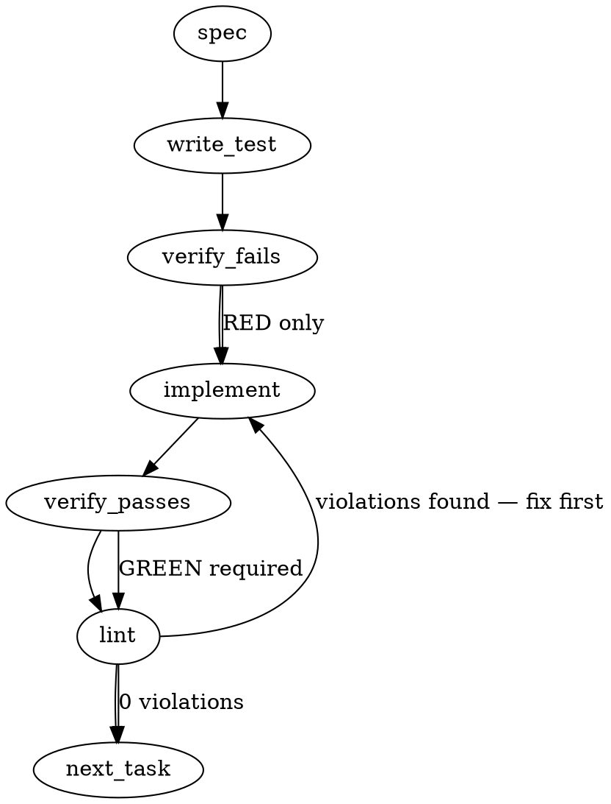

### Problem Statement

The `search_knowledge` tool returns noise-floor results with no confidence signals or explicit "nothing found" state. Downstream consumers cannot distinguish weak/absent retrieval from high-confidence matches, causing LLMs to synthesize wrong premises based on irrelevant context.

### Architectural Context

- **Federated Search Duplication (`mmnto-ai/totem#2458`):** Since search queries aggregate results across primary and linked stores, deduplication logic must preserve the maximum score of any duplicate result before executing threshold filtering.
- **Tenet 4 (Fail-Honest over Fail-Quiet):** If a retrieval query produces zero results above the relevance threshold, the system must explicitly communicate the absence of high-confidence material rather than silently returning low-relevance noise.

### Files to Examine

- `packages/mcp/src/tools/search-knowledge.ts` — The implementation of `registerSearchKnowledge`, `performSearch`, and `federatedSearch`. This is where threshold evaluation, scoring exposure, and tool result formatting occur.

### Technical Approach & Contracts

To address the lack of confidence signaling and ensure programmatics can distinguish weak search results, we will introduce a configurable relevance threshold and a structured response contract.

#### 1. Configuration & Default Threshold

We will define a standard noise-floor constant `DEFAULT_RELEVANCE_THRESHOLD = 0.05` (with the capacity to read a custom floor from the Totem configuration).

#### 2. Modified Inputs

Extend the `search_knowledge` input schema to accept an optional `minScore` threshold:

```typescript
import { z } from 'zod';

const SearchKnowledgeInputSchema = z.object({
  query: z.string().describe('Search query for Totem knowledge'),
  typeFilter: z.enum(['code', 'session', 'spec', 'lesson']).optional(),
  maxResults: z.number().optional(),
  boundary: z.string().optional(),
  minScore: z
    .number()
    .optional()
    .describe('Minimum relevance score floor to return results (defaults to 0.05)'),
});
```

#### 3. Structured Output Contract

Instead of returning unstructured strings where scores are hidden, the tool response will be formatted as a structured JSON envelope serialized into the tool's text content. This ensures both programmatic tools (like wrapper agents) and LLMs can easily parse the confidence signals.

```typescript
interface SearchKnowledgeResponse {
  status: 'success' | 'no_useful_hits';
  query: string;
  thresholdApplied: number;
  highestScore: number;
  resultsCount: number;
  results: {
    path: string;
    score: number;
    title: string;
    preview: string;
  }[];
}
```

_Trade-off analysis:_

- **Option A (Plain text formatting with inline scores):** Easy for LLMs to read but hard for programmatic wrappers to confidently parse without brittle regex.
- **Option B (Structured JSON text block):** Extremely easy for both programs to parse (`JSON.parse()`) and structured enough for downstream LLM prompts to understand the confidence state explicitly.
- **Recommendation:** Use Option B. If the maximum score is below the threshold, return a payload with `status: 'no_useful_hits'` and an empty `results` array, accompanied by the highest score observed to maintain clear visibility.

### Edge Cases & Traps

- **Empty Result Array / Math.max Edge Case:** If the federated search returns absolutely zero results, calling `Math.max(...scores)` will yield `-Infinity`. This must be safely guarded with a fallback value of `0.0`.
- **Deduplication Masking Scores:** When federating across multiple stores, the same file may appear with different scores. The deduplication logic must retain the _highest_ score, not the first one it encounters, before checking against the threshold.
- **Scoring Fluctuations:** Thresholds must be floating-point safe (e.g., using epsilon-tolerant comparisons or standard `>=` check with normalized scores).
- **Backward Compatibility:** Ensure existing tools calling `search_knowledge` don't crash if they do not pass the new `minScore` parameter. It must gracefully fallback to the configured or default threshold.

### Implementation Tasks

- [ ] **Task 1: Define Schemas & Default Constants**
      Modify `packages/mcp/src/tools/search-knowledge.ts` to add threshold configuration constants and extend the Zod input schema.

  > TEST DIRECTIVE: Before implementing, write a failing test named `rejectsInvalidMinScoreParameter` verifying that negative thresholds or values greater than 1.0 are rejected by the Zod validator.
  - Define `DEFAULT_RELEVANCE_THRESHOLD = 0.05`
  - Update `SearchKnowledgeInputSchema` to accept `minScore` (optional number between `0.0` and `1.0`)
  - Write test → verify fails → implement → verify passes → lint

- [ ] **Task 2: Update Federated Search Deduplication & Scoring**
      Update the federated search pipeline in `packages/mcp/src/tools/search-knowledge.ts` to surface raw relevance scores and properly aggregate them.

  > TEST DIRECTIVE: Before implementing, write a failing test named `preservesHighestScoreDuringDeduplication` demonstrating that when duplicate results are resolved, the maximum score is preserved.
  - Ensure the internal `SearchResult` structure holds and exposes the raw numerical `score`
  - Modify federated deduplication logic to group by file path and choose `Math.max(existingScore, newScore)`
  - Write test → verify fails → implement → verify passes → lint

- [ ] **Task 3: Implement Threshold Filtering and "No Useful Hits" State**
      Refactor `performSearch` to apply the relevance threshold and build the final structural payload.

  > TEST DIRECTIVE: Before implementing, write a failing test named `returnsNoUsefulHitsStatusWhenBelowThreshold` that mock-returns results with a maximum score of `0.016` against a `0.05` threshold and verifies the response status is `'no_useful_hits'`.
  - Extract the highest score from the returned set. Handle empty results safely (highest score = `0.0`).
  - If the highest score is below the target `minScore`, return a response envelope with `status: "no_useful_hits"`, empty `results`, and `highestScore` populated.
  - If results exceed the threshold, filter out any individual results scoring below `minScore`, sort descending, and return `status: "success"`.
  - Write test → verify fails → implement → verify passes → lint

- [ ] **Task 4: Serialize Tool Output Contract**
      Ensure the `ToolResult` returned by `registerSearchKnowledge` stringifies the structured envelope cleanly so callers can parse it programmatically.
  - Format the text output of the tool as a neat, serialized JSON block using the `SearchKnowledgeResponse` interface structure.
  - Write test → verify fails → implement → verify passes → lint

### Execution Flow (structural constraint)



### Verification (MANDATORY — do not skip)

Every implementation MUST end with these steps:

1. `totem lint` — deterministic rule check (zero LLM, ~2s). Fixes any violations.
2. `totem review` — AI-powered architectural review (~18s). Addresses any critical findings.
3. If using MCP, call `verify_execution` to confirm compliance before declaring the task done.

### Test Plan

- **Unit Tests:**
  - Verify that searching with `minScore` filters out items below the floor.
  - Verify that if no items meet the floor, the response has `status: 'no_useful_hits'` and contains `highestScore`.
  - Verify empty search results are handled without `NaN` or `-Infinity` errors.
  - Verify that duplicate results in federated stores resolve to their maximum score.
- **Integration Tests:**
  - Invoke the tool registration mock via MCP protocol and ensure it parses the input arguments and produces valid JSON matching the `SearchKnowledgeResponse` interface.

## Implementation Design

> Supersedes the generated plan above where they conflict. The generated plan's central mechanism is wrong against the shipped scoring architecture: it floors on the _displayed_ score, but displayed scores in hybrid and federated modes are RRF rank artifacts (`1/(60+rank)` ≈ 0.016 for rank 1 **by construction** — `packages/core/src/store/lance-search.ts:220-240`, `packages/mcp/src/tools/search-knowledge.ts:331-339`). A 0.05 floor over RRF scores would classify every fused result as no-useful-hits, always. Uniform 0.016 does not mean "all weak"; it means "ranks 1–5 with relevance signal destroyed before display." The fix is to carry the real signal through fusion, not to threshold the rank artifact.

### Scope

Ship the Ask 2 retrieval gate: surface true per-hit relevance through both RRF sites, add a config/param relevance floor with an honest `no_useful_hits` state, label per-hit provenance, degrade to the existing FTS-only path (loudly) when the embedder is unavailable, and silence the compile push-nag under the active rule-compilation freeze. Explicitly NOT in scope: federated dedup (#2458), the strategy-MCP cwd bug (#2464), full-JSON response rewrite, CLI `totem search` display changes, and any change to result _ordering_ (RRF ordering is untouched).

### Data model deltas

| Delta                                                              | Holds                                        | Writers                                                                                | Readers                                   | Invariants                                                                                                                            |
| ------------------------------------------------------------------ | -------------------------------------------- | -------------------------------------------------------------------------------------- | ----------------------------------------- | ------------------------------------------------------------------------------------------------------------------------------------- |
| `SearchResult.relevance?: number`                                  | vector-leg similarity `1/(1+distance)`, 0..1 | `rowToSearchResult`; preserved (never overwritten) through `rrfMerge` + federation RRF | MCP floor logic, `formatResult`, envelope | absent iff hit had no vector leg (FTS-only); `score` keeps RRF semantics for ordering                                                 |
| `SearchResult.searchMethod?: 'hybrid' \| 'vector' \| 'fts'`        | which path produced the hit                  | `LanceStore.search` / fallback path                                                    | envelope, `formatResult`                  | present on every hit                                                                                                                  |
| config `searchRelevanceFloor`                                      | floor in relevance units                     | `config-schema.ts`, `z.number().min(0).max(1).default(0.25)`                           | MCP `performSearch`                       | flat key beside `contextWarningThreshold` precedent                                                                                   |
| MCP input `min_relevance?`                                         | per-call floor override                      | caller                                                                                 | `performSearch`                           | 0..1; overrides config; effective floor always disclosed in envelope                                                                  |
| `<retrieval-envelope status method bestRelevance floor hits>` line | machine-parsable outcome                     | `performSearch`                                                                        | agents/wrappers                           | `status ∈ {ok, no_useful_hits, empty}`; sits beside the existing `<index-meta>` line (same XML-attr pattern — no JSON contract break) |

No new state containers; everything is per-request. Reserved-key note: `status` values are a closed enum; `no_useful_hits` is not inferable from `hits=0` (that's `empty`) — weak vs absent stays programmatically distinct (#2463 AC 3).

### State lifecycle

All new fields are per-request, created during one `performSearch` call, never cached, no cross-request ownership. The only cross-lifecycle read is `deriveRuleCompilationFrozen` (reads `.totem/freeze.json` per lint run; already exists — `packages/cli/src/help-freeze.ts:43-56`).

### Failure modes

| Failure                                       | Category       | Agent-facing surface                                                                                                                                                      | Recovery                                                         |
| --------------------------------------------- | -------------- | ------------------------------------------------------------------------------------------------------------------------------------------------------------------------- | ---------------------------------------------------------------- |
| Embedder unresolvable, FTS index present      | init/permanent | **degraded success**: keyword-only results + system warning + `method="fts"` in envelope                                                                                  | fix key/Ollama; next query re-attempts (LazyEmbedder re-resolve) |
| Embedder unresolvable, no FTS index           | init/permanent | hard `isError` (unchanged)                                                                                                                                                | `totem sync` to build FTS, or fix embedder                       |
| Best relevance < floor                        | runtime        | `status="no_useful_hits"` + bestRelevance + compact below-floor candidate list (path + relevance, no content) — exclusion disclosed per Prop 308 F1, not silently dropped | caller reformulates or lowers `min_relevance`                    |
| Zero rows returned                            | runtime        | `status="empty"` (existing "No results found." body retained)                                                                                                             | n/a — honest answer                                              |
| Every hit lacks `relevance` (pure-FTS corpus) | runtime        | `status="ok"`, `bestRelevance="n/a"` — floor never fires without signal                                                                                                   | n/a                                                              |
| All federated stores fail                     | transient      | existing `isError` outage path (unchanged)                                                                                                                                | existing reconnect/retry                                         |
| `freeze.json` unreadable in nag path          | runtime        | show the original staleness nag (info-preserving default)                                                                                                                 | fix freeze file                                                  |

Justification for the one degraded-success row (Tenet 4): the warning is loud, the envelope labels the method, and results are honestly labeled keyword-only — vs today's hard error that yields zero retrieval (the pilot floor-check-4 evidence).

### Freeze push-nag (slice B)

`lint.ts:146-255` staleness block consults `deriveRuleCompilationFrozen`; when the rule-compilation freeze is active, the staleness warning + `Run 'totem lesson compile'` remediation (`lint-staleness.ts:185`) are fully suppressed (the ruled ask: "silenced"; freeze state stays visible via orient/status/help-badge). No change to `verify-manifest` (already freeze-aware).

### Invariants to lock in via tests

- RRF ordering is byte-identical before/after — `relevance` never affects sort.
- `relevance` survives both fusion sites (intra-store hybrid AND federation) — the fix works in single-store mode too, matching both sighting shapes.
- `bestRelevance` = max over hit relevances, empty-safe (no `-Infinity`).
- Floor never produces `no_useful_hits` when no hit carries relevance signal.
- Below-floor candidates appear in the compact disclosure list — never silently dropped.
- Embedder-down + FTS-present → success-shaped, `method="fts"`, warning present; embedder-down + no FTS → `isError` unchanged.
- Freeze active → staleness advisory absent from `totem lint` output; freeze absent → advisory unchanged; freeze unreadable → advisory shown.
- `min_relevance` overrides config; envelope always reports the effective floor.
- Envelope line parses with a single regex from the response text (wrapper-agent contract).

### Open questions — RULED 2026-07-23 (operator): all three recommendations adopted — Q1 ship 0.25 + pilot calibration, Q2 full silence under freeze, Q3 two slices (A retrieval core+mcp, B nag cli). Opus subagents for mechanical implementation.

- **Q1 — floor default:** relevance-unit distributions are uncalibrated. **Options:** ship 0.25 and calibrate from `search-log.jsonl` during pilot day 0–1; or ship floor-disabled (0) and arm after calibration. **Recommendation:** 0.25 + calibrate — the envelope discloses the floor, so a miscalibrated default is visible, not silent. _Calibration caveat (review round 1, sonnet lane): the `1/(1+_distance)` relevance transform assumes a consistent LanceDB distance metric across indexes — a future metric change silently shifts the 0..1 semantics; the pilot calibration pass must re-validate the floor if the embedding/metric config ever changes._
- **Q2 — nag suppression depth:** full silence under freeze vs a one-line "staleness expected under active freeze" note. **Recommendation:** full silence (the ruled ask's word), freeze visibility already lives in orient/status.
- **Q3 — PR shape:** one PR for the whole gate vs slice A (retrieval: core+mcp) + slice B (nag: cli). **Recommendation:** two slices — different subsystems, cleaner review, B is ~30 lines.
