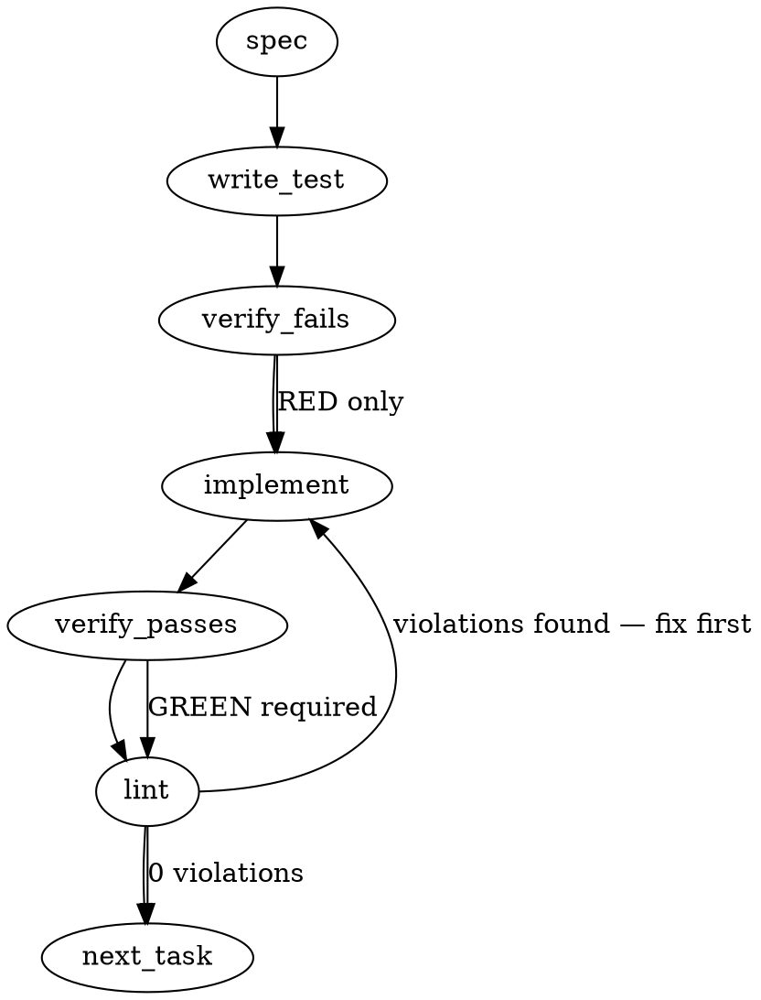

### Problem Statement

The `totem review` command (executed via `shieldCommand` in `packages/cli/src/commands/shield.ts`) currently exits with `0` when a diff is skipped due to containing only non-reviewable files (e.g., prose-only changes). Because the `tools/pre-push` gate checks the exit code (`$TOTEM_CMD review || exit 1`), this silent exit `0` allows potentially critical behavioral changes (e.g., instruction-prose in `AGENTS.md`, `.claude/skills/`, etc.) to bypass the review gate entirely without a review or stamp, creating an authorization bypass.

### Architectural Context

The pre-push gate's dependency on exit codes became the primary authorization boundary after the `PreToolUse` gate (which checked `.reviewed-content-hash`) was decommissioned in #2180.
The following constraints from the cohort round must govern the design:

1. **Instruction-Prose is Behavior (totem-kimi):** Files like `AGENTS.md`, `doctrine/**`, and `.claude/skills/**` are behavior-defining control plane files and must _never_ be treated as trivial/skippable prose.
2. **Deterministic Admission Split:** We must clearly separate Admission/Applicability checking from Lane Fan Execution, ensuring skips are never modelled as a lane status or invocation failure.
3. **Ambiguity of Exit 0:** A clean exit `0` should exclusively mean "a review was successfully run and passed". An inapplicable/skipped state must exit with a distinct code (e.g., `2`) to let callers explicitly handle or reject the skip.

### Files to Examine

- `packages/cli/src/commands/shield.ts` — Contains `shieldCommand`, which implements the CLI review gate, diff filtering, and early-exit skip paths.
- `tools/pre-push` — The pre-push hook script running `$TOTEM_CMD review`.
- `packages/cli/src/git.ts` — Houses git helper logic such as diff extraction and file classification.
- `packages/cli/src/commands/install-hooks.ts` — Code that generates and installs the git hooks.

### Technical Approach & Contracts

We will restructure the entrypoint of the review command inside `packages/cli/src/commands/shield.ts` into a two-phase architecture:

#### Phase 1: Admission / Applicability Phase

We will introduce a formal Admission Phase that evaluates the diff and determines applicability _before_ any review lanes are configured or executed.

**Data Contracts:**

```typescript
export type AdmissionStatus = 'admitted' | 'not-applicable';

export type NotApplicableReason = 'no-diff' | 'all-non-code' | 'filtered-empty' | 'all-generated';

export interface AdmissionResult {
  status: AdmissionStatus;
  reason?: NotApplicableReason;
  files?: string[];
}
```

**Control Flow Logic:**

1. Retrieve the diff using the `getGitDiff` shared helper.
2. If the diff is empty, return `{ status: 'not-applicable', reason: 'no-diff' }`.
3. Extract changed files via `extractChangedFiles(diff)`.
4. Categorize files:
   - Identify any "control plane / instruction prose" files (e.g., matching `AGENTS.md`, `doctrine/**/*`, `.claude/skills/**/*`). These must always be classified as code/behavior, forcing admission.
   - Identify and filter out generated files.
   - Filter remaining files against `.totem/review-extensions.txt` (or default code extensions).
5. Evaluate categorization:
   - If all files were generated, return `{ status: 'not-applicable', reason: 'all-generated' }`.
   - If all files are non-code/prose (excluding instruction prose), return `{ status: 'not-applicable', reason: 'all-non-code' }`.
   - If the filtered file list is empty, return `{ status: 'not-applicable', reason: 'filtered-empty' }`.
   - Otherwise, return `{ status: 'admitted', files: reviewableFiles }`.

#### Phase 2: Execution and Exit Contract

- If `status === 'admitted'`: Proceed with the lane execution fan. Terminate with `completed | abstained | failed`. Exit `0` on success, `1` on failure.
- If `status === 'not-applicable'`: Exit with code `2` (representing "deterministic skip / not applicable") instead of `0`.
- Update `tools/pre-push` to explicitly handle the exit contract:
  ```bash
  # Allow successful reviews (0) or clean skips (2), but fail on genuine errors/review failures (1)
  $TOTEM_CMD review
  EXIT_CODE=$?
  if [ $EXIT_CODE -ne 0 ] && [ $EXIT_CODE -ne 2 ]; then
    exit 1
  fi
  ```
  _Trade-off analysis:_ This ensures that if the user edits behavior-altering prose (which gets admitted and fails review), it exits `1` and blocks. If it is genuinely non-applicable (e.g., standard docs), it exits `2` and the pre-push gate explicitly allows it. Any unexpected crash or failure exits `1` (fail-safe).

### Edge Cases & Traps

1. **Instruction Prose Bypass:** Edits to `.claude/skills/` or `AGENTS.md` could be misclassified as standard markdown/prose and skipped. We must explicitly hardcode these patterns as "always admitted / reviewable".
2. **Bootstrap Dilemma / Empty Repository:** On a fresh repository with no commits or zero tracked files, `getGitDiff` may fail or return an empty diff. We must safely handle empty git roots and default to `not-applicable` with `no-diff` instead of crashing.
3. **Untracked review-extensions Modification:** If `.totem/review-extensions.txt` is modified locally but gitignored, the diff parser won't see it. We must ensure that the extension check is performed using the runtime configuration of active extensions rather than only looking at the git index.
4. **Race Conditions during Push:** If files are modified while the pre-push hook runs, the staged diff might mismatch the disk. We must ensure the diff is retrieved deterministically matching the target commit range.

### Implementation Tasks

- [ ] **Task 1: Define Admission Types & Control Plane Rules**
  - Add the `AdmissionResult`, `AdmissionStatus`, and `NotApplicableReason` types to a shared interface or directly in `packages/cli/src/commands/shield.ts`.
  - Define a constant matcher array `CONTROL_PLANE_PATTERNS = ['AGENTS.md', 'doctrine/**', '.claude/skills/**']`.
    > TEST DIRECTIVE: Before implementing, write a failing unit test in `packages/cli/test/admission.test.ts` named `admits_control_plane_prose_files` that asserts `AGENTS.md` is admitted even if it matches a `.md` prose extension.
  - Write test -> verify fails -> implement -> verify passes -> lint

- [ ] **Task 2: Implement Admission Evaluator Function**
  - Refactor the early-return logic of `shieldCommand` in `packages/cli/src/commands/shield.ts` into a standalone function `evaluateAdmission(diff: string, options: ShieldOptions): Promise<AdmissionResult>`.
  - Use `extractChangedFiles` from the shared helper library to parse the diff.
    > TOTEM INVARIANT (Instruction-prose is behavior): Any changed file matching `CONTROL_PLANE_PATTERNS` forces `status: 'admitted'`.
  - Correctly identify `all-generated`, `all-non-code`, `filtered-empty`, and `no-diff` scenarios.
  - Write unit tests covering all 4 `not-applicable` reasons.
  - Write test -> verify fails -> implement -> verify passes -> lint

- [ ] **Task 3: Apply Exit Code 2 for Not-Applicable Status**
  - Modify `shieldCommand` execution logic to inspect the `AdmissionResult`.
  - If the result is `not-applicable`, print a deterministic log message explaining the reason, and exit the process with code `2`.
    > TEST DIRECTIVE: Before implementing, write a failing integration/CLI test named `exits_with_code_2_on_deterministic_skips` that executes `totem review` on a prose-only branch and asserts the exit code is exactly `2`.
  - Write test -> verify fails -> implement -> verify passes -> lint

- [ ] **Task 4: Update the Pre-Push Hook Script**
  - Modify `tools/pre-push` to capture the exit code of `$TOTEM_CMD review` and permit exit codes `0` and `2`, while rejecting all other non-zero exit codes.
  - Update `packages/cli/src/commands/install-hooks.ts` so that newly generated hooks deploy with this updated exit-code contract.
  - Write test -> verify fails -> implement -> verify passes -> lint

### Execution Flow (structural constraint)



### Verification

Every implementation MUST end with these steps:

1. `totem lint` — deterministic rule check (zero LLM, ~2s). Fixes any violations.
2. `totem review` — supplementary AI lanes over the diff (~18s, advisory). Address critical findings; your team's review discipline decides the review of record.
3. If using MCP, call `verify_execution` to confirm compliance before declaring the task done.

### Test Plan

1. **Admission Phase Unit Tests (`packages/cli/test/admission.test.ts`):**
   - Assert `evaluateAdmission` returns `not-applicable` with `no-diff` on empty diffs.
   - Assert `evaluateAdmission` returns `not-applicable` with `all-non-code` on pure markdown/prose modifications (excluding control-plane files).
   - Assert `evaluateAdmission` returns `admitted` when a control plane file (e.g. `.claude/skills/git-skills.md`) is modified.
   - Assert `evaluateAdmission` returns `not-applicable` with `all-generated` on generated lockfiles/build outputs.

2. **Integration / Exit Code Contract Tests (`packages/cli/test/shield-cli.test.ts`):**
   - Mock git diff command outputs and assert CLI exit codes for `admitted` success (`0`), `admitted` failure (`1`), and `not-applicable` skips (`2`).

3. **Pre-Push Hook Verification:**
   - Execute the pre-push hook manually in a test workspace with both code modifications, standard prose modifications, and instruction-prose modifications to verify correct gate bypassing and blocking.

## Implementation Design

**Governing spec = the operator ruling comment on #2473 (2026-08-12) + strategy-claude's 2026-08-12T1823Z rationale dispatch.** The generated sections above DIVERGE from the ruling and are overridden where they conflict:

| Generated spec says                                                   | Ruling says                                                                                                           | Verdict               |
| --------------------------------------------------------------------- | --------------------------------------------------------------------------------------------------------------------- | --------------------- |
| not-applicable exits **2** by default; hook allows 0∨2                | **No nonzero-by-default skip exit**; bare `totem review` keeps sensor exit 0                                          | exit stays 0          |
| `CONTROL_PLANE_PATTERNS` force-admit `AGENTS.md`/`doctrine/**`/skills | Authorization ≠ coverage; instruction-prose coverage is Prop 297 / #2525's lane, **not this build**                   | no forced admission   |
| (absent)                                                              | Machine-readable `not-applicable` disposition + verdict-surface record readable by `--covariate`                      | the core of the build |
| (absent)                                                              | A total deterministic skip **never mints a stamp** — incl. `no-diff`, whose live path stamps today (`shield.ts:1718`) | stamp removed         |

### Scope

Model the four deterministic skips (`no-diff` / `all-non-code` / `filtered-empty` / `all-generated`) as admission-phase `not-applicable` verdicts: each writes one machine-readable admission record, prints ONE calm disposition line, never stamps; a new `--gate` flag gives hooks a declared disposition→exit mapping, and both hook surfaces regenerate to consume it. NOT in scope: instruction-prose coverage (Prop 297/#2525), the bootstrap dilemma beyond stamp-removal, #2459's failure-kind mapping, ask-level `--fail-on` changes, distributed-skill edits (parity-locked; crown fold).

### Data model deltas

_(Revised per the codex review deposit, 2026-08-14T1947Z — blocking finding 1 + the fingerprint answer.)_

- `NotApplicableReason` union + `AdmissionRecord` (core, new module `artifacts/admission.ts`): `{ schemaVersion: '1.0.0', disposition: 'not-applicable', reason, createdAt, scope, inputHash, projectionPolicyHash, skippedFileCount }`. The record **binds the exact observation that produced it**:
  - `scope`: normalized diff-scope identity `{ source, base, head, selectorForm }` — ALWAYS present, including `no-diff` (base/head may be null there, but the attempted selector form and source are recorded; a global null identity fails the base/range constraint).
  - `inputHash`: sha256 over the pre-filter diff bytes (hash of empty for `no-diff`).
  - `projectionPolicyHash`: canonical hash over the effective selection policy — `review.sourceExtensions`, generated globs + `.gitattributes` generated/not-generated rules, ignore/filter policy. The canonicalizer is published in core and tested. Required for honest re-derivation even though the record never mints authorization: `not-applicable` is a projection result and the record is a claim about that projection (codex, answering OQ-adjacent question: yes).
  - `schemaVersion` follows the established artifact-evolution shape (semver string, tolerant within major, migration-on-read before a future major) — matching the verdict store's actual contract, not a bare numeric.
  - Count-only, never file names (names stay on the existing dim stderr line).
- Store: `.totem/artifacts/admissions/`, content-addressed (validate-on-write-out, `wx` create-exclusive, EEXIST dedup) with `createdAt` excluded from the address as **observability-only**. With identity fully bound, dedup now collapses only _identical observations_ (same bytes, same policy, same scope) — the repeat is the same fact, so first-write-wins is sound. The former "whipsaw" accepted-limitation is **retired**: it was an artifact of wall-clock arbitration, which the resolver below no longer performs.
- **Resolution is deterministic and exact-current, never wall-clock arbitration across record families** (codex blocking 1 fold): `--covariate` re-derives the CURRENT admission classification for the current scope (read-only, zero-LLM, cheap). If not-applicable → look up the record at that exact identity: present → render it; absent/corrupt → loud no-current-record sensor (**never** a silent fallback to an older verdict on the lineage). If admitted → the existing `findLatestVerdictForLineage` deterministic path, unchanged.
- Renderer: core-owned `renderAdmissionLine(recordWithAddress)` → `local-lane: not-applicable (<reason>) recorded=<hash8> at=<createdAt>` — same `local-lane:` prefix, one format authority. `at=` renders the record's own timestamp; under dedup a repeat identical skip shows the first observation's stamp — one changeset clause names this so it never reads as staleness of the check (strategy refinement 2).
- No new fields on `VerdictArtifact`; the verdict store never contains a lanes-empty record (admission precedes the fan by construction).

### Admission evaluator (the phase boundary is a function, not four instrumented returns)

_(Codex blocking finding 2 fold.)_ One closed evaluator, `evaluateAdmission(...)`: input = the resolved full-scope diff + effective config; output = a discriminated union — `{ status: 'admitted', diff, files, scope, inputHash, projectionPolicyHash }` (the exact fan inputs) or `{ status: 'not-applicable', reason, scope, inputHash, projectionPolicyHash, skippedFileCount }` (the exact record inputs). One emission path writes the record + prints the line; fan execution is **structurally unreachable** on not-applicable (the fan function takes the admitted variant, not a maybe). Ordering: diff derivation + admission run **before** engine boot and lane validation (today's boot-then-skip at `shield.ts:1643→1786` does wasted work and blurs the phase). **Incremental seam resolved by construction:** admission always evaluates the FULL scope from `getDiffForReview` (scope meta always present); the legacy incremental delta may narrow the admitted LLM payload afterward, inside the admitted branch — it never feeds admission, so the `diffScopeMeta`-less identity gap cannot arise.

### State lifecycle

Admission records: persistent, repo-local (gitignored artifacts dir), created at skip time by `shieldCommand`, never mutated, never deleted by this build; dedup bounds growth for repeated identical skips. `--gate` is per-invocation CLI state, no persistence. No cross-lifecycle state.

### Failure modes

| Failure                                                                                         | Category          | Agent-facing surface                                                                                                                                                                                              | Recovery                                                 |
| ----------------------------------------------------------------------------------------------- | ----------------- | ----------------------------------------------------------------------------------------------------------------------------------------------------------------------------------------------------------------- | -------------------------------------------------------- |
| Admission-record write fails (EACCES/disk)                                                      | transient         | loud warning; disposition LINE already printed; exit unchanged (record is disclosure — Tenet 13 sensor, not a gate; justified vs Tenet 4 because the stderr line is the loud surface and it never silently drops) | next skip rewrites                                       |
| `--gate` meets an unmapped disposition kind                                                     | permanent         | hard error, nonzero (fail-closed forward-compat — the one exit-semantic difference from bare)                                                                                                                     | upgrade CLI                                              |
| `--gate` + `--fail-on` together                                                                 | init              | `CONFIG_INVALID` (contradictory: hook context is findings-report-only per the #2551 fold)                                                                                                                         | fix wiring                                               |
| New hook + old CLI without `--gate`                                                             | init              | `--help` probe (existing `--scope-to-diff` precedent) falls back to bare `review`                                                                                                                                 | upgrade CLI                                              |
| Current state is not-applicable but its exact-identity record is absent/corrupt (`--covariate`) | runtime           | LOUD no-current-record sensor; never a silent fallback to an older verdict on the lineage (codex amendment)                                                                                                       | re-run `totem review`                                    |
| Verdict AND admission exist for one lineage                                                     | —                 | resolved by re-deriving the CURRENT admission state (deterministic), never wall-clock arbitration                                                                                                                 | n/a                                                      |
| Downstream pre-#2180 hook consumed the clean-tree stamp                                         | permanent (fleet) | stamp no longer refreshed on `no-diff`; LOUD changeset paragraph names it                                                                                                                                         | consumer regenerates hooks (`totem init`/`hook install`) |

### Exit contract (the ruled mapping)

Bare `totem review`: not-applicable → **exit 0** + one calm line + record; all existing throws unchanged. The disposition line is **info/dim level, never WARN-class** — it prints on ~every strategy push (level + one-line shape test-locked; strategy refinement 1). `--fail-on <sev>`: admission precedes severity semantics — a not-applicable admission exits 0 (nothing was attempted; the `!cacheEligible` arm never evaluates because no round exists — regression-locked). `--gate`: exhaustive disposition→exit map — not-applicable → 0 (explicit coverage pass, disclosed), completed round → 0 (findings report-only in hook context, #2551), hard failures → nonzero (unchanged), unknown → nonzero (fail-closed). **Flag-conflict validation (`--gate` + `--fail-on` → `CONFIG_INVALID`) runs at the top of `shieldCommand`, BEFORE `upgradePrePushHookIfNeeded` or any other side effect** (codex amendment 1 — today's hook auto-upgrade at `shield.ts:1590` precedes flag validation, so a misplaced guard would let an invalid command mutate the hook first). Hooks regenerate: `install-hooks.ts` template strict-arm + `tools/pre-push` become `$TOTEM_CMD review --gate || exit 1` behind the `--help` probe; the old-CLI fallback **discloses compat mode visibly** (matching the existing `--scope-to-diff` compat-line precedent), and both surfaces are fixtured across: supported `--gate` / unsupported fallback / probe failure / hard-error blocking / unknown-disposition blocking (codex amendment 2). Propagation to the fleet rides `totem init`/`hook install` (the existing channel — no forced silent upgrade; `upgradePrePushHookIfNeeded` stays scoped to its legacy class).

### Invariants to lock via tests

- Each of the four not-applicable reasons writes exactly one admission record and prints exactly one disposition line, through the SINGLE evaluator/emission path; none stamps (`no-diff` stamp removal regression-locked).
- Every admission record carries `scope` + `inputHash` + `projectionPolicyHash`; two different diffs on one branch produce two distinct record addresses; a policy change (extensions / generated rules / filters) changes the address for equal bytes.
- The policy-hash canonicalizer is deterministic across key order and platform (fixture-locked).
- `--covariate` resolution is deterministic: re-derived current admission state decides the family; a not-applicable current state with no exact-identity record produces the loud no-current-record sensor, never an older verdict's line.
- Fan execution is unreachable on a not-applicable admission: the type barrier is `selectExecutionPayload`, which takes the ADMITTED variant (the fan itself consumes its output plus loose scope metadata — control-flow, not a type wall, carries the last step); the runtime guarantee is the admission gate's early return, locked by the boot-spy never-called assertions. _(Wording corrected per falsification-leg NIT 15 — the earlier "type-level: the fan takes the admitted variant" overstated the barrier by one step.)_
- The disposition line is info/dim level and exactly one line (level-locked).
- Bare exit code on every not-applicable admission is 0; `--gate` exits 0 on not-applicable and nonzero on an artificially-injected unknown disposition; `--gate --fail-on x` is refused with `CONFIG_INVALID`.
- `--covariate` renders the admission line for a skip lineage, still writes nothing (read-only contract), and falls back loudly on a corrupt record.
- Admission store round-trip: validate-on-write-out, EEXIST dedup, address stability under `createdAt` variation.
- Hook template and `tools/pre-push` carry byte-identical totem-managed gate invocations (single-source assertion).

### Open questions

_(All three now carry unanimous reviewer endorsement — strategy-claude 1939Z deposit + codex 1947Z concurrences; operator rules.)_

- **Q1 — flag name:** **Recommendation: `--gate`** — endorsed by both. Strategy's rider (carried into changeset prose, not the name): state explicitly that the flag IS the wiring's declared disposition→exit mapping (ADR-109's wrapper role), so nobody reads it as the sensor growing teeth by default.
- **Q2 — no-diff stamp removal:** **Recommendation: remove now, loud changeset** — endorsed by both. Strategy verified the compat weight: removal only reaches a consumer WITH the new CLI; a pre-#2180 stamp-consuming hook that misses the refresh re-runs review and lands in the skip path at exit 0 — worst case a redundant pass, never a block. Codex: required by the ruling.
- **Q3 — admission record carries file names?** **Recommendation: count-only** — endorsed by both, now WITH full identity binding (scope + inputHash + policy hash). Names later = schemaVersion bump with a reason. _(Rationale corrected per codex note 4: count-only avoids persisting names and keeps the record minimal — it does NOT make the address rename-stable, because `inputHash` intentionally changes when the diff changes.)_

### Design review round (2026-08-14, operator-greenlit)

- **strategy-claude 1939Z: PRESENT, no blocking findings.** Exit contract confirmed as ruled (no-blocking-window property verified on every upgrade-order path); b8aa74a2 premise correction accepted at source; OQ1/2/3 endorsed; two refinements folded (calm-line level test-lock; `at=` dedup changeset clause). Fail-soft admission-write and the Tenet-4 justification paragraph reviewed and held.
- **totem-codex 1947Z: REQUEST CHANGES — all folded.** Blocking 1 (record identity: bind scope + inputHash + projectionPolicyHash; deterministic exact-current resolution; no wall-clock arbitration — the false-covariate class is a contract error, retired by construction). Fingerprint question answered YES — folded. Blocking 2 (single closed admission evaluator before engine boot; fan structurally unreachable on not-applicable; incremental seam resolved by full-scope admission). Hook amendments 1–2 folded (validation-before-side-effect; compat disclosure + fixture matrix). Artifact contract: semver `'1.0.0'` shape; no silent verdict-fallback. Narrow re-review of this delta requested and dispatched.
- **totem-codex 2029Z: CONCUR — design APPROVED**, with four binding implementation-conformance notes, all folded in the build: (1) `getDiffForReview` returns a discriminated `DiffForReviewEmpty` carrying the RESOLVED scope — the `no-diff` record binds it (`source: 'none'` survives only for the scope-less legacy evaluator arm); empty staged / explicit-range / forced-branch / default-chain cases fixture-locked as distinct observations. (2) Fan configuration (`validateReviewLanes` + fan assertions) moved into the ADMITTED branch — a malformed lane config never preempts a not-applicable disposition (regression-locked); only universal flag validation stays ahead of the evaluator. (3) `ExecutionPayload` closed type + `selectExecutionPayload`: incremental narrowing is a payload-selection step that can never change admission; reviewable-delta and non-reviewable-delta-fallback cases fixture-locked. (4) Q3 rationale corrected above. Operator design approval given 2026-08-14 with the three OQ recommendations as recommended.
