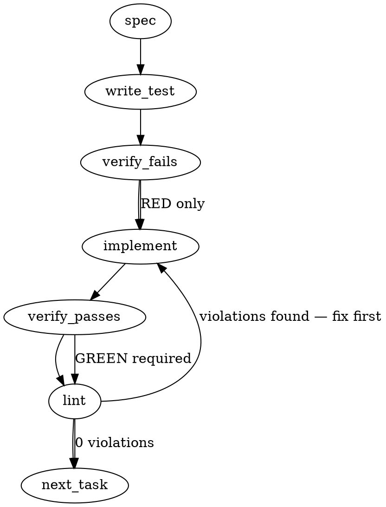

### Problem Statement

The Gemini `SessionStart.js` hook contains CommonJS code but uses a `.js` extension. In ESM consumer repositories (`"type": "module"`), Node.js parses it as ESM and throws an error, causing the Gemini CLI to silently degrade the crash to a warning and skip the session-start briefing. This issue must be fixed by migrating `SessionStart.js` to `SessionStart.cjs`, updating the installation/eject manifests, and introducing a legacy migration path identical to the one implemented for `BeforeTool.cjs` in PR #2485.

### Architectural Context

- **Governing AI Agents > 1. Context Injection (Session Start Hooks):** The `SessionStart` hook is critical as it runs `totem status` (or equivalent session-start briefings) to supply the agent with live project health state before it takes action. Fail-opens must be eliminated so that this context injection is robust.
- **Sibling PR #2485 (BeforeTool fix):** Established the `.cjs` migration machinery. A helper function `migrateLegacyGeminiHooks` in `packages/cli/src/commands/install-hooks.ts` is designed to rename legacy `.js` hooks to `.cjs` seamlessly during installation or hook updates. We must reuse and extend this mechanism for the `SessionStart` hook.

### Files to Examine

1. `packages/cli/src/commands/install-hooks.ts` — The primary location containing the Gemini hooks roster, migration mappings (e.g., `LEGACY_MANAGED_SESSION_HOOKS` or similar legacy hook definitions), and the `migrateLegacyGeminiHooks` function.
2. `packages/cli/src/commands/eject.ts` (or `packages/cli/src/commands/eject-hooks.ts` if split) — Defines the `totem eject` behavior which must handle the new `.cjs` hook extensions.
3. `packages/cli/templates/gemini/hooks/SessionStart.js` — The current hook template source file that needs to be renamed and packaged.
4. `packages/cli/test/commands/install-hooks.test.ts` (or equivalent hook test file) — Location where the hook installation, migration, and ESM-compatibility tests are declared.

### Technical Approach & Contracts

The migration must mirror the pattern established for `BeforeTool.js` -> `BeforeTool.cjs`:

1. **Rename the Template File:**
   - Move `packages/cli/templates/gemini/hooks/SessionStart.js` to `packages/cli/templates/gemini/hooks/SessionStart.cjs`.
   - Ensure the template file retains its CommonJS format (using `require` and `module.exports`).

2. **Update the Active Hook Roster:**
   - Locate the array of active Gemini hooks (typically `MANAGED_GEMINI_HOOKS` or similar inside `packages/cli/src/commands/install-hooks.ts`).
   - Change the roster filename entry from `'SessionStart.js'` to `'SessionStart.cjs'`.

3. **Configure the Migration Path:**
   - In `packages/cli/src/commands/install-hooks.ts`, update `LEGACY_MANAGED_SESSION_HOOKS` (or the equivalent constant managing legacy-to-modern hook renames) to include the pair:
     ```typescript
     { 'SessionStart.js': 'SessionStart.cjs' }
     ```
   - Ensure `migrateLegacyGeminiHooks` processes this map, performing a file rename from `.js` to `.cjs` if the legacy `.js` hook exists in the target repo's `.gemini/hooks/` directory.

4. **Extend the Eject Flow:**
   - Update `totem eject` logic in `packages/cli/src/commands/eject.ts` to ensure that it correctly detaches and cleans up `SessionStart.cjs` (instead of seeking `SessionStart.js`).

### Edge Cases & Traps

- **Dual Hooks Presence:** A user repository might end up with both `SessionStart.js` and `SessionStart.cjs` if a manual intervention occurred or if a previous installation failed. The migration code must gracefully handle this by either removing the legacy `.js` file if `.cjs` is already present, or warning the user instead of throwing an unhandled file-system collision exception.
- **Git Tracking & Permissions:** Changing the template file extension should be done via `git mv` (or matching IDE operations) to preserve git history. Ensure file execution permissions are preserved if the target environment relies on them.
- **Silent Warn Failures:** Since Gemini CLI swallows hook execution failures as warnings, automated tests must explicitly assert hook execution success via synthetic execution tests (e.g., invoking Node on the generated `.cjs` in a `"type": "module"` package context) rather than relying on Gemini CLI's exit codes.

### Implementation Tasks

- [ ] **Task 1: Rename the Template File**
  - Rename `packages/cli/templates/gemini/hooks/SessionStart.js` to `packages/cli/templates/gemini/hooks/SessionStart.cjs` using git rename.
  - Verify that the contents of the file remain intact as a valid CommonJS script.
  - _No test is written yet, as the path references have not changed in code._

- [ ] **Task 2: Update Hook Roster and Register Legacy Migration**
  - Locate the hook registry/roster inside `packages/cli/src/commands/install-hooks.ts`.
  - Update the filename for the `SessionStart` hook from `.js` to `.cjs`.
  - Add the legacy pair mapping (`'SessionStart.js' -> 'SessionStart.cjs'`) to `LEGACY_MANAGED_SESSION_HOOKS` (or its equivalent migration map).
    > TEST DIRECTIVE: Before implementing, write a failing test named `migratesLegacySessionStartJsToCjs` in the hook test suite that mocks a filesystem containing an old `.gemini/hooks/SessionStart.js` file, triggers the hook installer/migration command, and asserts that the `.js` file is renamed to `.cjs` and contains the expected code.
  - Write test → verify fails → implement → verify passes → lint

- [ ] **Task 3: Extend Totem Eject Command**
  - Open `packages/cli/src/commands/eject.ts`.
  - Update the eject logic so that it recognizes and operates on `SessionStart.cjs` instead of the old `SessionStart.js`.
    > TEST DIRECTIVE: Before implementing, write a failing test named `ejectsSessionStartCjsCorrectly` that provisions a workspace with `.gemini/hooks/SessionStart.cjs`, executes `totem eject`, and verifies the file is ejected/unmanaged according to project standard rules.
  - Write test → verify fails → implement → verify passes → lint

- [ ] **Task 4: Add ESM Type-Module Acceptance Tests**
  - Create or update the integration tests in `packages/cli/test/commands/install-hooks.test.ts`.
  - Add an ESM acceptance test that boots a temporary Node project with `"type": "module"` in its `package.json`.
    > TEST DIRECTIVE: Before implementing, write a failing test named `executesSessionStartCjsInTypeModule` that writes the migrated `SessionStart.cjs` into a `"type": "module"` workspace and executes it using Node.js, confirming it evaluates cleanly, while asserting that an identical `.js` block fails to execute as ESM.
  - Write test → verify fails → implement → verify passes → lint

### Execution Flow (structural constraint)



### Verification (MANDATORY — do not skip)

Every implementation MUST end with these steps:

1. `totem lint` — deterministic rule check (zero LLM, ~2s). Fixes any violations.
2. `totem review` — supplementary AI lanes over the diff (~18s, advisory). Address critical findings; your team's review discipline decides the review of record.
3. If using MCP, call `verify_execution` to confirm compliance before declaring the task done.

### Test Plan

- **Migration Test:** Ensure that running the installation flow in a project with a pre-existing `.gemini/hooks/SessionStart.js` successfully renames the file to `.gemini/hooks/SessionStart.cjs` without throwing errors.
- **Eject Test:** Ensure that running `totem eject` cleans up/disconnects `.gemini/hooks/SessionStart.cjs`.
- **ESM Compatibility Test:** Create a mock repository with `"type": "module"` in its `package.json`. Assert that executing the generated `SessionStart.cjs` file directly with Node does not throw an ESM-related error (such as `ReferenceError: require is not defined in ES module scope`). Ensure the test verifies that if the file were named `.js`, it would throw.
