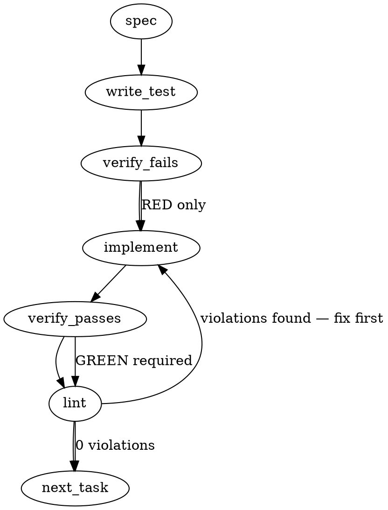

### Problem Statement

The rule engine crashes with a run-wide `TotemParseError` in strict mode when evaluating diffs touching `.mts` files. This occurs because `.mts` and `.cts` are missing from the built-in Tree-sitter AST extension registry, causing `extensionToLanguage('.mts')` to return `undefined` even though the rule glob `fea10369daa04c98` targets them.

### Architectural Context

- **Class 7 Sweep Rule (`fea10369daa04c98`)**: This rule targets `['**/*.ts', '**/*.js', '**/*.mts', '**/*.mjs']`. Because it had partial target matches (3 of 4 resolved), it passed the guard introduced in PR #2512. However, processing a `.mts` file still caused an unhandled crash in the rule execution pipeline.
- **Tree-sitter Language Loader De-duplication**: The registry requires that all extensions mapping to the same language share the exact same language loader instance. Creating separate loader instances for `.mts` or `.cts` triggers registration errors.

### Files to Examine

1. `packages/core/src/ast-classifier.ts` — Defines the built-in extension registry, loader de-duplication logic, and exports `registeredExtensions()` and `extensionToLanguage()`.
2. `packages/core/src/rule-engine.ts` — The evaluation runner containing the per-file parsing loop and strict-mode throwing logic around line 747-779.
3. `packages/cli/src/commands/run-compiled-rules.ts` — Contains the Class 7 guard implementation `assertRulesCanTargetTheirGlobs` and checks glob targets.
4. `packages/core/tests/ast-classifier.test.ts` (or equivalent test file in packages/core) — Unit tests for the AST classifier and registered extensions.
5. `packages/cli/tests/commands/run-compiled-rules.test.ts` (or equivalent) — Test suite containing the partial-permit logic for the Class 7 guard.

### Technical Approach & Contracts

1. **Register `.mts` and `.cts` in `ast-classifier.ts`**:
   - Associate both `.mts` and `.cts` with the TypeScript grammar (matching the existing `.ts`/`.tsx` configurations).
   - Ensure both extensions reuse the exact same loader instance created for `.ts` to comply with the language loader de-duplication rules.
2. **Update Contracts**:
   - `registeredExtensions()` contract: Must return a list containing `.mts` and `.cts` in addition to existing extensions.
   - `extensionToLanguage(ext)` contract:
     - Input: `".mts"` -> Output: `"typescript"` (or equivalent internal language token)
     - Input: `".cts"` -> Output: `"typescript"`
3. **Verify Guard Safety**:
   - Ensure the Class 7 guard `assertRulesCanTargetTheirGlobs` handles the resolved extensions cleanly.
   - Review any tests for the Class 7 guard that assert partial-match behavior (e.g., "one-resolvable-among-unresolvable") to ensure they use a truly unregistered dummy extension (like `.unresolvable` or `.xyz`) rather than `.mts` or `.cts`.

### Edge Cases & Traps

- **Shared Language Loader Reference**:
  If a new instance of the TypeScript loader is instantiated for `.mts`/`.cts`, a runtime registry error will be thrown: `"language already registered with a different loader"`. Reuse the exact same loader reference used for `.ts`.
- **Class 7 Guard False Positives/Negatives**:
  If a test for the Class 7 guard relied on `.mts` as an example of an unresolvable extension, registering it will cause that test to fail because `.mts` is now resolvable. Those tests must be refactored to use a non-existent extension.
- **Diff Resolution and Parser Selection**:
  Confirm that Tree-sitter successfully parses TypeScript module syntax (`.mts`) and TypeScript CommonJS syntax (`.cts`) with the standard TypeScript grammar.

### Implementation Tasks

- [ ] **Task 1: Update Class 7 Guard Tests to Use Dummy Extensions**
  - Locate test files validating the Class 7 partial target-mismatch guard (likely in `packages/cli/tests/commands/run-compiled-rules.test.ts` or similar command test files).
  - Inspect tests verifying "one-resolvable-among-unresolvable" behavior. If any tests use `.mts` or `.cts` as the unresolvable extension, replace them with a dummy extension (e.g., `.unresolvable-ext`).
  - Run the CLI command/guard tests to verify they still pass with dummy extensions.
  - write test (or update existing) → verify fails → implement → verify passes → lint

- [ ] **Task 2: Register .mts and .cts in the AST Classifier**
  - Open `packages/core/src/ast-classifier.ts`.
  - Locate the `registerBuiltinLanguages` function and the loader mapping registry.
  - > TOTEM INVARIANT (Shared Language Loader): When multiple extensions map to the same language, they MUST share the same loader instance so the "language already registered with a different loader" error does not occur.
  - Add `.mts` and `.cts` mappings to the registry, pointing them to the same TypeScript loader instance used for `.ts`.
  - > TEST DIRECTIVE: Before implementing, write a failing test named `resolvesMtsAndCtsToTypeScript` in the AST classifier test suite that asserts `extensionToLanguage('.mts')` and `extensionToLanguage('.cts')` return the TypeScript language/loader reference and are included in `registeredExtensions()`.
  - write test (or update existing) → verify fails → implement → verify passes → lint

- [ ] **Task 3: Add Integration Test for Rule Execution on .mts Diffs**
  - Open the rule engine or integration test suite (e.g., `packages/core/tests/rule-engine.test.ts` or `packages/cli/tests/run-compiled-rules.test.ts`).
  - > TEST DIRECTIVE: Before implementing, write a failing test named `executesRulesAgainstMtsDiffFiles` that processes a mock diff containing a `.mts` file change under strict mode with an AST-grep rule targeting `**/*.mts`. It must prove that it completes execution successfully instead of throwing a `TotemParseError`.
  - Execute tests to verify the regression is caught, then confirm it passes now that `.mts` and `.cts` are registered.
  - write test (or update existing) → verify fails → implement → verify passes → lint

### Execution Flow (structural constraint)

### Verification (MANDATORY — do not skip)

Every implementation MUST end with these steps:

1. `totem lint` — deterministic rule check (zero LLM, ~2s). Fixes any violations.
2. `totem review` — AI-powered architectural review (~18s). Addresses any critical findings.
3. If using MCP, call `verify_execution` to confirm compliance before declaring the task done.

### Test Plan

- **Unit Tests (`packages/core/tests/ast-classifier.test.ts`)**:
  - Assert `registeredExtensions()` includes `.mts` and `.cts`.
  - Assert `extensionToLanguage('.mts')` returns the correct TypeScript language loader.
  - Assert `extensionToLanguage('.cts')` returns the correct TypeScript language loader.
  - Assert that loader registration does not throw duplicate registry errors.
- **Guard Tests (`packages/cli/tests/commands/run-compiled-rules.test.ts`)**:
  - Assert that the Class 7 guard permits partial mismatches when at least one positive glob is valid.
  - Assert that a rule matching only unregistered extensions (e.g., `.xyz`) continues to be blocked by the Class 7 guard.
- **Integration Tests (`packages/core/tests/rule-engine.test.ts`)**:
  - Execute a simulated run with a diff containing `.mts` and `.cts` files against a rule like `fea10369daa04c98` under strict mode. Verify that files are parsed successfully and no `TotemParseError` is thrown.
