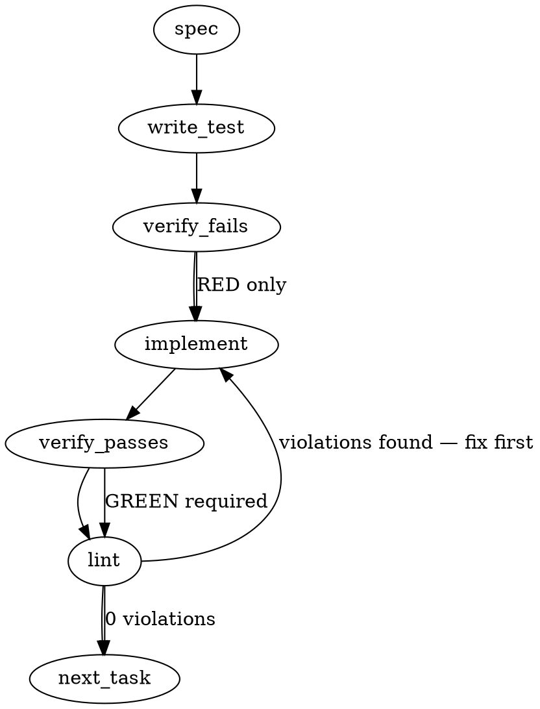

### Problem Statement

The codebase contains hand-maintained lists of file extensions in `shield-classify.ts` and `drift-detector.ts` that include `.mjs`/`.cjs` but omit `.mts`/`.cts`. This causes shield to classify `.mts`/`.cts` changes as `NON_CODE` (triggering classification-gated bypasses) and prevents drift detection from monitoring orphaned references in `.mts`/`.cts` files.

> **Premise correction (verified at HEAD `ba1f3eb4`, 2026-07-31 — supersedes the paragraph above and the issue's Specimen 1 consequence claim).** `classifyFile` fail-closes _unknown_ extensions to `CODE` (`shield-classify.ts` step 4), so a `.mts`/`.cts`-only diff already classifies `allNonCode: false` today — no classification-gated bypass exists. The shield half of this fix is explicit-registration hardening (protects against any future change to the fail-closed default; makes membership intent inspectable), not a behavior change. The drift-detector half is a real behavior fix: `extractRefs` drops candidates whose extension is not in `FILE_EXTENSIONS` (`drift-detector.ts:193`), so `.mts`/`.cts` lesson references are invisible to drift detection at HEAD.

### Architectural Context

This issue addresses the same class of extension registration gaps resolved in PR #2517 (Issue #2513), which registered `.mts`/`.cts` in the central AST extension registry. This task standardizes support across downstream tooling (CLI shield classifier and Core drift detector) to prevent fractured language governance.

### Files to Examine

- `packages/cli/src/commands/shield-classify.ts` — Contains the `CODE_EXTENSIONS` set/array missing `.mts` and `.cts`.
- `packages/core/src/drift-detector.ts` — Contains the `FILE_EXTENSIONS` list/set missing `.mts` and `.cts`.
- `packages/cli/test/shield-classify.test.ts` (or `packages/cli/src/commands/shield-classify.test.ts` / adjacent test file) — Location to add classification regression tests.
- `packages/core/test/drift-detector.test.ts` (or `packages/core/src/drift-detector.test.ts` / adjacent test file) — Location to add drift detection validation tests.

### Technical Approach & Contracts

We will update the static extension collections in the core and CLI packages to explicitly support `.mts` and `.cts` files.

#### 1. Shield Classification Updates

In `packages/cli/src/commands/shield-classify.ts`:

```typescript
// Existing
const CODE_EXTENSIONS = new Set(['.ts', '.tsx', '.js', '.jsx', '.mjs', '.cjs', ...]);

// Proposed
const CODE_EXTENSIONS = new Set(['.ts', '.tsx', '.js', '.jsx', '.mjs', '.cjs', '.mts', '.cts', ...]);
```

- **Trade-off:** Adding `.mts`/`.cts` increases the `CODE` classification footprint. This is the desired behavior, as these files contain compile-ready TypeScript/ESM/CJS code and must never bypass change classifications.

#### 2. Drift Detection Updates

In `packages/core/src/drift-detector.ts`:

```typescript
// Existing
const FILE_EXTENSIONS = ['.js', '.mjs', '.cjs', '.ts', ...];

// Proposed
const FILE_EXTENSIONS = ['.js', '.mjs', '.cjs', '.ts', '.mts', '.cts', ...];
```

- **Trade-off:** Minimal overhead in scanning. Ensuring references inside or pointing to `.mts`/`.cts` files are tracked prevents silent reference breaks.

#### 3. Verification Scan

Perform a programmatic grep across the codebase to ensure no other occurrences of the six-extension literal pattern (`.js`, `.jsx`, `.ts`, `.tsx`, `.mjs`, `.cjs`) remain unmapped.

---

### Edge Cases & Traps

- **Case-Sensitivity:** File systems or manual checks might present extensions in uppercase (e.g., `.MTS`). The target files must sanitize extensions via `.toLowerCase()` (using `path.extname(file).toLowerCase()`) before evaluating membership against sets. Ensure existing normalizations are not broken.
- **Exact Matches:** Ensure compound extensions (e.g., `.d.mts` or `.d.cts`) do not break classification logic. They must be treated correctly as code files.
- **Unintended fallbacks:** Verify that `.mts`/`.cts` files do not fall back to standard non-code diff rules.

---

### Implementation Tasks

- [ ] **Task 1: Search for other omitted `.mts`/`.cts` occurrences**
  - Run a codebase-wide search for patterns matching `mjs` or `cjs` to identify any other hand-maintained extension registries.
  - Exclude the pre-cleared paths: `compile-smoke-gate.ts` and `repo-sweep.test.ts`.
  - Fix any additional occurrences discovered during this scan under the same pattern.
  - _No test changes required for this discovery step._

- [ ] **Task 2: Fix and Test CLI Shield Classification**
  - Files to modify: `packages/cli/src/commands/shield-classify.ts`
  - Files to update: `packages/cli/test/shield-classify.test.ts` (or equivalent test path)
    > TEST DIRECTIVE: Before implementing, write a failing test named `classifies .mts and .cts files as CODE` that asserts `allNonCode` is `false` when the diff contains only `.mts` or `.cts` files.
  - Step-by-step:
    1. Write the failing test in the CLI test suite.
    2. Run the test to verify it fails (`allNonCode` returns `true`).
    3. Add `.mts` and `.cts` to `CODE_EXTENSIONS` in `shield-classify.ts`.
    4. Run the test and verify it passes.
    5. Run `totem lint` and fix any formatting/lint issues.

- [ ] **Task 3: Fix and Test Core Drift Detection**
  - Files to modify: `packages/core/src/drift-detector.ts`
  - Files to update: `packages/core/test/drift-detector.test.ts` (or equivalent test path)
    > TEST DIRECTIVE: Before implementing, write a failing test named `detects orphaned references in .mts and .cts files` that registers a lesson with references targeting a `.mts` or `.cts` path and asserts it is correctly validated or flagged as drift-eligible.
  - Step-by-step:
    1. Write the failing test in the Core test suite.
    2. Run the test to verify it fails (the drift detector ignores `.mts`/`.cts` targets or bypasses verification).
    3. Add `.mts` and `.cts` to `FILE_EXTENSIONS` in `drift-detector.ts`.
    4. Run the test and verify it passes.
    5. Run `totem lint` and fix any formatting/lint issues.

### Execution Flow (structural constraint)



### Verification (MANDATORY — do not skip)

Every implementation MUST end with these steps:

1. `totem lint` — deterministic rule check (zero LLM, ~2s). Fixes any violations.
2. `totem review` — AI-powered architectural review (~18s). Addresses any critical findings.
3. If using MCP, call `verify_execution` to confirm compliance before declaring the task done.

---

### Test Plan

- **Shield Classifier Tests:**
  - Mock a git diff containing only `index.mts`. Verify that `classifyFile` or the overall classification pipeline resolves to `allNonCode: false`.
  - Mock a git diff containing only `config.cts`. Verify that the classification resolves to `allNonCode: false`.
  - Verify that a non-code file (e.g., `README.md`) mixed with `.mts` still correctly classifies as code.
- **Drift Detector Tests:**
  - Create a test reference map indicating a lesson points to `src/index.mts`.
  - Verify that when `src/index.mts` is missing, the drift detector returns an `orphanedRefs` entry containing that file path.
  - Verify that when `src/index.mts` is present, the drift detector marks it as resolved/valid.
