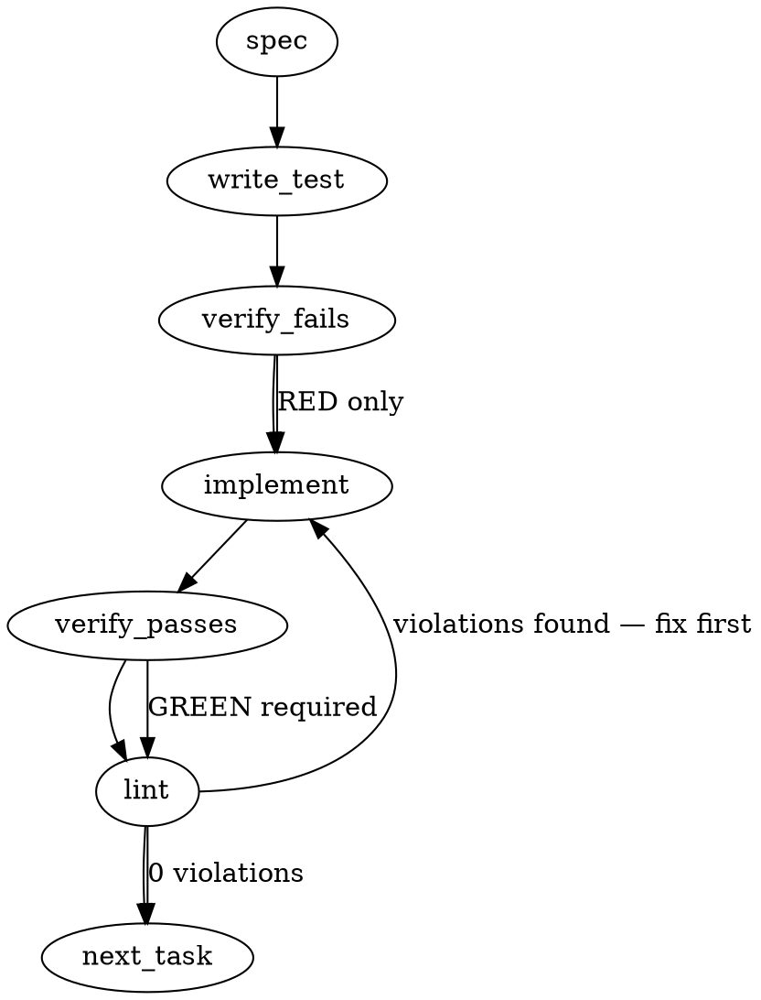

### Problem Statement

A `totem sync --full` run that crashes mid-embedding (e.g., due to a 429 Gemini quota limit) leaves the vector database partially populated but preserves the original `lastSyncSha` in the sync state. Consequently, the next plain `totem sync` run falsely reports complete status without resuming or repairing the depleted vector database, while 429 error messages prescribe incorrect manual recovery procedures and lack throttling controls.

### Architectural Context

- **Sync State & Pipeline Orchestration:** Defined in `packages/core/src/ingest/pipeline.ts`.
- **Gemini Provider Client & Retries:** Defined in `packages/core/src/embedders/gemini-embedder.ts`.
- **Configuration Schema:** Localized to configuration validation definitions.
- **Relevant Lessons / Invariants:**
  - Avoid raw file reads for JSON config structures: Always use `@mmnto/totem` shared helper `readJsonSafe` to maintain platform-agnostic schema validation.
  - DB states must never drift from metadata declarations: A vector store reset must always occur in atomicity with its metadata dirty flags to avoid silent data degradation (Prop 309).

### Files to Examine

1. `packages/core/src/ingest/pipeline.ts` — Core sync orchestration logic, store reset calls, file-by-file iteration, and state persistence.
2. `packages/core/src/embedders/gemini-embedder.ts` — Embedding generation client, retry handler, backoff logic, and exception translator.
3. `packages/core/src/types.ts` (or equivalent config schema file) — Location of `TotemConfig` configuration definitions to define throttling specifications.

### Technical Approach & Contracts

#### 1. Define State Contract (`packages/core/src/ingest/pipeline.ts`)

Add dirty watermarking and checkpoint tracker fields to the internal sync state contract.

```typescript
import { z } from 'zod';

export const SyncStateSchema = z.object({
  lastSyncSha: z.string().optional(),
  fullSyncInProgress: z.boolean().optional(),
  checkpointFiles: z.array(z.string()).optional(),
});

export type SyncState = z.infer<typeof SyncStateSchema>;
```

#### 2. Sequence Logic for Watermark and Resume (`packages/core/src/ingest/pipeline.ts`)

Modify `runSyncInner` to execute the following sequence:

```
                  ┌──────────────────────┐
                  │   Start Sync Run     │
                  └──────────┬───────────┘
                             │
              Is state.fullSyncInProgress true?
              ┌──────────────┴──────────────┐
              │                             │
             YES                           NO
              │                             │
    ┌─────────▼─────────┐         Is this a --full run?
    │ Skip store.reset()│         ┌─────────┴─────────┐
    │ Load checkpoints  │         │                   │
    └─────────┬─────────┘        YES                 NO
              │                   │                   │
              │         ┌─────────▼─────────┐   ┌─────▼─────────────┐
              │         │ Set dirty flag    │   │ Execute standard  │
              │         │ store.reset()     │   │ incremental path  │
              │         └─────────┬─────────┘   └───────────────────┘
              │                   │
              └─────────┬─────────┘
                        ▼
            ┌───────────────────────┐
            │ Loop Files to Embed   │◄─────── Skip any file in checkpointFiles
            │                       │
            │   * Embed File Chunks │
            │   * Flush Chunks      │
            │   * Add to checkpoints│
            │   * Save Sync State   │
            └───────────┬───────────┘
                        ▼
            ┌───────────────────────┐
            │ Clear dirty flag      │
            │ Set lastSyncSha       │
            │ Save Sync State       │
            └───────────────────────┘
```

#### 3. Throttle and Pacing Configuration Schema

Extend the core configuration schema to accept client-side pacing knobs:

```typescript
export const EmbeddingConfigSchema = z.object({
  provider: z.enum(['gemini', 'openai', 'ollama']),
  model: z.string(),
  throttleMs: z.number().optional().default(0), // Delay between batched embedding requests
  maxRetries: z.number().optional().default(3),
});
```

#### 4. Retry & Throttle Execution (`packages/core/src/embedders/gemini-embedder.ts`)

- Intercept `RESOURCE_EXHAUSTED` (429) errors.
- Extract standard retry headers (e.g., `retry-after`) or fallback to exponential pacing configured via `throttleMs`.
- Wrap terminal 429 failures in a descriptive `TotemError` featuring clear, actionable recovery messages:
  ```
  Quota limit exceeded (RESOURCE_EXHAUSTED).
  To recover, run 'totem sync' which will automatically resume from the last completed file.
  To prevent this, configure 'embedding.throttleMs' in your configuration to pace requests.
  ```

---

### Edge Cases & Traps

- **State File Corruption on Mid-Write Crash:** If the system crashes precisely when writing `.totem/sync-state.json`, the JSON file could become malformed. Use atomic write patterns (write to a temporary file, then rename/move) or wrap the state-file read logic in a try-catch that discards corrupt files and initiates a fresh complete rebuild.
- **Filesystem Mismatches Post-Crash:** If files are deleted or modified _after_ a crash but _before_ the resume execution, the checkpointed list might refer to defunct references. Ensure the file filter step reconciles existing workspace files against the checkpoint array.
- **Chunk Boundary Offsets:** Watermarks must be recorded **per-file** and only written to state _after_ the respective chunks have been successfully flushed to the vector database. Never write a checkpoint for a file whose embeddings are still resident in a memory buffer.

---

### Implementation Tasks

- [ ] **Task 1: Define Schemas & State Interfaces**
  - Update state schemas and core configuration structures to support `fullSyncInProgress`, `checkpointFiles`, and `embedding.throttleMs`.
  - Define configuration validator extensions.
    > TEST DIRECTIVE: Before implementing, write a failing test named `shouldRejectInvalidSyncStateSchema` that asserts parsing fails for state structures missing structural conformity.
  - Write test -> verify fails -> implement -> verify passes -> lint

- [ ] **Task 2: Implement Watermarking and Invalidation in Pipeline**
  - Modify `packages/core/src/ingest/pipeline.ts` to flag `fullSyncInProgress: true` and empty `checkpointFiles` immediately before resetting the store.
  - Ensure the dirty state is persisted to the file system using the shared helper `readJsonSafe` for reading the existing state.
    > TOTEM INVARIANT (State Isolation): Never read state files via raw FS calls; use safely typed wrappers to avoid drift.
    > TEST DIRECTIVE: Before implementing, write a failing test named `shouldSetDirtyFlagAndEmptyCheckpointsBeforeStoreReset` that asserts the state file becomes dirty before the vector store reset is triggered.
  - Write test -> verify fails -> implement -> verify passes -> lint

- [ ] **Task 3: Integrate Checkpoint Verification and Resume Flow**
  - Update the synchronization step in `packages/core/src/ingest/pipeline.ts` to detect existing `fullSyncInProgress` markers on startup.
  - If the marker exists, bypass `store.reset()`, load existing checkpoints, and filter out checkpointed files from processing queue.
  - Update checkpoints state after each batch file flush. Remove markers on total completion.
    > TEST DIRECTIVE: Before implementing, write a failing test named `shouldSkipAlreadyCheckpointedFilesOnResume` that verifies a secondary execution resumes from the exact file boundary recorded in state.
  - Write test -> verify fails -> implement -> verify passes -> lint

- [ ] **Task 4: Add Pacing Control in Gemini Embedder**
  - Update `packages/core/src/embedders/gemini-embedder.ts` to respect client-side pacing config `throttleMs` via a sleep/pacing utility before firing API calls.
    > TEST DIRECTIVE: Before implementing, write a failing test named `shouldEnforcePacingDelayBetweenBatches` that asserts execution times match the configured pacing delay.
  - Write test -> verify fails -> implement -> verify passes -> lint

- [ ] **Task 5: Refine 429 Error Interception & Recovery Hint**
  - Catch terminal Gemini rate-limit exceptions in the client class.
  - Translate these errors into descriptive hints highlighting the exact resume sequence and pacing settings.
    > TEST DIRECTIVE: Before implementing, write a failing test named `shouldProduceDetailedQuotaExceededHintOn429` that validates the presence of the correct resume instructions in the thrown error text.
  - Write test -> verify fails -> implement -> verify passes -> lint

---

### Execution Flow



---

### Verification (MANDATORY — do not skip)

Every implementation MUST end with these steps:

1. `totem lint` — deterministic rule check (zero LLM, ~2s). Fix any violations.
2. `totem review` — supplementary AI lanes over the diff (~18s, advisory). Address critical findings; your team's review discipline decides the review of record.
3. If using MCP, call `verify_execution` to confirm compliance before declaring the task done.

---

### Test Plan

#### Integration / Flow Tests

- **Interrupted Full-Sync Recovery:**
  1. Trigger a full sync pipeline with a mocked embedder that throws an exception halfway.
  2. Verify the state file retains `fullSyncInProgress: true` and matches successfully processed checkpoints.
  3. Run the sync process again (without a `--full` flag) and ensure it bypasses database initialization and executes from the first unprocessed file.
- **Clean Run Convergence:**
  1. Complete a sync run and verify `fullSyncInProgress` is deleted and `lastSyncSha` corresponds to the accurate repository state.

#### Unit / Isolated Tests

- **Config Parsing:** Verify `embedding.throttleMs` parses correctly with fallback values.
- **Pacing Checks:** Mock sleep timings to ensure embedding queries respect millisecond configurations.
- **Error Translators:** Confirm 429 errors emit instructions targeting auto-resume features.

---

## Implementation Design

(Hand-authored after code-grounding at `e0362125`; the generated sections above are advisory — where they conflict with this section, this section rules.)

### Scope

Make a crashed `totem sync --full` leave a _detectable, resumable_ state instead of a lying one: dirty marker + per-file checkpoint written around `store.reset()`, resume on the next sync (plain or `--full`), a client-side `embedding.throttleMs` pacing knob, and a quota-specific 429 hint. Explicitly NOT in scope: migrating to a batch-embedding API, GCP quota tooling, changes to incremental diff semantics, `lesson extract` non-determinism (#2563), and any new retry architecture beyond honoring server retry delays inside the existing retry budget.

### Data model deltas

- **New persisted file `.totem/cache/full-sync-checkpoint.json`** (NOT an extension of `sync-state.json` — that file's semantics stay "last _successful_ sync baseline"; existence of the checkpoint file IS the dirty marker, so no reserved keys / sentinel values in existing state):
  - `startedHeadSha: string | null` — HEAD at epoch start; read by resume to re-diff files changed since (they leave the completed set).
  - `startedAt: number`, `indexExclusionHash: string` — provenance + reconciliation parity with sync state.
  - `embedder: { provider, model, dimensions }` — resume-compatibility fingerprint; mismatch ⇒ restart from zero (never mix vector spaces).
  - `completedFiles: string[]` — relative paths appended ONLY after their chunks' flush succeeded (flushes happen at whole-file boundaries: chunks are pushed per-file before the batch-size check, and `LanceStore.insert` embeds before any row is added, so a failed flush inserts nothing). Written by the full-sync loop, read by resume. Bounded by corpus file count.
- **New config field `throttleMs`** on the embedding provider schemas (zod, optional, default 0 = off): minimum interval between successive embedding API calls. Honored by gemini + openai embedders (the two remote loops); ollama is local and exempt — docs state exactly this.
- No new module-level state containers; checkpoint I/O is function-local per run and all state file writes (checkpoint AND `sync-state.json`) become atomic tmp+rename, matching the existing index-manifest pattern.

### State lifecycle

- **Checkpoint file** — scope: persistent (crash-surviving is the point). Created (atomically) _before_ `store.reset()` — a marker-write failure aborts the run loudly with the store intact; there is no window where reset happened unmarked. Mutated (appended) after each successful flush. Deleted only on successful completion of the full sync, in the same step that writes the fresh `sync-state.json`. Ownership: the full-sync path in `runSyncInner` (both the `--full` branch and the existing "git diff failed → full fallback" branch route through one shared `beginFullSync()` helper).
- **Resume detection happens BEFORE the incremental/full branch:** if the checkpoint file exists, force full-resume mode regardless of flags — this precedes (and subsumes) the empty-store auto-heal. `completedFiles` is filtered on load: intersect with the live resolved file set, minus files changed since `startedHeadSha` (changed files get `deleteByFile` + re-embed; deleted files' stale chunks are left to the standard orphan reconciliation on the next incremental — documented residue, not silent).
- **Torn checkpoint** (crash mid-update, despite tmp+rename this covers manual corruption too): parse failure ⇒ treat as "dirty, checkpoint unusable" ⇒ loud log + restart full from zero. Never treated as clean.

### Failure modes

| Failure                                 | Category  | Agent-facing surface                           | Recovery                                                                                            |
| --------------------------------------- | --------- | ---------------------------------------------- | --------------------------------------------------------------------------------------------------- |
| Marker write fails before reset         | init      | hard error (sync aborts, store untouched)      | fix FS issue, re-run                                                                                |
| 429/crash mid-embed during full         | transient | hard error + quota-specific hint naming resume | next `totem sync` resumes from checkpoint                                                           |
| Crash after reset, before any flush     | transient | hard error                                     | checkpoint exists with empty `completedFiles` → resume ≡ full restart, still correct                |
| Checkpoint unparseable at resume        | runtime   | loud warning, restart full from zero           | progress lost, correctness kept                                                                     |
| Embedder fingerprint mismatch at resume | init      | loud log, restart full from zero               | correct-by-construction (no mixed vector spaces)                                                    |
| Files changed between crash and resume  | runtime   | loud log of re-queued count                    | re-diffed vs `startedHeadSha`, re-embedded                                                          |
| Files deleted between crash and resume  | runtime   | none this run                                  | stale chunks purged by next incremental's orphan reconciliation (existing mechanism; noted in docs) |
| Checkpoint-append fails after a flush   | runtime   | loud warning, sync continues                   | worst case: that file re-embeds on resume (idempotent via `deleteByFile`-first on resume)           |
| throttleMs misconfigured (negative/NaN) | init      | zod config error                               | fix config                                                                                          |

No silent-degradation rows — the defect being fixed IS a silent-degradation row (Tenet 4); the design's invariant is that every abnormal path either aborts loudly or logs the degradation it accepts.

### Invariants to lock in via tests (ADR-115 Train-1: induced-regression, judged from test artifacts)

- **The lying-sensor regression:** full sync crashed at file N (mock embedder throws) ⇒ the next PLAIN `totem sync` does NOT report complete-with-0-files; it resumes and finishes the corpus, and only then writes `sync-state.json`.
- A file appears in `completedFiles` only if all its chunks were flushed to the store (assert via mock-store insert record vs checkpoint contents at crash time).
- The dirty marker exists at every instant between `store.reset()` and successful completion (assert marker present when the mock embedder observes its first call).
- Resume never re-embeds a checkpointed unchanged file (mock embedder call counts) and always re-embeds a file changed since `startedHeadSha`.
- Successful completion leaves NO checkpoint file and a `sync-state.json` whose `lastSyncSha` is the run's captured HEAD.
- Fingerprint mismatch at resume restarts from zero (mock embedder sees the full corpus again).
- `throttleMs > 0` enforces a minimum inter-call gap (fake timers); `throttleMs` absent ⇒ zero added latency.
- Terminal 429 error text names the resume behavior and the throttle knob; non-quota terminal errors keep the existing hint.

### Open questions

- **Question:** Should `totem sync --full` with a live checkpoint RESUME (skip completed files) rather than restart from zero?
  - **Options:** (a) resume, log `resuming full re-index (N/M files done); delete .totem/cache/full-sync-checkpoint.json to restart from scratch`; (b) always restart on explicit `--full` (quota-bounded consumers then still cannot converge by retrying the documented command); (c) new `--restart` flag (scope creep).
  - **Recommendation:** (a) — convergence under quota is the ruled requirement; the loud log preserves an escape hatch without new surface.
- **Question:** Throttle knob shape?
  - **Options:** `throttleMs` (simple minimum-interval, maps to RPM as 60000/x) vs `requestsPerMinute` (semantic but needs a token bucket and is ambiguous across batch sizes).
  - **Recommendation:** `throttleMs`, default 0; documented on gemini + openai only.
- **Question:** Honor server-provided retry delay (google.rpc.RetryInfo) on 429 inside the existing `MAX_RETRIES = 3` budget, capped at 60s per wait?
  - **Recommendation:** yes — it is the difference between the retry budget being real vs. decorative against a per-minute quota; cap keeps worst-case wall-clock bounded (~3min).
