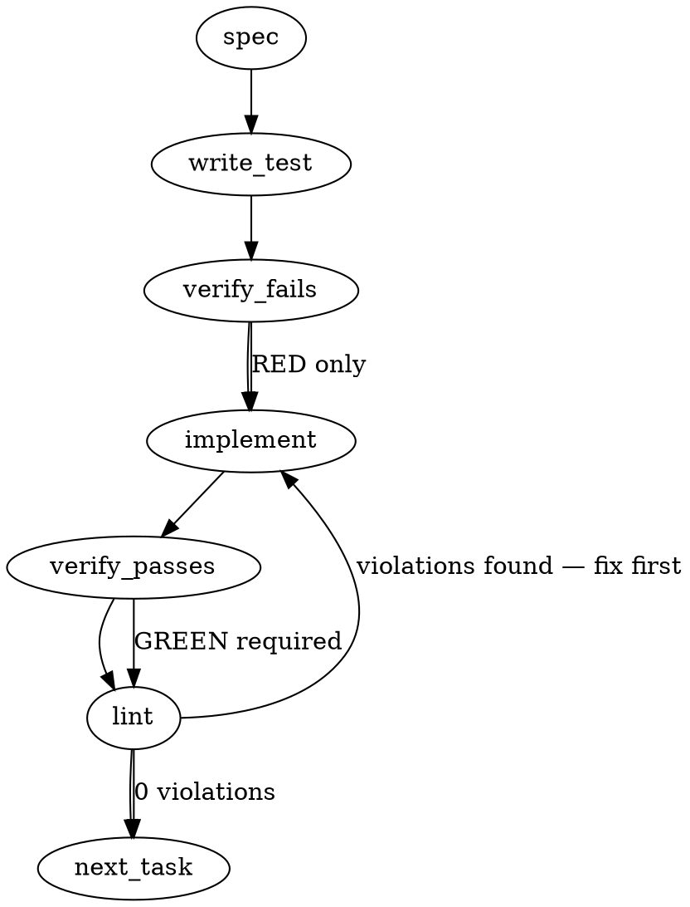

### Problem Statement

The current lock mechanism in `packages/core/src/lock.ts` uses a static 120-second stale threshold without active heartbeats, making the lock vulnerable to theft during long-running sync operations with active pacing/throttling. When a lock is stolen, concurrent processes run syncs in parallel, leading to semantic races that corrupt checkpoint invariants.

### Architectural Context

- **Falsification Round 1 (Minor 6):** Leveraged PID-unique temporary file writes (via `writeJsonAtomic` in `packages/core/src/ingest/pipeline.ts`) to avoid concurrent processes corrupting the checkpoint JSON mid-write. However, this did not solve the semantic race conditions where one process drops rows under another's epoch.
- **Rule of Lock Mutual Exclusion:** The checkpointing invariant in `#2562` depends absolutely on strict mutual exclusion. Therefore, the lock must never be stolen while the holder process is still alive.

### Files to Examine

1. `packages/core/src/lock.ts` — Contains the lock acquisition, staleness validation, and lock file reading/writing logic.
2. `packages/core/src/ingest/pipeline.ts` — Contains the sync pipeline executions where the lock is acquired, held across long asynchronous throttles/waits, and released.

### Technical Approach & Contracts

#### 1. Holder Identity & Liveness Check

Instead of relying solely on a fixed elapsed time to determine if a lock is dead, we will combine process ID (PID) liveness with a periodic lock heartbeat.

- When evaluating a pre-existing lock, we inspect its PID.
- If the PID belongs to an active process on the system, we treat the lock as **active and unstealable**, regardless of the timestamp.
- If the PID does not exist (meaning the holding process crashed or exited), we can safely clean and reclaim the lock **immediately**, bypassing the stale threshold wait.

#### 2. Atomic Heartbeat Mechanism

To prevent false-positive lockouts on systems where PID reuse might occur or in multi-environment setups, the holding process will actively heartbeat (refresh) the lock's timestamp.

- Upon successful lock acquisition, a background `setInterval` is initiated.
- The interval runs every `30` seconds, writing an updated timestamp to the lock file.
- The timer handle is unref'd (`timer.unref()`) so it does not block the Node.js event loop from exiting if the program terminates or completes without explicit release.
- The returned `release` function is updated to clear the interval securely.

#### 3. Increased Default Threshold

The stale threshold will be increased from 120 seconds to 300 seconds (5 minutes) as a defensive fallback for systems where PID checks cannot be fully verified.

#### Lock Contract Schema (Zod)

```typescript
import { z } from 'zod';

export const LockDataSchema = z.object({
  pid: z.number().int().positive(),
  timestamp: z.number().int().positive(), // Updated via heartbeats
  createdAt: z.number().int().positive(), // Original acquisition time
  holderId: z.string().uuid(), // Unique identifier for the run
});

type LockData = z.infer<typeof LockDataSchema>;
```

---

### Edge Cases & Traps

1. **Unreleased Heartbeat Timer Keeping Node Alive:**
   If the heartbeat timer is not `.unref()`'d, any unhandled exception that bypasses the `release()` block will leave the interval active, hanging the CLI process indefinitely.
   _Remedy:_ Always invoke `heartbeatInterval.unref()` immediately upon creation.

2. **PID Reuse/Recycling:**
   On extremely busy or long-running servers, PIDs can recycle. If a process crash occurs and another process gets assigned the same PID, the lock could become permanently unstealable.
   _Remedy:_ Enforce a maximum hard lifetime limit (e.g., 1 hour) where even if the PID is alive, if the timestamp is extremely old and has not drifted in a long time, the lock can be reclaimed.

3. **Heartbeat Write Failures:**
   If the disk runs out of space or encounters permissions issues mid-sync, the heartbeat write might throw an unhandled promise rejection.
   _Remedy:_ Wrap the heartbeat write in a `try/catch` block that logs a warning to `onWarn` but does not crash the main thread.

---

### Implementation Tasks

- [ ] **Task 1: Implement PID Liveness Checker**
  - Create a robust, cross-platform helper function `isPidAlive(pid: number): boolean` in `packages/core/src/lock.ts`.
  - The helper must use `process.kill(pid, 0)` and handle `ESRCH` (dead process) and `EPERM` (alive, but no permissions to signal) correctly.
  - > TEST DIRECTIVE: Before implementing, write a failing test named `detectsActiveAndDeadProcesses` in `packages/core/tests/lock.test.ts` to prove `isPidAlive` returns true for `process.pid` and false for invalid PIDs.
  - Write test -> verify fails -> implement -> verify passes -> lint.

- [ ] **Task 2: Define Zod Contract and Raise Staleness Thresholds**
  - Define `LockDataSchema` using Zod and export it from `packages/core/src/lock.ts`.
  - Update `readLock` to validate the JSON against `LockDataSchema` using `readJsonSafe` from `@mmnto/totem`.
  - Increase `STALE_THRESHOLD_MS` to `300_000` (5 minutes).
  - > TEST DIRECTIVE: Before implementing, write a failing test named `rejectsCorruptLockContracts` verifying that corrupted or outdated lock schemas are cleanly ignored/cleaned.
  - Write test -> verify fails -> implement -> verify passes -> lint.

- [ ] **Task 3: Integrate Background Heartbeat Renewal**
  - Modify `acquireLock` to spin up a background heartbeat interval using `setInterval` every 30 seconds.
  - Ensure the interval updates the lock's `timestamp` to `Date.now()`.
  - Call `.unref()` on the interval handle immediately.
  - Update the returned release function to execute `clearInterval` before deleting the lock file.
  - Wrap the heartbeat write in a `try/catch` block to handle disk errors without crashing the process.
  - > TEST DIRECTIVE: Before implementing, write a failing test named `heartbeatRefreshesLockFileTimestamp` that uses mock timers or short intervals to prove that the lock's timestamp updates automatically while held.
  - Write test -> verify fails -> implement -> verify passes -> lint.

- [ ] **Task 4: Refactor Lock Acquisition & Stealing Logic**
  - Update the acquisition loop in `acquireLock`:
    - If a lock exists, parse it.
    - If the parsed PID is dead (`isPidAlive` returns false), allow immediate reclamation/deletion of the lock file.
    - If the parsed PID is alive, refuse to steal the lock unless the timestamp is older than `MAX_HARD_STALE_LIMIT_MS` (e.g., 1 hour) to handle PID collision edges.
  - > TEST DIRECTIVE: Before implementing, write a failing test named `refusesToStealLockHeldByActiveProcess` that asserts a new process cannot acquire the lock if the existing lock file contains an active PID, even if the timestamp is older than 5 minutes.
  - Write test -> verify fails -> implement -> verify passes -> lint.

---

### Execution Flow



---

### Verification

Every implementation MUST end with these steps:

1. `totem lint` — deterministic rule check (zero LLM, ~2s). Fixes any violations.
2. `totem review` — supplementary AI lanes over the diff (~18s, advisory). Address critical findings; your team's review discipline decides the review of record.
3. If using MCP, call `verify_execution` to confirm compliance before declaring the task done.

---

### Test Plan

#### Unit Tests (`packages/core/tests/lock.test.ts`)

1. **Liveness Verification:** Check that `isPidAlive` detects `process.pid` as active, and random high integers (e.g., `999999`) as dead.
2. **Schema Compliance:** Assert that write-actions conform strictly to `LockDataSchema`.
3. **Heartbeat Lifecycle:** Assert that:
   - A lock update happens periodically on the interval.
   - Releasing the lock stops the heartbeat.
   - Standard execution exits normally (ensured by `.unref()`).
4. **Mutual Exclusion Defense:** Assert that another process trying to acquire a lock held by a live PID is blocked, even if the timestamp has aged past the default 5-minute threshold.
5. **Auto-Clean of Abandoned Locks:** Assert that if a lock file exists but the PID is dead, a subsequent `acquireLock` call reclaims it immediately without waiting for a timeout.

---

## Implementation Design

> Supersedes the generated sections above where they conflict. Three generated-spec elements are DECLINED with reasons: (1) "live PID = unstealable" — recreates the lesson-5b1929d1 trap (a container's PID 1 always appears alive from the host; PID-alive must never veto staleness); (2) Task 1's `isPidAlive` — already exists as `isProcessAlive` (lock.ts:28); (3) the Zod `LockDataSchema` with `.uuid()` validation — the module is deliberately dependency-light and `holderId` is an opaque token, never validated as a UUID. The 300s threshold is demoted to an open question (recommend keeping 120s — see below).

### Scope

Make the sync lock's timestamp a live heartbeat so staleness becomes a reliable, namespace-safe death signal under paced/throttled multi-minute syncs, and verify holder identity before every lock deletion (steal path, release path) per lesson-b813e60b; surface a lost lock to the sync pipeline at flush boundaries as a loud abort with the #2562 checkpoint intact (ADR-115 mutating-degraded-path rule). NOT in scope: relitigating the fresh-but-dead-PID fast path (lesson-5b1929d1 semantics stay), cross-machine/distributed locking, lost-lock consumers for the sub-second holds in `registry.ts` / MCP `add-lesson.ts` (they inherit heartbeats for free but have no mid-hold work to protect), and any change to retry/backoff acquisition behavior.

### Data model deltas

- `LockData` (lock.ts:19) gains `holderId: string` (crypto.randomUUID per acquisition) and `createdAt: number` (acquisition instant; `timestamp` becomes "last heartbeat"). Both OPTIONAL in the read guard: a legacy `{pid, timestamp}` lock from an old binary parses and ages into staleness exactly as today — no special-casing, no regression. Written by the acquirer and rewritten by each heartbeat (same `holderId`/`createdAt`, fresh `timestamp`); read by competing acquirers (staleness judgment + identity snapshot), by the heartbeat self-verify, and by release self-verify.
- New constants: `HEARTBEAT_INTERVAL_MS = 15_000`; `STALE_THRESHOLD_MS` stays `120_000` (staleness now means 8 consecutive missed beats ⇒ holder dead/wedged). The stale-threshold comment at lock.ts:15 ("sync can take 30-60s") is false by design since 1.110.0 and is rewritten to the heartbeat contract.
- New exported `LockRelease` interface: `{ (): void; isLost(): boolean }` — a callable release carrying a probe property. Backward-compatible: `acquireLock` still returns something callable as `() => void`, so the public `@mmnto/totem` API surface does not break; `withLock`'s callback gains an optional `lock: LockRelease` parameter (existing zero-arg callbacks unaffected).
- No reserved keys or sentinel values. No Zod.

### State lifecycle

- **Heartbeat timer** — per-acquisition; created on successful `wx` write, `.unref()`'d immediately; owned by the `acquireLock` closure; cleared on every release path (the `finally` in `withLock`, each signal handler — all funnel through the single `release()` closure) and on theft detection. Beat mechanics: write to a PID-unique temp name, `renameSync` over the lock (atomic; a competitor mid-read never sees partial JSON). If the lock file is MISSING at beat time (manual deletion), re-create via `wx`: success restores protection; `EEXIST` means a competitor won the window ⇒ latch lost.
- **`lost` latch** — per-acquisition boolean, one-way (never reset); set by heartbeat self-verify (file's `holderId` ≠ ours) or by the `wx`-reclaim losing; read by `isLost()`. Crosses the hold-lifetime→per-flush boundary: consumed by `flushBuffer` in pipeline.ts, safe because it is a latch, not a consumable one-shot.
- **Steal-time identity snapshot** — transient local in the acquisition loop: the judged-stale `LockData` is re-read immediately before `unlinkSync` and the unlink is skipped unless `pid`+`timestamp`+`holderId` still match (narrowed TOCTOU per lesson-b813e60b; applies to both the stale arm and the fresh-but-dead-PID arm).

### Failure modes

| Failure                                                                             | Category  | Agent-facing surface                                                                                                                                   | Recovery                                                                                          |
| ----------------------------------------------------------------------------------- | --------- | ------------------------------------------------------------------------------------------------------------------------------------------------------ | ------------------------------------------------------------------------------------------------- |
| Heartbeat write fails (ENOSPC, EACCES, AV file lock)                                | transient | `onWarn` on first failure per hold (deduped); never throws from the timer                                                                              | next beat retries; if the lock ages out and IS stolen, the theft path below fires                 |
| Lock stolen (holder silent >120s: blocked event loop, suspended laptop, clock jump) | runtime   | heartbeat self-verify latches `lost` + `onWarn`; next `flushBuffer` throws `TotemError` (hard)                                                         | checkpoint marker is on disk ⇒ next sync resumes the epoch via the #2562 machinery; no torn state |
| Steal-verify mismatch (peer replaced the stale lock between judgment and unlink)    | transient | none — healthy contention, not degradation; the loop backs off and re-evaluates                                                                        | retry loop sees the fresh lock and waits                                                          |
| `release()` finds a foreign lock (we were stolen and finished anyway)               | runtime   | `onWarn`; the foreign lock is NOT unlinked (fixes the latent unconditional-unlink cascade at lock.ts:143)                                              | thief keeps its valid lock; our process exits normally                                            |
| Legacy-shape lock held across a rolling upgrade                                     | init      | none new — ages to stale in 120s exactly as today                                                                                                      | pre-existing behavior; disclosed in the changeset                                                 |
| PID false-dead across namespaces (fresh lock, ESRCH from another namespace)         | runtime   | pre-existing arm unchanged (warn + reclaim), now identity-verified before unlink; the victim's heartbeat latches `lost` ⇒ loud abort at its next flush | victim resumes via checkpoint                                                                     |

No row degrades silently: every degradation warns or throws, and contention retries are contention, not degradation (Tenet 4).

### Invariants to lock in via tests (ADR-115 induced-failure bar)

1. A lock whose holder heartbeats is never judged stale by a competitor, regardless of hold wall-clock.
2. Heartbeat rewrites preserve `holderId`/`createdAt`; only `timestamp` advances.
3. A stale lock is unlinked only if its content at unlink time still matches the judged-stale snapshot; a swapped file survives and the acquirer retries.
4. `release()` unlinks only its own lock; a foreign lock survives release, with a warning.
5. Theft permanently latches `isLost()` and stops the heartbeat — zero lock writes after detection.
6. `flushBuffer` under a lost lock throws loudly and leaves the checkpoint marker on disk (induced: swap the lock mid-sync; assert marker present + resume works).
7. An induced heartbeat write failure warns exactly once per hold and never crashes or unhandled-rejects; sync completes.
8. A fresh lock with a dead PID is reclaimed immediately (regression cell for existing behavior).
9. A legacy `{pid, timestamp}` lock parses, blocks while fresh, and is stealable at 120s (compat cell).
10. Every release path (normal `finally`, each signal handler) clears the heartbeat timer — no timer leak keeps Node alive (`.unref()` is the backstop, not the mechanism).

### Open questions

- **Question:** Keep `STALE_THRESHOLD_MS` at 120s with a 15s beat, or raise to 300s as the generated spec suggests?
  - **Options:** (a) keep 120s — 8 missed beats is a solid death signal and corrupt/abandoned-lock recovery stays fast; (b) 300s — more margin against long synchronous event-loop blockage, at 2.5× slower crash recovery for every consumer.
  - **Recommendation:** (a). The long waits that motivated this issue are `await`s (timers, network) — the event loop is idle during them, so beats fire; synchronous chunking blockage is bounded well under 120s.
- **Question:** Should the lost-lock probe also abort `add_lesson`/registry writes mid-hold?
  - **Options:** (a) pipeline flush boundary only; (b) also thread `isLost()` into the short holders.
  - **Recommendation:** (a) — the short holds are sub-second file writes; by the time a probe could fire, the write is done. Threading it adds surface with no protected window.
- **Question:** Treat this as ADR-115 Train-1 in-boundary (induced-failure cells mandatory)?
  - **Recommendation:** Yes — it guards the #2562 checkpoint invariant that was itself shipped under the induced-regression bar; the test plan above is written to that bar.
