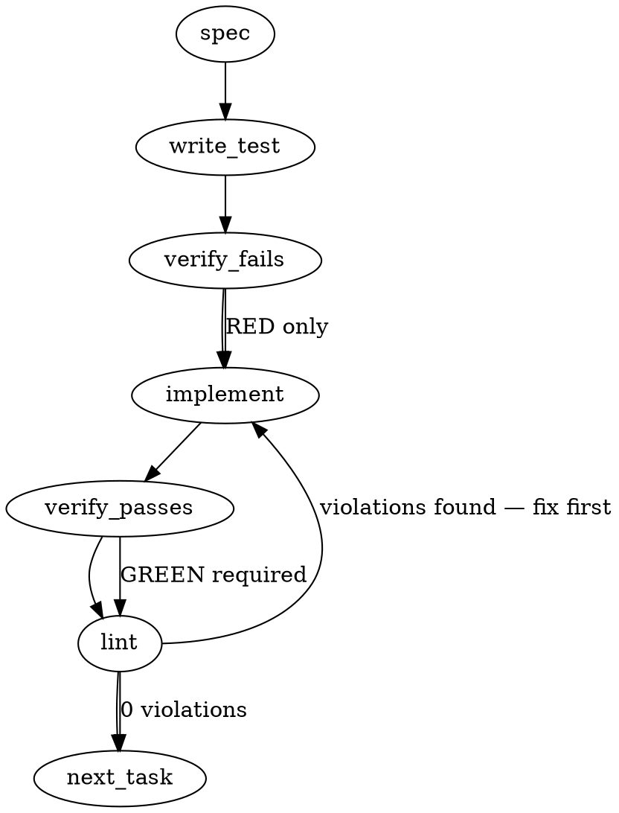

> **⚠ SUPERSESSION NOTE (2026-08-05, totem-claude):** The generated body below is OFF-TARGET — the
> spec generator did not consume mmnto-ai/totem#2580 and invented a repo-structure telemetry sensor
> (the #2553 grounding class). Its Tasks 1–4, schema, and test paths are **VOID for this build**
> (its `packages/core/test/` layout also contradicts repo convention — core tests are colocated).
> Design authority = the #2580 issue body + its three comments (strategy-leg corrections ×2 + the
> status-seat placement position) + the `## Implementation Design` section at the end of this file.

### Problem Statement

We need to implement a codebase "Estate Sensor" that catalogs the structure, git metadata, workspace layout, and Totem instrumentation status of the active repository. This sensor must run passively, producing a robust telemetry payload without modifying any system state.

### Architectural Context

- **Sensors, Not Actuators (Tenet 13):** The Estate Sensor must strictly collect and return structured telemetry. It should never write, initialize, or modify configurations (such as creating `.totem` directories) on the developer's filesystem.
- **Honest Missing Instrumentation State:** In alignment with `isInstrumentedProject` from `packages/core/src/qbd/record.ts`, a missing `.totem` directory should be reported cleanly as uninstrumented (`hasTotem: false`) rather than automatically trying to bootstrap or create directories.
- **Resilient Path Resolution:** As seen in `defaultRealpath` in `packages/core/src/parity-detect.ts`, path resolution across workspaces must gracefully degrade using lexical paths if physical directories or symlinks throw `ENOENT` or permission errors.

### Files to Examine

- `packages/core/src/qbd/record.ts` — Study `isInstrumentedProject` and `senseQbd` to align telemetry/sensor recording paradigms.
- `packages/core/src/parity-detect.ts` — Review path resolution and `realpathSync` fallback behaviors to handle nested symlinks.
- `docs/manual/why-totem.md` — Read the sensor-versus-actuator boundary guidelines.

### Technical Approach & Contracts

We will introduce a new module under `packages/core/src/estate/sensor.ts` containing the core logic for the estate detection engine.

#### Data Contract (Zod Schema)

```typescript
import { z } from 'zod';

export const ProjectMetadataSchema = z.object({
  name: z.string(),
  relativePath: z.string(),
  hasTotem: z.boolean(),
  packageJsonPath: z.string().optional(),
});

export const EstateTelemetrySchema = z.object({
  git: z.object({
    root: z.string().nullable(),
    branch: z.string().nullable(),
    defaultBranch: z.string().nullable(),
  }),
  workspace: z.object({
    type: z.enum(['monorepo-pnpm', 'monorepo-yarn-npm', 'single-project', 'unknown']),
    projects: z.array(ProjectMetadataSchema),
  }),
  timestamp: z.string().datetime(),
});

export type EstateTelemetry = z.infer<typeof EstateTelemetrySchema>;
```

#### Scan & Resolution Logic

1.  **Git Context:** Use the shared helper `resolveGitRoot(process.cwd())`. If null, set git attributes to null. Otherwise, fetch git branch metadata using `getGitBranch()` and `getDefaultBranch()`.
2.  **Workspace Type Detection:**
    - Inspect `pnpm-workspace.yaml` presence -> `monorepo-pnpm`.
    - Inspect root `package.json` workspaces list -> `monorepo-yarn-npm`.
    - Otherwise, treat as `single-project` or `unknown`.
3.  **Project Enumeration:** Parse declared monorepo workspace patterns or default to the root project. Map projects into `ProjectMetadataSchema` items.
4.  **Safe Directory Checking:** Check for a `.totem` directory under each resolved project path without writing or altering the path.

---

### Edge Cases & Traps

- **Detached HEAD and CI Environments:** `getGitBranch` can throw or return empty strings when run inside headless CI systems. The sensor must catch and fall back to common environment variables (e.g., `GITHUB_REF_NAME`, `CI_COMMIT_BRANCH`) or default to `null` instead of failing the run.
- **Monorepo Workspace Glob Resolution:** Workspaces can define globs (e.g., `packages/*`). Recursively searching the directory tree can block the node event loop. We must read the workspace definitions first and resolve direct directory matches rather than doing blind recursive file walks.
- **Concurrent FS Mutability:** Files can be deleted or moved during the scan (e.g., `node_modules` or build targets). Wrap filesystem checks in safe try-catch handlers using fallback logic.

---

### Implementation Tasks

- [ ] **Task 1: Define Contracts and Zod Schemas**
      Create the types and schemas for the Estate Sensor payload.
  - Files to create: `packages/core/src/estate/types.ts`
  - Files to update: `packages/core/src/index.ts` (export types)
    > TEST DIRECTIVE: Before implementing, write a failing test named `rejects invalid estate schema structures` inside a new test suite `packages/core/test/estate/sensor.test.ts`.
  - Steps: Define and export `EstateTelemetrySchema` and related sub-schemas. Ensure Zod parsing works cleanly.
  - Verify: write test -> verify fails -> implement -> verify passes -> lint

- [ ] **Task 2: Implement Git Detection Engine**
      Extract Git metadata safely using the provided shared helper library functions.
  - Files to modify: `packages/core/src/estate/sensor.ts`
  - Files to update: `packages/core/test/estate/sensor.test.ts`
    > TOTEM INVARIANT (Sensors, Not Actuators): The engine must only read git configurations and state; under no circumstances should it call modifying Git commands (such as checkout, clean, or branch creation).
    > TEST DIRECTIVE: Before implementing, write a failing test named `handles detached head state gracefully` that mocks `getGitBranch` throwing or returning an empty string and checks if it falls back safely.
  - Steps: Implement git metadata extraction. Use `resolveGitRoot`, `getGitBranch`, and `getDefaultBranch`. Add fallback logic for headless CI states.
  - Verify: write test -> verify fails -> implement -> verify passes -> lint

- [ ] **Task 3: Implement Workspace Layout Classifier**
      Determine whether the repo is a monorepo (pnpm/yarn/npm) or a single package repository.
  - Files to modify: `packages/core/src/estate/sensor.ts`
  - Files to update: `packages/core/test/estate/sensor.test.ts`
    > TOTEM INVARIANT (Path Parity Fallback): If any directory reads throw due to symlinks or temporary deletions, catch the exception, keep the lexical paths, and proceed safely.
  - Steps: Read and parse the workspace configs using `readJsonSafe` for root `package.json` or YAML readers for `pnpm-workspace.yaml`. Categorize the workspace type.
  - Verify: write test -> verify fails -> implement -> verify passes -> lint

- [ ] **Task 4: Project Instrumentation Scanner**
      Map individual workspace projects and check each for Totem instrumentation.
  - Files to modify: `packages/core/src/estate/sensor.ts`
  - Files to update: `packages/core/test/estate/sensor.test.ts`
    > TOTEM INVARIANT (Honest Not Instrumented State): If `.totem` is missing in a sub-project, record `hasTotem: false`. Do not attempt to initialize or write files inside that workspace directory.
    > TEST DIRECTIVE: Before implementing, write a failing test named `correctly identifies non-instrumented workspace modules` confirming that directories missing `.totem` are not modified and resolve to `hasTotem: false`.
  - Steps: Iterate over resolved workspace directories, check for `.totem` directories using a safe file-stat reader, and construct the final telemetry list.
  - Verify: write test -> verify fails -> implement -> verify passes -> lint

---

### Execution Flow



---

### Verification

Every implementation MUST end with these steps:

1. `totem lint` — deterministic rule check (zero LLM, ~2s). Fixes any violations.
2. `totem review` — supplementary AI lanes over the diff (~18s, advisory). Address critical findings; your team's review discipline decides the review of record.
3. If using MCP, call `verify_execution` to confirm compliance before declaring the task done.

---

### Test Plan

- **Mock Workspace Setup:** Create mocked in-memory/fixture filesystems representing:
  - A single-project repository with a `.totem` directory.
  - A pnpm monorepo structure with three sub-packages (one with `.totem`, two without).
  - A workspace with broken symlinks to verify resilient path-resolution fallback logic.
- **Git Context Isolation:** Mock git commands and environmental states (e.g. CI runner profiles, non-git directories) to ensure deterministic metadata collection.
- **Schema Safety:** Validate mock-generated telemetry objects against `EstateTelemetrySchema` to guarantee output data contract integrity.

---

## Implementation Design

**Slice:** #2580 slice-1 — worktree-estate sensor, a `totem doctor` row. Placement ruled by the
status-seat position on the issue (classifier rides doctor; status sidecar consumes the JSON).

### Scope

Adds a read-only estate scan: enumerate registered repos from the user-level `~/.totem/registry.json`,
list each repo's linked worktrees via `git worktree list --porcelain`, sweep derived candidate roots
for _unregistered_ worktree-shaped residue (husks), classify conservatively, and report — human render
via `doctor --estate`, machine artifact via `doctor --estate --json`, plus a one-line summary row in
plain `doctor` (open question 1). Explicitly NOT in scope: any removal/cleanup or filesystem write
(slice-2 verbs), signoff coupling (slice-3), GitHub API / PR-state reads (the squash-merge "merged"
fact arrives via the status-lane snapshot extension — its absence is an honest `indeterminate` state
here), scheduled/ambient surfacing (status lane), `--strict` gating (sensor-not-gate; a future slice
may promote), and any new config file/field.

### Module layout

- `packages/core/src/estate-scan.ts` — types + pure scan logic (`scanEstate(inputs)`), exec injected
  (`SafeExecFn` idiom, author-sandbox.ts:21). New porcelain parser `parseWorktreeListPorcelain`
  (first reusable one; author-sandbox.ts:116 stays as-is — refactor out of scope). Exported via the
  core barrel. Tests colocated (`estate-scan.test.ts`).
- `packages/cli/src/commands/doctor-estate.ts` — `doctorEstateCliCommand(options)` render + JSON
  artifact, dynamic imports (doctor-parity idiom). Seams: `cwdForTest`, `registryForTest`,
  `execForTest`, `nowForTest`.
- `packages/cli/src/index.ts` — `--estate` option (:1465 block), membership in `specializedModes`
  (:1502-1506), widen the `--json` guard (:1514-1520) to admit `--estate --json`, dispatch branch.
- ~~`packages/pack-agent-security/test/repo-sweep.test.ts` — allowlist entry for the new exec sites.~~
  STRUCK (verified unnecessary, NIT-4): the pack rule matches the `exec(...)` call-shape identifier,
  and the injected seam is named `safeExec`, so the sweep sees zero new sites (the sweep's own
  count-drift test confirms the delta is nil).
- Changeset: minor, `@mmnto/totem` + `@mmnto/cli` (fixed group).

### Data model deltas (all new, all in estate-scan.ts; no existing type touched)

- `WorktreeClass = 'registered-active' | 'registered-stale' | 'registered-indeterminate' | 'registered-detached' | 'unscannable'`
- `HuskEvidence = 'dangling-gitdir-pointer' | 'residue-shape' | 'deregistered-intact' | 'container-residue'`
  (`container-residue` added by the falsification fold — see § Evidence model as built)
- `EstateWorktreeRow { path, repoPath, branch?, head?, class, dirty?, ancestryMerged: boolean|'unknown', ageDays?, locked?, prunable?, evidence: string }`
- `EstateHuskRow { path, sweptRoot, evidence: HuskEvidence, matchedRepo?, ageDays? }`
- `EstateUnscannableRow { path, reason }` — every failed probe lands here; total accounting invariant below.
- `EstateScanResult { schemaVersion: 1, derivedAt, sweptRoots[], repos[], worktrees[], huskCandidates[], unscannable[], summary{...counts} }`
  JSON artifact renders this with kebab-case keys (readoutJsonArtifact idiom, doctor-parity.ts:1515),
  artifact owns stdout wholesale; human render stays on stderr. Writers: the scan only. Readers:
  human render, `--json` (status-lane contract), future plain-doctor row. No state containers — the
  scan is stateless per invocation; nothing persists.

### Classification (conservative, evidence-typed — claim discipline per the on-issue leg correction)

Registered arm (per registry repo, local git reads only — `worktree list --porcelain`,
`status --porcelain`, `merge-base --is-ancestor`, `log -1 --format=%ct`; 15s timeout each):
dirty tree → **active**. Clean + branch ancestry-merged into default → **stale**. Clean + not
ancestry-merged → **indeterminate** (the squash-merge gap, named in output; upgradeable when the
status-lane merged-facts snapshot exists). Detached HEAD → **detached** (classified by dirty/age
only). Any probe failure → **unscannable**, scan continues.

Husk arm (per swept root; directories only, skip dot-dirs/node_modules, no-follow symlinks/junctions
(mail.ts:435-451 idiom); swept roots disclosed in output — no silent caps).

### Evidence model as built (falsification fold, 2026-08-05)

The as-drafted husk arm found 0 of 24 real husks on the author's host. Three suppressors were ruled
out, and the model is now **root-kind-typed**:

- **Root kinds.** CONTAINER = `<repo>/.claude/worktrees` (for every toplevel-verified registered
  repo) and every `--root` the operator names — a location whose whole purpose is holding worktrees.
  STANDARD = dirname(registry path) ∪ dirname(each LISTED worktree) — an ordinary working directory.
  A root reached as both is CONTAINER (the more specific declaration wins).
- **Evidence by kind.** Under CONTAINER, an untracked dir with no `.git` DIRECTORY is
  **container-residue** — location IS the evidence, no name convention or `node_modules` needed;
  the `.git`-FILE classes still win when they apply, and the `.git`-FILE sub-cases that yield no
  TYPED outcome (shapeless pointer with no `gitdir:` line, or a target that is not worktree-shaped)
  fall through to container-residue. Unreadable pointer stays sweep-source `unscannable`;
  intact+listed stays live (no row); intact+unlisted stays deregistered-intact. Under STANDARD the
  drafted classes are unchanged and the same shapeless sub-cases yield NO row: `.git` FILE with
  nonexistent `gitdir:` → **dangling-gitdir-pointer**; no `.git` + name prefix-matches a VERIFIED
  repo (LONGEST match) + `node_modules` → **residue-shape**; `.git` file whose target exists but is
  absent from its home repo's worktree list → **deregistered-intact** (home resolution accepts both
  `<repo>/.git/worktrees/<n>` and bare `<repo>.git/worktrees/<n>`).
- **Disclosure parity.** The kind is carried on every swept root
  (`sweptRoots: { path, kind: 'container' | 'standard' }[]`, artifact `swept-roots`, and the human
  render's `path (kind)` annotation), and the criteria line names all four classes BY ROOT KIND, so
  a reader can tell which evidence bar produced any given husk row. `--root`'s help states the
  container semantics it confers, including that naming an already-derived root RAISES it.
- **Degraded container.** A verified repo whose `worktree list` FAILS has its container root
  withdrawn (`excludedRoots`, reason `container of a repo whose worktree list failed`): without the
  live-worktree list, container-residue cannot distinguish live from residue, and a degraded scan
  must never read DIRTIER than a healthy one.
- **Attribution targets.** `residue-shape` attributes only to VERIFIED repos (missing, not-git-root,
  and unprobeable entries are excluded), so a husk can never name ITSELF as the repo it is residue of.
- **What protects a path.** GIT's worktree list (cohort-overlay §2) plus the `.git`-DIRECTORY rule.
  Totem-registry membership is NOT protection — registry accounting and disk residue are different
  axes, so one path may carry both a repo row and a husk row. The git join is case-folded on win32
  only (GCA #2293, author-sandbox.ts:121); on POSIX two case-divergent paths stay distinct.
- **Toplevel verification.** A registry entry is enumerated only if `rev-parse --show-toplevel`
  equals it; otherwise it is a `notGitRoot` row naming its `enclosingRepo`, and NOTHING is derived
  from it (not its dirname, and above all not git's ancestor answer). An entry whose toplevel probe
  FAILS derives nothing either — unverifiable is not verified.
- **Derivation disclosure.** A root suppressed by any rule — os tmpdir reached only from a registry
  dirname, or a dirname reachable only from missing / not-git-root / unverifiable entries, or a
  withdrawn container — lands in `excludedRoots` with its reason. A root some other derivation
  reached is swept and never reported excluded.
- **Two axes, one partition.** `EstateUnscannableRow` carries `source: 'registry' | 'worktree' |
'sweep'`. The candidate partition is defined over the SWEEP axis only; registry- and
  worktree-source ledger rows are registered-arm accounting and MAY share a path with a husk row
  (the two-axes rule). `summary` carries `reposNotGitRoot` and `reposUnscannable` alongside
  `reposMissing`, so the ambient row's enumerated-repo denominator is derivable.

### State lifecycle

None beyond the per-invocation scan result (created at call, returned, dropped). No files written,
no registry mutation, no caching. The `--json` artifact is the only cross-boundary surface; its
`estate-schema-version` field is the compatibility contract with the status lane.

### Failure modes

| Failure                                           | Category  | Agent-facing surface                                                                                                                                                    | Recovery                        |
| ------------------------------------------------- | --------- | ----------------------------------------------------------------------------------------------------------------------------------------------------------------------- | ------------------------------- |
| Registry absent/unreadable/malformed              | init      | SKIP row "no registered repos" (readRegistry warn passed through); `--json` emits degenerate artifact (parity :1528 precedent)                                          | run `totem sync` in a repo      |
| Registry entry path missing                       | runtime   | repo row `missing: true` (list.ts [MISSING] parity), no scan of it                                                                                                      | re-sync or stale entry ages out |
| `git worktree list` fails on a VERIFIED repo      | runtime   | registry-source `unscannable` row; its `<repo>/.claude/worktrees` container root is WITHDRAWN and disclosed in `excludedRoots` (a degraded scan must not read dirtier)  | fix repo, re-run                |
| `git status`/ancestry probe fails in one worktree | runtime   | worktree `class: unscannable`, evidence names the errno/step                                                                                                            | re-run                          |
| Sweep root unreadable                             | runtime   | root listed in `unscannable`, other roots proceed                                                                                                                       | permissions                     |
| Dir vanishes mid-scan (TOCTOU)                    | transient | per-entry catch → sweep-source `unscannable`; a dir readdir named but that is gone at probe time → sweep-source `unscannable` "vanished or turned unreadable mid-sweep" | re-run                          |
| Registry entry exists but is not a git toplevel   | runtime   | repo row `notGitRoot: true` + `enclosingRepo`; never enumerated, derives no sweep root (its dirname is disclosed in `excludedRoots`)                                    | re-sync from the repo root      |
| Toplevel probe itself fails                       | runtime   | registry-source `unscannable` row; derives NOTHING (dirname disclosed as `derived only from unverifiable registry entry path(s)`)                                       | fix repo, re-run                |
| Default branch underivable                        | runtime   | `ancestryMerged: 'unknown'` → indeterminate                                                                                                                             | —                               |
| Unclassifiable worktree-shaped dir                | runtime   | NOT listed as husk (no evidence) — by design; the sweep reports evidence-bearing rows only, disclosure line states the criteria                                         | slice-2+ may widen              |

No silent-degradation rows: every probe failure is an `unscannable` entry or a named skip (Tenet 4).
Exit code is 0 in all cases (report-only sensor; crash-class errors still throw normally).

### Invariants to lock in via tests

1. A path present in any repo's GIT `worktree list` is NEVER a husk-candidate — including when git
   and Node disagree on drive-letter case (win32 fold). On POSIX the join is unfolded, so two
   case-divergent paths stay distinct and a listed `/A/wt` does not protect `/a/wt`. Totem-registry
   membership grants no such protection (falsification fold).
2. Clean + not-ancestry-merged is `indeterminate`, never `stale` (squash honesty); clean + merged is
   `stale`; dirty is `active` regardless of merge state.
3. A husk row exists only with a typed evidence class; a `.git`-DIRECTORY dir is never reported.
4. A dangling `.git` pointer file is a husk-candidate even when its name matches no convention.
5. Total accounting on the SWEEP AXIS: every enumerated candidate lands in exactly one of
   {worktree rows, huskCandidates, sweep-source unscannable} — nothing dropped silently; summary
   counts equal row counts. Registry- and worktree-source ledger rows are a DIFFERENT axis and may
   share a path with a husk row (the two-axes rule), so they are excluded from the partition and
   asserted separately. Tested by enumerating the swept roots' children independently and accounting
   for each, with the exempt shapes (dot-dirs, `node_modules`, `.git`-DIRECTORY dirs, git-known
   paths, no-evidence STANDARD-root dirs) asserted as an EXPLICIT list — so a silent cap or a
   dropped candidate fails the test.
6. Empty/unreadable registry → SKIP surface + valid degenerate `--json` artifact, exit 0. The
   artifact's `registry-status` distinguishes `empty` from `unreadable`.
7. The scan invokes only read verbs (exec-fn spy asserts the allowlist: worktree list / status /
   merge-base / log / rev-parse --abbrev-ref / rev-parse --show-toplevel) and EVERY invocation
   begins with `--no-optional-locks`, which is what makes the read-only claim true: `git status`
   otherwise refreshes and writes the index, taking `index.lock` (git-status(1) § BACKGROUND
   REFRESH) and racing a seat's live `git add` in a shared worktree. Zero fs writes.
8. `--json` owns stdout wholesale; human lines never interleave.
9. The ambient `doctor` row is `gateExempt` on every path: its ADVISORY statuses never gate under
   any `--strict` tier. The exemption deliberately does NOT cover `fail` — a fail is a wiring
   failure and no row may hide one (sensor rows never emit `fail`). Its pass/warn messages report
   the ENUMERATED repo count and name the missing / not-git-root / unprobeable / unscannable-probe
   counts whenever nonzero.

### Open questions — ALL RESOLVED (operator-ruled 2026-08-05, design approved as drafted)

1. **Plain-doctor summary row**: RULED (a) — include, skip-quiet when clean/no-registry, warn
   (report-only) when husks/stale > 0. Constraint: no new static core-barrel import on the CLI
   cold-start path — dynamic import inside the check (doctor-family idiom).
2. **Flag name**: RULED `--estate`.
3. **`--root <dir>` repeatable sweep-root extension**: RULED include.
