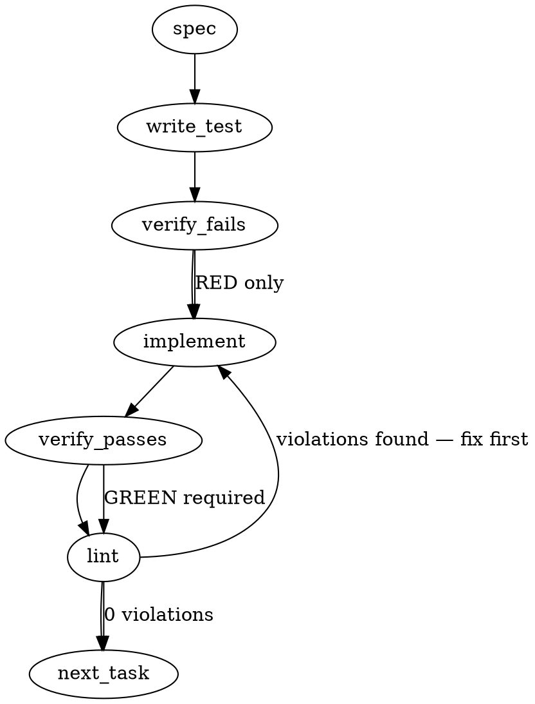

### Problem Statement

The Totem CLI needs a robust and safe `wt` (worktree) command group with subcommands to manage and verify git worktrees (`create`, `remove`, and `verify`). The tool must proactively handle environment verification, prevent branch checkout conflicts, and guarantee safe, "check-first" directory removals.

### Architectural Context

- **Check-First Live Check Pattern:** Inspired by `removeAuthorSandbox` in `packages/cli/src/author-sandbox.ts`, the CLI must verify whether a directory is a registered, live worktree in git's database before executing removal commands. We must never "fail-open" or blindly attempt disk deletion.
- **Shared Helpers Usage:** All Git operations must run through the shared `safeExec` helper from `@mmnto/totem` using structured array parameters. Repository resolution must use `resolveGitRoot`.

### Files to Examine

1. `packages/cli/src/author-sandbox.ts` — Examine `removeAuthorSandbox` to understand the pattern for querying and cleaning up live git worktrees safely.
2. `packages/cli/src/commands/wt.ts` — This will be the new entrypoint file implementing the `wt` command group, subcommands, and schema contracts.
3. `packages/cli/src/cli.ts` (or the primary CLI definition file) — Read to see how existing command groups and subcommands are registered and configured.

### Technical Approach & Contracts

We will implement three subcommands under a new parent command `wt` (aliased as `worktree`):

- `totem wt create <path> [branch]` — Creates a new worktree at the absolute path target.
- `totem wt remove <path>` — Safely cleans up and deregisters a worktree.
- `totem wt verify` — Checks the health of all registered worktrees, flagging orphaned or corrupt entries.

#### Data Contracts (Zod Schemas)

```typescript
import { z } from 'zod';

export const WorktreeInfoSchema = z.object({
  path: z.string(),
  commit: z.string(),
  branch: z.string().optional(),
  isBare: z.boolean(),
  isDetached: z.boolean(),
});
export type WorktreeInfo = z.infer<typeof WorktreeInfoSchema>;

export const WtCreateOptionsSchema = z.object({
  path: z.string(),
  branch: z.string().optional(),
  base: z.string().optional(), // e.g., --base main
  force: z.boolean().optional(),
});
export type WtCreateOptions = z.infer<typeof WtCreateOptionsSchema>;

export const WtRemoveOptionsSchema = z.object({
  path: z.string(),
  force: z.boolean().optional(),
});
export type WtRemoveOptions = z.infer<typeof WtRemoveOptionsSchema>;
```

#### Detailed Sequence Logic

1. **`getWorktrees` Helper:**
   - Run `resolveGitRoot(process.cwd())`. If `null`, throw a user-friendly error.
   - Execute `safeExec('git', ['worktree', 'list', '--porcelain'])`.
   - Parse the block-based output (separated by double newlines `\n\n`) to construct a list of `WorktreeInfo` objects with absolute paths.

2. **`create` Flow:**
   - Resolve target path to an absolute path.
   - Verify path does not exist on disk.
   - Parse active worktrees to ensure the target `branch` is not already checked out in another worktree (prevent branch-locking errors).
   - Execute `safeExec('git', ['worktree', 'add', absolutePath, branchName])`.

3. **`remove` Flow:**
   - Resolve path to absolute.
   - Match path against active registered worktrees.
   - If not found in git but directory exists, notify the user.
   - If registered, execute `safeExec('git', ['worktree', 'remove', absolutePath])` (with `--force` if requested).

4. **`verify` Flow:**
   - Retrieve all registered worktrees.
   - For each, check if the directory exists on disk.
   - Flag "orphaned" worktrees (registered in git, missing on disk).
   - Suggest or trigger `git worktree prune`.

---

### Edge Cases & Traps

1. **Relative Path Resolution:** Users often pass relative paths (e.g., `../feature-branch`). If these are not resolved to absolute paths before string-matching with `git worktree list --porcelain`, checks will fail to identify existing worktrees.
2. **Branch Locking:** Git prevents checking out a branch currently active in another worktree. We must intercept this condition early and output a clean user error instead of a raw Git execution panic.
3. **Orphaned Metadata:** If a user deletes a worktree directory using `rm -rf`, Git still retains metadata. Attempting to run `wt create` at that path will fail. Our commands must suggest running `git worktree prune` (or do it automatically) when this state is detected.
4. **Shell Injection Safety:** Never construct commands using template literals (e.g., `` `git worktree remove ${path}` ``). Use `safeExec` with a structured string array for parameters.

---

### Implementation Tasks

- [ ] **Task 1: Implement Worktree Registry Parser (`getWorktrees`)**
  - Create `packages/cli/src/commands/wt.ts` (or a utilities subfolder) and define the `getWorktrees` parser logic.
  - Implement parsing logic for `git worktree list --porcelain` into typed Zod structures.
    > TEST DIRECTIVE: Before implementing, write a failing test named `parsesPorcelainOutputCorrectly` that feeds mock git output with mixed bare, detached, and regular worktrees and verifies output types.
  - Write test → verify fails → implement → verify passes → lint

- [ ] **Task 2: Implement `totem wt create` Command Logic**
  - Implement the creation command, resolving relative paths to absolute paths.
  - Add verification to reject creation if the target branch is already active in another worktree.
    > TEST DIRECTIVE: Before implementing, write a failing test named `rejectsDuplicateActiveBranchCheckout` that asserts a helpful error is thrown when trying to create a worktree on an already checked-out branch.
  - Write test → verify fails → implement → verify passes → lint

- [ ] **Task 3: Implement `totem wt remove` Command Logic**
  - Implement the removal logic using the check-first verification technique.
    > TOTEM INVARIANT (Check-First Rule): Never execute a worktree removal shell call without first verifying that the path is active in the git worktree registry.
    > TEST DIRECTIVE: Before implementing, write a failing test named `rejectsNonWorktreeDirectoryRemoval` that attempts to run remove on a regular directory and asserts that it fails safely without running `git worktree remove`.
  - Write test → verify fails → implement → verify passes → lint

- [ ] **Task 4: Implement `totem wt verify` Command Logic**
  - Implement health check verification logic to scan active worktrees and locate orphaned directories.
  - Add automatic or suggested recovery execution using `git worktree prune`.
    > TEST DIRECTIVE: Before implementing, write a failing test named `flagsOrphanedWorktreesForPruning` that mocks a missing filesystem directory for a registered worktree and confirms it is flagged for prune.
  - Write test → verify fails → implement → verify passes → lint

- [ ] **Task 5: Integrate and Register the Command Group**
  - Import and wire the new subcommands into `packages/cli/src/cli.ts` (or your central commander router).
  - Run a full test suite suite validation and end-to-end integration tests.
  - Write test → verify fails → implement → verify passes → lint

---

### Execution Flow



---

### Verification

Every implementation MUST end with these steps:

1. `totem lint` — Deterministic static analysis check. Must return zero errors.
2. `totem review` — Supplementary code-diff review.
3. If utilizing MCP, call `verify_execution` to confirm contract completeness before finishing.

---

### Test Plan

- **Unit Tests (`packages/cli/test/commands/wt.test.ts`):**
  - **Parser accuracy:** Verify the `--porcelain` parser handles multi-line blocks, bare repositories, detached heads, and windows/unix path separators correctly.
  - **Resolution safety:** Test that relative paths resolve correctly relative to the Git repository root.
  - **Branch-safety assertions:** Verify that attempting to double-checkout a branch throws an informative error before calling shell operations.
  - **Check-First removal validation:** Mock filesystem states to verify that folder removals are gated cleanly behind registry confirmation.
  - **Pruning validation:** Mock dead worktrees and verify `verify` commands flag them and propose correct remediation CLI calls.

---

## Implementation Design

_2026-08-07, totem-claude preflight for #2580 slice 2. Where this section conflicts with the generated scaffold above, this section governs — the scaffold's `wt verify` subcommand does not survive, and its author-sandbox framing is a precedent, not the pattern. Primary sources: issue #2580 body + all 4 comments; `totem-strategy:doctrine/tool-usage-nuances.md` § Git (canonical removal recipe); `doctrine/cohort-overlay.md` §2 (location + mail convention); lesson-ad03b5cd (cause-as-hypothesis hedge); `packages/core/src/estate-scan.ts` + `registry.ts`; PR #2586 round-3 MINOR-3._

### Scope

Implements `totem wt create|remove|list`: lifecycle verbs backed by a durable user-level worktree registry (`~/.totem/worktrees.json`) with verified removal — the Tenet 4 fix git lacks — plus the sensor coupling: `doctor --estate` sweeps the wt-registry's recorded roots as container roots (the round-3 MINOR-3 remedy: recorded locations stay derivable when every husk's own registry entry is gone). It will NOT: implement signoff coupling (slice 3 — lands inside strategy#650's Prop 298 build, per the fold re-arm correction); classify worktree state in `wt list` (classification stays in the slice-1 sensor — derive-once, the status seat's ruling); wire `TOTEM_WORKSPACE`/`TOTEM_SELF_AGENT` for in-worktree mail (doctrine ruled: mail runs from the primary checkout, full stop); or special-case the reparse-point hypothesis (cause stays open — verify + finish + re-verify whatever the failure mode).

### Data model deltas

**New file `~/.totem/worktrees.json`** — NOT a key in `registry.json`: `RegistrySchema` is `z.record(repoPath, RegistryEntrySchema)`, so any non-repo-entry key fails schema validation and flips the whole registry to "unreadable". Sibling file, own zod schema in a new `packages/core/src/worktree-registry.ts`:

```ts
{
  schemaVersion: 1,
  roots: string[],              // every container root ever created under — accretes, never auto-pruned
  worktrees: Record<absPath, {
    repo: string,               // home repo root (abs)
    seat: string,               // creating seat id
    branch: string,
    ticket?: string,            // e.g. "2580"
    createdAt: string,          // ISO, real instant at write time
  }>                            // entry schema .passthrough() for forward-compat
}
```

- `roots[]`: written by `create` (adds the resolved root, deduped case-folded on win32 only); read by `doctor --estate` (extra container sweep roots) — never removed by `remove`; durability independent of entry lifecycle is the point.
- `worktrees{}`: written by `create` (record-first) and `remove` (deleted ONLY after verified absence); read by `list` and `remove` (path resolution).
- Concurrency: same `acquireLock(~/.totem)` as `registry.json` — one lock dir serializes both files (deliberate; cross-file atomicity not needed). Atomic write: PID-suffixed temp + rename, matching `updateRegistryEntry`.
- No reserved keys or sentinels.

### State lifecycle

- **worktrees.json**: persistent, user-level, host-scoped. Created lazily on first `wt create`. Entry written **before** `git worktree add` (intent record — a phantom entry fails visible via `wt list` "missing"; an unrecorded worktree fails invisible, which is the failure class this issue exists for). Entry deleted only on verified-absent removal. Never auto-trimmed.
- **The worktree dir**: `<root>/<repo>-<seat>-<slug>`. Root precedence: `--root` > `TOTEM_WORKTREE_ROOT` (user-level env per the cohort no-.env rule) > default (open question 1). `create` refuses the workspace root (home repo's parent) and the repo itself — the location class the estate audit indicts. Seat derived via `resolveSelfSender` (exported from `mail.ts`), overridable `--seat`.
- No process-lifetime state; every verb derives fresh (Tenet 20).

### Failure modes

| Failure                                                        | Category  | Agent-facing surface                                                                                                   | Recovery                                                                   |
| -------------------------------------------------------------- | --------- | ---------------------------------------------------------------------------------------------------------------------- | -------------------------------------------------------------------------- |
| create: target dir already exists                              | init      | hard error naming path                                                                                                 | new slug, or remove residue first                                          |
| create: branch already checked out elsewhere                   | init      | hard error (git's message, sanitized)                                                                                  | different branch                                                           |
| create: registry write fails                                   | init      | hard error BEFORE any git mutation (record-first)                                                                      | fix `~/.totem` perms; nothing to clean                                     |
| create: `git worktree add` fails after record                  | runtime   | hard error + best-effort entry rollback; failed rollback names the phantom entry                                       | re-run create, or `wt remove <path>`                                       |
| create: root is workspace/repo root                            | init      | hard error citing cohort-overlay §2                                                                                    | use conventional root                                                      |
| remove: untracked content under `<wt>/.totem/orchestration/**` | init      | hard refusal listing the files + ecl-discipline §4.6 pointer; no bypass in v1 (open question 2)                        | consolidate ECL, re-run                                                    |
| remove: path in neither git's list nor wt-registry             | init      | hard error; nothing touched                                                                                            | —                                                                          |
| remove: `git worktree remove` itself fails                     | runtime   | hard error (sanitized stderr)                                                                                          | fix cause, re-run                                                          |
| remove: dir present after git remove (the exit-0 husk)         | runtime   | proceeds to residue finish: lstat-walk deletes reparse points WITHOUT following, then recursive delete, then re-verify | automatic — the verb's reason to exist                                     |
| remove: dir STILL present after finish                         | permanent | hard error naming path + surviving entries; registry entry RETAINED                                                    | manual cleanup; entry keeps the failure visible                            |
| remove: registry delete fails after verified absence           | runtime   | loud warning (dir gone, record stale)                                                                                  | re-run remove — idempotent: verified-absent + entry present ⇒ delete entry |
| list: worktrees.json unreadable                                | runtime   | loud warn + empty listing (mirrors `readRegistry`)                                                                     | repair/delete file                                                         |
| doctor-estate: worktrees.json unreadable                       | runtime   | disclosed as an excluded source; scan proceeds (degraded scan never reports dirtier — container-withdrawal precedent)  | repair file                                                                |

No silent-degradation rows.

### Invariants to lock in via tests

1. `wt remove` can never exit 0 while the directory still exists — success ⇔ verified absence (the git fail-open must not survive the wrapper).
2. A registry entry is deleted only after verified absence; every removal failure retains it.
3. Residue deletion never follows a junction/symlink out of the tree — a junction's TARGET survives deletion of the worktree dir (fixture: junction inside a fake worktree pointing outside).
4. A path git lists goes through `git worktree remove`; a path git does NOT list is never passed to `git worktree remove` (check-first) — and its finish path still ends in verify-absence.
5. Untracked content under `.totem/orchestration/**` blocks removal; tracked-only orchestration content does not.
6. `create` writes the entry before invoking git; a git failure rolls it back or reports the phantom loudly.
7. No wt verb ever writes `registry.json` (schema-collision guard); its read path is untouched.
8. Recorded roots survive entry removal and reach `scanEstate` — the DEFAULT `~/.totem/worktrees` root as a CONTAINER root, every other recorded root as a STANDARD shape-evidence sweep — so the `%TEMP%\claude` class stays reachable (via shape evidence: repo-prefix name + `node_modules`) with zero live entries. (Amended round 2: the original text claimed container semantics for all recorded roots, which finding 11's partition superseded.)
9. Path comparisons case-fold on win32 only (author-sandbox precedent).
10. `create`'s resolved root is never the repo, never UNDER the repo, and never the workspace root itself, under any flag combination (containment semantics — post-falsification amendment).

### Open questions

1. **Default worktree root when `TOTEM_WORKTREE_ROOT` is unset?**
   - **(a) `~/.totem/worktrees`** — zero-config, user-level, outside every mail/discovery glob, survives tmp cleaners. Caveat on this host: C:-drive location while repos live on D: degrades pnpm hard-links to copies (slower, bigger installs).
   - **(b) No default — unset env is a hard error** naming the var. Matches "convention specifics agent-derived" (operator rules the location once, per host); one-time setup friction.
   - **(c) `os.tmpdir()/totem-worktrees`** — zero-config, but collides with estate-scan's deliberate tmpdir suppression rationale and the "shared tmp = presumed deletable" doctrine line.
   - **Recommendation:** (a), with the env override documented; you'd likely set `TOTEM_WORKTREE_ROOT=D:\tmp` on this host for drive locality. The doctrine twin's "shared tmp root" wording then gets a follow-up amendment to "the wt-verb's root" (strategy lane).
2. **ECL-block bypass flag on `remove`?** Recommendation: none in v1 — the refusal lists the exact files and the consolidate step is short; a bypass would re-open the untracked-content-deleted-silently hole this verb closes. Add later only if the refusal proves noisy on tracked-vs-untracked edge cases.
3. **Sensor coupling in this PR or a follow-up?** Recommendation: this PR — it's ~10 lines (doctor-estate reads wt-registry roots, passes as extra container roots into `scanEstate`), it discharges the round-3 MINOR-3 carry, and shipping the verbs without it re-creates the unreachable-root gap the comment documents.

### Rulings (operator greenlight 2026-08-07, "using your recs")

- **Q1 → (a):** default root `~/.totem/worktrees`, `TOTEM_WORKTREE_ROOT` override (user-level env). Doctrine-twin "shared tmp root" wording amendment routes to the strategy lane coupled with this PR.
- **Q2 → no bypass flag in v1.** The ECL refusal lists the exact files; consolidate-then-re-run is the only path.
- **Q3 → sensor coupling ships in this PR.** Derived wt-registry roots are filtered to directories that exist (an absent recorded root is an empty sweep, not a scan hole — mirrors the missing-registry-entry precedent); explicit `--root` behavior unchanged (a named root that fails to read stays an unscannable row).
- Design approved at the same word. Additional bound contract details settled at ruling time: `create` uses `git worktree add -b` (always a NEW branch; an existing branch is a hard error in v1); default branch name `feat/<ticket>-<slug>` when `--ticket` is given, else `wt/<slug>`, overridable `--branch`; ECL check runs `git -C <wt> status --porcelain --ignored -uall -- .totem/orchestration` and blocks on ANY row (ignored ECL files are still ECL; `-uall` added post-falsification — it names exact files and defeats a `status.showUntrackedFiles=no` config bypass); `remove` accepts a git-listed worktree with no registry entry (legacy estate) — registry deletion just no-ops.

### Post-falsification dispositions (2026-08-07)

Standing pre-merge falsification leg ran against the full branch diff; verdict MERGEABLE-WITH-FIXES. Dispositions:

**Required fixes (all taken):**

1. **Finding 1 (doctor.ts):** the unreadable-sync-registry disclosure now rides every arm of the `Estate` row, not just the empty short-circuit — with recorded wt roots the scan proceeds and the clean arm demotes to `warn` with the disclosure and remediation. Test added for `registryWarnings ≠ [] ∧ wtRoots ≠ []`.
2. **Finding 2 (wt.ts):** ECL probe carries `-uall` — closes the `status.showUntrackedFiles=no` config bypass and makes the refusal name exact files instead of one collapsed directory row. Argv token asserted, plus a REAL-git test (per-file naming + config-bypass defeat in one fixture).
3. **Finding 3 (wt.ts):** create's root guard is containment, not equality — refuses the repo, anything UNDER the repo (trailing-separator prefix, win32-only fold, sibling names safe), and the workspace root itself. Invariant 10's text and test title amended to the enforced semantics; root-under-repo case added.

**Recommended fixes (all taken):** lying-residue-reporter test (pins the re-probe disjunct); create rollback gated on target absence (a partial directory keeps its entry, loudly — rolling back would mint the invisible unrecorded class); unanswerable `worktree list` hard-errors only when the directory exists (nothing on disk ⇒ already-gone with a disclosed note, preserving the ruled idempotent recovery); the residue-`rmSync` suppression rationale rewritten honestly (the rules are ast-grep patterns that cannot express "options lacking maxRetries" — not line-anchoring); seat-resolution failure rethrown wt-scoped naming `--seat`/`TOTEM_SELF_AGENT` (never the mail verb's `--from`), with a multi-seat test.

**Owner dispositions (taken):**

- **Finding 10:** `wt create` refuses a linked-worktree cwd (`rev-parse --git-common-dir` vs `<toplevel>/.git`) — primary-checkout only, matching the cohort mail convention.
- **Finding 11:** recorded roots partition at consumption — only the default `~/.totem/worktrees` sweeps as CONTAINER; every other recorded root sweeps as STANDARD via the new additive `extraStandardRoots` scan input (shape evidence required; JSON artifact schema unchanged, `swept-roots` already carries `kind`). A recorded scratch root can no longer permanently arm by-location residue rows.
- **Finding 12:** changeset reworded to prospective honesty — recorded locations make FUTURE roots derivable; the three pre-existing `%TEMP%\claude` husk locations stay `--root`-only until a create records that root.
- **Finding 13:** the git-unlisted residue arm requires the resolved path to lie strictly under a recorded root; a recorded entry outside every recorded root is a hand-edit anomaly and is refused with nothing deleted.
- **Finding 14 + nits:** `wt.ts` imports core AND `./mail.js` dynamically (module genuinely light; the `--help` protection is index.ts's lazy action import, and the comment now says so); JSON `verified-absent` re-derived at write time; `lastError` rendering asserted; `BRANCH_PATTERN` refuses trailing `.` and `.lock`.

**Declined / deferred:**

- **Finding 5 (existence-probe errno tri-state):** `worktreePathExists` reports any lstat failure as absence, so the exit-0 claim's boundary is "as observable via lstat" — a non-ENOENT errno (denied parent, offline share) can read as absent. Errno discrimination (non-ENOENT ⇒ unknown, never absent) is DEFERRED to a follow-up issue pending operator word; invariant 1 below is scoped accordingly.
- **`worktree` alias for the `wt` group:** absent by issue wording; no ruling requested.

Invariant 1 is accordingly read as: `wt remove` can never exit 0 while the directory is observably present via lstat; invariant 10 as: the resolved root is never the repo, never under the repo, and never the workspace root itself.

### Re-verification dispositions (2026-08-07, round 2 — scoped to the fold)

The falsification leg re-ran scoped to the fold commit; verdict FIXES-NEEDED (no HIGH, the three required fixes held). Taken:

1. **Finding 1 (wt.ts):** the primary-checkout discriminator is now `--git-dir` == `--git-common-dir` — equal for every primary shape including `--separate-git-dir`, divergent only in a linked worktree. The previous `<toplevel>/.git` comparison misread separate-git-dir primaries as worktrees, and `--path-format=absolute` silently required git ≥ 2.31; both dropped. Separate-git-dir pass arm tested.
2. **Finding 2 (spec):** invariant 8 amended above — it still asserted container semantics for ALL recorded roots after finding 11's partition shipped.
3. **Finding 3 (core tests):** direct unit tests added for `partitionWorktreeRoots` (default→container, non-default→standard, no-dedup pass-through, win32-only fold on the default match, empty input) and `defaultWorktreeRoot`.
4. **Finding 4 (doctor.ts):** the unreadable-sync-registry disclosure now also rides the CATCH arm of the `Estate` row (`registryNote` hoisted above the try); registry-unreadable × scan-throw test added.
5. **Finding 5:** finding-13/14 disposition mis-citations corrected in `wt.ts` and `wt.test.ts`.
6. **Finding 6 (wt.ts):** the dead `--from`→`--seat` rewrite deleted — mail's `--from` guidance lives in the recovery-hint field this wrapper never surfaces; the wrapper's own message already carries `--seat`.
7. **Finding 9 (wt.ts):** the `.lock` / trailing-dot branch guard applies per path component, matching `git check-ref-format`.

**Declined:** lexical-only containment vs a symlinked `--root` under the repo (finding 7) — deliberate-operator-action class; `realpath` is undefined for a root that does not exist yet; revisit on a specimen. **Noted:** the onDisk-gated worktree-list arm (finding 8) adds one reachable path to the deferred lstat errno-tri-state follow-up — fold that into the follow-up issue's text when filed.

Releasable slice: one PR, `feat(cli,core)`, changeset minor for `@mmnto/totem` + `@mmnto/cli`.
