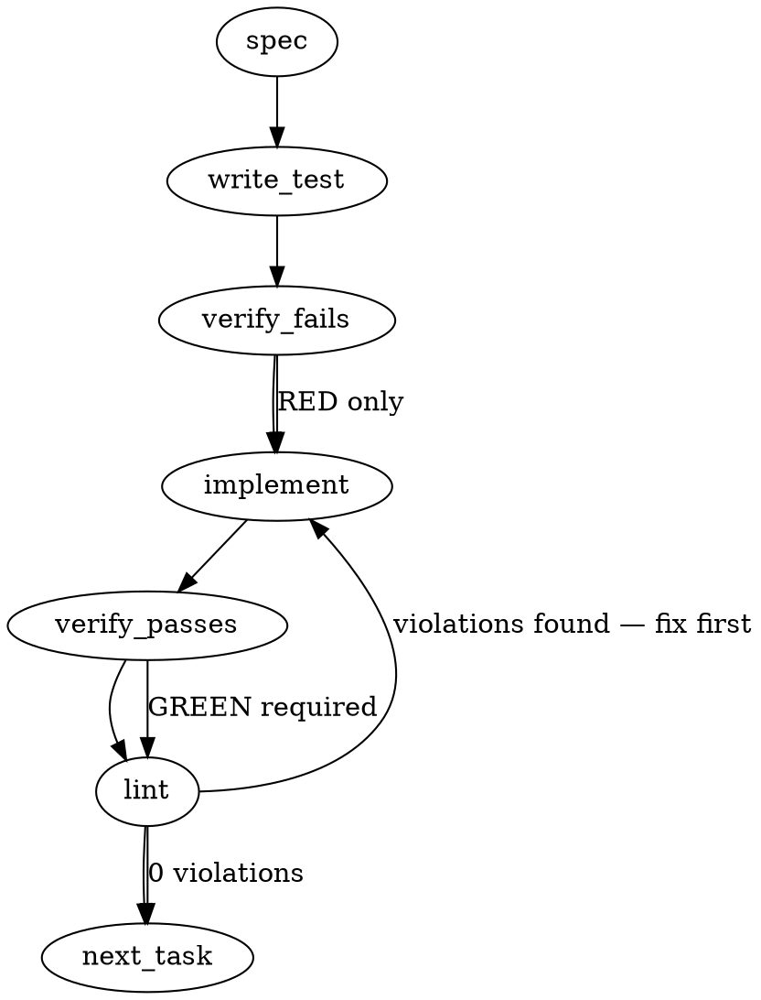

> **Amendment (2026-08-09, pre-merge falsification round — generation record only):** this spec is LLM-drafted and framed the work as regex-safety hardening with a `safelyScrubFencedBlock` helper; the actual defect (mmnto-ai/totem#2602) was data loss — a heading-to-EOF scrub deleting the contractual after-end-marker user span. Shipped reality: `scrubReflexFiles` in `eject.ts` removes each complete `REFLEX_START..REFLEX_END` span END-anchored (`lastIndexOf`) in a loop (which does realize this spec's multi-block requirement), leaves unpaired marker residue byte-untouched with a summary report, bounds the legacy no-marker path at the next non-Totem H2 for `CLAUDE.md`/`.cursorrules` only, and derives its roster from `AI_TOOLS`. No `safelyScrubFencedBlock` helper, no 1MB performance fixture; the skill-marker scrub was not in scope.

### Problem Statement

The `totem eject` command (implemented in `packages/cli/src/commands/eject.ts`) contains file-scrubbing routines (such as `scrubClaudeSkills` and `scrubReflexFiles`) that locate and strip marker-fenced sections. These patterns must be refactored to use strictly bounded search operations or safe, non-backtracking line/index parsing to prevent catastrophic backtracking and memory exhaustion on large target files.

### Architectural Context

- **Regex Safety > Form 2 — Bounded wrapper**: Any regex matching content between start and end delimiters must use bounded quantifiers (e.g., `{0,262144}`) rather than unbounded operators like `*` or `+` to avoid catastrophic backtracking.
- **Regex Safety > The gate**: Nested quantifiers (e.g., `([\s\S]*)*`) are strictly banned by the safety gate.
- **Claude Code > 4. Managed Skill Files**: Claude skills are fenced by `<!-- totem:skill-start -->` and `<!-- totem:skill-end -->` markers. The eject routine must scrub these safely and cleanly.

### Files to Examine

- `packages/cli/src/commands/eject.ts` — Contains the implementation of the eject logic, including `scrubClaudeSkills` and `scrubReflexFiles` which parse/scrub marker blocks.
- `packages/cli/tests/eject.test.ts` (or equivalent CLI test file, e.g., `packages/cli/src/commands/eject.spec.ts`) — Existing test suite for testing the eject capabilities.

### Technical Approach & Contracts

To ensure 100% regex safety and guard against malicious or malformed input files, we must choose between two approaches for finding and removing fenced blocks:

#### Option A: Line-by-Line / Index-Based Substring Slicing (Recommended)

Instead of matching text across line boundaries using regular expressions, use deterministic index-of searching or line-by-line state scanning.

- **Pros**: $O(N)$ execution time, zero risk of catastrophic backtracking, completely bypasses regex engine constraints, and handles arbitrarily large files safely.
- **Cons**: Slightly more verbose than a regex string replacement.

#### Option B: Bounded Regex Matching

If regex replacement is preferred, any multi-line matcher must be strictly bounded with a maximum character scan limit.

- **Pros**: Fits standard string replacement patterns.
- **Cons**: Still subjects the program to engine-level overhead; fails if a skill block legitimately exceeds the arbitrary bound (e.g., 256KB).

#### Recommendation

We strongly recommend **Option A (Index-Based Substring Slicing)** for parsing marker ranges like `<!-- totem:skill-start -->` and `<!-- totem:skill-end -->`. For pattern-based headers in reflex files, use a single-line anchored match or a strict line-by-line scanning state machine.

##### Data Contract / Helper Signature:

```typescript
interface ScrubResult {
  content: string;
  removedCount: number;
}

/**
 * Safely removes content between start and end markers without regex backtracking.
 */
export function safelyScrubFencedBlock(
  content: string,
  startMarker: string,
  endMarker: string,
): ScrubResult;
```

---

### Edge Cases & Traps

1. **Unclosed Markers**: If a file contains `<!-- totem:skill-start -->` but is missing the matching `<!-- totem:skill-end -->`, an naive parser might either crash, hang, or scrub everything to the end of the file. The implementation must skip/ignore unmatched markers or log a warning, rather than stripping valid user content.
2. **Malformed Spacing**: Markers might have varying spacing, e.g., `<!--totem:skill-start-->` vs `<!-- totem:skill-start -->`. The scrubbing code should normalize or strictly look for the canonical formats generated by Totem.
3. **Huge Files**: If an eject command runs on a giant file (e.g., a massive generated log or documentation file mistakenly flagged), reading the whole file and performing complex backtracking regexes will hang the CLI process. We must use an $O(N)$ scanning method.

---

### Implementation Tasks

- [ ] **Task 1: Add Regression Tests for Scrubbing Performance & Edge Cases**

  > TEST DIRECTIVE: Before implementing, write a failing test named `rejects catastrophic backtracking and handles unclosed markers gracefully` that passes a very large mock file (e.g. 1MB of text with unclosed markers) to ensure the scrubber completes under 50ms and does not eat user code.
  - Inspect `packages/cli/tests/eject.test.ts` (or equivalent test spec).
  - Draft mock inputs showcasing mismatched markers, double markers, and deep/large body content.
  - Run tests and verify the test suite fails or hangs as expected.

- [ ] **Task 2: Implement the Safe Substring-Based Scrubbing Helper**
  - Add the `safelyScrubFencedBlock` utility within `packages/cli/src/commands/eject.ts` or a shared utility file.
  - Implement index-based logic using `.indexOf` to find matches sequentially, extracting the prefix and suffix and stripping out the target region.
  - Ensure it loops to handle multiple matching blocks.
  - Handle unmatched delimiters gracefully by terminating the search loop immediately when a match is incomplete.
    > TOTEM INVARIANT (Regex Safety > Form 2 — Bounded wrapper): If choosing regex instead of index slicing, the quantifier matching block content MUST be strictly bounded to a max length (e.g. `[\s\S]{0,131072}`) and never use unbounded `*` or `+` operators.
  - Run tests -> verify test fails -> implement -> verify passes -> lint.

- [ ] **Task 3: Refactor `scrubClaudeSkills` and `scrubReflexFiles`**
  - Locate `scrubClaudeSkills` in `packages/cli/src/commands/eject.ts`.
  - Replace the existing block-matching logic with `safelyScrubFencedBlock`.
  - Update `scrubReflexFiles` to also utilize bounded or line-by-line scanning when stripping reflexive file segments.
  - Run tests -> verify passes -> lint.

- [ ] **Task 4: End-to-End Command Validation**
  - Execute a mock eject run on a scratch repository to confirm skill files and reflex structures are cleanly excised.
  - Run `totem lint` and verify zero errors are reported.

### Execution Flow



### Verification

Every implementation MUST end with these steps:

1. `totem lint` — deterministic rule check (zero LLM, ~2s). Fixes any violations.
2. `totem review` — supplementary AI lanes over the diff (~18s, advisory). Address critical findings; your team's review discipline decides the review of record.

### Test Plan

- **Performance / Backtracking Test**: Run the scrubber on a 1MB file containing `<!-- totem:skill-start -->` but missing the ending marker. The function must return the input unchanged in $<10\text{ms}$.
- **Standard Removal Test**: Ensure that a file with multiple correctly fenced blocks has all blocks and their surrounding markers completely removed while leaving other content intact.
- **Mismatched / Malformed Markers Test**: Ensure that text containing individual unmatched delimiters (e.g., only an end marker) is not modified.
