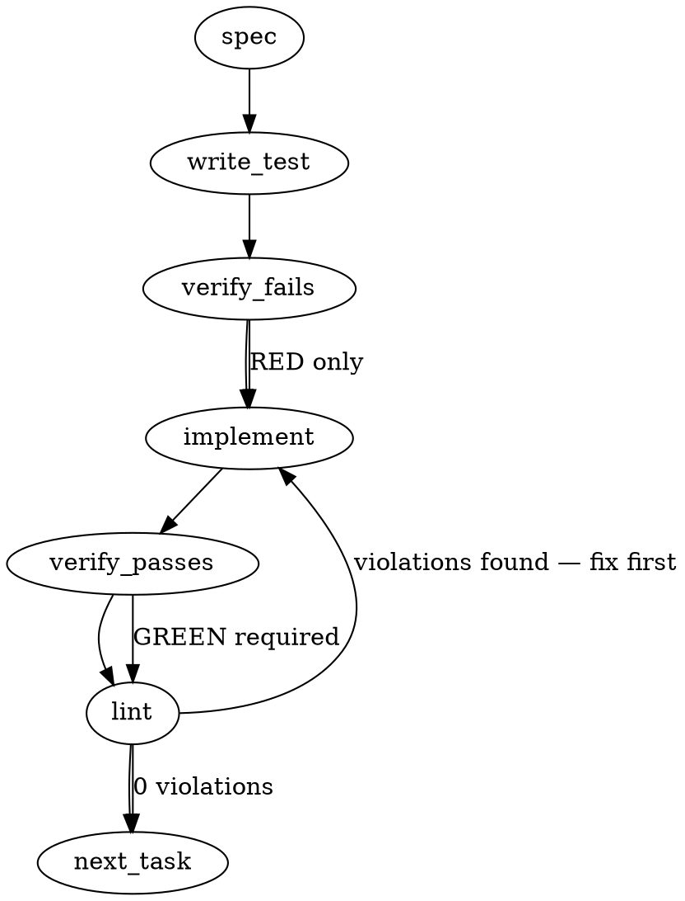

> **Amendment (2026-08-09, pre-merge falsification round — premise falsified in review):** this spec is LLM-drafted and its vendor-integration premise is FALSE. Gemini CLI has **no** filename-convention discovery of `.gemini/hooks/` (zero path-probe hits bundle-wide, re-verified against `@google/gemini-cli` 0.54.4) — registration in `.gemini/settings.json` is the only execution path — and its hook runners are stdin-JSON command processes, not an "agent shell" running `0o755` scripts. The `#!/bin/sh` `before-tool` design below was NOT built. Shipped reality (mmnto-ai/totem#2611): the existing `.gemini/hooks/BeforeTool.cjs` Node template gained a `require.main`-gated stdin entry point that emits the structured `{"decision":"deny","reason"}` stdout decision and exits 2 on violation. Sections below are retained as the generation record only.

### Problem Statement

The goal is to implement the Gemini CLI `before-tool` entrypoint hook during the Totem initialization process. This hook must be set up inside `.gemini/hooks/before-tool`, managed with idempotent self-repairing markers, and properly integrated into the CLI `init` command so that Gemini CLI executes pre-tool checks (e.g. validating state or requiring knowledge search) before running agent tools.

### Architectural Context

- **Gemini CLI Integration:** Gemini CLI loads configurations from `GEMINI.md` and executes hook scripts located in the `.gemini/hooks/` directory.
- **Hook Self-Repair (`mmnto-ai/totem#2410`):** Re-initializing via `totem init` should automatically repair or update the managed portion of the hook script without overwriting user-customized code outside the managed block.
- **File Permissions & Modes:** Executable hooks must be written with proper POSIX execution permissions (`0o755`) to be runnable by the agent shell.

### Files to Examine

1. `packages/cli/src/commands/init.ts` — Order of importance: High. This is where `installGeminiHooks` is defined and hooks are installed/repaired.
2. `docs/wiki/agent-gemini-cli.md` — Order of importance: Medium. Contains documentation about Gemini CLI configuration and hooks.
3. `packages/cli/src/commands/init.test.ts` or similar test files — Order of importance: High. Where we need to add unit and integration tests for the new hook installer.

### Technical Approach & Contracts

We will implement support for the `.gemini/hooks/before-tool` entrypoint in `packages/cli/src/commands/init.ts`.

#### Hook File Structure & Contract

The hook file `.gemini/hooks/before-tool` will have the following contract:

```bash
#!/bin/sh
# <totem-managed-before-tool>
# This block is managed by Totem. Do not edit.
# Totem Gemini Before-Tool Entrypoint
# Ensure basic validations or environment checks run before tools are executed.
# </totem-managed-before-tool>

# User-customized logic can be placed here
```

#### Managed Block Replacement Logic

To maintain idempotency and self-repair capabilities:

1. If the file does not exist, create it recursively with standard header, managed markers, and execution permissions (`0o755`).
2. If the file exists, locate the `# <totem-managed-before-tool>` and `# </totem-managed-before-tool>` markers.
3. If the markers are found, replace only the content between them with the updated Totem managed block.
4. If markers are not found, prepend the managed block to the existing content to avoid losing user customizations.

#### Trade-offs & Recommendation

- **Approach A (Pure Shell Script):** Write a POSIX-compliant bash hook that operates natively in the shell.
- **Approach B (Node.js Bootstrapper):** Write a shell script that invokes a compiled or TS-node script.
- _Recommendation:_ **Approach A**. Standard Gemini CLI hook runners are shell-native, lightweight, and start faster without Node-startup overhead. We will write a clean, cross-platform POSIX shell script.

### Edge Cases & Traps

- **Execution Permissions:** Simply writing a file on Unix/macOS does not make it executable. `fs.writeFileSync` or `fs.chmodSync` MUST explicitly set `0o755` permissions.
- **Missing Parent Directories:** Writing to `.gemini/hooks/before-tool` will throw `ENOENT` if `.gemini/hooks` does not exist. Use `fs.mkdirSync(dir, { recursive: true })` beforehand.
- **Path Separation on Windows:** Use Node's `path` module (`path.join`) to avoid double/mixed slashes.

### Implementation Tasks

- [ ] **Task 1: Define Hook Contract and Content Template**
      Identify or declare the template string for the managed block of the `.gemini/hooks/before-tool` hook.
  - Files to modify: `packages/cli/src/commands/init.ts`
  - Test files: `packages/cli/src/commands/init.test.ts`
    > TEST DIRECTIVE: Before implementing, write a failing test named `should return correct template content with managed markers` to verify the generated hook content has matching start and end tags.
  - Steps:
    1. Define the hook template as a constant in `init.ts`.
    2. Write test case verifying template contains the start/end managed markers.
    3. Run test -> verify fails -> implement -> verify passes -> lint.

- [ ] **Task 2: Implement Directory and Hook Creation with Chmod**
      Write logic to safely create the parent directory and the hook file with execution permissions.
  - Files to modify: `packages/cli/src/commands/init.ts`
  - Test files: `packages/cli/src/commands/init.test.ts`
    > TEST DIRECTIVE: Before implementing, write a failing test named `should create hooks directory and write executable file` that asserts `fs.mkdirSync` is called and the written file has `0o755` mode.
  - Steps:
    1. Update `installGeminiHooks` to resolve `.gemini/hooks/before-tool` path.
    2. Add recursive directory creation.
    3. Write the file with option `{ mode: 0o755 }`.
    4. Run test -> verify fails -> implement -> verify passes -> lint.

- [ ] **Task 3: Implement Idempotent Self-Repair Logic**
      Implement the logic to detect, parse, and repair existing hooks containing the managed markers, preserving user modifications.
  - Files to modify: `packages/cli/src/commands/init.ts`
  - Test files: `packages/cli/src/commands/init.test.ts`
    > TEST DIRECTIVE: Before implementing, write a failing test named `should repair managed block and preserve user customizations` that runs the hook installer over a file containing custom user text.
  - Steps:
    1. Add string parsing logic to check for `<totem-managed-before-tool>` markers.
    2. Replace the old block with the new block if found; prepend if not found.
    3. Run test -> verify fails -> implement -> verify passes -> lint.

- [ ] **Task 4: Add Hook to `installGeminiHooks` Results List**
      Ensure the new hook execution status is returned in the `HookInstallerResult` array from `installGeminiHooks`.
  - Files to modify: `packages/cli/src/commands/init.ts`
  - Test files: `packages/cli/src/commands/init.test.ts`
    > TEST DIRECTIVE: Before implementing, write a failing test named `should return install status for before-tool hook` that validates the returned list contains a result with path `.gemini/hooks/before-tool`.
  - Steps:
    1. Append the result of `.gemini/hooks/before-tool` generation to the results array.
    2. Run test -> verify fails -> implement -> verify passes -> lint.

### Execution Flow



### Verification

Every implementation MUST end with these steps:

1. `totem lint` — deterministic rule check (zero LLM, ~2s). Fixes any violations.
2. `totem review` — supplementary AI lanes over the diff (~18s, advisory). Address critical findings; your team's review discipline decides the review of record.

### Test Plan

1. **New Hook Initialization:** Verify that running `totem init` in an empty directory correctly creates `.gemini/hooks/before-tool` with permissions `0o755`.
2. **Idempotency / Re-run:** Verify that re-running `totem init` on an existing directory updates the managed section of the hook without modifying any user-added lines below or above the block.
3. **No-marker Fallback:** Verify that running `totem init` on an existing hook file that lacks managed markers prepends the managed block to the start of the file.
