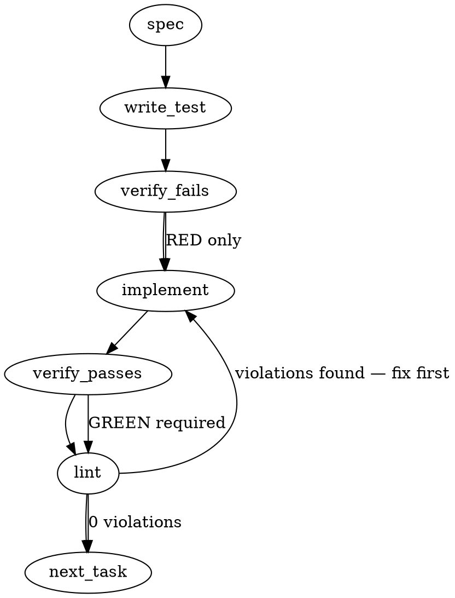

> **Amendment (2026-08-09, pre-build — generation record only):** this spec is LLM-drafted and its envelope design is invented — there is no `<totem-session-context>` XML contract anywhere in the vendor surface. The real defect (mmnto-ai/totem#2613, leg-verified against `@google/gemini-cli@0.54.4`) is that interactive Gemini ingests SessionStart output ONLY from the `hookSpecificOutput.additionalContext` JSON envelope (plain exit-0 stdout wraps as `systemMessage`, which the interactive startup consumer never reads), so the shipped fix captures the `totem describe` / `totem orient --session` output and emits `{"hookSpecificOutput":{"hookEventName":"SessionStart","additionalContext":...}}` — the same envelope this repo's own `.claude/hooks/session-context.mjs` uses (the mmnto-ai/totem#2522 cold-boot lesson). The `doctor-parity.ts` file pointers below are also wrong for this change; the artifact is `GEMINI_SESSION_START` in `packages/cli/src/commands/init-templates.ts`. Sections below are retained as the generation record only.

### Problem Statement

The current `SessionStart` templates (e.g., Claude session hooks) output plain text status blocks. This unstructured format risks being misparsed by AI agents or merged with user prompt context, and missing error boundaries can cause IDE/agent boot crashes if the `totem` binary is unavailable. We need to encapsulate this hook output inside a robust, structured XML envelope (`<totem-session-context>`) that safely handles execution errors and prevents agent crashes.

### Architectural Context

- **docs/wiki/governing-ai-agents.md** highlights context injection via `SessionStart` hooks.
- **docs/wiki/cli-reference.md** states that `--session` flags are meant to be boot-safe. The envelope design must reinforce this safety guarantee.

### Files to Examine

1. `packages/cli/src/commands/doctor-parity.ts` — Contains `sessionStartArtifactsFor` and the canonical template strings (such as `templates.claude`).
2. `packages/cli/src/commands/init.ts` — Scaffolds Claude's session start hook through `scaffoldClaudeSessionStart`.
3. `packages/cli/tests/doctor-parity.test.ts` (or equivalent CLI test suite) — For writing TDD unit tests asserting artifact schema correctness.

### Technical Approach & Contracts

We will update the hook script template (`templates.claude`) to output a structured XML payload containing metadata and command outputs inside `CDATA` blocks. If execution fails, the template script must trap the error and output a safe, enveloped error description instead of raising an unhandled exception.

#### Output XML Contract

```xml
<totem-session-context version="1.0">
  <metadata>
    <timestamp>2023-10-27T10:00:00.000Z</timestamp>
    <cwd>/path/to/repo</cwd>
  </metadata>
  <status>
    <![CDATA[
    [Status] Branch: main (clean)
    [Status] Rules: 439 compiled
    ]]>
  </status>
</totem-session-context>
```

#### Output Error Contract

```xml
<totem-session-context version="1.0" error="true">
  <metadata>
    <timestamp>2023-10-27T10:00:00.000Z</timestamp>
    <cwd>/path/to/repo</cwd>
  </metadata>
  <error><![CDATA[Failed to execute 'totem status': [Error details/stack/code]]]></error>
</totem-session-context>
```

### Edge Cases & Traps

1. **Command Not Found:** The target environment executing the hook might not have `totem` globally available on `PATH`. The hook script must catch this safely inside a `try/catch` and output the Error Contract instead of failing the parent shell process.
2. **CDATA Nested Violations:** If the command output contains `]]>`, it could prematurely close the CDATA section. The hook script template must replace any occurrences of `]]>` with `]]&gt;` inside the CDATA wrapper block.
3. **Boot-Safe Environment Escapes:** If run outside of a valid git root, the hook template must resolve cleanly without crashing.

### Implementation Tasks

- [ ] **Task 1: Design the Enveloped Template Structure**
  - Update `packages/cli/src/commands/doctor-parity.ts` (or the respective template module) to wrap the output of `totem status` and metadata in the defined `<totem-session-context>` XML schema.
  - Implement a `CDATA` escaping utility function inside the generated template code to sanitize `]]>` into `]]&gt;`.
  - > TEST DIRECTIVE: Before implementing, write a failing test named `generates_enveloped_session_start_hook` in the CLI command test suite that asserts the generated template output contains `<totem-session-context>`, `<metadata>`, `<status>`, and `CDATA` sections.
  - write test → verify fails → implement → verify passes → lint

- [ ] **Task 2: Inject Safe Execution Error Boundaries**
  - Modify the generated hook script JS source to run command execution inside a robust `try-catch` block.
  - In the catch block, populate the `<error>` XML node with the caught error details and mark the root element with `error="true"`.
  - > TEST DIRECTIVE: Before implementing, write a failing test named `hook_script_handles_missing_totem_gracefully` that runs/evaluates the generated template string with a mocked failing environment to verify it writes the `<error>` tag and does not throw uncaught exceptions.
  - write test → verify fails → implement → verify passes → lint

- [ ] **Task 3: Align Doctor Parity & Scaffold Commands**
  - Ensure `scaffoldClaudeSessionStart` in `packages/cli/src/commands/init.ts` accurately provisions the updated template.
  - Verify that `totem doctor` (or its equivalent verification step) checks for parity using the new template layout and does not trigger outdated drift errors.
  - write test → verify fails → implement → verify passes → lint

### Execution Flow (structural constraint)



### Verification (MANDATORY — do not skip)

Every implementation MUST end with these steps:

1. `totem lint` — deterministic rule check (zero LLM, ~2s). Fixes any violations.
2. `totem review` — supplementary AI lanes over the diff (~18s, advisory). Address critical findings; your team's review discipline decides the review of record.
3. If using MCP, call `verify_execution` to confirm compliance before declaring the task done.

### Test Plan

- **Template Generation Validation:** Assert that the generated output from `sessionStartArtifactsFor` conforms to the defined XML structure.
- **Safety Test:** Run the template string inside a clean VM context (or a node process execution wrapper) with an invalid `PATH` environment to verify it exits with `0` and emits a structured `<error>` node.
- **CDATA Sanitization Test:** Assert that simulated console outputs containing nested XML-like blocks or `]]>` are correctly escaped and do not corrupt the envelope markup.
