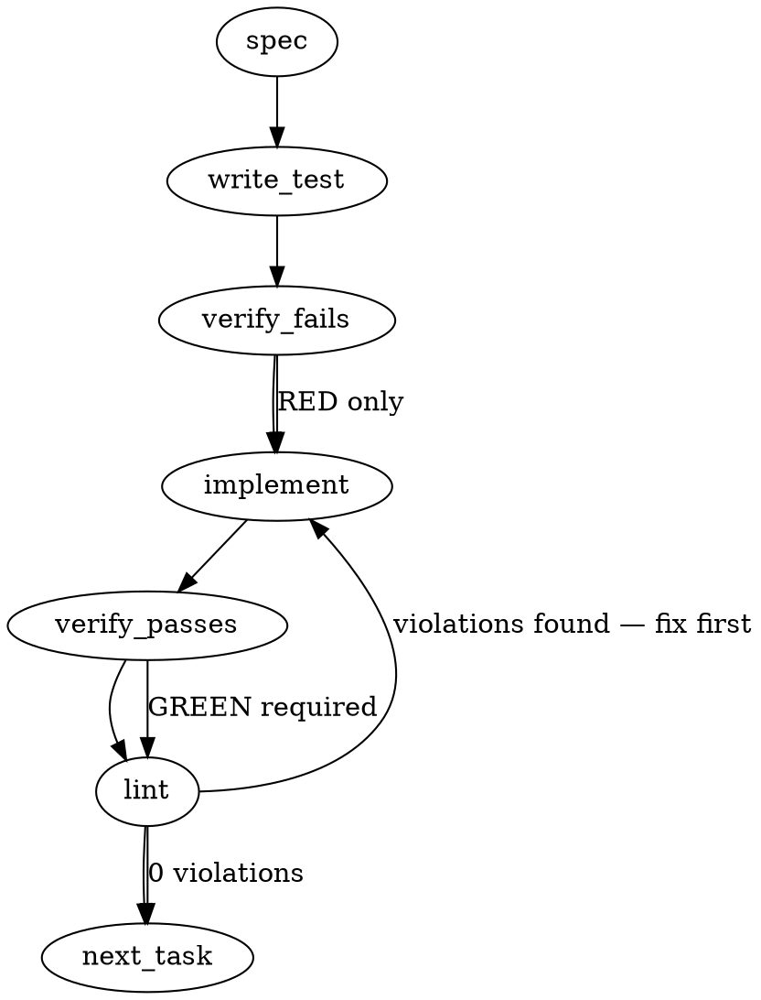

### Problem Statement

To prevent data corruption, partial file writes, and untracked user data loss, Totem needs a strict user-file write-safety contract. This requires introducing atomic file-writing helpers (temp + rename), adding uncommitted change detection (dirty-tree sensing) before destructive commands like `eject`, and creating backup files (`.totem-bak`) for non-version-controlled targets (such as `.git/hooks`).

### Architectural Context

None found in provided context.

### Files to Examine

1. `packages/cli/src/commands/eject.ts` — Contains the logic for the `eject` command, including `scrubReflexFiles` and user prompting.
2. `packages/cli/src/utils/fs.ts` — The filesystem utility layer where the new atomic writing contracts and shared functions must be implemented.
3. `packages/cli/src/commands/hook.ts` — Hook installation/manipulation where `.git/hooks` scrubbing and updates are performed.

---

### Technical Approach & Contracts

#### 1. Atomic Write Helper Contract

We will expose atomic-write primitives in `packages/cli/src/utils/fs.ts` (or the corresponding core utility module).

Writing directly to a target file via `fs.writeFileSync` can result in truncated or half-written files if a process crashes mid-write, or if permissions block the write after opening. To prevent this, the helper will:

1. Write the content to a unique temporary file in the _same_ directory as the target file.
2. Atomically rename the temporary file to the target file.

##### Why the same directory?

Creating the temporary file in the same directory avoids `EXDEV` errors (cross-device link) when moving files across different mounted filesystems (e.g., from `/tmp` to a mounted user directory).

##### TypeScript Contract:

```typescript
export interface AtomicWriteOptions {
  encoding?: BufferEncoding;
  mode?: number;
}

/**
 * Atomically writes data to a file by writing to a temporary file
 * in the same directory first and then renaming it.
 */
export function writeAtomicSync(
  filePath: string,
  content: string | Buffer,
  options?: AtomicWriteOptions,
): void;

/**
 * Asynchronously and atomically writes data to a file.
 */
export function writeAtomic(
  filePath: string,
  content: string | Buffer,
  options?: AtomicWriteOptions,
): Promise<void>;
```

#### 2. Dirty-Tree Sensing Contract

Destructive commands (like `eject`) must check whether files to be modified have uncommitted changes.

##### Logic Flow:

1. Resolve the Git root using `resolveGitRoot`. If the user is not in a Git repository, skip the dirty-tree sense warning.
2. Retrieve the status of the target files that are candidates for scrubbing/mutation (e.g., CLAUDE.md, hook paths, config files).
3. Query Git using `safeExec` to see if those files are dirty:
   ```bash
   git status --porcelain -- <target_files>
   ```
4. If files are modified or untracked:
   - Unless `--force` is provided, print a warning list of dirty files.
   - Halt execution or prompt for explicit consent with a clear indicator that changes are uncommitted.

#### 3. Non-VCS Surface Backup Contract

For any mutation of files inside non-version-controlled locations (specifically `.git/hooks/*`), we must write a backup of the pre-scrubbed bytes to a neighboring `.totem-bak` file.

##### Logic Flow:

1. Before writing the scrubbed hook file (e.g., `.git/hooks/pre-commit`), read its existing content.
2. Write the exact pre-scrubbed content to `.git/hooks/pre-commit.totem-bak` using the atomic-write helper.
3. Proceed to write the clean/scrubbed version to `.git/hooks/pre-commit`.
4. Register the backup file path in the `EjectSummary` so the user is informed of the backup location in the command output.

---

### Edge Cases & Traps

1. **EXDEV (Cross-Device Rename Error):**
   If `os.tmpdir()` is used, the OS temporary directory might be on a different partition than the workspace. Moving/renaming files across filesystems fails with `EXDEV`.
   _Prevention:_ The temporary file MUST be created in `path.dirname(targetFilePath)`.
2. **Concurrent Temp File Collisions:**
   If multiple processes write to the same file simultaneously, they must not overwrite each other's temporary files.
   _Prevention:_ Use a unique naming scheme for the temp file: `.${filename}.tmp-${process.pid}-${Date.now()}-${Math.random().toString(36).substring(2, 8)}`.
3. **Temp File Litter on Failure:**
   If writing to the temp file fails (e.g., disk full, encoding error), the temp file must not be left behind on disk.
   _Prevention:_ Wrap the write operation in a `try...catch` or `try...finally` block to ensure the temp file is cleaned up if the atomic write fails before the rename phase.
4. **Permissions/EACCES/EPERM on Rename:**
   On Windows, an open file descriptor held by another process can cause a rename to fail with `EACCES` or `EPERM`.
   _Prevention:_ Ensure all file descriptors are closed before renaming, and catch errors gracefully to provide context.

---

### Implementation Tasks

- [ ] **Task 1: Implement Atomic Write Utilities**
  - Implement `writeAtomicSync` and `writeAtomic` inside `packages/cli/src/utils/fs.ts` using the temp-and-rename approach.
  - Implement cleanup logic in a `finally` block to remove the temp file if the write fails.
    > TEST DIRECTIVE: Before implementing, write a failing test named `should_prevent_partial_writes_and_cleanup_temp_on_failure` that verifies the temp file is cleaned up if writing fails, leaving the original target file untouched.
  - Write test -> verify fails -> implement -> verify passes -> lint

- [ ] **Task 2: Integrate Atomic Writes in Eject and Hook Workflows**
  - Replace direct calls to `fs.writeFileSync` in `packages/cli/src/commands/eject.ts` (specifically inside file-scrubbing routines) with `writeAtomicSync`.
  - Replace any direct hook-file writes in `packages/cli/src/commands/hook.ts` with `writeAtomicSync`.
    > TEST DIRECTIVE: Before implementing, write a failing test named `should_atomically_write_scrubbed_reflex_files` that mocks `fs.renameSync` to verify the execution path passes through the atomic helper.
  - Write test -> verify fails -> implement -> verify passes -> lint

- [ ] **Task 3: Implement Dirty-Tree Sensing in Eject Command**
  - In `packages/cli/src/commands/eject.ts`, use `resolveGitRoot` to check if inside a Git repository.
  - Use `safeExec` to run `git status --porcelain -- <target_files>` to check for uncommitted changes to files targeted for ejection.
  - Display a warning list of dirty files before the consent prompt, allowing bypass ONLY when `--force` is provided.
    > TEST DIRECTIVE: Before implementing, write a failing test named `should_warn_on_dirty_target_files_before_consent` that simulates dirty files in the target set and verifies a warning is output.
  - Write test -> verify fails -> implement -> verify passes -> lint

- [ ] **Task 4: Implement Hook Backups (`.totem-bak`)**
  - In `packages/cli/src/commands/eject.ts` (or `hook.ts` depending on the helper responsible for hook scrubbing), check if a hook file exists prior to mutation.
  - Write the existing hook content to `<hook-path>.totem-bak` using the new atomic write helper.
  - Register and output the backup location in the command's final summary.
    > TEST DIRECTIVE: Before implementing, write a failing test named `should_create_backup_file_for_non_vcs_hooks` that ensures a `.totem-bak` file is created containing the exact original hook content before scrubbing.
  - Write test -> verify fails -> implement -> verify passes -> lint

---

### Execution Flow



---

### Verification

Every implementation MUST end with these steps:

1. `totem lint` — deterministic rule check (zero LLM, ~2s). Fixes any violations.
2. `totem review` — supplementary AI lanes over the diff (~18s, advisory). Address critical findings.

---

### Test Plan

#### 1. Atomic Writes

- **Unit Tests:**
  - Verify `writeAtomicSync` writes the correct content to the target file destination.
  - Verify original file content is intact if the write operation fails mid-way (fault injection).
  - Verify temporary files are deleted after successful or failed operations.
  - Verify cross-filesystem compatibility by asserting the temp file is created in the same parent directory as the target.

#### 2. Dirty-Tree Sensing

- **Integration Tests:**
  - Mock `safeExec` to return a simulated dirty state for target files (e.g., `M CLAUDE.md`). Verify the command emits a warning and pauses for confirmation.
  - Verify `--force` bypasses the warning and executes the command anyway.
  - Verify the command executes normally without warning if Git status returns empty (clean repository).

#### 3. Hook Backups

- **Integration Tests:**
  - Simulate a pre-existing `.git/hooks/pre-commit` file containing custom script bytes.
  - Execute the scrubbing sequence and assert that `.git/hooks/pre-commit.totem-bak` is created.
  - Verify the backup matches the original hook bytes exactly.
  - Verify that the generated file summary contains the paths of any created `.totem-bak` files.

---

## Implementation Design

**Corrections to the generated spec above** (verified against the shipped Tenet-4 corollary at `@mmnto/strategy-doctrine` 0.1.33 / strategy `design-tenets.md` @ `7b8d1c7`, and the #2620 leg-finding comments): the helper lands in **core** (`@mmnto/totem`), not `packages/cli/src/utils/fs.ts` — leg finding 3 mandates consolidating the two existing core helpers, not minting a third; the dirty-tree sense **never halts** ("Halt execution" above contradicts corollary rule 2 — sense-and-say, Tenet 13; a consent flag skips the prompt, not the sense); no async variant ships (every current call site is sync — Tenet 21).

### Scope (slice 1)

Ship the shared atomic-write helper in core (consolidating the three existing implementations), convert eject's five write sites to it, add the dirty-tree sense line before eject's consent prompt, write `.totem-bak` recovery artifacts before any `.git/hooks` mutation, and close scrubReflexFiles' Tenet-4 licensing gap (accounting + loud backstop + the false "carve-out" citations). Explicitly NOT in this PR: the repo-wide writers sweep (measured this session: **~20 inline temp+rename sites** across cli+core, several with race-prone static `.tmp` suffixes — slice 2, at-touch-time per ADR-075 §3), the `migrate-lessons` `.bak` disposition (rides the sweep), `install-hooks.ts` writer conversion (slice 2 at-touch), and ADR-113 implementation.

### Data model deltas

- **`writeFileAtomicSync(targetPath: string, data: string | Buffer, opts?: { mode?: number })`** — new export from core barrel, new module `packages/core/src/fs-atomic.ts`. No state containers; throws on failure. Contract (corollary rule 1 + addendum): resolve through an existing symlink target (`realpath`) so link identity survives; unique same-volume temp (`<target>.<pid>-<uuid8>.tmp` — two banked lessons: PID/time-only entropy collides); fsync the temp fd before rename (declared boundary: no directory fsync — not portable on Windows); preserve an existing target's mode via explicit chmod (POSIX-only, matching `install-hooks.ts` `HOOK_EXECUTABLE_MODE` convention — `.git/hooks` are 0755, a bare rename would disarm them at 0644); temp cleaned up on every failure path. **Ordering is contract, not implementation detail (author intent-read, Q2):** write temp → fsync → apply mode/ownership TO THE TEMP → rename last. A metadata failure unlinks the temp and throws with old bytes as the entire observable state — rename-then-repair would ship new-bytes-with-wrong-metadata, a torn state in metadata clothing.
- **Consolidated callers (delegating, signatures unchanged):** `worktree-registry.ts#writeAtomic`, `ingest/pipeline.ts#writeJsonAtomic`, `verification-outcomes.ts` inline block → all call the shared helper. Byte-identical output is a regression invariant.
- **`EjectSummary`** — unchanged shape; `.totem-bak` paths and the `--force` dirty trailer report through existing `scrubbed`/`skipped` string arrays.

### State lifecycle

No new persistent state. The temp file is per-invocation, created and consumed (renamed or deleted) inside one helper call. `.totem-bak` files are per-eject recovery artifacts in `.git/hooks/` (never git-visible, rule-3-licensed; a later eject with totem content present overwrites them — last-pre-mutation-wins).

### Failure modes

| Failure                                               | Category  | Agent-facing surface                                                                                           | Recovery                                   |
| ----------------------------------------------------- | --------- | -------------------------------------------------------------------------------------------------------------- | ------------------------------------------ |
| Temp write fails (ENOSPC, EPERM)                      | runtime   | throw from helper; eject per-item catch reports skip                                                           | target untouched (old bytes); temp removed |
| Rename fails (Windows open-handle EPERM/EACCES class) | transient | throw with context; eject reports skip                                                                         | target untouched; temp removed             |
| fsync fails                                           | runtime   | throw (torn-durability is rule 1's own class)                                                                  | target untouched                           |
| chmod on temp fails (POSIX)                           | runtime   | throw — silent mode drift would disarm hooks                                                                   | target untouched                           |
| Target is a dangling/cyclic symlink                   | permanent | throw (loud) — cannot honor link identity                                                                      | target untouched                           |
| `.totem-bak` write fails                              | runtime   | **hook mutation skipped entirely**, reported with reason — recovery-before-mutation is load-bearing (addendum) | hook untouched                             |
| `git status` sense fails                              | transient | honest "could not derive VCS state" warn line; eject proceeds                                                  | none needed — sensor, not gate (Tenet 13)  |
| Not a git repo                                        | init      | "no VCS revert point" warn line; proceeds                                                                      | n/a                                        |
| Every reflex-file scrub fails                         | runtime   | **throw** (`attempted > 0 && succeeded === 0` backstop — Tenet 4 licensed shape, leg finding 4)                | per-item skips already reported            |
| Hook bytes don't round-trip UTF-8                     | permanent | reported skip — scrubbing would substitute U+FFFD into kept user content                                       | hook untouched; remove block manually      |
| Roster path is gitignored (secrets, index)            | init      | dedicated sense line (`--ignored=matching`): "git holds no copy of these at all"                               | user decides at the consent prompt         |

No silent-degradation rows.

**Falsification-round amendments (2026-08-09 leg, absorbed):** the backstop throw is **deferred past step 7 and the summary print**, then rethrown — firing early destroyed the very accounting surface (skip reasons, `.totem-bak` paths) that licenses it and left eject half-done with `.totem/` intact but hooks mutated (finding 1). The bak is written from the **raw Buffer**, byte-exact (finding 3). The sense covers **gitignored** roster members — plain porcelain reads "invisible to git" as "clean" for exactly the paths with no git copy at all (finding 2). Declared helper boundaries added: hard-link identity not preserved (nlink decouples on rename), cross-uid chown now throws where in-place writes once succeeded, parent-directory write permission is required, hard-kill temp litter is unreapable today (findings 6, 7, 12). The spec-declared ordering control (induced hook-write failure → bak present + hook untouched) is implemented (finding 4).

### Invariants to lock in via tests

- Induced failure at any point between temp-open and rename leaves the target byte-identical and no temp residue (old-or-new, never torn).
- Two invocations against one target never share a temp path.
- A 0755 target is still 0755 after write (POSIX assert; win32 skip states why); a symlink target is still a symlink, content lands through it.
- The three consolidated writers produce byte-identical files vs HEAD (their existing tests, incl. temp-cleanup asserts, stay green with the new suffix).
- `.totem-bak` exists with exact pre-mutation bytes and source mode BEFORE the hook is mutated (induced post-bak failure: bak present + hook unchanged); both the scrub-write and full-removal paths bak.
- The dirty sense line: fires pre-prompt on dirty roster files only, fires under `--force` (plus summary trailer), honest lines for non-repo/underivable, never changes exit code or blocks.
- Existing byte-exact eject scrub suite (15 tests) green — atomic conversion changes no bytes.
- Backstop: all-fail throws; partial success does not.

### Open questions

None. All three were resolved by the doctrine author's intent-read (strategy-claude dispatch `2026-08-09T2048Z-totem-claude-re-corollary-intent-read-x3-all`; no tenet-text change minted — these are readings the text supports, recorded here and in the slice's tests):

1. **Bak on BOTH `.git/hooks` mutation paths (partial scrub-write AND full unlink).** Rule 3's "beyond derivable state" qualifies the home-dir clause only — `.git/hooks/*` is a rule-3 surface **by surface class**, no derivable-state escape. Recovery keys off the surface, never off the mutation-time content claim ("these bytes are fully ours" is a belief produced by the same logic that would be the bug — the #2602 provenance is that belief failing).
2. **Ownership-preservation failure THROWS.** Cross-uid EPERM is a permissions/environment condition, never "expected" under Tenet 4's boundary carve-out — warn-and-proceed would be a rationalized swallow. Composition: helper throws loud → eject's per-item catch accounts it failed-by-class → backstop stays armed. Ordering constraint folded into the helper contract above (metadata on temp, rename last).
3. **Deletions count in the dirty-tree sense roster.** Deletion is the limiting case of mutation (new state = absent); for a tracked-dirty file the delete has no recovery route, which is exactly what the sense line must surface before consent. Roster derives from the shared constants (Tenet 20 — a hand-mirrored sense list would be the prohibited mirror inside the rule built to prevent silent loss).
