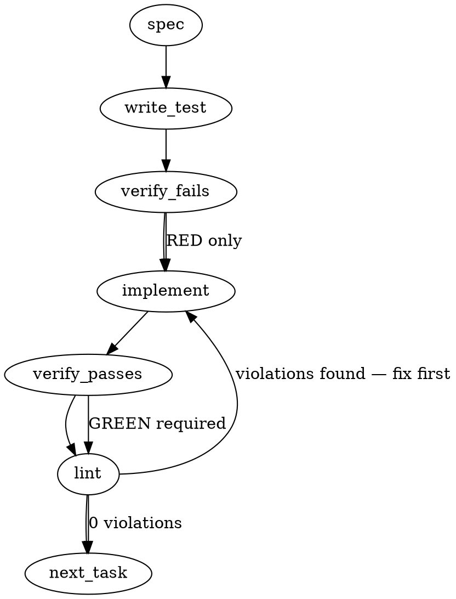

### Problem Statement

On shared multi-seat machines, a seat session with no identity of its own can inherit another seat's identity and session ID due to `TOTEM_SELF_AGENT` being set at the user/machine level (registry) and resolving the shared `.totem/ledger/.session-id` pointer. This causes cross-seat fallthrough and ledger contamination, specifically during the `2026-08-12T06:00:00.000Z` to `2026-08-12T06:47:00.000Z` window under session `b8d7aa9b…`.

### Architectural Context

- **M1 instrument (#2468/#2625):** Tracks metrics and ledger events for baseline validation. Joining is done by (`agent_source`, `session_id`), meaning contamination directly inflates or hides seat activity.
- **Tenet 13 / Candidate Sense:** Disclose attribution provenance alongside `agent_source` so that ambient/stamped identities can be distinguished post-hoc.
- **Shared Helpers:** `safeExec` must be used to execute the Windows `reg` utility to inspect env scopes. Do not use `child_process.execSync`.

### Files to Examine

- `packages/cli/src/commands/doctor-seat-identity.ts` — Most critical. The doctor command diagnosing seat identity issues. Needs to be extended with Windows registry checks for ambient env var pollution.
- `packages/core/src/qbd/record.ts` — Contains record-building functions (`buildAndWriteDerive`). This must be updated to determine and output the provenance of the resolved seat/agent identity.
- `packages/core/src/ledger/query.ts` (or equivalent query/reader file in your workspace) — Responsible for reading and preparing ledger records for baselines; must implement the exclusion filter for the contaminated `b8d7aa9b...` 2026-08-12T06:00-06:47Z window.

### Technical Approach & Contracts

#### 1. Attribution Provenance Schema

Define an explicit data contract for attribution provenance.

```typescript
export type AttributionProvenance = 'process-env' | 'ambient-registry' | 'absent';
```

Add `agent_source_provenance` of type `AttributionProvenance` to the base ledger event schemas in `packages/core/src/qbd/record.ts`.

#### 2. Scope Validation Sequence

When resolving the agent identity in both `checkSeatIdentity` and event record builders:

```
[Process Start]
       │
       ▼
Is TOTEM_SELF_AGENT defined in process.env? ──(No)──► 'absent'
       │
      (Yes)
       │
Is platform 'win32'?
       │
      (Yes) ──► Query Registry: "reg query HKCU\Environment /v TOTEM_SELF_AGENT"
       │                       "reg query HKLM\System\... /v TOTEM_SELF_AGENT"
       │                              │
       │                        (Any Success?) ──(Yes)──► 'ambient-registry'
       │                              │
       │                             (No)
       │                              │
       └──────────────────────────────┴────────────────► 'process-env'
```

#### 3. Exclusion Filter Contract

In the ledger baseline parser/query loader, implement a deterministic exclusion filter for the contaminated live specimen window:

```typescript
export interface ContaminationWindow {
  startTime: number;
  endTime: number;
  sessionIdPrefix: string;
}

export const CONTAMINATED_WINDOWS: ContaminationWindow[] = [
  {
    startTime: 1770789600000, // 2026-08-12T06:00:00Z
    endTime: 1770792420000, // 2026-08-12T06:47:00Z
    sessionIdPrefix: 'b8d7aa9b',
  },
];
```

---

### Edge Cases & Traps

- **Registry Query Performance:** Calling external CLI commands can introduce latency. Registry inspection must only run during explicit diagnostic runs (`doctor-seat-identity`) or once at startup, never hot-path per recorded event.
- **Platform Limitations:** The `reg` tool is Windows-only. Ensure Unix environments immediately fallback to scanning standard process env checks without attempting to spawn registry processes (which would throw `ENOENT`).
- **Timezone Offsets:** Parse baseline timestamps strictly in UTC to ensure matching is immune to the local runner's timezone offset.
- **Silent failures of `reg query`:** Windows registry keys might not exist, which causes `reg` to return exit code `1`. Wrap registry queries in `try-catch` and treat non-zero exits as "not present in registry" rather than fatal errors.

---

### Implementation Tasks

- [ ] **Task 1: Define Attribution Provenance Types and Schemas**
  - Update `packages/core/src/qbd/record.ts` (or the core schemas file) to define the `AttributionProvenance` type.
  - Update the input and output record interfaces to include `agent_source_provenance`.
  - TEST DIRECTIVE: Before implementing, write a failing test named `rejects_missing_provenance_field` verifying that the record builder requires a valid provenance value.

- [ ] **Task 2: Implement Registry Scope Diagnostic Check**
  - In `packages/cli/src/commands/doctor-seat-identity.ts`, implement a helper function using `safeExec` to detect registry-level `TOTEM_SELF_AGENT`.
    > TOTEM INVARIANT (Shared Helpers): Use `safeExec` imported from `@mmnto/totem` for running the `reg query` command. Do NOT use standard `child_process`.
  - Add the check to the diagnostic output, failing if the variable is defined at the machine/user registry scope.
  - TEST DIRECTIVE: Before implementing, write a failing test named `detects_windows_user_registry_contamination` that mocks `safeExec` returning exit code `0` for `reg query` and asserts that the doctor diagnostic fails.

- [ ] **Task 3: Integrate Provenance Resolution in Ledger Recording**
  - Integrate the provenance check into `buildAndWriteDerive` in `packages/core/src/qbd/record.ts`.
  - Ensure it correctly tags records as `'process-env'`, `'ambient-registry'`, or `'absent'`.
  - write test → verify fails → implement → verify passes → lint

- [ ] **Task 4: Implement Baseline Exclusion Filter**
  - In the ledger query processor/reader (`packages/core/src/ledger/query.ts` or equivalent), implement the `isContaminatedRecord` function using the `CONTAMINATED_WINDOWS` contract.
  - Apply the filter to discard contaminated records during baseline calculations.
  - TEST DIRECTIVE: Before implementing, write a failing test named `excludes_contaminated_august_12_records` with sample records spanning `2026-08-12T05:59:00Z` to `06:48:00Z` to verify precise window exclusion.
  - write test → verify fails → implement → verify passes → lint

---

### Execution Flow (structural constraint)



---

### Verification (MANDATORY — do not skip)

Every implementation MUST end with these steps:

1. `totem lint` — deterministic rule check (zero LLM, ~2s). Fixes any violations.
2. `totem review` — supplementary AI lanes over the diff (~18s, advisory). Address critical findings.
3. If using MCP, call `verify_execution` to confirm compliance before declaring the task done.

---

### Test Plan

- **Diagnostic Registry Tests:** Mock platform as `win32` and verify diagnostic outputs for both clean and polluted registries.
- **Provenance Resolution Tests:** Verify correct attribution tags across different environment layouts (e.g. absent, only process, and registry-polluted).
- **Exclusion Filter Tests:** Feed a list of mock ledger records containing:
  1. Record in the window but with a different session ID (Should keep)
  2. Record with the correct session ID but outside the window (Should keep)
  3. Record in the window with the contaminated session ID `b8d7aa9b...` (Should exclude)

---

## Implementation Design

**Ruling supersedes the synthesized spec above.** The sections above were LLM-synthesized from the issue body alone and predate the operator ruling recorded in the issue comments (2026-08-12, strategy-claude recording). Where they conflict, the ruling governs — three divergences named: (1) provenance enum is the ruled two-value `env | absent`, not `process-env | ambient-registry | absent`; (2) the seam is `deriveSearchLogAttribution` + the manifest row builder, not QBD `record.ts`; (3) the `CONTAMINATED_WINDOWS` consumer-side exclusion filter is NOT built here — the consumer side is already bound in strategy's #467 pre-registration Revision 2 (exclusion window carried there; building it in totem would duplicate a consumer-lane contract).

### Scope

Build the ruled provenance/fail-closed attribution sensor at the MCP-side env-stamp seams: one shared core sense that derives `agent_source` + `agent_source_provenance` per call from process env, cross-checked against the session pointer's minting seat (derived from the pointer session's `session_start` row in `events.ndjson`), consumed by `deriveSearchLogAttribution` (search-log rows) and `buildSelectionManifestRow`'s pointer branch (manifest rows — the #467 join surface), plus a win32-only registry scope-sense arm on `totem doctor`'s existing Seat Identity row. Explicitly NOT: QBD ledger events (read-side correlation already fail-closes on seat mismatch; touching them shifts compliance-metric semantics — follow-up issue if wanted), the conflict probe on rendered hook templates (self-minted rows: the minting seat IS the env read in the same process, so the probe is structurally inapplicable — but ruled item 1's disclosure half DOES bind them: the fold after the falsification leg stamps `agent_source_provenance` in both template row literals + the regenerated parity-locked `.gemini` hook), `mcp_call` events (carry no `agent_source` today — the wrong-session half for sessionless seats is #2628's fix + the #2204 kimi residual, not this sensor), any consumer-side exclusion filter, and no change to `session_id` stamping semantics anywhere (on conflict the row keeps its honest pointer/env session value; only the attribution is withheld).

### Data model deltas

- **`AgentAttributionSense`** (new; `packages/core/src/attribution-sense.ts`): `{ agent_source: string | null; agent_source_provenance: 'env' | 'absent'; attribution_conflict?: { env_seat: string; minting_seat: string; pointer_session_id: string }; attribution_probe_error?: string }`. Written by `senseAgentAttribution({ totemDir?, env? })`; read by both stamp seams. Pure value, no module state.
- **`readSessionMintingSeat(totemDir, sessionId)`** (new; same module): scans `events.ndjson` backwards for the newest `session_start` row with matching `session_id`; returns `{ found: true, seat: string | null } | { found: false }`. Malformed lines skipped per line (the `parseSearchLog` tolerance precedent). Single full read + backward scan per call (4.7 MB / 16.6k lines observed locally, tens of ms inside seconds-long tool calls; a bounded tail-window read is a named future optimization, not built).
- **`SearchLogEntry`** gains optional `agent_source_provenance`, `attribution_conflict`, `attribution_probe_error` (shapes above). `SearchLogAttribution` extends to match. Consumers: `parseSearchLog` is field-tolerant — unchanged.
- **`SelectionManifestRowSchema`** (strict) gains the same three fields as `.optional()`. Additive-optional migration (the ADR-078 `agent_source` amendment shape): pre-sensor rows parse under the new schema. Named compat risk: the schema is `.strict()`, so readers at ≤1.115.0 skip rows written by the new emitter — and the skip is SILENT: `readSelectionManifests` counts only JSON-parse throws as malformed, so schema-invalid rows drop with no disclosure on old readers. Bounded by the planned single cohort bump (sensor ships inside the 1.116.0 batch; #467 run reads happen at run-time CLI versions ≥ sensor).
- **`SeatIdentityFindingClass`** gains `'env-ambient-scope'` (doctor arm d).
- No reserved keys or sentinel values: a conflict is a separate field, never a magic `agent_source` value. Invariant `agent_source_provenance === 'env'` ⟺ `agent_source` present is writer-guaranteed (both seams call the one sense).

### State lifecycle

No new state containers. The sense is derived per call from env + two file reads (pointer, events.ndjson), returned by value, and never cached at any scope — ruled item 3: a session-lifetime cache converts a transient contamination into a whole-session one (the `b8d7aa9b` shape). `logSearch` derives `totemDir` from `path.dirname(logFilePath)` per call (when `setLogDir` was never called, the sense runs env-only with no conflict probe — a normal, disclosed state: provenance still stamped). Existing search-log module state (`entries[]`, `logFilePath`) untouched. The doctor arm holds no state; it spawns `reg query` fresh per doctor invocation.

### Failure modes

| Failure                                                               | Category                 | Agent-facing surface                                                                                                                                                                                                                                                                                                                                                                  | Recovery                                                                                                                                                                                                                                                                                                                                                                        |
| --------------------------------------------------------------------- | ------------------------ | ------------------------------------------------------------------------------------------------------------------------------------------------------------------------------------------------------------------------------------------------------------------------------------------------------------------------------------------------------------------------------------- | ------------------------------------------------------------------------------------------------------------------------------------------------------------------------------------------------------------------------------------------------------------------------------------------------------------------------------------------------------------------------------- |
| Env `TOTEM_SELF_AGENT` absent/blank                                   | normal                   | `agent_source` omitted/null, provenance `'absent'` (honest stamped-absence default)                                                                                                                                                                                                                                                                                                   | seat sets it in the launching shell                                                                                                                                                                                                                                                                                                                                             |
| Conflict: env seat ≠ minting seat (both present)                      | permanent until relaunch | `agent_source` withheld, provenance `'absent'`, `attribution_conflict` names both candidates + pointer session; **query/write still served** (ruled: fail-closed scopes to attribution, never the query)                                                                                                                                                                              | operator fixes env scope / relaunches seat. Shared-tree steady state: nothing need be misconfigured — a correctly-seated non-minting seat trips this against the last minter; minting happens only at SessionStart and the pointer is last-writer-wins, so a relaunch moves the conflict to the earlier-minted seat rather than clearing it. The under-count is the ruled trade |
| Mint row present but UNSEATED (the actual b8d7aa9b specimen shape)    | normal                   | one candidate only — env stamp stands, provenance `'env'`, no conflict (ruled item 2 fires on disagreement between two PRESENT candidates; the ambient-agreement class is arm (d) + protocol territory)                                                                                                                                                                               | none needed                                                                                                                                                                                                                                                                                                                                                                     |
| Pointer absent / TTL-expired / malformed                              | normal                   | no conflict probe; env-only stamp with provenance                                                                                                                                                                                                                                                                                                                                     | hook re-mint next session                                                                                                                                                                                                                                                                                                                                                       |
| No `session_start` row for pointer id (pre-hook ledger, rotated file) | normal                   | no counter-evidence — env stamp stands, provenance `'env'`                                                                                                                                                                                                                                                                                                                            | none needed                                                                                                                                                                                                                                                                                                                                                                     |
| `events.ndjson` absent (ENOENT class)                                 | normal                   | env-only stamp; silent by the existing not-instrumented convention                                                                                                                                                                                                                                                                                                                    | none needed                                                                                                                                                                                                                                                                                                                                                                     |
| `events.ndjson` read fails (EACCES / I/O)                             | transient                | env-only stamp + `attribution_probe_error` on the row (manifest side additionally routes to `warnings[]` and, at the MCP seam, one `internal:` synthetic search-log row per call via the established onWarn idiom — a persistent probe failure is visible, not amplified beyond that idiom's existing shape) — degradation named on the accounting channel, never swallowed (Tenet 4) | next call re-probes                                                                                                                                                                                                                                                                                                                                                             |
| Torn/malformed ndjson lines                                           | transient                | skipped per line; a torn `session_start` for our id reads as not-found (no conflict fabricated)                                                                                                                                                                                                                                                                                       | append-repair                                                                                                                                                                                                                                                                                                                                                                   |
| Any throw inside the sense                                            | runtime                  | caught at the seam → env-only stamp + probe error; the tool call NEVER breaks (sensor not actuator, lesson-b1bae311)                                                                                                                                                                                                                                                                  | next call                                                                                                                                                                                                                                                                                                                                                                       |
| `reg query` absent seat var / exit 1 / ENOENT (doctor, win32)         | normal                   | "not present at scope" — no finding fabricated                                                                                                                                                                                                                                                                                                                                        | n/a                                                                                                                                                                                                                                                                                                                                                                             |
| `reg query` real spawn failure (doctor)                               | transient                | errno-named text in the row (existing warn-row convention); `gateExempt` stays true                                                                                                                                                                                                                                                                                                   | re-run doctor                                                                                                                                                                                                                                                                                                                                                                   |

The only silent rows are the established honest-absence states (ENOENT-class probes), matching `readSessionId` / `probeInstrumentedProject` conventions; every other degradation names itself on the row.

### Invariants to lock in via tests

1. Provenance biconditional: `agent_source_provenance === 'env'` iff `agent_source` present — on search-log rows and manifest rows alike.
2. Conflict fires ONLY on positive disagreement (env seat X, minting seat Y, X ≠ Y): row carries no `agent_source`, provenance `'absent'`, conflict names `{env_seat: X, minting_seat: Y, pointer_session_id}` — and the search result / manifest write still succeeds.
3. Missing counter-evidence never strips attribution: no pointer, expired pointer, no matching `session_start`, row without `agent_source`, or unreadable events file each yield the env stamp with provenance `'env'` (+ probe error named when the errno is non-benign).
4. Never remembered: two consecutive calls observe an env/ledger change between them — specifically, a conflict introduced between call 1 and call 2 is caught on call 2 (no cache at any layer).
5. Additive-optional: pre-sensor rows (no new fields) parse under the new manifest schema and the compliance parser; every new row carries provenance.
6. Self-minted manifest rows (`input.sessionId` provided) never run the pointer conflict probe and never carry `attribution_conflict`.
7. Minting-seat lookup: newest matching `session_start` wins; malformed lines skipped; the lookup can never throw into the stamp path.
8. Env-stamp authority: caller-supplied values for any of the new fields never displace the stamp (extends the existing `logSearch` spread-order invariant).
9. Doctor arm d: never spawns `reg` off win32; a NON-BLANK user- or machine-scope `TOTEM_SELF_AGENT` yields an `env-ambient-scope` warn finding naming the scope and capped value; a BLANK-valued key (the post-remediation live shape — value cleared, key kept, `reg` still exits 0) is inert and silent, because a blank stamps nothing downstream; spawn failure yields an errno-named row, never a fabricated finding; `gateExempt: true` preserved; spawns go through `safeExec`.
10. Service never refused: with every probe failing simultaneously, `logSearch` still records and `search_knowledge` still returns (ruled Tenet 13 clause).

### Open questions

- **Q1 — Manifest seam in scope?** The ruling's seam sentence names `deriveSearchLogAttribution` only, but item 1 says provenance on every row and the #467 pre-registration names this sensor as a backstop for the manifest join (precondition 4). **Options:** (a) search-log + manifest (both env-stamp seams, one shared sense); (b) search-log only, manifest as follow-up. **Recommendation:** (a) — the manifest is the join surface the contamination actually poisons; same sense, small delta.
- **Q2 — Registry scope-sense (ruled item 4, judged at spec time)?** **Options:** (a) land as Seat Identity arm d — diagnostic-time only, zero hot-path cost, `safeExec`, win32-conditional; (b) drop. **Recommendation:** (a) — the doctor home already exists (#2511's sense), so it pays: it detects exactly the root-cause misconfiguration (user/machine-scope var) that the stamp-seam sensor can only infer from downstream mismatch.
- **Q3 — QBD events excluded?** **Options:** (a) exclude (read-side correlation already fail-closes on seat mismatch; adding the sense would shift QBD compliance-metric denominators mid-freeze-adjacent territory); (b) include for row-level honesty. **Recommendation:** (a), with a named follow-up issue if the lane wants row-level provenance there.
