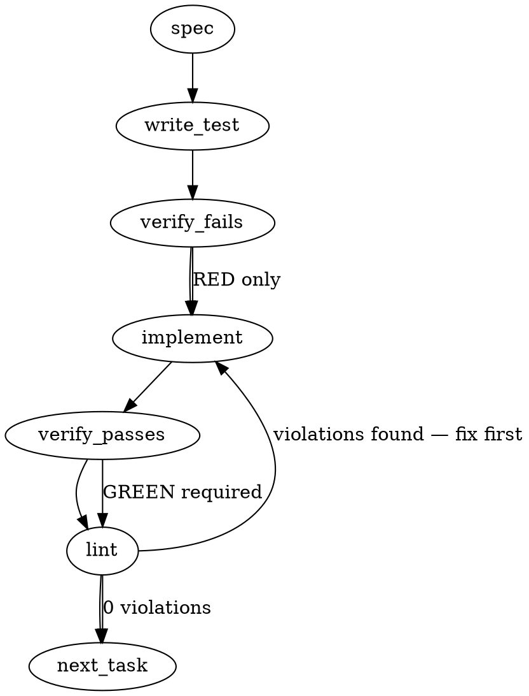

### Problem Statement

Prevent silent truncation of project board items fetched from GitHub via the CLI adapter, and establish a clear, structured truncation behavior for CLI reporting when board sizes exceed readable limits without breaking underlying coherence/drift checks.

### Architectural Context

- **CLI Command Reference > Context & Workflow**: Board orientation needs to run with zero LLM calls, meaning any truncation calculation or report rendering must be fast and deterministic.
- **Shared Helpers**: Safe execution of CLI commands must use the `@mmnto/totem` `safeExec` wrapper rather than raw `child_process` methods to ensure consistent execution, timeout handling, and cross-platform safety.

### Files to Examine

1.  `packages/cli/src/adapters/github-cli-project.ts` — The source of board item fetching. This is where default truncation limits of the GitHub CLI (typically 30 or 100 items) are encountered.
2.  `packages/cli/src/commands/orient.ts` — Renders the `OrientReport` and manages the presentation of the project board items.
3.  `packages/cli/src/commands/orient-coherence.ts` — Runs the drift check (`flagBoardIssueDrift`) between local issues and board items.

### Technical Approach & Contracts

We will implement a two-tier solution to resolve the truncation issue:

1.  **Adapter Tier (Fetching):** Ensure the adapter fetches up to a reliable maximum (e.g., 1000 items) by explicitly declaring `--limit` options in the GitHub CLI command execution. This prevents silent silent data omission.
2.  **Presentation Tier (Reporting):** Safely truncate the visual list inside `OrientReport` if it exceeds a user-friendly size (e.g., 25 items per column status), appending truncation metadata (`BoardTruncationMeta`) so the user knows they are seeing a summarized view.

#### Required Data Contract Changes

Update `BoardItem` or introduce a wrapping structure for reporting inside `packages/cli/src/commands/orient.ts`:

```typescript
export interface BoardTruncationMeta {
  totalCount: number;
  displayedCount: number;
  isTruncated: boolean;
}

export interface TruncatedBoardSection {
  items: BoardItem[];
  meta: BoardTruncationMeta;
}
```

#### Comparison of Approaches

- _Approach A (Pagination Loops):_ Recursively paginate through the GitHub CLI API.
  - _Trade-off:_ High network overhead, slow execution time during synchronous `orient` commands.
- _Approach B (Explicit High Limit with UI Summarization — RECOMMENDED):_ Request a high item limit (`--limit 1000`) in a single fast call via `safeExec`, then slice the data strictly in the presentation layer.
  - _Trade-off:_ Minimizes network roundtrips, ensures drift checks use the complete dataset, and keeps presentation clean and predictable.

---

### Edge Cases & Traps

- **Drift Check Degradation:** If the presentation layer truncates the array _before_ passing it to `flagBoardIssueDrift`, the drift logic will incorrectly report that issues are missing from the board (false-positive drift). The drift algorithm must receive the _raw, untruncated_ dataset.
- **Shell Buffer Overflow:** Fetching large datasets via `safeExec` returns large JSON strings. The parsing wrapper must handle potential JSON parse exceptions gracefully using `readJsonSafe` (or matching safe patterns) to avoid hard CLI crashes on corrupted payloads.
- **Draft Cards with No Content Numbers:** Draft cards on GitHub project boards do not have `contentNumber` values. Truncation and grouping logic must not crash or misalign when these values are undefined.

---

### Implementation Tasks

- [ ] **Task 1: Configure Explicit Limits in the Adapter**
  - Modify `packages/cli/src/adapters/github-cli-project.ts` to add an explicit `--limit 1000` argument to the `gh project item-list` execution command.
    > TOTEM INVARIANT (safeExec): Every shell execution of the GitHub CLI must use the `safeExec` shared helper. Do not use raw child_process modules.
    > TEST DIRECTIVE: Before implementing, write a failing test named `uses explicit high limit in CLI arguments` to verify `--limit` is always present.
  - Write test → verify fails → implement → verify passes → lint

- [ ] **Task 2: Implement UI Truncation Logic**
  - Create a truncation helper function in `packages/cli/src/commands/orient.ts` that limits the array of `BoardItem` instances to a configurable maximum (default 25) for display purposes only.
  - Populate the `BoardTruncationMeta` contract to track the total items vs. displayed items.
    > TEST DIRECTIVE: Before implementing, write a failing test named `truncates visual lists without discarding items from source array` to assert data safety.
  - Write test → verify fails → implement → verify passes → lint

- [ ] **Task 3: Bind Drift Coherence Check to Untruncated Data**
  - Edit the pipeline execution inside `packages/cli/src/commands/orient.ts`.
  - Ensure the input passed to `flagBoardIssueDrift` is the untruncated `BoardItem[]` collection, while the printed report schema maps to the truncated representation.
    > TEST DIRECTIVE: Before implementing, write a failing test named `calculates drift correctly on visually truncated datasets` to prove truncation doesn't lead to false-positive drift alerts.
  - Write test → verify fails → implement → verify passes → lint

- [ ] **Task 4: Update Orient Report Rendering**
  - Modify the console output renderer in `packages/cli/src/commands/orient.ts` to print a visible truncation indicator (e.g., `... and X more items in this column`) when `isTruncated` is true.
  - Write test → verify fails → implement → verify passes → lint

---

### Execution Flow



### Verification

Every implementation MUST end with these steps:

1. `totem lint` — deterministic rule check (zero LLM, ~2s). Fixes any violations.
2. `totem review` — supplementary AI lanes over the diff (~18s, advisory). Address critical findings.

---

### Test Plan

#### Automated Scenarios

1. **Fetch Limits Verification:**
   - Test that calls to fetch board items construct a CLI query containing `--limit 1000`.
2. **Deterministic UI Truncation:**
   - Provide a list of 50 mocked board items to the formatter.
   - Assert the returned output renders exactly 25 items and features a clear metadata indication that 25 items were hidden.
3. **Drift Alignment:**
   - Provide a list of 50 board items and 50 corresponding local open issues.
   - Truncate the display array to 5 items.
   - Verify that `flagBoardIssueDrift` reports 0 issues drifting, confirming the check used the complete dataset.

---

### Divergence note (implementation of record — the governing spec is the issue)

The sections above are LLM-generated from the issue body; the governing acceptance
shape is mmnto-ai/totem#2644 itself (lc-codex's recommendation, carried as filed).
The implementation diverges from the generated text as follows:

- **KEPT:** the deliberately-complete `--limit 1000` (Approach B) — permitted by the
  issue ("pagination or a deliberately complete limit"); `gh` pagination stops at the
  board's real card count, so small boards pay nothing.
- **ADDED (generated spec missed the issue's core):** `totalCount` parsed from the
  response (optional — older gh omits it) and a truncation guard — any
  `items.length < totalCount` throws into `orient`'s existing per-section `{ error }`
  envelope, and the coherence sensor propagates the error instead of false-flagging
  over a partial card set. Truncation must never read as completeness (Tenet 4).
- **DROPPED (invention, not in the issue):** the "UI truncation to 25 per column" /
  `BoardTruncationMeta` presentation layer (Tasks 2–4 above). The board section
  renders active items only; re-introducing display truncation would rebuild the
  defect one layer up. No `TruncatedBoardSection` type exists.
- **Corrected premise:** the truncation cause was `BOARD_ITEM_LIMIT = 200` in
  `github-cli-project.ts`, not gh's "default 30/100" limits.
