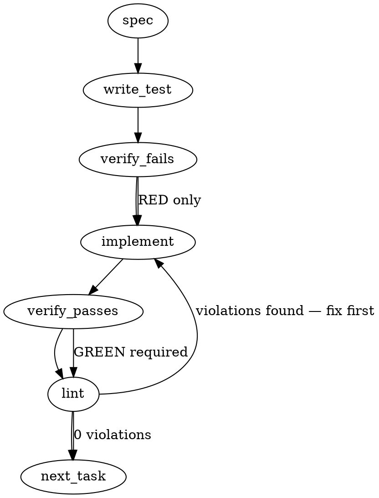

### Problem Statement

We need to mechanize the review-leg floor by introducing a required prepush artifact gate on the strict tier. Pushes containing a legs-owed diff must carry a valid, non-stale falsification-leg deposit in `.totem/artifacts/legs/<sha>.json` that is an ancestor-or-equal of the pushed head commit. Additionally, we must implement the `totem route` command as the classifier seam, grow the covariate line to v1.2 to include a `leg:` field, and add artifact garbage collection.

### Architectural Context

- **mmnto-ai/totem#2691 (Artifact-Gate Shape):** Uses JSON-aware reading of run artifacts rather than substring-regex matching. The new leg deposit gate must mirror this pattern using `readJsonSafe` and strict Zod validation.
- **mmnto-ai/totem#2473 (Covariate Pilot):** The covariate line format is upgraded to v1.2 to append leg artifact findings (`leg: <sha8> blocking=N material=N folded=N`) alongside `local-lane:`.
- **Enforcement Model > The Git Hook:** The prepush hook must execute stateless, deterministic checks without external LLM latency, ensuring offline/air-gapped reliability.

### Files to Examine

- `packages/cli/src/commands/install-hooks.ts` — To inspect pre-push hook registration and update `buildPrePushHook` to run the mechanized check.
- `packages/cli/src/cli.ts` (or `packages/cli/src/index.ts` if CLI registration is there) — To register the new `route` and `prepush` commands.
- `packages/cli/src/covariate.ts` (or relevant pilot reporter file) — To trace and amend the covariate reporter line to format v1.2.
- `packages/cli/src/gc.ts` — To align legs artifact garbage collection with existing `runs/` GC policies.

### Technical Approach & Contracts

#### 1. Data Contract: Leg Deposit Zod Schema (`packages/cli/src/contracts/leg-deposit.ts`)

```typescript
import { z } from 'zod';

export const LegFindingSchema = z.object({
  severity: z.enum(['BLOCKING', 'MATERIAL', 'MINOR']),
  file: z.string(),
  line: z.number(),
  claim: z.string(),
  counterexample: z.string(),
});

export const LegDepositSchema = z.object({
  diffSha: z.string().regex(/^[a-f0-9]{40}$/i),
  readAt: z.string().datetime(), // ISO-8601 UTC
  findings: z.array(LegFindingSchema),
  folded: z.array(z.string()),
  verdict: z.string(),
});

export type LegFinding = z.infer<typeof LegFindingSchema>;
export type LegDeposit = z.infer<typeof LegDepositSchema>;
```

#### 2. Sequence Logic & Classification (`totem route` & `totem prepush`)

- **`totem route` Seam:**
  - Subcommand `totem route --diff <sha>` acts as the classifier.
  - If the changes are classified as `legs-owed` (e.g. contains material code changes requiring review legs under the pilot rule), it prints `legs-owed` and exits 0. Otherwise, it prints `legs-exempt` and exits 0.
- **`totem prepush` Command Execution Sequence:**
  1. Resolve repository root using `resolveGitRoot(process.cwd())`.
  2. Determine the target push commit head SHA.
  3. Execute classifier logic (`route` seam): check if the diff is `legs-owed`. If `legs-exempt`, print success and exit 0.
  4. If `legs-owed`, scan `.totem/artifacts/legs/*.json` for a deposit file.
  5. For each candidate deposit, check if its `diffSha` is equal to or an ancestor of the push head using `git merge-base --is-ancestor <depositSha> <headSha>`.
  6. If no valid, non-stale deposit exists:
     - On **strict tier**, exit 1 (BLOCK push).
     - On **standard/advisory tier**, print a warning and exit 0.
  7. If a valid deposit is found:
     - Read and parse via `readJsonSafe(filePath, LegDepositSchema)`.
     - Count findings: `blocking` (severity: BLOCKING), `material` (severity: MATERIAL), and `folded` count.
     - On **strict tier**, block if there are unresolved `BLOCKING` findings in the deposit.
     - Emit the covariate format v1.2 line.

#### 3. Covariate v1.2 Format Extension

Extend the covariate line generator to produce format v1.2:
`local-lane: <lane_data> leg: <sha8> blocking=N material=N folded=N`
Where `<sha8>` is `deposit.diffSha.substring(0, 8)`.

### Edge Cases & Traps

- **Stale Deposit Race Condition:** A developer builds a leg, makes a minor trivial commit (e.g. typo fix), and pushes. The exact head SHA has changed, but the leg deposit is still perfectly valid because the leg's `diffSha` is an ancestor of the new head. Using strict equality would block them unnecessarily. We MUST use `git merge-base --is-ancestor` to verify legitimacy.
- **Missing Directory Handlers:** On initial checkout or clean environments, `.totem/artifacts/legs/` will not exist. Direct filesystem reads will throw `ENOENT`. This must be caught and gracefully treated as a missing deposit (blocking on strict, warning on standard) without throwing a raw JS crash stack trace.
- **Git History Discontinuity:** If a branch is rebased or force-pushed, `git merge-base` might fail with an exit code due to disjoint commits. The prepush validator must trap git execution errors from `safeExec` gracefully and treat unrecognized SHAs as stale/invalid.

### Implementation Tasks

- [ ] **Task 1: Leg Deposit Schema and Types**
  - Create file `packages/cli/src/contracts/leg-deposit.ts` containing `LegDepositSchema`.
  - Add unit tests verifying schema parsing for both conformant and malicious inputs.
    > TEST DIRECTIVE: Before implementing, write a failing test named `rejectsMalformedLegDeposits` that proves schema parsing fails when required fields like `diffSha` are missing or improperly formatted.

- [ ] **Task 2: The Classifier Seam (totem route)**
  - Implement `totem route` command and its core programmatic classifier function `classifyDiff(gitRoot: string, headSha: string)` under `packages/cli/src/commands/route.ts`.
  - Register the route command in `packages/cli/src/cli.ts`.
  - Add unit tests mocking git differences to assert correct classification.
    > TEST DIRECTIVE: Before implementing, write a failing test named `correctlyClassifiesLegsOwedOnMaterialChanges` asserting that a diff containing code changes triggers `legs-owed` while a doc-only change is `legs-exempt`.

- [ ] **Task 3: Prepush Gate Logic & Ancestry Verification**
  - Implement `totem prepush` command logic under `packages/cli/src/commands/prepush.ts`.
  - Use `resolveGitRoot` and scan `.totem/artifacts/legs/`.
  - Implement ancestor validation using `safeExec` to invoke `git merge-base`.
    > TOTEM INVARIANT (Strict Pre-Commit Spec-Evidence Rule): Read the leg deposit using readJsonSafe and Zod validation, never via substring regex match.
    > TEST DIRECTIVE: Before implementing, write a failing test named `blocksPushOnStrictTierIfDepositIsStale` where a mock leg deposit SHA is not an ancestor of the pushed head commit.

- [ ] **Task 4: Hook Installer Updates**
  - Modify `buildPrePushHook` inside `packages/cli/src/commands/install-hooks.ts` to trigger the new `totem prepush` gate checks.
  - Ensure it propagates exit codes and honors the `strict` vs `standard` tier config.
    > TOTEM INVARIANT (The Git Hook): Pre-push hook and prepush checks must run stateless, with no LLM calls and work air-gapped.

- [ ] **Task 5: Covariate Format v1.2 Line Amendment**
  - Update covariate reporting inside `packages/cli/src/covariate.ts` (or relevant pilot reporter) to construct the covariate string using v1.2 formatting specifications: `leg: <sha8> blocking=N material=N folded=N`.
  - Add unit tests verifying format compliance and safe fallback if no deposit is linked.
    > TEST DIRECTIVE: Before implementing, write a failing test named `generatesFormatV1_2CovariateLine` that asserts exact match of the appended `leg:` string representation.

- [ ] **Task 6: Garbage Collection for Leg Artifacts**
  - Add `.totem/artifacts/legs` GC support inside `packages/cli/src/gc.ts`.
  - Retain only the most recent N leg deposits or those active on current local heads, purging old unreferenced records.
  - Verify GC sweep runs successfully.

### Execution Flow (structural constraint)



### Verification (MANDATORY — do not skip)

Every implementation MUST end with these steps:

1. `totem lint` — deterministic rule check (zero LLM, ~2s). Fixes any violations.
2. `totem review` — supplementary AI lanes over the diff (~18s, advisory). Address critical findings; your team's review discipline decides the review of record.
3. If using MCP, call `verify_execution` to confirm compliance before declaring the task done.

### Test Plan

- **Deposit Schema Validation Tests:**
  Verify schema rejection on mismatched severities, invalid ISO-8601 timestamps, or missing keys.
- **Git Ancestor Logic Mock Tests:**
  Mock `safeExec` git command results for `merge-base` to simulate exact-match, ancestor-match, and completely disjoint commit-graph histories.
- **Prepush Gate Matrix Tests:**
  - Case A: `strict` tier, `legs-exempt` -> Expect exit 0.
  - Case B: `strict` tier, `legs-owed`, no deposit -> Expect exit 1.
  - Case C: `strict` tier, `legs-owed`, stale deposit -> Expect exit 1.
  - Case D: `strict` tier, `legs-owed`, fresh valid deposit -> Expect exit 0.
  - Case E: `standard` tier, any condition -> Expect exit 0 (prints warnings only).
- **Covariate Parser/Formatter Tests:**
  Assert that v1.2 covariate line strings are parsed and formatted perfectly without breaking legacy formats.

## Implementation Design

Hand-authored design record for mmnto-ai/totem#2698 (2026-09-03, totem-claude). The generated sections above are one retrieval input; this section is the contract the build follows. Primary sources: the issue charter (items 1–2 ruled; 3–4 out of scope); strategy-claude's 2026-09-02T01:30Z concurrence ("carry the minimal `legs-owed` predicate behind the same seam; do not wait on `totem route`") and its 2026-09-03T05:42Z sequencing (every round slice lands as a legs-owed diff under this gate); `doctrine/model-tiering.md` § Review legs (a self-authored **judgment-dense** diff owes one falsification leg before it is presented; a fold that rewires semantics re-arms it) and § Fable-absent regime item 1 (judgment-density is derived first, from file class or effect: doctrine surfaces `doctrine/**` · `design-tenets.md` · `adr/**`, public-copy surfaces, or a contract class); mmnto-ai/totem#2534 (`totem route` — a sensor that emits legs-owed plus its basis; absent from the tree at `7e247984`); the mmnto-ai/totem#2691 / mmnto-ai/totem#2700 gate shape in `buildPreCommitHook` (`install-hooks.ts:740`); the covariate contract v1 → v1.1 (`verdict.ts:941–958`, `admission.ts:351–360`, `.totem/specs/2473.md` § Implementation Design, the `init-templates.ts:2066` marker and its `init.test.ts:3940` pin); `git.ts` (`isAncestor` L27, `getDiffForReview` L269 with `changedFiles` and the forced `branch` scope).

### Scope

This slice ships the leg-deposit artifact family (`<totemDir>/artifacts/legs/<diffSha>.json`: schema, writer, loader, head-lookup), a `totem legs` command pair (`deposit` = the writer, `gate` = the reader), a strict-tier pre-push arm that BLOCKS a legs-owed push carrying no fresh deposit (advisory tiers print the same line and exit 0), the minimal `legs-owed` predicate as a core routing seam over configured path globs, and the covariate line's format v1.2 `leg:` field — with the reflex template, both distributed skill twins, `tools/pre-push`, docs and the pilot spec amended in lockstep. It will NOT touch the `totem review` lanes (item 3, mmnto-ai/totem#2525), author doctrine (item 4, strategy's lane), implement `totem route`'s other verdicts (judgment-dense · safe-harbor · regime state stay mmnto-ai/totem#2534's), add a reaper (mmnto-ai/totem#2647 covers the artifact tree), gate on finding severities or dispositions (the floor is that a leg READ this diff; the counts ride the covariate for the round to rule), read the pre-push stdin ref list (head is `HEAD`, base is the branch-vs-base scope — the PR diff, which is what the leg read; a push of a non-checked-out branch is disclosed below as a limit), or change `renderCovariateLine` (the v1 shape stays byte-identical; the field is composed beside it).

### Data model deltas

| New                                                                     | Holds                                                                                                                                                                                                                                                   | Written by                                                                                              | Read by                                                                                          | Invariants                                                                                                                                                                                                                                                                                                                                                                                                                                                                                                                                                                        |
| ----------------------------------------------------------------------- | ------------------------------------------------------------------------------------------------------------------------------------------------------------------------------------------------------------------------------------------------------- | ------------------------------------------------------------------------------------------------------- | ------------------------------------------------------------------------------------------------ | --------------------------------------------------------------------------------------------------------------------------------------------------------------------------------------------------------------------------------------------------------------------------------------------------------------------------------------------------------------------------------------------------------------------------------------------------------------------------------------------------------------------------------------------------------------------------------- |
| `LegDepositSchema` (core `artifacts/legs.ts`, `schemaVersion: '1.0.0'`) | `diffSha` (40-hex) · `readAt` (ISO datetime) · `findings[]` · `folded[]` · `verdict`                                                                                                                                                                    | `totem legs deposit` (validate-on-write)                                                                | `totem legs gate`, `review --covariate`, tests                                                   | `folded` is a subset of `findings[].id` (superRefine); `findings[].id` unique, `/^[A-Za-z0-9_-]{1,32}$/`; `verdict` and every `claim` single-line with no C0/C1 bytes (schema-rejected at write AND at read — the artifact is a hand-editable file whose text reaches a hook's stdout); every field required, arrays may be empty                                                                                                                                                                                                                                                 |
| `LegFindingSchema`                                                      | `id` · `severity` (BLOCKING · MATERIAL · MINOR) · `file` · `line` (int ≥ 0) · `claim` · `counterexample`                                                                                                                                                | same                                                                                                    | same                                                                                             | the contract JSON has no `id`; OQ1 adds it — without one `folded` cannot name a finding                                                                                                                                                                                                                                                                                                                                                                                                                                                                                           |
| Deposit file `legs/<diffSha>.json`                                      | one deposit per diff head the leg read                                                                                                                                                                                                                  | the writer, atomic (temp + rename), create-exclusive unless `--replace` (the replaced `readAt` printed) | the loader                                                                                       | keyed by the READ sha, deliberately not content-addressed: the gate's question is "was THIS head read", and a rerun leg on the same head supersedes by intent, disclosed                                                                                                                                                                                                                                                                                                                                                                                                          |
| `LegDepositWithAddress`                                                 | `{ deposit, path, diffSha }` returned by the loader                                                                                                                                                                                                     | the loader                                                                                              | gate, covariate                                                                                  | the loader is tolerant per file (a corrupt file is a loud sensor row, never a throw)                                                                                                                                                                                                                                                                                                                                                                                                                                                                                              |
| `findLegDepositForHead(totemDirAbs, headSha, git)` (core)               | resolution                                                                                                                                                                                                                                              | —                                                                                                       | gate, covariate                                                                                  | candidates = deposits with `diffSha === head` or `isAncestor(diffSha, head)`; rank exact first, then NEAREST ancestor (`git rev-list --count diffSha..head` ascending), then latest `readAt`; returns the winner + `distance` (commits since the read) + the corrupt list                                                                                                                                                                                                                                                                                                         |
| `classifyLegsOwed(changedFiles, globs)` (core `routing/legs-owed.ts`)   | `{ owed: boolean, basis: Array<{ glob, file }> }`                                                                                                                                                                                                       | —                                                                                                       | the gate; later `totem route` (mmnto-ai/totem#2534 grows this module, never a second classifier) | pure; the matcher is the one `ignorePatterns` already uses; basis lists every match (the gate prints the first 5 and a count)                                                                                                                                                                                                                                                                                                                                                                                                                                                     |
| Config `hooks.legsOwed.globs?: string[]`                                | the repo's judgment-dense path floor                                                                                                                                                                                                                    | the config author                                                                                       | the gate at RUN time (never rendered into the hook, so a glob edit needs no re-install)          | default = the doctrine floor plus the package-repo contract proxy: `doctrine/**`, `design-tenets.md`, `adr/**`, `proposals/**`, `README.md`, `docs/wiki/**`, `.changeset/**` (a changeset IS the release's compatibility contract, so every releasable slice — including all eight round slices — is owed by derivation); this repo's `totem.config.ts` adds its contract classes (`packages/core/src/artifacts/**`, `packages/core/src/config-schema.ts`, `packages/cli/src/commands/install-hooks.ts`, `packages/cli/src/commands/init-templates.ts`, `.claude/skills/**`); OQ4 |
| Covariate format **v1.2**                                               | ` leg: <sha8> blocking=N material=N folded=N` appended to BOTH existing `local-lane:` shapes; ` leg: none` when no deposit resolves; a third head shape `local-lane: none` when no verdict/admission artifact exists for the lineage but a deposit does | `review --covariate` (`printCovariateLine`)                                                             | the round-disposition comment, the pilot ledger                                                  | `renderCovariateLine` / `renderAdmissionLine` unchanged; consumers discriminate on the second token (`<hash8>` · `not-applicable` · `none`); the marker, both skill twins, the `init.test.ts` pin and `.totem/specs/2473.md`'s clause move together (the v1.1 precedent)                                                                                                                                                                                                                                                                                                          |
| `REFLEX_VERSION` 12 → 13                                                | the reflex template's step 2 gains one sentence naming the legs gate and its cure                                                                                                                                                                       | the template                                                                                            | doctor drift                                                                                     | the CLAUDE.md gate clause test (`config-drift.test.ts:118`) gains a sibling                                                                                                                                                                                                                                                                                                                                                                                                                                                                                                       |

No module-level state. No reserved keys: `none` is a HEAD-token value of the `local-lane:` line, never a value inside an existing shape.

### State lifecycle

- **Deposit file** — persistent, per-checkout, gitignored (`.gitignore:58` already covers `.totem/artifacts/`; dies with a worktree, like `runs/`). Created by the writer on the seat's word after a leg returns; never mutated (replace = a new file under the same name, disclosed); never destroyed by this slice (reaper = mmnto-ai/totem#2647). Ownership: the writer is the single writer; the gate and covariate are read-only (the read-only contract of `--covariate` is preserved).
- **Head resolution** — per invocation: `HEAD` resolved fresh by the gate; each deposit's `diffSha` is compared by ancestry on every run. Nothing caches.
- **Predicate inputs** — per invocation: `getDiffForReview({ branch: true })` (the push-gate scope lint uses) resolves the branch-vs-base scope, run with an EMPTY ignore configuration so `changedFiles` is the UNFILTERED branch diff (fold F1 below: `ignorePatterns` / `shieldIgnorePatterns` are index-exclusion semantics and never hide a path from the floor — this repo's list names `README.md` and `.claude/**`, two declared floor globs); globs come from the config loaded at run time. A `DiffForReviewEmpty` result is not owed (nothing to read), printed as such.
- **Hook render** — install time: the pre-push template gains the arm; `tools/pre-push` is regenerated; the tier is rendered as today; consumers pick it up through `totem init` / `hook install` (the existing channel, no forced upgrade).

The one cross-lifecycle edge: a deposit read at sha X stays valid for every descendant of X (the contract's ancestor-or-equal rule). The gate makes that visible, never silent — the evidence line carries `+N commits since the leg read` — and a re-armed fold owes a new deposit by doctrine, not by this gate.

### Failure modes

| Failure                                                                                                           | Category         | Agent-facing surface                                                                                                                                                           | Recovery                     |
| ----------------------------------------------------------------------------------------------------------------- | ---------------- | ------------------------------------------------------------------------------------------------------------------------------------------------------------------------------ | ---------------------------- |
| Diff not owed (no glob matched, or an empty branch diff)                                                          | runtime          | `[Totem] legs: not owed — no changed path matched hooks.legsOwed.globs (<n> globs)`, exit 0                                                                                    | none                         |
| Owed, no deposit dir or no deposit                                                                                | runtime          | BLOCKED (strict) or the advisory line (standard): names the first matched `glob → file` pairs and the cure `totem legs deposit --sha HEAD --from <findings.json>`; gate exit 3 | run the leg, deposit         |
| Owed, deposits present but none ancestor-or-equal of HEAD                                                         | runtime          | BLOCKED: `stale deposit <sha8> is not an ancestor of HEAD <sha8>` (each candidate listed); exit 3                                                                              | deposit for the current head |
| Owed, a candidate `diffSha` names no commit in this repo (rebased away, or another checkout's)                    | runtime          | treated as stale (ancestry false), named as `unknown to this repo`                                                                                                             | same                         |
| Owed, a deposit file unreadable, not JSON, or schema-invalid (a multi-line `verdict`, `folded` naming no finding) | runtime          | `[Totem] legs: sensor — ignoring corrupt deposit <file>: <reason>` per file; never counts, never masks a valid sibling; if no valid deposit remains, the no-deposit block      | fix or delete the file       |
| Several valid candidates                                                                                          | runtime          | the winner named with its rank reason (`exact` / `nearest ancestor, +N commits`); the others listed as superseded                                                              | none                         |
| Pass                                                                                                              | runtime          | `[Totem] legs evidence: legs/<sha40>.json (read <readAt>, <d> days old) · +N commits since the leg read · blocking=N material=N folded=N`, exit 0                              | none                         |
| The gate cannot derive: not a git repo, `HEAD` unresolvable, base resolution fails                                | runtime          | exit 2 NOT DERIVED with the cause; the strict hook arm BLOCKS on 2 with its own line (fail-closed, distinct from "no deposit"); advisory prints it                             | fix the checkout             |
| `$TOTEM_CMD` resolves to a CLI without `legs gate` (the `--help` probe fails)                                     | init / transient | strict: BLOCKED `hook expects totem legs gate; npm i -g @mmnto/cli@latest` (OQ2); standard: the compat line, exit 0                                                            | upgrade                      |
| `$TOTEM_CMD` empty (no CLI at all)                                                                                | init             | pre-existing: the whole `if [ -n "$TOTEM_CMD" ]` block is skipped for every gate; the legs arm inherits it — disclosed here, not changed                                       | install                      |
| Writer: `--sha` is not a commit in this repo                                                                      | runtime          | a hard error naming the ref                                                                                                                                                    | pass a commit                |
| Writer: the file's `diffSha` differs from `--sha`                                                                 | runtime          | a hard error (the deposit must name the head it read)                                                                                                                          | fix one                      |
| Writer: schema-invalid findings file                                                                              | runtime          | a hard error with the Zod path                                                                                                                                                 | fix the file                 |
| Writer: a deposit already exists for the sha                                                                      | runtime          | refused with the existing `readAt`; `--replace` overwrites and prints what it replaced                                                                                         | `--replace`                  |
| Writer: `readAt` absent in the file                                                                               | runtime          | stamped `now` with a printed line (`readAt defaulted to <now> — pass --read-at for the leg's own instant`)                                                                     | none                         |
| Covariate: no verdict/admission artifact AND no deposit                                                           | runtime          | today's warn stays; nothing on stdout (no lineage artifact of either family)                                                                                                   | run review, or deposit       |
| Covariate: no verdict/admission artifact, deposit present                                                         | runtime          | `local-lane: none leg: <sha8> …` (the mmnto-ai/totem#2694 exhibit's cure)                                                                                                      | none                         |
| A push of a branch other than the checked-out one                                                                 | runtime          | the gate judges `HEAD`'s branch diff — disclosed in the pass line's `head <sha8>`; the stdin-ref form is a named follow-up, never a silent miss                                | push from the branch         |
| A leg read the diff at sha X, then ten judgment-dense commits landed                                              | policy           | passes with `+10 commits since the leg read` on the line — the contract's rule; the sensor makes it legible, the fold re-arm doctrine owes the new read                        | deposit again                |

No row degrades silently: every skip, mismatch and corrupt file prints its reason (Tenet 4).

### Invariants to lock in via tests

- A deposit is read JSON-aware through the schema; a review artifact or any file that merely quotes `diffSha` and `findings` is never a deposit.
- A deposit whose `diffSha` is not ancestor-or-equal of HEAD is no deposit; exact outranks ancestor; the nearest ancestor outranks a farther one; equal distance resolves to the latest `readAt`.
- A corrupt deposit is disclosed by name and reason, never counts, and never hides a valid sibling.
- A not-owed diff never consults the store, and says which globs it was judged against.
- The tier changes ONLY the exit code: strict and advisory print byte-identical lines for the same state.
- Every value echoed to the hook's stdout is control-character-sanitized, and the schema refuses multi-line `verdict` and `claim` at write and at read.
- The writer refuses a non-commit sha, a file whose `diffSha` disagrees with `--sha`, and an existing deposit without `--replace`; a refused write leaves no partial file.
- `folded` names only existing finding ids; ids are unique.
- The pre-push template's strict arm blocks on gate exit 3 AND on exit 2 with distinct lines; the standard arm exits 0 on both; the `--help` probe's supported and unsupported branches are both fixtured; `tools/pre-push` is byte-identical to the builder.
- The generated hook executed under `sh` against a temp repo: owed + no deposit → status 1 naming the cure; owed + fresh deposit → status 0 with the evidence line; owed + stale deposit → status 1 naming both shas; not owed → status 0.
- Covariate v1.2: both existing shapes are byte-unchanged before the appended field; `leg: none` when no deposit; `local-lane: none leg: …` only when no lineage artifact exists and a deposit does; the template marker, both skill twins, the `init.test.ts` pin and the 2473 amendment clause carry the same v1.2 text.
- `classifyLegsOwed` is pure and its basis lists every `glob → file` match; the seam module exports exactly what `totem route` will consume (a verdict plus its basis), nothing gate-shaped.
- Dogfood: this repo's `totem.config.ts` declares its contract-class globs; the slice's own PR head carries a deposit written by the new writer from the slice's falsification leg; this repo's standard-tier `tools/pre-push` prints the advisory line on the slice's push.

### Open questions

- **Question 1:** Add a required `id` to each finding? The contract JSON has none, so `folded` cannot reference a finding.
  - **Options:** add `id` (required, unique) · make `folded` positional indexes (fragile under reordering) · reduce `folded` to a count.
  - **Recommendation:** add `id`; the "folded is a subset of ids" invariant is what makes the counts on the covariate honest.
- **Question 2:** When the strict hook meets a CLI that lacks `legs gate`, fail closed or compat-open?
  - **Options:** BLOCK with the upgrade line (fail-closed; the strict tier is opt-in and the cure is one `npm i -g`) · print the compat line and pass (the `--gate` precedent — but that precedent had a bare-sensor fallback; an absent verb has none).
  - **Recommendation:** fail-closed on strict, the advisory line on standard.
- **Question 3:** Covariate v1.2 as designed — the appended field on both shapes plus the `local-lane: none` head shape — is the amendment the issue says is "ruled by the pilot owner". The pilot's design record is this seat's; unless you name another owner, this record IS the amendment and `.totem/specs/2473.md` gains the v1.2 clause in the same PR.
  - **Recommendation:** adopt; it is the smallest change that prints the leg when no verdict exists, which is the mmnto-ai/totem#2694 exhibit.
- **Question 4:** Default `hooks.legsOwed.globs` = the doctrine floor plus `.changeset/**`, with contract classes declared per repo?
  - **Options:** that default (a package repo's releasable slices are owed out of the box; a code repo without changesets gets the public-copy floor until it declares) · an empty default (no mechanism until declared — the mmnto-ai/totem#2706 class of claim-without-mechanism) · a size floor (line count is only a proxy, per the design rung).
  - **Recommendation:** the doctrine floor plus `.changeset/**`; this repo declares its contract classes in the same PR.

### Sequencing

Core leg (schema + loader + lookup + predicate) → CLI leg (writer, gate, hook arm, covariate, templates, docs, this repo's config, `tools/pre-push`) → owner verification → one falsification leg over the slice (its findings become the FIRST deposit, written with the new writer at the slice's head — the slice eats its own contract) → fold and re-arm if semantics move → mail strategy-claude that the record is at its gate (their "the floor is a gate, not a duty" doctrine clause lands on the PR's open) → PR. Releasable as `@mmnto/cli` minor + `@mmnto/totem` minor. The exhibit section of the PR carries the round's datum: the synthesis needed six Opus legs and legs 2, 3 and 5 each caught an error the previous fold had introduced — the class a per-push deposit gate exists for.

### Folds of record (2026-09-03, after the build legs, before the falsification leg)

Three build legs (core `e859f41b`; cli A `b19d41c2`; cli B `4415bf0e`, cherry-picked from its own worktree) landed against this record; every deviation each leg deposited was ruled by the owner, none folded silently. The rulings that change what this record says:

- **F1 — the predicate sees the UNFILTERED branch diff** (leg A disclosure → owner fold `fea61c9a`). This repo's `ignorePatterns` names `README.md` and `.claude/**`, so the review-scope filter hid two declared floor globs from the gate — a claim-without-mechanism. The gate now resolves the same branch-vs-base scope with an empty ignore configuration and says so on its `[Legs] Diff source` line; `ignorePatterns` / `shieldIgnorePatterns` are index-exclusion semantics and never hide a path from the floor. The § State lifecycle row above is amended in place.
- **F2 — every echoed value is control-byte collapsed after `sanitizeForTerminal`** (leg A disclosure → `fea61c9a`). The terminal sanitizer preserves LF and TAB by contract, so a configured glob or a changed path carrying a newline could have forged a second `[Totem]` line; a `charCodeAt` loop now replaces every C0/C1 code point with `?` at one seam per verb (the pre-commit reader's `safe()` shape).
- **F3 — the changeset re-verified against the shipped verbs** (`fea61c9a`, five deposits): the advisory byte-identity claim is scoped to the gate's own states (the verb-absent probe prints a different compat line on non-strict tiers); the strict guard is `is_agent OR strict` and its second arm blocks on ANY non-zero status, naming it; the BLOCKED output names the basis, then each stale candidate with its own reason, then the cure; `--read-at` and the defaulting disclosure are documented; the `--covariate` paragraph now says the leg half resolves on HEAD, not the lineage.
- **Accepted leg deviations that bind the shipped shape:** a `LEG_DEPOSIT_EXISTS` error code (core); `schemaVersion` pinned to `1.x` with a named newer-major reason at read; `replaced.readAt` may be undefined when the incumbent was corrupt; create-exclusivity is a pre-write existence check before the atomic rename (a disclosed single-writer TOCTOU window); a folded finding counts in BOTH its severity bucket and `folded`; bare floor globs match by BASENAME anywhere (every package README is npm public copy); the reflex sentence says "leg deposit" because the consumer template refuses review-process vocabulary (mmnto-ai/totem-strategy#619 pin); the deposit verb's human lines go to stderr; a `NOT DERIVED` also covers a throw inside the ancestry resolver; the writer refuses empty and flag-shaped refs.
- **Sanitizer limit named for the record:** the `--covariate` helper's git adapter treats an unparseable `rev-list --count` as distance 0 for RANKING only (the field prints no distance); the gate's adapter does not guess and reports NOT DERIVED instead.
