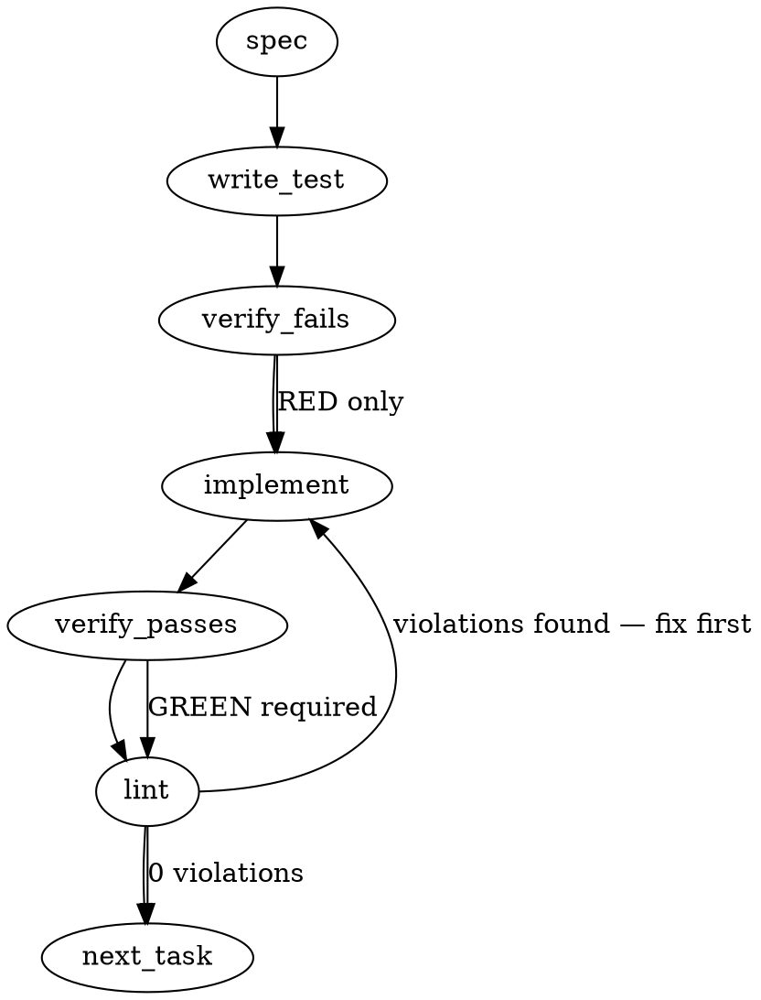

# `totem spec` refuses an unanchored topic · `--from <record>` binds the hand record · the strict pre-commit gate reads ANCHORED + non-empty-by-content (mmnto-ai/totem#2700)

> **Ritual note.** `totem spec 2700` (1.121.0, gemini-3.5-flash, 39.4 s, 5,298 in / 2,489 out) ran ISSUE-ANCHORED and recorded run artifact `e5a15c9c217d…` (`admission.runMetadata.caller = "spec"`, `provenanceSummary similarity-only:8`, 5 specs + 3 code, 0 lessons; the knowledge index was `STALE: 1 week` at the run). The draft below the rule is that run's output, kept verbatim as **one retrieval input, never the contract** (the standing line this issue lands under). Three of its inventions are struck by the hand-authored design that follows: a `--from` that skips the LLM (rejected — a zero-LLM `RunArtifact` would have to fabricate `backend` + `output.metrics`, Tenet 19), a made-up `similarityFloor` of `0.7` (the floor is the existing `searchRelevanceFloor`, default `0.25`, mmnto-ai/totem#2463), and a made-up `MIN_SPEC_BODY_BYTES = 200` (non-empty is measured on the section skeleton, per strategy's amendment). Sources read at `694acffb` before writing: `packages/cli/src/commands/spec.ts`, `spec-templates.ts`, `install-hooks.ts:716-815`, `install-hooks.test.ts:1737-2000`, `tools-hook-parity.test.ts`, `packages/cli/src/utils.ts:125-170,796-850,990-1008`, `packages/core/src/artifacts/{grounding,schema,storage}.ts`, `packages/core/src/types.ts:86-140`, `packages/core/src/store/lance-search.ts:90-260`, `packages/mcp/src/tools/search-knowledge.ts:840-905`, `packages/core/src/config-schema.ts:438-570`, `packages/cli/src/index.ts:291-312`, and the ruled concurrence `strategy-claude:…/2026-08-30T0059Z-…-ruled-concur.md`.
>
> **Revision v2 (2026-09-02 ~02:10Z — the forks ruled with strategy + the falsification fold).** The operator asked for the three open questions to be decided together with strategy-claude (dispatch 01:18Z). Strategy ruled at 01:30Z — **(1) B, the LLM runs; (2) the section skeleton, plus one priced clause: each required heading must carry at least one non-blank, non-heading line; (3) separate — the mmnto-ai/totem#2706 switch is the operator's to throw by name** — and concurred the queue order (mmnto-ai/totem#2698 carries the minimal `legs-owed` predicate rather than waiting on `totem route`). Its Opus falsification read of v1 (deposit 01:45Z; every finding re-verified at source by this seat before folding) returned PRESENT-AFTER-FIXES 2B/5M/7m/1Q, and strategy adjusted Fork 1 on M1: **on a `record` anchor the strict reader checks the record bytes, not the draft.** Dispositions, all FOLDED into the design below unless marked otherwise:
> - **B1 (floor source not derivable after parse — `loadConfig` returns `TotemConfigSchema.parse(raw)` and discards `raw`, `utils.ts:125-164`; `searchRelevanceFloor` carries `.default(0.25)`, `config-schema.ts:570`):** FOLDED — the `floorSource` enum is dropped; the refusal and the artifact name the floor's VALUE and its PLACE (`searchRelevanceFloor in totem.config.ts — schema default 0.25 when unset`), never a config-vs-default bit the code cannot compute.
> - **B2 (`--from` unreachable — `index.ts:291` registers `spec <inputs...>`, a required variadic; commander exits before `specCommand`):** FOLDED — `spec [inputs...]`; "no inputs and no `--from`" becomes a `CONFIG_INVALID` carrying today's usage line.
> - **M1 (the `--from` gate would read the discarded draft, and `anchor.sha256` had no consumer):** FOLDED per strategy's adjusted ruling — the reader reads the record's bytes at `anchor.ref` at commit time (one `readFileSync`), checks the DOCUMENT shape on them, and reports the sha256 comparison in the evidence line as a SENSOR (matches / revised since binding), not a gate — blocking on revision would price every design-record fold at one LLM call, the friction that pushed seats back to the ceremony this slice retires.
> - **M2 (a run carrying a fetched issue could be refused as unanchored):** FOLDED — the refusal is keyed on "no issue AND no record among the parsed inputs"; a mixed issue + free-text run gets the honest fourth kind `mixed` (not evidence: its free-text half is the confabulation surface).
> - **M3 (the default floor may be unreachable at `1/(1+d)`):** MEASURED and CONFIRMED — on this checkout's index (gemini-embedding, 768-d, `1/(1+_distance)`, `lance-search.ts:199-202`) a nonsense query (`purple trombone lasagna quarterly elephant zeppelin marmalade`) returned bestRelevance **0.548** with every hit in 0.541–0.548; this session's real query returned 0.706; strategy's seat counts 107 MCP selections at floor 0.25 with zero below-floor exclusions. At the default the all-below-floor arm cannot fire on this embedder. DISCLOSED in the design, the changeset and the wiki; the 0-hit arm and the anchor arm carry the four ruled exhibits; calibrating the DEFAULT is a config-wide (MCP-visible) ruling filed as its own issue (see § Scope), not folded here.
> - **M4 (Q2's "catches both" claim unestablished; the skeleton re-creates the always-blocking-strict shape under a custom prompt):** FOLDED — restated as "catches any draft that does not carry the promised skeleton; a refusal that mimics it is outside any content check's reach — named residual"; the override case is DERIVED: `runMetadata.promptSource: 'builtin' | 'override'` (`getSystemPrompt(...) === SYSTEM_PROMPT`, read before the code-blind directive is folded in), and an override-prompt draft is checked against the DOCUMENT shape, never the template's headings.
> - **M5 (`relevanceByContentHash` keys not unique — the item identity is the 4-tuple; linked stores embed with their own embedder):** FOLDED — the charter's literal ask: `relevance?: number` ON the bundle item (absent iff no vector leg); `grounding.selection` is gone; the floor becomes the scalar `grounding.floor`.
> - **m1** ("order-independent" was wrong — `grounding.ts:14-18`: items are SORTED because the hash is order-SIGNIFICANT): FOLDED, restated. **m2** (0 hits is the charter's rule, not an MCP mirror — the MCP returns `status: 'empty'`): FOLDED, split. **m3** (anchor/floor/relevance enter the artifact's content address, `storage.ts:57-59`): FOLDED, named — and moot in practice: `output.metrics.durationMs` (required, `schema.ts:482`) already puts a per-run number into every address, so "identical runs dedup" was nominal before this slice. **m4** (`--raw` interaction undisclosed): FOLDED — `--raw` is EXEMPT from the refusal (no LLM, no artifact, `utils.ts:995-1004`; it is how a weak topic's retrieval is inspected). **m5** ("one enumeration feeds both" was untrue of the builder): FOLDED — `RetrievalItem` widened with `relevance`; the core builder carries it onto the sorted item, no index correspondence needed. **m6** (the retroactive block is a migration line): FOLDED into the changeset + wiki — in THIS checkout 158 run artifacts, 55 `caller: spec`, 0 with `grounding.anchor`: every one reads as not-evidence after the upgrade, on a strict-tier install for human commits too (`is_agent OR TOTEM_HOOK_TIER=strict`). **m7** (no renderability guard for `SPEC_REQUIRED_SECTIONS` inside the single-quoted `node -e`): FOLDED — reuse the mmnto-ai/totem#2692 C4 code-point predicate behind `assertRenderableTotemDir` (`config-schema.ts:444-456`) + one unit test.
> - **Against the recommendations:** Q1 — the "beyond what was ruled" line is weakened as the leg says: `InvocationFailureArtifactSchema` under `artifacts/runs/failures/` (`schema.ts:490`, `storage.ts:49`) IS an existing second artifact class; (A) remains a distinct class + a second reader path, its own issue if ever wanted. Q3 — DISCLOSED: `tools/pre-commit:4` and the parity fixture pin tier `standard`, and Claude Code detection is dead (mmnto-ai/totem#2706), so at merge the new arm's live population is ≈ 0 and its exercise of record is the `sh`-executed suite.
> - **Open questions after v2: none.** The record as ruled awaits the operator's approval; then the build.

---

## The LLM draft (retrieval input — issue-anchored run `e5a15c9c…`)

### Problem Statement
The current `totem spec` command drafts specifications for unrelated similarity hits when run on free-text topics (slugs) without a proper grounding anchor, and the pre-commit gate accepts these empty/discarded drafts as valid workflow evidence. We need to prevent these confabulated runs by refusing unanchored topics lacking high-confidence knowledge hits, supporting hand-authored records using a `--from` flag that bypasses the LLM, and upgrading the pre-commit hook to strictly require an anchored spec run with non-empty content.

### Architectural Context
This spec implements the strategy ruled on **2026-08-30** (from `.totem/orchestration/strategy-claude/outbox/2026-08-30T0059Z-totem-claude-re-totem-spec-confabulates-ruled-concur.md`) under the doctrine:
> "`totem spec` writes a contract only when it is grounded; its output is one retrieval input, never the contract" and "spec-first is a ritual with a gate, not a text to obey".

Past traps show that letting the command pass silently on low-similarity free-text topics leads to confabulations (4/4 slug-topic runs this week). The validation discriminator must be exposed as a first-class property of the run artifact rather than inferred from heuristics.

### Files to Examine
1. `packages/core/src/artifacts/grounding.ts` — Defines grounding item structures and the `provenanceSummary` calculation.
2. `packages/cli/src/commands/spec.ts` — Command orchestrating retrieval, LLM interaction, and artifact creation.
3. `packages/cli/src/utils.ts` — Houses `buildRetrievalGroundingBundle` which creates the grounding metadata.
4. `packages/cli/src/commands/install-hooks.ts` — Renders and installs the `tools/pre-commit` hook.
5. `packages/cli/src/commands/install-hooks.test.ts` — Tests the spec evidence reader validation within the pre-commit lifecycle.
6. `tools-hook-parity.test.ts` — Asserts behavioral parity between CLI-based TS assertions and shell hook files.

### Technical Approach & Contracts

#### 1. Grounding Data Contract Modifications
Extend the schemas in `packages/core/src/artifacts/grounding.ts` to explicitly publish the anchor classification and individual retrieval scores:

```typescript
export interface GroundingAnchor {
  kind: 'issue' | 'record' | 'free-text';
  ref: string; // Issue number/URL, file path, or the free-text slug
  sha256?: string; // Populated only when kind === 'record'
}

export interface GroundingItem {
  provenance: string;
  contentHash: string;
  sourceType: string;
  filePath: string;
  score?: number; // Store raw similarity score to determine floor compliance
}

export interface GroundingBundle {
  anchor: GroundingAnchor;
  items: GroundingItem[];
}
```

Ensure that the main run artifact structure incorporates this new `GroundingBundle` definition.

#### 2. Hand-Authored Records via `--from`
When `--from <design-record path>` is supplied to `totem spec <slug>`:
1. Validate the local target file exists.
2. Read the file contents and calculate its SHA-256 hash.
3. Skip LLM generation and vector retrieval entirely.
4. Write a local run artifact containing:
   - `grounding.anchor`: `{ kind: "record", ref: <path>, sha256: <hash> }`
   - `output.content`: The full contents of the hand-authored file.
   - `admission.runMetadata.caller`: `"spec"`

#### 3. Unanchored Similarity Floor Refusal
When running `totem spec <slug>` without `--from` on a free-text topic:
1. Retrieve similarity snippets. Each snippet must retain its retrieval similarity score.
2. Determine the configured floor threshold (e.g. `config.spec.similarityFloor`, defaulting to `0.7`).
3. If no retrieved item meets or exceeds this floor, throw a terminal error:
   - "Similarity floor of {floor} (from {source}) was not met. No spec generated."
   - Exit with a non-zero exit code.
   - **Do not write any run artifact** to `.totem/artifacts/runs/`.

#### 4. Pre-Commit Gate Upgrades
Update the reader logic in `install-hooks.ts` to inspect the newest JSON artifact matching `admission.runMetadata.caller === "spec"`:
1. Assert `grounding.anchor.kind` is either `"issue"` or `"record"`.
2. Assert `output.content` trimmed length is greater than `MIN_SPEC_BODY_BYTES = 200` characters to filter out empty, stubbed, or refusal drafts.

---

### Edge Cases & Traps
- **Stale Run Artifacts:** The pre-commit gate reads the absolute *newest* file matching caller `"spec"`. If a developer runs an invalid/unanchored spec that writes no artifact, the gate will evaluate the *previous* run's artifact. However, if they ran a free-text topic that succeeded (passed the floor but has kind `"free-text"`), the gate must successfully reject it.
- **Parity in JSON Reading:** The shell/hook code in `tools/pre-commit` runs outside standard CLI compilation. Ensure JS snippet logic embedded in `install-hooks.ts` is robust against malformed JSON or empty output structures. Use `readJsonSafe` from `@mmnto/totem` inside TypeScript-based hook checks.
- **Score Representation:** Ensure vector DB adapters normalize score representation so that they are relative to the standard $[0, 1]$ threshold range before evaluating the floor.

---

### Implementation Tasks

- [ ] **Task 1: Extend Grounding Schemas and Interfaces**
  - Add `GroundingAnchor` and update `GroundingItem` and `GroundingBundle` interfaces in `packages/core/src/artifacts/grounding.ts`.
  - Update `buildRetrievalGroundingBundle` in `packages/cli/src/utils.ts` to accept retrieval scores and build the new schema properties.
  - > TEST DIRECTIVE: Before implementing, write a failing test named `serializesAnchorAndScoresInGrounding` that verifies grounding bundle serialization formats anchor and scores correctly.
  - write test → verify fails → implement → verify passes → lint

- [ ] **Task 2: Implement `--from <path>` Binding in Spec Command**
  - Update options parsing in `packages/cli/src/commands/spec.ts` to accept `--from`.
  - Handle the `--from` branch: read the design record, compute the SHA-256 hash, and write the run artifact directly with `kind: "record"`. Skip LLM execution.
  - > TOTEM INVARIANT (doctrine): On the unanchored path, the hand-authored design record IS the spec; the tool BINDS it, never drafts over it.
  - > TEST DIRECTIVE: Before implementing, write a failing test named `bindsHandAuthoredRecordWithSha256` that verifies the run artifact is written with the correct sha256 hash and the record's content.
  - write test → verify fails → implement → verify passes → lint

- [ ] **Task 3: Enforce Similarity Floor for Unanchored Topics**
  - In `packages/cli/src/commands/spec.ts`, check if a free-text topic yields any knowledge hits above the similarity floor.
  - If below the configured floor, abort execution, output the floor value and config source, and do not write any run artifact.
  - > TEST DIRECTIVE: Before implementing, write a failing test named `rejectsFreeTextTopicBelowFloorWithoutArtifact` that asserts the command fails with exit code and no file is created when similarity scores are low.
  - write test → verify fails → implement → verify passes → lint

- [ ] **Task 4: Upgrade Pre-Commit Hook Content & Anchor Checks**
  - Modify `packages/cli/src/commands/install-hooks.ts` to inject validation of the newest artifact's anchor and body content into `tools/pre-commit`.
  - Enforce `grounding.anchor.kind` is `"issue"` or `"record"` and `output.content` is at least 200 non-whitespace characters.
  - Update the spec evidence reader tests in `packages/cli/src/commands/install-hooks.test.ts`.
  - > TEST DIRECTIVE: Before implementing, write a failing test named `preCommitGateRejectsUnanchoredAndEmptySpecs` that verifies the hook script fails when evaluating unanchored or too-short spec outputs.
  - write test → verify fails → implement → verify passes → lint

- [ ] **Task 5: Align Parity Tests**
  - Update `tools-hook-parity.test.ts` to account for the updated JSON validation logic inside both the installed hook and TypeScript equivalents.
  - write test → verify fails → implement → verify passes → lint

---

### Execution Flow



---

### Verification

Every implementation MUST end with these steps:
1. `totem lint` — deterministic rule check. Resolve any formatting or parsing errors.
2. `totem review` — verify changes against additional static guidelines.
3. Confirm test parity using `packages/cli/test/tools-hook-parity.test.ts`.

---

### Test Plan

1. **Record Binding (`--from`):**
   - Execute `totem spec <slug> --from <path>` using a mock design record.
   - Assert that no network/LLM requests are made.
   - Assert that a run JSON is written to the run store with `grounding.anchor.kind === "record"`, capturing the record's correct file path and SHA-256 hash.

2. **Floor Compliance Handling:**
   - Execute `totem spec` with a topic slug that returns low similarity scores (below `0.7`).
   - Assert that execution terminates with a non-zero code, displays the checked floor and source, and does not output any JSON files under `.totem/artifacts/runs/`.

3. **Pre-commit Gating:**
   - Run the pre-commit hook with an artifact representing `kind === "free-text"`. Assert that validation fails.
   - Run the pre-commit hook with a valid `kind === "issue"` run artifact where the output body is empty or `< 200` bytes. Assert that validation fails.
   - Run the pre-commit hook with an artifact representing a bound record with `kind === "record"` and non-empty content. Assert that validation passes.
---

## Implementation Design v2 (hand-authored, 2026-09-02; the forks as ruled with strategy; supersedes the draft where they differ)

### Scope

Items 1–2 of the charter as amended, one PR: (a) the spec run artifact publishes its anchor (`grounding.anchor`), the floor it was judged against (`grounding.floor`), the per-item retrieval relevance (`relevance` on each bundle item) and which system prompt drafted it (`runMetadata.promptSource`); (b) `totem spec` with NO issue and NO record among its inputs REFUSES when retrieval returns nothing, or when every signal-bearing hit is below the floor and no floor-exempt hit exists — exit non-zero, the floor's value and place named, every withheld candidate disclosed as `path — relevance`, NO run artifact minted (`--raw` exempt: no LLM, no artifact); (c) `totem spec --from <record>` grounds the run on a hand-authored design record — the LLM runs, the record is the anchor (repo-relative path + sha256 of the bytes rendered into the prompt), the draft goes to stdout or `--out`, the record is NEVER written; (d) the strict pre-commit reader gains one arm: the newest spec artifact must be anchored (`issue` | `record`) and its SUBJECT must carry the promised shape — for `issue` the draft (TEMPLATE shape: each required heading present with a non-empty body; DOCUMENT shape when the prompt was overridden), for `record` the record's bytes on disk at commit time (DOCUMENT shape) with the sha256 comparison reported as a sensor — each failure BLOCKED with its own named reason; `tools/pre-commit` regenerated byte-for-byte. It will NOT: touch doctrine (item 3, strategy's lane); change the agent-detection block (mmnto-ai/totem#2706 — separate by ruling; the gate's reach at merge is strict-tier installs and Cursor seats, disclosed); filter or re-rank what enters the prompt on the proceed path (mmnto-ai/totem#2465's other half stays open); BLOCK on a record revised since binding (sensor only, see M1); change the DEFAULT floor (its unreachability on this embedder is measured and disclosed; the calibration is filed as its own issue, `mmnto-ai/totem#2727`); change `provenanceSummary`, the bundle's sort key, or anything about `review` artifacts.

### Data model deltas

| Delta | Holds | Writer | Reader | Invariants |
|---|---|---|---|---|
| `GroundingAnchorSchema` (core `schema.ts`, new; `grounding.anchor`, optional on `GroundingSchema`) | `{ kind: 'issue' / 'record' / 'free-text' / 'mixed', ref: string, sha256?: sha256-hex }` | `specCommand` → `RunArtifactRequest.anchor` → `runOrchestrator` (utils.ts ~709) | the strict pre-commit reader; eval / `totem artifact` verbs | `sha256` REQUIRED iff `kind === 'record'` (zod `superRefine`), forbidden otherwise. `kind`: `issue` when every input resolved to an issue; `record` on `--from`; `free-text` when every input is a topic; `mixed` when both issues and topics are present (honest, NOT evidence). `ref`: `#<n>` for a bare number, the input as typed for `owner/repo#N` / URL, comma-joined for several; the repo-relative record path for `record`; the topic text(s) for `free-text` / appended for `mixed`. Present on EVERY spec artifact from this version; ABSENT on `review` artifacts and on pre-existing spec artifacts (the gate reads absence as not-evidence — loud, named; a migration line). Exported constants `GROUNDING_ANCHOR_ISSUE` / `_RECORD` / `_FREE_TEXT` / `_MIXED` are the single spelling shared by cli + the hook text. |
| `GroundingItemSchema.relevance?: number` (core, additive) | the vector-leg relevance `1/(1+_distance)` ∈ [0, 1] | the core builder from `GroundingSourceItem.result.relevance` (cli `RetrievalItem` widened with `relevance?`) | the refusal (derived BEFORE any write), eval | ABSENT iff the hit had no vector leg (FTS-only) — "no signal" stays distinguishable from "weak signal" (mmnto-ai/totem#2463 / mmnto-ai/totem#2494). Carried onto the SORTED item, so no index correspondence is needed (the sort key `sourceType, sourceRepo, filePath, contentHash` is unchanged). It ENTERS `grounding.hash` (the hash is `calculateDeterministicHash(bundle)`, order-significant over the sorted items, recomputable from the artifact surface alone — that invariant is unchanged; the docstring's "logical item set" is restated as "the delivered items with their measured relevance"). Identical bytes across stores need not give identical relevance (linked stores embed with their own embedder) — which is why the value lives on the item, not in a hash-keyed map. |
| `GroundingSchema.floor?: number` (core, additive scalar) | the relevance floor the run was judged against | `specCommand` (`config.searchRelevanceFloor`, post-parse: always a number) | humans / eval | Named in every refusal and every proceed-path artifact as `floor <value> — searchRelevanceFloor in totem.config.ts (schema default 0.25 when unset)`; no config-vs-default bit is stored or claimed (B1: not derivable after `TotemConfigSchema.parse`). |
| `RunMetadataSchema.promptSource?: 'builtin' / 'override'` (core, additive) | which system prompt drafted the output | `specCommand`: `getSystemPrompt('spec', SYSTEM_PROMPT, cwd, totemDir) === SYSTEM_PROMPT` → `builtin`, read BEFORE `applyCodeBlindGuard` folds its directive in | the strict reader (chooses TEMPLATE vs DOCUMENT shape for `issue` anchors) | derived at the one call site; absent on pre-existing artifacts (they block on the missing anchor first, so the shape choice is never reached for them). |
| `ParsedInput` (cli `spec.ts`) gains a third arm | `{ issue: null, freeText: null, record: { path, sha256, body } }` | the `--from` branch: ONE `readFileSync`, the same buffer hashed and rendered | `assemblePrompt` (`=== RECORD <path> (sha256 <first 12>) ===` + `wrapXml('record_body', body)`), the retrieval query builder (first heading + body head, the `buildSearchQuery` shape), `resolveDefaultSpecPath` (returns `null` for a record → stdout) | `path` is repo-relative to the git root (the hook reads it from the worktree top); exactly one input when `--from` is given (positional inputs + `--from` refused); hash and prompt bytes agree by construction. |
| `index.ts`: `.command('spec [inputs...]')` + `.option('--from <record>', …)`; `SpecOptions.from?: string` | the record path; inputs now optional | commander | `specCommand` | "no inputs and no `--from`" → `CONFIG_INVALID` carrying today's usage line (B2: `<inputs...>` made `--from` unreachable). `--out` resolving to the record path refused before any LLM call. |
| `SPEC_REQUIRED_SECTIONS` (cli `spec-templates.ts`, new export) | `['### Problem Statement', '### Implementation Tasks']` | module constant | the hook reader (rendered via `JSON.stringify`, the `runsDir` precedent); a template test (`⊂ SYSTEM_PROMPT`); a renderability test (no quote / backslash / dollar / backtick / control char — the mmnto-ai/totem#2692 C4 predicate reused, m7) | the ONE source for "the section skeleton the command promises". |
| Hook reader exit vocabulary (`install-hooks.ts` `strictBlock`) | `0` evidence · `2` no spec artifact · `3` newest spec artifact is NOT evidence (reason on stdout) · anything else = reader failure | the rendered `node -e` reader | the `sh` arm | the `3` arm prints `[Totem] BLOCKED: <reason>` + the two cures (`totem spec <issue>` / `totem spec --from <record>`); `2` and the reader-failure arm are byte-unchanged in meaning. |

Reserved values: the four `kind` strings and the two `promptSource` strings — closed vocabularies (zod enums). No new state container anywhere.

### The two shapes the reader checks (one function, two parameters)

- **TEMPLATE** (an `issue` anchor drafted by the built-in prompt): every heading in `SPEC_REQUIRED_SECTIONS` is present as a line, and each is followed by at least one non-blank, non-heading line before the next heading or end of content (strategy's priced clause — a linear scan, deterministic; the BLOCKED line names the missing or empty heading).
- **DOCUMENT** (a `record` anchor — checked on the record's bytes; or an `issue` anchor drafted under an override prompt): at least one markdown heading line followed by at least one non-blank, non-heading line. This is the honest floor for a hand-authored record whose structure is the author's (the four records in `.totem/specs/` read at v1 carry 6–11 headings in four different shapes) — the gate claims "a grounded run preceded the commit and its subject is a document with a body", never the document's quality (strategy's Fork-1 clause).
- Named residual (M4): a draft that mimics the skeleton with filler bodies is outside any content check's reach. The check is a ritual-with-a-gate, not text-to-obey.

### State lifecycle

No new long-lived state. The run artifact (persistent, per-checkout, gitignored `<totemDir>/artifacts/runs/`) is written exactly where it is today — once, by `runOrchestrator`, on success; the refusal returns BEFORE `runOrchestrator`, so "mints no artifact" holds by control flow (the only writer is inside it, `storage.ts:94-126`; `recordQbdDerive` fires after; QBD query rows come from `search.ts` only), test-locked by a before/after file count. The record's bytes are read once at command start (per-invocation), hashed and rendered from the same buffer, never written back. At commit time the reader re-reads the record from disk (per-invocation, read-only) — a second read of a file the seat owns, whose divergence from the bound bytes is REPORTED, not enforced. `SPEC_REQUIRED_SECTIONS` is immutable module state. Nothing crosses a lifecycle boundary.

### Failure modes

| Failure | Category | Agent-facing surface | Recovery |
|---|---|---|---|
| no issue and no record among inputs; retrieval returns 0 items | runtime | hard error `TotemError('GATE_INVALID')`: the topic(s), `0 hits`, `floor <v> — searchRelevanceFloor in totem.config.ts (schema default 0.25 when unset)`; exit 1; no artifact | run with an issue, or `--from <record>`; `--raw` to inspect |
| no issue and no record; every signal-bearing hit below the floor and no floor-exempt hit | runtime | hard error `GATE_INVALID`: floor value + place, best relevance, every withheld candidate as `path — relevance 0.xxx`; exit 1; no artifact. DISCLOSED: unreachable at the default 0.25 on this embedder (relevance ≥ 0.333 for unit-normalized L2; nonsense measures 0.548); reachable under a configured floor (0.6 would refuse the measured nonsense case — a measurement, not a recommendation) | same |
| no issue and no record; ≥ 1 hit at/above the floor OR ≥ 1 floor-exempt hit | runtime | proceeds; `anchor.kind = 'free-text'`; one `log.warn`: "this run is not gate evidence" | anchor it for evidence |
| issues + topics mixed | runtime | proceeds (an issue is grounding); `anchor.kind = 'mixed'`; one `log.warn`: not gate evidence | drop the topic for evidence |
| issue-anchored run, any retrieval outcome | runtime | unchanged (code-blind banner as today) | n/a |
| `--raw` with a weak or empty topic | runtime | prints the assembled context, no refusal, no artifact (unchanged) | n/a |
| no inputs and no `--from` | init | `CONFIG_INVALID` with the usage line (commander no longer refuses — `[inputs...]`) | pass an input |
| `--from` path missing / unreadable / a directory / empty or whitespace-only | init | `CONFIG_INVALID` naming the path, BEFORE store connect or LLM | fix the path |
| `--from` with positional inputs | init | `CONFIG_INVALID` | one or the other |
| `--out` resolves (`path.resolve`) to the `--from` record | init | `CONFIG_INVALID` "never drafts over the record" | another `--out` |
| `--from` without `--out` / `--stdout` | runtime | draft to stdout + `log.dim` "no derived path for a record — use --out to keep it" | `--out` |
| `--from` record with weak retrieval | runtime | proceeds (a record IS an anchor); code-blind banner as today | n/a |
| `anchor.kind === 'record'` without `sha256` at write | init (schema) | zod refuses the artifact — unreachable by construction, test-locked as a schema negative | n/a |
| gate: newest spec artifact has no `grounding.anchor` (pre-existing — 55 of 55 in this checkout) | hook | BLOCKED: "…predates the anchored-evidence rule (no grounding.anchor); run `totem spec <issue>` or `totem spec --from <record>`" | re-run |
| gate: `anchor.kind` is `free-text` or `mixed` | hook | BLOCKED naming the kind and the topic, both cures | re-run anchored |
| gate: `issue` anchor, TEMPLATE shape fails | hook | BLOCKED naming the missing or empty heading | re-run |
| gate: `issue` anchor drafted under an override prompt, DOCUMENT shape fails | hook | BLOCKED "no heading with a body (custom prompt: the template's skeleton is not required)" | re-run / fix the prompt |
| gate: `record` anchor, file at `anchor.ref` missing / unreadable from the worktree top | hook | BLOCKED "the bound record is missing at <ref>" | restore it or re-bind |
| gate: `record` anchor, DOCUMENT shape fails on the record bytes | hook | BLOCKED "the bound record has no heading with a body" | fix the record |
| gate: `record` anchor, record sha256 ≠ `anchor.sha256` | hook | PASSES; the evidence line says `record revised since binding (bound <8>, now <8>)` — a sensor, never a gate (M1 ruling; revision is the ritual) | re-bind when the fold settles, if wanted |
| gate: `output.content` non-string / artifact unparsable | hook | the file is skipped as today; the next-newest is considered; if none, `2` | n/a |
| gate: reader cannot run (node missing, crash) | hook | unchanged distinct arm, fail closed | fix the runtime |
| linked-store hit with no vector leg | runtime | floor-exempt; the item carries no `relevance` (absence IS the disclosure — the mmnto-ai/totem#2463 contract) | n/a |
| `SPEC_REQUIRED_SECTIONS` unrenderable into the reader | build-time | the renderability unit test fails the build | fix the constant |

### Invariants to lock in via tests

- A refusal leaves `<totemDir>/artifacts/runs/` byte-identical (entry count and names before == after) and exits non-zero with a message carrying the floor's value AND its place; the orchestrator is never reached (no network in the test).
- The floor named equals `config.searchRelevanceFloor` (post-parse), and `grounding.floor` records the same number on the proceed path.
- Refusal keying: fires only when no input is an issue and no record is bound; 0 items refuses (the charter's rule); all-below-floor with no floor-exempt hit refuses; one at-floor hit proceeds; one floor-exempt hit proceeds; `--raw` never refuses.
- Anchor kinds: issue → `issue` + ref; several issues → `issue` with joined refs; `--from` → `record` + repo-relative path + the sha256 of the very bytes rendered into the prompt (assert equality against the prompt's `record_body`); topics only → `free-text`; issues + topics → `mixed`.
- `grounding.hash` equals `calculateDeterministicHash(grounding.bundle)` with `relevance` on the items and `anchor` / `floor` beside the bundle (the verify recompute is untouched); every `relevance` ∈ [0, 1]; an FTS-only hit has none; the sort key is unchanged.
- `promptSource` is `builtin` iff the system prompt equals `SYSTEM_PROMPT` before the code-blind directive; `override` otherwise.
- Schema negatives: `record` without `sha256` refused; `issue` with `sha256` refused; an unknown `kind` refused; an unknown `promptSource` refused; `relevance` outside [0, 1] refused.
- `--from` never writes the record (its bytes hash identically after the run); `--out` = record path refused before the store connects; `--from` + positionals refused; no inputs and no `--from` refused with the usage line; `spec [inputs...]` parses `totem spec --from x` (the B2 regression).
- The hook passes ONLY on a top-level `admission.runMetadata.caller === 'spec'` artifact with `anchor.kind ∈ {issue, record}` whose SUBJECT passes its shape; each negation BLOCKS with its own reason (no anchor / free-text / mixed / missing or empty heading / no heading with a body / record missing) and never with the "no totem spec run artifact" line; the carried-object substring control and the retired-marker control still BLOCK; the reader-failure arm stays distinct (status ∉ {0, 2, 3}).
- TEMPLATE shape: the one-token draft (exhibit 3: a lone newline) BLOCKS; two headings over empty bodies BLOCK naming the empty heading; two headings each with a body PASS and print the evidence line with age, kind and ref.
- `record` anchor: the reader checks the file at `anchor.ref` from the worktree top, never `output.content` (a thin draft with a rich record PASSES; a rich draft with a missing record BLOCKS); a revised record PASSES with the `revised since binding` line; a matching record PASSES with `record sha256 matches`.
- Override prompt + `issue` anchor: the DOCUMENT shape is applied (a draft without the template headings but with one heading + body PASSES).
- Pre-existing artifact (no anchor): BLOCKS with the `predates` line (the migration invariant).
- `SPEC_REQUIRED_SECTIONS` ⊂ `SYSTEM_PROMPT`; every constant is renderable into the single-quoted reader (the C4 predicate).
- `tools/pre-commit` == `buildPreCommitHook(default render)` byte-for-byte (parity); `hook-totemdir-render` / exit-contract suites pass with the new arm.

### Open questions

None. Forks 1–3 are ruled (strategy 01:30Z, Fork 1 adjusted 01:45Z on M1); the record as ruled awaits the operator's approval, then the build.

### Build sequencing (for the record)

Operator's approval of v2 → feature branch → the build in two file-sets (core: schema + builder + constants; cli: `spec.ts` + `index.ts` + `spec-templates.ts` + `install-hooks.ts` reader + `tools/pre-commit` regen), Opus build legs per set, verified at source → one falsification leg on the slice before it is presented (the mmnto-ai/totem#2698 floor, eaten here) → `pnpm format` · `totem lint` · `pnpm -r build` · `pnpm lint` · vitest (the executed-under-`sh` suites are the real gate) → changeset `@mmnto/cli` minor (new flag, optional positional, new gate arm, hook-body change; the migration line; the reach disclosure; the floor disclosure) + `@mmnto/totem` minor (new observable artifact fields + constants) → wiki: `cli-reference.md` (`--from`, the refusal, `--raw` exemption), `enforcement-model.md` (the evidence rule, the two shapes, the migration), `config-reference.md` (`searchRelevanceFloor` now also names the spec refusal floor; the default's measured unreachability), `trap-ledger.md` (the confabulation class) → PR Ready, bots on the operator's word, the leg's deposit recorded on the PR → merge on the operator's word. No `--no-verify`; no suppression.
