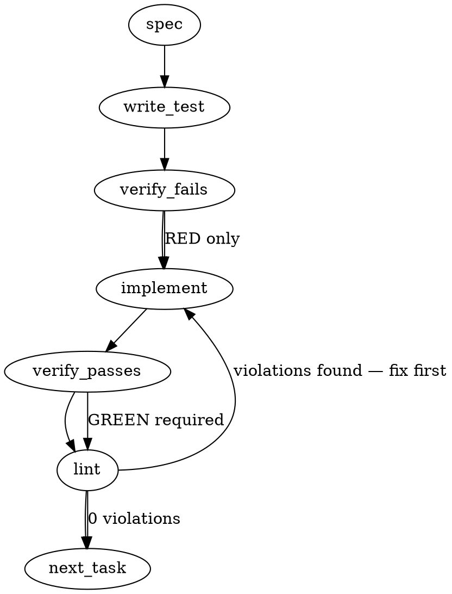

### Problem Statement

The Git hooks (pre-commit/pre-push) fail to automatically arm the "strict" tier when run from a Claude Code session. The hook's environment detection keys on `CLAUDE_CODE_AGENT` and `CLAUDE_VERSION`, neither of which are set by live Claude Code seats (which instead set `CLAUDECODE=1`), rendering the automated agent guard inert.

### Architectural Context

- **Lesson — Use sync anchors for inlined standalone code:** The shell script template for git hooks is standalone and inlined within the codebase. Changes to this detection logic must maintain exact parity with any companion TS parsing/detection utilities and must be backed by parity-drift assertions.
- **Lesson — Document wrapper contracts in agent prompts:** When updating the hook detection surface or changing the environment contract, we must ensure any embedded template instructions in CLI templates (such as `CLAUDE.md` generator templates) are updated, and their template version is bumped to trigger re-rendering for existing installations.

### Files to Examine

1. `packages/cli/src/commands/install-hooks.ts` — Core hook-rendering logic, containing the shell script templates for `pre-commit` and `pre-push` with agent-detection logic.
2. `packages/cli/src/commands/init-templates.ts` — Generator for `CLAUDE.md` containing the claims about strict hook tiers and agent automation.
3. `packages/cli/src/commands/doctor.ts` — The doctor command suite where hook status, tiers, and environment flags are analyzed and reported.
4. `packages/core/src/parity-detect.ts` — (If present) Parity and drift detection helper matching generated hook artifacts against expected template outputs.

### Technical Approach & Contracts

To align the implementation with actual execution behavior, we will:

1. **Expand Shell Agent Detection:** Update the shell template in `install-hooks.ts` to support `CLAUDECODE=1` alongside legacy/hypothetical environment keys.
2. **Attest via Doctor Sensor:** Introduce a new Doctor sensor in `doctor.ts` that probes whether the current shell context flags an active agent, outputting the diagnostic assessment during `totem doctor` checks.
3. **Align Claim in CLAUDE.md:** Update the generated template text to precisely state how automatic strict-mode promotion is evaluated, and bump the template version.

#### Data Contract Changes (e.g., Doctor Diagnostics Schema)

If the doctor command outputs structured JSON results, ensure the schema supports reporting agent-detection state:

```typescript
export interface HookDiagnostics {
  installedTier: 'standard' | 'strict';
  isAgentDetected: boolean;
  detectedAgentEnvVars: string[];
  parityMatch: boolean;
}
```

---

### Edge Cases & Traps

- **Stale Hooks:** Users with existing hooks installed won't get the updated detection block automatically. The Doctor command must report a "parity drift" or "version mismatch" on the installed hook files so they are prompted to run `totem hook install` again.
- **Shell Compatibility:** The environment check in the shell script must remain POSIX-compliant and handle empty/unset variables gracefully without throwing errors in environments with strict shell options (`set -u`). Use `[ -n "${CLAUDECODE:-}" ]` or safely quoted `[ -n "$CLAUDECODE" ]`.
- **False Positives:** Ensure testing for `CLAUDECODE` does not accidentally trigger on sub-shells or bridge processes where the variable might be set but the interactive agent is not driving the execution (though `CLAUDECODE=1` is a highly stable indicator of Claude Code's execution environment).

---

### Implementation Tasks

- [ ] **Task 1: Add environment-variable assertions to parity tests**

  > TEST DIRECTIVE: Before implementing, write a failing test named `detects_claudecode_as_agent_environment` in `packages/core/src/parity-detect.test.ts` (or equivalent test file) that asserts a simulated environment containing `CLAUDECODE=1` resolves `is_agent` to `true`.
  - Locate tests that validate hook configuration or environment detection.
  - Assert that `CLAUDECODE` triggers the agent detection path.
  - _write test → verify fails → implement → verify passes → lint_

- [ ] **Task 2: Update agent-detection snippet in Hook Installer**

  > TOTEM INVARIANT (Use sync anchors for inlined standalone code): Ensure that the shell-script template modifications in `install-hooks.ts` maintain matching sync anchors with the core TS agent resolver so drift detection remains aligned.
  - Modify `packages/cli/src/commands/install-hooks.ts`.
  - Update the pre-commit and pre-push hook template generators to check for `CLAUDECODE`:
    ```sh
    if [ -n "$CLAUDECODE" ] || [ -n "$CLAUDE_CODE_AGENT" ] || [ -n "$CLAUDE_VERSION" ] || [ -n "$CURSOR_TRACE_ID" ]; then
      is_agent=1
    fi
    ```
  - Ensure the change applies to both `pre-commit` and `pre-push` templates.
  - _write test (if hook output is asserted in tests) → verify fails → implement → verify passes → lint_

- [ ] **Task 3: Integrate Agent Probe in Doctor Diagnostics**
  - Modify `packages/cli/src/commands/doctor.ts`.
  - Add a diagnostic sensor row checking if the running environment would be detected as an agent (checking `process.env.CLAUDECODE`, etc.).
  - Report this evaluation under a new row (e.g., "Agent Hook Arm Status").
  - _write test → verify fails → implement → verify passes → lint_

- [ ] **Task 4: Update CLAUDE.md templates and Bump Template Version**
  > TOTEM INVARIANT (Document wrapper contracts in agent prompts): Bump the template version in `init-templates.ts` after updating the embedded instructions so that existing projects trigger standard verification drift/out-of-date diagnostics.
  - Modify `packages/cli/src/commands/init-templates.ts`.
  - Refine the phrasing describing automatic agent-detection to accurately detail `CLAUDECODE` and hook behavior.
  - Bump the CLI template schema/version counter associated with `CLAUDE.md`.
  - _write test → verify fails → implement → verify passes → lint_

---

### Execution Flow



---

### Verification

1. `totem lint` — deterministic rule check (zero LLM, ~2s). Fixes any violations.
2. `totem review` — supplementary AI lanes over the diff (~18s, advisory). Address critical findings.

---

### Test Plan

- **Unit Testing:**
  - Verify `packages/core/src/parity-detect.test.ts` (or the respective suite verifying hook generation) compiles the hook with the updated detection list.
  - Mock `process.env` to contain `CLAUDECODE: "1"` and assert the doctor/cli logic reports `is_agent` as true.
- **Integration Testing:**
  - Run a local generation test of the git hooks (`totem hook install` target) and inspect the rendered `.git/hooks/pre-commit` to ensure `CLAUDECODE` is correctly injected in the target script block.
  - Dry-run `totem doctor` to verify the new sensor output correctly identifies whether the active agent-arm would fire.

---

## Correction (totem-claude, 2026-09-21; revised the same day)

<!-- totem-context: the generated spec above is the committed preflight artifact; this block names where it is wrong against source and what was not followed, the device the mmnto-ai/totem#2896 and mmnto-ai/totem#2917 specs used. The first version of this block called packages/core/src/parity-detect.ts hallucinated without listing it; the leg found the file, and this version corrects the record -->

- **The core file exists, and is the drift detector the spec guessed at.** `packages/core/src/parity-detect.ts` (about 175 KB; its test another 86 KB) carries `detectGeneratedArtifactContract`, which compares an installed hook to the regenerated canonical and reports stale-version drift; the spec's item 4 was right, and its "Stale Hooks" edge case is already served by that detector plus `totem doctor`'s stale-block row. What the spec's "sync anchors" invariant assumed is still absent: no second copy of the detection block lives in core (no `CLAUDE_CODE_AGENT` in any core `.ts`); the only copies are the renderer (`buildAgentDetectionBlock` in `packages/cli/src/commands/install-hooks.ts`), rendered into both hook templates, and this repository's own `tools/pre-commit` and `tools/pre-push`, which `tools-hook-parity.test.ts` byte-locks to the renderer's output and which are regenerated from the built renderer, not hand-edited. Both parity suites are green after the change (core `parity-detect.test.ts` 147, cli `doctor-parity.test.ts` 96).
- **Not followed, the doctor sensor.** A `totem doctor` row attesting that the arm fires under the current shell (the issue's optional half of option 1) is out of this slice; it is recorded on the issue as a follow-up in the ruling comment of 2026-09-21. The `HookDiagnostics` interface the spec proposes is not adopted.
- **Not followed, the directive's test name and file.** The lock lives in `install-hooks.test.ts` beside the existing agent-detection cases, with descriptive titles in the file's own convention: a control run with every marker scrubbed passes, and one run each under `CLAUDECODE=1` and `CLAUDE_CODE_ENTRYPOINT=cli` alone is BLOCKED for missing spec evidence at pre-commit; on the pre-push side an executed case per marker takes the blocking legs arm on the standard tier. RED on the previous block. The managed CLAUDE.md sentence's new half is locked by name in `config-drift.test.ts`, the file that locks the sentence's other halves.
- **Beyond the spec, followed from the issue thread.** `CLAUDE_CODE_ENTRYPOINT` is added as the second marker (lc-claude's 2026-09-13 measurement: a stable value `cli` beside `CLAUDECODE=1`); the two never-observed names stay for explicit exports. The managed CLAUDE.md sentence names the variables and the opt-in for other seats (Tenet 19), and `REFLEX_VERSION` moves to 16 so `totem init` refreshes the block. The changeset is `minor` for the fixed group and discloses the behaviour change for Claude Code seats at the next hook re-render, including that a `hooks.tier: 'standard'` pin does not suppress detection.
- **Edge case answered, corrected.** Under `set -u`, `[ -n "$VAR" ]` on an unset variable is a fatal unbound-variable error, not an empty string. The hooks do not set `-u`, and the existing block already relied on the same form for three names, so the new names change nothing here. No change.
