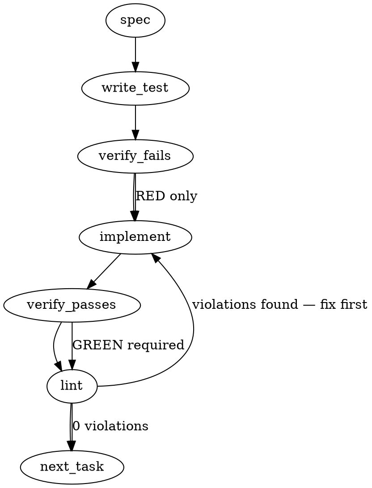

### Problem Statement

The default `searchRelevanceFloor` of `0.25` is effectively unreachable when using unit-normalized embeddings (e.g., Gemini, OpenAI). The store's distance is **squared** L2, bounded within $[0, 4]$ on unit-norm vectors, so relevance `1 / (1 + distance)` ranges over $[0.2, 1]$ — `0.25` is inside that range, but nothing measured comes near it: R1 recorded no delivered relevance below `0.50`, and nonsense queries still score `~0.548`. The exclusion mechanism is inert in practice, not by arithmetic impossibility.

> Corrected in the fold: the generated draft claimed a bound of `0.333` from an unsquared L2 in $[0, 2]$. R1's recorded relevances put the real bound at `0.2` (squared L2).

### Architectural Context

None found in provided context. However, configuration defaults must be kept consistent across the core schema and any default generators to prevent configuration drift.

### Files to Examine

1. `packages/core/src/config-schema.ts` — Defines the configuration schema and the default value of `searchRelevanceFloor`.
2. `docs/wiki/config-reference.md` — Holds the documentation explaining configuration fields, their defaults, and mechanics.
3. `packages/core/src/store/lance-search.ts` — Implements the relevance score calculation logic (`1 / (1 + _distance)`).
4. `packages/cli/src/commands/init-detect.ts` — Standard template generator for initializing fresh user configurations; must be inspected to ensure no hardcoded `0.25` values are generated.

### Technical Approach & Contracts

> This section and § Implementation Tasks were REWRITTEN to the operator's ruling on the R4 experiment record (2026-09-03/04). The generated draft proposed raising the default to `0.55`; the record refutes the premise that a default is the right shape at all. The § Implementation Design appended below is the contract of record.

**The shipped floor is a WHOLE-RUN gate on the BEST vector-leg relevance, not a per-item filter.** Verified at `packages/mcp/src/tools/search-knowledge.ts:860` and `packages/cli/src/commands/spec.ts:716`: MCP answers `no_useful_hits` and returns only floor-exempt hits when `bestRelevance < floor`; `totem spec` refuses an unanchored free-text run when `bestRelevance < floor && floorExempt === 0`. Nothing in the product withholds an individual sub-floor hit while keeping its siblings.

**The measurement (R4, pin `14daff4d`, 55 recorded `totem spec` queries, gemini-embedding-2-preview 768-d).** The lowest best-relevance over delivered specs + code was **0.559** — 0.5687 among the runs the spec refusal was eligible to judge (`floorExempt === 0`). A default of 0.25 therefore fires on no query, and any value below a corpus's own measured floor is equally inert. A reachable value is repo-local by construction: a property of a corpus, its embedder and its labels.

**Approach: remove the default.** Not "calibrate the default" (approach A of the generated draft) and not "add a per-item filter" (a different mechanism, undetermined on this record — R4's A-pre arm — and pre-registered as R5).

- `searchRelevanceFloor` becomes `z.number().min(0).max(1).optional()` — no `.default()`. Bounds unchanged.
- Unset means **no floor**: neither `no_useful_hits` nor the spec below-floor refusal can fire. `totem spec`'s zero-hit refusal is a separate arm and is unaffected.
- `DEFAULT_SEARCH_RELEVANCE_FLOOR` is DELETED from `@mmnto/totem` — replace, one truth, a loud line. No shim, no compat constant.
- The MCP retrieval envelope's `floor` becomes `number | null`, rendering `floor="none"`; the selection manifest records `null` for the same case.
- `totem spec`'s refusal gains a second floor line for the unset case; the artifact records `grounding.floor` only when a floor was applied.
- The calibration recipe is documented; no value is shipped.
- The relevance formula is NOT changed (`lance-search.ts` untouched), keeping similarity-metric behavior deterministic.

#### Data Contract Changes:

In `packages/core/src/config-schema.ts`:

```typescript
// No exported default constant; the key carries no `.default()`.
searchRelevanceFloor: z.number().min(0).max(1).optional(),
```

---

### Edge Cases & Traps

- **A removed public export.** `DEFAULT_SEARCH_RELEVANCE_FLOOR` was exported from `@mmnto/totem`. Its consumers must be measured, not assumed, before deletion — and the semver judgment stated with the measurement beside it.
- **`undefined` is not `0`.** The artifact writer spreads `floor` on `!== undefined`, not on truthiness. A configured `0` must still be persisted; a missing floor must leave the key ABSENT rather than record a number no floor judged.
- **JS comparison hides the arm.** `bestRelevance < undefined` is `false`, so an unset floor silently disables the comparison — but `floor.toFixed()` in the refusal formatter would throw. Both arms need an explicit `!== undefined` guard rather than relying on coercion.
- **Unnormalized embeddings (custom/Ollama).** With unnormalized vectors, distances can exceed the unit-norm bound and relevance can fall lower than the observed range. This is one more reason a value calibrated on one profile says nothing about another — which the documentation must say.
- **Unit test overrides.** Tests in `packages/cli` and `packages/mcp` pin `0.25`, `floor="0.250"` and the old `(schema default 0.25 when unset)` suffix. These are EXTENDED (set a floor explicitly, or assert the new text) — never weakened.

---

### Implementation Tasks

- [ ] **Task 1: Core — the key loses its default**
  - `packages/core/src/config-schema.ts`: `searchRelevanceFloor: z.number().min(0).max(1).optional()`; delete `DEFAULT_SEARCH_RELEVANCE_FLOOR`; rewrite the field's doc comment to what the floor IS (a whole-run gate on the best relevance), the measurement, and the unset semantics.
  - `packages/core/src/index.ts`: drop the export.
  - > TEST DIRECTIVE: a config that does not mention the key parses with `searchRelevanceFloor` undefined (and the key absent); a set value round-trips; the `[0, 1]` bounds still reject.
  - Write test → verify fails → implement → verify passes → lint

- [ ] **Task 2: MCP — an effective floor that can be absent**
  - `configuredFloor = config.searchRelevanceFloor` (`number | undefined`); `effectiveFloor = minRelevance ?? configuredFloor`.
  - The below-floor branch runs only when `effectiveFloor !== undefined`.
  - `formatRetrievalEnvelope`'s `floor` becomes `number | null`, rendering `none`; the selection manifest records `null`.
  - Update the `min_relevance` input description; remove the constant's import.
  - > TEST DIRECTIVE: no config floor + no `min_relevance` → `floor="none"`, `status="ok"` even when every hit is weak, manifest floor `null`; `min_relevance` alone fires the arm; a config floor alone is unchanged.
  - Write test → verify fails → implement → verify passes → lint

- [ ] **Task 3: CLI — the refusal's two forms**
  - `evaluateGroundingFloor(context, floor?: number)`: the zero-hit arm unchanged; the below-floor arm requires `floor !== undefined`; `bestRelevance` and `floorExempt` still measured.
  - `formatGroundingRefusal(..., floor: number | undefined, ...)`: the value form drops the `(schema default 0.25 when unset)` suffix; the unset form names the floor as `none` and points at the calibration recipe. The lessons clause becomes `… (ruled mmnto-ai/totem#2727).`
  - The artifact passes `floor` through as-is; confirm the writer omits `undefined`.
  - > TEST DIRECTIVE: `evaluateGroundingFloor(ctx, undefined)` refuses only on zero hits and never withholds; both refusal forms byte-pinned; `grounding.floor` absent when unset and present when set.
  - Write test → verify fails → implement → verify passes → lint

- [ ] **Task 4: Documentation**
  - `docs/wiki/config-reference.md`: no default and why (measured); what the floor compares (the best relevance of one retrieval, whole-run); the two consumers; the FTS-exempt rule; how to choose a value.
  - `docs/wiki/cross-repo-mesh.md`: `floor` is the configured value or `none`.
  - `docs/wiki/cli-reference.md`: both refusal examples' floor line; the lessons clause.
  - Verify documentation formatting → lint

---

### Execution Flow (structural constraint)



---

### Verification (MANDATORY — do not skip)

Every implementation MUST end with these steps:

1. `totem lint` — deterministic rule check (zero LLM, ~2s). Fixes any violations.
2. `totem review` — supplementary AI lanes over the diff (~18s, advisory). Address critical findings; your team's review discipline decides the review of record.
3. If using MCP, call `verify_execution` to confirm compliance before declaring the task done.

---

### Test Plan

1. **Config schema:** a config that does not set the key parses with `searchRelevanceFloor` undefined; a set value round-trips; `[0, 1]` bounds and the non-number rejection still hold.
2. **MCP, no floor:** every hit weak → `status="ok"`, `floor="none"`, both hits returned with content, manifest floor `null`; an empty result still reports `floor="none"`.
3. **MCP, override only:** `min_relevance` with no configured floor fires the below-floor arm — `no_useful_hits`, candidates disclosed, content withheld, manifest floor the override.
4. **MCP, config floor only:** unchanged behavior (the pre-existing suite, kept).
5. **CLI, no floor:** `evaluateGroundingFloor(ctx, undefined)` proceeds on hits far below any plausible floor and withholds nothing, still reports `bestRelevance`/`floorExempt`, and still refuses on zero hits; a weak free-text run reaches the orchestrator; the artifact OMITS `grounding.floor`.
6. **CLI, both refusal forms byte-pinned:** the `none` line and the value line, each with and without the lessons clause.

---

## Implementation Design

### Scope

Remove the unreachable default relevance floor, make `searchRelevanceFloor` optional (unset = no floor) across its three consumers, and document how to calibrate one. NOT in scope: the relevance formula; a per-item floor (pre-fusion `distanceRange`, the R5 arm — a different mechanism from the shipped whole-run gate); metric-bound relevance (mmnto-ai/totem#2738); the dedup threshold (mmnto-ai/totem#2751); any lesson-pool gate (it needs its own measurement against lesson relevances); any change to which partitions ground a run.

### Data model deltas

`searchRelevanceFloor?: number` (was defaulted). MCP envelope `floor: number | null`; selection-manifest floor nullable. `DEFAULT_SEARCH_RELEVANCE_FLOOR` removed from `@mmnto/totem`.

### State lifecycle

Per run/request only. Nothing persisted except the run artifact's `grounding.floor`, which is now absent when no floor is configured.

### Failure modes

| Failure                                          | Category | Agent-facing surface                                                          | Recovery                        |
| ------------------------------------------------ | -------- | ----------------------------------------------------------------------------- | ------------------------------- |
| No floor configured, every hit weak              | runtime  | MCP `status=ok`, `floor="none"`; spec proceeds (unanchored warning unchanged) | set `searchRelevanceFloor`      |
| No floor, zero grounding hits on a free-text run | runtime  | spec refuses (zero-hit arm), floor line says `none`                           | anchor the run or index content |
| Floor configured, best relevance below it        | runtime  | MCP `no_useful_hits`; spec refuses with the value                             | lower the floor or anchor       |
| A consumer importing the removed constant        | build    | TypeScript error at the import                                                | read the config value           |

### Invariants to lock in via tests

- With no floor, neither `no_useful_hits` nor the below-floor refusal can fire; the zero-hit refusal still can.
- A configured floor or a per-call `min_relevance` restores today's gating behavior; the configured-floor line drops the former default suffix.
- FTS-only hits are never withheld by a floor, and one of them saves a `totem spec` run.
- The run artifact records the floor only when one was applied.

### Open questions (ruled on the recommendations)

- Default removed on the R4 record: the shipped gate compares the best relevance, the fixture's lowest best-relevance is 0.559, so 0.25 never fired; a per-item floor is a different mechanism (R5).
- Lessons never ground a run: ruled final.
- Semver for the removed constant: minor with a loud line (no consumer outside this repo); the operator may rule major at merge.
