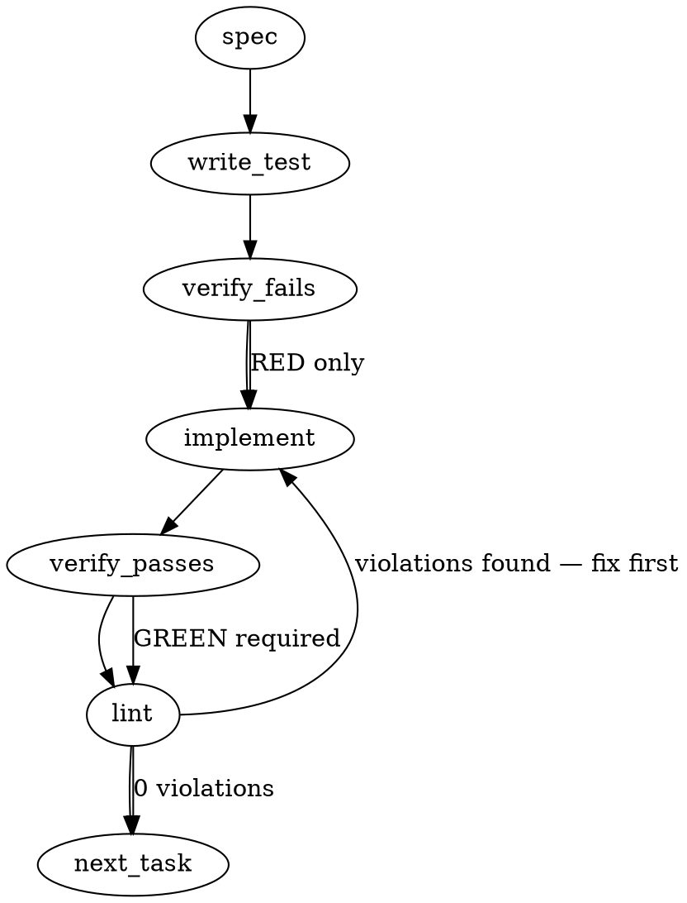

### Problem Statement

The CLI commands `spec`, `shield`, and `triage` retrieve zero lessons from the database because they query the vector/FTS store with `typeFilter: 'spec'` and then attempt to partition lessons (type `lesson`) from that pool. Since the query results only contain items with type `spec`, the partition is empty by construction, resulting in no lessons being injected into the LLM context.

### Architectural Context

- **mmnto-ai/totem#391** introduced lesson injection, partitioning on path (`filePath.endsWith('lessons.md')`) because lessons were part of the spec pool.
- **mmnto-ai/totem#431** migrated lesson files to a dedicated `.totem/lessons/` directory, assigning them the content type `lesson`. It updated `partitionLessons` to filter by `type === 'lesson'` but failed to update the search filters in `spec.ts`, `shield.ts`, and `triage.ts` which still query with `typeFilter: 'spec'`.
- Rather than widening the pool filter (which causes competition within the cap), we will query `spec` and `lesson` as distinct pools.

### Files to Examine

- `packages/cli/src/commands/spec.ts` — contains the `spec` pool query and partition logic.
- `packages/cli/src/commands/shield.ts` — contains the `shield` pool query/partition logic and the sibling duplicate lesson check.
- `packages/cli/src/commands/triage.ts` — contains the `triage` pool query and partition logic.
- `packages/cli/src/utils.ts` — contains `partitionLessons` utility function.

### Technical Approach & Contracts

Instead of fetching a single combined pool and partitioning it, query the store separately for both types to ensure dedicated quotas:

1. **Modify CLI Commands (`spec.ts`, `shield.ts`, `triage.ts`):**
   - Replace the joint `search(store, 'spec', SPEC_SEARCH_POOL)` and subsequent `partitionLessons` call with two distinct search calls in the `Promise.all` block:
     ```typescript
     const [specs, lessons, sessions, code] = await Promise.all([
       search(store, 'spec', MAX_SPECS),
       search(store, 'lesson', MAX_LESSONS),
       search(store, 'session_log', MAX_SESSIONS),
       search(store, 'code', MAX_CODE_RESULTS),
     ]);
     ```
   - This cleanly eliminates the need for `partitionLessons` inside these commands.

2. **Fix Duplicate Check in `shield.ts`:**
   - Locate the lesson deduplication search (around line 934 or inside the lesson generator logic in `packages/cli/src/commands/shield.ts`).
   - Change its `typeFilter` from `'spec'` to `'lesson'`.

3. **Keep `partitionLessons` for backward compatibility (if needed):**
   - Retain `partitionLessons` in `packages/cli/src/utils.ts` to avoid breaking external packages, but ensure it is no longer used by these three CLI commands.

### Edge Cases & Traps

- **Performance Overhead**: Adding an additional query adds a concurrent database lookup. However, because it runs inside `Promise.all` and the Lance/vector database reads are fast, this overhead is negligible.
- **Empty Stores**: If the store is completely new and has zero lesson rows, the returned `lessons` array will be empty. The codebase must handle this without crashing (it already handles empty partitions correctly).
- **Duplicate Lesson Searches in `shield.ts`**: If `shield.ts` continues using `'spec'` for the "EXISTING LESSONS" dedup check, it will fail to see existing lessons and generate duplicate lessons. This must be corrected to query for `'lesson'`.

### Implementation Tasks

- [ ] **Task 1: Create failing integration test for lesson retrieval**

  > TEST DIRECTIVE: Before implementing, write a failing test named `retrieves_lessons_and_specs_separately` that seeds a mock/test store with both `spec` and `lesson` items and asserts that both partitions are populated.
  - File to create/modify: `packages/cli/__tests__/commands.test.ts` (or equivalent cli test suite)
  - Seed the store with 1 `spec` document and 1 `lesson` document.
  - Assert that the runner context retrieves both non-empty lists.
  - Verify test fails.

- [ ] **Task 2: Update `spec` command queries**
  - File to modify: `packages/cli/src/commands/spec.ts`
  - Remove `partitionLessons` import/usage if no longer needed in this file.
  - Split the `spec` search pool into parallel `spec` and `lesson` queries.
  - Update any subsequent logic that references `specs` and `lessons`.
  - Verify test fails/passes.

- [ ] **Task 3: Update `shield` command queries and duplicate check**
  - File to modify: `packages/cli/src/commands/shield.ts`
  - Split the `spec` search pool into parallel `spec` and `lesson` queries.
  - Locate the duplicate lesson check search and update its `typeFilter` from `'spec'` to `'lesson'`.
  - Verify test fails/passes.

- [ ] **Task 4: Update `triage` command queries**
  - File to modify: `packages/cli/src/commands/triage.ts`
  - Split the `spec` search pool into parallel `spec` and `lesson` queries.
  - Verify test fails/passes.

- [ ] **Task 5: Clean up and run full verification suite**
  - Run lint and full unit/integration test suite.
  - Ensure zero compiler errors and zero lint warnings.

### Execution Flow (structural constraint)



### Verification (MANDATORY — do not skip)

Every implementation MUST end with these steps:

1. `totem lint` — deterministic rule check (zero LLM, ~2s). Fixes any violations.
2. `totem review` — supplementary AI lanes over the diff (~18s, advisory). Address critical findings; your team's review discipline decides the review of record.
3. If using MCP, call `verify_execution` to confirm compliance before declaring the task done.

### Test Plan

- **Integration Test**: Assert that a mock workspace indexing both `.totem/lessons/lesson-1.md` and standard spec files populates the model prompt context with non-zero lessons and specs when executing the commands.
- **Regression Check**: Ensure that helper unit tests in `packages/cli/__tests__/utils.test.ts` for `partitionLessons` still pass so that contract compatibility is maintained.

## Implementation Design

Hand-authored by totem-claude 2026-09-03 after the generated spec above (0 lessons delivered to that very run — the defect, live). Sources read: `spec.ts:63-108`, `shield.ts:59-72` + `:925-946`, `triage.ts:59-71`, `review-learn.ts:79-85`, `extract-shared.ts:29-35`, `utils.ts:354-362`, `lance-search.ts:159-167` (`buildWhereClause`: `typeFilter` is ONE `ContentType`, rendered as exact equality — a type list is not supported, so the second-pool cure needs no core change).

### Scope

Every lesson retrieval in the CLI asks the store for `type = 'lesson'` through ONE helper, and each of the five sites that today asks for `'spec'` (three `retrieveContext` pools + three dedup searches, one of them inside `shield.ts`) is re-routed through it; the always-empty partition is deleted. NOT in scope: widening `store.search` to a type list; delivering lessons from LINKED stores (today none arrive from them either — a product question, below); the `session_log` partition (0 chunks indexed — an indexing question, per the issue); the tripled dedup query string `'lesson trap pattern decision'` (left in place); any change to which SPECS are delivered (the top-`MAX_SPECS` by score, before and after).

### Data model deltas

No new type, field, config key or state container.

- **`searchLessons(store, query, maxResults): Promise<SearchResult[]>`** — new export in `packages/cli/src/utils.ts`: `store.search({ query, typeFilter: 'lesson', maxResults })`. The single place the lesson type is spelled. Pure pass-through; no caching.
- **`partitionLessons` — DELETED** from `utils.ts`, with its three unit tests. It is internal to `@mmnto/cli` (a binary, not a library); no consumer we don't control exists (the project's no-legacy ruling, mmnto-ai/totem#2691). Keeping a helper that nothing calls is the legacy-before-a-consumer shape.
- **`SPEC_SEARCH_POOL` (20) — DELETED** from `spec.ts`, `shield.ts`, `triage.ts`: the over-fetch existed only to leave room for a partition that never fired. Each spec pool is fetched at its own cap (`MAX_SPECS` 5 / `MAX_SPEC_RESULTS`), which delivers the same top-N-by-score rows the partition's `.slice(0, N)` delivered. `spec.ts`'s linked-store merge (push + re-sort + `.slice(0, MAX_SPECS)`) is unchanged, so the top-5 of the union is the same set.
- Existing caps become the lesson POOL caps, unchanged in value: `spec.ts` `MAX_LESSONS` 10 (also imported by `shield.ts`), `triage.ts` `MAX_LESSONS` 5, dedup sites `MAX_EXISTING_LESSONS`.
- `retrieveContext` in `shield.ts` and `triage.ts` becomes a named export (test seam only; `spec.ts` already exports its own). Nothing else in their module surface changes.

### State lifecycle

None. Every call is per-request: the store handle is the caller's, the result arrays live for the one prompt assembly, nothing is memoized.

### Failure modes

| Failure                                                                                       | Category               | Agent-facing surface                                                                                                    | Recovery                                                                                                                           |
| --------------------------------------------------------------------------------------------- | ---------------------- | ----------------------------------------------------------------------------------------------------------------------- | ---------------------------------------------------------------------------------------------------------------------------------- |
| The lesson pool query rejects (store/embedder error) inside a `retrieveContext` `Promise.all` | runtime / transient    | hard error — the whole retrieval rejects, exactly as the spec/session/code pools do today (same class, one more member) | the command's existing store-error path; no partial context is minted                                                              |
| The store holds 0 `lesson` rows (fresh checkout, unindexed lessons)                           | runtime                | silent-by-design: `lessons = []`, `formatLessonSection` returns `''`, the `Found: … 0 lessons` line prints the 0        | index the lessons (`totem sync`); the count line is the disclosure — Tenet 4 satisfied because the number is printed, not hidden   |
| A dedup search rejects in `shield.ts` `learnFromVerdict`                                      | runtime / transient    | existing `try/catch` → one dim non-fatal line, extraction proceeds without dedup context                                | unchanged                                                                                                                          |
| A dedup search rejects in `review-learn` / `extract-*`                                        | runtime / transient    | unchanged error surface (these sites have no catch today; the helper adds none)                                         | unchanged                                                                                                                          |
| A linked store is asked for lessons                                                           | n/a                    | cannot happen: only the primary store is passed to `searchLessons`; linked stores keep their spec-only query            | —                                                                                                                                  |
| A future site spells `typeFilter: 'spec'` for a lesson search again                           | permanent (regression) | none at runtime — which is the mmnto-ai/totem#431 class itself                                                          | the invariants below: the helper's test pins the type; the three `retrieveContext` tests assert the store was asked for `'lesson'` |

### Invariants to lock in via tests

- **The lesson type is spelled once, and correctly:** `searchLessons` asks the store for exactly `typeFilter === 'lesson'`, passing `query` and `maxResults` through unchanged (spy store).
- **A spec-typed pool can never contain a lesson — at the real store:** `packages/core/src/store/lance-store.test.ts`: one `lesson` row and one `spec` row seeded; `typeFilter: 'lesson'` returns only the lesson; `typeFilter: 'spec'` returns no lesson. The construction fact the issue proves, pinned where it is true.
- **Each of the three `retrieveContext`s delivers a lesson when the store holds one** — the test the issue says would have caught mmnto-ai/totem#431: with the harness seeded `lesson: [one row]` and `spec: [one row]`, `retrieveContext` returns `lessons.length === 1` AND `specs.length === 1`, and the store received a `'lesson'`-typed query (spec, shield, triage — one test each; shield's and triage's via the new export).
- **Specs delivered are unchanged by the cap change:** with more spec rows seeded than `MAX_SPECS`, `specs` is the top-`MAX_SPECS` by score, in score order; with a linked store, the merged top-`MAX_SPECS` is by score across both.
- **Lessons come from the primary store only:** with a linked store present, the linked store receives no `'lesson'`-typed query.
- **The dedup sites ask for lessons:** `retrieveExistingLessons` (extract-shared, review-learn) and the `learnFromVerdict` dedup block send `typeFilter: 'lesson'` (spy store; one assertion each).
- **Live falsifier (recorded in the PR, not a unit test):** `totem spec 2735 --stdout` in this worktree after the fix prints `Found: … N lessons` with N > 0 against this checkout's index (0 before, in the run recorded above); and the round's `scripts/r1-retrieve.mjs --resident <this worktree> --out <scratch>` replayed over the 55 recorded queries reports how many now deliver ≥ 1 lesson (R1 measured 0/55).

### Open questions

- **Question 1:** Delete `partitionLessons` (and its three unit tests), or keep it unused?
  - **Options:** delete — one truth, no dead seam (the generated spec's "backward compatibility" is speculative: the CLI is a binary); keep — zero risk to an unknown importer.
  - **Recommendation:** delete.
- **Question 2:** Should lessons also come from LINKED stores (cross-repo lessons)?
  - **Options:** primary-only now (restores the mmnto-ai/totem#391 behaviour: lessons were always the primary's) — minimal diff; linked too — a product decision on cross-repo lesson delivery plus a merge/rank rule, better as its own slice.
  - **Recommendation:** primary-only; a follow-up filed only on your word if wanted.
- **Question 3:** Export `retrieveContext` from `shield.ts` / `triage.ts` for the regression tests?
  - **Options:** export (mirrors `spec.ts`; two one-word changes); or test through the full command with a stubbed store (heavier, no existing seam in the shield/triage suites).
  - **Recommendation:** export.
- **Question 4:** Re-run the 55-query R1 replay after the fix and publish the count in the PR body?
  - **Options:** yes — 55 Gemini embed calls against the local index, output to scratch, the slice's own falsifier; no — the unit invariants suffice.
  - **Recommendation:** yes.
