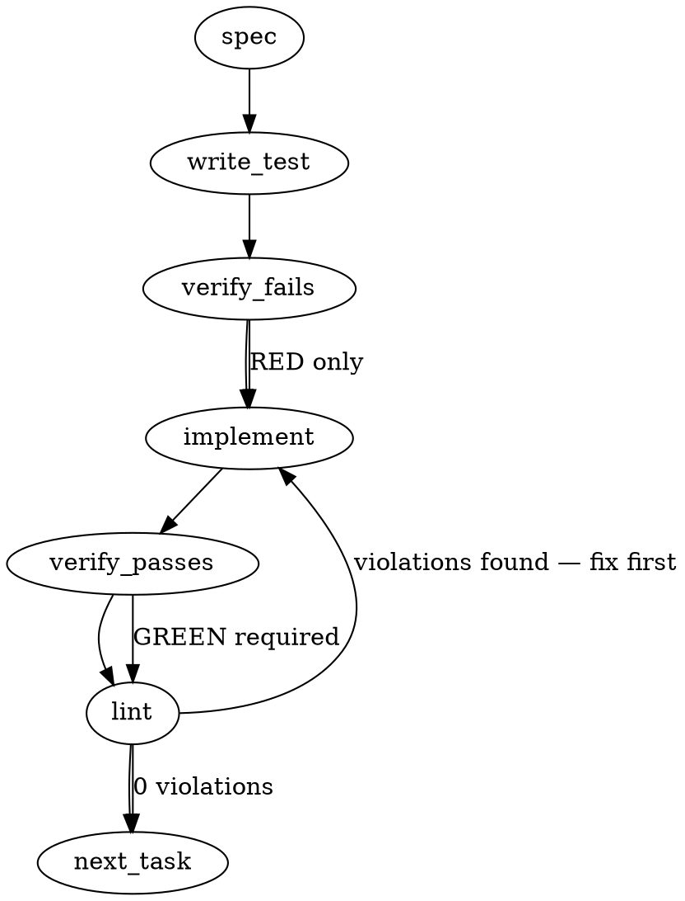

### Problem Statement

The pre-commit spec-gate reader has two critical defects that make it both too weak and too strict:

1. **Level-Blind Body Predicate**: The body scan terminates at any heading level (1-6). Consequently, if a section begins with a sub-heading (e.g., `#### Context`), it is falsely flagged as empty.
2. **Exact-Match Text Check**: The reader requires exact string matching for headers, meaning a draft that drops a parenthetical (e.g., writing `### Verification` instead of `### Verification (MANDATORY — do not skip)`) is falsely flagged as missing the heading.

We must resolve these defects in the generated pre-commit hook using a TDD approach with a frozen mutation suite before extending the gate to require all 9 standard spec headings.

### Architectural Context

- **PR Context**: This is a direct implementation of the synthesis § 2.5 disposition row ("Two reader defects, a slice in totem's lane").
- **The Hook Generation Pipeline**: The pre-commit gate is generated dynamically as a string template inside `packages/cli/src/commands/install-hooks.ts` by `buildPreCommitHook` and written directly to `.git/hooks/pre-commit`. Testing must occur against the _generated_ hook code (via a sandboxed evaluation or subprocess execution) to guarantee the real hook behaves correctly, bypassing the limitation of testing only a transcription.
- **Relevant Lessons**:
  - _Lesson — When two scope dialects share one runtime, every dispatch_: Reminds us that any change to matching behavior must be single-homed and robust. We will define a clear, centralized normalization helper within the generated hook code so that both the search query and target line use the exact same matching dialect.

### Files to Examine

- `packages/cli/src/commands/install-hooks.ts` — Contains the hook generation string template (`buildPreCommitHook`), where `isHeading`, `hasBodyAfter`, and the validation loop are constructed.
- `packages/cli/src/commands/install-hooks.test.ts` — The test suite where the frozen positive/negative mutation tests must be implemented.

### Technical Approach & Contracts

To resolve the defects while keeping the generated hook lightweight and self-contained, we will modify the template literal in `packages/cli/src/commands/install-hooks.ts`:

#### 1. Level-Aware Heading & Body Check

Refactor the generated helper functions to capture and utilize the heading depth:

- `headingLevel(line: string): number`
  - Scans for leading `#` tags (1 to 6).
  - Verifies whitespace separator logic.
  - Returns the depth `n` (or `0` if not a heading).
- `hasBodyAfter(startIndex: number, sectionLevel: number): boolean`
  - Scans lines following the match.
  - Terminates (returns `false`) ONLY if it encounters a heading whose level is **less than or equal to** `sectionLevel` (i.e., same or shallower level).
  - Returns `true` if it encounters any non-empty, non-whitespace line before termination.

#### 2. Symmetrical Heading-Text Tolerance Matching

Introduce a `stripParen(s)` helper inside the hook template. The ruled tolerance is ONE trailing parenthetical group, and nothing else — no casing change, no downcasing, no stripping of the markdown prefix:

- `stripParen(text: string): string`
  - Trims the end; if the last character is not `)`, returns the string unchanged.
  - Otherwise finds the LAST `(`; if it is at index 0 or absent, returns the string unchanged.
  - Otherwise returns everything before it, end-trimmed.
  - Written as a character scan, no regex.
- Update the search loop to first attempt an exact match (`lines[i].trimEnd() === heading`). Only if no line matched, attempt a tolerant match by comparing `stripParen(lines[i].trimEnd()) === stripParen(heading)` — symmetric, so a dropped parenthetical and a DIFFERENT one both match.
- The heading marker stays part of the compared string, so the level is exact: `## Problem Statement` never satisfies `### Problem Statement`.
- A tolerant match is recorded, not warned about: push `safe(heading) + " ~ " + safe(lines[at].trimEnd())` onto a `tolerated` array, and the PASS line carries `· tolerated <promised> ~ <found>` after `· shape <shape>`. The evidence line is the disclosure surface; stderr is discarded by the hook (`2>/dev/null`).

#### 3. All-9-Headings Extension

Once the mutation suite passes against the corrected defects, update the `REQUIRED` list (derived from `SPEC_REQUIRED_SECTIONS` in `packages/cli/src/commands/install-hooks.ts` or its imported location) to include the full 9 standard sections:

1. `### Problem Statement`
2. `### Architectural Context`
3. `### Files to Examine`
4. `### Technical Approach & Contracts`
5. `### Edge Cases & Traps`
6. `### Implementation Tasks`
7. `### Execution Flow (structural constraint)`
8. `### Verification (MANDATORY — do not skip)`
9. `### Test Plan`

### Edge Cases & Traps

- **Symmetric Normalization**: Do not just strip parentheticals from the file lines; strip them from the `REQUIRED` definitions during matching too. This prevents mismatching if either side carries subtle whitespace or minor punctuation variances.
- **Template Escaping**: The hook is generated from a template literal inside TypeScript and its reader lives inside a single-quoted `node -e` word, so the reader body may carry no single quote and no regex literal that needs backslash escaping. `stripParen` is therefore a character scan (`trimEnd`, `charAt`, `lastIndexOf`, `slice`) — no regex, no escaping hazard, nothing that reads differently in source and in the rendered hook.
- **Shell & JS Compatibility**: The generated hook is executed by the system's Node interpreter. Ensure no modern ESNext features are written into the template string that could fail on older Node.js LTS engines.
- **REFLEX_VERSION is NOT the hook's version**: it governs only the AGENTS.md / CLAUDE.md reflex block (`init.ts` ≈ 1023–1026, 1683). Hook installation in `totem init` runs unconditionally, OUTSIDE that branch (≈ 1729), and `doctor` never reads the constant. `AI_PROMPT_BLOCK` does not change in this slice, so bumping it would churn every consumer's reflex block for no content change. A changed hook body reaches consumers through the next `totem init` / `totem hook install`: a totem-owned hook is drift-repaired in place; a hook carrying content after its end marker needs `--force` until mmnto-ai/totem#2753 lands.

### Implementation Tasks

- [ ] **Task 1: Establish the Frozen Mutation Suite**
  - Create/extend the test file `packages/cli/src/commands/install-hooks.test.ts`.
  - Write a suite that calls `buildPreCommitHook` to generate the raw hook code.
  - Implement a runner (e.g. using Node's `vm` module or writing to a temporary file and executing) that executes the hook's validation logic against mock markdown specifications.
    > TEST DIRECTIVE: Before implementing, write a failing test named `mutationSuite_assertsAllDefects` that proves the existing hook fails on:
    >
    > 1. A section opening with a sub-heading (e.g., `#### Context`) — currently falsely flagged as empty.
    > 2. A heading with the parenthetical dropped (e.g., `### Verification`) — currently falsely flagged as missing.
    > 3. And correctly blocks a genuinely empty section or a genuinely missing heading.
  - Run tests -> Verify they fail as expected.

- [ ] **Task 2: Implement Level-Aware Heading Verification**
  - Modify the template string in `packages/cli/src/commands/install-hooks.ts`.
  - Replace `isHeading(line)` with `headingLevel(line)`.
  - Refactor `hasBodyAfter` to accept the parent heading's level and only terminate on levels `<= parentLevel`.
  - Ensure any level checks use `headingLevel` correctly.
  - Run tests -> Verify the sub-heading defect is resolved.

- [ ] **Task 3: Implement Tolerant Heading Matcher**
  - Add the `stripParen(s)` helper inside the generated hook string template — a character scan that removes one trailing parenthetical group; no regex, no casing change, no prefix stripping.
  - Update the matching loop in `install-hooks.ts`: exact match first over every line; only if nothing matched, a second pass comparing `stripParen` of both sides. The `###` marker stays in the compared string, so the level is exact.
  - Record each tolerant match as `safe(heading) + " ~ " + safe(line)` in a `tolerated` array and append `· tolerated …` to the PASS evidence line; nothing is written to stderr (the hook discards it).
  - Run tests -> Verify parenthetical drop defect is resolved, and all positive mutations pass.

- [ ] **Task 4: Regenerate the dev hook & Compile**
  - Do NOT touch `REFLEX_VERSION`: it versions the reflex block, not the hook (see Edge Cases & Traps).
  - Regenerate `tools/pre-commit` from the built builder so it stays byte-identical to `buildPreCommitHook(RENDER)` — `tools-hook-parity.test.ts` and `hook-totemdir-render.test.ts` assert it.
  - Run `totem lint` to ensure no syntax/formatting errors exist in the compiler files.

- [ ] **Task 5: Extend Required Sections to All 9 Headings**
  - Locate `SPEC_REQUIRED_SECTIONS` in the codebase.
  - Update the list to contain all 9 canonical spec headings.
  - Verify that existing valid specs pass the new 9-heading gate, while non-compliant ones are flagged.
  - Run the full test suite to ensure green execution.

### Execution Flow (structural constraint)

### Verification (MANDATORY — do not skip)

1. `totem lint` — run local linter over the modified files. Fix any syntax or structural warnings.
2. `totem review` — invoke local AI lanes over the git diff to flag any architectural regressions.
3. Validate that running `totem hook install` successfully regenerates the local `.git/hooks/pre-commit` file with the new JS matching logic.

### Test Plan

#### Positive Mutations (Must Pass)

- **Deep Nesting**: A spec where `### Technical Approach & Contracts` is immediately followed by `#### Database Schema`.
- **Dropped Parenthetical**: A spec containing `### Verification` matching `### Verification (MANDATORY — do not skip)`.
- **Superfluous Whitespace**: A spec with trailing spaces or tabs on headers.

#### Negative Mutations (Must Block)

- **Genuinely Empty**: A spec where `### Problem Statement` is immediately followed by `### Architectural Context` with no text in between.
- **Whitespace Only**: A spec where a section contains only newlines and spaces.
- **Missing Required Heading**: A spec completely lacking `### Test Plan`.

## Implementation Design

### Scope

Fix the strict pre-commit reader's two measured defects (a level-blind body scan; an exact-match heading test) and extend the promise to all nine headings, in that order, behind a frozen positive/negative mutation suite and the ruled falsifier over the seven recorded R3 drafts. NOT in scope: any content judgment of a draft, schema-constrained rendering (mmnto-ai/totem#2739), the reader's exit vocabulary, the DOCUMENT shape's behavior (its loop was rewritten to the level-aware helper and is proven equivalent), agent detection (mmnto-ai/totem#2706).

### Data model deltas

None. `SPEC_REQUIRED_SECTIONS` grows from two entries to nine (still `as const`, still verbatim SYSTEM_PROMPT lines, still renderable). The reader gains two rendered helpers (`headingLevel`, `stripParen`) and one local array (`tolerated`, per run, read only by the pass line).

### State lifecycle

Per hook invocation only: the reader runs, prints, exits. No file is written. `REFLEX_VERSION` is NOT touched — it versions the AGENTS.md / CLAUDE.md reflex block, which this slice does not change, and hook installation runs outside the branch it gates. A changed hook body reaches consumers through the next `totem init` / `totem hook install`, which drift-repairs a totem-owned hook in place; a hook carrying content after its end marker needs `--force` until mmnto-ai/totem#2753 lands.

### Failure modes

| Failure                                                                                          | Category    | Agent-facing surface                                           | Recovery            |
| ------------------------------------------------------------------------------------------------ | ----------- | -------------------------------------------------------------- | ------------------- |
| A promised heading absent (level-exact)                                                          | runtime     | BLOCKED, `is missing heading <h>`                              | re-run `totem spec` |
| A promised heading with no non-blank, non-heading line before the next same-or-shallower heading | runtime     | BLOCKED, `has an empty heading <h>`                            | re-run `totem spec` |
| A heading matched only after stripping one trailing parenthetical                                | runtime     | PASS; evidence line carries `· tolerated <promised> ~ <found>` | none (sensor)       |
| A draft under the built-in prompt written before this change with fewer than nine headings       | runtime     | BLOCKED by name (the migration cost)                           | re-run `totem spec` |
| A renderability invariant broken by a future heading                                             | init (test) | unit test fails                                                | fix the heading     |

### Invariants to lock in via tests

- A deeper heading neither ends a section body nor counts as one.
- A same-or-shallower heading ends the body; whitespace-only is empty.
- Exact match wins over tolerant; tolerance strips exactly one trailing parenthetical on both sides, keeps the level marker, and is named in the evidence line; trailing whitespace is silent.
- The extended reader blocks 0 of the 7 recorded R3 drafts and names the tolerance on the 3 that dropped parentheticals.
- `tools/pre-commit` is byte-identical to the builder's output; every `SPEC_REQUIRED_SECTIONS` entry is a verbatim SYSTEM_PROMPT line and renderable.

### Open questions (ruled 2026-09-03 on the recommendations)

- Falsifier denominator: all seven real drafts, 0 blocked; the frozen negatives carry the "flags the defective" half. Ruled.
- The all-9 extension ships in this PR as its own commit after the two fixes. Ruled.
- A different (not only a dropped) trailing parenthetical is tolerated and named. Ruled (symmetry of the rule).
