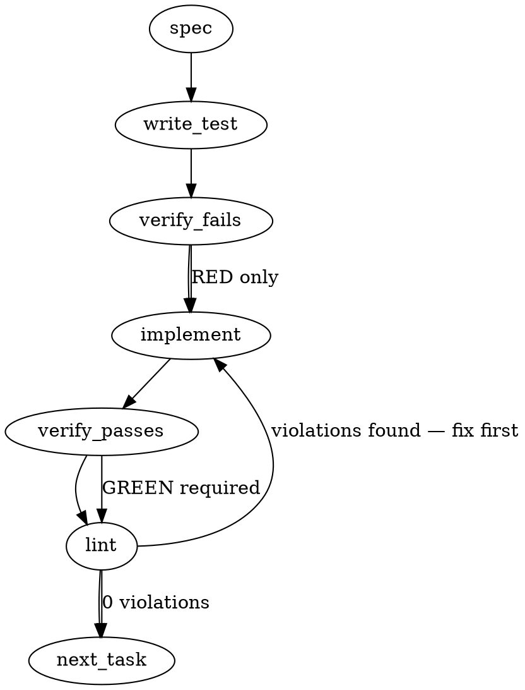

### Problem Statement

The hardcoded vector search relevance normalization formula `1 / (1 + _distance)` in `lance-search.ts` must be replaced with a metric-aware normalization map keyed by a named metric (e.g., `'l2'`). The system must explicitly track the metric as a recorded fact during queries, throw a loud error for unsupported metrics, warn when computed relevance falls outside the `[0, 1]` range, and implement strict invariant tests asserting unit-norm bounds (`[0.2, 1]` for `'l2'`).

### Architectural Context

- **Lesson — Vector databases like LanceDB may silently accept query**: We must make the metric an explicit, recorded fact across query sites to avoid silent mismatches or fallback behaviors.
- **Lesson — 2026-03-06T02:40:46.658Z (Core package test coverage)**: Indicates that the `@mmnto/totem` core package has historically suffered from low test coverage. Implementing precise unit and invariant tests for relevance normalization in `lance-search.ts` is crucial for technical debt remediation and preventing regressions in ranking signals.

### Files to Examine

- `packages/core/src/store/lance-search.ts` — Contains search methods (`vectorSearch`, `search`), the raw row processing function (`rowToSearchResult`), and vector search query sites.
- `packages/core/src/store/lance-store.ts` — Contains the table creation, indexing configurations, and storage properties where vector dimensions/metrics are defined.
- `packages/core/package.json` — To identify testing frameworks (e.g., Vitest or Jest) and execute scripts for testing.

### Technical Approach & Contracts

The metric names are the LanceDB TypeScript SDK's own three spellings — `'l2' | 'cosine' | 'dot'` (`indices.d.ts` `IvfPqOptions.distanceType`, re-used by `VectorQuery.distanceType`). There is no `'ip'`: that is a metric name from other vector databases, and guessing it is exactly the silent drift this issue exists to stop.

The normalization lives in a NEW module — `packages/core/src/store/relevance.ts` — not in `lance-search.ts`, so the pure map stays separable from the search plumbing and is exported from `@mmnto/totem`.

#### 1. Data Contracts & Types

`packages/core/src/store/relevance.ts`:

```typescript
/** The distance metrics the LanceDB TypeScript SDK can be asked for (`VectorQuery.distanceType`). */
export type DistanceMetric = 'l2' | 'cosine' | 'dot';
export const DISTANCE_METRICS: readonly DistanceMetric[] = ['l2', 'cosine', 'dot'];
/** The ONE metric every Totem vector query is issued with (mmnto-ai/totem#2738). */
export const VECTOR_DISTANCE_METRIC: DistanceMetric = 'l2';

export function assertDistanceMetric(value: unknown): DistanceMetric; // throws TotemError('CONFIG_INVALID', …)
export function relevanceFromDistance(metric: DistanceMetric, distance: number): number;
export function isRelevanceInRange(relevance: number): boolean; // finite and within [0, 1]
```

The map is module-private, each entry carrying a doc comment that states the SDK's distance definition, the range on unit-norm vectors, and the resulting relevance range:

- `l2` → `1 / (1 + distance)`. The SDK returns the **SQUARED** L2 distance (MEASURED, R1: 3/3 trials, self-hit 0 and a cosine-0.845 pair returning 0.3096 = l2sq). On unit vectors `distance ∈ [0, 4]` so relevance `∈ [0.2, 1]`. LangChain's euclidean constant presumes a NON-squared distance and is deliberately not borrowed — the doctrine is borrowed, the constant is not.
- `cosine` → `1 - distance / 2`. SDK: cosine distance has range `[0, 2]` → relevance `[0, 1]`.
- `dot` → `1 - distance / 2`. SDK: "If the vectors are normalized … then dot distance is equivalent to the cosine distance", so LanceDB's dot distance is the `1 - a·b` form and takes the same map. On non-unit vectors it can leave `[0, 2]` and the relevance then leaves `[0, 1]` — the case the range warning exists for.

A metric with no entry is unreachable through the type; at runtime `assertDistanceMetric` is the loud gate for any value read off a record. `relevanceFromDistance` itself never warns and never throws on range — it computes; the caller judges with `isRelevanceInRange`. A pure map, one job.

#### 2. Query sites record the metric

Both vector query sites in `packages/core/src/store/lance-search.ts` chain `.distanceType(VECTOR_DISTANCE_METRIC)` explicitly (`runVectorSearch`, `runVectorLeg`), so the metric is a recorded fact in the query rather than the SDK default it happens to coincide with:

```typescript
let q = table.vectorSearch(queryVector!).distanceType(VECTOR_DISTANCE_METRIC).limit(maxResults);
```

#### 3. Range judgment at the search call, one warning per query

`rowToSearchResult(row, sourceContext, tally)` computes `relevance = relevanceFromDistance(VECTOR_DISTANCE_METRIC, distance)` when `_distance` is a finite number and records an out-of-range hit on a small per-call object `{ outOfRange: number; sample?: number }`. Each public search function (`runVectorSearch`, `runHybridSearch`, `runFtsSearch`) creates ONE tally per call and, after mapping, warns once through `onWarn` when `outOfRange > 0`:

```
[Totem] <n> vector hit(s) carried a relevance outside [0, 1] under metric "l2" (sample <value>) — the embedder's vectors may not be unit-norm; results are returned unchanged.
```

`runVectorSearch` gains an `onWarn` parameter — signature order `(table, embedder, onWarn, query, typeFilter, maxResults, sourceContext, boundary?)`, matching `runHybridSearch` — threaded from `this.onWarn` in `lance-store.ts`. A warning, never a throw, never a filter.

#### 4. The index manifest records the metric

`buildIndexManifest` in `packages/core/src/ingest/pipeline.ts` writes `vectorDistanceMetric: VECTOR_DISTANCE_METRIC`. The field is optional on `IndexManifest`: readers must tolerate its absence in manifests written before this change.

#### 5. Exports

`packages/core/src/index.ts` exports `DistanceMetric`, `DISTANCE_METRICS`, `VECTOR_DISTANCE_METRIC`, `assertDistanceMetric`, `relevanceFromDistance`, `isRelevanceInRange`.

### Edge Cases & Traps

- **FTS Rows Relevance**: Ensure Full Text Search (FTS) rows (which contain `_score` but no `_distance`) skip relevance calculations entirely and keep `relevance` as `undefined`. Do not pass FTS rows to `relevanceFromDistance`.
- **Epsilon Deviations**: Floating-point precision may occasionally produce a relevance slightly outside the `[0, 1]` range (e.g., `-1e-16`). The system should issue a warning as required, but must not throw an error or filter out the document.
- **RRF Fusion Preservation**: Verify that Reciprocal Rank Fusion (RRF) logic downstream preserves the `relevance` property intact even when rewriting the fusion `score` attribute.
- **Silent Unsupported Metric Failures**: If an arbitrary string is passed as a metric, the system must throw a loud error immediately rather than falling back silently to a default formula.

### Implementation Tasks

- [ ] **Task 1: The named-metric map (`packages/core/src/store/relevance.ts`)**

  > TEST DIRECTIVE: Before implementing, write a failing test named `throws a TotemError naming the value and the three allowed spellings` that proves `assertDistanceMetric('ip')` is rejected loudly rather than falling back to a default formula.
  - Add `DistanceMetric`, `DISTANCE_METRICS`, `VECTOR_DISTANCE_METRIC`, `assertDistanceMetric`, `relevanceFromDistance`, `isRelevanceInRange`, with the module-private map documented per § Technical Approach.
  - `relevanceFromDistance` computes only — no warning, no throw, no clamp.
  - Export all six from `packages/core/src/index.ts`.
  - Write test (or update existing) → verify fails → implement → verify passes → lint

- [ ] **Task 2: Bind the query and the row mapping to the metric**
  - Chain `.distanceType(VECTOR_DISTANCE_METRIC)` at BOTH vector query sites in `lance-search.ts` (`runVectorSearch`, `runVectorLeg`).
  - `rowToSearchResult` takes a per-call tally and uses `relevanceFromDistance(VECTOR_DISTANCE_METRIC, …)`; delete the hard-coded `1 / (1 + …)` and rewrite the comment above it to name the metric constant and the map. One truth.
  - Give `runVectorSearch` an `onWarn` parameter in the `runHybridSearch` order; thread `this.onWarn` from `lance-store.ts` and update every caller and test call.
  - Each public search function warns at most ONCE per query when the tally is non-zero; nothing is filtered.
  - Update the `SearchResult.relevance` doc comment in `types.ts` to the metric-bound statement.
  - Write test (or update existing) → verify fails → implement → verify passes → lint

- [ ] **Task 3: Record the metric in the index manifest**
  - `buildIndexManifest` writes `vectorDistanceMetric: VECTOR_DISTANCE_METRIC`; the field is optional so older manifests stay readable.
  - Write test (or update existing) → verify fails → implement → verify passes → lint

- [ ] **Task 4: Invariant and range tests**
  > TEST DIRECTIVE: Before implementing, write a failing test named `INVARIANT: unit-norm rows produce relevance in [0.2, 1]` that proves the squared-L2 interval `[0, 4]` maps onto `[0.2, 1]`.
  - `relevance.test.ts`: the pinned map (`l2` d=0 → 1, d=4 → 0.2, d=0.3096 → 0.7636 — the R1 pair; monotone decreasing), the unit-norm sweep over d ∈ {0, 0.5, 1, 2, 3, 4}, `cosine` and `dot` at d ∈ {0, 1, 2}, out-of-range detection (`l2` d=−0.5 → 2; `cosine` d=3 → −0.5; NaN/Infinity), and the `assertDistanceMetric` gate.
  - `lance-search.test.ts`: the fake builder records `distanceType`, and both `runVectorSearch` and `runHybridSearch` are asserted to have issued `'l2'`; a negative `_distance` warns exactly once and the row is still returned with its computed relevance; two out-of-range rows still warn once, naming `2`; FTS rows still carry no `relevance`; the hybrid RRF test still shows the vector-leg relevance surviving fusion.
  - `pipeline.test.ts`: the built manifest carries `vectorDistanceMetric: 'l2'`.
  - Write test (or update existing) → verify fails → implement → verify passes → lint

### Execution Flow (structural constraint)



### Verification (MANDATORY — do not skip)

Every implementation MUST end with these steps:

1. `totem lint` — deterministic rule check (zero LLM, ~2s). Fixes any violations.
2. `totem review` — supplementary AI lanes over the diff (~18s, advisory). Address critical findings; your team's review discipline decides the review of record.
3. If using MCP, call `verify_execution` to confirm compliance before declaring the task done.

### Test Plan

- **Unit Invariant Tests**:
  - Assert that calling `relevanceFromDistance('l2', d)` over $d \in [0, 4]$ bounds returns values within $[0.2, 1]$.
  - Assert that `isRelevanceInRange` is false when the computed relevance is outside $[0, 1]$ (e.g., $d = -0.5$ for `'l2'`, $d = 3$ for `'cosine'`), and that the search call warns once per query rather than throwing or filtering.
  - Assert that `assertDistanceMetric` throws a `TotemError` if an unknown metric string is passed.
- **Integration Search Test**:
  - Execute a mock search query using the `'l2'` metric and assert that the parsed search results include correct `relevance` values based on their `_distance` output.
  - Execute FTS search queries and assert that their results contain `relevance: undefined` while maintaining valid `score` parameters.

## Implementation Design

### Scope

Replace the hard-coded `1/(1 + _distance)` with a named-metric map keyed by the metric the store explicitly queries with, record that metric in the query and in the index manifest, and warn once per query when a computed relevance leaves [0, 1]. NOT in scope: the floor or its default (mmnto-ai/totem#2727), a per-item or pre-fusion floor (`distanceRange`), any threshold, vector normalization, the embedders.

### Data model deltas

`DistanceMetric` (`'l2' | 'cosine' | 'dot'`), `VECTOR_DISTANCE_METRIC = 'l2'`, `relevanceFromDistance`, `isRelevanceInRange`, `assertDistanceMetric` in core (`store/relevance.ts`, exported). Index manifest gains `vectorDistanceMetric`. `runVectorSearch` gains `onWarn`. No config key.

### State lifecycle

Per query: a small counter object lives for one search call and drives at most one warning. The manifest field is written at sync and read by nothing yet (a recorded fact).

### Failure modes

| Failure                                                                              | Category | Agent-facing surface                                                                        | Recovery                   |
| ------------------------------------------------------------------------------------ | -------- | ------------------------------------------------------------------------------------------- | -------------------------- |
| A relevance outside [0, 1] (non-unit vectors under `dot`, or a negative `_distance`) | runtime  | one warning per query naming the metric, the count and a sample; results returned unchanged | check the embedder profile |
| A metric spelling outside the SDK's three                                            | init     | `TotemError` from `assertDistanceMetric` naming the allowed spellings                       | fix the value              |
| An older manifest without the field                                                  | runtime  | tolerated (absent)                                                                          | re-sync writes it          |

### Invariants to lock in via tests

- Under `l2` on unit-norm rows relevance ∈ [0.2, 1]; d = 0 → 1; d = 4 → 0.2; the R1 pair (0.3096 → 0.7636).
- Both query sites issue `distanceType('l2')`.
- Out-of-range relevance warns once per query and filters nothing.
- FTS rows carry no relevance; a hybrid row keeps its vector-leg relevance; ordering unchanged.
- The manifest records the metric.

### Open questions (ruled on the recommendations)

- Metric names are the SDK's (`l2` / `cosine` / `dot`), not `ip`. Ruled.
- The map is pure; the range judgment and the warning sit at the search call. Ruled.
- `dot` maps like `cosine` on the SDK's documented equivalence for unit vectors, and is the metric the out-of-range warning exists for. Ruled.
