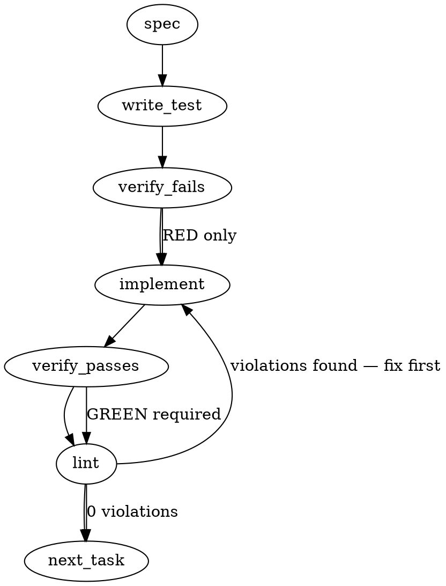

### Problem Statement

The OIDC provenance verification step (`tools/verify-oidc-provenance.mjs`) has a retry budget of only 5 attempts separated by 4 × 5 s sleeps — about 20 seconds of waiting, and the step itself ran 21 seconds — against an npm registry propagation delay of minutes, causing false-positive workflow failures. Furthermore, the `Push release tags` workflow step is coupled to the verification step's success, preventing the floating `v0` release tag from being updated even when the publish step succeeds.

### Architectural Context

- **Lesson — npm OIDC trusted publishing prerequisites**: Emphasizes that OIDC trusted publishing requires correct permissions and environment. The verification gate must remain robust but should not produce false-positive failures due to propagation delays.
- **Lesson — Alpha-pilot publish exemption from Sigstore gating**: Highlights that while security gates are critical, operational flow and release propagation must be modeled accurately to avoid artificial blockages.

### Files to Examine

- `tools/verify-oidc-provenance.mjs` — Contains the retry constants (`MAX_ATTEMPTS`, `RETRY_DELAY_MS`) and the sequential package verification logic.
- `.github/workflows/release.yml` — Defines the workflow execution steps, dependencies, and conditions for OIDC verification and tag pushing.
- `tools/verify-oidc-provenance.test.mjs` — The test suite for the verification logic where retry behavior and error aggregation must be validated.

### Technical Approach & Contracts

1. **Extend the Visibility Budget**:
   - Replace the fixed attempt count in `tools/verify-oidc-provenance.mjs` with a deadline-driven poller: `POLL_INTERVAL_MS = 15_000` (poll every 15 seconds) and `VISIBILITY_DEADLINE_MS = 10 * 60_000` (a 10-minute floor — a package that stays invisible is polled for at least that long from the start of polling). 10 minutes covers the measured 6 min 57 s propagation with margin.
   - Poll round-robin across all packages: every still-pending spec is fetched once per round, and a spec that resolves is never fetched again, so one slow package cannot hide the others.
   - The ceiling is `worstCaseMs(pendingCount) = VISIBILITY_DEADLINE_MS + POLL_INTERVAL_MS + pendingCount * SPAWN_TIMEOUT_MS` — the deadline, plus the one 15-second poll interval the final round can start past it (the deadline is checked after a round and before the sleep), plus one 20-second spawn timeout per package still pending in that round (≈ 11 min 35 s for the four published packages).
   - Set the workflow's outer step cap to `timeout-minutes: 13`, which must stay ≥ the ceiling; the test pins that relation.
2. **Batch Verification Execution**:
   - Refactor `tools/verify-oidc-provenance.mjs` to run the verification process over all targeted packages before throwing an error.
   - Instead of immediately exiting the process on the first 404/miss, collect package verification failures into an array, log all specific failures at the end, and exit with a non-zero exit code if the array is non-empty.
3. **Decouple the Release Tag Updates**:
   - Modify the `Push release tags` job or step within `.github/workflows/release.yml` to evaluate based on whether the publishing step successfully completed, regardless of whether the OIDC verification step failed or succeeded.
   - Use a conditional expression such as `if: always() && steps.publish.outputs.published == 'true'` (or the appropriate job-level equivalent depending on workflow topology) to ensure the floating tags are repointed.

### Edge Cases & Traps

- **Workflow Cancellation**: Using `always()` in GitHub Actions can cause steps to run even when a workflow run is manually cancelled. Ensure the condition strictly checks that the publishing steps completed successfully and that the runner was not cancelled (e.g., using `!cancelled()`).
- **Cumulative Step Timeouts**: Increasing retry counts must not exceed the job's overall timeout configuration. Ensure that the total possible run duration of `tools/verify-oidc-provenance.mjs` fits comfortably within the GitHub Actions runner step-level `timeout-minutes` threshold.
- **Unintended Execution of Tag Repointing**: If the publishing step is skipped or fails to publish packages, the floating tags must never be repointed. The conditional logic must tightly couple to the exact output indicating a successful publish.

### Implementation Tasks

- [ ] **Task 1: Restructure Verification Script Polling and Budget Constants**
  - Open `tools/verify-oidc-provenance.mjs` and replace `MAX_ATTEMPTS` / `RETRY_DELAY_MS` with `POLL_INTERVAL_MS = 15_000`, `VISIBILITY_DEADLINE_MS = 10 * 60_000`, `SPAWN_TIMEOUT_MS = 20_000` and `worstCaseMs = (pendingCount) => VISIBILITY_DEADLINE_MS + pendingCount * SPAWN_TIMEOUT_MS`, driving a round-robin poller over all packages.
  - Update the commentary above the constants to document the floor (10 minutes of polling for a package that stays invisible), the ceiling (`worstCaseMs(n)` = deadline + pending × 20 s), and that the workflow's `timeout-minutes: 13` is the outer cap that must stay ≥ the ceiling.
    > TEST DIRECTIVE: Before implementing, write a failing test named `asserts_visibility_deadline_covers_measured_propagation` that validates the configured deadline against the measured propagation datum.
  - write test → verify fails → implement → verify passes → lint

- [ ] **Task 2: Refactor Verification Logic to Aggregate Package Failures**
  - Modify `tools/verify-oidc-provenance.mjs` to execute verification against every package in the cohort, gathering all verification errors into a collection.
  - Log failures for all failing packages and exit the process with code `1` only after all packages have been evaluated.
    > TEST DIRECTIVE: Before implementing, write a failing test named `verifies_all_packages_and_reports_aggregated_failures` that mocks a failure on the first package and ensures subsequent packages are still processed.
  - write test → verify fails → implement → verify passes → lint

- [ ] **Task 3: Decouple the Push Release Tags Step**
  - Open `.github/workflows/release.yml`.
  - Update the condition for the `Push release tags` step to use `if: ${{ !cancelled() && steps.publish.outputs.published == 'true' }}` so it runs even if the OIDC verification step fails, while a cancelled run never repoints tags.
  - verify fails (via mock/local dry-run schema validation if possible) → implement → verify passes → lint

### Execution Flow (structural constraint)

### Verification (MANDATORY — do not skip)

Every implementation MUST end with these steps:

1. `totem lint` — deterministic rule check (zero LLM, ~2s). Fixes any violations.
2. `totem review` — supplementary AI lanes over the diff (~18s, advisory). Address critical findings; your team's review discipline decides the review of record.
3. If using MCP, call `verify_execution` to confirm compliance before declaring the task done.

### Test Plan

- **Verification Script Visibility Budget Test**: Verify that the configured visibility deadline is greater than or equal to 7 × 60 000 ms.
- **Batch Error Collection Test**: Simulate verification failures across multiple packages and ensure the script registers and reports all of them before exiting.
- **Workflow Semantic Check**: Validate `.github/workflows/release.yml` syntactically to ensure the GHA conditional logic is valid and decoupled.
