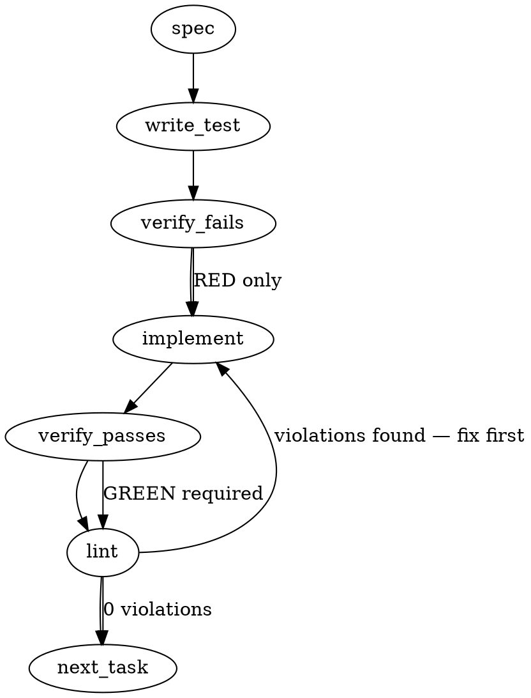

### Problem Statement

The git-hook installation fails to upgrade hook files that contain trailing content after the managed hook's end marker (`# [totem] end pre-commit`, `# [totem] end pre-push`, …), even when that trailing content is headed by an attested `totem:fork` marker, preventing consumers like `liquid-city` from receiving critical hook updates. Additionally, `totem doctor` incorrectly reports hooks as healthy based solely on file presence rather than comparing the managed region's text against the current template to detect stale/drifted hooks.

### Architectural Context

- **Lesson — Guard hook drift repair with end markers**: We must maintain a strict boundary for user-appended content. We extend the boundary logic to recognize and preserve attested trailing content, while continuing to reject un-attested trailing content to prevent safety violations.
- **Lesson — Automated hook upgrades should target specific delimited**: Instead of wiping the file, the installer will surgically replace the managed block — from the hook's start marker (`# [totem] pre-commit hook`, the file's first comment line) through its end marker (`# [totem] end pre-commit`) — and cleanly re-attach the preserved, attested trailing content.
- **Lesson — if this template ever gains a stdin-reading step**: Ensure that any changes to template generation or processing do not accidentally introduce stdin consumption that starves downstream hooks (no stdin-reading changes are introduced here, but the preservation logic must ensure the block order remains correct).

### Files to Examine

- `packages/cli/src/commands/doctor.ts` — Contains `checkGitHooks` which currently checks file presence; must be updated to compare template/managed-region currency.
- `packages/cli/src/commands/install-hooks.ts` — Contains hook generation and writing logic; must be updated to parse and preserve attested trailing blocks.
- `packages/cli/src/commands/install-hooks.test.ts` — To implement tests verifying that an attested trailer is preserved through a managed-block rewrite.
- `packages/cli/src/commands/doctor.test.ts` — To implement tests verifying doctor reports a stale managed block on every install.

### Technical Approach & Contracts

```
[Installed Hook File]                                                 markers, verbatim:
+------------------------------------------------------------------+ start: # [totem] pre-commit hook
| #!/bin/sh                                                        | end:   # [totem] end pre-commit
| # [totem] pre-commit hook — …                                    | (per hook: pre-push /
| <stale hook template content>                                    |  post-merge / post-checkout
| # [totem] end pre-commit                                         |  name themselves)
+------------------------------------------------------------------+  <-- TRAILER
|                                                                  | ┐ the LEADING
| # [lc] docs-inject extension                                     | │ COMMENT RUN —
| # <!-- totem:fork reason="…" owner="…" attested="2026-06-07" --> | │ any number of
|     ^ the marker itself must sit on ONE comment line             | ┘ comment lines
| sh "tools/git-hooks/pre-commit-docs-inject.sh"                   | <- first command
+------------------------------------------------------------------+    ends the run
                  |
                  | (bare totem hook install / totem init)
                  v
[Rewritten Hook File]
+------------------------------------------------------------------+
| #!/bin/sh                                                        |
| # [totem] pre-commit hook — …                                    | <- regenerated
| <CURRENT hook template content>                                  |
| # [totem] end pre-commit                                         |
+------------------------------------------------------------------+
|                                                                  |
| # [lc] docs-inject extension                                     | <- byte-for-byte
| # <!-- totem:fork reason="…" owner="…" attested="2026-06-07" --> |    identical
| sh "tools/git-hooks/pre-commit-docs-inject.sh"                   |
+------------------------------------------------------------------+
```

#### 1. Attested Trailer Predicate (Data Contract)

"Attested" is a property of the trailer's LEADING COMMENT RUN, not of its first line and not of every line in it: the consumer labels its block, signs it once, and then runs it. Two exported predicates in `packages/cli/src/commands/install-hooks.ts`:

```typescript
/** A trailer (the text after a managed hook's end marker) is ATTESTED when its
 *  leading comment run — the lines before its first command — carries a full fork
 *  attestation on a comment line: reason, owner and attested all present and
 *  non-empty (mmnto-ai/totem#2753). */
export function isAttestedTrailer(trailer: string): boolean;

/** The mmnto-ai/totem#2406 owned-whole-file shape with ONE relaxation: the trailer may
 *  be non-blank if it is attested. */
export function isTotemOwnedWithAttestedTrailer(
  content: string,
  marker: string,
  endMarker: string,
): boolean;
```

**Parsing Rules**:

- Walk the trailer's LEADING COMMENT RUN: every line up to the first line that is neither blank nor a shell comment (a line whose `trim()` starts with `#`). Blank lines inside the run are skipped.
- Parse each line of that run with core's `parseForkMarker` (`@mmnto/totem`), which reads `<!-- totem:fork reason="…" owner="…" attested="…" -->` anywhere in the string it is given. On a shell hook the marker rides a comment: `# <!-- totem:fork … -->`.
- The trailer is attested iff SOME line in the run parses AND its `reason`, `owner` and `attested` are each present and non-empty. A trailer with no non-blank line, or a run with no full marker, is NOT attested — the blank case is the pre-existing owned-whole-file shape, which drift-repair already handles.
- The RUN, not the first line. A real consumer labels its block before it signs it: liquid-city's `tools/git-hooks/install.cjs` emits `# [lc] <name> extension` first and the fork marker second, so a first-line-only rule declines the founding datum outright (mmnto-ai/liquid-city#1174).
- A marker that appears only AFTER the first non-comment line does not attest — an attestation buried below code vouches for nothing above it.
- A marker on a NON-comment line never attests. `rm -rf / # <!-- totem:fork … -->` is a command, not a signature.
- The marker must sit on ONE comment line. `parseForkMarker` is applied per line, so core's multi-line (dotAll) form of the marker is not used here: a marker split across two comment lines does not attest.
- A BARE `<!-- totem:fork -->`, or one missing any of the three fields, is NOT attested. Deliberate asymmetry with the parity detector, where a bare marker is enough to claim a fork: carrying a consumer's lines through a rewrite is a maintenance promise, and a promise needs a name, a reason and a date.
- `isTotemOwnedWithAttestedTrailer` reuses the owned-whole-file prefix rule (the start marker opens the file, modulo a shebang + the start of the marker comment) and the end-marker rule, then requires `isAttestedTrailer(content.slice(end + endMarker.length))`.

#### 2. Rewrite-and-Preserve logic in Hook Installer

`installGitHook` gains ONE arm, evaluated where the decline happens, BEFORE it:

1. `--force` short-circuits first, unchanged: it overwrites the WHOLE file, trailer included.
2. Bare drift-repair of a totem-owned whole file (blank trailer), unchanged.
3. NEW: when `isTotemOwnedWithAttestedTrailer(existing, marker, endMarker)` holds, recompose `canonical + trailerTail`, where `trailerTail` is `existing.slice(endIdx + endMarker.length)` with exactly ONE leading line terminator (`\r\n` or `\n`) removed — the canonical already ends with the end marker's own terminator, so the seam must not duplicate it. Everything past the seam is byte-identical. If the recomposed text equals what is on disk, the hook is current: no write. Otherwise write it and report the action.
4. An UNATTESTED trailer keeps today's decline, byte-for-byte the same message.

#### 3. Doctor Currency Verification Contract

Modify `checkGitHooks` in `packages/cli/src/commands/doctor.ts` to return an explicit drift warning when a hook template is out-of-date:

- **Current logic**: Checks if file exists.
- **New logic**:
  - Read each of the four hooks.
  - Extract the managed block (start marker through end marker, inclusive) from both the file and the canonical this `@mmnto/cli` renders at the repo's effective `totemDir` (configured value, else `DEFAULT_TOTEM_DIR`) and the tier the installed hook itself declares.
  - Compare the blocks. This runs on EVERY install — the early return on the default `totemDir` was the blind spot this issue closes.
  - If any differ: `warn` (sensor, never a gate) with `All 4 hooks installed, but <files> <does/do> not match the canonical this @mmnto/cli renders for totemDir '<dir>' — the managed block is stale (a newer hook template, or a config change)`, and a remediation that follows each file's SHAPE: `--force` for an owned-whole or legacy file, a bare `totem hook install` (naming the carry-through) for an attested extension, delete-and-re-append for any other appended block.
  - Otherwise `pass` with `All 4 hooks installed`.

### Edge Cases & Traps

- **Partial attestation**: A marker carrying only some of `reason` / `owner` / `attested` must fail the check. The cure is to complete the marker, not to relax the predicate.
- **Attestation below the first command**: A full marker that appears only after the trailer's leading comment run must fail — it vouches for what follows it, never for what precedes it. A marker on a non-comment line never attests at all.
- **The seam newline**: The canonical hook text ends with the end marker's own terminator. Re-attaching the raw slice after the end marker would duplicate it and the file would grow a blank line on every install. Exactly one leading `\r\n` or `\n` is removed.
- **Tier is not an axis**: The doctor renders the canonical at the tier the INSTALLED hook declares (`TOTEM_HOOK_TIER="…"`), so a `--strict` hook on a repo whose config pins no tier is never reported as drift (mmnto-ai/totem#2692 amendment A10, preserved).
- **A refused `totemDir`**: A configured value the installer rejects (`.`, a `..` segment) never produced installed hooks, so there is no canonical to compare against — the row stays marker-only.
- **No-Marker Files**: A pre-existing hook carrying no totem start marker is fully user-owned: the block is APPENDED below it and the file is never rewritten. A start marker with no end marker (a legacy hook) cannot be bounded and takes the one `totem hook install --force`.

### Implementation Tasks

- [ ] **Task 1: Add the attested-trailer predicates**
  - Implement `isAttestedTrailer(trailer)` and `isTotemOwnedWithAttestedTrailer(content, marker, endMarker)` in the hook management module, factoring the shared prefix/end-marker logic out of `isTotemOwnedWholeFile` into one private helper.
  - File to modify: `packages/cli/src/commands/install-hooks.ts`
  - Test file to modify: `packages/cli/src/commands/install-hooks.test.ts`
    > TEST DIRECTIVE: Before implementing, write failing tests that a blank trailer is not attested, that a full marker past leading blank lines is, and that a full marker on the SECOND non-blank line is not.
  - Write test → verify fails → implement → verify passes → lint

- [ ] **Task 2: Upgrade Hook Installer to Rewrite and Preserve**
  - Modify the write/install logic in `packages/cli/src/commands/install-hooks.ts`.
  - If the trailer is attested, rewrite the managed block in place and carry the trailer through unchanged. If it is not attested and no `--force` is passed, decline exactly as today (`exists`, no write).
  - File to modify: `packages/cli/src/commands/install-hooks.ts`
  - Test file to modify: `packages/cli/src/commands/install-hooks.test.ts`
    > TOTEM INVARIANT (Guard hook drift repair with end markers): Automatic drift-repair of hooks can silently overwrite user-appended scripts if ownership is not tightly bounded. Ensure all hook templates use explicit end-markers and abort no-force updates if trailing content is detected. Preserved here: the relaxation carries the trailing content through rather than clobbering it, and everything unattested still declines.
    > TEST DIRECTIVE: Before implementing, write a failing test that sets up a hook with an older managed block followed by an attested trailer, runs the bare install, and asserts the block is the current canonical while the trailer slice is byte-identical.
  - Write test → verify fails → implement → verify passes → lint

- [ ] **Task 3: Update Doctor Hook Check to Verify Managed Region Currency**
  - Update `checkGitHooks` in `packages/cli/src/commands/doctor.ts`.
  - Instead of checking only file presence, extract the managed region and compare it against the current template (with normalized paths/whitespace) to detect drift.
  - File to modify: `packages/cli/src/commands/doctor.ts`
  - Test file to modify: `packages/cli/src/commands/doctor.test.ts`
    > TEST DIRECTIVE: Before implementing, write a failing test that registers marker-headed hooks whose managed block is behind the canonical on the DEFAULT totemDir, runs the doctor check, and asserts a stale-block warning instead of "All 4 hooks installed".
  - Write test → verify fails → implement → verify passes → lint

### Execution Flow (structural constraint)



### Verification (MANDATORY — do not skip)

Every implementation MUST end with these steps:

1. `totem lint` — deterministic rule check (zero LLM, ~2s). Fixes any violations.
2. `totem review` — supplementary AI lanes over the diff (~18s, advisory). Address critical findings; your team's review discipline decides the review of record.
3. If using MCP, call `verify_execution` to confirm compliance before declaring the task done.

### Test Plan

1. **Attested-trailer parsing** (`isAttestedTrailer`):
   - A blank / whitespace-only trailer is NOT attested (it is the pre-existing owned-whole-file case).
   - Leading blank lines then a full `# <!-- totem:fork reason="…" owner="…" attested="…" -->` line IS attested.
   - A full marker on the SECOND non-blank line is NOT attested.
   - A bare `# <!-- totem:fork -->`, and one carrying only `reason`, are NOT attested.
2. **Hook Upgrades**:
   - Bare install on a hook whose managed block is one comment line behind the canonical, with an attested trailer: the block becomes canonical, the trailer slice is byte-identical, and the summary names the carry-through. Same for pre-push and post-merge.
   - A second bare run on that result writes nothing and reports current.
   - The same input with an unattested / bare-marker / partially attested trailer declines with today's message, file byte-identical.
   - `--force` on that input still overwrites the whole file (the trailer is gone).
3. **Doctor Verification**:
   - Missing hooks -> `warn` naming what is missing (unchanged).
   - Four hooks one comment line behind the canonical with attested trailers, on the DEFAULT totemDir (`config = {}` and `{ totemDir: '.totem' }`) -> `warn` naming all four, remediation `totem hook install` plus the carry-through clause.
   - The same four at the CURRENT canonical with attested trailers -> `pass`, `All 4 hooks installed`.
   - A stale owned-whole file with no trailer on the default totemDir -> `warn` with the `--force` remedy.
   - An unattested trailer -> `warn` with the delete-and-re-append remedy.

## Implementation Design

### Scope

Three arms: (1) `totem doctor` compares every managed git-hook block to the canonical the running CLI renders, on every install, and reports a stale block with its one-command cure; (2) a bare `totem hook install` / `totem init` rewrites a stale managed block in place when the content after the end marker is an attested `totem:fork` extension, carrying that content through byte-for-byte; (3) every hook rewrite renders at flag > `hooks.tier` > the tier the installed hook declares > `standard`, so keeping a hook current never silently downgrades a `--strict` hook (this covers the pre-existing mmnto-ai/totem#2138 whole-file drift-repair, `--force`, and the `<totemDir>/hooks/*.sh` helpers generated for hook-manager repos, as well as the new arm). `totem hook install` reaches all four hooks; `totem init` reaches `pre-commit` and `pre-push` (its post-merge step skips on presence, mmnto-ai/totem#2649, and it does not install post-checkout). NOT in scope: `--force`'s whole-file semantics (unchanged); unattested trailers (decline, unchanged); the init post-merge skip-on-present itself (mmnto-ai/totem#2649); session hooks (`.claude/hooks`, `.gemini/hooks`); the parity detector's fork handling; agent detection (mmnto-ai/totem#2706); the legs gate itself (mmnto-ai/totem#2698).

### Data model deltas

`StaleHookRow.kind` gains `'appended-attested'`. Three exported helpers in install-hooks.ts: `isAttestedTrailer(trailer)`, `isTotemOwnedWithAttestedTrailer(content, marker, endMarker)` and `declaredHookTier(content, marker, endMarker)`. `ResolvedHookRenderOptions` gains an optional `tierPinned?: true`, set when the tier came from a flag or config rather than the default. No config key, no new file, no persisted state.

### State lifecycle

Per invocation. The install arm writes the hook file once (canonical block + the existing trailer with its seam newline normalized) and is idempotent on the second run. The doctor arm reads only.

### Failure modes

| Failure                                                                                              | Category  | Agent-facing surface                                                                                                                                                                                                           | Recovery                                                                                                 |
| ---------------------------------------------------------------------------------------------------- | --------- | ------------------------------------------------------------------------------------------------------------------------------------------------------------------------------------------------------------------------------ | -------------------------------------------------------------------------------------------------------- |
| Managed block stale, trailer attested, marker OPENS the file                                         | runtime   | doctor: warn, remedy `totem hook install`; install: rewritten in place, summary names the carry-through                                                                                                                        | one bare install                                                                                         |
| Managed block stale, trailer attested, but user lines sit ABOVE the block                            | runtime   | doctor: warn with the APPENDED remedy — the classification is gated on the installer's own `isTotemOwnedWithAttestedTrailer`, so the row never names a cure the installer would decline; install: declined (unchanged message) | delete the block and re-append, or `--force`                                                             |
| Managed block stale, trailer unattested                                                              | runtime   | doctor: warn (existing appended remedy); install: declined (unchanged message)                                                                                                                                                 | delete the block and re-append, or `--force`                                                             |
| Attestation marker present but a field missing, or below the first command, or on a non-comment line | runtime   | treated as unattested                                                                                                                                                                                                          | complete the marker (reason, owner, attested) and move it into the comment lines that open the extension |
| Strict hook rewritten on a repo that pins no tier                                                    | runtime   | the hook re-renders at `strict` — the tier it declares — not at the `standard` default; an explicit flag or `hooks.tier` still wins                                                                                            | none; state a flag or `hooks.tier` to change tiers deliberately                                          |
| Canonical cannot be rendered (builder throws)                                                        | runtime   | doctor: warn "could not be compared" (existing)                                                                                                                                                                                | reinstall the CLI                                                                                        |
| Write failure on the rewrite                                                                         | permanent | propagates (Tenet 4), as `installGitHook` does today                                                                                                                                                                           | fix permissions                                                                                          |

### Invariants to lock in via tests

- A bare install on an attested-extension file yields canonical block + byte-identical trailer, and is idempotent.
- An unattested, bare-marker, or partially attested trailer still declines with today's message.
- `--force` still overwrites the whole file.
- Doctor reports a stale managed block on the DEFAULT totemDir (the case the early return hid), with the attested remedy naming the carry-through, and passes when the block is current beside an attested trailer.
- Doctor never names the carry-through cure for a file the installer would decline: an attested trailer under a USER PREAMBLE classifies as `appended` and takes the delete-and-re-append remedy.
- The INSTALLED TIER survives a bare rewrite, on the attested-trailer path, the owned-whole path, `--force`, and the hook-manager helper path; an explicit `--strict` / `--standard` flag still wins in both directions, INCLUDING where no config resolves at all and where a config resolves but will not load (both early returns of `resolveHookRenderOptions` must carry `tierPinned`). Those two tests control the home directory so no global profile can resolve — a machine carrying `~/.totem/totem.config.ts` would otherwise never reach the early returns and the assertion would pass for the wrong reason.
- The fixtures are the VERBATIM liquid-city extension blocks (transcribed from `install.cjs`, joined as it joins them), so the predicate is exercised against the shape a real consumer ships. A marker below the first command, and one on a non-comment line, each decline.

### Open questions (ruled 2026-09-03 on the recommendations)

- Ship both arms, the preserve arm conditioned on an attested trailer only. Ruled.
- Attestation = a full `totem:fork` marker on a comment line within the trailer's leading comment run; a bare marker, a partial marker, or one below the first command is not attested. Ruled, corrected on the falsification leg against `install.cjs` (the first ruling put the marker on the trailer's first non-blank line, which declined the founding datum).
