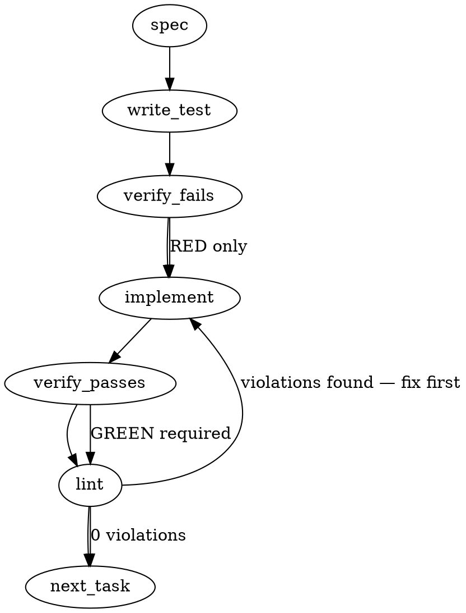

### Problem Statement

The CLI command `totem doctor --parity` returns a `SKIP [honest-absent]` capability-probe verdict for the `gh-issue-label-canon` and `gh-project-vocabulary` posture rows because their detectors are not yet implemented. We must implement both detectors within the network-read-only family, utilizing mockable REST and GraphQL transports without performing inline network calls during core derivation.

### Architectural Context

- **No Grounding Available:** No code repository was retrieved for this run. File paths (except those specified in the issue), core internal module layouts, and internal APIs are treated as **UNVERIFIED ASSUMPTIONS** and must be validated by the developer during implementation.
- **Network-Read-Only Parity Family:** The core system uses snapshot-based parity checks. Snapshots are gathered up-front using mockable command/API interfaces and passed into pure, network-free detectors to keep execution fast, testable, and robust against network failures.

### Files to Examine

1. `packages/cli/src/commands/doctor-parity-fetch.ts` — Houses the up-front snapshot collection logic, handles `GhFetch` injections, and registers row IDs within the network-read-only lifecycle.
2. `scripts/sync-labels.ps1` — The canonical label definition script containing the authoritative list of 18 standard issue labels.
3. `packages/core/src/doctor/parity.ts` _(UNVERIFIED ASSUMPTION)_ — Core logic orchestrating parity verification, containing `checkParity` and the dispatching of row IDs to specialized derivations.
4. `packages/core/src/doctor/detectors/` _(UNVERIFIED ASSUMPTION)_ — Directory structure containing core posture detectors where the new derivation logic should reside.

### Technical Approach & Contracts

We will register the two new row kinds within the up-front snapshotting orchestrator, fetch their raw payloads via local or injected transports, and write pure derivation logic to evaluate the verdicts.

```
                  ┌───────────────────────────────────────────┐
                  │   totem doctor --parity Execution Flow     │
                  └─────────────────────┬─────────────────────┘
                                        │
                                        ▼
                  ┌───────────────────────────────────────────┐
                  │ Snapshot Gathering Phase (with transports)│
                  │ - GhFetch (REST pagination & label API)   │
                  │ - GhGraphql (GraphQL Project query)       │
                  │ - Local or Remote sync-labels.ps1 Read    │
                  └─────────────────────┬─────────────────────┘
                                        │
                                        ▼
                  ┌───────────────────────────────────────────┐
                  │      Pure Derivation Phase (Core)         │
                  │ - gh-issue-label-canon Comparison         │
                  │ - gh-project-vocabulary Set Comparison   │
                  └───────────────────────────────────────────┘
```

#### 1. Data Contracts

**A. `GhGraphql` Transport Signature**

```typescript
export type GhGraphql = <T = any>(query: string, variables?: Record<string, any>) => Promise<T>;
```

**B. GraphQL Project Query & Result Schema**

```typescript
import { z } from 'zod';

export const GhProjectVocabularyQuery = `
  query($org: String!, $number: Int!) {
    organization(login: $org) {
      projectV2(number: $number) {
        fields(first: 50) {
          nodes {
            ... on ProjectV2SingleSelectField {
              name
              options {
                name
              }
            }
          }
        }
      }
    }
  }
`;

export const GhProjectVocabularyResponseSchema = z.object({
  organization: z.object({
    projectV2: z.object({
      fields: z.object({
        nodes: z.array(
          z.object({
            name: z.string(),
            options: z.array(z.object({ name: z.string() })),
          }),
        ),
      }),
    }),
  }),
});

export type GhProjectVocabularyResponse = z.infer<typeof GhProjectVocabularyResponseSchema>;
```

**C. Canonical Label Schema**

```typescript
export const CanonicalLabelSchema = z.object({
  name: z.string(),
  color: z.string(),
  description: z.string(),
});

export type CanonicalLabel = z.infer<typeof CanonicalLabelSchema>;
```

#### 2. Label Parsing Strategy

To extract canonical labels from `scripts/sync-labels.ps1` at runtime, we will write a regex parser.

- **Pattern:** `/gh\s+label\s+edit\s+"([^"]+)"\s+--color\s+"([^"]+)"\s+--description\s+"([^"]+)"/g`
- **Execution:** Read file, apply global match, extract groups to build the `CanonicalLabel` record.

#### 3. Label File Resolution Strategy

To resolve `scripts/sync-labels.ps1`:

- **Approach A:** Read purely from the network via GitHub `/contents/` endpoint.
- **Approach B:** Check if cwd is the local totem repo and read `scripts/sync-labels.ps1` directly; check if doctrine carries the file inside installed packages; fall back to GitHub contents REST API (`GET /repos/mmnto-ai/totem/contents/scripts/sync-labels.ps1`) decoding its base64 payload.
- **Recommendation:** **Approach B** is highly recommended as it avoids unnecessary rate-limiting, handles air-gapped/local testing perfectly, and aligns with the strategy-doctrine charter requirements.

---

### Edge Cases & Traps

1. **GitHub Content API Base64 Decoding:** The GitHub API `/repos/.../contents/...` returns content base64-encoded, potentially containing carriage returns (`\r\n`). We must decode the base64 string cleanly without assuming specific line-ending encodings.
2. **REST Pagination for Labels:** Totem has ~52 labels. If pagination isn't explicitly handled (looping using the `Link` header or paginating up to a ceiling of `per_page=100`), repositories with more labels than `per_page` will yield partial results and false `warn` verdicts.
3. **Missing or Blank Project Bindings:** If `orient.projectNumber` is not present, we must immediately short-circuit to `skip [honest-absent]`. If the graphQL response is missing the target fields, return `unknown` instead of throwing.
4. **Namespace Sensitivity:** Only labels matching namespace tokens (`tier-`, `type: `, `scope: `, `domain: `, `status: `) should trigger `warn` if they are unrecognized. Other namespaces (e.g. `disposition:`, `routine:`) are allowed as permissible metadata and should only be logged as informational payload elements.
5. **GraphQL Error Resiliency:** If the user has a token without organization-level GraphQL project permissions, the GraphQL transport must fail gracefully, returning an `unknown` verdict rather than crashing the CLI run.

---

### Implementation Tasks

- [ ] **Task 1: Register Row IDs and Inject GraphQL Transport Seam**
  - Modify `packages/cli/src/commands/doctor-parity-fetch.ts` and `packages/core/src/doctor/parity.ts` _(UNVERIFIED ASSUMPTIONS)_ to register `gh-issue-label-canon` and `gh-project-vocabulary` in `NETWORK_POSTURE_ROW_IDS`.
  - Add the `GhGraphql` transport signature to the CLI's command invocation context. Ensure `safeExec` is utilized in the CLI runner to execute `gh api graphql` safely when executing commands out of the test environment.
    > TEST DIRECTIVE: Before implementing, write a failing test named `rejectsUnsupportedNetworkPostures` to verify unregistered row IDs are not routed to network posture handlers.
  - Verify fails -> implement -> verify passes -> lint

- [ ] **Task 2: Implement Regex-Based label parser for `sync-labels.ps1`**
  - Create a utility file at `packages/core/src/doctor/utils/parse-labels.ts` _(UNVERIFIED ASSUMPTION)_ containing `parseCanonicalLabels(scriptContent: string): CanonicalLabel[]`.
  - Use regex to extract the 18 labels' names, colors, and descriptions.
    > TEST DIRECTIVE: Before implementing, write a failing test named `parsesValidSyncLabelsScript` and `handlesMalformedSyncLabelsScript` to verify label parsing reliability across quote styles and system line-breaks.
  - Verify fails -> implement -> verify passes -> lint

- [ ] **Task 3: Implement Label Source Resolver**
  - Create `packages/core/src/doctor/utils/resolve-labels-source.ts` _(UNVERIFIED ASSUMPTION)_.
  - Implement a function to resolve `sync-labels.ps1` contents. If the current working directory matches the totem checkout, read the file directly; otherwise, fetch it remotely using `GhFetch` from `GET /repos/mmnto-ai/totem/contents/scripts/sync-labels.ps1` and decode the base64 output.
    > TEST DIRECTIVE: Before implementing, write a failing test named `resolvesLocalSyncLabelsWhenCwdIsRepository` and `fallsBackToRemoteFetchWhenNotInCwd` to verify remote vs local routing rules.
  - Verify fails -> implement -> verify passes -> lint

- [ ] **Task 4: Implement `gh-issue-label-canon` Derivation Logic**
  - Create the pure detector function in `packages/core/src/doctor/detectors/label-canon.ts` _(UNVERIFIED ASSUMPTION)_.
  - Retrieve the current label snapshot (resolving paginated pages if labels exceed 100).
  - Assert that all 18 canonical labels exist, match color, and match description.
  - Categorize extra labels: if they start with `tier-`, `type: `, `scope: `, `domain: `, or `status: `, flag them in the `warn` block. All other extraneous labels belong in `info`.
    > TEST DIRECTIVE: Before implementing, write a failing test named `warnsOnMissingAndRedefinedCanonicalLabels` and `categorizesExtraPermittedNamespacesAsInfo` to ensure rigorous validation boundaries.
  - Verify fails -> implement -> verify passes -> lint

- [ ] **Task 5: Implement `gh-project-vocabulary` Derivation Logic**
  - Create the pure detector function in `packages/core/src/doctor/detectors/project-vocabulary.ts` _(UNVERIFIED ASSUMPTION)_.
  - Issue the GraphQL query via `GhGraphql`. If `orient.projectNumber` is absent, return `skip`.
  - Compare returned option sets for `Status` and `Priority` against the canonical option sets:
    - Status: `['Todo', 'In Progress', 'Done', 'Closed-Lateral', 'Closed-Superseded', 'Closed-Done', 'Informs-Design']`
    - Priority: `['Now', 'Next', 'Blocked', 'Horizon']`
  - Order must be treated as insensitive, while option names must match exactly. Any variation raises a `warn` verdict naming the affected field and list differences (missing, extra, or renamed options).
    > TEST DIRECTIVE: Before implementing, write a failing test named `warnsOnDifferingProjectVocabularyOptions` and `skipsWhenNoProjectIsBound` to verify query interpretation.
  - Verify fails -> implement -> verify passes -> lint

- [ ] **Task 6: Integrate Snapshots with `--json` Output**
  - Ensure the outputs of both detectors are combined and presented in the structured CLI `--json` output alongside other parity indicators.
  - Ensure `tools/gh-parity-twins.cjs` _(UNVERIFIED ASSUMPTION)_ or similar strategy-local tools interpret these findings identically.
    > TEST DIRECTIVE: Before implementing, write a failing test named `doctorParityIncludesNewDetectorsInJsonOutput` to verify output structure and consistency.
  - Verify fails -> implement -> verify passes -> lint

---

### Execution Flow



---

### Verification

Every implementation MUST end with these steps:

1. `totem lint` — deterministic rule check (zero LLM, ~2s). Fixes any violations.
2. `totem review` — supplementary AI lanes over the diff (~18s, advisory). Address critical findings.
3. If using MCP, call `verify_execution` to confirm compliance before declaring the task done.

---

### Test Plan

Configure mock data fixtures mirroring Github payload interactions to execute the following test scenarios:

1. **Canonical Label Verification Scenarios:**
   - Perfect match scenario (every parsed `scripts/sync-labels.ps1` label exists matching name, color, and description) -> returns `pass`.
   - Single mismatch scenario (one label color is modified) -> returns `warn` detailing the mismatch.
   - Out-of-set namespace label (extra label `type: invalid-type` exists) -> returns `warn`.
   - Extraneous untracked namespace label (extra label `disposition: archived` exists) -> returns `pass` with extraneous items listed under `info`.
   - API failure scenario (GitHub contents or label lists cannot be resolved) -> returns `unknown`.
2. **Project Vocabulary Verification Scenarios:**
   - Exact Status and Priority sets match (regardless of order) -> returns `pass`.
   - Missing expected Status options or unexpected extra Status options -> returns `warn`.
   - Bound project is missing completely -> returns `skip`.
   - GraphQL network or permission failure -> returns `unknown`.

## Implementation Design

**Grounding corrections to the generated text above** (it ran with no code context): core's detector lives in `packages/core/src/parity-detect.ts` (`detectNetworkPostureContract`, `NetworkRepoSurfaces`, `NetworkProbeRepoSnapshot`, `DetectNetworkPostureContext`); the CLI fetch edge is `packages/cli/src/commands/doctor-parity-fetch.ts` (`NETWORK_POSTURE_ROW_IDS`, `GhFetch`, `resolveNetworkSnapshots`, `classifyGhError`); the dispatch is the capability-probe block in `packages/cli/src/commands/doctor-parity.ts`. There is no `packages/core/src/doctor/`. The contract type (`packages/core/src/parity-manifest.ts`) already carries `canonicalSource` and `expectedValueOrDerivation`, so both canons are derivable from the pinned manifest row at run time. Neither manifest row declares `consumers` or `blocking`. Live shapes confirmed 2026-09-05: labels are `{name, color (hex, no #), description (string | null)}`; Project 1's single-select fields are `Status` (7 options) and `Priority` (4), `fields.pageInfo.hasNextPage: false`.

### Scope

Two new row kinds join the existing network-read-only family: `gh-issue-label-canon` (REST `GET /repos/<slug>/labels`, paginated, vs the canon parsed at run time from `scripts/sync-labels.ps1`) and `gh-project-vocabulary` (one GraphQL read of the bound project's single-select fields vs the option sets derived from the row's `expected-value-or-derivation` text). It will NOT: mutate a label or a project; run `sync-labels.ps1` or add its `disposition:` namespace (mmnto-ai/totem#2792); touch orient's board rendering; add caching, retries, or a network read of a sibling repo's `totem.config.ts`; change the three posture rows' behavior.

### Data model deltas

- **core `NetworkPostureRow`**: union gains `'gh-issue-label-canon' | 'gh-project-vocabulary'`. Written by the manifest-derived routing registry; read by the fetch edge's surface table and the detector switch.
- **core `NetworkRepoSurfaces`**: gains `labels?: NetworkSurfaceSnapshot` (data = the label array with every page concatenated) and `projectFields?: NetworkSurfaceSnapshot` (data = the raw GraphQL response JSON). Written by the CLI fetch edge, read by the detector. Invariant: a surface is present only when its fetch was attempted for that repo, and it is never partial: a page cap or `hasNextPage: true` degrades the WHOLE surface to `error` (never an undercount; the rulesets precedent).
- **core `NetworkProbeRepoSnapshot`**: gains `project?: { owner: string; number: number }`, the bound project the `projectFields` surface was read for. Present only on the current repo and only when `orient.projectNumber` is set. Written by the fetch edge, read by the detector for the line text.
- **core `DetectNetworkPostureContext`**: gains `labelCanon?: NetworkSurfaceSnapshot`, roster-wide (one canon, many repos): data = the script TEXT, detail = provenance (`local checkout scripts/sync-labels.ps1` or `mmnto-ai/totem:scripts/sync-labels.ps1@<blob sha>`). Written by the CLI edge (`resolveLabelCanon`), read by the label detector.
- **core, new module `packages/core/src/parity-label-canon.ts`** (keeps `parity-detect.ts` from growing past 3.5k lines; exported via the package index): pure functions, no module-level state. `parseLabelCanon(text): CanonicalLabel[]` (`{name, color, description}`; color lowercased without `#`; reads the `gh label edit "<name>" --color "<hex>" --description "<text>"` calls, quoted arguments only). `namespaceTokensOf(canon): string[]` (token = the name through the first `: ` when present, else through the first `-`; derived, not listed). `parseExpectedOptionSets(text): Map<string, Set<string>>` (clauses split on `;`, each `Field = a | b | c`; clauses without `=` ignored). Plus the two verdict derivations `labelCanonLine(...)` and `projectVocabularyLine(...)` returning `LockContentLine`.
- **CLI `doctor-parity-fetch.ts`**: `GhGraphql = (query: string, variables: Record<string, string | number>, cwd: string) => GhFetchResult` seam (default: `gh api graphql -f query=... -F name=value`, read-only; a 200 body carrying `errors` classifies `auth` when the text names permission / scope / resource-not-accessible, else `error`). `SurfaceNeed` gains `labels` and `projectFields`. `ResolveNetworkSnapshotsOptions` gains `projectNumber?: number` and `ghGraphql?: GhGraphql`. New export `resolveLabelCanon({ gitRoot, repoId, ghFetch, readFile? }): NetworkSurfaceSnapshot`: a local read when `repoId === 'totem'`, else `GET /repos/mmnto-ai/totem/contents/scripts/sync-labels.ps1` (base64 decoded, CRLF tolerated). Labels are fetched `?per_page=100&page=N` until a page returns fewer than 100, capped at 10 pages.
- **CLI `doctor-parity.ts`**: passes `config.orient?.projectNumber` into the fetch step and `labelCanon` into the detector context when the label row is registered; `readoutMeta[c.id] = { coverage: 'mechanical', sensesProbed: 'present' }` as the posture rows.
- No new config fields, no reserved keys, no sentinels: absence is `undefined`.

### State lifecycle

Everything is per-invocation of `checkParity`: the snapshots and the canon are created in the fetch step, read once by the detector dispatch, and discarded with the result. No cache, no retry (§14). The `GhFetch`, `GhGraphql`, and `readFile` seams are injected per call (tests) or built as defaults per call. Nothing crosses a lifecycle boundary; nothing is module-level.

### Failure modes

| Failure                                                                | Category        | Agent-facing surface                                    | Recovery                     |
| ---------------------------------------------------------------------- | --------------- | ------------------------------------------------------- | ---------------------------- |
| `gh` absent                                                            | permanent (env) | `skip` no-transport, honest-absent                      | install gh                   |
| 401 / 403 (REST) or a GraphQL `errors` entry naming permission / scope | permanent       | `unknown` auth-class, never a drift verdict             | widen the token scope        |
| 404 on labels or project (private org, wrong number)                   | permanent       | `unknown`                                               | fix the binding              |
| 5xx / timeout / DNS / rate limit                                       | transient       | `unknown`                                               | re-run                       |
| more than 10 label pages                                               | runtime         | whole surface `error` then `unknown` "cannot certify"   | none; never undercount       |
| `fields.pageInfo.hasNextPage: true`                                    | runtime         | `unknown`                                               | raise `first` in code        |
| non-array label payload / unshaped GraphQL payload                     | runtime         | `error` then `unknown`                                  | none                         |
| canon unreadable (local file absent, contents GET failed)              | runtime         | `unknown` "canon unreadable (<provenance>)"             | restore the script / network |
| canon parses to zero labels                                            | runtime         | `unknown` "canon parsed no labels" (fail loud, Tenet 4) | fix the script               |
| row text yields no `Status` / `Priority` clause                        | init (manifest) | `unknown` "cannot derive expected sets from the row"    | doctrine fix                 |
| an expected field absent from the project                              | runtime         | `unknown` naming the field                              | operator adds the field      |
| `orient.projectNumber` unset                                           | init            | `skip` honest-absent "no project bound"                 | bind a project               |
| sibling roster repo (`parityProbeRepos`) on the vocabulary row         | init            | `skip` "bound project not derivable for a sibling repo" | run the doctor in that repo  |

No silent-degradation rows.

### Invariants to lock in via tests

- The parser derives exactly the 18 canonical labels and exactly the five namespace tokens from the REAL `scripts/sync-labels.ps1` in this repo; a canon of zero entries can never yield `pass`.
- A label or project surface that is not `ok` can never yield `warn` or `pass`; a cannot-verify outcome is never a drift verdict.
- Pagination is never partial: a page under 100 ends the walk with every page concatenated; the cap degrades the whole surface.
- Out-of-set detection is lexical on the derived tokens: `scope: docs` warns; `disposition: done`, `routine: weekly`, `1.11.0` are info; `type:bug` (no space) is a bare word, info.
- Color compares case-insensitively without `#`; description compares exactly after trim; a `null` description against canonical text is a redefinition.
- Option sets compare order-insensitively and exactly; extra single-select fields never warn; `first: 50` overflow can never pass.
- Expected option sets come from the contract's `expectedValueOrDerivation`; a manifest without the clause yields `unknown`, never a hardcoded pass.
- The vocabulary row emits one line for the current repo's bound project and one `skip` per sibling; the label row emits one line per roster repo.
- `--json` carries both rows' lines under the same names as the rendered output.
- Neither row enters `blockingDriftIds` unless the manifest row says `blocking: true`.

### Open questions

- **Question:** what does the vocabulary row render for a sibling repo in `orient.parityProbeRepos`?
  **Options:** (a) one honest-absent `skip` per sibling naming why; (b) read each sibling's `totem.config.ts` over the contents API and regex the number, a TS file read as text, fragile; (c) probe the current repo's project for every sibling, wrong for liquid-city.
  **Recommendation:** (a).
- **Question:** where does a non-totem repo read the label canon?
  **Options:** (a) `GET /repos/mmnto-ai/totem/contents/scripts/sync-labels.ps1` on the default branch, provenance disclosed as the blob sha; (b) bundle the canon in the doctrine pack (strategy-owned; a later doctrine change).
  **Recommendation:** (a) now; (b) can replace it without a detector change because the canon arrives as text either way.
- **Question:** expected option sets derived from the row's text, or hardcoded in the detector?
  **Options:** derived (a doctrine bump moves the canon, Tenet 20) vs hardcoded (simpler, a second copy of the truth).
  **Recommendation:** derived; the parser is strict, and a grammar miss renders `unknown`, never a false pass.
- **Question:** a project missing the `Status` or `Priority` field entirely: `unknown` (the issue text) or `warn`?
  **Options:** `unknown` naming the field (not comparable, still visible) vs `warn` (drift).
  **Recommendation:** `unknown`, per the issue; revisit if the operator reads it as drift.
