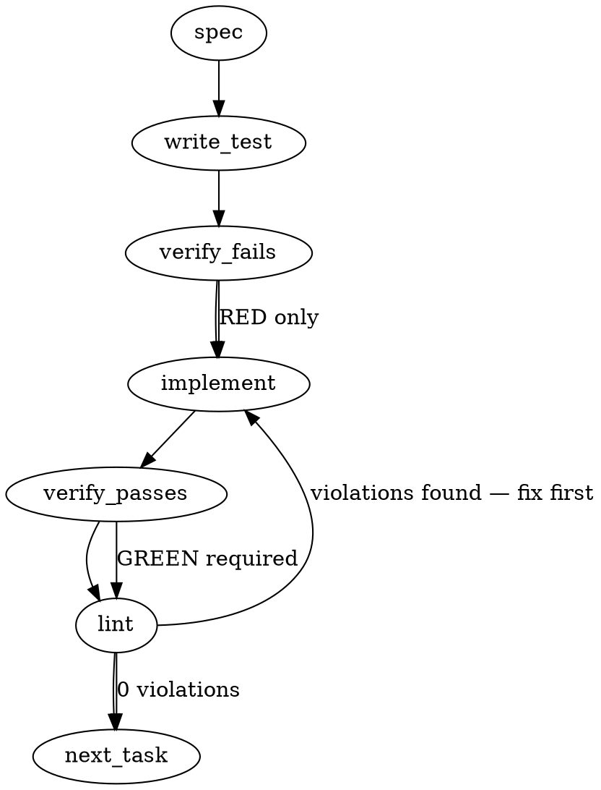

### Problem Statement

The repository's issue creation is currently unstructured (free-form), leading to inconsistent metadata application. We need to transition to GitHub Issue Forms (YAML templates) for the six canonical issue types while disabling blank issues, and update the existing labels sync script (`scripts/sync-labels.ps1`) to include the `disposition:` namespace utilizing `gh label create --force` for convergence.

### Architectural Context

- **Issue Templates Charter Alignment**: As noted in `mmnto-ai/totem-strategy:operations/472-issue-disposition-preregistration.md`, the transition to structured YAML issue templates and the inclusion of `disposition:` labels are operator-approved mandates (2026-09-05 operational greenlight).
- **Rule alignment**:
  > TOTEM INVARIANT (a ruling's record is never aligned to the build): When structural changes deviate from historically recorded specs, do not rewrite the ruling's history; document the precise implementation variation directly under the build instructions.
- **Label Sync Strategy**: The script `scripts/sync-labels.ps1` must continue to support the `-Repo` parameter to ensure compatibility with strategy repository execution.

### Files to Examine

- `scripts/sync-labels.ps1` — The script managing GitHub labels; needs `--force`, `disposition:` configuration, and dry-run output capabilities.
- `.github/ISSUE_TEMPLATE/onboarding.md` — The existing issue template that must be preserved.
- `packages/core/src/parity-detect.orientation-rows.test.ts` — The parity engine logic (specifically `gh-issue-label-canon` verification checks) to understand how the system checks compliance.

### Technical Approach & Contracts

#### 1. GitHub Issue Forms (`.github/ISSUE_TEMPLATE/*.yml`)

We will create six YAML-based issue forms: `bug.yml`, `chore.yml`, `docs.yml`, `epic.yml`, `feature.yml`, and `security.yml`.

- **Global Configuration**: Create `.github/ISSUE_TEMPLATE/config.yml` to disable blank issues:
  ```yaml
  blank_issues_enabled: false
  ```
- **Form Schema (Zod equivalent mapping for Github Form Schema)**:
  Each file will have a structure that assigns its respective `type:` label on creation and mandates the `tier` and `scope` dropdown fields:
  ```yaml
  name: 'Type: <Type-Name>'
  description: 'Create a new <type-name> issue'
  labels: ['type:<type-name>']
  body:
    - type: dropdown
      id: tier
      attributes:
        label: 'Tier'
        description: 'Specify the prioritization tier'
        options:
          - 'tier-1'
          - 'tier-2'
          - 'tier-3'
      validations:
        required: true
    - type: dropdown
      id: scope
      attributes:
        label: 'Scope'
        description: 'Select the affected scope(s)'
        multiple: true
        options:
          - 'cli'
          - 'core'
          - 'mcp'
          - 'ci'
      validations:
        required: true
    - type: textarea
      id: observed
      attributes:
        label: 'Observed'
        placeholder: 'What is currently happening?'
      validations:
        required: true
    - type: textarea
      id: mechanism
      attributes:
        label: 'Mechanism at source'
        placeholder: 'What code or file is responsible?'
      validations:
        required: false
    - type: textarea
      id: ask
      attributes:
        label: 'Ask'
        placeholder: 'What needs to be changed?'
      validations:
        required: true
    - type: textarea
      id: done-when
      attributes:
        label: 'Done when'
        placeholder: 'Criteria for completion'
      validations:
        required: true
  ```

#### 2. Label Sync Script Refactoring (`scripts/sync-labels.ps1`)

- **Dry-Run Switch**: Introduce a standard PowerShell switch `-WhatIf` (or simple `-DryRun` parameter).
- **Force Creation Pattern**: Use `gh label create $labelName --force --color $color --description $desc` to overwrite pre-existing definitions and enforce color/description alignment.
- **Disposition Labels Definition**: Define the six disposition types:
  - `disposition: premise-changed` (Color: `cccccc`, Description: "The underlying premise or environment of this task changed")
  - `disposition: horizon` (Color: `cccccc`, Description: "Deferred beyond the current planning horizon")
  - `disposition: done` (Color: `cccccc`, Description: "Resolved or completed through adjacent or external work")
  - `disposition: obsolete` (Color: `cccccc`, Description: "No longer relevant due to system deprecations or evolution")
  - `disposition: superseded` (Color: `cccccc`, Description: "Replaced by a newer, more precise issue or spec")
  - `disposition: lateral` (Color: `cccccc`, Description: "Transferred to another tracking system or partner repository")

### Edge Cases & Traps

- **Multi-select scope layout**: When `multiple: true` is configured in GitHub forms, users can choose multiple options. The downstream parser reads these values embedded in markdown. Ensure the drop-down elements utilize clear, standardized strings so that markdown text extraction remains consistent.
- **PowerShell parameter binding**: Ensure the script uses standard `[CmdletBinding(SupportsShouldProcess)]` or manually checks `$WhatIf.IsPresent` to avoid dry-run operations executing actual API requests.
- **Authentication**: When `gh label create` is called during a dry run, make sure the script does not block if the operator is unauthenticated in the local environment.

### Implementation Tasks

- [ ] **Task 1: Disable Blank Issue Templates**
      Create `.github/ISSUE_TEMPLATE/config.yml` with `blank_issues_enabled: false`.

  > TEST DIRECTIVE: Before implementing, write a failing test in a shell validation runner checking that `.github/ISSUE_TEMPLATE/config.yml` contains `blank_issues_enabled: false`.
  > _Files to modify_: `.github/ISSUE_TEMPLATE/config.yml`
  > _Verification_: Read back configuration, run `totem lint`.

- [ ] **Task 2: Implement the Canonical Issue Forms**
      Create six new files: `bug.yml`, `chore.yml`, `docs.yml`, `epic.yml`, `feature.yml`, and `security.yml` inside `.github/ISSUE_TEMPLATE/`. Keep `onboarding.md` untouched.
      _Files to modify_: `.github/ISSUE_TEMPLATE/*.yml`

  > TOTEM INVARIANT (a ruling's record is never aligned to the build): Ensure form text matches the exact structures outlined in charter § 4c (ii). If any deviation is forced by GitHub schema limitations, document the variation as a README/comments note directly beside the schema definition.
  > _Verification_: Run a YAML schema validator (or custom parser) against the generated issue forms to guarantee syntax compliance.

- [ ] **Task 3: Add Dry-Run/WhatIf and Force Capabilities to sync-labels.ps1**
      Refactor `scripts/sync-labels.ps1` to accept `-WhatIf` parameter. Add `--force` to the `gh label create` logic so that repeated runs cleanly converge labels.
      _Files to modify_: `scripts/sync-labels.ps1`

  > TEST DIRECTIVE: Before implementing, write a test wrapper or local execution check verifying that running `scripts/sync-labels.ps1 -WhatIf` emits the correct `gh label create` commands to standard out without executing actual `gh` API calls.
  > _Verification_: Execute the script with `-WhatIf` locally to confirm outputs are mapped correctly.

- [ ] **Task 4: Implement Disposition Labels Namespace in sync-labels.ps1**
      Define and declare the six `disposition:` namespace labels with consistent coloring and respective descriptions in `scripts/sync-labels.ps1`. Ensure standard `-Repo` flag execution remains compatible.
      _Files to modify_: `scripts/sync-labels.ps1`
      _Verification_: Execute dry run (`-WhatIf`) and check stdout for the six `disposition:` creation commands.

### Execution Flow (structural constraint)



### Verification (MANDATORY — do not skip)

Every implementation MUST end with these steps:

1. `totem lint` — deterministic rule check (zero LLM, ~2s). Fixes any violations.
2. `totem review` — supplementary AI lanes over the diff (~18s, advisory). Address critical findings; your team's review discipline decides the review of record.
3. If using MCP, call `verify_execution` to confirm compliance before declaring the task done.

### Test Plan

- **Issue Template Validation**:
  - Assert that `.github/ISSUE_TEMPLATE/config.yml` exists and has `blank_issues_enabled` set to `false`.
  - Validate all 6 YAML forms contain required dropdowns for `tier` and `scope` along with custom body fields (`observed`, `mechanism`, `ask`, `done-when`).
- **Sync Labels Script Validation**:
  - Verify `scripts/sync-labels.ps1` successfully processes the `-WhatIf` (or `-DryRun`) switch.
  - Assert that a dry run output includes `gh label create "disposition:..." --force` calls for all 6 canonical disposition states.
  - Verify that running with `-Repo` parameter continues to bind and execute smoothly.

---

> **Superseded above the line.** Everything above is the generated pre-design spec (`totem spec`, gemini-3.5-flash, 2026-09-07, via the worktree's own dist after two headless-CLI timeouts — the unbuilt-workspace fallthrough). Two of its claims are corrected below and govern the build: (1) labels carry the namespace SPACE (`type: bug`, never `type:bug` — both canon parsers keep the trailing space in the token, and a space-less name is a new label that squats the namespace); (2) `gh label create --force` lines are invisible to both canon parsers, which read `gh label edit` lines only, so the disposition labels are defined in the `edit` grammar.

## Implementation Design

### Scope

Six GitHub issue forms (one per canonical `type:` value) plus a `config.yml` that turns blank issues off, and `scripts/sync-labels.ps1` extended with the six `disposition:` labels from charter § 3, a fail-loud auth preflight and a `-WhatIf` dry run — the script and the forms land; the batch-one RUN stays on the operator's word. It will NOT: change either canon parser (totem's `parity-label-canon.ts` or strategy's `gh-parity-twins.cjs`); relabel any existing issue; touch `onboarding.md`; add `scope:` or `tier-*` values; or edit anything in `mmnto-ai/totem-strategy` (the rendered-body contract and the namespace change are sent to strategy-claude by mail).

### Data model deltas

No TypeScript types. Three declared surfaces:

1. **`scripts/sync-labels.ps1` — six canon definitions in the one grammar both parsers read**, `gh label edit "<name>" --color "<hex>" --description "<text>"` (`packages/core/src/parity-label-canon.ts:95`; `tools/gh-parity-twins.cjs:146` in strategy), each preceded by `gh label create "<name>" --color "<hex>" --description "<text>" 2>$null` for existence (`create` errors when the label exists and the error is suppressed; the `edit` that follows converges colour and description on every run — the convergence the issue asked `--force` for, in parseable form). Written by this PR; read by both parsers at run time (the strategy sensor reads the snapshot's copy of the script — a new canon is a new population digest, disclosed by mail). Invariant: the parsed canon is exactly 24 labels (18 today + 6), and `namespaceTokensOf` derives `disposition: ` as a canonical namespace in both readers, so any `disposition: <other>` becomes a namespace-squatter fault — the strictness charter § 3 wants, since it fixes the six. Descriptions are the charter § 3 one-line meanings; one colour for the namespace. The `-WhatIf` switch: `[CmdletBinding(SupportsShouldProcess)]` on the param block and, under `$WhatIfPreference`, a script-scoped `function gh { Write-Host "[WhatIf] gh $args" }` that shadows the executable — every literal `gh label …` line and `Merge-Label`'s inner `gh issue list` and `gh label delete` print instead of calling (its `gh issue edit` never runs under the dry run: the shadowed list returns nothing to iterate — falsification leg F4), and the literal call text stays on each line (a refactor into a helper would leave both parsers with ZERO definitions, and both refuse to judge against an empty canon). Auth preflight: `gh auth status` once, exit 1 with the reason when it fails (today an unauthenticated run silently no-ops every `2>$null` edit — a Tenet 4 gap this PR closes).
2. **`.github/ISSUE_TEMPLATE/{bug,feature,chore,docs,epic,security}.yml`** — each with `labels: ["type: <value>"]` (the space is load-bearing), a required `tier` dropdown (options exactly `tier-1`, `tier-2`, `tier-3`, described with the canon's descriptions), a required multi-select `scope` dropdown (options exactly the canon's `scope:` values without the namespace: `cli`, `core`, `mcp`, `ci`), then the body textareas the repo's issues already use, per type: bug — Observed, Mechanism at source, Ask, Done when; feature — Ask, Why now, Done when, Prior art; chore — What, Why, Done when; docs — Surface, Drift observed, Ask, Done when; epic — Scope, Slices, Done when; security — Observed, Impact, Ask, Done when, with a leading markdown block pointing exploitable vulnerabilities at the private advisory path. Field labels `Tier` and `Scope` render as `### Tier` / `### Scope` headings followed by the value (`cli, core` for a multi-select) — the body contract the rung-1 sensor will parse (strategy's build; `issue-drift.cjs` reads labels only today). Written by this PR; read by GitHub at issue creation and by the sensor.
3. **`.github/ISSUE_TEMPLATE/config.yml`** — `blank_issues_enabled: false`, no contact links.

No state containers, no reserved keys, no sentinels.

### State lifecycle

None in code. The only mutable state is the two repos' label sets, mutated only by the batch-one run on the operator's word (not this PR), and GitHub's template registry, read at issue creation. A `-WhatIf` run creates and mutates nothing.

### Failure modes

| Failure                                                                      | Category  | Agent-facing surface                                                                                                                                                     | Recovery                                                                                                                              |
| ---------------------------------------------------------------------------- | --------- | ------------------------------------------------------------------------------------------------------------------------------------------------------------------------ | ------------------------------------------------------------------------------------------------------------------------------------- |
| `gh` not on PATH                                                             | init      | hard error, exit 1 (existing)                                                                                                                                            | install gh                                                                                                                            |
| `gh` unauthenticated                                                         | init      | today: silent no-op on every suppressed call — changed to a hard error naming `gh auth login`                                                                            | authenticate, re-run                                                                                                                  |
| `gh label create` on an existing label                                       | runtime   | suppressed by design; the `edit` converges                                                                                                                               | none                                                                                                                                  |
| the script refactored so no literal `gh label edit` line remains             | permanent | both canon readers refuse ("parsed no gh label edit definitions")                                                                                                        | the parse-invariant test fails the PR                                                                                                 |
| a form's `labels:` entry is not a canon name (a space-less `type:bug`)       | permanent | GitHub applies nothing or mints a stray label — not grounded which (leg F9); either way the canon's `type:` label is missing                                             | the forms-coupling test fails the PR (exact `type: <basename>`, leg F2)                                                               |
| this PR merges before the batch-one run                                      | runtime   | `totem doctor --parity` reports `gh-issue-label-canon` non-conforming on this repo (six canonical names absent) until the run; not CI-red, `--parity` is opt-in (leg F3) | the batch-one run on the operator's word                                                                                              |
| a form's YAML is invalid                                                     | init      | GitHub renders the template broken; nothing in CI notices today                                                                                                          | the forms test YAML-parses every file                                                                                                 |
| `-WhatIf` shadow leaking into a real run                                     | permanent | labels never written, output looks green                                                                                                                                 | the dry-run test asserts a stubbed `gh` receives the canon's exact call count when `-WhatIf` is absent and none when present (leg F5) |
| multi-select `scope` renders `cli, core`                                     | runtime   | none here; the sensor must split on `, `                                                                                                                                 | named in the mail to strategy-claude                                                                                                  |
| `-Repo mmnto-ai/totem-strategy` run creates the six disposition labels there | runtime   | intended (rung 4 batch one runs the script in both repos)                                                                                                                | none                                                                                                                                  |

No silent degradation remains: the one silent path today (unauthenticated) is made loud.

### Invariants to lock in via tests

- The real `scripts/sync-labels.ps1` parses to exactly 24 canonical labels whose derived namespaces include `disposition: `, and each of the six disposition names is present with the charter's description.
- Every `labels:` entry of every issue form is a name in the parsed canon — the forms cannot ship a label the script does not define.
- Every form carries a required `tier` dropdown whose options equal the canon's `tier-*` names and a required multi-select `scope` dropdown whose options equal the canon's `scope:` values with the namespace stripped, both derived from the parsed script, never hand-listed in the test.
- `config.yml` has `blank_issues_enabled: false`; `onboarding.md` is byte-unchanged.
- A `-WhatIf` run spawns no `gh` process and prints one line per would-be call; a normal run against a stubbed `gh` on PATH makes at least 24 label calls in the canon grammar (spawns pwsh; skipped where pwsh is absent).

### Open questions

- **Question:** Canonical or extra — should `disposition:` enter the canon (namespace-sensed in both readers) or stay an invisible extra as the issue's literal `create --force` ask would make it?
  - **Options:** (A) `edit` grammar → canonical; drift and squatters sensed; strategy's twins comment (which lists `disposition:*` as a permitted extra) is corrected by their seat. (B) `create --force` lines → parsers blind; no sensing; matches the issue text literally.
  - **Recommendation:** A. Charter § 3 fixes the six; a fixed grammar is what "never redefine a canonical namespace" protects.
- **Question:** Dry-run flag — `-WhatIf` via `SupportsShouldProcess` or a plain `-DryRun` switch?
  - **Options:** `-WhatIf` (idiomatic, composes with `-Confirm`); `-DryRun` (simpler, no ShouldProcess plumbing).
  - **Recommendation:** `-WhatIf`.
- **Question:** Add the `gh auth status` fail-loud preflight (a behaviour change for unauthenticated runs)?
  - **Options:** add it; leave the silent no-op.
  - **Recommendation:** add it (Tenet 4).
- **Question:** Test placement — the parse-invariant, forms-coupling and pwsh dry-run tests read repo-root files.
  - **Options:** extend `packages/core/src/parity-label-canon.test.ts`, whose "the real scripts/sync-labels.ps1" block already parses the repo's script (line 65), for the parse invariant, and add one vitest file in `packages/cli/src/commands/` (beside `doctor-parity-fetch.ts`, which reads the script at run time) for the forms-coupling and pwsh dry-run tests, with `skipIf` when the repo-root files are absent; or a root-level script test with no runner.
  - **Recommendation:** the first — the parse invariant lands in the existing real-script block; the forms and dry-run tests in the cli file, the pwsh one gated on `pwsh` presence (present on every GitHub runner and on this machine).
- **Question:** Namespace colour for `disposition:`.
  - **Options:** any hex not in the canon's current set.
  - **Recommendation:** `6f42c1`.
- **Question:** The `security` form — public issue or advisory pointer?
  - **Options:** a plain form; a form whose first block routes exploitable findings to the private advisory and keeps the issue for hardening (the label's own description says "vulnerabilities or hardening").
  - **Recommendation:** the second.

### Cross-lane answers folded (strategy-claude, 2026-09-07T05:00Z, in reply to the 04:57Z dispatch)

- **Open question 1 — RESOLVED: A.** `disposition:` enters the canon through the `edit` grammar (`create … 2>$null` for existence, `edit` for convergence and parseability). The charter's § 4c(i) `create --force` wording is corrected on the strategy side at the next revision; their twins' permitted-extras comment and `labelCanonDrift` doc string drop `disposition:*` after this merge. Colour `6f42c1` accepted.
- **The rendered-body contract, accepted as designed and now pinned:** headings `### Tier` and `### Scope` (H3, the field LABEL text; the parser keys on rendered heading text, never the id); value = the first non-empty line after the heading up to the next heading; a multi-select splits on comma-space, tolerating a bare comma and trailing whitespace; values are the bare canon suffixes (`tier-2`; `cli, core`) mapped by the parser to `scope: cli` etc.; `_No response_` is treated as absent. The labels `Tier` / `Scope` and ids `tier` / `scope` are a contract — any change to the heading text gets a mail. Their body-read builds after this merge against the six forms' rendered bodies as fixtures.
- **One guard added to the invariants:** the scope dropdown's option set is derived from the `scope:` namespace's `edit` lines ONLY, so a `disposition:` entry under A can never enter the scope options. The test derives it that way, never from "every non-tier label".
- **Description corrected:** `disposition: horizon` → `HOLD (Horizon) — premise valid, not now; open, label only, no card` (66 characters; the doctrine's phrase). The other five stand.
- **Sequencing on the strategy side (not this build's):** the canon refresh (`gh-cache.mjs --canon-only`) never precedes their frozen batch's rung 5 over snapshot `657ac32d…`; batch one runs the script in both repos first, then rung 5, then the refresh. Named here so no seat refreshes the frozen snapshot's canon by reflex.

Open questions 2 (`-WhatIf`), 3 (auth preflight), 4 (test placement) and 6 (security form) were adopted as recommended on the operator's design greenlight (2026-09-07, "Greenlight the design on mmnto-ai/totem#2792"); nothing remains open (leg F8). A falsification leg over the built diff returned nine findings — three material (the parser header's stale call count; the forms test asserting membership where the charter says exactly one `type:` label; the undisclosed `doctor --parity` window before the batch-one run) and six minor — all folded or disclosed above; termination named on a targeted re-check of the folded lines.

### Round folds (mmnto-ai/totem#2827, bot round of 2026-09-07 06:04Z)

- **Greptile P1 — mutation failures reported success (FIXED).** Every literal line suppresses stderr with `2>$null` and nothing checked the exit code, so an authenticated session without write access, or an API failure, printed "sync complete" and exited 0 — a Tenet 4 gap the failure table above missed (it named the unauthenticated case only). Cure, parser-safe: the `gh` shadow now runs in BOTH modes — under `-WhatIf` it prints; otherwise it forwards to the native binary (resolved with `-CommandType Application` before the function exists) and tallies a non-zero exit on `label edit` and `issue edit`, the mutations whose failure means non-convergence; `label create` and `label delete` stay expected-fail by design. The run ends with a red list and exit 1 when the tally is non-empty. All 24 literal `edit` lines are byte-unchanged, so both canon parsers still read 24. Pinned by a failure-path test: a stub `gh` exiting 1 on `label edit` makes the script exit 1 with one tallied line per canonical label and no "sync complete".
- **CodeRabbit — the normal-run assertion was a lower bound (FIXED).** The edited names are now extracted from the stub's log and compared to the parsed canon's names exactly.
