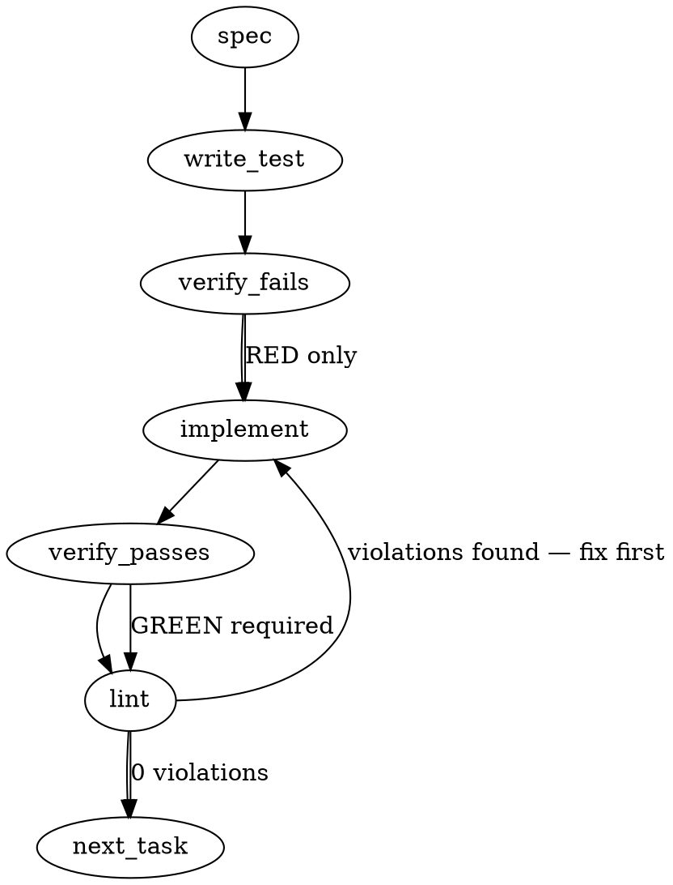

> **Superseded above the line.** Everything from here to `## Implementation Design` is the generated pre-design spec (`totem spec`, gemini-3.5-flash, 2026-09-06), kept for the record; where it differs from the design section — the zod payload schema, a `defaultMatcher` registry shape, prepare-time bundling, a doctor `gate-config` task, a `--body` / `-b` read on any program, a `\bsed\s+-i\b` regex predicate; the list is not exhaustive — the design section governs and the code follows the design (falsification fold F12).

### Problem Statement

Introduce a `transport-shield` gate in the gate engine as a `PreToolUse` hook on `Bash` and `PowerShell` tools. This gate will refuse known shell payload-mangling patterns (e.g., backslashes inside heredocs, MSYS leading-slash `--body` arguments on win32, multi-line/backslash `sed -i`, inline node/python bodies) and provide clear safe-alternative guidance, while integrating seamlessly with the CLI installer, doctor config sweeps, and repo-wide health checks.

### Architectural Context

- **Lesson — Gemini CLI hook registration semantics (leg-verified):**
  - Command-hook exit contracts must exit $\ge 2$ or stdout JSON `{"decision":"deny","reason":...}` to block. For Claude Code's `PreToolUse`, exit code `2` blocks the action. Uncaught Node exceptions must not fail-open; we must run synchronously and exit with status codes $\ge 2$ explicitly.
- **Lesson — Hooks designed to block agent actions, such as shield gates:**
  - Synchronous execution is mandatory (e.g., `execSync` / `safeExec`). No unresolved async promises inside the hook evaluation flow to ensure the agent cannot bypass the block.
- **Lesson — Avoid complex inline shell pipelines in settings JSON:**
  - The installer hook entry should invoke a clean, dedicated gate execution command (`totem gate check <gate-name>`) rather than building inline pipe chains.
- **Lesson — Untrusted host env vars ($TOOL_INPUT):**
  - Treat raw command inputs as untrusted inputs. Ensure validation logic is resilient to shell injection and handles quotes, backticks, and metacharacters safely.

### Files to Examine

1. `packages/core/src/gate-engine.ts` — Define the core `REGISTRY`, `transportShieldEvaluator`, and payload schemas.
2. `packages/cli/src/commands/gate-install.ts` — Refactor the gate installation routine to support per-gate matchers (e.g., `Bash|PowerShell` vs `Write|Edit`) instead of a single hardcoded matcher.
3. `packages/cli/src/commands/init.ts` — Inspect `installClaudeHooks` to verify `transport-shield` is bundled during `totem init` and `pnpm install` prepare sweeps.
4. `packages/cli/tests/gate-install.test.ts` — Examine how CLI installer flows are validated.

### Technical Approach & Contracts

We will register `transport-shield` in the core gate registry with an evaluator that validates shell payloads based on shell, tool, and platform.

#### Data Contracts

1. **Payload Schema:**

```typescript
import { z } from 'zod';

export const TransportShieldPayloadSchema = z.object({
  tool: z.enum(['Bash', 'PowerShell']),
  command: z.string(),
  platform: z.string(), // fallback process.platform
});

export type TransportShieldPayload = z.infer<typeof TransportShieldPayloadSchema>;
```

2. **Per-Gate Matcher Registration Contract:**
   Update the registry definition structure to expose an explicit matcher:

```typescript
interface GateDefinition {
  name: string;
  defaultMatcher: string; // e.g. "Write|Edit" or "Bash|PowerShell"
  evaluator: (payload: any) => GateEvaluationResult;
}
```

#### Predicates Implementation Logic

Inside `transportShieldEvaluator(payload)`:

1. **Heredoc Mangling Check:**
   - Detect heredoc syntax: `<<[-]?\s*['"]?([a-zA-Z0-9_]+)['"]?`.
   - If present, extract the body/command after the delimiter.
   - If the body contains a backslash `\`, backtick `` ` ``, or standard regex tokens (e.g., `\d`, `\s`, `\w`), deny.
   - **Denial message:** `"author the file with the Write tool and reference it"`

2. **MSYS Path Munging Check (`--body`):**
   - If `platform === 'win32'` and `tool === 'Bash'`:
   - Match arguments starting with `--body` or `-b` using a shell-aware tokenizer (or clean regex capturing quoted/unquoted strings directly after the option flag).
   - If the captured body argument starts with `/` (e.g., `--body "/gemini review"`), deny.
   - **Denial message:** `"use --body-file, or the PowerShell tool, or MSYS_NO_PATHCONV=1"`

3. **`sed -i` Mangling Check:**
   - If `command` contains `sed -i` (or `sed\s+-i`):
   - Check if the expression string contains a backslash `\`, more than one `-e` flag, or a literal newline character `\n`.
   - If so, deny.
   - **Denial message:** `"use the Edit tool"`

4. **Inline node/python scripts inside Bash:**
   - If `tool === 'Bash'` and `command` contains `node -e`, `python -c`, or `python3 -c`:
   - If the inline string payload contains a backtick `` ` `` or a backslash `\`, deny.
   - **Denial message:** `"author the file with the Write tool and reference it"`

5. **WARN Check (win32 `<rev>:<path>` subshells):**
   - If `platform === 'win32'` and `command` contains a subshell invocation `$(...)` or backticks `` `...` ``:
   - Match internal arguments of the format `[a-zA-Z0-9_\-\./]+:[a-zA-Z0-9_\-\./]+` (e.g., `origin/main:.totem/x.md`).
   - If matched, and `MSYS_NO_PATHCONV=1` is NOT present anywhere in the parent command, trigger a WARN (allow, but print warning to stderr).

#### Installer Seam Modifications

Refactor `packages/cli/src/commands/gate-install.ts`:

- Iterate over each registered gate to install.
- Instead of generating a single hook object using `CLAUDE_GATE_WRAPPER_ENTRY.matcher`, dynamically write separate Claude `PreToolUse` hook configurations in `.claude/settings.json` matching the `defaultMatcher` of each registered/active gate.

---

### Edge Cases & Traps

- **Whitespace / Argument Boundaries:** Blind regex matchers on `sed -i` could catch comments or benign text. Ensure matching requires command boundaries (e.g., `\bsed\s+-i\b`).
- **MSYS_NO_PATHCONV Scoping:** A user might define `MSYS_NO_PATHCONV=1` inline at the very beginning of the CLI chain (e.g., `MSYS_NO_PATHCONV=1 gh pr comment ...`). The check for `MSYS_NO_PATHCONV=1` must be case-sensitive and match the entire command string.
- **Platform Detection Overrides:** Test code should be able to mock the `platform` parameter to simulate win32 environments on non-Windows test runners.

---

### Implementation Tasks

- [ ] **Task 1: Core Registry & Gate Evaluation Logic**
      Define `TransportShieldPayloadSchema` and implement the `transportShieldEvaluator` in `packages/core/src/gate-engine.ts`.

  > TEST DIRECTIVE: Before implementing, write a failing test named `rejects_mangled_heredocs_and_inline_scripts` that asserts the positive/negative corpus constraints.
  - Implement positive corpus denials (e.g., heredoc with `\d`, leading slash `--body` on win32, backslash in `sed -i`).
  - Implement negative corpus allowances (e.g., safe heredoc with no escapes, `@` prefixed `--body`).
  - write test → verify fails → implement → verify passes → lint

- [ ] **Task 2: Refactor Gate Installer Seam to Support Per-Gate Matchers**
      Modify `packages/cli/src/commands/gate-install.ts` to fetch and use the individual gate's `defaultMatcher`.

  > TOTEM INVARIANT (Gemini/Claude hook registration semantics): Claude hook entries in `.claude/settings.json` must be structured JSON configurations. Never rely on throwing to block; output the correct decision format or exit 2 for denies.
  - Update `.claude/settings.json` generation to render discrete `PreToolUse` hooks mapped to `Bash|PowerShell` and `Write|Edit` matchers.
  - write test → verify fails → implement → verify passes → lint

- [ ] **Task 3: MSYS Win32 Warning Subshell Logic**
      Implement the warning condition for `<rev>:<path>` inside `$(...)` subshells.

  > TEST DIRECTIVE: Before implementing, write a failing test named `warns_on_windows_path_munging_in_subshell` simulating a win32 platform execution of `$(git show origin/main:.totem/x.md)`.
  - Ensure the evaluation returns a non-fatal warning payload when triggered.
  - write test → verify fails → implement → verify passes → lint

- [ ] **Task 4: Integrate Doctor Gate Configuration Sensing**
      Ensure the `gate-config` check correctly senses the existence of both `freeze-check` and `transport-shield` gates.
  - Update relevant validation logic to confirm the newly configured gate hooks exist across targets.
  - write test → verify fails → implement → verify passes → lint

---

### Execution Flow



---

### Verification

1. Run `totem lint` to verify absolute formatting compliance with zero lint issues.
2. Run `totem review` to execute the auxiliary AI code-level sanity check over the branch diff.

---

### Test Plan

#### 1. Unit Tests (Registry & Evaluator Corpus)

- Create `packages/core/tests/transport-shield.test.ts`.
- **Positive Corpus (Deny):**
  - `Bash` | Win32 | `cat > f <<'EOF'\nhello\n\d\nEOF` -> DENY
  - `Bash` | Win32 | `gh pr comment N --body "/gemini review"` -> DENY
  - `Bash` | any | `sed -i -e "s/a/b/g" -e "s/c/d/g" file` -> DENY
  - `Bash` | any | `node -e "console.log('foo' + \`bar\`)"` -> DENY
- **Negative Corpus (Allow):**
  - `PowerShell` | Win32 | `gh pr comment N --body "/gemini review"` -> ALLOW
  - `Bash` | any | `gh pr comment N --body "@gemini review"` -> ALLOW
  - `Bash` | any | `cat > f <<'EOF'\nhello world\nEOF` -> ALLOW

#### 2. Integration Tests (Installer Matchers)

- Verify that calling `totem gate install transport-shield` populates `.claude/settings.json` with:

  ```json
  {
    "type": "PreToolUse",
    "matcher": "Bash|PowerShell",
    "command": "node .claude/hooks/gate-check.js --gate transport-shield"
  }
  ```

  (The generated example above is wrong on two counts and is corrected by the design below: the installed command is `node .claude/hooks/gate-wrapper.cjs --event transport-shield --strict`, the same wrapper and `--event` shape freeze-check uses, and a settings entry carries `matcher` + `hooks[]`, never a `type: PreToolUse` field.)

## Implementation Design

Source-grounded on `cdfd4fde` (2026-09-06): `packages/core/src/gate-engine.ts` (REGISTRY = `Map<string, GateEvaluator>`, one entry), `gate-types.ts` (`GateEvaluator = (payload, totemDir) => GateVerdict`; `warn` is a contract member no gate emits yet), `packages/cli/src/commands/gate-install.ts` (`GATE_MATCHER = 'Write|Edit'` at :32; `gateEntry()` reads `CLAUDE_GATE_WRAPPER_ENTRY.matcher`), `host-hooks.ts` (`PreToolUseMatcher = 'Bash' | 'Write|Edit'` at :60, the type the upsert and `preToolUseHasMatcher` key on), `init-templates.ts` (`CLAUDE_GATE_WRAPPER` — the projection is freeze-check-shaped: no declared `subsystem` → exit 0 before any spawn), `eject.ts:515` (scrubs gate-wrapper entries only under `matcher === 'Write|Edit'`), the charter mmnto-ai/totem#2799 and its errata comment (three seams; `gate-config` has no detector; prepare never installs gates).

### Scope

Adds the `transport-shield` gate: the evaluator and its pattern table in core, the per-gate matcher carried by the core registry and read by the installer (`Bash|PowerShell` for this gate, `Write|Edit` for freeze-check), the wrapper's per-event payload projection (`tool_name` + `tool_input.command` + `process.platform` for this gate; the subsystem guardrail unchanged for freeze-check), the eject scrub keyed on the wrapper command needle regardless of matcher, and the positive/negative corpus as tests. It will NOT add a `gate-config` doctor detector (presence stays attested per the errata; a separate doctor-parity slice), will NOT wire gate installation into the prepare wrapper (gates stay opt-in repo policy through `totem gate install` / `totem init --gates=`, Tenet 12; the committed `.claude/settings.json` carries the entry thereafter), will NOT touch the Gemini BeforeTool template, will NOT change the `allow | warn | deny` contract, and installs the gate on no repo (distribution rides the next `@mmnto/cli` cut and each seat's `totem gate install transport-shield` on its own repo, after the legitimacy record on the issue).

### Data model deltas

- **core `gate-types.ts`:** `export type GateMatcher = 'Write|Edit' | 'Bash|PowerShell'` — the PreToolUse tool matcher a gate installs under; written by the registry, read by the installer. `export interface GateDefinition { evaluator: GateEvaluator; matcher: GateMatcher }`. The `warn` comment updated: transport-shield is its first emitter.
- **core `gate-engine.ts`:** `TRANSPORT_SHIELD_EVENT = 'transport-shield'`; `REGISTRY: ReadonlyMap<string, GateDefinition>` (freeze-check gains `matcher: 'Write|Edit'`; no behavioural change); new `gateMatcher(event): GateMatcher` (throws `GATE_INVALID` on an unknown event, never a default) and `knownGates(): ReadonlyArray<{ event: string; matcher: GateMatcher }>`; `knownGateEvents()` and `evaluateGate()` unchanged in signature.
- **core `transport-shield.ts` (new):** `TransportShieldPayload = { tool: 'Bash' | 'PowerShell'; command: string; platform: string }` — parsed by hand from `unknown` (a missing or non-string `command`, or a `tool` outside the pair, throws `GATE_INVALID`; `platform` defaults to nothing — it is REQUIRED so the verdict never reads `process.platform` in core and tests can pin win32 on any runner). `TRANSPORT_PATTERNS: ReadonlyArray<TransportPattern>` with `{ id; disposition: 'deny' | 'warn'; cure: string; find(payload): { fragment: string } | null }`; ids: `heredoc-escape` (a `<<` / `<<-` heredoc, quoted or bare delimiter, whose body up to the terminator line — or to the end of the command when unterminated — carries a backslash or a backtick), `msys-body-slash` (win32 + Bash only: the value after `--body` / `--body=` / `-b`, shell-tokenized over single and double quotes, begins with `/`; `--body-file` is a different flag and never matches), `sed-i-escape` (a segment whose PROGRAM position is `sed` with `-i` / `-i<suffix>` / `--in-place`, whose expression operand carries a backslash or a newline inside quotes or a `$( … )`, or more than one `-e` — never a bare newline, which ends the segment, never a backslash-newline continuation, never a file operand, and never a `-f` / `-fFILE` / `--file` / `--file=` script path; with a script file no positional operand is an expression), `inline-body-escape` (Bash only: `node -e`, `python -c`, `python3 -c` whose quoted body carries a backtick or a backslash), `heredoc-oversize` (WARN; both tools: a heredoc body of `HEREDOC_OVERSIZE_BYTES` = 4,096 bytes or more, the newline included — a disclosed heuristic threshold for the harness's dropped-body class), `msys-rev-path-subshell` (WARN; win32 + Bash only: an `<rev>:<path>` token inside `$(...)` in a segment the `MSYS_NO_PATHCONV` assignment does not reach). Both MSYS rows honour the opt-out per segment, through the shell forms that export it to the judged program (MSYS reads the variable's presence, any value) — the segment's own `VAR=… prog` prefix, an earlier `export` / `declare -x` / `typeset -x`, a bare assignment under `set -a` or followed by `export NAME`, until an `unset` — never as a substring; an export inside a subshell or a pipeline element is taken as reaching later segments though the shell would not apply it (a disclosed over-allow). For the PowerShell tool the scanners read PowerShell's grammar where it differs from bash's in the same walk that tracks quotes and comments (`ScanOptions.powershell`, set from `payload.tool`): a `<# … #>` block comment outside quotes is skipped whole, the backtick is the escape inside a double-quoted string, and a `#` is read by the same word-boundary rule as bash's; the block-comment skip and the backtick escape apply inside a `$( … )` too — one model of which text is code, no pre-pass. Disclosed, not modelled: PowerShell also begins a comment after a token-ending string, an assignment operator or a `)`, which the scanners read as word text (the over-scan direction, except when such a comment carries text the scanners read as shell syntax — an odd `'` or `"`, a `<#`, a trailing backslash, an unterminated `$(` — on the line before a later positive, the miss direction); its token boundaries are not derivable from a character walk (`$x=#c` is an assignment and a comment at statement position but one argument after a command), and five successive folds of the PowerShell reading each opened a sibling shape. Here-strings are not parsed (disclosed). The first matching deny wins; a warn is emitted only when no deny fired. Evaluation order is the table order — a frozen module constant, no state. Provenance: `source: 'transport-shield pattern table'` (a module label, never a path), `ref: <pattern id>`, `matched: <fragment, control characters stripped, at most 80 chars>` or `null`, `checkedAt`. Reason text = `<what matched> — <cure>`.
- **cli `host-hooks.ts`:** `PreToolUseMatcher` gains `'Bash|PowerShell'` (three members). No schema change: `PreToolUseEntrySchema` already accepts any string matcher.
- **cli `gate-install.ts`:** `GATE_MATCHER` deleted. `installGates(cwd, gates: ReadonlyArray<{ event; matcher }>, tier)` — callers resolve the pairs through `knownGates()` after their lazy `@mmnto/totem` import (`resolveGateEvents` in `gate.ts` becomes `resolveGates`; the `init --gates=` parser likewise), so gate-install keeps its no-core-import shape (ADR-072 §3). `gateEntry()` writes the gate's own matcher; the upsert probe stays `commandInstallsGate` (keyed on `--event`, tier-independent) within the gate's own matcher; an entry a hand edit left under a foreign matcher is left as-is (the upsert's standing contract, `host-hooks.ts`), so "one entry per gate" holds for every file the installer wrote and is not enforced against hand edits (falsification fold F7). `CLAUDE_GATE_WRAPPER_ENTRY` keeps `Write|Edit` as the freeze-check exemplar; its comment names the per-gate matcher as the source of truth.
- **cli `init-templates.ts` (`CLAUDE_GATE_WRAPPER`):** a projection table keyed by `event`: `freeze-check` → the existing subsystem guardrail and `{ subsystem }` payload, behaviourally unchanged (the same exits and messages; the lines move inside the event branch); `transport-shield` → NOT-APPLICABLE exit 0 unless `parsed.tool_name` is `Bash` or `PowerShell` AND `tool_input.command` is a non-empty string, else payload `{ tool: tool_name, command, platform: process.platform }`; any other `--event` → fail closed (exit 2) with a one-line reason, since a baked event the wrapper cannot project is an applicable gate it cannot evaluate. For every event the projected payload rides on the child's STDIN — `gate check --event <e> --payload -`, a new form the verb accepts beside the JSON argument — never argv: win32 caps a command line at 32,767 characters and a Bash command past it failed the spawn with ENAMETOOLONG, landing in the fail-closed arm with nothing broken (pass 3, P3-F6); a wrapper installed before this cut keeps passing JSON on argv and still works; the reverse pairing (a wrapper written by this cut against a repo-local CLI from before it, which only a later `node_modules` downgrade produces) fails closed on every event, freeze-check included — the contract for an applicable gate that cannot be evaluated, disclosed in the changeset. The wrapper template is marker-bounded, so `totem gate install <any>` drift-repairs it in the same run the new entry lands (`scaffoldFile` → `refreshed`) — a consumer never carries the new entry with the old projection.
- **cli `eject.ts`:** the PreToolUse scrub drops every entry whose command includes `gate-wrapper.cjs` whatever its matcher; the PreWriteShield needle stays bound to `Write|Edit`; a user's own `Bash` entry survives.
- No reserved keys, no sentinels; the pattern id is the join key between a verdict and the corpus row.

### State lifecycle

No new persistent or session state. The pattern table and the registry are module-level frozen constants (server-lifetime, immutable after load). The wrapper is per-invocation (read stdin, spawn once, exit). The installed settings entries are persistent repo policy in the committed `.claude/settings.json`, created/updated by `installGates`, removed by `eject`; the wrapper script is owned by `scaffoldFile`'s marker-bounded repair. Nothing crosses a lifecycle boundary.

### Failure modes

| Failure                                                                                                                                       | Category  | Agent-facing surface                                                                                                                                                                                                                       | Recovery                                                                |
| --------------------------------------------------------------------------------------------------------------------------------------------- | --------- | ------------------------------------------------------------------------------------------------------------------------------------------------------------------------------------------------------------------------------------------ | ----------------------------------------------------------------------- |
| Envelope unparseable or not an object                                                                                                         | runtime   | exit 0 + stderr (existing, not applicable)                                                                                                                                                                                                 | none needed                                                             |
| `--event transport-shield` on an envelope with no string `tool_input.command`, or `tool_name` outside Bash/PowerShell (a hand-edited matcher) | runtime   | exit 0, silent — not an applicable gate, mirrors the empty-subsystem guardrail; justified under Tenet 4 because there is no command to judge, and the installed matcher is the CLI's own                                                   | fix the matcher via `gate install`                                      |
| `--event` the wrapper cannot project                                                                                                          | init      | hard: exit 2 + reason                                                                                                                                                                                                                      | reinstall via `gate install` (refreshes the wrapper)                    |
| Local CLI missing                                                                                                                             | init      | hard: exit 2 (existing)                                                                                                                                                                                                                    | reinstall, or `totem eject`                                             |
| `gate check` non-zero / unparseable verdict / unknown disposition                                                                             | runtime   | hard: exit 2 (existing)                                                                                                                                                                                                                    | fix the CLI                                                             |
| Evaluator payload invalid (`command` missing, `tool` outside the pair, `platform` missing)                                                    | runtime   | `GATE_INVALID` thrown → `gate check` non-zero → exit 2; unreachable through the wrapper (it exits 0 first), reachable by a hand-run `gate check`                                                                                           | pass a valid `--payload`                                                |
| A known-shape payload (positive corpus)                                                                                                       | runtime   | `deny`: strict → exit 2 with the cure; `--pilot` → exit 0 + stderr                                                                                                                                                                         | rewrite per the cure (Write tool, `--body-file`, Edit, PowerShell tool) |
| A benign command the table matches (false positive)                                                                                           | runtime   | `deny` with the cure — bounded by the negative corpus; a new one is a corpus row, never a hand-carved exemption                                                                                                                            | rewrite, or `--pilot` for a measurement week; file the row              |
| A mangling shape the table lacks                                                                                                              | permanent | silent allow — disclosed: the gate enumerates known shapes (the charter's positive corpus) and a miss is a corpus gap, counted by the charter's metric (incidents per week from the lessons stream), not a fail-open of an applicable gate | add the row with its receipt                                            |
| `<rev>:<path>` in a subshell on win32, in a segment the `MSYS_NO_PATHCONV` assignment does not reach                                          | runtime   | `warn`: exit 0 + stderr (first emitter of the contract's `warn`)                                                                                                                                                                           | prefix the env var                                                      |
| A heredoc body of 4,096 bytes or more (`heredoc-oversize`)                                                                                    | runtime   | `warn`: exit 0 + stderr, the threshold named as a heuristic (the second `warn` emitter)                                                                                                                                                    | author the file with the Write tool and reference it by path            |
| Unterminated heredoc                                                                                                                          | runtime   | body = the rest of the command; deny only if it carries an escape                                                                                                                                                                          | as above                                                                |
| Stale wrapper with the new entry                                                                                                              | init      | cannot occur by construction: the install that writes the entry refreshes the wrapper                                                                                                                                                      | —                                                                       |

### Invariants to lock in via tests

- Every charter positive-corpus payload is denied with its cure in `reason`, and every negative-corpus payload is allowed, one assertion per row (the mmnto-ai/totem-strategy#1247 heredoc carrying `\d`; `gh pr comment N --body "/gemini review"` on win32+Bash; the same under PowerShell allowed; `--body "@coderabbitai review"` allowed; `--body-file <path>` allowed; a heredoc with no backslash or backtick allowed; `sed -n '1,5p' file` allowed; `printf '%s\n' ... >> file` allowed; an inline `node -e` body with a backtick denied; `sed -i` with a backslash, or two `-e`, denied; `$(git show origin/main:.totem/x.md)` on win32 warns and with `MSYS_NO_PATHCONV=1` allows).
- The evaluator is pure: verdicts depend only on the payload; the same command yields different verdicts only through the payload's `platform` and `tool` fields, never through `process.platform`; the side-effect-free fixture (file bytes + directory entries unchanged) holds.
- `provenance.matched` is bounded (≤ 80 chars) and free of control characters; `ref` is a pattern id present in the table; `checkedAt` is ISO-8601.
- `gate install transport-shield` writes exactly one entry under `Bash|PowerShell`; `gate install freeze-check` writes the same `Write|Edit` entry it writes today, byte for byte; `--all` writes both; re-running is a no-op; a tier switch updates the one entry in place; after any sequence of installer writes a gate exists under one matcher (a hand-edited foreign-matcher entry is left as-is — not enforced, per the upsert's contract).
- The wrapper: `--event transport-shield` exits 0 on a Write envelope and on a Bash envelope with no command; spawns `gate check --payload -` with `{tool, command, platform}` on the child's stdin on a Bash or PowerShell envelope, and a 40,000-character command (past the win32 argv cap) comes back as a verdict, never a fail-closed exit; `--event freeze-check` behaves exactly as before (the same exits and messages; its payload now rides on stdin too); an unknown `--event` exits 2. The wrapper is refreshed by the same install that adds the entry.
- The scanners follow bash where a mis-read would desynchronize them: a `#` that begins a word — after an unquoted blank, newline, `;`, `|`, `&`, an opening `(` or an operator `)` (a subshell's, a case pattern's) — is a comment to the end of the line (an apostrophe inside it hides no later heredoc; comment text is never an argument), and a `#` that continues a word is not one (`a#b`; `$(x)#a` and `<(x)#a`, where the `)` closes a substitution — the scanners track which `(` each `)` closes); a delimiter word is read whole as bash delimits it (`EOF.TXT`, `1EOF`; `$X` literally, as bash reads it — a delimiter word is never expanded); an unquoted `\'` opens no single-quoted region; `$(( … ))` and `(( … ))` are skipped (a `<<` shift is not a heredoc); `<<\EOF` is a quoted heredoc; a backslash-newline continuation is not the newline `sed-i-escape` refuses; a background `&` ends a segment; `env VAR=x prog` reaches the program; every `--body` / `-b` occurrence is read; a `$(` inside single quotes is literal to the warn row. Each shape is a corpus row in `transport-shield.fold.test.ts` and the benign fixture measures the budget over it.
- `eject` removes a `Bash|PowerShell` gate-wrapper entry and leaves a user-authored `Bash` entry and any `Write|Edit` non-Totem entry untouched.
- `knownGates()` lists both gates with their matchers; `gateMatcher('nope')` throws; the doc example in `cli-reference.md` names the new gate.

### Open questions

- **Question:** Does the `gate-config` doctor detector ride this PR? **Options:** (a) split — presence attested per the errata, detector as its own doctor-parity slice with its own falsification; (b) include a minimal reader of `.claude/settings.json` gate entries against `knownGates()`. **Recommendation:** (a); the charter's "the four active repos read it present" done-when is met by the detector slice, recorded on the issue as the errata already says.
- **Question:** Prepare-time gate re-install (errata 1)? **Options:** (a) rule out here — gates are opt-in repo policy, the committed settings carry the entry, `gate install` refreshes the wrapper; (b) have the prepare wrapper run `gate install --all` when a gate entry already exists. **Recommendation:** (a), recorded on the issue; (b) is a separate item if the cohort wants wrapper self-repair on install.
- **Question:** Keep the `sed -i` predicate with no recorded firing (errata 4)? **Recommendation:** keep — the same backslash class, low false-positive risk behind `\bsed\s+-i\b` plus the multi-`-e`/newline condition, and the Insights report names it.
- **Question:** Add a heredoc-body-size WARN (the banked trap: bodies over roughly 4 KB die in this harness; ENAMETOOLONG at 30–60 KB per lesson-f2356012) as a totem-lane addition to the charter's table? **Options:** (a) add `heredoc-oversize` as WARN at 4,096 bytes of body, disclosed as a heuristic threshold; (b) leave it out, the trigger being unidentified. **Recommendation:** (a) — the cure is the same sentence and a warn costs nothing. **Decided 2026-09-06 (the operator's greenlight on the design): (a), implemented as the `heredoc-oversize` row above — the sixth row of the shipped table.**
- **Question:** Who builds? **Recommendation:** core evaluator + pattern table + corpus tests inline (judgment-dense); the installer/wrapper/eject seam by one Opus build leg against this design; one falsification leg before presenting, re-armed on any fold that rewires semantics.
