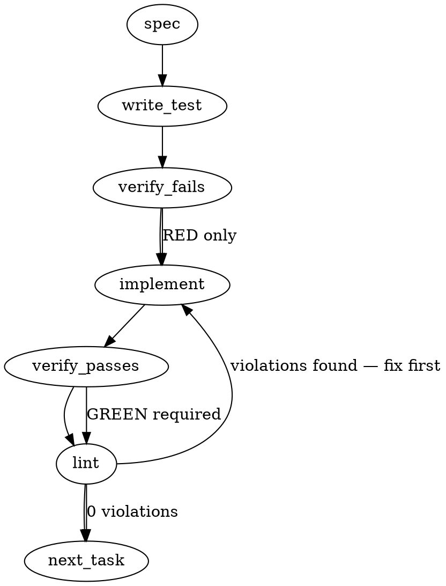

### Problem Statement

Integrate the user-level prototype `merge-gate.cjs` into the core product as a first-class `merge-ready` deterministic gate. This requires building a `PreToolUse` hook on `gh pr merge` alongside a CLI command `totem gate check --event merge-ready --payload <JSON>` that evaluates a 5-point deterministic pre-merge floor without LLMs.

### Architectural Context

This feature promotion draws heavily on the following Totem architectural patterns:

- **Lesson — Tiered enforcement for strict gates**: This spec implements strict diagnostic gates with a `--pilot` (fail-open) and `--tier strict` (fail-closed) split to optimize developer experience while guaranteeing CI safety.
- **Lesson — Gemini CLI hook registration semantics (leg-verified)**: Hook exit contracts must exit with status `0` for allow, `1` for allow-with-warning, and `>= 2` for deny (or emit structured JSON `{"decision":"deny"}`). The CLI hook wrapper must not rely on uncaught node exceptions (which exit `1` and fail open on Gemini), but explicitly catch and emit `exit 2` or a structured deny JSON.
- **Lesson — Automated gates like pre-commit or pre-push hooks**: The `merge-ready` check must be strictly deterministic (zero LLM calls) to maintain sub-second performance.

### Files to Examine

- `packages/cli/src/commands/gate-install.ts` — Implements hook installation, configuration of `.claude/settings.json`, and registration parameters.
- `packages/cli/src/commands/init.ts` — Orchestrates hook setup during project initialization.
- `packages/cli/src/commands/spine-corpus-disposition-source.ts` — Contains real-world usages of GH CLI API patterns (`GhExec`, `safeExec`).
- `packages/core/src/types/gate.ts` (or similar schema file) — Location to register the unified `GateVerdict` data schema and events.

### Technical Approach & Contracts

The implementation will introduce a deterministic evaluator engine that uses `gh api graphql` and standard `gh pr view` calls to retrieve merge metadata.

#### 1. Data Contracts (Zod Schemas)

```typescript
import { z } from 'zod';

export const GateVerdictSchema = z.object({
  event: z.literal('merge-ready'),
  decision: z.enum(['allow', 'deny']),
  reason: z.string().optional(),
  sha: z.string(),
  metadata: z.object({
    repo: z.string(),
    pr: z.number(),
    ciStatus: z.enum(['SUCCESS', 'PENDING', 'FAILURE', 'UNKNOWN']),
    hasUnresolvedBotThreads: z.boolean(),
    hasChangesRequested: z.boolean(),
    hasHighSeverityBotInline: z.boolean(),
    mergeStateStatus: z.string(),
  }),
});

export type GateVerdict = z.infer<typeof GateVerdictSchema>;
```

#### 2. GraphQL Fetch Contract

To evaluate all predicates efficiently, execute a single GraphQL query targeting the Pull Request details:

```graphql
query EvaluateMergeReady($owner: String!, $repo: String!, $pr: Int!) {
  repository(owner: $owner, name: $repo) {
    pullRequest(number: $pr) {
      headRefOid
      mergeStateStatus
      statusCheckRollup {
        state
      }
      reviews(last: 100) {
        nodes {
          author {
            login
          }
          state
        }
      }
      reviewThreads(last: 100) {
        nodes {
          isResolved
          isOutdated
          comments(last: 100) {
            nodes {
              author {
                login
              }
              body
            }
          }
        }
      }
    }
  }
}
```

#### 3. Command Position Matcher

Hook matching on `Bash` and `PowerShell` must trigger ONLY when `gh pr merge` is matched at start or after shell delimiters.

- **Regex Pattern**: `/^(?:.*[;&|]|\s*(?:do|then)\s+|\{\s*)\s*gh\s+pr\s+merge\b/`

### Edge Cases & Traps

1. **Uncaught Node Exceptions failing open**: If `gh` is missing, rate-limited, or unauthorized, a naked JS exception exits `1`, which Gemini interprets as an ALLOW. Ensure all execution blocks are wrapped in `try/catch` and explicitly emit a structured deny or exit `2` in strict mode.
2. **Subshell bypass tricks**: Developers executing compound chains like `gh pr merge; echo "done"` must trigger the hook correctly. The command-position regex matches command transitions (`&&`, `;`, `||`, `|`, and block scopes).
3. **Stale HEAD SHA**: The CI status might pass on a stale execution. The evaluator must extract `headRefOid` from the API payload and report it in the `GateVerdict` metadata so the verifying client can assert its fresh state.
4. **Detached HEAD & Divergent local branches**: Ensure the branch state is validated with the `mergeStateStatus` property returned by GitHub.

### Implementation Tasks

- [ ] **Task 1: Define Schemas & GateVerdict Types**
      Define and export the `GateVerdict` and payload Zod schemas inside the type layer.
      _Files to modify:_ `packages/core/src/types/gate.ts`
      _Test files to create:_ `packages/core/src/types/gate.test.ts`

  > TEST DIRECTIVE: Before implementing, write a failing test named `rejectsMalformattedGateVerdict` that ensures strict Zod parsing of invalid metadata.

- [ ] **Task 2: Build Deterministic Predicate Evaluator Engine**
      Implement the GraphQL query executor using `safeExec` to invoke `gh api graphql`. Group the logic into 5 distinct functions matching the predicates in the issue.
      _Files to modify:_ `packages/cli/src/commands/gate-check-evaluator.ts` (New file)
      _Test files to create:_ `packages/cli/src/commands/gate-check-evaluator.test.ts`

  > TOTEM INVARIANT (Automated gates like pre-commit or pre-push hooks): Never make external LLM calls. Fall back to deterministic REST/GraphQL APIs exclusively.
  > TEST DIRECTIVE: Before implementing, write a failing test named `failsClosedOnRateLimitOrAuthFailure` simulating raw CLI execution failures during API extraction.

- [ ] **Task 3: Integrate `--pilot` and `--tier` Flags in Gate CLI Verb**
      Update the CLI options for the gate check verb. Under `--pilot`, allow the check to fail open with a stderr warning if API limits or failures occur. Under `--tier strict`, fail closed.
      _Files to modify:_ `packages/cli/src/commands/gate-check.ts`
      _Test files to update:_ `packages/cli/src/commands/gate-check.test.ts`

  > TOTEM INVARIANT (Tiered enforcement for strict gates): Strict diagnostic gates block executions with an exit code >= 2, whereas pilot configurations degrade gracefully.

- [ ] **Task 4: Write Matcher & Hook Registrar**
      Add the `merge-ready` PreToolUse hook configuration and matcher script to `gate-install.ts` and ensure it registers the command-position regex correctly on installation.
      _Files to modify:_ `packages/cli/src/commands/gate-install.ts`, `packages/cli/src/commands/init.ts`
      _Test files to update:_ `packages/cli/src/commands/gate-install.test.ts`

  > TOTEM INVARIANT (Gemini CLI hook registration semantics): Hook exit codes must explicitly return `>= 2` to deny. Do not throw standard node errors that bubble up to exit `1`.

- [ ] **Task 5: Implement Override Hook Support**
      Add execution checks for `process.env.TOTEM_MERGE_GATE_OVERRIDE === '1'`. If matched, emit an audit trace to `stderr` and exit with `0`.
      _Files to modify:_ `packages/cli/src/commands/gate-check.ts`
      _Test files to update:_ `packages/cli/src/commands/gate-check.test.ts`
  > TEST DIRECTIVE: Before implementing, write a failing test named `respectsOverrideEnvironmentVariable` that checks for the stderr audit line and returns exit code 0 when override is active.

### Execution Flow



### Verification

Every implementation MUST end with these steps:

1. `totem lint` — deterministic rule check (zero LLM, ~2s). Fixes any violations.
2. `totem review` — supplementary AI lanes over the diff (~18s, advisory). Address critical findings; your team's review discipline decides the review of record.

### Test Plan

#### Positive Control Scenarios

1. **Fully Clean PR**: A mock API payload returns `statusCheckRollup: SUCCESS`, no review threads, `mergeStateStatus: CLEAN`, and `CHANGES_REQUESTED` is not present. Assertion: `GateVerdict.decision` is `allow`.
2. **Only Outdated Bot Thread**: A mock API payload contains unresolved threads, but they are flagged as `isOutdated: true`. Assertion: `GateVerdict.decision` is `allow`.
3. **Override Active**: Environment contains `TOTEM_MERGE_GATE_OVERRIDE=1`. Mock API yields failure. Assertion: Stderr matches audit format, exit status is `0` (`allow`).

#### Negative Control Scenarios

1. **CI Failure**: A payload contains a failed check in `statusCheckRollup`. Assertion: `GateVerdict.decision` is `deny` with reason identifying stale/failed check.
2. **Unresolved Bot Comment**: A payload contains `reviewThreads` where `isResolved: false`, `isOutdated: false`, and author is `coderabbitai`. Assertion: `GateVerdict.decision` is `deny`.
3. **Branch Behind Base**: A payload returns `mergeStateStatus: BEHIND`. Assertion: `GateVerdict.decision` is `deny`.
4. **Major Inline Severity**: A thread contains an active review comment with `"Major"` severity by `coderabbitai`. Assertion: `GateVerdict.decision` is `deny`.

## Implementation Design

<!-- totem-context: drafted by totem-claude 2026-09-07 at the preflight's Phase 3, on the charter (mmnto-ai/totem#2800) and its errata comment, the ruling comment of the same day, ADR-109, ADR-072 § 2, the per-gate matcher seam (mmnto-ai/totem#2804) and the PATH-resolution arm (mmnto-ai/totem#2822). Where the generated spec above disagrees with a shipped contract, this section wins and says so. -->

### Scope (2 sentences)

Adds a `merge-ready` gate to the core registry (`packages/core/src/gate-engine.ts`, matcher `Bash|PowerShell`) whose evaluator derives the five charter predicates from GitHub through `gh` with paginated reads, honours the ruled tier split and the override, single-sources the bot-reviewer identity list into core, and teaches the wrapper's payload projection to recognise `gh pr merge` at command position; `totem gate install merge-ready` installs it through the existing seam. It does NOT replace the operator's per-PR word, invoke a bot, add the strategy manifest row, or retire the user-level prototype (the operator's hand, on the day the gate reads present on totem-strategy); and it does NOT introduce the generated spec's `GateVerdict.decision` field — the shipped ADR-109 verdict (`disposition: allow | warn | deny`, `reason`, `provenance`) is the contract.

### Data model deltas

- `MERGE_READY_EVENT = 'merge-ready'` and a registry entry `{ evaluator: mergeReadyEvaluator, matcher: 'Bash|PowerShell' }` beside `freeze-check` and `transport-shield`.
- Payload (Zod at the boundary): `{ repo: 'owner/name', pr: number | null, branch?: string, headSha?: string }`. Written by the wrapper's projection (from the `gh pr merge` argv: a number, a URL, a branch, `-R/--repo`; none → `pr: null` + the current branch) or by a caller of the verb; read only by the evaluator. Invariant: `repo` non-empty; `pr` or `branch` present; anything else is `GATE_INVALID` (the engine's existing no-default-allow path).
- Verdict `provenance` (emitted, never stored): `{ headSha, checks: { total, success, pending, failing }, threads: { unresolvedBot, pagesRead, complete }, changesRequestedBy: string[], highInline: number, mergeStateStatus, evaluatedAt, evaluatedBy: 'gh <version>' }`.
- `BOT_REVIEWER_IDENTITIES` in core (`packages/core/src/bot-identity.ts`): one array of `{ tool, loginPattern }` for coderabbitai, gemini-code-assist, greptile; `packages/cli/src/parsers/bot-review-parser.ts` (`isBotComment`, `detectBot`, `GREPTILE_BOT_LOGIN`) and `packages/core/src/capability/review-catch.ts` import it and their local copies go. The greptile login is fixed by observation on a real totem PR (`gh api` at build time), not by either stale copy (errata item 1).
- A `GhRunner` seam: `(args: string[]) => { stdout, exitCode }`, injected into the evaluator; production supplies the core exec helper, tests supply fixtures. No module-level state; `TOTEM_MERGE_GATE_OVERRIDE` is read per evaluation.

### State lifecycle

Everything is per-invocation. The evaluator is a function of (payload, `gh` responses, env, tier); it writes nothing (ADR-109 falsifier (b): a verdict that mutates on-disk state falsifies the ADR). No cache of API responses across calls; the head sha is read once and every later read is checked against it (a moved head is "head moved during evaluation" → unevaluable).

### Failure modes

| Failure                                                                | Category  | Agent-facing surface                                                                                                                                        | Recovery                  |
| ---------------------------------------------------------------------- | --------- | ----------------------------------------------------------------------------------------------------------------------------------------------------------- | ------------------------- |
| `gh` absent or unauthenticated                                         | init      | strict: `deny` "could not derive: gh unavailable" → exit 2; pilot: `warn` + loud line → exit 0                                                              | install / `gh auth login` |
| API error, rate limit, timeout                                         | transient | strict `deny` / pilot `warn`, reason names the read that failed and the head sha                                                                            | retry                     |
| review-thread or review page has `hasNextPage` and the next page fails | transient | unevaluable (as above); `provenance.threads.complete=false`                                                                                                 | retry                     |
| `statusCheckRollup` has zero checks                                    | runtime   | passes predicate 1 as a FACT (`checks.total=0` in provenance) plus one stderr line; branch protection, not this gate, decides whether zero checks may merge | none                      |
| no bot review present at all                                           | runtime   | passes predicates 2–4 as a fact ("no bot review present" in the reason), never a failure (charter)                                                          | none                      |
| `mergeStateStatus` = `UNKNOWN` (GitHub still computing)                | transient | strict `deny` "mergeability not computed — retry"; pilot `warn`                                                                                             | retry                     |
| head sha moved between reads                                           | transient | unevaluable, named                                                                                                                                          | retry                     |
| payload malformed (no repo, neither pr nor branch)                     | runtime   | `GATE_INVALID` → the wrapper's existing fail-closed arm, exit 2                                                                                             | fix the command / payload |
| override env set                                                       | runtime   | `allow` + stderr audit line naming repo, pr, head sha and the predicates that would have denied                                                             | none (audited)            |
| a predicate fails                                                      | runtime   | `deny` naming the FIRST failing predicate and its evidence; strict exit 2, pilot exit 0 (the wrapper's existing tier map)                                   | fix the PR                |

No row is silent degradation: every unevaluable path is named on stderr under both tiers; only the exit code differs.

### Invariants to lock in via tests

- Under strict, no `allow` is ever emitted while any predicate's input failed to derive; under pilot the same case is `warn`, never `allow`.
- A thread list whose first page is clean and whose second page carries an unresolved, non-outdated bot thread denies (the capped-read bar from errata item 5); a pagination failure is unevaluable, not clean.
- A resolved or outdated bot thread never denies; an unresolved HUMAN thread never denies (bot filter is the identity list, not a substring).
- `CHANGES_REQUESTED` superseded by a later review from the same reviewer does not deny (latest-review semantics); an un-superseded one does.
- A HIGH/Major inline on an older commit does not deny; on the head commit it does.
- `BEHIND`, `DIRTY`, `BLOCKED` deny; `CLEAN` and `HAS_HOOKS` pass; `UNKNOWN` is unevaluable.
- Override yields `allow` with an audit line naming the head sha, regardless of predicates.
- The command-position regex fires on `gh pr merge` at start and after `;`, `&&`, `||`, `|`, a newline, `do`, `then`, `{`; it does not fire inside a quoted string.
- The bot identity list has exactly one definition; the two consumers import it (a parity test fails if either declares its own).
- The evaluator performs no filesystem write (ADR-109 side-effect fixture extended to this event).

### Open questions

- **Question:** Where does the tier split for the UNEVALUABLE class live? **Options:** (a) the engine returns `warn` under pilot for the unevaluable class — the verb gains `--tier strict|pilot` (default strict), the wrapper passes its baked tier, freeze-check keeps fail-closed at every tier; (b) the wrapper's evaluation-failure arm consults the baked tier — every gate's unevaluable class becomes pilot-open, freeze-check included. **Recommendation:** (a). The ruling is per-gate; a corrupt freeze file is never a pilot warning.
- **Question:** Read surface. **Options:** one GraphQL query with cursors for reviews and threads plus `statusCheckRollup` contexts; or REST `gh pr view --json` plus GraphQL for threads. **Recommendation:** one GraphQL query with explicit pagination; no REST fallback (a failed read fails closed).
- **Question:** Where the evaluator lives. **Options:** core (engine, zero-LLM) with the injected `GhRunner`; or cli beside the parsers. **Recommendation:** core — the engine is the single gate registry and the fixture harness (`gate-engine.test.ts`) already exists there.
- **Question:** The legitimacy fixtures. **Options:** `gh api` captures of mmnto-ai/liquid-city#363 (positive) and mmnto-ai/totem-strategy#1251 (negative) checked in under `packages/core/src/gate-fixtures/merge-ready/`; or synthetic reproductions. **Recommendation:** captures where the PRs still answer, synthetic otherwise and disclosed as such; both recorded on the issue with fixture ids before any seat installs the gate.
- **Question:** Zero checks. **Options:** pass as a fact (recommended) or deny. **Recommendation:** pass with the provenance count and a stderr line — branch protection owns "must have checks".

## Phase 4 rulings — the implementation design is approved as recommended (operator word 2026-09-08 in-session, "Adopt all"; recorded by totem-claude)

<!-- totem-context: the preflight's approval gate for mmnto-ai/totem#2800; the design is the "Implementation Design" section of .totem/specs/2800.md on branch spec/2800-2801-preflight; every open question below is now ruled and the build starts from this record -->

| #   | Question                                                       | Ruled                                                                                                                                                                                                                                                                                                                                         |
| --- | -------------------------------------------------------------- | --------------------------------------------------------------------------------------------------------------------------------------------------------------------------------------------------------------------------------------------------------------------------------------------------------------------------------------------- |
| R1  | Where the strict / pilot split for the UNEVALUABLE class lives | In the engine, per gate: the verb gains a tier argument (default strict), the wrapper passes its baked tier, and only the merge-ready evaluator returns a warning under pilot for an unevaluable read. freeze-check keeps failing closed at every tier.                                                                                       |
| R2  | Read surface                                                   | One GraphQL query with explicit pagination cursors for reviews and review threads plus the status-check rollup contexts; no REST fallback. A failed or incomplete read is unevaluable, never clean.                                                                                                                                           |
| R3  | Evaluator home                                                 | Core, beside the registry, with an injected runner for the gh calls so fixtures replace the network in tests.                                                                                                                                                                                                                                 |
| R4  | Legitimacy fixtures                                            | gh api captures of mmnto-ai/liquid-city#363 (positive control: green rollup, one unresolved HIGH inline) and mmnto-ai/totem-strategy#1251 (negative control), checked in under the core fixtures and recorded on this issue with their ids before any seat installs the gate. Synthetic only where a PR no longer answers, disclosed as such. |
| R5  | Zero checks on a PR                                            | Passes predicate 1 as a fact, with the count in provenance and one stderr line. Branch protection owns whether checks are required.                                                                                                                                                                                                           |

Standing from the charter and the 2026-09-07 ruling comment above: the ADR-109 verdict shape is the contract (no new decision field); the bot-reviewer identity list gets one definition in core and its greptile login is fixed by observing a real totem PR; the override env allows with an audit line; the operator's per-PR word is outside the gate.

Build sequence for the next session: the preflight branch is the contract; the build is legs-owed (core registry, config surfaces) and takes one falsification leg before it is presented; the fixtures and their record on this issue land before any install.
