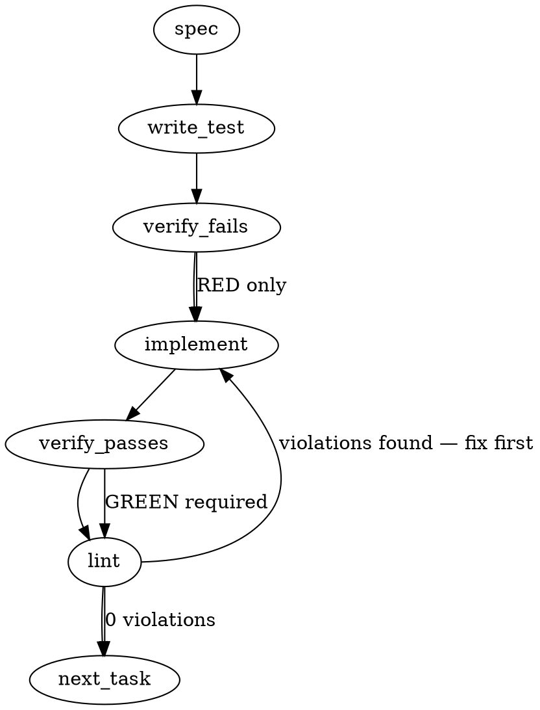

### Problem Statement

The managed signon process on hook-less vehicles prematurely performs repository orientation and knowledge searches before verifying its assigned seat. This sequence leaks live repository details during blind classification rounds, requiring a strict reorganization: derive the seat first with a hard "stop-and-ask" operator fallback, prioritize checking assignments before orientation, and enforce a "kit-first" restriction for classifier sessions.

### Architectural Context

- **Lesson — Validate seat identity before crown derivation:** Step 0 must validate that `TOTEM_SELF_AGENT` matches the current session's own seat before evaluating any crown/primary markers. If the identity is foreign or invalid, the procedure must fail closed to prevent unauthorized crown decisions or shared upkeep mutations.
- **Lesson — Bypass mismatched hook material during signon:** If injected hook material identifies a seat other than the current seat during signon, the session must discard the material and fall back to a hook-less path.
- **Lesson — Refuse foreign seats during identity resolution:** A foreign seat must be refused with the resolver's own diagnostics appended to prevent incorrect unread status.
- **Lesson — Route stderr to stdout for AI session hooks:** Redirecting `stderr` to `stdout` in AI session hooks ensures that orientation banners or diagnostic output are visible in the AI's prompt context rather than being hidden in system logs.
- **Lesson — Hook stderr diagnostics use script-identifier prefix, not `[Totem Error]`:** Session-start hooks (`.claude/hooks/*.js`, `.gemini/hooks/*.js`) and hook helpers (`packages/cli/src/hooks/auto-context.ts`) must use `[<hook-name>]` (e.g., `[session-context]`) as the prefix; only explicitly-thrown `Error` objects carry the `[Totem Error]` prefix. They must catch errors, log degradation diagnostics, and exit with code 0 to ensure resilient continuation.

### Files to Examine

1. `packages/cli/src/commands/mail.ts` — The entrypoint for the `totem mail` CLI command where the `--derive-seat` command line option and identity resolution must be integrated.
2. `packages/cli/src/commands/seat.ts` — Contains seat resolution utilities and the birth checklist; review to find helper functions for retrieving the list of valid seats hosted in this repository.
3. `.claude/skills/signon/SKILL.md` — The Claude-facing managed signon skill file defining startup actions.
4. `.agents/skills/signon/SKILL.md` — The twin surface skill file loaded by non-Claude vehicles that must be kept in perfect parity.
5. `packages/cli/src/commands/doctor-parity.ts` (or similar doctor commands) — Code governing parity validation across distributed skills to verify how skills are checked.
6. `.claude/hooks/SessionStart.cjs` & `.gemini/hooks/SessionStart.js` — The hooks running at session initialization that inject live state; they must honor the suppression knob.

### Technical Approach & Contracts

#### 1. CLI Identity Derivation Contract

In `packages/cli/src/commands/mail.ts`, implement `--derive-seat` under `MailCommandOptions`:

```typescript
export interface MailCommandOptions {
  // ... existing options
  deriveSeat?: boolean;
}
```

When `--derive-seat` is invoked:

1. Retrieve `process.env.TOTEM_SELF_AGENT`.
2. Scan the repository to determine the valid hosted seats (e.g., reading subdirectories in `.handoff/` or utilizing seat config lists in `packages/cli/src/commands/seat.ts`).
3. If `TOTEM_SELF_AGENT` is not set:
   - Print a refusal message to `stderr` with the exact list of valid seats hosted in this repository.
   - Throw a `TotemError` with code `IDENTITY_UNKNOWN` and exit with code 2 or 4. Do not guess or fall back to the crown.
4. If `TOTEM_SELF_AGENT` is set:
   - If the seat is not in the list of valid hosted seats, print the refusal message with the list of valid seats and throw a `TotemError` with code `IDENTITY_INVALID`.
   - If the seat is valid, print the derived seat name directly to `stdout`.

#### 2. Skill Flow Restructuring

Update the skill markdown template constants in `.claude/skills/signon/SKILL.md` and `.agents/skills/signon/SKILL.md`:

- **Step 0: Seat Derivation**
  - Verify `TOTEM_SELF_AGENT` is set and valid.
  - If not set, STOP and wait for the operator. Print a one-line failure: `Failure Mode: Hook-less session launched without TOTEM_SELF_AGENT set.`
- **Step 1: Assignment Mail Before Orientation**
  - Run `totem mail --derive-seat` and `totem mail` before `totem orient`, journal reads, or knowledge searches.
  - Parse the assignment subject and `expected-action`. If it indicates a `BLIND` round (the kit template's marker), declare the session as a classifier session, bypass orientation, bypass journal reads, and skip to reading the kit.
- **Step 2: Kit-First Enforcement**
  - Statically define the order: classifier sessions read _only_ the kit and the artifact named by the kit.
  - If any signon step executed before reading the kit, the session must report this exposure immediately to the round's bus via directed mail and cease classification.

#### 3. SessionStart Hook Suppression Knob

In `.claude/hooks/SessionStart.cjs` and `.gemini/hooks/SessionStart.js`:

- Check for `process.env.TOTEM_CLASSIFIER_SESSION === 'true'` or `process.env.TOTEM_BLIND_ROUND === 'true'`.
- If set, immediately skip all live state injections, repository orientation additions, and journal loads.
- Ensure all inner error catching uses `process.stderr.write` with the `[session-context]` or hook name prefix and exits with code 0.

---

### Edge Cases & Traps

- **Implicit Identity Adoption (Crown Fallback):** Never let the CLI fall back to a default seat (like `strategy-claude`) or guess based on the parent folder or git branch if `TOTEM_SELF_AGENT` is missing on hook-less environments.
- **Character-for-Character Parity:** Both `.claude/skills/signon/SKILL.md` and `.agents/skills/signon/SKILL.md` must contain identical signon content. Any divergence will trigger parity check failures in the doctor tool.
- **Resilient Continuation in Hooks:** Session-start hooks must never throw unhandled errors to the top level that crash session boot. They must handle all issues gracefully, log to `stderr` with the prefix, and exit with `0`.

---

### Implementation Tasks

- [ ] **Task 1: Add `--derive-seat` to CLI Mail Command**
  - Modify `packages/cli/src/commands/mail.ts` to add the `--derive-seat` option.
  - Implement the logic to scan hosted seats (using existing seat config or scanning `.handoff/` directories).
  - Add logic to validate `process.env.TOTEM_SELF_AGENT` against this list, throwing a `TotemError` listing valid seats on failure.
    > TOTEM INVARIANT (Validate seat identity before crown derivation): Step 0 must validate that TOTEM_SELF_AGENT matches the current session's own seat before evaluating any crown/primary markers.
    > TEST DIRECTIVE: Before implementing, write a failing test named `should_refuse_mail_polling_for_unhosted_or_missing_seats` that asserts a TotemError is thrown with a list of hosted seats when `TOTEM_SELF_AGENT` is unset or invalid.
  - Write test → verify fails → implement → verify passes → lint.

- [ ] **Task 2: Refactor SessionStart Hooks with Suppression Knob**
  - Modify `.claude/hooks/SessionStart.cjs` and `.gemini/hooks/SessionStart.js`.
  - Add check for `process.env.TOTEM_CLASSIFIER_SESSION === 'true'` or `process.env.TOTEM_BLIND_ROUND === 'true'`. If true, bypass all state, issue, and journal injections.
    > TOTEM INVARIANT (Hook stderr diagnostics use script-identifier prefix): Session-start hooks must catch inner errors, write to process.stderr with a `[session-context]` prefix, and exit with code 0 to ensure resilient boot.
  - Update tests to verify hook behavior under suppression mode.
  - Write test → verify fails → implement → verify passes → lint.

- [ ] **Task 3: Update Managed Claude Signon Skill**
  - Modify `.claude/skills/signon/SKILL.md` to restructure the signon steps.
  - Rewrite Step 0 to enforce strict seat derivation.
  - Rewrite Step 1 to enforce mail polling prior to orientation on hook-less seats.
  - Rewrite Step 2 to enforce kit-first behaviors for classifier sessions.
  - Write test → verify fails → implement → verify passes → lint.

- [ ] **Task 4: Sync Parity to Twin Agent Skill**
  - Modify `.agents/skills/signon/SKILL.md` to replicate the exact steps and markdown modifications made to the Claude skill.
  - Run the `doctor-parity` or `agents-skills-lock` test suite to confirm complete alignment between the twin surfaces.
  - Write test → verify fails → implement → verify passes → lint.

---

### Execution Flow



---

### Verification

Every implementation MUST end with these steps:

1. `totem lint` — deterministic rule check (zero LLM, ~2s). Fixes any violations.
2. `totem review` — supplementary AI lanes over the diff (~18s, advisory). Address critical findings; your team's review discipline decides the review of record.
3. If using MCP, call `verify_execution` to confirm compliance before declaring the task done.

---

### Test Plan

- **Seat Derivation CLI Tests:**
  - Test `totem mail --derive-seat` with `TOTEM_SELF_AGENT` unset: Verify exit code and verify stdout/stderr contains the list of valid seats.
  - Test `totem mail --derive-seat` with a foreign seat: Verify refusal list is emitted.
  - Test `totem mail --derive-seat` with a valid hosted seat: Verify seat name is printed to stdout and command exits with 0.
- **Hook Suppression Tests:**
  - Execute SessionStart hooks with `TOTEM_CLASSIFIER_SESSION=true` and mock environments: Verify zero journals or active repository issues are appended, and the hook exits with 0.
- **Parity Integration Tests:**
  - Run parity check commands to guarantee `.claude/skills/signon/SKILL.md` and `.agents/skills/signon/SKILL.md` are identical within their managed blocks.

## Implementation Design

<!-- totem-context: drafted by totem-claude 2026-09-07 at the preflight's Phase 3, on the charter (mmnto-ai/totem#2801), its two comments (the override-class correction and the managed-hook datum), the mmnto-ai/totem#2204 identity gate, the resolver in packages/cli/src/commands/mail.ts (resolveSelfAgents) and the distributed-skill parity tests. Where the generated spec above disagrees with the shipped code, this section wins and says so: there is no `.handoff/` surface to scan (the substrate is a frozen archive), and no `TOTEM_CLASSIFIER_SESSION` knob exists — see the open questions. -->

### Scope (2 sentences)

Changes the managed signon constant (`SIGNON_SKILL_CONTENT` in `packages/cli/src/commands/init-templates.ts`, re-rendered to `.claude/skills/signon/SKILL.md` and `.agents/skills/signon/SKILL.md`) to open with a derive-the-seat step (read the inherited `TOTEM_SELF_AGENT` first; set → use it and never write a different one; empty → STOP and ask, one-line failure mode), to place the seat-anchored mail poll before orient, journal and search on hook-less seats with a BLIND-kit dispatch ending signon, and to state the kit-first rule; and adds `totem mail --derive-seat`, which prints the resolved seat and its source, or refuses with the list of seats this repo hosts (exit 2) when the env is empty or names an unhosted seat. It does NOT attempt a wrong-single-identity detector (env is an operator declaration — out of reach), does NOT change the mmnto-ai/totem#2204 gate, does NOT scan the retired substrate, and does NOT grow the managed SessionStart hook (open question 1).

### Data model deltas

- `MailCommandOptions.deriveSeat?: boolean`. Read by the mail command's option parser; when set, the command short-circuits before any poll: it calls `resolveSelfAgents(repoRoot, env)` and prints exactly one line `seat=<id> source=<env|config|dir>` when the resolution is a single seat that `env` supplied and this repo hosts; otherwise a refusal on stderr naming the supplied value (or "unset") and every seat this repo hosts, exit 2. No fallback to any seat, ever.
- The skill constant grows three steps (0, 1, 2) as prose; the existing step numbering shifts. The three distributed surfaces are byte-locked to the constant by the existing parity tests, which are extended with string locks on the new clauses ("never write a different one", the one-line failure mode, "kit-first").
- No new state container, no new file, no new env var.

### State lifecycle

Per-invocation. `--derive-seat` reads env and the repo's `.totem/orchestration/config.json` `host_agents` plus seat directories (the resolver's existing sources), prints, exits. The skill text is static.

### Failure modes

| Failure                                                                                      | Category              | Agent-facing surface                                                                                                   | Recovery                                                   |
| -------------------------------------------------------------------------------------------- | --------------------- | ---------------------------------------------------------------------------------------------------------------------- | ---------------------------------------------------------- |
| env unset, repo hosts N ≥ 1 seats                                                            | init                  | refusal on stderr listing the N seats, exit 2; the skill's step 0 then says STOP and ask the operator                  | operator sets per-shell `TOTEM_SELF_AGENT`                 |
| env names a seat this repo does not host                                                     | init                  | refusal naming the supplied value and the hosted list, exit 2                                                          | fix the env                                                |
| env names a hosted seat                                                                      | ok                    | one stdout line, exit 0                                                                                                | none                                                       |
| repo hosts no seat (no config, no dirs)                                                      | init                  | refusal "this repo hosts no seat — `totem seat add`", exit 2                                                           | `totem seat add`                                           |
| a session writes a per-command seat DIFFERENT from an inherited one (the correction's class) | runtime (instruction) | the skill's step 0 names it as the incident class in one line; the tool cannot see the inherited value once overridden | the operator's account is the witness; the session re-arms |
| hook-less classifier session ran orient or a search before its kit                           | runtime (instruction) | step 2: declare by directed mail to the round's bus, do not classify                                                   | re-arm in a fresh session                                  |
| Claude seat: a SessionStart hook injects a journal or mail before the skill runs             | design                | not curable by text; open question 1                                                                                   | —                                                          |

No silent path: every refusal is on stderr with exit 2; the success line is on stdout for scripting.

### Invariants to lock in via tests

- With env unset in a repo hosting two seats, `--derive-seat` exits 2 and its stderr names both seats and neither appears on stdout.
- With env set to a hosted seat, stdout is exactly one line naming that seat and `source=env`; exit 0.
- With env set to an unhosted seat, exit 2; stderr contains the supplied value and the hosted list.
- `--derive-seat` never reads an outbox or a processed dir (a spy on the poll path stays uncalled).
- The three signon surfaces equal the constant byte-for-byte (existing parity tests) and the constant contains the step-0 failure-mode line, the "never write a different one" clause, "assignment mail before orient", and "kit-first" (string locks that fail on the current text).
- `--as <seat>` and `--derive-seat` together are contradictory (exit 2, like `--as` with `--all-seats`).

### Open questions

- **Question:** The managed SessionStart hook (the 2026-09-07T03:40Z datum on the issue): should it grow journal + mail injection, or should the skill stop saying "may" and name the two blocks it can rely on? **Options:** (a) grow the managed hook (describe + orient + latest journal + seat-anchored mail) behind a suppression knob for classifier sessions — injected material cannot be retracted, so the knob must exist before the injection does; (b) the skill names exactly what the managed hook injects (describe, orient --session) and derives journal + mail by hand on every seat, matching the datum. **Recommendation:** (b) in this build; (a) as its own issue with the knob designed first.
- **Question:** Verb home. **Options:** `totem mail --derive-seat` (the mmnto-ai/totem-strategy#956 ask) or a new `totem seat whoami`. **Recommendation:** `--derive-seat` as asked, implemented as one call into the resolver `totem seat` already uses, so a `whoami` alias later is one line.
- **Resolved (strategy-claude, 2026-09-07T18:40Z, by directed mail):** the BLIND-kit marker is the dispatch SUBJECT's literal prefix `BLIND round: `, followed by the round's name and, in the same subject, the deposit clause `— deposit to <orchestrator-seat> by <ISO-8601 deadline>`; no frontmatter key carries it and the kits manifest is BLIND-safe by construction. A round is in flight while a dispatch with that prefix has an unpassed deadline and no deposit received. The signon text quotes the prefix and the deadline grammar verbatim. Making it a sensed frontmatter key (rather than a parsed subject) is a separate mechanism ask for totem's lane, not this build.
- **Question:** AGENTS.md's "search_knowledge before scoping" fires before step 1 on a vehicle that reads top-down. **Options:** a sentence in totem's AGENTS.md Session Start Protocol subordinating every search to signon step 0 on hook-less seats; or leave it to the skill. **Recommendation:** the sentence — totem's AGENTS.md is this seat's lane; the cohort default is strategy's.
