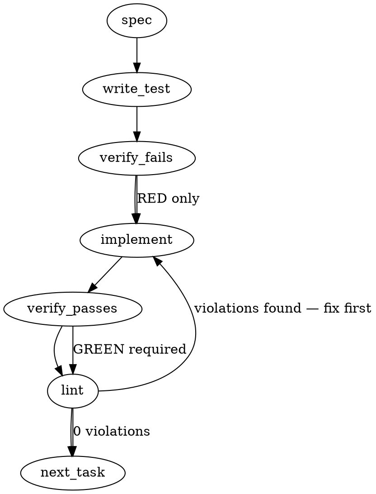

### Problem Statement

A deterministic, zero-LLM CLI command `totem review-reply resolve-threads` must be introduced to fetch, analyze, and resolve bot-generated GitHub PR review threads. To satisfy the merge-ready gate's strict predicate 2 without silencing unresolved issues, this command must identify open bot threads, verify they contain at least one human reply, print their evaluation statuses, and conditionally resolve them via GitHub GraphQL mutations (dry-run by default).

### Architectural Context

- **Merge-Ready Gate (mmnto-ai/totem#2800)**: Predicate 2 mandates that no unresolved, non-outdated bot review threads remain open before a PR is merged.
- **Bot Identities (`BOT_REVIEWER_IDENTITIES`)**: To target only bot-authored threads, the filter must leverage the single source of truth for bot reviewer logins defined in core.
- **Lesson — Do not filter out non-bot comments before grouping findings**: Human comments must be retained within the comment nodes of the GraphQL response to determine if a thread contains a human reply. Filtering out human comments too early would make it impossible to evaluate the "never resolve a thread without a human reply" invariant.

### Files to Examine

- `packages/cli/src/commands/spine-review-thread-source.ts` — Contains the GraphQL client integration and queries for review threads.
- `packages/core/src/constants.ts` (or the equivalent core module exposing bot logins) — Contains `BOT_REVIEWER_IDENTITIES`.
- `packages/cli/src/commands/review-reply.ts` — Entry point for the `review-reply` CLI command family where the command logic must be registered.
- `packages/cli/src/commands/init-templates.ts` — Contains the inline template for `.claude/skills/review-reply/SKILL.md` which must be updated to reference the new verb.
- `packages/cli/src/commands/triage-pr.ts` — The triage inbox system which links thread IDs to finding numbers.

### Technical Approach & Contracts

We will implement a deterministic GraphQL query and mutation suite inside the CLI module to handle review thread inspection and resolution.

#### 1. Data Contracts

We define the Zod schemas and TypeScript interfaces for the GitHub GraphQL thread queries and mutations:

```typescript
import { z } from 'zod';

export const GraphQLCommentAuthorSchema = z
  .object({
    login: z.string(),
  })
  .nullable();

export const GraphQLReviewCommentSchema = z.object({
  id: z.string(),
  body: z.string(),
  author: GraphQLCommentAuthorSchema,
});

export const GraphQLReviewThreadSchema = z.object({
  id: z.string(),
  isResolved: z.boolean(),
  isOutdated: z.boolean(),
  comments: z.object({
    nodes: z.array(GraphQLReviewCommentSchema),
  }),
});

export const GraphQLPullRequestReviewThreadsResponseSchema = z.object({
  repository: z.object({
    pullRequest: z.object({
      reviewThreads: z.object({
        nodes: z.array(GraphQLReviewThreadSchema),
      }),
    }),
  }),
});

export type GraphQLReviewThread = z.infer<typeof GraphQLReviewThreadSchema>;
```

#### 2. Sequence Logic

1. **Information Gathering**: Get the current PR owner, repository, and PR number. Use `getGitBranch` and fallback configurations or explicit CLI overrides.
2. **Fetch Threads**: Execute the `GetReviewThreads` query.
3. **Analyze Threads**:
   - For each thread, verify if `comments.nodes[0].author.login` is contained in `BOT_REVIEWER_IDENTITIES`.
   - Identify if `isResolved` is already `true` or `isOutdated` is `true`.
   - Scan `comments.nodes.slice(1)` (all replies) to see if any comment has an `author` login that is _not_ in `BOT_REVIEWER_IDENTITIES` (and is not null).
4. **Resolution Strategy**:
   - Classify each thread into one of four buckets:
     1. `RESOLVED`: Already resolved (Skip).
     2. `OUTDATED`: Outdated thread (Skip).
     3. `NEEDS_REPLY`: Bot thread, unresolved, but has NO human replies (Skip & Log: "needs a reply first").
     4. `ELIGIBLE`: Bot thread, unresolved, and has at least one human reply (Target for Resolution).
5. **Mutation Execution**:
   - If `--apply` is specified, iterate over `ELIGIBLE` threads and invoke the `resolveReviewThread` mutation sequentially.
   - If `--apply` is omitted (dry-run mode), log the actions that would be taken without modifying state.

### Edge Cases & Traps

1. **Deleted Accounts / Null Authors**: When a GitHub account is deleted, the `author` field in comments can return `null`. The code must handle `comment.author === null` gracefully without throwing runtime errors. A null author must not be classified as a valid bot identity.
2. **Sub-comment Ordering**: GitHub's API returns comment nodes in chronological order. We must assume the node at index `0` represents the root comment (the bot finding). If index `0` is not the bot (e.g. some race condition or manually grouped thread), do not attempt to process it as a bot thread.
3. **Filtering by Thread ID or Finding Number**: When filtered by finding number (from `totem triage-pr`), we must match finding indices to their respective threads. Finding indices are 1-based lists generated by the inbox. The mapping logic must align perfectly with the numbering shown in `totem triage-pr`.
4. **Error Resilience**: If a single GraphQL mutation fails (due to permissions, network blip, or concurrent manual resolution), the command must log the failure for that specific thread and continue processing remaining threads rather than terminating the process immediately.

### Implementation Tasks

- [ ] **Task 1: Extend GraphQL Schemas and Client**
      Define the Zod schemas for query results and mutations in a shared CLI models module or directly in `spine-review-thread-source.ts`.

  > TEST DIRECTIVE: Before implementing, write a failing test named `rejectsMalformattedGraphQLThreads` that verifies the Zod schema fails to parse payloads containing invalid or malformed comment author records.
  - Implement Zod schemas and export TypeScript interfaces for `GraphQLReviewThread` and its children.
  - Expose a method to query threads from the GraphQL API.
  - write test → verify fails → implement → verify passes → lint

- [ ] **Task 2: Implement Thread Evaluation Logic**
      Write a pure, deterministic function `classifyReviewThreads` that groups threads into `RESOLVED`, `OUTDATED`, `NEEDS_REPLY`, and `ELIGIBLE`.

  > TOTEM INVARIANT (Do not filter out non-bot comments before grouping findings): Ensure the entire comment array is preserved during classification, as we must inspect subsequent human comments to verify reply presence.
  > TEST DIRECTIVE: Before implementing, write a failing test named `correctlyClassifiesVaryingThreadStatus` with fixtures containing: a bot thread with human replies, a bot thread with only bot replies, a bot thread with no replies, and a human-authored thread.
  - Implement the classifier verifying bot identity match via `BOT_REVIEWER_IDENTITIES`.
  - Ensure null authors do not throw and are treated as non-bot.
  - write test → verify fails → implement → verify passes → lint

- [ ] **Task 3: Implement Mutation & Dry Run Support**
      Implement the execution phase which processes the classified threads.
  - Implement a helper to execute the `resolveReviewThread` GraphQL mutation.
  - Implement output formatting logic to print exactly one status line per thread (e.g., `[RESOLVED] Thread #xyz`, `[SKIPPED: NO HUMAN REPLY] Thread #abc`).
  - Restrict mutation calls unless `--apply` is explicitly passed.
  - write test (with dry-run and apply assertions) → verify fails → implement → verify passes → lint

- [ ] **Task 4: CLI Integration and Option Parsing**
      Register the new action or options in `packages/cli/src/commands/review-reply.ts`.
  - Add the `resolve-threads` command option.
  - Implement `--apply`, `--thread <id>`, and `--finding <number>` flag handlers.
  - Map finding numbers using the structural index mapping from the triage inbox.
  - write test (or update existing cli routing tests) → verify fails → implement → verify passes → lint

- [ ] **Task 5: Skill Template Update**
      Add instructions to the `review-reply` skill template.
  - Open `packages/cli/src/commands/init-templates.ts` and locate `.claude/skills/review-reply/SKILL.md`.
  - Update the template text to specify that the final step of the disposition process is executing the `totem review-reply resolve-threads` command, and that it requires the explicit operator confirmation before applying changes.
  - write test (verifying that template output contains the command instruction) → verify fails → implement → verify passes → lint

### Execution Flow



### Verification (MANDATORY — do not skip)

Every implementation MUST end with these steps:

1. `totem lint` — deterministic rule check (zero LLM, ~2s). Fixes any violations.
2. `totem review` — supplementary AI lanes over the diff (~18s, advisory). Address critical findings; your team's review discipline decides the review of record.
3. If using MCP, call `verify_execution` to confirm compliance before declaring the task done.

### Test Plan

#### Automated Unit & Integration Tests

- **Parsing/Validation Tests**: Feed the Zod parser raw JSON payloads from real GitHub API outputs to ensure correct structural verification.
- **Classification Engine Tests**: Pass mocked threads to verify each scenario is properly triaged:
  - Open bot thread + human reply = `ELIGIBLE`
  - Open bot thread + no human reply = `NEEDS_REPLY`
  - Open bot thread + only bot replies = `NEEDS_REPLY`
  - Open human thread + human reply = Not bot-authored (ignored)
  - Resolved bot thread + human reply = `RESOLVED`
  - Outdated bot thread + human reply = `OUTDATED`
- **CLI Command Routing Tests**: Verify options are correctly targeted and the default mode behaves strictly as a dry-run.

#### Manual Verification Plan

- Run `totem review-reply resolve-threads` on a local development branch to confirm it reports expected thread lists in dry-run mode.
- Execute with `--apply` under a mock/sandbox repository state to verify mutations successfully dispatch to the mock GitHub GraphQL endpoint.

## Implementation Design

<!-- totem-context: drafted by totem-claude 2026-09-08 at the preflight's Phase 3, on the issue (mmnto-ai/totem#2841), the merge-ready charter and build (mmnto-ai/totem#2800: predicate 2 and BOT_REVIEWER_IDENTITIES in core), doctrine bot-protocols § 8.1 (the decline taxonomy; GCA is answered at the PR level, never in-thread; ghcq has no listener, mmnto-ai/totem#2626), the review-reply managed skill constant (REVIEW_REPLY_SKILL_CONTENT in packages/cli/src/commands/init-templates.ts), the triage-pr inbox (REST comment ids, rootCommentId on each finding) and the existing GraphQL reviewThreads reader (packages/cli/src/commands/spine-review-thread-source.ts, injectable exec seam). Where the generated spec above disagrees with a shipped contract, this section wins and says so. -->

**Where the generated spec above disagrees with shipped contracts, and which wins:** (1) there is no `packages/cli/src/commands/review-reply.ts` — review-reply is a managed SKILL (`REVIEW_REPLY_SKILL_CONTENT`), not a command family; the verb is a new command module `resolve-threads.ts` wired in `packages/cli/src/index.ts`. (2) `BOT_REVIEWER_IDENTITIES` lives in `packages/core/src/bot-identity.ts` (mmnto-ai/totem#2800), not a constants file. (3) The spec's evidence rule (an in-thread human reply only) would make every GCA thread unresolvable, because bot-protocols forbids replying to GCA in-thread; the evidence rule below admits a later human PR-level comment. (4) The spec's `--thread` / `--finding` selection flags are replaced by the selection rule in the open questions (resolve every evidenced bot thread by default; ids optional). (5) `comments.nodes[0]` as the root holds, but the read must be paginated and its failure is a hard error, not a partial list.

### Scope (2 sentences)

Adds `totem resolve-threads <pr>` — a zero-LLM CLI verb that reads a PR's review threads through GraphQL, selects the unresolved, non-outdated threads rooted by a review-bot identity that carry disposition evidence, and resolves them through the `resolveReviewThread` mutation, dry-run by default and mutating only under `--apply` — and adds the corresponding step to the review-reply skill's `done` flow (operator-gated like every other mutation there). It does NOT change any merge-ready predicate, does NOT resolve a thread without evidence, does NOT reply to anything, does NOT touch `triage-pr`'s read path, and does NOT install or arm the gate.

### Data model deltas

- `ReviewThreadRecord` (cli, module-local, read-only): `{ id: string /* GraphQL PRRT_… node id */, rootCommentId: number /* PullRequestReviewComment.databaseId of the first comment — the REST id triage-pr's findings carry as rootCommentId */, rootAuthor: string, rootCreatedAt: string, isResolved: boolean, isOutdated: boolean, path: string, humanReplyCount: number }`. Written by the reader from one paginated GraphQL query (`reviewThreads(first: 100, after:)` with `comments(first: 100)` carrying `databaseId`, `author { login }`, `createdAt`); read by the selector. Invariant: every thread on the PR is present or the read is `unevaluable` (a `hasNextPage` the pagination could not follow is a failed read, never a shorter list — the spine reader's no-silent-shrink rule).
- `DispositionEvidence` (module-local): `'in-thread-reply' | 'pr-level-disposition' | 'none'`. Derived per thread: `in-thread-reply` when any comment after the root has a non-bot author; `pr-level-disposition` when any non-bot PR issue comment has `createdAt` later than the thread's root (the round-disposition comment — the only lawful answer to a GCA thread, and the practiced answer to every round); `none` otherwise. The PR issue comments come from the existing `GitHubCliPrAdapter.fetchIssueComments` (REST, `[bot]` suffix preserved).
- `ResolveThreadsPlan` (module-local, printed): one row per bot-rooted thread `{ thread: ReviewThreadRecord, evidence, verdict: 'resolve' | 'skip:already-resolved' | 'skip:outdated' | 'skip:no-evidence' | 'skip:not-selected' }`. Written once by the selector; read by the printer and, under `--apply`, by the mutator. Bounded by the thread count.
- Bot identity: `BOT_REVIEWER_IDENTITIES` from core once mmnto-ai/totem#2800 has merged (the single definition; its `loginExact` list is the GraphQL spelling without `[bot]`); until then the parser's `isBotComment`. The build lands after mmnto-ai/totem#2800, so the design assumes core's list and names the fallback only so a rebase order change is not a redesign.
- Options: `ResolveThreadsOptions = { apply?: boolean; ids?: string /* comma list of REST root comment ids OR triage inbox numbers prefixed with # */; json?: boolean }`. No config field, no env var, no new file.

### State lifecycle

Per-invocation. Read (threads, issue comments) → plan → print → optionally mutate one thread at a time, printing each result as it returns. No cache, no ledger, no on-disk write. The mutation is idempotent on GitHub's side (resolving a resolved thread is a no-op), so a partial run re-run converges.

### Failure modes

| Failure                                                      | Category  | Agent-facing surface                                                                                                                                                                                              | Recovery                                        |
| ------------------------------------------------------------ | --------- | ----------------------------------------------------------------------------------------------------------------------------------------------------------------------------------------------------------------- | ----------------------------------------------- |
| `gh` absent or unauthenticated                               | init      | hard error, exit 1, names the cure                                                                                                                                                                                | `gh auth login`                                 |
| PR not found / no access                                     | init      | hard error, exit 1                                                                                                                                                                                                | fix the number or the repo                      |
| GraphQL read fails, times out, or `hasNextPage` past the cap | transient | hard error "threads NOT read — nothing resolved", exit 1; never a shorter list                                                                                                                                    | retry                                           |
| issue-comment read fails                                     | transient | hard error, exit 1 (evidence cannot be derived, so no thread may be resolved)                                                                                                                                     | retry                                           |
| a selected id matches no bot-rooted thread                   | runtime   | one line naming it, exit 2, nothing resolved (a typo must not silently narrow the batch)                                                                                                                          | fix the ids                                     |
| a thread has no evidence                                     | runtime   | `skip:no-evidence` row naming the thread and the two ways to give it evidence; exit 0 on dry-run, exit 2 under `--apply` when ANY selected thread was skipped for this reason (the run did not do what was asked) | reply in-thread or post the disposition, re-run |
| mutation fails on one thread                                 | transient | the row prints the error; the run continues to the next thread; exit 2 at the end naming the count                                                                                                                | re-run (idempotent)                             |
| zero bot-rooted threads                                      | runtime   | one line "nothing to resolve", exit 0                                                                                                                                                                             | none                                            |
| `--apply` without a TTY                                      | runtime   | allowed (the skill drives it non-interactively on the operator's go); the plan is printed first regardless                                                                                                        | none                                            |

No row is silent: every skipped thread is a printed row with its reason, and `--json` carries the same rows for a script.

### Invariants to lock in via tests

- A thread with no human reply and no later human PR-level comment is never resolved, under any flag.
- A thread rooted by a human is never a candidate, whatever its state.
- A resolved or outdated thread is reported and never mutated.
- Dry-run performs zero mutations (the exec spy records only reads); `--apply` performs exactly one `resolveReviewThread` call per `resolve` row and none for any skip row.
- A `hasNextPage` the reader cannot follow yields a hard error, never a partial plan.
- An unmatched `--ids` entry aborts before any mutation.
- The GCA case: a thread with no in-thread reply and a later human PR-level comment resolves (evidence `pr-level-disposition`); the same thread with the PR-level comment EARLIER than the root does not.
- Under `--apply`, a selected `skip:no-evidence` row makes the exit code 2 after the other rows were applied.
- The review-reply skill's three distributed surfaces stay byte-locked to the constant and the constant carries the new `done` step's string locks (`totem resolve-threads`, `--apply`, "on the operator's explicit go").
- The verb never posts a comment or a review (the exec spy sees no `pr comment`, no `replies` endpoint, no `reviews` POST).

### Open questions

- **Question:** Verb shape. **Options:** (a) a new `totem resolve-threads <pr>` verb; (b) `totem triage-pr <pr> --resolve`. **Recommendation:** (a) — `triage-pr` is the read inbox and its interactive mode already carries enough mutation; a separate verb keeps dry-run-by-default and `--apply` unambiguous and gives the skill one command to name.
- **Question:** Evidence rule for a decline. **Options:** (a) in-thread human reply OR a later human PR-level comment (either suffices); (b) in-thread reply only, with GCA threads exempted because the protocol forbids replying to them; (c) require both. **Recommendation:** (a) — one rule for every bot, matching the practiced routine (the round disposition is a PR-level comment posted after the round's threads); (b) special-cases a bot and (c) blocks the practiced routine.
- **Question:** Where the skill step sits. **Options:** (a) inside `done`, after the disposition comment posts, as the last operator-gated step; (b) a separate `resolve` command word in the skill. **Recommendation:** (a) — the disposition comment IS the evidence the verb reads, so the order is forced, and one more command word is one more thing to forget.
- **Question:** Selection by inbox number. **Options:** (a) accept `#N` inbox numbers by re-running the triage dedup to map N → rootCommentId; (b) REST comment ids only, and print them beside each row so the operator can copy them; (c) resolve every evidenced bot thread when no `--ids` is given, and support ids only. **Recommendation:** (c) with (b)'s printed ids — the routine resolves the round, not a subset, and the inbox numbering is not stable across re-runs.
